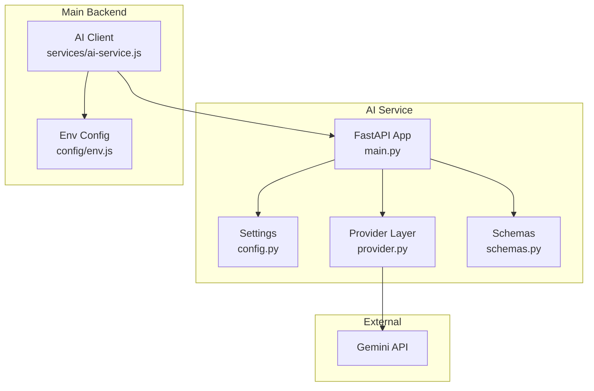
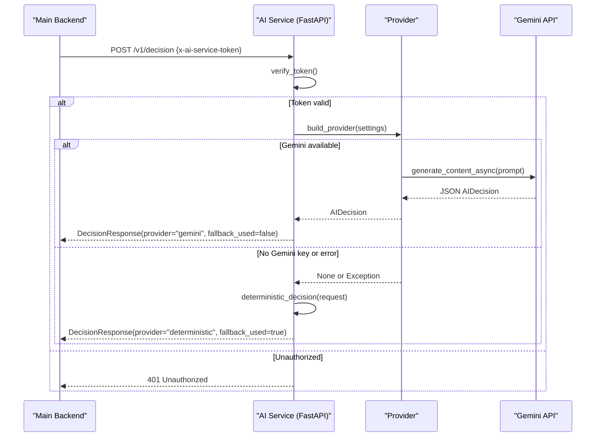
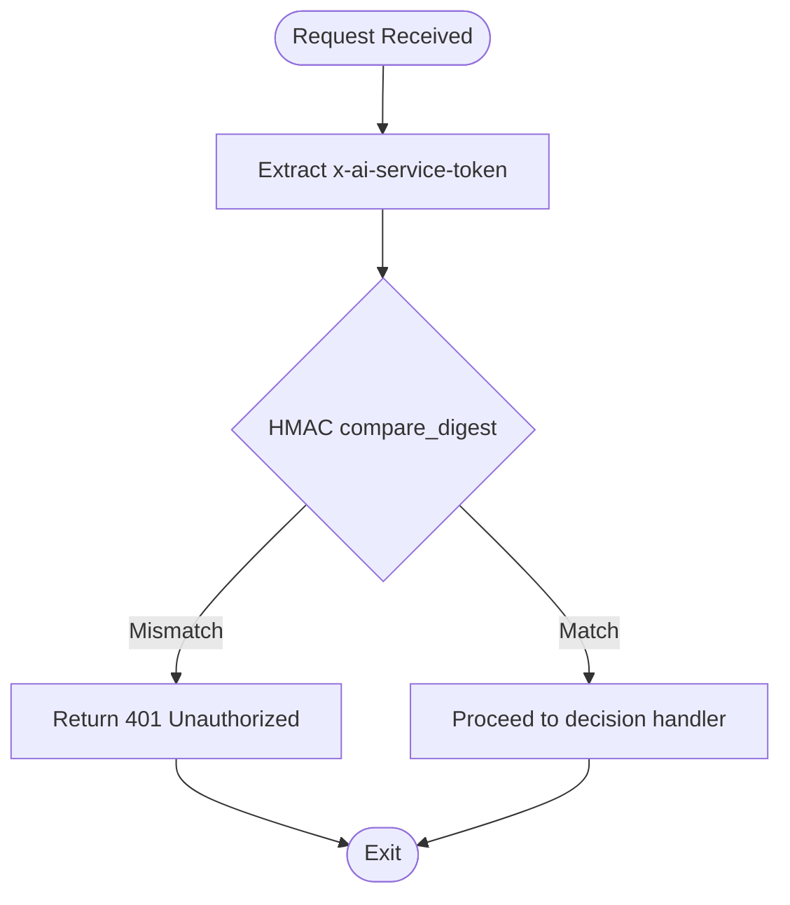
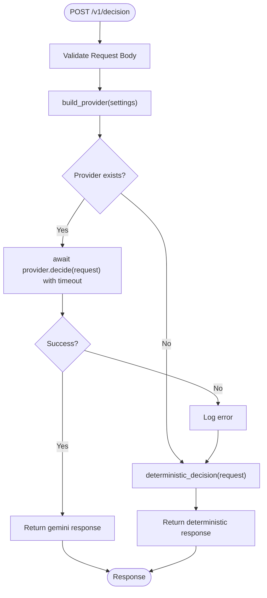
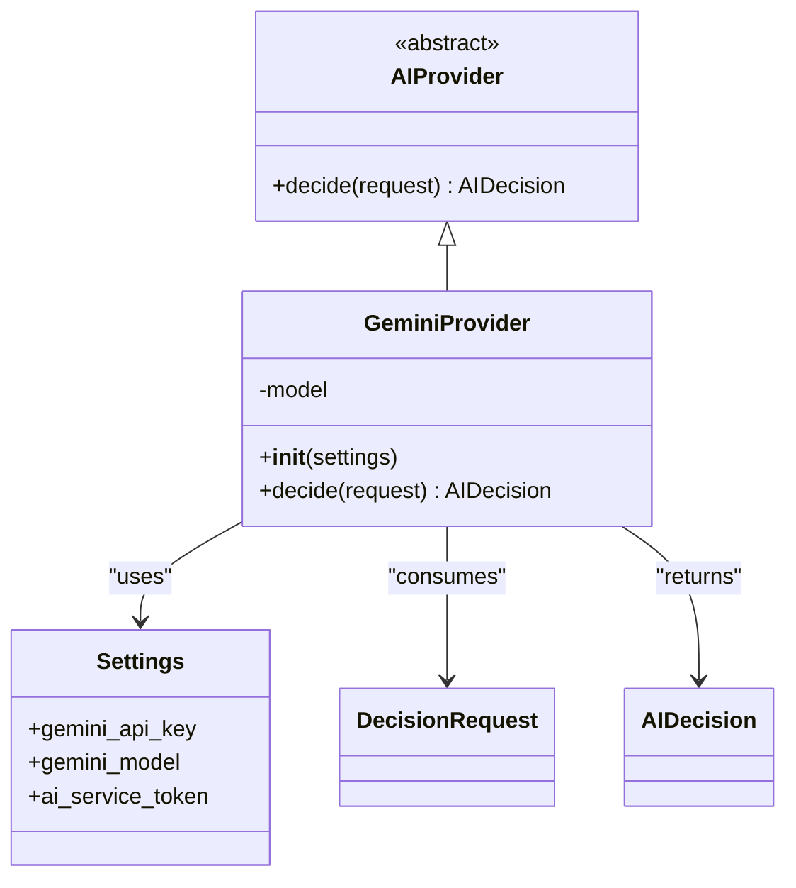
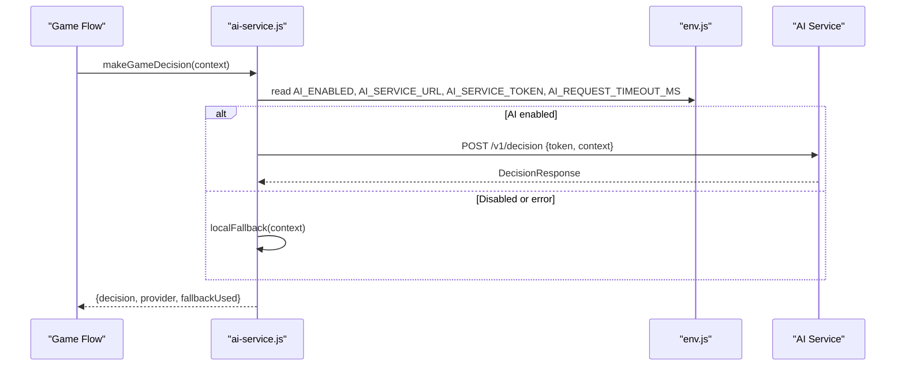
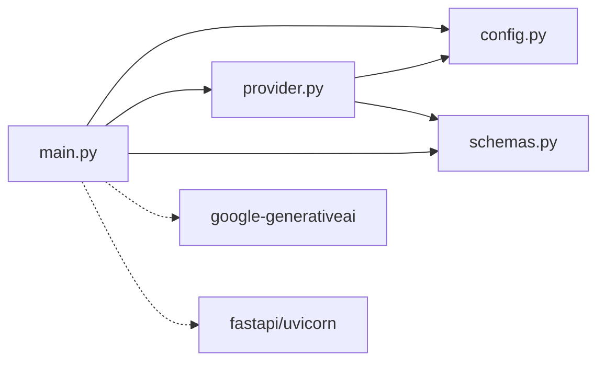

# AI Service Architecture

<cite>
**Referenced Files in This Document**
- [main.py](file://backend/ai-service/app/main.py)
- [config.py](file://backend/ai-service/app/config.py)
- [provider.py](file://backend/ai-service/app/provider.py)
- [schemas.py](file://backend/ai-service/app/schemas.py)
- [Dockerfile](file://backend/ai-service/Dockerfile)
- [requirements.txt](file://backend/ai-service/requirements.txt)
- [ai-service.js](file://backend/services/ai-service.js)
- [env.js](file://backend/config/env.js)
- [error-handler.js](file://backend/middleware/error-handler.js)
- [logger.js](file://backend/config/logger.js)
- [docker-compose.yml](file://docker-compose.yml)
</cite>

## Table of Contents
1. [Introduction](#introduction)
2. [Project Structure](#project-structure)
3. [Core Components](#core-components)
4. [Architecture Overview](#architecture-overview)
5. [Detailed Component Analysis](#detailed-component-analysis)
6. [Dependency Analysis](#dependency-analysis)
7. [Performance Considerations](#performance-considerations)
8. [Troubleshooting Guide](#troubleshooting-guide)
9. [Conclusion](#conclusion)
10. [Appendices](#appendices)

## Introduction
This document describes the architecture and operational details of the AI service microservice that powers intelligent decisions for the LifeGuide game. The service is built with FastAPI, exposes a secure decision endpoint protected by HMAC-based token verification, provides health checks, and integrates with an optional Gemini provider while falling back to deterministic logic when unavailable. It is containerized via Docker and orchestrated alongside the main backend application using Docker Compose.

## Project Structure
The AI service is a small, focused Python package under backend/ai-service:
- app/main.py: FastAPI application, endpoints, authentication middleware, and request handling
- app/config.py: Settings management with environment variables and validation
- app/provider.py: Abstraction over AI providers (Gemini) and deterministic fallback
- app/schemas.py: Pydantic models for requests, responses, and domain enums
- Dockerfile: Container image definition
- requirements.txt: Python dependencies

**Diagram sources**
- [main.py:1-33](file://backend/ai-service/app/main.py#L1-L33)
- [config.py:1-24](file://backend/ai-service/app/config.py#L1-L24)
- [provider.py:1-38](file://backend/ai-service/app/provider.py#L1-L38)
- [schemas.py:1-71](file://backend/ai-service/app/schemas.py#L1-L71)
- [ai-service.js:1-51](file://backend/services/ai-service.js#L1-L51)
- [env.js:1-40](file://backend/config/env.js#L1-L40)

**Section sources**
- [main.py:1-33](file://backend/ai-service/app/main.py#L1-L33)
- [config.py:1-24](file://backend/ai-service/app/config.py#L1-L24)
- [provider.py:1-38](file://backend/ai-service/app/provider.py#L1-L38)
- [schemas.py:1-71](file://backend/ai-service/app/schemas.py#L1-L71)
- [Dockerfile:1-8](file://backend/ai-service/Dockerfile#L1-L8)
- [requirements.txt:1-6](file://backend/ai-service/requirements.txt#L1-L6)

## Core Components
- FastAPI Application: Defines endpoints, dependency injection for settings, and token verification middleware.
- Settings: Centralized configuration loaded from environment variables with validation and secret handling.
- Provider Abstraction: Pluggable AI provider interface with a concrete Gemini implementation and a deterministic fallback.
- Schemas: Strict Pydantic models defining request/response contracts and allowed actions.
- Integration Client: Main backend calls the AI service with token header and timeout handling, with local fallback on failure.

Key responsibilities:
- Secure internal communication via HMAC token verification
- Health reporting for readiness/liveness probes
- Robust error handling with automatic fallback to deterministic decisions
- Clear separation between orchestration (FastAPI) and decision logic (providers)

**Section sources**
- [main.py:14-32](file://backend/ai-service/app/main.py#L14-L32)
- [config.py:5-23](file://backend/ai-service/app/config.py#L5-L23)
- [provider.py:8-37](file://backend/ai-service/app/provider.py#L8-L37)
- [schemas.py:5-71](file://backend/ai-service/app/schemas.py#L5-L71)
- [ai-service.js:18-48](file://backend/services/ai-service.js#L18-L48)

## Architecture Overview
The AI service exposes two primary endpoints:
- GET /health: Returns status and active provider mode
- POST /v1/decision: Protected by HMAC token; returns AI-driven decisions or deterministic fallback

Request flow:
1. Main backend constructs a decision context and calls POST /v1/decision with x-ai-service-token header.
2. AI service verifies the token using HMAC comparison against configured secret.
3. If valid, it builds a provider:
   - If Gemini key is present, uses GeminiProvider.decide() with async call and timeout
   - On any exception or missing key, falls back to deterministic_decision()
4. Response includes decision payload, provider name, and fallback flag.

**Diagram sources**
- [main.py:14-32](file://backend/ai-service/app/main.py#L14-L32)
- [provider.py:18-37](file://backend/ai-service/app/provider.py#L18-L37)
- [ai-service.js:18-48](file://backend/services/ai-service.js#L18-L48)

**Section sources**
- [main.py:18-32](file://backend/ai-service/app/main.py#L18-L32)
- [provider.py:18-37](file://backend/ai-service/app/provider.py#L18-L37)
- [ai-service.js:18-48](file://backend/services/ai-service.js#L18-L48)

## Detailed Component Analysis

### Authentication and Security
- Token-based access control:
  - Header: x-ai-service-token
  - Verification: constant-time HMAC comparison against configured secret
  - Failure: HTTP 401 Unauthorized
- Secrets management:
  - ai_service_token stored as SecretStr and validated for minimum length
- CORS and security headers are managed at the main backend layer; the AI service focuses on internal auth.

**Diagram sources**
- [main.py:14-16](file://backend/ai-service/app/main.py#L14-L16)
- [config.py:14-19](file://backend/ai-service/app/config.py#L14-L19)

**Section sources**
- [main.py:14-16](file://backend/ai-service/app/main.py#L14-L16)
- [config.py:14-19](file://backend/ai-service/app/config.py#L14-L19)

### Health Check Endpoint
- GET /health returns status and indicates which provider is active based on configuration.
- Useful for liveness/readiness probes in container orchestration.

**Section sources**
- [main.py:18-20](file://backend/ai-service/app/main.py#L18-L20)

### Decision Endpoint and Fallback Logic
- POST /v1/decision validates input via Pydantic schemas, enforces allowed_actions, and routes to provider or deterministic fallback.
- Timeout protection ensures responsiveness even if external provider hangs.
- Error handling logs errors and returns deterministic decision with fallback flags.

**Diagram sources**
- [main.py:22-32](file://backend/ai-service/app/main.py#L22-L32)
- [provider.py:12-16](file://backend/ai-service/app/provider.py#L12-L16)
- [provider.py:29-32](file://backend/ai-service/app/provider.py#L29-L32)

**Section sources**
- [main.py:22-32](file://backend/ai-service/app/main.py#L22-L32)
- [provider.py:12-16](file://backend/ai-service/app/provider.py#L12-L16)
- [provider.py:29-32](file://backend/ai-service/app/provider.py#L29-L32)

### Provider Abstraction and Gemini Integration
- AIProvider abstracts decide(request) for pluggable implementations.
- GeminiProvider configures model and schema-constrained JSON output.
- build_provider returns None when no API key is set, enabling deterministic fallback.

**Diagram sources**
- [provider.py:8-37](file://backend/ai-service/app/provider.py#L8-L37)
- [config.py:5-23](file://backend/ai-service/app/config.py#L5-L23)
- [schemas.py:48-64](file://backend/ai-service/app/schemas.py#L48-L64)

**Section sources**
- [provider.py:8-37](file://backend/ai-service/app/provider.py#L8-L37)
- [config.py:5-23](file://backend/ai-service/app/config.py#L5-L23)
- [schemas.py:48-64](file://backend/ai-service/app/schemas.py#L48-L64)

### Data Models and Validation
- Strict Pydantic models enforce structure and constraints:
  - DecisionRequest includes player snapshot, challenge context, message, and allowed actions
  - AIDecision defines action, message, reason, optional fields, and confidence bounds
  - DecisionResponse wraps decision with provider identity and fallback flag
- Extra fields are forbidden to prevent unexpected payloads.

**Section sources**
- [schemas.py:24-71](file://backend/ai-service/app/schemas.py#L24-L71)

### Integration with Main Backend
- The main backend’s AI client:
  - Sends POST /v1/decision with Content-Type and x-ai-service-token headers
  - Enforces configurable timeout and aborts long-running requests
  - Falls back to local deterministic logic on network or server errors
- Environment configuration:
  - AI_ENABLED toggles AI usage
  - AI_SERVICE_URL points to the AI service
  - AI_SERVICE_TOKEN must match the AI service’s configured secret
  - AI_REQUEST_TIMEOUT_MS controls client-side timeout

**Diagram sources**
- [ai-service.js:18-48](file://backend/services/ai-service.js#L18-L48)
- [env.js:20-23](file://backend/config/env.js#L20-L23)

**Section sources**
- [ai-service.js:18-48](file://backend/services/ai-service.js#L18-L48)
- [env.js:20-23](file://backend/config/env.js#L20-L23)

## Dependency Analysis
- Internal dependencies:
  - main.py depends on config, provider, and schemas
  - provider.py depends on config and schemas
  - config.py uses pydantic-settings for environment loading and validation
- External dependencies:
  - google-generativeai for Gemini integration
  - fastapi and uvicorn for web server and ASGI runtime
- Orchestration:
  - docker-compose.yml defines services, ports, environment variables, and startup order

**Diagram sources**
- [main.py:1-33](file://backend/ai-service/app/main.py#L1-L33)
- [provider.py:1-38](file://backend/ai-service/app/provider.py#L1-L38)
- [requirements.txt:1-6](file://backend/ai-service/requirements.txt#L1-L6)

**Section sources**
- [requirements.txt:1-6](file://backend/ai-service/requirements.txt#L1-L6)
- [docker-compose.yml:20-30](file://docker-compose.yml#L20-L30)

## Performance Considerations
- Timeouts:
  - AI service enforces a 5-second timeout on provider.decide() to avoid blocking requests
  - Main backend sets AI_REQUEST_TIMEOUT_MS for outbound calls to the AI service
- Concurrency:
  - Async provider calls allow non-blocking I/O during external API interactions
- Fallback strategy:
  - Deterministic path ensures availability and predictable behavior when AI provider is down or misconfigured
- Scaling:
  - Stateless service design supports horizontal scaling behind a load balancer
  - Use multiple replicas of the AI service container; ensure shared secrets via environment or secret manager

[No sources needed since this section provides general guidance]

## Troubleshooting Guide
Common issues and resolutions:
- 401 Unauthorized on /v1/decision:
  - Verify x-ai-service-token matches the AI service’s configured secret
  - Ensure both main backend and AI service share the same token value
- Missing or invalid Gemini key:
  - Set GEMINI_API_KEY to enable GeminiProvider; otherwise service operates deterministically
  - Confirm GEMINI_MODEL is set if customizing model selection
- Service not reachable:
  - Check docker-compose networking and port mappings (AI service exposed on 8001)
  - Validate AI_SERVICE_URL in main backend environment
- High latency or timeouts:
  - Tune AI_REQUEST_TIMEOUT_MS in main backend
  - Inspect logs for provider errors and consider increasing timeouts or optimizing prompts
- Health check failures:
  - Use GET /health to confirm service status and active provider mode

Logging and monitoring:
- AI service logs errors via Python logging; configure log level via ai_log_level setting
- Main backend uses structured logging with pino; include request IDs for correlation
- Error handling centralizes codes and messages; inspect error responses for diagnostics

**Section sources**
- [main.py:10-11](file://backend/ai-service/app/main.py#L10-L11)
- [config.py:14-19](file://backend/ai-service/app/config.py#L14-L19)
- [ai-service.js:42-44](file://backend/services/ai-service.js#L42-L44)
- [error-handler.js:15-48](file://backend/middleware/error-handler.js#L15-L48)
- [logger.js:1-12](file://backend/config/logger.js#L1-L12)

## Conclusion
The AI service microservice provides a secure, resilient decision engine integrated into the main backend. Its FastAPI-based design emphasizes clear boundaries, strict data contracts, and robust fallback mechanisms. With Docker containerization and environment-driven configuration, it can be scaled horizontally and monitored effectively. Proper token management, timeouts, and logging ensure reliability in production environments.

[No sources needed since this section summarizes without analyzing specific files]

## Appendices

### Deployment Configuration
- Docker image:
  - Base: python:3.11-slim
  - Exposes port 8001
  - Runs uvicorn serving app.main:app
- Docker Compose:
  - ai-service service with environment variables for token and Gemini configuration
  - api service depends on postgres and ai-service, with AI integration enabled

**Section sources**
- [Dockerfile:1-8](file://backend/ai-service/Dockerfile#L1-L8)
- [docker-compose.yml:20-30](file://docker-compose.yml#L20-L30)
- [docker-compose.yml:31-62](file://docker-compose.yml#L31-L62)

### Environment Variables
- AI service:
  - AI_SERVICE_TOKEN: Internal secret for HMAC verification (minimum length enforced)
  - GEMINI_API_KEY: Optional key to enable GeminiProvider
  - GEMINI_MODEL: Model name for Gemini integration
  - AI_PORT: Listening port (default 8001)
  - AI_LOG_LEVEL: Logging verbosity
- Main backend:
  - AI_ENABLED: Toggle AI integration
  - AI_SERVICE_URL: URL to AI service
  - AI_SERVICE_TOKEN: Must match AI service secret
  - AI_REQUEST_TIMEOUT_MS: Outbound request timeout

**Section sources**
- [config.py:5-19](file://backend/ai-service/app/config.py#L5-L19)
- [env.js:20-23](file://backend/config/env.js#L20-L23)
- [docker-compose.yml:23-27](file://docker-compose.yml#L23-L27)
- [docker-compose.yml:34-47](file://docker-compose.yml#L34-L47)