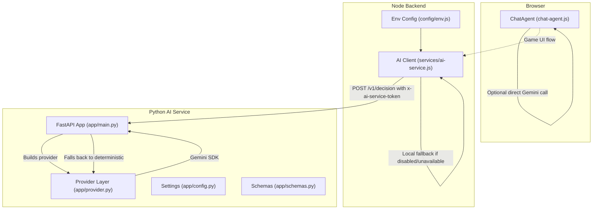
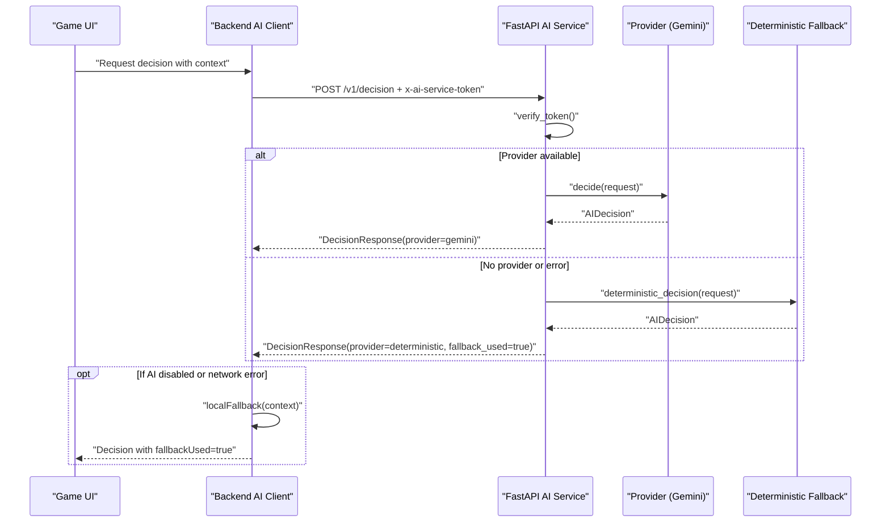
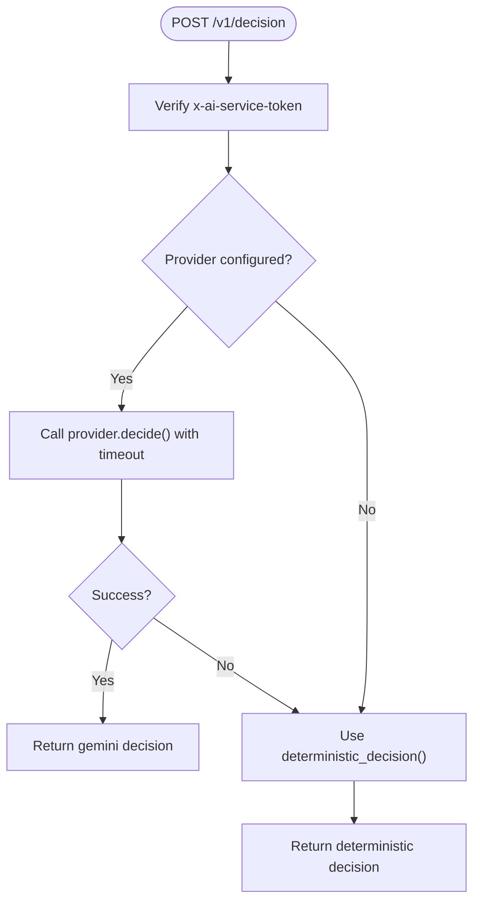
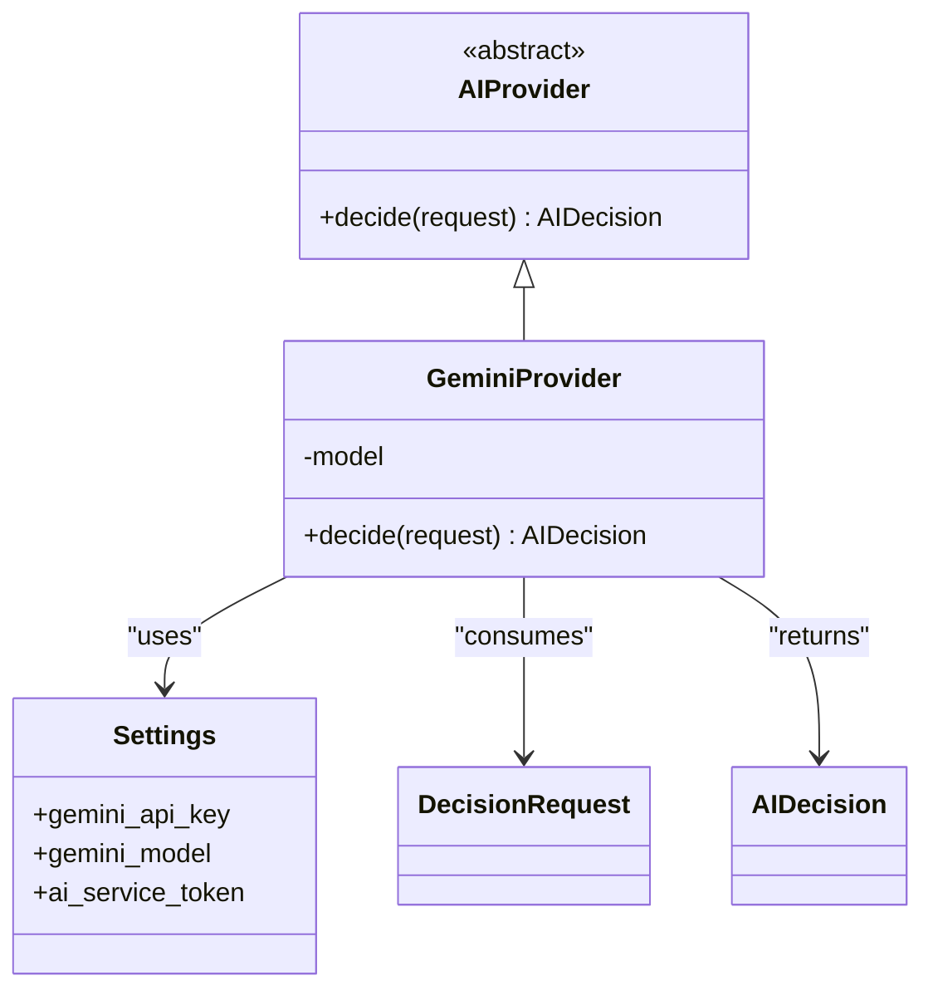
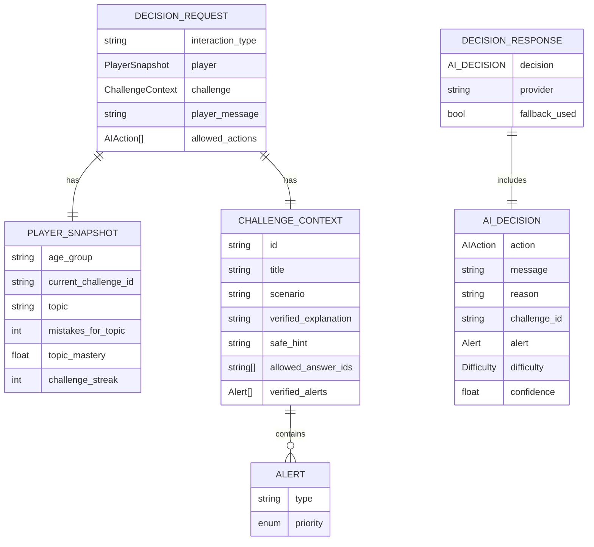
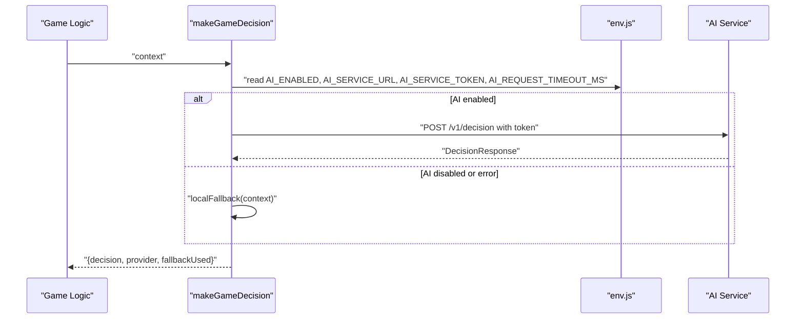
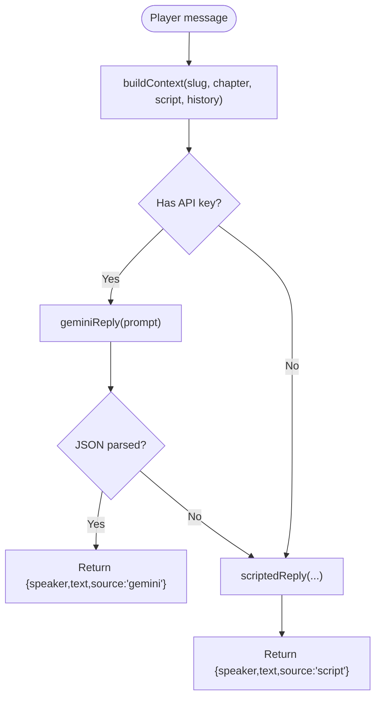
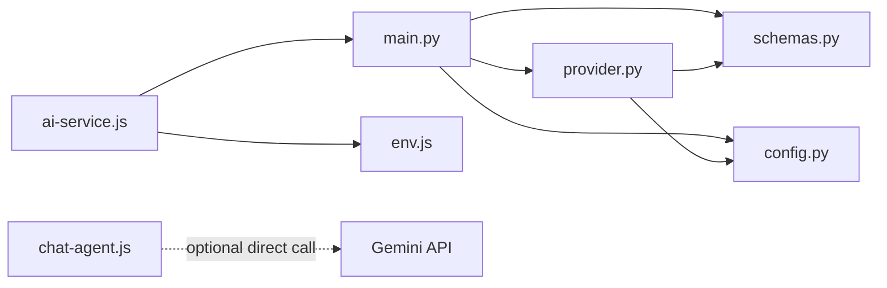

# AI Service Integration

<cite>
**Referenced Files in This Document**
- [main.py](file://backend/ai-service/app/main.py)
- [provider.py](file://backend/ai-service/app/provider.py)
- [config.py](file://backend/ai-service/app/config.py)
- [schemas.py](file://backend/ai-service/app/schemas.py)
- [requirements.txt](file://backend/ai-service/requirements.txt)
- [ai-service.js](file://backend/services/ai-service.js)
- [env.js](file://backend/config/env.js)
- [chat-agent.js](file://backend/public/js/chat-agent.js)
- [AiInteraction.js](file://backend/models/AiInteraction.js)
- [lifeguide-controller.js](file://backend/controllers/lifeguide-controller.js)
- [lifeguide-routes.js](file://backend/routes/lifeguide-routes.js)
</cite>

## Table of Contents
1. [Introduction](#introduction)
2. [Project Structure](#project-structure)
3. [Core Components](#core-components)
4. [Architecture Overview](#architecture-overview)
5. [Detailed Component Analysis](#detailed-component-analysis)
6. [Dependency Analysis](#dependency-analysis)
7. [Performance Considerations](#performance-considerations)
8. [Troubleshooting Guide](#troubleshooting-guide)
9. [Conclusion](#conclusion)
10. [Appendices](#appendices)

## Introduction
This document explains the AI-powered guidance system that provides personalized hints and decisions for players during gameplay and chat interactions. It covers:
- The FastAPI-based AI service architecture with a provider abstraction layer and deterministic fallbacks
- The decision engine that processes player context, analyzes behavior patterns, and generates actions
- Integration between the main backend and the AI service using token-based authentication
- Chat interface implementation, conversation context management, and response generation algorithms
- Configuration options for different AI providers, prompt engineering guidelines, and performance tuning parameters
- Examples of custom integrations and extension patterns

## Project Structure
The AI system spans two services:
- A Python FastAPI microservice that exposes an internal API to make AI-driven decisions
- A Node.js backend that orchestrates requests to the AI service and falls back to deterministic logic when needed
- A browser-side chat agent that can call Gemini directly or fall back to scripted responses

**Diagram sources**
- [main.py:18-32](file://backend/ai-service/app/main.py#L18-L32)
- [provider.py:12-37](file://backend/ai-service/app/provider.py#L12-L37)
- [ai-service.js:18-48](file://backend/services/ai-service.js#L18-L48)
- [env.js:20-23](file://backend/config/env.js#L20-L23)
- [chat-agent.js:124-173](file://backend/public/js/chat-agent.js#L124-L173)

**Section sources**
- [main.py:1-32](file://backend/ai-service/app/main.py#L1-L32)
- [provider.py:1-38](file://backend/ai-service/app/provider.py#L1-L38)
- [config.py:1-24](file://backend/ai-service/app/config.py#L1-L24)
- [schemas.py:1-71](file://backend/ai-service/app/schemas.py#L1-L71)
- [ai-service.js:1-51](file://backend/services/ai-service.js#L1-L51)
- [env.js:1-40](file://backend/config/env.js#L1-L40)
- [chat-agent.js:1-175](file://backend/public/js/chat-agent.js#L1-L175)

## Core Components
- FastAPI AI service: Exposes a secure endpoint to compute decisions based on player context and challenge state.
- Provider abstraction: Encapsulates external AI calls (e.g., Gemini) behind a common interface; includes a deterministic fallback.
- Decision schemas: Strongly typed request/response models for validation and consistent contracts.
- Backend integration: Node service that calls the AI service with token auth and handles timeouts and fallbacks.
- Browser chat agent: Optional client-side path to call Gemini directly for scenario chats, with scripted fallbacks.

Key responsibilities:
- Token verification and health checks
- Contextual decision making with provider abstraction
- Deterministic fallback for reliability
- Environment-driven configuration and feature toggles

**Section sources**
- [main.py:14-32](file://backend/ai-service/app/main.py#L14-L32)
- [provider.py:8-37](file://backend/ai-service/app/provider.py#L8-L37)
- [schemas.py:48-71](file://backend/ai-service/app/schemas.py#L48-L71)
- [ai-service.js:18-48](file://backend/services/ai-service.js#L18-L48)
- [chat-agent.js:99-173](file://backend/public/js/chat-agent.js#L99-L173)

## Architecture Overview
The system uses a layered approach:
- Request enters the Node backend and is forwarded to the AI service with a shared secret header
- The AI service validates the token, builds a provider (Gemini if configured), and attempts an async call with timeout
- On failure or missing config, it returns a deterministic decision
- The Node backend also has its own local fallback if the AI service is disabled or unreachable
- The browser chat agent can optionally call Gemini directly per scenario, falling back to scripted replies

**Diagram sources**
- [main.py:22-32](file://backend/ai-service/app/main.py#L22-L32)
- [provider.py:12-37](file://backend/ai-service/app/provider.py#L12-L37)
- [ai-service.js:18-48](file://backend/services/ai-service.js#L18-L48)

## Detailed Component Analysis

### FastAPI AI Service
- Health endpoint reports active provider status
- Decision endpoint enforces token-based access control via a shared secret header
- Uses asyncio timeout to guard against slow external calls
- Returns structured responses including provider identity and fallback flag

**Diagram sources**
- [main.py:14-32](file://backend/ai-service/app/main.py#L14-L32)

**Section sources**
- [main.py:14-32](file://backend/ai-service/app/main.py#L14-L32)

### Provider Abstraction Layer
- Abstract base defines a single method to decide next action given a request
- Gemini provider initializes model with JSON schema enforcement and sends a contextual prompt
- Deterministic decision inspects player message keywords and allowed actions to return safe, curated outputs

**Diagram sources**
- [provider.py:8-32](file://backend/ai-service/app/provider.py#L8-L32)
- [config.py:5-19](file://backend/ai-service/app/config.py#L5-L19)
- [schemas.py:48-64](file://backend/ai-service/app/schemas.py#L48-L64)

**Section sources**
- [provider.py:8-37](file://backend/ai-service/app/provider.py#L8-L37)
- [config.py:5-19](file://backend/ai-service/app/config.py#L5-L19)

### Schemas and Data Contracts
- DecisionRequest carries interaction type, player snapshot, challenge context, message, and allowed actions
- AIDecision specifies action, message, reason, optional fields like alert/difficulty/challenge_id, and confidence
- DecisionResponse includes the decision, provider name, and whether fallback was used

**Diagram sources**
- [schemas.py:24-71](file://backend/ai-service/app/schemas.py#L24-L71)

**Section sources**
- [schemas.py:24-71](file://backend/ai-service/app/schemas.py#L24-L71)

### Backend Integration (Node.js)
- Reads environment flags and tokens to enable/disable AI calls
- Sends POST to AI service with Content-Type and x-ai-service-token headers
- Enforces configurable timeout and logs warnings on failures
- Falls back to local deterministic logic when AI is disabled or unavailable

**Diagram sources**
- [ai-service.js:18-48](file://backend/services/ai-service.js#L18-L48)
- [env.js:20-23](file://backend/config/env.js#L20-L23)

**Section sources**
- [ai-service.js:1-51](file://backend/services/ai-service.js#L1-L51)
- [env.js:20-23](file://backend/config/env.js#L20-L23)

### Chat Interface Implementation
- Maintains conversation history and builds a context object with scene, goal, hero name, locale, and recent messages
- Attempts a direct Gemini call using a stored API key; parses JSON response for speaker/text
- Falls back to scenario-specific scripted replies with regex matching and bilingual text support
- Provides official help links and safety-focused messaging

**Diagram sources**
- [chat-agent.js:99-173](file://backend/public/js/chat-agent.js#L99-L173)

**Section sources**
- [chat-agent.js:99-173](file://backend/public/js/chat-agent.js#L99-L173)

### Decision Engine and Prompt Engineering
- The provider constructs a concise prompt embedding the full request payload and instructs the model to act as a guide
- JSON schema enforcement ensures the model output conforms to AIDecision structure
- Deterministic fallback uses keyword detection and allowed actions to produce safe, predictable responses

Guidelines:
- Keep prompts focused on role, context, and output format
- Use strict schemas to constrain model output
- Include safety rules and official resources in prompts where applicable
- Validate inputs at boundaries to prevent unsafe content

**Section sources**
- [provider.py:18-32](file://backend/ai-service/app/provider.py#L18-L32)
- [schemas.py:48-71](file://backend/ai-service/app/schemas.py#L48-L71)

### Configuration Options
- AI service settings:
  - gemini_api_key: Secret key for Gemini
  - gemini_model: Model identifier
  - ai_service_token: Shared secret for inter-service auth
  - ai_port, ai_log_level: Runtime controls
- Backend settings:
  - AI_ENABLED: Feature toggle
  - AI_SERVICE_URL: Base URL for AI service
  - AI_SERVICE_TOKEN: Must match service token
  - AI_REQUEST_TIMEOUT_MS: Timeout for AI calls

Validation:
- Token length enforced in service settings
- Environment variables validated via Joi schema

**Section sources**
- [config.py:5-19](file://backend/ai-service/app/config.py#L5-L19)
- [env.js:20-23](file://backend/config/env.js#L20-L23)

### Error Handling and Fallbacks
- Service-level:
  - Unauthorized if token mismatch
  - Timeout protection around provider calls
  - Logs errors and returns deterministic decision on exceptions
- Backend-level:
  - Catches non-OK responses and network errors
  - Returns local fallback with provider marked as deterministic
  - Warns via logger for observability

**Section sources**
- [main.py:14-32](file://backend/ai-service/app/main.py#L14-L32)
- [ai-service.js:18-48](file://backend/services/ai-service.js#L18-L48)

### Persistence and Observability
- AiInteraction model stores user-scoped interactions, assistant messages, decisions, and expiration timestamps
- Useful for auditing, analytics, and improving prompts over time

**Section sources**
- [AiInteraction.js:1-15](file://backend/models/AiInteraction.js#L1-L15)

## Dependency Analysis
- FastAPI app depends on provider, schemas, and settings
- Provider depends on Google Generative AI SDK and schemas
- Backend integration depends on env configuration and performs HTTP calls to AI service
- Browser chat agent depends on localStorage for API keys and fetch API for Gemini

**Diagram sources**
- [main.py:1-32](file://backend/ai-service/app/main.py#L1-L32)
- [provider.py:1-38](file://backend/ai-service/app/provider.py#L1-L38)
- [schemas.py:1-71](file://backend/ai-service/app/schemas.py#L1-L71)
- [config.py:1-24](file://backend/ai-service/app/config.py#L1-L24)
- [ai-service.js:1-51](file://backend/services/ai-service.js#L1-L51)
- [env.js:1-40](file://backend/config/env.js#L1-L40)
- [chat-agent.js:1-175](file://backend/public/js/chat-agent.js#L1-L175)

**Section sources**
- [main.py:1-32](file://backend/ai-service/app/main.py#L1-L32)
- [provider.py:1-38](file://backend/ai-service/app/provider.py#L1-L38)
- [schemas.py:1-71](file://backend/ai-service/app/schemas.py#L1-L71)
- [config.py:1-24](file://backend/ai-service/app/config.py#L1-L24)
- [ai-service.js:1-51](file://backend/services/ai-service.js#L1-L51)
- [env.js:1-40](file://backend/config/env.js#L1-L40)
- [chat-agent.js:1-175](file://backend/public/js/chat-agent.js#L1-L175)

## Performance Considerations
- Timeouts:
  - AI service enforces a 5-second timeout around provider calls
  - Backend supports configurable request timeout to avoid hanging requests
- Concurrency:
  - Async provider calls minimize blocking
- Fallbacks:
  - Deterministic paths ensure responsiveness under load or outages
- Input limits:
  - Backend enforces JSON body size limits to mitigate abuse
- Logging:
  - Structured logging aids performance monitoring and debugging

Recommendations:
- Tune AI_REQUEST_TIMEOUT_MS based on observed latency
- Cache repeated contexts if appropriate
- Monitor error rates and adjust prompts to reduce retries

[No sources needed since this section provides general guidance]

## Troubleshooting Guide
Common issues and resolutions:
- 401 Unauthorized from AI service:
  - Ensure x-ai-service-token matches the configured ai_service_token
  - Check token length and secrets alignment
- AI disabled or unreachable:
  - Verify AI_ENABLED and AI_SERVICE_URL in environment
  - Confirm network connectivity and firewall rules
- Slow or failing AI calls:
  - Increase AI_REQUEST_TIMEOUT_MS
  - Inspect logs for provider errors and adjust prompts
- Unexpected responses:
  - Validate request payloads against schemas
  - Review provider prompt and schema constraints

Operational tips:
- Use /health to verify active provider
- Log and capture decision payloads for analysis
- Use deterministic fallback to maintain UX during incidents

**Section sources**
- [main.py:14-32](file://backend/ai-service/app/main.py#L14-L32)
- [ai-service.js:18-48](file://backend/services/ai-service.js#L18-L48)
- [env.js:20-23](file://backend/config/env.js#L20-L23)

## Conclusion
The AI-powered guidance system combines a robust FastAPI service with a flexible provider abstraction and reliable fallbacks. It integrates securely with the Node backend through token-based authentication and offers a browser-side chat experience with optional direct Gemini calls. With strong schemas, environment-driven configuration, and clear error handling, the system balances personalization with resilience. Extending the system involves implementing new providers following the abstract interface and updating prompts while maintaining schema compliance.

[No sources needed since this section summarizes without analyzing specific files]

## Appendices

### API Reference: AI Service Endpoints
- GET /health
  - Purpose: Health check and provider status
  - Response: status, provider
- POST /v1/decision
  - Authentication: Header x-ai-service-token must match configured secret
  - Request body: DecisionRequest (interaction_type, player, challenge, player_message, allowed_actions)
  - Response: DecisionResponse (decision, provider, fallback_used)

**Section sources**
- [main.py:18-32](file://backend/ai-service/app/main.py#L18-L32)
- [schemas.py:48-71](file://backend/ai-service/app/schemas.py#L48-L71)

### Environment Variables
- AI service (Python):
  - gemini_api_key, gemini_model, ai_service_token, ai_port, ai_log_level
- Backend (Node):
  - AI_ENABLED, AI_SERVICE_URL, AI_SERVICE_TOKEN, AI_REQUEST_TIMEOUT_MS

**Section sources**
- [config.py:5-19](file://backend/ai-service/app/config.py#L5-L19)
- [env.js:20-23](file://backend/config/env.js#L20-L23)

### Extension Patterns
- Add a new provider:
  - Implement the abstract decide method returning AIDecision
  - Wire into build_provider to select your provider based on settings
  - Ensure prompt engineering aligns with AIDecision schema
- Extend allowed actions:
  - Add values to AIAction enum
  - Update deterministic logic and game flows to handle new actions
- Persist interactions:
  - Record AiInteraction entries for audit and analytics

**Section sources**
- [provider.py:8-37](file://backend/ai-service/app/provider.py#L8-L37)
- [schemas.py:5-17](file://backend/ai-service/app/schemas.py#L5-L17)
- [AiInteraction.js:1-15](file://backend/models/AiInteraction.js#L1-L15)