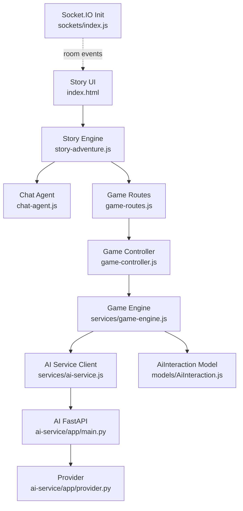
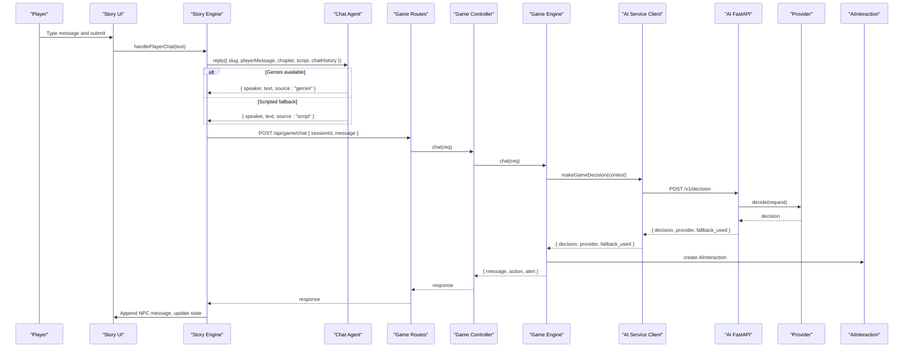
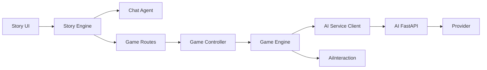

# Chat Interface & Conversation Management

<cite>
**Referenced Files in This Document**
- [index.html](file://backend/public/index.html)
- [story-adventure.js](file://backend/public/js/story-adventure.js)
- [chat-agent.js](file://backend/public/js/chat-agent.js)
- [game-controller.js](file://backend/controllers/game-controller.js)
- [game-routes.js](file://backend/routes/game-routes.js)
- [game-engine.js](file://backend/services/game-engine.js)
- [ai-service.js](file://backend/services/ai-service.js)
- [main.py](file://backend/ai-service/app/main.py)
- [provider.py](file://backend/ai-service/app/provider.py)
- [schemas.py](file://backend/ai-service/app/schemas.py)
- [AiInteraction.js](file://backend/models/AiInteraction.js)
- [index.js](file://backend/sockets/index.js)
</cite>

## Table of Contents
1. Introduction
2. Project Structure
3. Core Components
4. Architecture Overview
5. Detailed Component Analysis
6. Dependency Analysis
7. Performance Considerations
8. Troubleshooting Guide
9. Conclusion

## Introduction
This document explains the chat interface and conversation management system used in the game application. It covers:
- Real-time chat UI, input handling, and visual feedback
- Message formatting and multi-scenario context handling
- Backend chat processing via REST endpoints and AI service integration
- Conversation state management and persistence
- Error recovery and performance considerations for large conversations

The system supports two complementary chat paths:
- In-story chat powered by a client-side agent with scripted fallbacks and optional Gemini responses
- Game chat that integrates with a backend AI decision service to produce NPC replies, hints, or alerts

## Project Structure
The chat experience spans frontend UI, client-side story engine, and backend services:
- Frontend HTML defines the story viewport, chat composer, and evidence bar
- Story engine manages chapters, message rendering, and user interactions
- Client-side chat agent builds scenario context and responds using scripted rules or Gemini
- Backend routes and controllers expose a chat endpoint that calls the game engine
- Game engine constructs an AI request from session and player metrics, persists interactions, and returns decisions
- AI service provides deterministic or Gemini-based decisions with safety timeouts and fallbacks
- Socket.IO is initialized for general room events (e.g., joining game rooms), not directly used for chat messages in this implementation

**Diagram sources**
- [index.html:200-313](file://backend/public/index.html#L200-L313)
- [story-adventure.js:235-367](file://backend/public/js/story-adventure.js#L235-L367)
- [chat-agent.js:99-173](file://backend/public/js/chat-agent.js#L99-L173)
- [game-routes.js:1-15](file://backend/routes/game-routes.js#L1-L15)
- [game-controller.js:118-120](file://backend/controllers/game-controller.js#L118-L120)
- [game-engine.js:66-121](file://backend/services/game-engine.js#L66-L121)
- [ai-service.js:18-48](file://backend/services/ai-service.js#L18-L48)
- [main.py:18-32](file://backend/ai-service/app/main.py#L18-L32)
- [provider.py:12-37](file://backend/ai-service/app/provider.py#L12-L37)
- [AiInteraction.js:1-15](file://backend/models/AiInteraction.js#L1-L15)
- [index.js:3-15](file://backend/sockets/index.js#L3-L15)

**Section sources**
- [index.html:200-313](file://backend/public/index.html#L200-L313)
- [story-adventure.js:235-367](file://backend/public/js/story-adventure.js#L235-L367)
- [chat-agent.js:99-173](file://backend/public/js/chat-agent.js#L99-L173)
- [game-routes.js:1-15](file://backend/routes/game-routes.js#L1-L15)
- [game-controller.js:118-120](file://backend/controllers/game-controller.js#L118-L120)
- [game-engine.js:66-121](file://backend/services/game-engine.js#L66-L121)
- [ai-service.js:18-48](file://backend/services/ai-service.js#L18-L48)
- [main.py:18-32](file://backend/ai-service/app/main.py#L18-L32)
- [provider.py:12-37](file://backend/ai-service/app/provider.py#L12-L37)
- [AiInteraction.js:1-15](file://backend/models/AiInteraction.js#L1-L15)
- [index.js:3-15](file://backend/sockets/index.js#L3-L15)

## Core Components
- Story UI and Composer: The HTML defines the story viewport, thread container, and chat form where users type messages. Visual feedback includes chapter headers, evidence chips, and resource links.
- Story Engine: Manages chapter flow, renders messages, tracks chat history per chapter, and coordinates puzzle unlocking and final decisions.
- Chat Agent: Builds scenario-specific context, selects scripted replies, and optionally calls Gemini for richer NPC responses. Supports locale-aware text selection and help links.
- Game Chat Endpoint: Validates inputs, loads active sessions, constructs AI context from scenario content and player metrics, calls the AI service, persists interactions, and returns structured decisions.
- AI Service Client: Enforces timeouts, authenticates requests, and falls back to deterministic logic when the AI service is unavailable.
- AI FastAPI Service: Secures endpoints, validates tokens, and delegates to providers. Provides deterministic fallbacks on errors or missing configuration.
- Providers: Implement deterministic decisions and optional Gemini-based decisions with JSON schema enforcement.
- Persistence: Stores each chat interaction with user, scenario, messages, decision metadata, and expiration.

**Section sources**
- [index.html:200-313](file://backend/public/index.html#L200-L313)
- [story-adventure.js:235-367](file://backend/public/js/story-adventure.js#L235-L367)
- [chat-agent.js:99-173](file://backend/public/js/chat-agent.js#L99-L173)
- [game-controller.js:118-120](file://backend/controllers/game-controller.js#L118-L120)
- [game-engine.js:66-121](file://backend/services/game-engine.js#L66-L121)
- [ai-service.js:18-48](file://backend/services/ai-service.js#L18-L48)
- [main.py:18-32](file://backend/ai-service/app/main.py#L18-L32)
- [provider.py:12-37](file://backend/ai-service/app/provider.py#L12-L37)
- [AiInteraction.js:1-15](file://backend/models/AiInteraction.js#L1-L15)

## Architecture Overview
The chat architecture combines a narrative-driven UI with flexible AI-powered responses:

**Diagram sources**
- [story-adventure.js:331-367](file://backend/public/js/story-adventure.js#L331-L367)
- [chat-agent.js:158-173](file://backend/public/js/chat-agent.js#L158-L173)
- [game-routes.js:1-15](file://backend/routes/game-routes.js#L1-L15)
- [game-controller.js:118-120](file://backend/controllers/game-controller.js#L118-L120)
- [game-engine.js:66-121](file://backend/services/game-engine.js#L66-L121)
- [ai-service.js:18-48](file://backend/services/ai-service.js#L18-L48)
- [main.py:22-32](file://backend/ai-service/app/main.py#L22-L32)
- [provider.py:12-37](file://backend/ai-service/app/provider.py#L12-L37)
- [AiInteraction.js:1-15](file://backend/models/AiInteraction.js#L1-L15)

## Detailed Component Analysis

### Story UI and Input Handling
- The story viewport contains a thread area for messages, a composer form for input, and controls to solve puzzles or finalize decisions.
- Input validation and UX states are managed by the story engine, which disables controls during sending and focuses the input after responses.
- Visual feedback includes chapter progress, scene titles, a countdown timer, and evidence chips reflecting collected clues.

Key behaviors:
- Form submission triggers story engine handler
- Player messages are appended with avatar and label based on speaker role
- System hints and resource links are rendered dynamically
- Chapter transitions occur after puzzle completion; chat history resets per chapter

**Section sources**
- [index.html:200-313](file://backend/public/index.html#L200-L313)
- [story-adventure.js:235-367](file://backend/public/js/story-adventure.js#L235-L367)
- [story-adventure.js:413-464](file://backend/public/js/story-adventure.js#L413-L464)

### Chat Agent: Message Formatting and Multi-Scenario Context
- Builds context per scenario including hero name, scene, goal, locale, and recent chat history
- Selects scripted replies based on keyword patterns and provides default replies
- Optionally calls Gemini with a prompt that includes scenario instructions and conversation history
- Parses JSON responses and falls back to raw text if parsing fails
- Maintains help links and localized text selection

Processing highlights:
- Context construction limits history to last N entries to control payload size
- Locale-aware text selection ensures appropriate language output
- Fallbacks ensure consistent behavior even without API keys or network availability

**Section sources**
- [chat-agent.js:99-173](file://backend/public/js/chat-agent.js#L99-L173)

### Backend Chat Processing and AI Integration
- Route validates chat payloads and delegates to controller
- Controller calls game engine chat method
- Game engine:
  - Loads active session and scenario
  - Computes player metrics and normalizes scenario content
  - Constructs AI request with allowed actions and challenge context
  - Calls AI service client with timeout and authentication
  - Persists interaction with decision metadata
  - Returns structured response including message, action, and optional alert

AI service client:
- Uses environment flags to enable/disable AI
- Applies request timeout and abort signal
- Falls back to deterministic logic on errors or disabled AI

AI FastAPI service:
- Verifies token header
- Provides health endpoint indicating provider status
- Enforces decision timeout and logs errors
- Returns deterministic decisions when provider is unavailable or errors occur

Providers:
- Deterministic provider handles hint requests and default explanations
- Gemini provider configures model with JSON schema and validates responses

**Section sources**
- [game-routes.js:1-15](file://backend/routes/game-routes.js#L1-L15)
- [game-controller.js:118-120](file://backend/controllers/game-controller.js#L118-L120)
- [game-engine.js:66-121](file://backend/services/game-engine.js#L66-L121)
- [ai-service.js:18-48](file://backend/services/ai-service.js#L18-L48)
- [main.py:18-32](file://backend/ai-service/app/main.py#L18-L32)
- [provider.py:12-37](file://backend/ai-service/app/provider.py#L12-L37)
- [schemas.py:48-71](file://backend/ai-service/app/schemas.py#L48-L71)

### Conversation State Management and History
- Story engine maintains per-chapter chat history and resets it upon chapter transition
- Game engine persists each chat interaction with user, scenario, messages, decision, and expiration
- Session state includes phase, clues, options, score, stars, and timestamps
- Evidence bar reflects collected clues and updates after puzzle completion

State flows:
- Player message increments turn count and reduces time budget
- Puzzle success advances chapters and clears chat history
- Final decision completes story and triggers outcome panels

**Section sources**
- [story-adventure.js:235-367](file://backend/public/js/story-adventure.js#L235-L367)
- [story-adventure.js:495-525](file://backend/public/js/story-adventure.js#L495-L525)
- [game-engine.js:51-64](file://backend/services/game-engine.js#L51-L64)
- [AiInteraction.js:1-15](file://backend/models/AiInteraction.js#L1-L15)

### Real-Time Chat via Socket.IO
- Socket.IO initialization sets up connection logging and room joins for games
- Current chat flows use HTTP REST endpoints rather than WebSocket events
- Rooms can be used for future real-time features like live multiplayer chat or notifications

**Section sources**
- [index.js:3-15](file://backend/sockets/index.js#L3-L15)

## Dependency Analysis
The chat system has clear layering and controlled dependencies:
- UI depends on story engine for state and rendering
- Story engine depends on chat agent for NPC responses and on routes for backend chat
- Game controller depends on game engine for business logic
- Game engine depends on AI service client and database models
- AI service client depends on environment configuration and external AI service
- AI FastAPI depends on providers and schemas for validation and decision logic

Potential coupling points:
- Scenario content structure affects AI request shape
- Player metrics computation influences decision context
- Token verification and timeouts affect reliability

**Diagram sources**
- [story-adventure.js:235-367](file://backend/public/js/story-adventure.js#L235-L367)
- [chat-agent.js:99-173](file://backend/public/js/chat-agent.js#L99-L173)
- [game-routes.js:1-15](file://backend/routes/game-routes.js#L1-L15)
- [game-controller.js:118-120](file://backend/controllers/game-controller.js#L118-L120)
- [game-engine.js:66-121](file://backend/services/game-engine.js#L66-L121)
- [ai-service.js:18-48](file://backend/services/ai-service.js#L18-L48)
- [main.py:18-32](file://backend/ai-service/app/main.py#L18-L32)
- [provider.py:12-37](file://backend/ai-service/app/provider.py#L12-L37)
- [AiInteraction.js:1-15](file://backend/models/AiInteraction.js#L1-L15)

**Section sources**
- [story-adventure.js:235-367](file://backend/public/js/story-adventure.js#L235-L367)
- [chat-agent.js:99-173](file://backend/public/js/chat-agent.js#L99-L173)
- [game-routes.js:1-15](file://backend/routes/game-routes.js#L1-L15)
- [game-controller.js:118-120](file://backend/controllers/game-controller.js#L118-L120)
- [game-engine.js:66-121](file://backend/services/game-engine.js#L66-L121)
- [ai-service.js:18-48](file://backend/services/ai-service.js#L18-L48)
- [main.py:18-32](file://backend/ai-service/app/main.py#L18-L32)
- [provider.py:12-37](file://backend/ai-service/app/provider.py#L12-L37)
- [AiInteraction.js:1-15](file://backend/models/AiInteraction.js#L1-L15)

## Performance Considerations
- Conversation history truncation: The chat agent limits history to recent entries to reduce prompt size and improve latency
- Timeouts and abort signals: The AI service client enforces request timeouts to prevent hanging requests
- Deterministic fallbacks: When AI is disabled or errors occur, deterministic logic ensures responsiveness
- Payload normalization: Alerts and scenario content are normalized to predictable shapes, reducing parsing overhead
- UI throttling: Controls are disabled during sending to prevent duplicate submissions
- Database persistence: Interactions include expiration dates to manage storage growth

Recommendations:
- Consider streaming responses from the AI service for longer replies
- Implement client-side message queuing for offline scenarios
- Add retry logic with exponential backoff for transient network errors
- Monitor token usage and rate limits for external AI APIs

[No sources needed since this section provides general guidance]

## Troubleshooting Guide
Common issues and resolutions:
- No active session: Ensure the session exists and is not expired or completed before sending chat messages
- Invalid scenario: Verify the scenario is published and correctly configured
- AI service unavailable: Check environment flags, token configuration, and network connectivity; deterministic fallback will activate automatically
- Unauthorized AI requests: Confirm the AI service token matches the expected value
- Parsing errors: If Gemini returns unexpected formats, the agent falls back to raw text or scripted replies

Debugging steps:
- Inspect network requests to the chat endpoint and AI service
- Review server logs for AI errors and warnings
- Validate input schemas for chat payloads
- Check session state and scenario content structure

**Section sources**
- [game-engine.js:66-121](file://backend/services/game-engine.js#L66-L121)
- [ai-service.js:18-48](file://backend/services/ai-service.js#L18-L48)
- [main.py:18-32](file://backend/ai-service/app/main.py#L18-L32)

## Conclusion
The chat interface combines a narrative-driven UI with flexible AI-powered responses. The story engine manages conversation flow and visual feedback, while the chat agent provides scenario-aware replies with scripted fallbacks and optional Gemini integration. The backend processes chat through validated routes, constructs rich AI contexts from session and player data, and persists interactions for analytics and continuity. Robust error handling, timeouts, and deterministic fallbacks ensure reliability under varying conditions. Future enhancements can include streaming responses, offline queuing, and expanded real-time features via Socket.IO.

[No sources needed since this section summarizes without analyzing specific files]