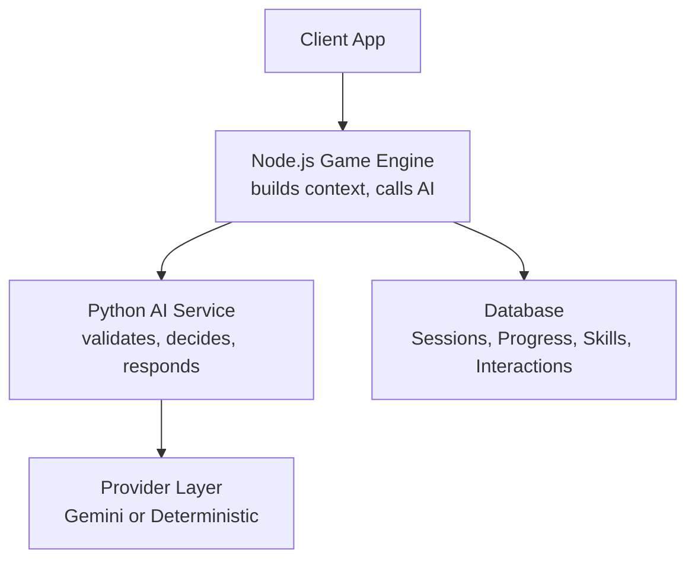
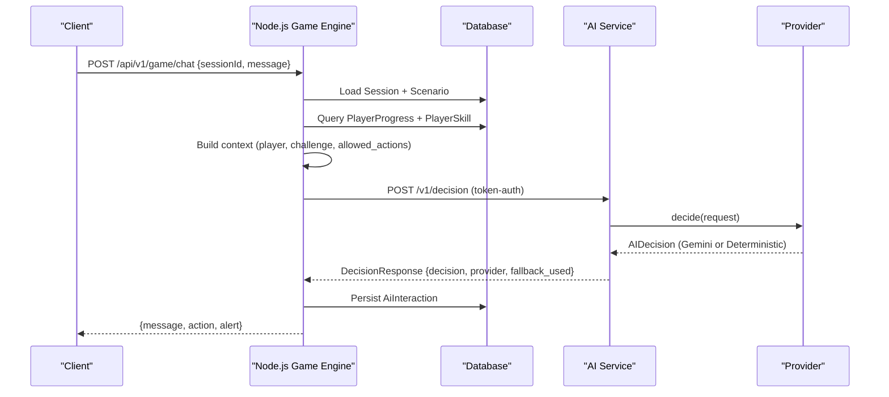
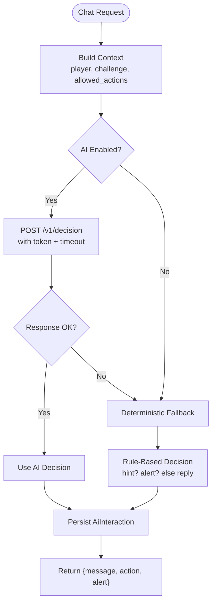
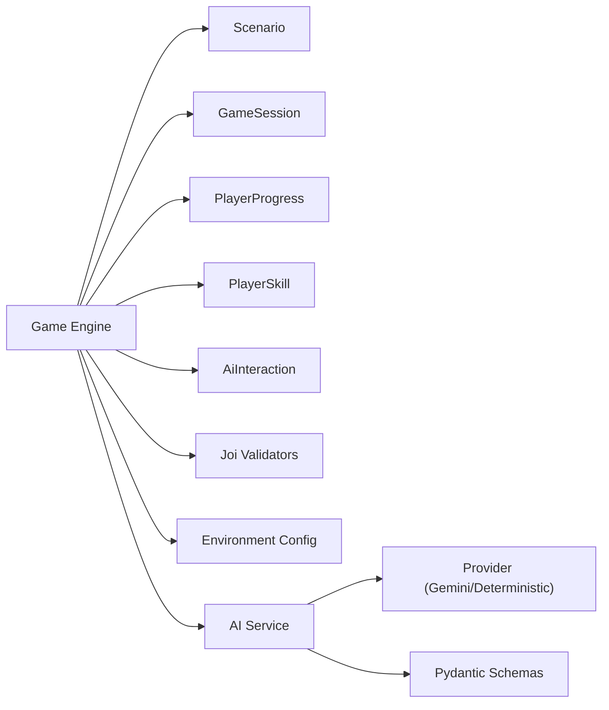

# Decision Engine & Context Processing

<cite>
**Referenced Files in This Document**
- [game-engine.js](file://backend/services/game-engine.js)
- [ai-service.js](file://backend/services/ai-service.js)
- [main.py](file://backend/ai-service/app/main.py)
- [provider.py](file://backend/ai-service/app/provider.py)
- [schemas.py](file://backend/ai-service/app/schemas.py)
- [env.js](file://backend/config/env.js)
- [game-schemas.js](file://backend/validators/game-schemas.js)
- [PlayerProgress.js](file://backend/models/PlayerProgress.js)
- [PlayerSkill.js](file://backend/models/PlayerSkill.js)
- [Scenario.js](file://backend/models/Scenario.js)
- [GameSession.js](file://backend/models/GameSession.js)
- [AiInteraction.js](file://backend/models/AiInteraction.js)
</cite>

## Table of Contents
1. [Introduction](#introduction)
2. [Project Structure](#project-structure)
3. [Core Components](#core-components)
4. [Architecture Overview](#architecture-overview)
5. [Detailed Component Analysis](#detailed-component-analysis)
6. [Dependency Analysis](#dependency-analysis)
7. [Performance Considerations](#performance-considerations)
8. [Troubleshooting Guide](#troubleshooting-guide)
9. [Conclusion](#conclusion)

## Introduction
This document explains the decision engine that processes player context and generates intelligent guidance during gameplay. It covers how player behavior, skill levels, and scenario state are analyzed to build a rich context, how decisions are computed (either via an external AI service or a deterministic fallback), and how responses are generated and persisted. It also documents the request/response schemas, validation rules, and provides examples of context analysis, decision logic, and response generation patterns. Finally, it addresses performance optimization, caching strategies, and debugging techniques for complex scenarios.

## Project Structure
The decision engine spans two services:
- Backend Node.js service: builds context from game state and player metrics, calls the AI service, persists interactions, and returns results to clients.
- Python AI service: validates requests, selects a provider (Gemini or deterministic), computes decisions, and returns structured responses.

**Diagram sources**
- [game-engine.js:66-121](file://backend/services/game-engine.js#L66-L121)
- [ai-service.js:18-48](file://backend/services/ai-service.js#L18-L48)
- [main.py:22-32](file://backend/ai-service/app/main.py#L22-L32)
- [provider.py:12-37](file://backend/ai-service/app/provider.py#L12-L37)

**Section sources**
- [game-engine.js:1-124](file://backend/services/game-engine.js#L1-L124)
- [ai-service.js:1-51](file://backend/services/ai-service.js#L1-L51)
- [main.py:1-32](file://backend/ai-service/app/main.py#L1-L32)
- [provider.py:1-38](file://backend/ai-service/app/provider.py#L1-L38)

## Core Components
- Context Builder: Assembles a standardized context including player snapshot, challenge details, and allowed actions.
- Decision Orchestrator: Calls the AI service with timeout and token-based auth; falls back to deterministic logic when unavailable.
- Provider Layer: Chooses Gemini provider if configured, otherwise uses deterministic decision-making.
- Persistence: Records each interaction with message, action, alert, and metadata for analytics and debugging.

Key responsibilities:
- Build context from Scenario, PlayerProgress, PlayerSkill, and session data.
- Validate inputs using Joi on the backend and Pydantic on the AI service.
- Compute decisions and return consistent structures.
- Persist decisions and messages for traceability.

**Section sources**
- [game-engine.js:35-103](file://backend/services/game-engine.js#L35-L103)
- [ai-service.js:4-48](file://backend/services/ai-service.js#L4-L48)
- [schemas.py:24-70](file://backend/ai-service/app/schemas.py#L24-L70)
- [provider.py:12-37](file://backend/ai-service/app/provider.py#L12-L37)

## Architecture Overview
The end-to-end flow for chat-driven decisions:

**Diagram sources**
- [game-engine.js:66-121](file://backend/services/game-engine.js#L66-L121)
- [ai-service.js:18-48](file://backend/services/ai-service.js#L18-L48)
- [main.py:22-32](file://backend/ai-service/app/main.py#L22-L32)
- [provider.py:18-32](file://backend/ai-service/app/provider.py#L18-L32)

## Detailed Component Analysis

### Context Building Process
- Player Snapshot: Includes age group, current challenge ID, topic, mistakes for topic, topic mastery, and challenge streak. Derived from user profile, progress history, and skill indicators.
- Challenge Context: Includes scenario title, narrative, verified explanation, safe hint, allowed answer IDs, and normalized alerts.
- Allowed Actions: Constrains possible decisions to NPC_REPLY, GIVE_HINT, SHOW_ALERT for chat flows.

Context construction ensures consistent input for both AI and deterministic providers.

**Section sources**
- [game-engine.js:35-103](file://backend/services/game-engine.js#L35-L103)
- [game-schemas.js:14-17](file://backend/validators/game-schemas.js#L14-L17)

### Decision Algorithms
- External AI Path: Sends validated context to the AI service endpoint with token authentication and timeout protection. Returns provider type and whether fallback was used.
- Deterministic Fallback: If AI is disabled or fails, applies rule-based logic:
  - Hint request detection triggers GIVE_HINT.
  - High mistake rate with safety alerts triggers SHOW_ALERT.
  - Otherwise returns NPC_REPLY with verified explanation.

Decision outputs include action, message, reason, confidence, optional alert, difficulty, and challenge ID.

**Section sources**
- [ai-service.js:4-48](file://backend/services/ai-service.js#L4-L48)
- [provider.py:12-32](file://backend/ai-service/app/provider.py#L12-L32)
- [schemas.py:56-70](file://backend/ai-service/app/schemas.py#L56-L70)

### Response Generation Patterns
- Message Selection: Uses decision.message with safe fallbacks to ensure helpful guidance.
- Action Routing: Maps decision.action to client behaviors (NPC reply, hint display, alert presentation).
- Alert Handling: Normalizes alert types and priorities before inclusion in responses.
- Persistence: Stores playerMessage, assistantMessage, decision payload, and expiration for audit and analytics.

**Section sources**
- [game-engine.js:103-121](file://backend/services/game-engine.js#L103-L121)
- [AiInteraction.js:4-12](file://backend/models/AiInteraction.js#L4-L12)

### Schema Definitions and Validation
- Backend Input Validation: Joi schemas enforce sessionId, message length, and action types for game actions and chat.
- AI Service Schemas: Pydantic models define strict shapes for DecisionRequest, AIDecision, and DecisionResponse, including enums for actions and difficulties, and constraints for fields like confidence and message length.
- Data Integrity: Extra fields are forbidden to prevent schema drift and ensure predictable processing.

Examples:
- Chat request must include a valid UUID sessionId and a trimmed message between 1 and 500 characters.
- Decision responses must include action, message, reason, and confidence within defined ranges.

**Section sources**
- [game-schemas.js:1-26](file://backend/validators/game-schemas.js#L1-L26)
- [schemas.py:24-70](file://backend/ai-service/app/schemas.py#L24-L70)

### Example: Context Analysis and Decision Tree Logic
- Inputs:
  - Player message contains hint-related keywords.
  - Mistakes for topic indicate repeated errors.
  - Verified alerts present for safety reinforcement.
- Logic:
  - If hint requested and allowed, choose GIVE_HINT with curated hint.
  - Else if high mistake rate and safety alert exists, choose SHOW_ALERT with explanation.
  - Else default to NPC_REPLY with verified explanation.
- Output:
  - Structured decision with action, message, reason, confidence, and optional alert.

**Diagram sources**
- [game-engine.js:66-121](file://backend/services/game-engine.js#L66-L121)
- [ai-service.js:18-48](file://backend/services/ai-service.js#L18-L48)
- [provider.py:12-32](file://backend/ai-service/app/provider.py#L12-L32)

**Section sources**
- [game-engine.js:66-121](file://backend/services/game-engine.js#L66-L121)
- [ai-service.js:4-48](file://backend/services/ai-service.js#L4-L48)
- [provider.py:12-32](file://backend/ai-service/app/provider.py#L12-L32)

## Dependency Analysis
- Backend depends on:
  - Models: Scenario, GameSession, PlayerProgress, PlayerSkill, AiInteraction.
  - Validators: Joi schemas for input validation.
  - Environment: AI feature flags, timeouts, tokens, and service URLs.
- AI Service depends on:
  - Provider abstraction: Gemini or deterministic.
  - Strict schemas for request/response validation.
  - Settings for API keys and model configuration.

**Diagram sources**
- [game-engine.js:1-124](file://backend/services/game-engine.js#L1-L124)
- [env.js:6-23](file://backend/config/env.js#L6-L23)
- [schemas.py:24-70](file://backend/ai-service/app/schemas.py#L24-L70)
- [provider.py:1-38](file://backend/ai-service/app/provider.py#L1-L38)

**Section sources**
- [game-engine.js:1-124](file://backend/services/game-engine.js#L1-L124)
- [env.js:6-23](file://backend/config/env.js#L6-L23)
- [schemas.py:24-70](file://backend/ai-service/app/schemas.py#L24-L70)
- [provider.py:1-38](file://backend/ai-service/app/provider.py#L1-L38)

## Performance Considerations
- Timeouts: AI requests are aborted after a configurable timeout to avoid blocking the game loop.
- Fallback Strategy: Deterministic fallback ensures responsiveness when the AI service is down or slow.
- Minimal Context: Only necessary fields are included to reduce payload size and processing time.
- Database Access: Queries are scoped to active sessions and relevant players to minimize load.
- Token Auth: Lightweight HMAC verification prevents unnecessary processing for unauthorized requests.

[No sources needed since this section provides general guidance]

## Troubleshooting Guide
Common issues and diagnostics:
- AI Disabled or Misconfigured:
  - Check environment variables for AI_ENABLED, AI_SERVICE_URL, AI_SERVICE_TOKEN, and AI_REQUEST_TIMEOUT_MS.
  - If disabled, deterministic fallback will be used automatically.
- Unauthorized Requests:
  - Ensure x-ai-service-token matches the configured secret; mismatches result in 401 responses.
- Timeout Errors:
  - Increase AI_REQUEST_TIMEOUT_MS if network latency is high; monitor logs for abort events.
- Invalid Inputs:
  - Validate sessionId and message lengths using Joi schemas; fix client payloads accordingly.
- Missing Scenarios or Sessions:
  - Verify scenario is published and session is active; handle 404 errors gracefully in the client.
- Logging and Observability:
  - Inspect AiInteraction records for past decisions, messages, and alerts.
  - Review provider selection and fallback usage to understand decision paths.

**Section sources**
- [env.js:6-23](file://backend/config/env.js#L6-L23)
- [main.py:14-16](file://backend/ai-service/app/main.py#L14-L16)
- [ai-service.js:18-48](file://backend/services/ai-service.js#L18-L48)
- [game-schemas.js:14-17](file://backend/validators/game-schemas.js#L14-L17)
- [AiInteraction.js:4-12](file://backend/models/AiInteraction.js#L4-L12)

## Conclusion
The decision engine integrates player context, scenario content, and skill metrics to produce personalized guidance. It balances AI-driven insights with robust deterministic fallbacks, ensuring reliability and performance. Strict schemas and validation maintain data integrity across services, while persistence enables auditing and continuous improvement. By tuning environment settings, monitoring logs, and leveraging fallback strategies, teams can deliver responsive and safe guidance tailored to each player’s needs.