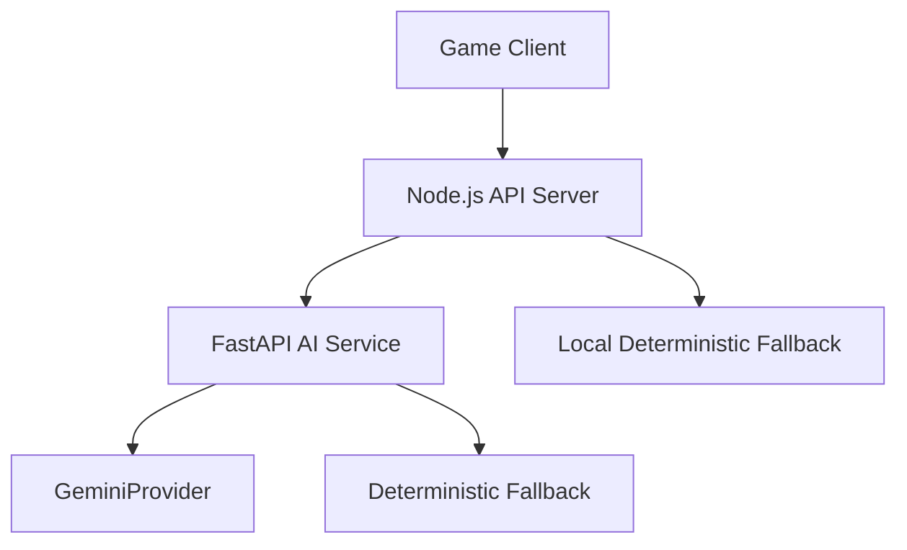
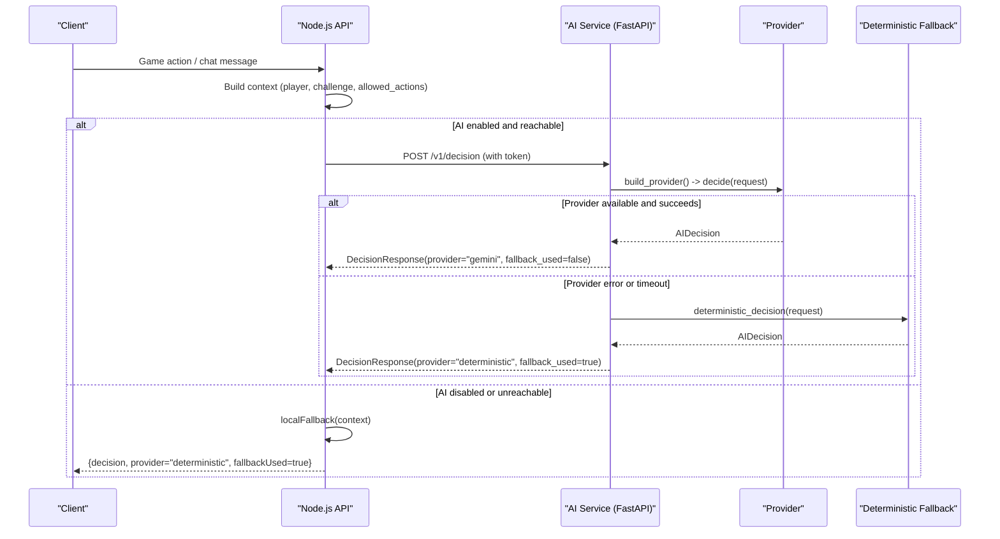
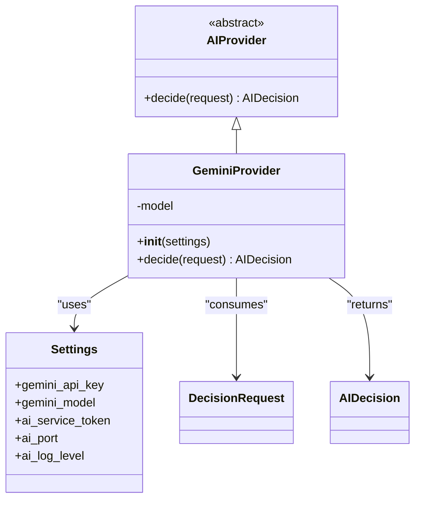
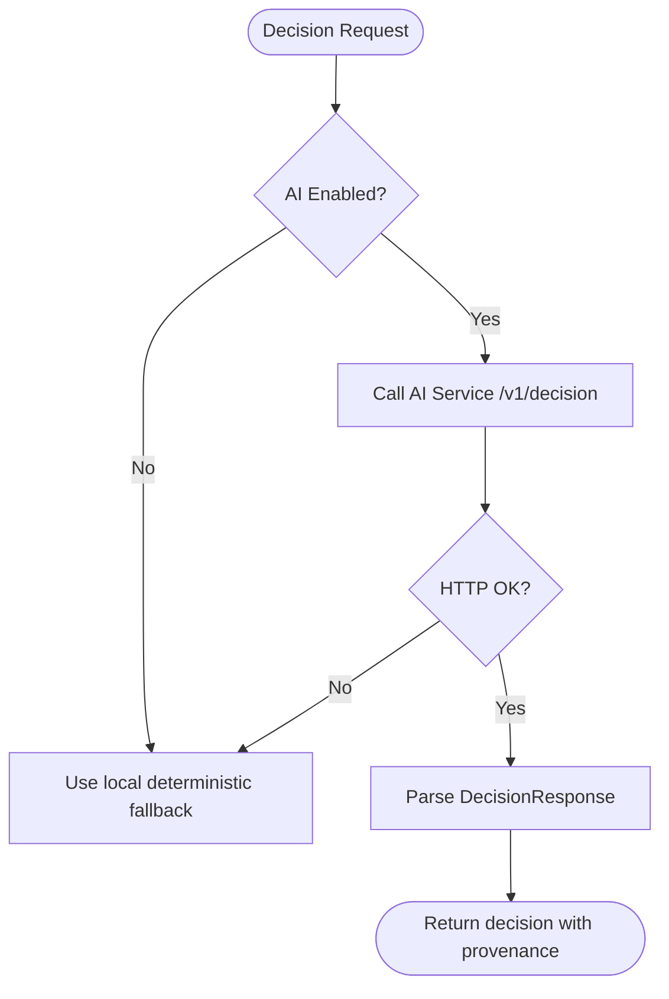
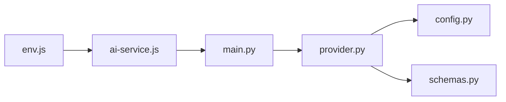

# Provider Abstraction Layer

<cite>
**Referenced Files in This Document**
- [provider.py](file://backend/ai-service/app/provider.py)
- [main.py](file://backend/ai-service/app/main.py)
- [config.py](file://backend/ai-service/app/config.py)
- [schemas.py](file://backend/ai-service/app/schemas.py)
- [ai-service.js](file://backend/services/ai-service.js)
- [env.js](file://backend/config/env.js)
- [docker-compose.yml](file://docker-compose.yml)
- [DEPLOYMENT.md](file://DEPLOYMENT.md)
</cite>

## Table of Contents
1. [Introduction](#introduction)
2. [Project Structure](#project-structure)
3. [Core Components](#core-components)
4. [Architecture Overview](#architecture-overview)
5. [Detailed Component Analysis](#detailed-component-analysis)
6. [Dependency Analysis](#dependency-analysis)
7. [Performance Considerations](#performance-considerations)
8. [Troubleshooting Guide](#troubleshooting-guide)
9. [Conclusion](#conclusion)
10. [Appendices](#appendices)

## Introduction
This document explains the provider abstraction layer that enables multiple AI backend integrations for decision-making in the game system. It covers:
- The provider interface design and built-in providers (Gemini and deterministic fallback)
- Extension patterns for custom AI services
- Provider selection logic, fallback mechanisms, and error handling strategies
- Decision request/response formats, context building algorithms, and response processing pipelines
- Examples for implementing custom providers, configuring priorities, and handling provider-specific optimizations
- Performance considerations, caching strategies, and monitoring provider health

## Project Structure
The provider abstraction spans two services:
- Python FastAPI AI service: implements the provider interface, built-in providers, and HTTP endpoints
- Node.js backend: orchestrates calls to the AI service and provides a local deterministic fallback when needed

**Diagram sources**
- [main.py:18-32](file://backend/ai-service/app/main.py#L18-L32)
- [provider.py:8-37](file://backend/ai-service/app/provider.py#L8-L37)
- [ai-service.js:18-48](file://backend/services/ai-service.js#L18-L48)

**Section sources**
- [main.py:1-32](file://backend/ai-service/app/main.py#L1-L32)
- [provider.py:1-37](file://backend/ai-service/app/provider.py#L1-L37)
- [ai-service.js:1-50](file://backend/services/ai-service.js#L1-L50)

## Core Components
- Provider interface: abstract base class defining a single async method to decide the next action given a structured request
- Built-in providers:
  - GeminiProvider: uses Google Gemini with strict JSON schema enforcement to return an AIDecision
  - Deterministic fallback: rule-based logic returning safe, curated responses without external dependencies
- Request/response schemas: strongly typed models for inputs, decisions, alerts, and metadata
- Configuration: environment-driven settings for model selection, tokens, ports, and feature toggles

Key responsibilities:
- Normalize input context into a DecisionRequest
- Select and invoke the appropriate provider
- Enforce timeouts and handle errors gracefully
- Return standardized DecisionResponse with provenance metadata

**Section sources**
- [provider.py:8-37](file://backend/ai-service/app/provider.py#L8-L37)
- [schemas.py:5-70](file://backend/ai-service/app/schemas.py#L5-L70)
- [config.py:5-23](file://backend/ai-service/app/config.py#L5-L23)

## Architecture Overview
The end-to-end flow integrates Node.js and Python components with robust fallbacks.

**Diagram sources**
- [ai-service.js:18-48](file://backend/services/ai-service.js#L18-L48)
- [main.py:18-32](file://backend/ai-service/app/main.py#L18-L32)
- [provider.py:18-37](file://backend/ai-service/app/provider.py#L18-L37)

## Detailed Component Analysis

### Provider Interface and Built-in Providers
- AIProvider defines a single async method decide(request) returning AIDecision
- GeminiProvider configures the model with JSON schema constraints and returns validated decisions
- Deterministic decision function applies simple rules based on player intent and context

**Diagram sources**
- [provider.py:8-32](file://backend/ai-service/app/provider.py#L8-L32)
- [config.py:5-23](file://backend/ai-service/app/config.py#L5-L23)
- [schemas.py:48-64](file://backend/ai-service/app/schemas.py#L48-L64)

**Section sources**
- [provider.py:8-37](file://backend/ai-service/app/provider.py#L8-L37)
- [schemas.py:5-70](file://backend/ai-service/app/schemas.py#L5-L70)

### Provider Selection Logic and Fallback Mechanisms
- Node.js side:
  - If AI is disabled, use local deterministic fallback immediately
  - Otherwise call AI service with a timeout; on any error, fall back locally
- Python side:
  - If no API key configured, skip Gemini and use deterministic decision
  - On any exception during provider.decide, log and return deterministic decision
  - Health endpoint reports which provider is active

**Diagram sources**
- [ai-service.js:18-48](file://backend/services/ai-service.js#L18-L48)
- [main.py:18-32](file://backend/ai-service/app/main.py#L18-L32)

**Section sources**
- [ai-service.js:18-48](file://backend/services/ai-service.js#L18-L48)
- [main.py:18-32](file://backend/ai-service/app/main.py#L18-L32)

### Decision Request/Response Formats and Context Building
- DecisionRequest includes:
  - interaction_type: game_action or chat
  - player snapshot: age_group, current_challenge_id, topic, mistakes_for_topic, topic_mastery, challenge_streak
  - challenge context: id, title, scenario, verified_explanation, safe_hint, allowed_answer_ids, verified_alerts
  - player_message and allowed_actions
- AIDecision includes:
  - action from a fixed set (e.g., NPC_REPLY, GIVE_HINT, SHOW_ALERT, NEXT_CHALLENGE, etc.)
  - message, reason, optional alert/difficulty/challenge_id, and confidence
- DecisionResponse adds provider provenance and whether fallback was used

Context building algorithm (Node.js):
- Extract player_message, challenge hints/explanations/alerts, and player mistake counts
- Determine if the player wants a hint via keyword matching
- Decide between hint, safety alert, or explanation using deterministic rules

**Section sources**
- [schemas.py:24-70](file://backend/ai-service/app/schemas.py#L24-L70)
- [ai-service.js:4-16](file://backend/services/ai-service.js#L4-L16)

### Response Processing Pipeline
- Node.js pipeline:
  - Build context object and call makeGameDecision
  - On success, propagate decision and provenance
  - On failure, log warning and return deterministic result
- Python pipeline:
  - Validate incoming request against DecisionRequest
  - Build provider if possible; otherwise use deterministic decision
  - Enforce timeout around provider.decide
  - Return DecisionResponse with provider and fallback flags

**Section sources**
- [ai-service.js:18-48](file://backend/services/ai-service.js#L18-L48)
- [main.py:22-32](file://backend/ai-service/app/main.py#L22-L32)

### Error Handling Strategies
- Node.js:
  - AbortController enforces configurable timeout per request
  - Non-OK responses and network errors trigger local fallback
  - Warnings logged with error details for observability
- Python:
  - Token verification rejects unauthorized requests
  - Exceptions during provider calls are caught, logged, and converted to deterministic decisions
  - Health endpoint exposes active provider status

**Section sources**
- [ai-service.js:21-48](file://backend/services/ai-service.js#L21-L48)
- [main.py:14-32](file://backend/ai-service/app/main.py#L14-L32)

### Extension Patterns for Custom AI Services
To add a new provider:
- Implement a class that extends AIProvider and defines decide(request) returning AIDecision
- Integrate it in build_provider by adding configuration checks and instantiation logic
- Optionally add provider-specific options in Settings and validate them
- Ensure your provider adheres to the AIDecision schema to maintain compatibility

Example steps:
- Create a new provider class with __init__ accepting Settings and decide(request)
- Update build_provider to check for required credentials and return the new provider instance
- Keep deterministic_decision as a universal fallback

**Section sources**
- [provider.py:8-37](file://backend/ai-service/app/provider.py#L8-L37)
- [config.py:5-23](file://backend/ai-service/app/config.py#L5-L23)

### Configuring Provider Priorities
Current behavior:
- If Gemini API key is present, GeminiProvider is selected
- Otherwise, deterministic decision is used
- Node.js can disable AI entirely via environment flag, forcing local deterministic fallback

To prioritize providers:
- Extend build_provider to support ordered lists of providers and attempt each until one succeeds
- Add configuration fields for provider order and per-provider credentials
- Wrap provider invocation with try/catch and continue to the next provider on failure

**Section sources**
- [provider.py:34-37](file://backend/ai-service/app/provider.py#L34-L37)
- [ai-service.js:18-48](file://backend/services/ai-service.js#L18-L48)
- [env.js:20-23](file://backend/config/env.js#L20-L23)

### Handling Provider-Specific Optimizations
- GeminiProvider uses JSON schema enforcement to constrain model output, reducing post-processing and validation overhead
- Timeout protection prevents long-running provider calls from blocking the system
- Deterministic fallback ensures consistent performance and availability under load or outages

Optimization opportunities:
- Cache frequent prompts or results at the provider boundary
- Batch requests where feasible
- Tune timeouts and retry policies based on observed latency distributions

**Section sources**
- [provider.py:18-32](file://backend/ai-service/app/provider.py#L18-L32)
- [main.py:27-32](file://backend/ai-service/app/main.py#L27-L32)

## Dependency Analysis
The system has clear separation of concerns:
- Node.js depends on environment configuration and calls the AI service over HTTP
- Python service depends on configuration and optionally on Google Gemini SDK
- Both sides implement deterministic fallbacks for resilience

**Diagram sources**
- [env.js:20-23](file://backend/config/env.js#L20-L23)
- [ai-service.js:1-50](file://backend/services/ai-service.js#L1-L50)
- [main.py:1-32](file://backend/ai-service/app/main.py#L1-L32)
- [provider.py:1-37](file://backend/ai-service/app/provider.py#L1-L37)
- [config.py:1-23](file://backend/ai-service/app/config.py#L1-L23)
- [schemas.py:1-70](file://backend/ai-service/app/schemas.py#L1-L70)

**Section sources**
- [env.js:20-23](file://backend/config/env.js#L20-L23)
- [ai-service.js:1-50](file://backend/services/ai-service.js#L1-L50)
- [main.py:1-32](file://backend/ai-service/app/main.py#L1-L32)
- [provider.py:1-37](file://backend/ai-service/app/provider.py#L1-L37)
- [config.py:1-23](file://backend/ai-service/app/config.py#L1-L23)
- [schemas.py:1-70](file://backend/ai-service/app/schemas.py#L1-L70)

## Performance Considerations
- Timeouts:
  - Node.js enforces per-request timeout via AbortController
  - Python enforces a hard timeout around provider.decide
- Deterministic fallback:
  - Guarantees low-latency responses when AI is unavailable
- Schema enforcement:
  - Reduces parsing/validation costs and improves reliability
- Observability:
  - Health endpoint indicates active provider
  - Logs capture errors and warnings for diagnostics

Recommendations:
- Monitor timeout rates and fallback frequency
- Track provider latency and error rates
- Consider caching repeated prompts or decisions for hot paths
- Adjust timeouts based on observed p95/p99 latencies

[No sources needed since this section provides general guidance]

## Troubleshooting Guide
Common issues and resolutions:
- Unauthorized access to AI service:
  - Ensure x-ai-service-token matches the configured secret
  - Verify token length and correctness in both services
- AI service unreachable:
  - Check network connectivity and service URLs
  - Confirm container orchestration and port mappings
- High fallback usage:
  - Investigate provider errors and timeouts
  - Review logs for exceptions and adjust timeouts or retries
- Incorrect decisions:
  - Validate prompt engineering and schema constraints
  - Inspect context building for missing or incorrect fields

Operational checks:
- Use /health to verify active provider
- Inspect logs for warnings/errors indicating fallback activation
- Validate environment variables and secrets

**Section sources**
- [main.py:14-32](file://backend/ai-service/app/main.py#L14-L32)
- [ai-service.js:21-48](file://backend/services/ai-service.js#L21-L48)

## Conclusion
The provider abstraction layer delivers a resilient, extensible decision engine:
- Clear interface for plugging in multiple AI backends
- Robust fallback ensuring continuous operation
- Strongly typed contracts for reliable data exchange
- Configurable priorities and timeouts for performance and reliability
- Simple extension points for custom providers and optimizations

Adopting these patterns enables safe evolution toward multi-provider strategies while maintaining stability and performance.

[No sources needed since this section summarizes without analyzing specific files]

## Appendices

### Environment Variables and Configuration
- Node.js:
  - AI_ENABLED: toggle AI integration
  - AI_SERVICE_URL: address of the AI service
  - AI_SERVICE_TOKEN: shared secret for inter-service auth
  - AI_REQUEST_TIMEOUT_MS: per-request timeout
- AI Service:
  - GEMINI_API_KEY: optional key for Gemini provider
  - GEMINI_MODEL: model identifier
  - AI_SERVICE_TOKEN: must be at least 32 characters

**Section sources**
- [env.js:20-23](file://backend/config/env.js#L20-L23)
- [config.py:8-19](file://backend/ai-service/app/config.py#L8-L19)
- [docker-compose.yml:20-29](file://docker-compose.yml#L20-L29)
- [DEPLOYMENT.md:14-28](file://DEPLOYMENT.md#L14-L28)

### Example: Implementing a Custom Provider
Steps:
- Create a class extending AIProvider with decide(request) returning AIDecision
- Add credential checks and initialization in build_provider
- Ensure your provider respects timeouts and errors, allowing fallback to deterministic logic

Reference locations:
- Provider interface and built-ins: [provider.py:8-37](file://backend/ai-service/app/provider.py#L8-L37)
- Settings and validation: [config.py:5-23](file://backend/ai-service/app/config.py#L5-L23)
- Request/response schemas: [schemas.py:48-70](file://backend/ai-service/app/schemas.py#L48-L70)

**Section sources**
- [provider.py:8-37](file://backend/ai-service/app/provider.py#L8-L37)
- [config.py:5-23](file://backend/ai-service/app/config.py#L5-L23)
- [schemas.py:48-70](file://backend/ai-service/app/schemas.py#L48-L70)