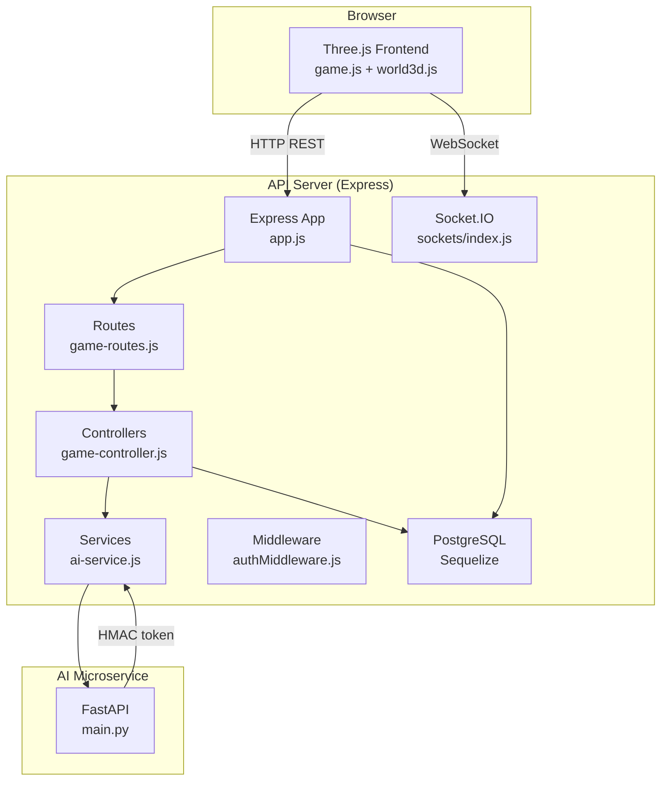
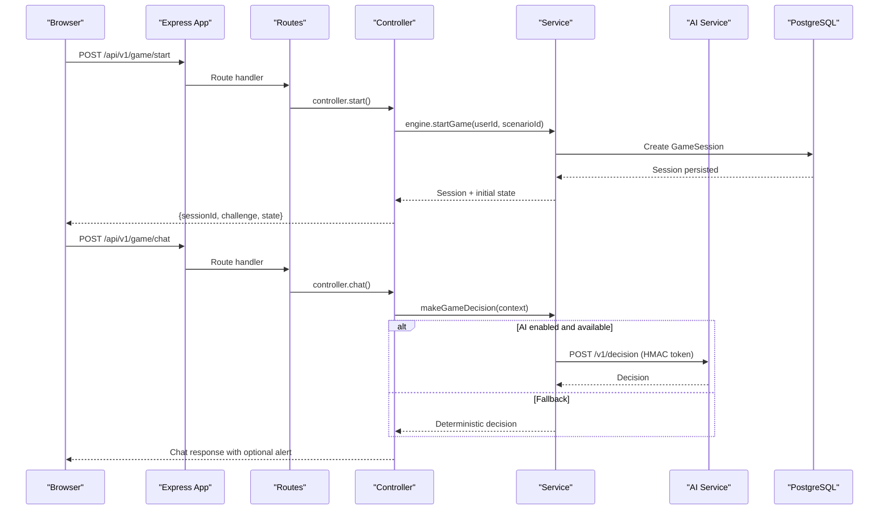
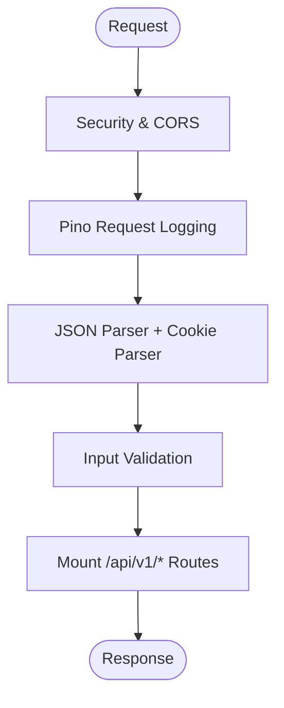
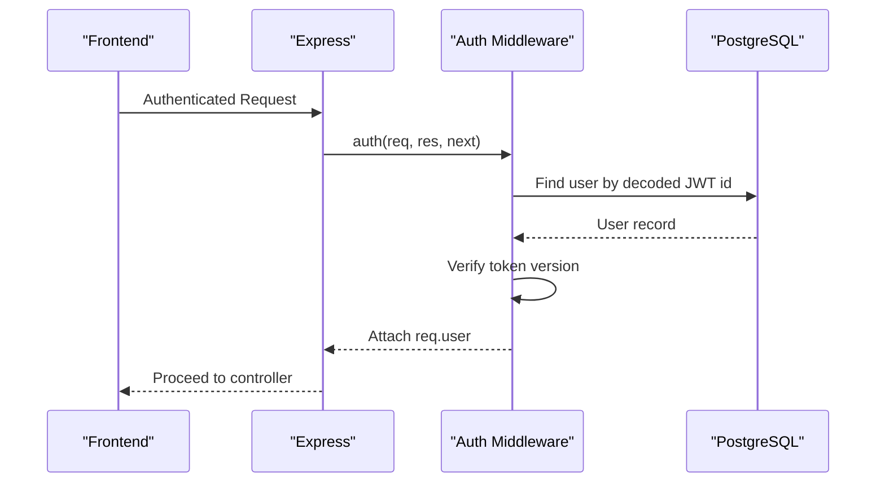
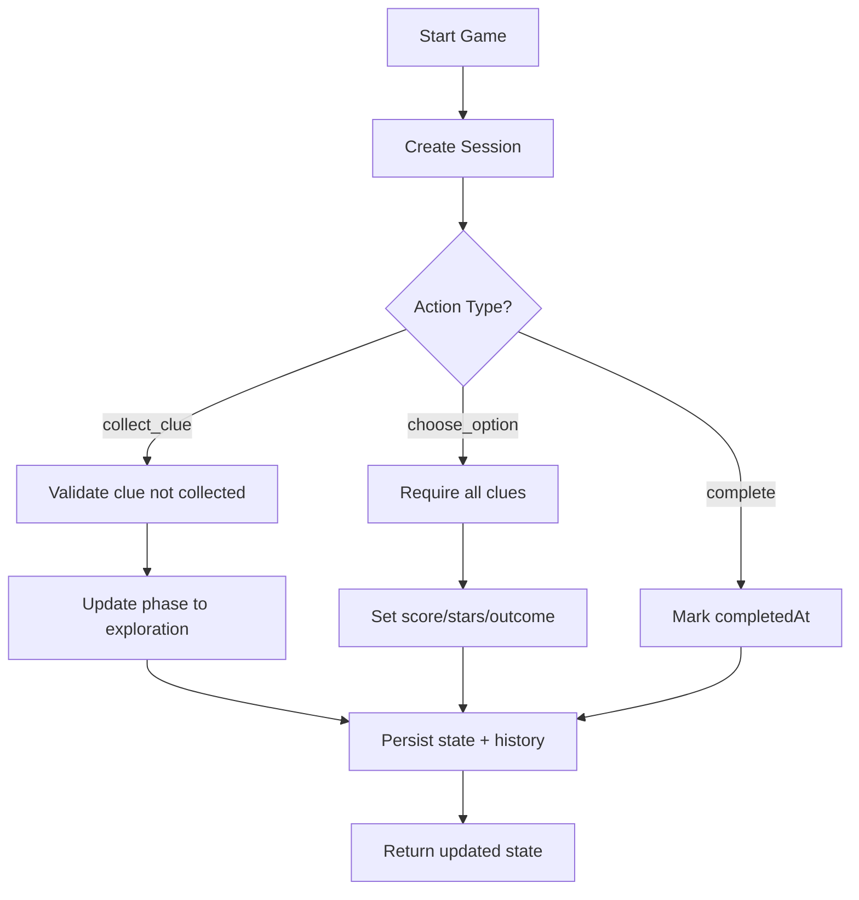
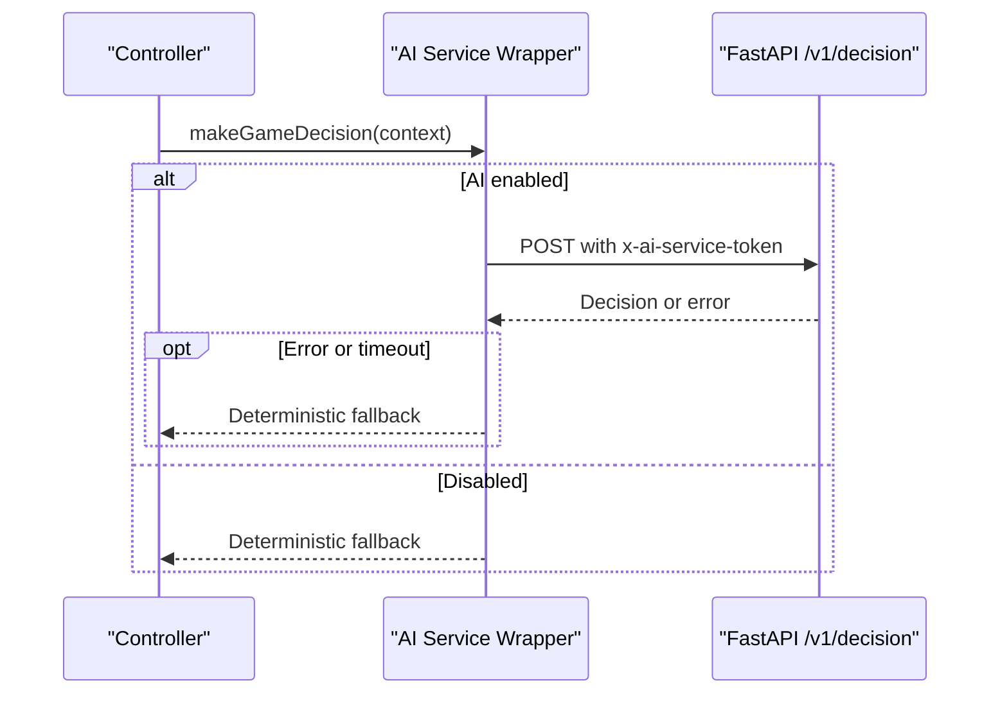
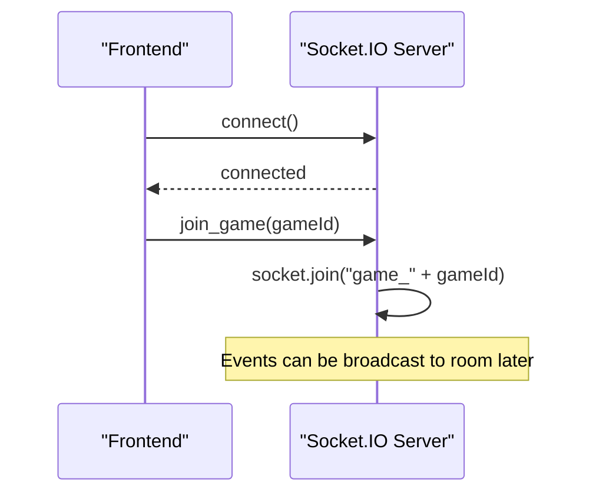
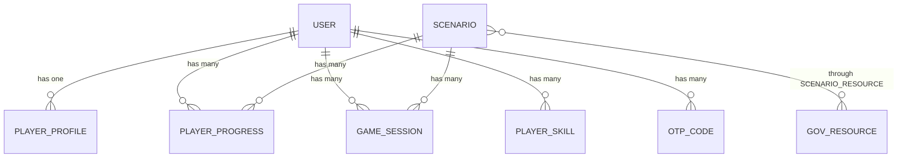
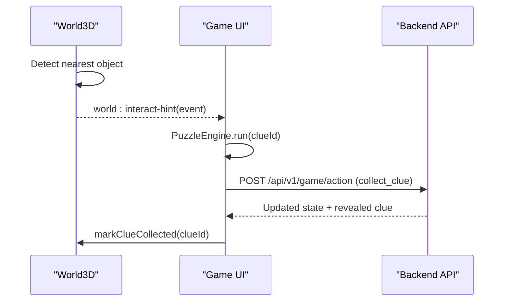
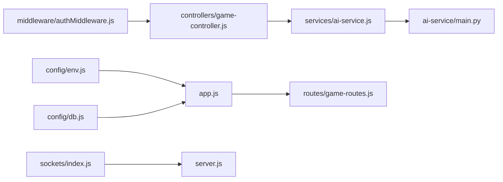

# Architecture Overview

<cite>
**Referenced Files in This Document**
- [app.js](file://backend/app.js)
- [server.js](file://backend/server.js)
- [docker-compose.yml](file://docker-compose.yml)
- [main.py](file://backend/ai-service/app/main.py)
- [db.js](file://backend/config/db.js)
- [index.js](file://backend/sockets/index.js)
- [authMiddleware.js](file://backend/middleware/authMiddleware.js)
- [index.js](file://backend/models/index.js)
- [ai-service.js](file://backend/services/ai-service.js)
- [env.js](file://backend/config/env.js)
- [game.js](file://backend/public/js/game.js)
- [world3d.js](file://backend/public/js/world3d.js)
- [game-routes.js](file://backend/routes/game-routes.js)
- [game-controller.js](file://backend/controllers/game-controller.js)
- [User.js](file://backend/models/User.js)
- [Dockerfile](file://backend/Dockerfile)
</cite>

## Table of Contents
1. Introduction
2. Project Structure
3. Core Components
4. Architecture Overview
5. Detailed Component Analysis
6. Dependency Analysis
7. Performance Considerations
8. Troubleshooting Guide
9. Conclusion

## Introduction
This document describes the architecture of the Life Skills Adventure system, a microservices-based learning game with an Express.js backend, a Python FastAPI AI service, PostgreSQL, and a Three.js 3D frontend. It explains component interactions (REST APIs, Socket.IO), layered design (controllers, services, models, middleware), data flow from user actions to persistence, integration points, Docker deployment topology, scalability, security, and monitoring strategies.

## Project Structure
The application is organized into clear layers:
- Frontend: Three.js world, story engine, puzzles, and UI orchestration under public/js.
- Backend API: Express app with routes, controllers, services, middleware, and models under backend/.
- AI Service: FastAPI microservice for AI-driven decisions under backend/ai-service.
- Data: PostgreSQL via Sequelize ORM.
- Real-time: Socket.IO for live events.
- Deployment: Docker Compose orchestrating containers.

**Diagram sources**
- [app.js:1-55](file://backend/app.js#L1-L55)
- [server.js:1-47](file://backend/server.js#L1-L47)
- [game-routes.js:1-15](file://backend/routes/game-routes.js#L1-L15)
- [game-controller.js:1-128](file://backend/controllers/game-controller.js#L1-L128)
- [ai-service.js:1-51](file://backend/services/ai-service.js#L1-L51)
- [main.py:1-33](file://backend/ai-service/app/main.py#L1-L33)
- [index.js:1-19](file://backend/sockets/index.js#L1-L19)
- [db.js:1-45](file://backend/config/db.js#L1-L45)

**Section sources**
- [app.js:1-55](file://backend/app.js#L1-L55)
- [server.js:1-47](file://backend/server.js#L1-L47)
- [docker-compose.yml:1-66](file://docker-compose.yml#L1-L66)

## Core Components
- Express Application: Central HTTP server with security headers, CORS, request logging, validation, and route mounting.
- Routes and Controllers: Feature-scoped routes that delegate to controllers for business logic.
- Services: Encapsulate cross-cutting behaviors like AI decision-making and game state transitions.
- Models and Database: Sequelize models define entities and relationships; migrations run at startup when enabled.
- Middleware: Authentication, input validation, error handling, and security policies.
- Socket.IO: Real-time room-based messaging for game sessions.
- AI Service: FastAPI endpoint protected by HMAC token with deterministic fallback.
- Frontend: Three.js world and game flow coordinating UI, 3D interactions, and API calls.

**Section sources**
- [app.js:1-55](file://backend/app.js#L1-L55)
- [authMiddleware.js:1-38](file://backend/middleware/authMiddleware.js#L1-L38)
- [index.js:1-32](file://backend/models/index.js#L1-L32)
- [ai-service.js:1-51](file://backend/services/ai-service.js#L1-L51)
- [main.py:1-33](file://backend/ai-service/app/main.py#L1-L33)
- [index.js:1-19](file://backend/sockets/index.js#L1-L19)
- [game.js:1-800](file://backend/public/js/game.js#L1-L800)
- [world3d.js:1-363](file://backend/public/js/world3d.js#L1-L363)

## Architecture Overview
The system follows a layered microservices architecture:
- Presentation Layer: Browser-based Three.js world and UI.
- API Layer: Express routes and controllers expose REST endpoints.
- Service Layer: Game engine and AI service orchestrate decisions and state changes.
- Data Layer: PostgreSQL stores users, scenarios, progress, sessions, and analytics.
- Real-time Layer: Socket.IO rooms enable live updates per game session.
- External Integration: FastAPI AI service provides intelligent guidance with secure internal token authentication.

**Diagram sources**
- [game-routes.js:1-15](file://backend/routes/game-routes.js#L1-L15)
- [game-controller.js:1-128](file://backend/controllers/game-controller.js#L1-L128)
- [ai-service.js:1-51](file://backend/services/ai-service.js#L1-L51)
- [main.py:1-33](file://backend/ai-service/app/main.py#L1-L33)

## Detailed Component Analysis

### Express Application and Security
- Security and CORS: Helmet, strict JSON parsing, CORS allowlist, trusted proxy, and request ID injection.
- Health endpoints: Liveness (/health) and readiness (/health/ready) check database connectivity.
- Static assets: Serves the Three.js frontend.

**Diagram sources**
- [app.js:1-55](file://backend/app.js#L1-L55)

**Section sources**
- [app.js:1-55](file://backend/app.js#L1-L55)

### Authentication and Authorization
- JWT extraction from cookies or Authorization header.
- Token verification against configured secret and user token version check.
- User profile inclusion for downstream use.

**Diagram sources**
- [authMiddleware.js:1-38](file://backend/middleware/authMiddleware.js#L1-L38)
- [User.js:1-23](file://backend/models/User.js#L1-L23)

**Section sources**
- [authMiddleware.js:1-38](file://backend/middleware/authMiddleware.js#L1-L38)
- [User.js:1-23](file://backend/models/User.js#L1-L23)

### Game Flow and State Management
- Start game: Creates session, returns scenario content and initial state.
- Actions: Collect clues, choose options, complete mission with validation and history tracking.
- State retrieval: Returns merged state, revealed clues, and history.

**Diagram sources**
- [game-controller.js:1-128](file://backend/controllers/game-controller.js#L1-L128)

**Section sources**
- [game-controller.js:1-128](file://backend/controllers/game-controller.js#L1-L128)
- [game-routes.js:1-15](file://backend/routes/game-routes.js#L1-L15)

### AI Decision Service Integration
- Internal token protection via HMAC comparison on the FastAPI side.
- Timeout and fallback to deterministic logic if AI provider is unavailable or errors occur.
- Express service wraps fetch with timeout and logs warnings on fallback.

**Diagram sources**
- [ai-service.js:1-51](file://backend/services/ai-service.js#L1-L51)
- [main.py:1-33](file://backend/ai-service/app/main.py#L1-L33)

**Section sources**
- [ai-service.js:1-51](file://backend/services/ai-service.js#L1-L51)
- [main.py:1-33](file://backend/ai-service/app/main.py#L1-L33)

### Real-Time Communication with Socket.IO
- Room-based connections: Clients join per-game rooms using a gameId.
- Lifecycle logging for connection and disconnection.

**Diagram sources**
- [index.js:1-19](file://backend/sockets/index.js#L1-L19)
- [server.js:1-47](file://backend/server.js#L1-L47)

**Section sources**
- [index.js:1-19](file://backend/sockets/index.js#L1-L19)
- [server.js:1-47](file://backend/server.js#L1-L47)

### Data Model Relationships
Key entities include User, PlayerProfile, Scenario, GovResource, ScenarioResource, PlayerProgress, PlayerSkill, GameSession, AuditEvent, AnalyticsEvent, AiInteraction, and OtpCode with defined associations.

**Diagram sources**
- [index.js:1-32](file://backend/models/index.js#L1-L32)

**Section sources**
- [index.js:1-32](file://backend/models/index.js#L1-L32)

### Frontend 3D World and Interaction
- Three.js world manages camera, movement, interactable objects, and visual feedback.
- Emits events for interaction hints and integrates with puzzle engines and UI flows.
- Coordinates with backend through game.js for session lifecycle and actions.

**Diagram sources**
- [world3d.js:1-363](file://backend/public/js/world3d.js#L1-L363)
- [game.js:1-800](file://backend/public/js/game.js#L1-L800)
- [game-controller.js:1-128](file://backend/controllers/game-controller.js#L1-L128)

**Section sources**
- [world3d.js:1-363](file://backend/public/js/world3d.js#L1-L363)
- [game.js:1-800](file://backend/public/js/game.js#L1-L800)

## Dependency Analysis
- The Express app depends on configuration (env, db), middleware (security, auth), routes, controllers, services, and Socket.IO.
- Controllers depend on services and models; services may call external AI service.
- Models are managed by Sequelize with environment-controlled SSL and pool settings.
- Docker Compose defines container dependencies and health checks.

**Diagram sources**
- [env.js:1-40](file://backend/config/env.js#L1-L40)
- [db.js:1-45](file://backend/config/db.js#L1-L45)
- [authMiddleware.js:1-38](file://backend/middleware/authMiddleware.js#L1-L38)
- [game-controller.js:1-128](file://backend/controllers/game-controller.js#L1-L128)
- [ai-service.js:1-51](file://backend/services/ai-service.js#L1-L51)
- [main.py:1-33](file://backend/ai-service/app/main.py#L1-L33)
- [index.js:1-19](file://backend/sockets/index.js#L1-L19)
- [server.js:1-47](file://backend/server.js#L1-L47)
- [game-routes.js:1-15](file://backend/routes/game-routes.js#L1-L15)

**Section sources**
- [env.js:1-40](file://backend/config/env.js#L1-L40)
- [db.js:1-45](file://backend/config/db.js#L1-L45)
- [server.js:1-47](file://backend/server.js#L1-L47)
- [docker-compose.yml:1-66](file://docker-compose.yml#L1-L66)

## Performance Considerations
- Database pooling: Configure Sequelize pool size and timeouts for high concurrency.
- AI latency: Use timeouts and deterministic fallbacks to keep responses responsive.
- Request limits: Enforce JSON payload size limits to prevent abuse.
- Caching: Consider caching frequent reads (e.g., scenario content) where appropriate.
- Scaling: Horizontal scaling behind a reverse proxy; share no in-memory state; rely on Postgres and optional Redis for sessions if needed.
- Frontend performance: Limit render loop overhead and reuse geometries/materials in Three.js scenes.

[No sources needed since this section provides general guidance]

## Troubleshooting Guide
- Authentication failures: Check JWT secrets, token versions, and cookie domains.
- Database connectivity: Validate DATABASE_URL, SSL flags, and network access; review startup logs for connection errors.
- AI service unavailability: Confirm AI_ENABLED, AI_SERVICE_URL, and token alignment; inspect fallback usage in logs.
- Socket.IO issues: Ensure CORS origins match browser requests and ports are exposed correctly.
- Health checks: Use /health and /health/ready to verify service status and DB readiness.

**Section sources**
- [authMiddleware.js:1-38](file://backend/middleware/authMiddleware.js#L1-L38)
- [db.js:1-45](file://backend/config/db.js#L1-L45)
- [ai-service.js:1-51](file://backend/services/ai-service.js#L1-L51)
- [index.js:1-19](file://backend/sockets/index.js#L1-L19)
- [app.js:1-55](file://backend/app.js#L1-L55)

## Conclusion
Life Skills Adventure combines a robust Express API, a secure AI microservice, relational data storage, and an immersive Three.js frontend. Its layered design separates concerns across routes, controllers, services, and models, while Socket.IO enables real-time experiences. Docker Compose simplifies local development and deployment. With careful attention to security, scalability, and observability, the system supports interactive learning at scale.

[No sources needed since this section summarizes without analyzing specific files]