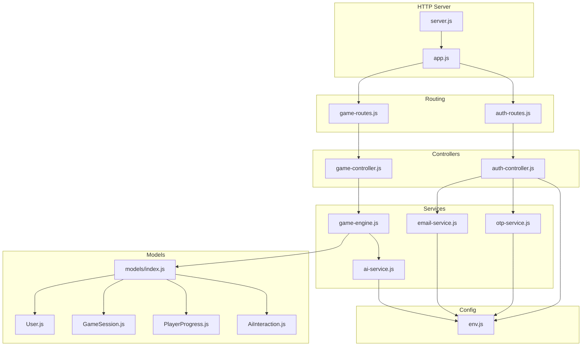
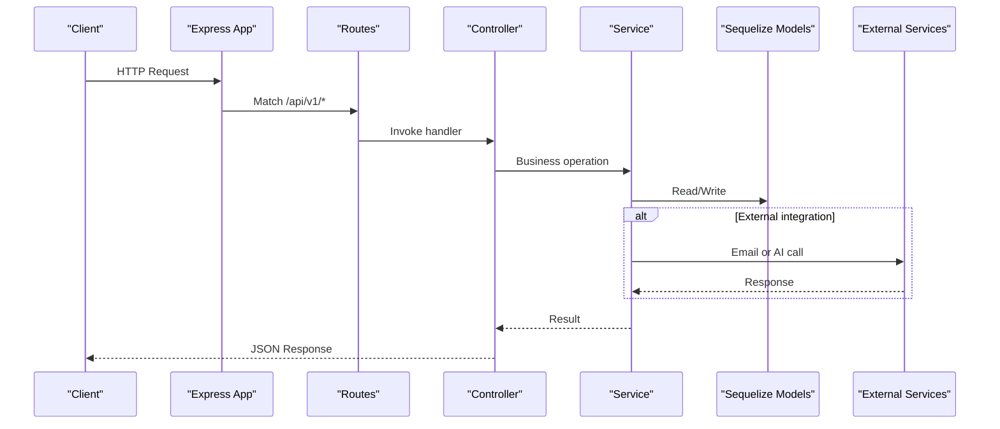
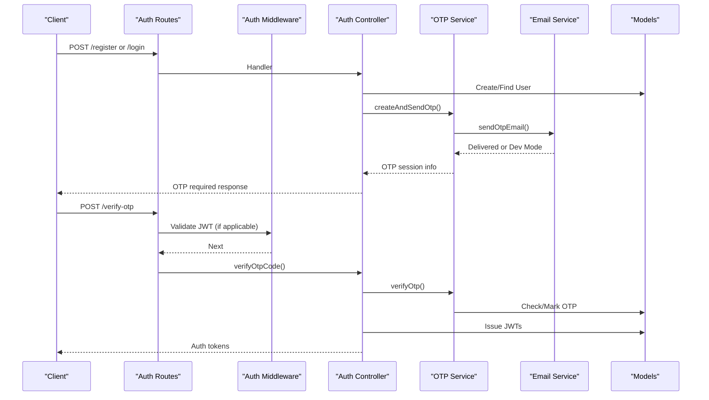
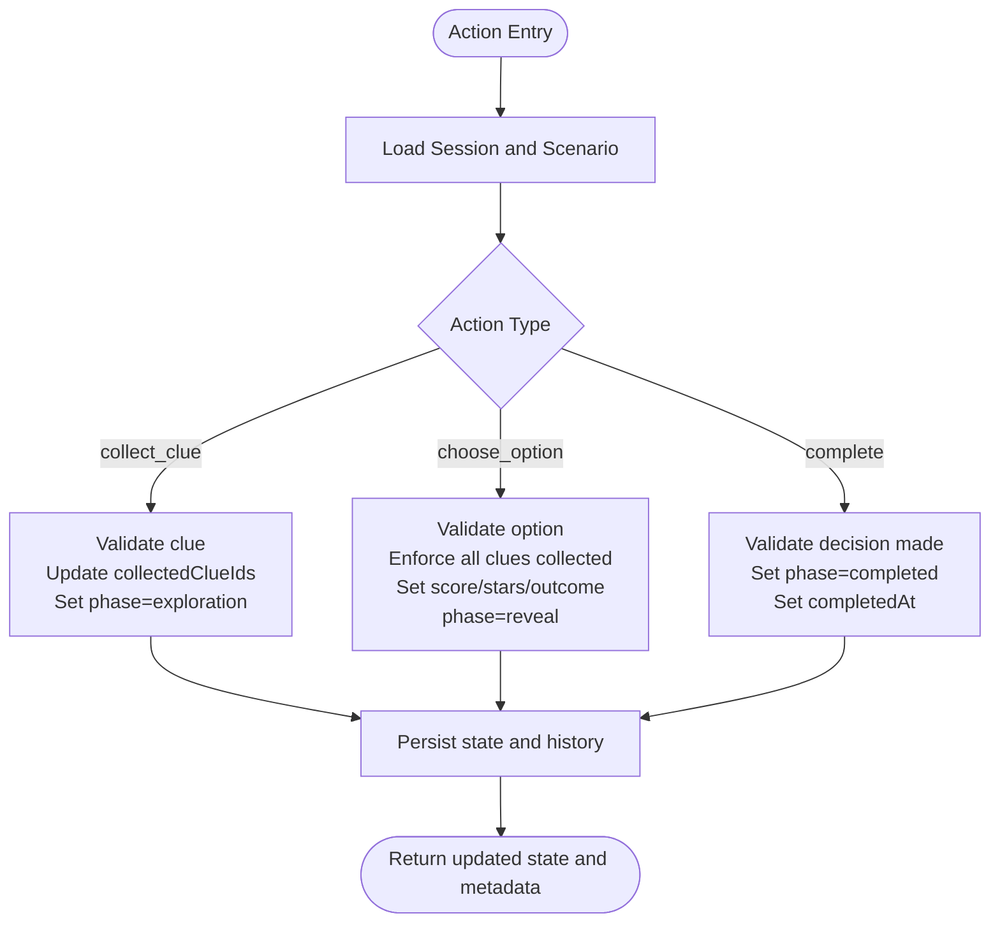
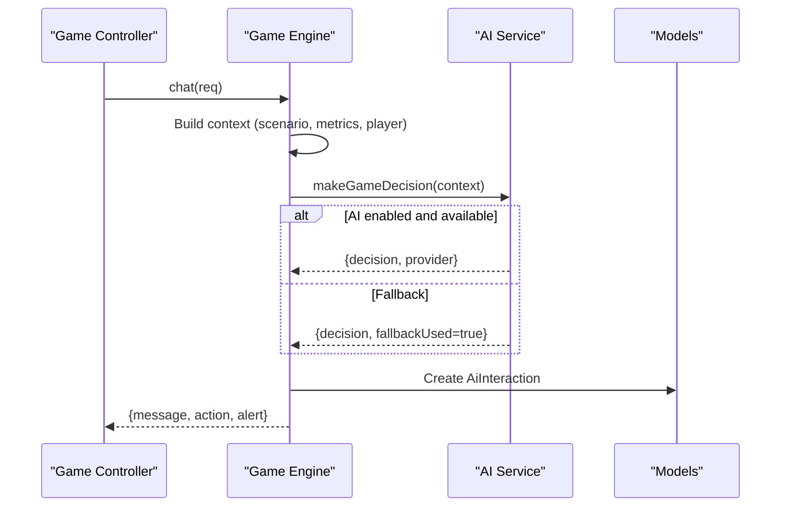
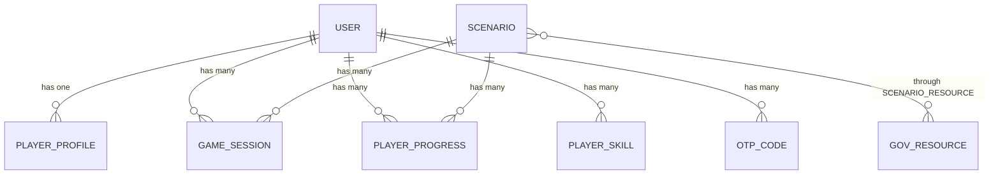
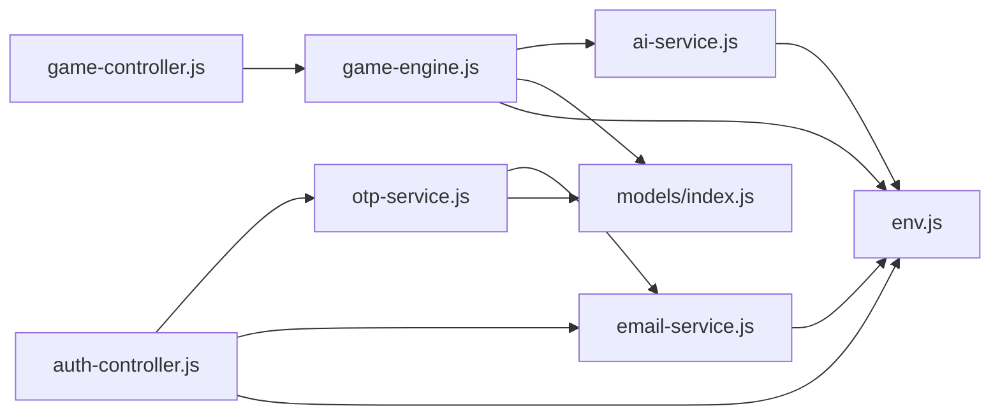

# Component Relationships & Dependencies

<cite>
**Referenced Files in This Document**
- [server.js](file://backend/server.js)
- [app.js](file://backend/app.js)
- [auth-routes.js](file://backend/routes/auth-routes.js)
- [game-routes.js](file://backend/routes/game-routes.js)
- [auth-controller.js](file://backend/controllers/auth-controller.js)
- [game-controller.js](file://backend/controllers/game-controller.js)
- [authMiddleware.js](file://backend/middleware/authMiddleware.js)
- [env.js](file://backend/config/env.js)
- [otp-service.js](file://backend/services/otp-service.js)
- [email-service.js](file://backend/services/email-service.js)
- [ai-service.js](file://backend/services/ai-service.js)
- [game-engine.js](file://backend/services/game-engine.js)
- [models/index.js](file://backend/models/index.js)
- [User.js](file://backend/models/User.js)
- [GameSession.js](file://backend/models/GameSession.js)
- [PlayerProgress.js](file://backend/models/PlayerProgress.js)
- [AiInteraction.js](file://backend/models/AiInteraction.js)
</cite>

## Table of Contents
1. Introduction
2. Project Structure
3. Core Components
4. Architecture Overview
5. Detailed Component Analysis
6. Dependency Analysis
7. Performance Considerations
8. Troubleshooting Guide
9. Conclusion

## Introduction
This document explains how the game engine orchestrates authentication, puzzle scenarios, progress tracking, and AI services. It maps controller-to-service-to-model relationships, documents dependency injection patterns and service abstractions, and analyzes coupling and cohesion across components. External dependencies such as email delivery and AI providers are covered, along with strategies to avoid circular dependencies.

## Project Structure
The backend is an Express application that wires HTTP routes, middleware, controllers, services, and models. The server bootstraps the database, HTTP server, and Socket.IO for real-time features. Routes delegate to controllers, which coordinate with services (game engine, OTP, email, AI). Services persist state via Sequelize models and call external services when needed.

**Diagram sources**
- [server.js:1-47](file://backend/server.js#L1-L47)
- [app.js:1-55](file://backend/app.js#L1-L55)
- [auth-routes.js:1-18](file://backend/routes/auth-routes.js#L1-L18)
- [game-routes.js:1-15](file://backend/routes/game-routes.js#L1-L15)
- [auth-controller.js:1-154](file://backend/controllers/auth-controller.js#L1-L154)
- [game-controller.js:1-128](file://backend/controllers/game-controller.js#L1-L128)
- [otp-service.js:1-99](file://backend/services/otp-service.js#L1-L99)
- [email-service.js:1-62](file://backend/services/email-service.js#L1-L62)
- [ai-service.js:1-51](file://backend/services/ai-service.js#L1-L51)
- [game-engine.js:1-124](file://backend/services/game-engine.js#L1-L124)
- [models/index.js:1-32](file://backend/models/index.js#L1-L32)
- [User.js:1-23](file://backend/models/User.js#L1-L23)
- [GameSession.js:1-15](file://backend/models/GameSession.js#L1-L15)
- [PlayerProgress.js:1-17](file://backend/models/PlayerProgress.js#L1-L17)
- [AiInteraction.js:1-15](file://backend/models/AiInteraction.js#L1-L15)
- [env.js:1-40](file://backend/config/env.js#L1-L40)

**Section sources**
- [server.js:1-47](file://backend/server.js#L1-L47)
- [app.js:1-55](file://backend/app.js#L1-L55)

## Core Components
- Authentication flow: register/login/guest login issue JWTs and require OTP verification; OTP service manages codes and emails.
- Game engine: starts sessions, validates actions, persists state/history, computes metrics, and integrates AI for chat decisions.
- Models: define entities and associations used by controllers and services.
- Configuration: environment validation centralizes feature flags and external endpoints.

Key responsibilities:
- Controllers handle HTTP concerns: input validation, authorization, response formatting.
- Services encapsulate business logic and external integrations.
- Models represent data and relations.
- Middleware enforces security and cross-cutting concerns.

**Section sources**
- [auth-controller.js:1-154](file://backend/controllers/auth-controller.js#L1-L154)
- [game-controller.js:1-128](file://backend/controllers/game-controller.js#L1-L128)
- [game-engine.js:1-124](file://backend/services/game-engine.js#L1-L124)
- [models/index.js:1-32](file://backend/models/index.js#L1-L32)
- [env.js:1-40](file://backend/config/env.js#L1-L40)

## Architecture Overview
The request lifecycle:
- Server boots, connects DB, creates HTTP + WebSocket server.
- Express app configures middleware (security, CORS, JSON parsing), mounts route modules, serves static assets, and handles errors.
- Routes apply auth and validation then delegate to controllers.
- Controllers use services to perform domain operations and persist via models.
- Services may call external systems (AI provider, SMTP).

**Diagram sources**
- [server.js:1-47](file://backend/server.js#L1-L47)
- [app.js:1-55](file://backend/app.js#L1-L55)
- [auth-routes.js:1-18](file://backend/routes/auth-routes.js#L1-L18)
- [game-routes.js:1-15](file://backend/routes/game-routes.js#L1-L15)
- [auth-controller.js:1-154](file://backend/controllers/auth-controller.js#L1-L154)
- [game-controller.js:1-128](file://backend/controllers/game-controller.js#L1-L128)
- [otp-service.js:1-99](file://backend/services/otp-service.js#L1-L99)
- [email-service.js:1-62](file://backend/services/email-service.js#L1-L62)
- [ai-service.js:1-51](file://backend/services/ai-service.js#L1-L51)
- [game-engine.js:1-124](file://backend/services/game-engine.js#L1-L124)
- [models/index.js:1-32](file://backend/models/index.js#L1-L32)

## Detailed Component Analysis

### Authentication Flow
- Register/Login/Guest Login:
  - Controller validates inputs, creates or locates users, issues JWTs, and triggers OTP flows.
  - OTP service generates secure codes, stores hashed codes, sends emails, and verifies codes with attempt limits and expiration.
  - Email service uses a transport configured via environment variables; falls back to dev logging when SMTP is not configured.
- Authorization:
  - Auth middleware decodes JWT, loads user with profile, and enforces token versioning to invalidate sessions on logout.

**Diagram sources**
- [auth-routes.js:1-18](file://backend/routes/auth-routes.js#L1-L18)
- [auth-controller.js:1-154](file://backend/controllers/auth-controller.js#L1-L154)
- [otp-service.js:1-99](file://backend/services/otp-service.js#L1-L99)
- [email-service.js:1-62](file://backend/services/email-service.js#L1-L62)
- [authMiddleware.js:1-38](file://backend/middleware/authMiddleware.js#L1-L38)
- [models/index.js:1-32](file://backend/models/index.js#L1-L32)

**Section sources**
- [auth-controller.js:1-154](file://backend/controllers/auth-controller.js#L1-L154)
- [otp-service.js:1-99](file://backend/services/otp-service.js#L1-L99)
- [email-service.js:1-62](file://backend/services/email-service.js#L1-L62)
- [authMiddleware.js:1-38](file://backend/middleware/authMiddleware.js#L1-L38)

### Game Engine Orchestration
- Session lifecycle:
  - Start creates a session with initial state and expiry.
  - State returns current session state, scenario content, revealed clues, and history.
  - Action validates phase transitions, collects clues, records choices, updates scores/stars, and marks completion.
  - Chat composes context from scenario and player metrics, calls AI decision service, logs interaction, and returns assistant message and action.
- Metrics and difficulty:
  - Computes accuracy, mistake rate, topic mastery, and challenge streak from progress and skills.

**Diagram sources**
- [game-controller.js:1-128](file://backend/controllers/game-controller.js#L1-L128)
- [game-engine.js:1-124](file://backend/services/game-engine.js#L1-L124)
- [models/GameSession.js:1-15](file://backend/models/GameSession.js#L1-L15)

**Section sources**
- [game-controller.js:1-128](file://backend/controllers/game-controller.js#L1-L128)
- [game-engine.js:1-124](file://backend/services/game-engine.js#L1-L124)

### AI Integration
- Decision pipeline:
  - If disabled, deterministic fallback provides hints, alerts, or NPC replies based on curated rules.
  - When enabled, requests an external AI service with a timeout and structured context including player and challenge details.
  - On failure or timeout, falls back to deterministic behavior and logs a warning.
- Interaction persistence:
  - Each chat invocation logs player and assistant messages plus the decision payload.

**Diagram sources**
- [game-controller.js:1-128](file://backend/controllers/game-controller.js#L1-L128)
- [game-engine.js:1-124](file://backend/services/game-engine.js#L1-L124)
- [ai-service.js:1-51](file://backend/services/ai-service.js#L1-L51)
- [models/AiInteraction.js:1-15](file://backend/models/AiInteraction.js#L1-L15)

**Section sources**
- [ai-service.js:1-51](file://backend/services/ai-service.js#L1-L51)
- [game-engine.js:1-124](file://backend/services/game-engine.js#L1-L124)
- [models/AiInteraction.js:1-15](file://backend/models/AiInteraction.js#L1-L15)

### Data Model Relationships
- Users own profiles, sessions, progress, skills, and OTP codes.
- Scenarios have many sessions and progress entries and associate with resources through a join table.
- Sessions store JSONB state and history; progress tracks attempts, best stars, and last evidence.

**Diagram sources**
- [models/index.js:1-32](file://backend/models/index.js#L1-L32)

**Section sources**
- [models/index.js:1-32](file://backend/models/index.js#L1-L32)
- [User.js:1-23](file://backend/models/User.js#L1-L23)
- [GameSession.js:1-15](file://backend/models/GameSession.js#L1-L15)
- [PlayerProgress.js:1-17](file://backend/models/PlayerProgress.js#L1-L17)

## Dependency Analysis
- Coupling:
  - Controllers depend on services and models; they do not call external systems directly, keeping HTTP concerns separate.
  - Services encapsulate external integrations (email, AI) and model interactions, improving cohesion.
  - Models are pure data definitions; relationships are centralized in the index file.
- Cohesion:
  - OTP service groups code generation, storage, and email dispatch.
  - Email service isolates transport configuration and templates.
  - AI service abstracts provider selection and fallback logic.
  - Game engine centralizes session state management and scoring rules.
- External dependencies:
  - Email via SMTP configured in environment; dev mode logs OTPs when SMTP is absent.
  - AI provider called over HTTP with token-based auth and timeouts; deterministic fallback ensures resilience.
- Circular dependencies:
  - No direct circular imports detected between core modules.
  - Dynamic require inside OTP resend avoids early-cycle loading by deferring model access until runtime.

**Diagram sources**
- [auth-controller.js:1-154](file://backend/controllers/auth-controller.js#L1-L154)
- [game-controller.js:1-128](file://backend/controllers/game-controller.js#L1-L128)
- [otp-service.js:1-99](file://backend/services/otp-service.js#L1-L99)
- [email-service.js:1-62](file://backend/services/email-service.js#L1-L62)
- [ai-service.js:1-51](file://backend/services/ai-service.js#L1-L51)
- [game-engine.js:1-124](file://backend/services/game-engine.js#L1-L124)
- [models/index.js:1-32](file://backend/models/index.js#L1-L32)
- [env.js:1-40](file://backend/config/env.js#L1-L40)

**Section sources**
- [otp-service.js:1-99](file://backend/services/otp-service.js#L1-L99)
- [ai-service.js:1-51](file://backend/services/ai-service.js#L1-L51)
- [game-engine.js:1-124](file://backend/services/game-engine.js#L1-L124)

## Performance Considerations
- Timeouts and resilience:
  - AI requests include explicit timeouts to prevent blocking; failures fall back to deterministic logic.
- Database efficiency:
  - Unique indexes on progress reduce contention and ensure one record per user-scenario.
  - JSONB fields store flexible state and history without schema migrations.
- Input validation and rate limiting:
  - Validation schemas and security middleware protect against malformed or abusive payloads.
- Logging and observability:
  - Structured logging aids performance diagnostics and error tracing.

[No sources needed since this section provides general guidance]

## Troubleshooting Guide
- Authentication issues:
  - Invalid or expired tokens result in unauthorized responses; logout increments token version to invalidate existing sessions.
  - OTP wrong attempts increment counters and eventually require a new code.
- Email delivery:
  - Without SMTP configured, OTPs are logged to console in dev mode; configure SMTP_HOST and related settings to enable delivery.
- AI unavailability:
  - Network errors or timeouts trigger fallback behavior; check AI_ENABLED, AI_SERVICE_URL, and AI_SERVICE_TOKEN.
- Game state inconsistencies:
  - Ensure clients collect all required clues before choosing options; invalid actions return specific error codes.

**Section sources**
- [authMiddleware.js:1-38](file://backend/middleware/authMiddleware.js#L1-L38)
- [auth-controller.js:1-154](file://backend/controllers/auth-controller.js#L1-L154)
- [otp-service.js:1-99](file://backend/services/otp-service.js#L1-L99)
- [email-service.js:1-62](file://backend/services/email-service.js#L1-L62)
- [ai-service.js:1-51](file://backend/services/ai-service.js#L1-L51)
- [game-controller.js:1-128](file://backend/controllers/game-controller.js#L1-L128)

## Conclusion
The system separates concerns cleanly: routes and controllers manage HTTP, services encapsulate domain logic and external integrations, and models define data structures and relationships. Dependency injection is achieved through module-level composition rather than frameworks, promoting testability and clarity. External services are abstracted behind resilient interfaces with fallbacks. The design maintains loose coupling while ensuring cohesive responsibilities, enabling scalable evolution of authentication, gameplay, progress tracking, and AI features.