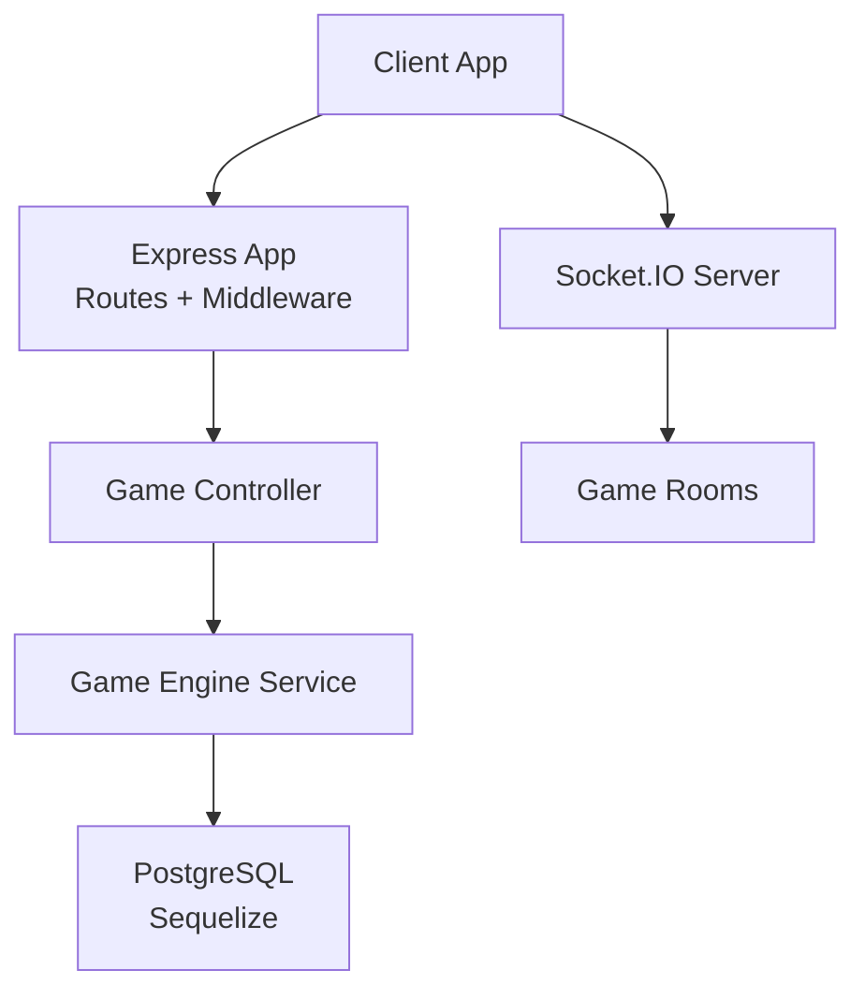
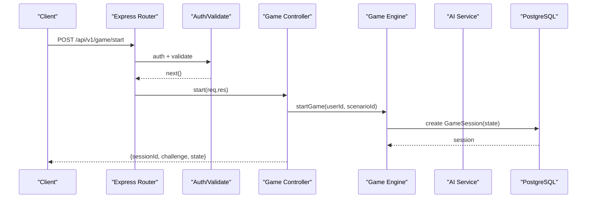
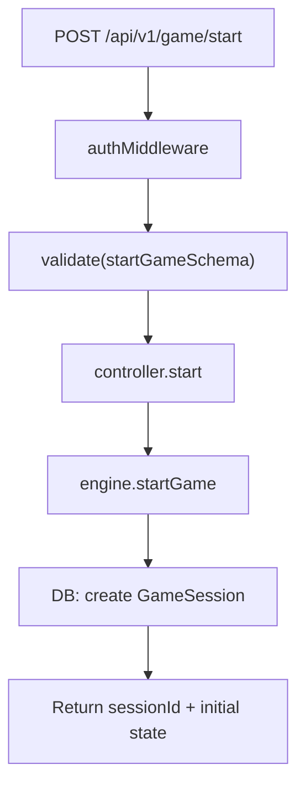
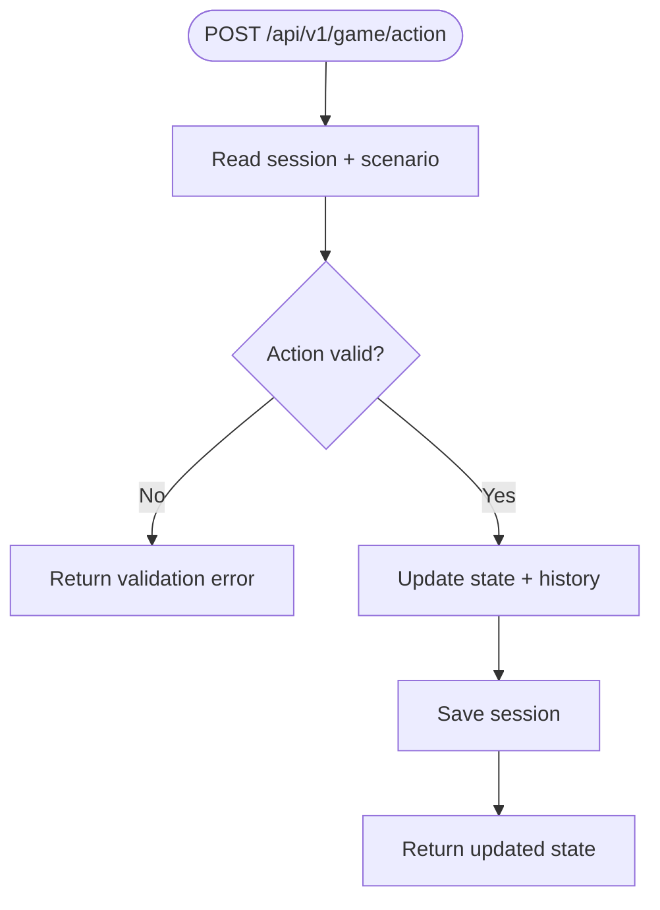
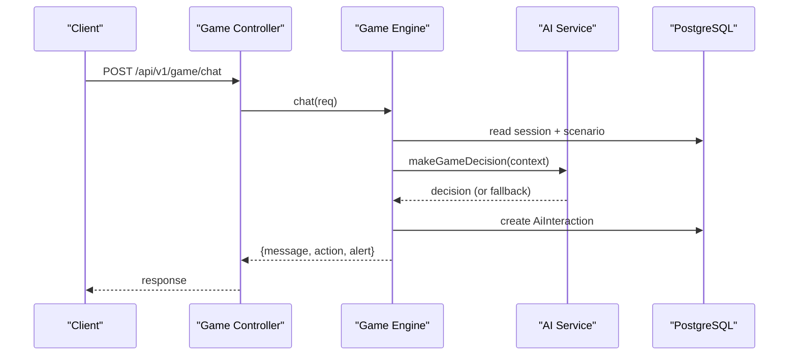
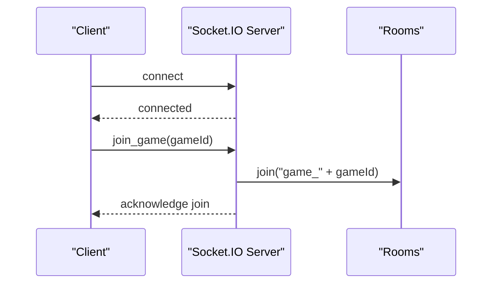
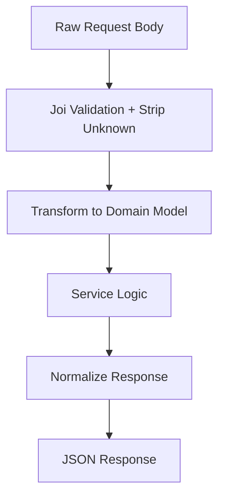
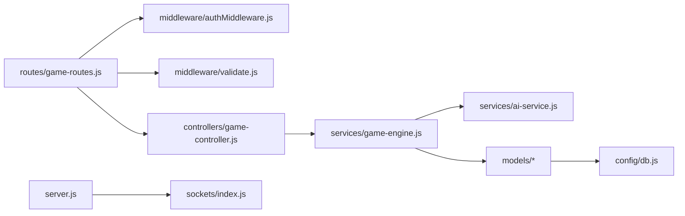

# Data Flow Patterns

<cite>
**Referenced Files in This Document**
- [app.js](file://backend/app.js)
- [server.js](file://backend/server.js)
- [sockets/index.js](file://backend/sockets/index.js)
- [controllers/game-controller.js](file://backend/controllers/game-controller.js)
- [routes/game-routes.js](file://backend/routes/game-routes.js)
- [services/game-engine.js](file://backend/services/game-engine.js)
- [services/ai-service.js](file://backend/services/ai-service.js)
- [models/GameSession.js](file://backend/models/GameSession.js)
- [models/PlayerProgress.js](file://backend/models/PlayerProgress.js)
- [models/index.js](file://backend/models/index.js)
- [middleware/authMiddleware.js](file://backend/middleware/authMiddleware.js)
- [middleware/validate.js](file://backend/middleware/validate.js)
- [validators/game-schemas.js](file://backend/validators/game-schemas.js)
- [config/db.js](file://backend/config/db.js)
</cite>

## Table of Contents
1. [Introduction](#introduction)
2. [Project Structure](#project-structure)
3. [Core Components](#core-components)
4. [Architecture Overview](#architecture-overview)
5. [Detailed Component Analysis](#detailed-component-analysis)
6. [Dependency Analysis](#dependency-analysis)
7. [Performance Considerations](#performance-considerations)
8. [Troubleshooting Guide](#troubleshooting-guide)
9. [Conclusion](#conclusion)

## Introduction
This document explains how data flows through the application from client requests to database operations and back, focusing on request-response cycles, session state management, real-time updates via Socket.IO, data transformation patterns, caching strategies, and consistency under concurrent access. It is designed for both technical and non-technical readers by progressively detailing architecture, components, and workflows with diagrams and references to source files.

## Project Structure
The backend exposes an Express HTTP API and a Socket.IO server sharing the same Node process. Routes are organized by feature, controllers orchestrate business logic, services encapsulate domain operations (including AI integration), and models define persistent entities. Middleware handles authentication, validation, security, and error handling.

**Diagram sources**
- [app.js:15-53](file://backend/app.js#L15-L53)
- [server.js:9-25](file://backend/server.js#L9-L25)
- [sockets/index.js:3-15](file://backend/sockets/index.js#L3-L15)

**Section sources**
- [app.js:15-53](file://backend/app.js#L15-L53)
- [server.js:9-25](file://backend/server.js#L9-L25)

## Core Components
- Request pipeline: routes -> auth middleware -> validation middleware -> controller -> service -> database.
- Session state: persisted in GameSession JSONB fields; merged with initial state per action.
- Real-time: Socket.IO rooms per game for event-driven updates.
- AI decision flow: deterministic fallback or external AI service with timeout and retry behavior.
- Validation and sanitization: Joi schemas with stripUnknown to enforce input contracts.

**Section sources**
- [routes/game-routes.js:1-15](file://backend/routes/game-routes.js#L1-L15)
- [middleware/authMiddleware.js:6-35](file://backend/middleware/authMiddleware.js#L6-L35)
- [middleware/validate.js:3-11](file://backend/middleware/validate.js#L3-L11)
- [controllers/game-controller.js:18-120](file://backend/controllers/game-controller.js#L18-L120)
- [services/game-engine.js:51-121](file://backend/services/game-engine.js#L51-L121)
- [services/ai-service.js:18-48](file://backend/services/ai-service.js#L18-L48)
- [models/GameSession.js:4-12](file://backend/models/GameSession.js#L4-L12)

## Architecture Overview
The system uses layered architecture with clear separation of concerns:
- Presentation: Express routes and static assets.
- Application: Controllers coordinating use cases.
- Domain: Services implementing game logic and AI decisions.
- Infrastructure: Database (PostgreSQL via Sequelize), Socket.IO, logging, and configuration.

**Diagram sources**
- [routes/game-routes.js:8-12](file://backend/routes/game-routes.js#L8-L12)
- [middleware/authMiddleware.js:6-35](file://backend/middleware/authMiddleware.js#L6-L35)
- [middleware/validate.js:3-11](file://backend/middleware/validate.js#L3-L11)
- [controllers/game-controller.js:18-28](file://backend/controllers/game-controller.js#L18-L28)
- [services/game-engine.js:51-64](file://backend/services/game-engine.js#L51-L64)
- [models/GameSession.js:4-12](file://backend/models/GameSession.js#L4-L12)

## Detailed Component Analysis

### Request-Response Cycle: Start Game
- Route enforces authentication and validates payload schema.
- Controller delegates to engine to create a new session with initial state.
- Engine persists session and returns minimal response to client.

**Diagram sources**
- [routes/game-routes.js:8-12](file://backend/routes/game-routes.js#L8-L12)
- [middleware/authMiddleware.js:6-35](file://backend/middleware/authMiddleware.js#L6-L35)
- [middleware/validate.js:3-11](file://backend/middleware/validate.js#L3-L11)
- [controllers/game-controller.js:18-28](file://backend/controllers/game-controller.js#L18-L28)
- [services/game-engine.js:51-64](file://backend/services/game-engine.js#L51-L64)

**Section sources**
- [routes/game-routes.js:8-12](file://backend/routes/game-routes.js#L8-L12)
- [controllers/game-controller.js:18-28](file://backend/controllers/game-controller.js#L18-L28)
- [services/game-engine.js:51-64](file://backend/services/game-engine.js#L51-L64)

### State Management: Actions and Persistence
- Actions include collecting clues, choosing options, and completing scenarios.
- Each action validates current phase and constraints, updates in-memory state, appends history, and persists changes.
- State merging ensures consistent baseline across reads/writes.

**Diagram sources**
- [controllers/game-controller.js:52-116](file://backend/controllers/game-controller.js#L52-L116)
- [validators/game-schemas.js:7-12](file://backend/validators/game-schemas.js#L7-L12)

**Section sources**
- [controllers/game-controller.js:52-116](file://backend/controllers/game-controller.js#L52-L116)
- [validators/game-schemas.js:7-12](file://backend/validators/game-schemas.js#L7-L12)

### Chat and AI Decision Flow
- Chat endpoint builds a context including player metrics and scenario content.
- AI service either calls external service with timeout or uses deterministic fallback.
- Decisions are recorded as interactions and returned to the client.

**Diagram sources**
- [controllers/game-controller.js:118-120](file://backend/controllers/game-controller.js#L118-L120)
- [services/game-engine.js:66-121](file://backend/services/game-engine.js#L66-L121)
- [services/ai-service.js:18-48](file://backend/services/ai-service.js#L18-L48)

**Section sources**
- [services/game-engine.js:66-121](file://backend/services/game-engine.js#L66-L121)
- [services/ai-service.js:18-48](file://backend/services/ai-service.js#L18-L48)

### Real-Time Updates with Socket.IO
- Clients connect and join a game room identified by gameId.
- The server logs joins/disconnects and can broadcast events to the room.
- Future extensions can push state deltas or live hints via this channel.

**Diagram sources**
- [server.js:9-25](file://backend/server.js#L9-L25)
- [sockets/index.js:3-15](file://backend/sockets/index.js#L3-L15)

**Section sources**
- [sockets/index.js:3-15](file://backend/sockets/index.js#L3-L15)

### Data Transformation Patterns
- Input validation: Joi schemas enforce types, formats, and conditional requirements; unknown fields are stripped.
- Output normalization: helper functions sanitize text, normalize alerts, and extract safe content from scenarios.
- Context building: controller/service assemble rich context for AI decisions, including player metrics and scenario metadata.

**Diagram sources**
- [middleware/validate.js:3-11](file://backend/middleware/validate.js#L3-L11)
- [validators/game-schemas.js:3-17](file://backend/validators/game-schemas.js#L3-L17)
- [services/game-engine.js:19-33](file://backend/services/game-engine.js#L19-L33)

**Section sources**
- [middleware/validate.js:3-11](file://backend/middleware/validate.js#L3-L11)
- [validators/game-schemas.js:3-17](file://backend/validators/game-schemas.js#L3-L17)
- [services/game-engine.js:19-33](file://backend/services/game-engine.js#L19-L33)

### Caching Strategies and Performance Optimizations
- Database connection pooling configured with max/min pool sizes and idle eviction to manage concurrency and resource usage.
- Retry policy for transient failures improves resilience.
- Deterministic fallback for AI decisions avoids latency spikes when external service is unavailable.
- Static assets served directly for reduced overhead.

**Section sources**
- [config/db.js:7-13](file://backend/config/db.js#L7-L13)
- [services/ai-service.js:18-48](file://backend/services/ai-service.js#L18-L48)
- [app.js:50-51](file://backend/app.js#L50-L51)

### Data Consistency and Concurrency Handling
- Sessions are scoped per user and scenario; actions assert active sessions and prevent conflicting states (e.g., already decided).
- History array appended per action provides an audit trail and supports replay/debugging.
- Unique indexes on PlayerProgress ensure one record per user-scenario combination.
- Strict validation and phase checks reduce race conditions at the application layer.

**Section sources**
- [controllers/game-controller.js:8-16](file://backend/controllers/game-controller.js#L8-L16)
- [controllers/game-controller.js:52-116](file://backend/controllers/game-controller.js#L52-L116)
- [models/PlayerProgress.js:4-14](file://backend/models/PlayerProgress.js#L4-L14)
- [models/index.js:14-27](file://backend/models/index.js#L14-L27)

## Dependency Analysis
High-level dependencies between layers and modules:

**Diagram sources**
- [routes/game-routes.js:1-15](file://backend/routes/game-routes.js#L1-L15)
- [middleware/authMiddleware.js:1-38](file://backend/middleware/authMiddleware.js#L1-L38)
- [middleware/validate.js:1-14](file://backend/middleware/validate.js#L1-L14)
- [controllers/game-controller.js:1-128](file://backend/controllers/game-controller.js#L1-L128)
- [services/game-engine.js:1-124](file://backend/services/game-engine.js#L1-L124)
- [services/ai-service.js:1-51](file://backend/services/ai-service.js#L1-L51)
- [models/index.js:1-32](file://backend/models/index.js#L1-L32)
- [config/db.js:1-45](file://backend/config/db.js#L1-L45)
- [server.js:1-25](file://backend/server.js#L1-L25)
- [sockets/index.js:1-19](file://backend/sockets/index.js#L1-L19)

**Section sources**
- [routes/game-routes.js:1-15](file://backend/routes/game-routes.js#L1-L15)
- [controllers/game-controller.js:1-128](file://backend/controllers/game-controller.js#L1-L128)
- [services/game-engine.js:1-124](file://backend/services/game-engine.js#L1-L124)
- [services/ai-service.js:1-51](file://backend/services/ai-service.js#L1-L51)
- [models/index.js:1-32](file://backend/models/index.js#L1-L32)
- [config/db.js:1-45](file://backend/config/db.js#L1-L45)
- [server.js:1-25](file://backend/server.js#L1-L25)
- [sockets/index.js:1-19](file://backend/sockets/index.js#L1-L19)

## Performance Considerations
- Use database connection pooling to handle concurrent requests efficiently.
- Prefer deterministic fallback for AI decisions to avoid long tail latencies.
- Keep payloads small; rely on server-side state persistence for heavy data.
- Serve static assets directly and minimize middleware chain length where possible.
- Monitor query logs and adjust pool settings based on workload.

[No sources needed since this section provides general guidance]

## Troubleshooting Guide
Common issues and diagnostics:
- Authentication failures: invalid or expired tokens result in explicit error codes; verify token presence and versioning.
- Validation errors: Joi rejects malformed inputs; check schema definitions and request payloads.
- Session not found: ensure sessionId matches an active session for the authenticated user and has not expired.
- AI service timeouts: if external AI is down, deterministic fallback is used; log warnings indicate fallback usage.
- Database connectivity: startup health endpoints expose readiness; connection errors surface during initialization.

**Section sources**
- [middleware/authMiddleware.js:6-35](file://backend/middleware/authMiddleware.js#L6-L35)
- [middleware/validate.js:3-11](file://backend/middleware/validate.js#L3-L11)
- [controllers/game-controller.js:8-16](file://backend/controllers/game-controller.js#L8-L16)
- [services/ai-service.js:18-48](file://backend/services/ai-service.js#L18-L48)
- [app.js:35-38](file://backend/app.js#L35-L38)
- [config/db.js:15-29](file://backend/config/db.js#L15-L29)

## Conclusion
The application implements a clean, layered data flow with robust validation, secure authentication, and persistent session state. Real-time capabilities are scaffolded via Socket.IO for future interactive features. AI integration includes resilient fallback mechanisms. Consistency is enforced through strict validations, phase checks, and unique constraints. With connection pooling and careful payload design, the system scales well under concurrent load while maintaining clarity and maintainability.

[No sources needed since this section summarizes without analyzing specific files]