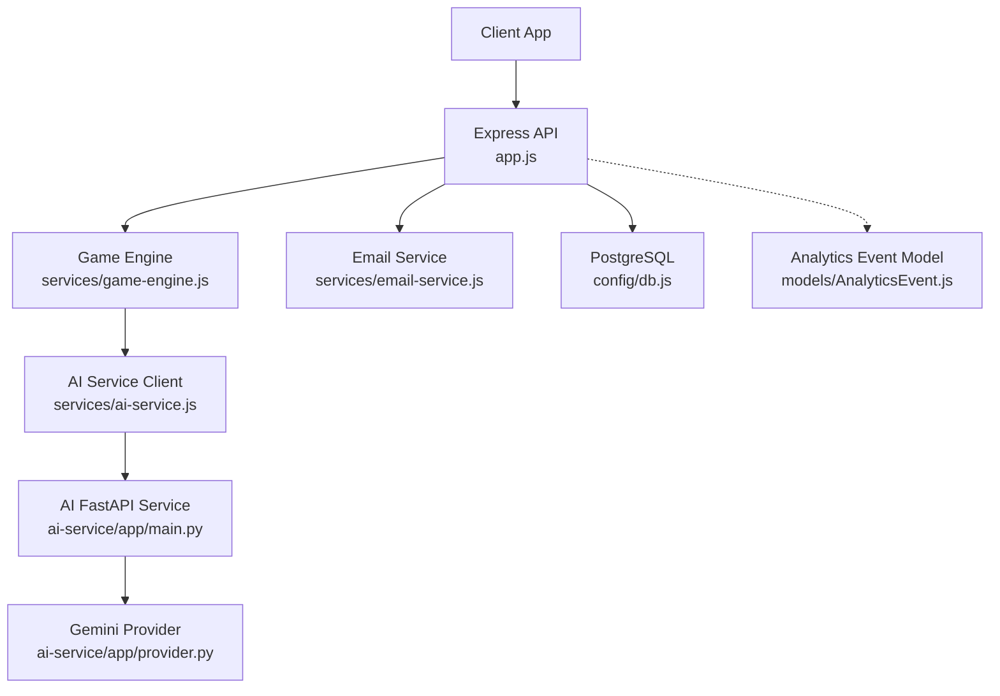
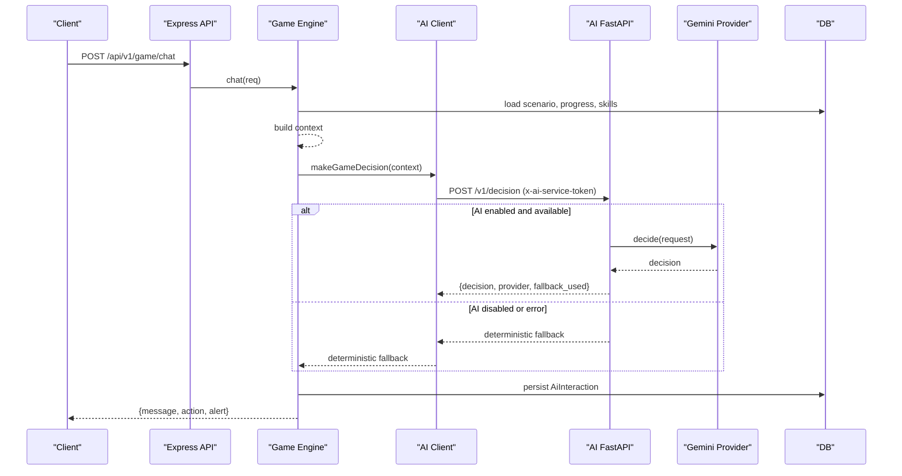
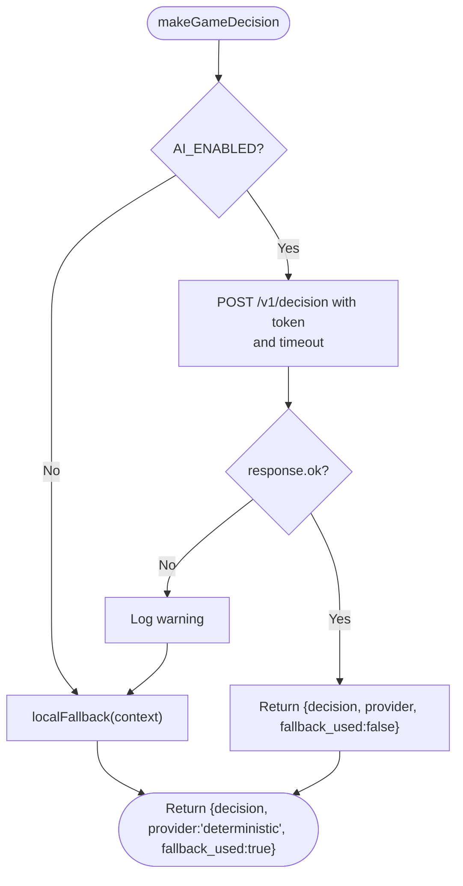
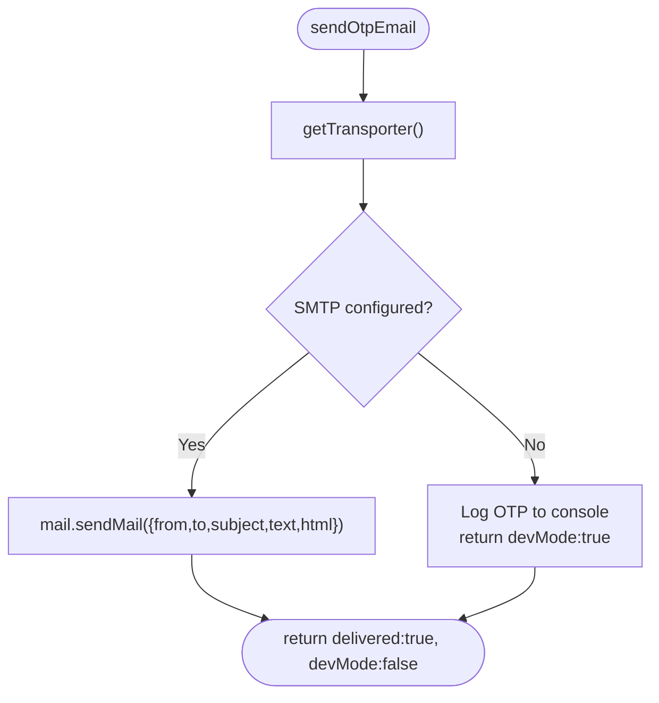
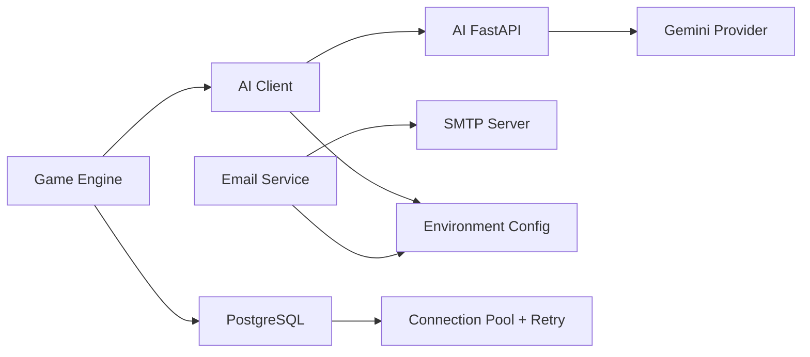

# External Integrations

<cite>
**Referenced Files in This Document**
- [backend/services/ai-service.js](file://backend/services/ai-service.js)
- [backend/services/email-service.js](file://backend/services/email-service.js)
- [backend/config/env.js](file://backend/config/env.js)
- [backend/ai-service/app/main.py](file://backend/ai-service/app/main.py)
- [backend/ai-service/app/provider.py](file://backend/ai-service/app/provider.py)
- [backend/ai-service/app/config.py](file://backend/ai-service/app/config.py)
- [backend/services/game-engine.js](file://backend/services/game-engine.js)
- [backend/middleware/security.js](file://backend/middleware/security.js)
- [backend/middleware/authMiddleware.js](file://backend/middleware/authMiddleware.js)
- [backend/models/AnalyticsEvent.js](file://backend/models/AnalyticsEvent.js)
- [backend/config/db.js](file://backend/config/db.js)
- [backend/app.js](file://backend/app.js)
</cite>

## Table of Contents
1. Introduction
2. Project Structure
3. Core Components
4. Architecture Overview
5. Detailed Component Analysis
6. Dependency Analysis
7. Performance Considerations
8. Troubleshooting Guide
9. Conclusion

## Introduction
This document explains how the application integrates with external services, focusing on:
- AI decision service (internal FastAPI service that can call Google Gemini)
- Email delivery via SMTP
- Analytics event persistence for later export or integration
It also documents configuration requirements, environment variables, security considerations, and resilience patterns such as timeouts, fallbacks, rate limiting, and connection pooling.

## Project Structure
The integrations are implemented across a few key areas:
- AI decision flow: game engine builds context, calls an internal AI service, and falls back to deterministic logic when needed.
- Email OTP delivery: email service composes messages and sends them via SMTP; if SMTP is not configured, it logs OTPs in dev mode.
- Analytics: events are persisted to a database model for later processing or export.
- Configuration: centralized environment schema validates all required settings for integrations.
- Security: request IDs, input sanitization, rate limits, and token-based authentication protect endpoints and inter-service communication.

**Diagram sources**
- [backend/app.js:15-49](file://backend/app.js#L15-L49)
- [backend/services/game-engine.js:66-121](file://backend/services/game-engine.js#L66-L121)
- [backend/services/ai-service.js:18-48](file://backend/services/ai-service.js#L18-L48)
- [backend/ai-service/app/main.py:14-32](file://backend/ai-service/app/main.py#L14-L32)
- [backend/ai-service/app/provider.py:18-37](file://backend/ai-service/app/provider.py#L18-L37)
- [backend/services/email-service.js:20-59](file://backend/services/email-service.js#L20-L59)
- [backend/config/db.js:7-13](file://backend/config/db.js#L7-L13)
- [backend/models/AnalyticsEvent.js:4-10](file://backend/models/AnalyticsEvent.js#L4-L10)

**Section sources**
- [backend/app.js:15-49](file://backend/app.js#L15-L49)
- [backend/config/env.js:6-31](file://backend/config/env.js#L6-L31)

## Core Components
- AI Decision Client: Builds a structured context from game state and player metrics, then calls the AI service with a timeout and a custom header token. On failure or when disabled, it uses a deterministic fallback.
- AI FastAPI Service: Validates requests using HMAC token comparison, optionally delegates to Gemini provider, and returns a normalized decision structure. It includes a health endpoint indicating active provider.
- Email Service: Creates a reusable transport based on SMTP settings and sends OTP emails. If SMTP is missing, it logs OTPs in development mode.
- Analytics Model: Defines a persistent schema for analytics events, enabling offline analysis or export pipelines.
- Environment Configuration: Centralized validation for all integration-related settings, including AI toggles, URLs, tokens, timeouts, and SMTP credentials.
- Security Middleware: Adds request IDs, rejects unsafe inputs, and applies rate limits to sensitive routes.

**Section sources**
- [backend/services/ai-service.js:18-48](file://backend/services/ai-service.js#L18-L48)
- [backend/ai-service/app/main.py:14-32](file://backend/ai-service/app/main.py#L14-L32)
- [backend/ai-service/app/provider.py:18-37](file://backend/ai-service/app/provider.py#L18-L37)
- [backend/services/email-service.js:20-59](file://backend/services/email-service.js#L20-L59)
- [backend/models/AnalyticsEvent.js:4-10](file://backend/models/AnalyticsEvent.js#L4-L10)
- [backend/config/env.js:6-31](file://backend/config/env.js#L6-L31)
- [backend/middleware/security.js:23-45](file://backend/middleware/security.js#L23-L45)

## Architecture Overview
The system uses layered abstractions to isolate external dependencies:
- The game engine constructs a rich context and delegates decisions to the AI client.
- The AI client enforces timeouts and falls back to deterministic logic when the AI service is unavailable or disabled.
- The AI FastAPI service authenticates incoming requests via HMAC token and optionally calls Gemini.
- Email delivery is abstracted behind a transporter that gracefully degrades to dev logging when SMTP is not configured.
- Database connections use a pool with retry settings for robustness.

**Diagram sources**
- [backend/services/game-engine.js:66-121](file://backend/services/game-engine.js#L66-L121)
- [backend/services/ai-service.js:18-48](file://backend/services/ai-service.js#L18-L48)
- [backend/ai-service/app/main.py:22-32](file://backend/ai-service/app/main.py#L22-L32)
- [backend/ai-service/app/provider.py:29-32](file://backend/ai-service/app/provider.py#L29-L32)

## Detailed Component Analysis

### AI Integration
Responsibilities:
- Build context from game state and player metrics.
- Call the AI service with a timeout and secure token.
- Provide deterministic fallback when AI is disabled or fails.

Key behaviors:
- Timeout protection via AbortController.
- Token passed via a custom header.
- Fallback logic selects hints, alerts, or explanations based on player signals and mistakes.

Request/response mapping:
- Internal context fields include player attributes, challenge details, allowed actions, and message.
- External response contains decision, provider name, and whether fallback was used.

Security:
- Inter-service token validated by HMAC comparison in the AI service.
- Timeouts prevent hanging requests.

Resilience:
- Deterministic fallback ensures gameplay continuity.
- Logging captures failures for observability.

**Diagram sources**
- [backend/services/ai-service.js:18-48](file://backend/services/ai-service.js#L18-L48)
- [backend/ai-service/app/main.py:22-32](file://backend/ai-service/app/main.py#L22-L32)

Configuration requirements:
- Enable AI and set URL, token, and timeout.
- See environment variables below.

**Section sources**
- [backend/services/ai-service.js:18-48](file://backend/services/ai-service.js#L18-L48)
- [backend/ai-service/app/main.py:14-32](file://backend/ai-service/app/main.py#L14-L32)
- [backend/ai-service/app/provider.py:18-37](file://backend/ai-service/app/provider.py#L18-L37)
- [backend/config/env.js:20-23](file://backend/config/env.js#L20-L23)

### Email Integration
Responsibilities:
- Compose OTP emails with text and HTML.
- Send via SMTP when configured; otherwise log OTP in dev mode.

Key behaviors:
- Transport is created once and reused.
- Graceful degradation when SMTP is not configured.

Security:
- No secrets stored in code; all settings come from environment.
- In dev mode, OTPs are logged to server console only.

Resilience:
- Missing SMTP does not block OTP generation; it switches to dev logging.

**Diagram sources**
- [backend/services/email-service.js:7-18](file://backend/services/email-service.js#L7-L18)
- [backend/services/email-service.js:20-59](file://backend/services/email-service.js#L20-L59)

Configuration requirements:
- SMTP host, port, secure flag, user, pass, and sender address.
- See environment variables below.

**Section sources**
- [backend/services/email-service.js:7-18](file://backend/services/email-service.js#L7-L18)
- [backend/services/email-service.js:20-59](file://backend/services/email-service.js#L20-L59)
- [backend/config/env.js:24-29](file://backend/config/env.js#L24-L29)

### Analytics Integration
Responsibilities:
- Persist analytics events with user ID, event type, payload, and platform.
- Events can be exported or forwarded to external analytics platforms later.

Current state:
- Model exists; controller is empty, indicating future integration points.

Security:
- Sensitive data should be sanitized before storing in payload.

Resilience:
- Writes go through the database layer which includes connection pooling and retries.

**Section sources**
- [backend/models/AnalyticsEvent.js:4-10](file://backend/models/AnalyticsEvent.js#L4-L10)
- [backend/controllers/analytics-controller.js:1-2](file://backend/controllers/analytics-controller.js#L1-L2)
- [backend/config/db.js:7-13](file://backend/config/db.js#L7-L13)

### Authentication and Security for External Calls
- JWT-based authentication protects API endpoints.
- Rate limiting guards auth, OTP, and write endpoints.
- Request IDs improve tracing across services.
- Unsafe input rejection prevents injection-like payloads.

**Section sources**
- [backend/middleware/authMiddleware.js:6-35](file://backend/middleware/authMiddleware.js#L6-L35)
- [backend/middleware/security.js:4-19](file://backend/middleware/security.js#L4-L19)
- [backend/middleware/security.js:23-45](file://backend/middleware/security.js#L23-L45)

## Dependency Analysis
External dependencies and their relationships:
- Game Engine depends on AI Client and Database models.
- AI Client depends on AI FastAPI service and environment configuration.
- AI FastAPI optionally depends on Gemini provider.
- Email Service depends on SMTP settings and Nodemailer.
- Database layer provides pooled connections and retries.

**Diagram sources**
- [backend/services/game-engine.js:66-121](file://backend/services/game-engine.js#L66-L121)
- [backend/services/ai-service.js:18-48](file://backend/services/ai-service.js#L18-L48)
- [backend/ai-service/app/main.py:22-32](file://backend/ai-service/app/main.py#L22-L32)
- [backend/ai-service/app/provider.py:18-37](file://backend/ai-service/app/provider.py#L18-L37)
- [backend/services/email-service.js:20-59](file://backend/services/email-service.js#L20-L59)
- [backend/config/db.js:7-13](file://backend/config/db.js#L7-L13)

**Section sources**
- [backend/services/game-engine.js:66-121](file://backend/services/game-engine.js#L66-L121)
- [backend/services/ai-service.js:18-48](file://backend/services/ai-service.js#L18-L48)
- [backend/ai-service/app/main.py:22-32](file://backend/ai-service/app/main.py#L22-L32)
- [backend/ai-service/app/provider.py:18-37](file://backend/ai-service/app/provider.py#L18-L37)
- [backend/services/email-service.js:20-59](file://backend/services/email-service.js#L20-L59)
- [backend/config/db.js:7-13](file://backend/config/db.js#L7-L13)

## Performance Considerations
- Connection pooling: PostgreSQL uses a configured pool with max/min connections, idle eviction, and acquire timeouts.
- Retries: Database layer includes retry attempts for transient failures.
- Timeouts: AI requests enforce a configurable timeout to avoid blocking the game loop.
- Rate limiting: Auth, OTP, and write endpoints are rate-limited to protect resources.
- Transport reuse: Email transporter is cached to reduce overhead.

Recommendations:
- Monitor AI service latency and adjust timeouts accordingly.
- Tune pool sizes based on concurrency and workload.
- Add circuit breaker patterns around AI and email calls if external outages become frequent.

[No sources needed since this section provides general guidance]

## Troubleshooting Guide
Common issues and resolutions:
- AI service unavailable:
  - Symptom: Game continues with deterministic responses.
  - Action: Check AI_ENABLED, AI_SERVICE_URL, AI_SERVICE_TOKEN, and network connectivity. Review logs for warnings about AI unavailability.
- SMTP not configured:
  - Symptom: OTP emails not sent; dev mode logs OTPs.
  - Action: Configure SMTP_HOST, SMTP_PORT, SMTP_SECURE, SMTP_USER, SMTP_PASS, and EMAIL_FROM.
- Authentication errors:
  - Symptom: 401 Unauthorized or invalid token.
  - Action: Verify JWT secrets and token versioning; ensure cookies or Authorization headers are correct.
- Rate limit hits:
  - Symptom: Too many requests errors on auth or OTP endpoints.
  - Action: Reduce request frequency or adjust rate limits if appropriate.

**Section sources**
- [backend/services/ai-service.js:18-48](file://backend/services/ai-service.js#L18-L48)
- [backend/services/email-service.js:20-59](file://backend/services/email-service.js#L20-L59)
- [backend/middleware/authMiddleware.js:6-35](file://backend/middleware/authMiddleware.js#L6-L35)
- [backend/middleware/security.js:23-45](file://backend/middleware/security.js#L23-L45)

## Conclusion
The application abstracts external integrations behind resilient layers:
- AI decisions are time-bounded and fall back deterministically when needed.
- Email delivery gracefully degrades when SMTP is not configured.
- Analytics events are persisted for future integration with external platforms.
- Security is enforced via tokens, rate limits, input validation, and request tracing.
Configuration is centralized and validated to ensure consistent behavior across environments. For production, enable HTTPS, rotate secrets, disable guest play, and consider adding circuit breakers and more sophisticated retry strategies for external services.

[No sources needed since this section summarizes without analyzing specific files]

## Appendices

### Environment Variables Reference
- AI integration:
  - AI_ENABLED: Boolean to enable/disable AI decisions.
  - AI_SERVICE_URL: Base URL of the internal AI FastAPI service.
  - AI_SERVICE_TOKEN: Secret token used for inter-service authentication.
  - AI_REQUEST_TIMEOUT_MS: Timeout for AI HTTP requests.
- Email integration:
  - SMTP_HOST, SMTP_PORT, SMTP_SECURE, SMTP_USER, SMTP_PASS: SMTP settings.
  - EMAIL_FROM: Sender address for OTP emails.
- General:
  - DATABASE_URL, DB_SSL: PostgreSQL connection and SSL options.
  - JWT_ACCESS_SECRET, JWT_REFRESH_SECRET: JWT signing secrets.
  - CORS_ORIGINS: Allowed origins for cross-origin requests.
  - LOG_LEVEL: Logging verbosity.
  - AUTO_SYNC: Auto-sync database schema (development only).
  - GUEST_PLAY_ENABLED: Allow guest play (disabled in production).

**Section sources**
- [backend/config/env.js:6-31](file://backend/config/env.js#L6-L31)

### Data Mapping Examples
- Game to AI context:
  - Player metrics (accuracy, mistake rate, mastery, streak) are transformed into structured fields for the AI decision request.
  - Challenge content (explanation, safe hint, allowed answers, alerts) is normalized before sending.
- AI response to game state:
  - Decision action maps to NPC reply, hint, or alert display.
  - Message content is sanitized and used as assistant response.
- Email payload:
  - OTP code and purpose determine subject and body templates.

**Section sources**
- [backend/services/game-engine.js:76-101](file://backend/services/game-engine.js#L76-L101)
- [backend/services/game-engine.js:103-121](file://backend/services/game-engine.js#L103-L121)
- [backend/services/email-service.js:20-59](file://backend/services/email-service.js#L20-L59)

### Security Considerations
- Inter-service token: HMAC comparison ensures only trusted callers reach the AI service.
- Input validation: Rejects unsafe characters in request bodies and queries.
- Rate limiting: Protects sensitive endpoints from abuse.
- Secrets management: All secrets loaded from environment; never hard-coded.
- TLS: Use HTTPS in production; configure DB SSL when required.

**Section sources**
- [backend/ai-service/app/main.py:14-16](file://backend/ai-service/app/main.py#L14-L16)
- [backend/middleware/security.js:10-19](file://backend/middleware/security.js#L10-L19)
- [backend/config/db.js:7-13](file://backend/config/db.js#L7-L13)