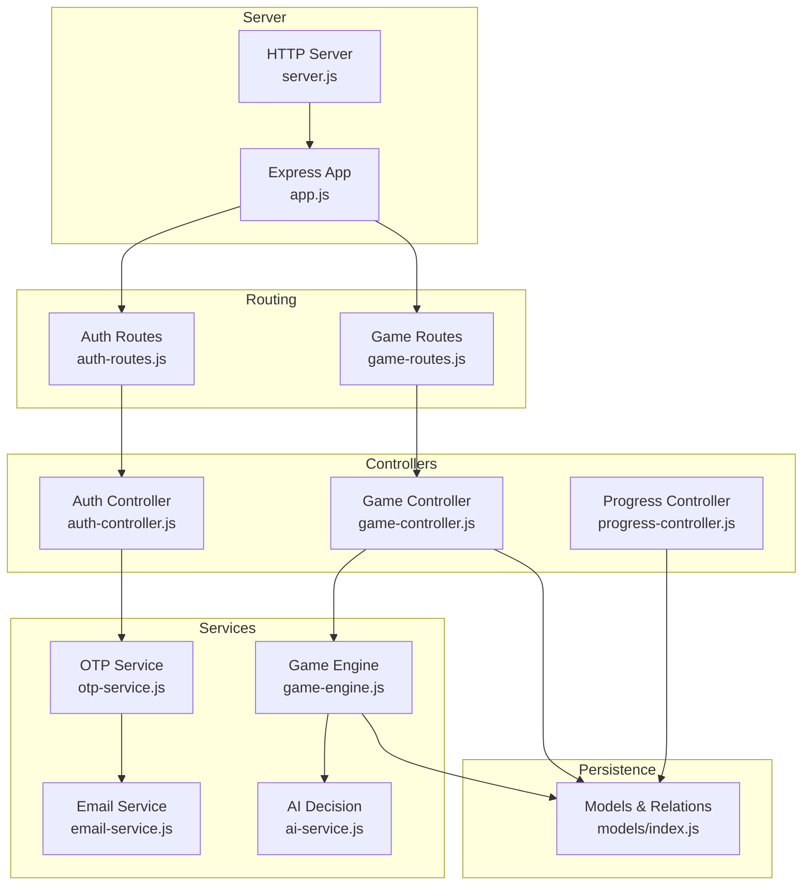
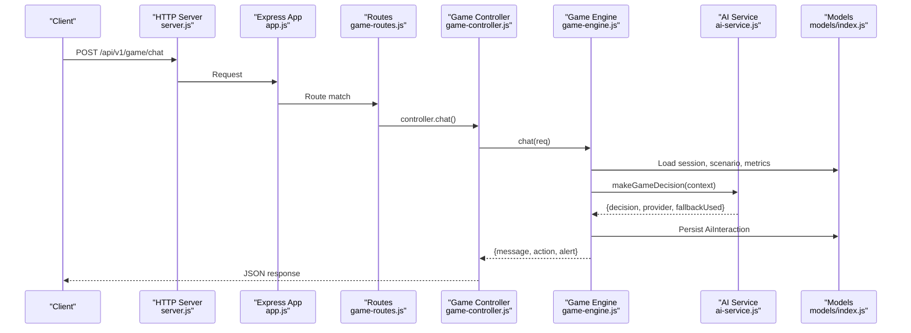
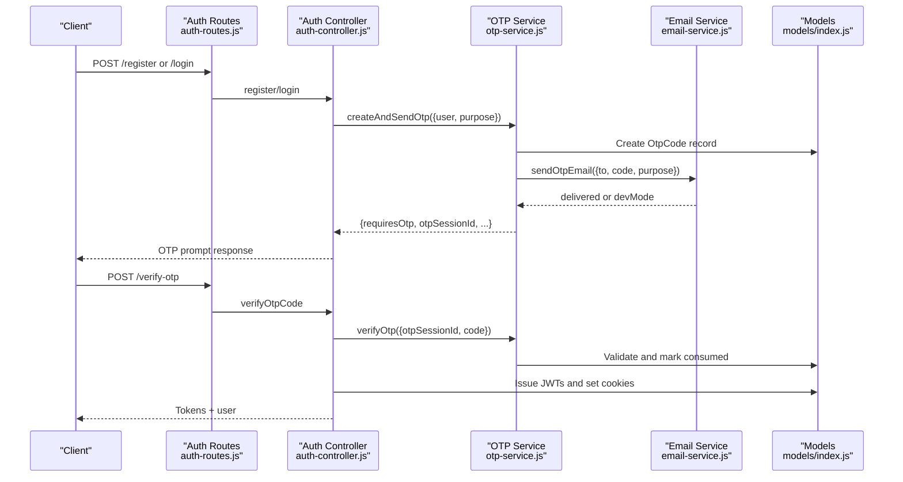
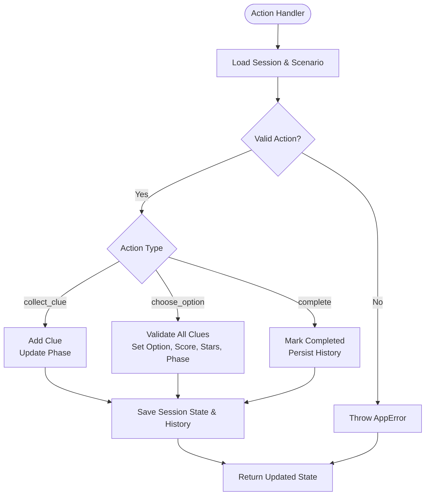
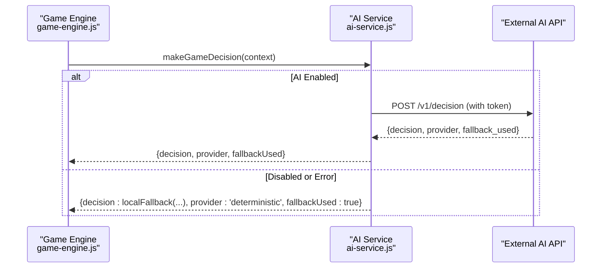
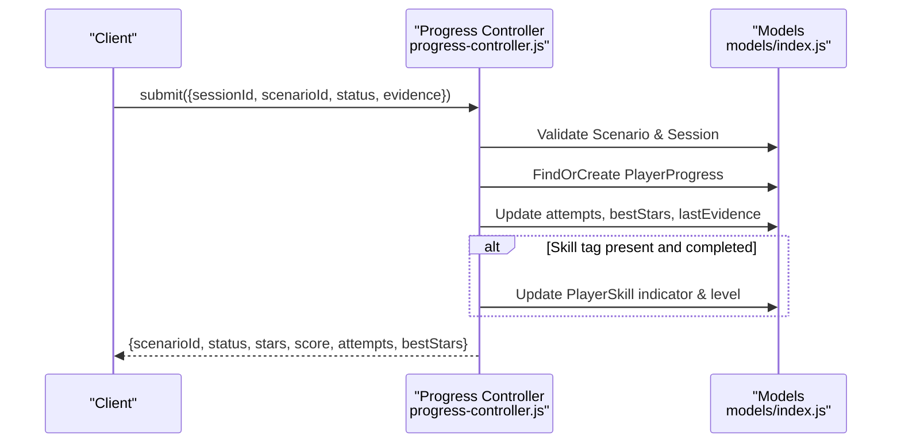
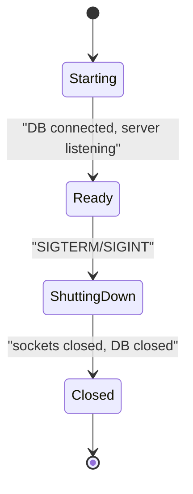
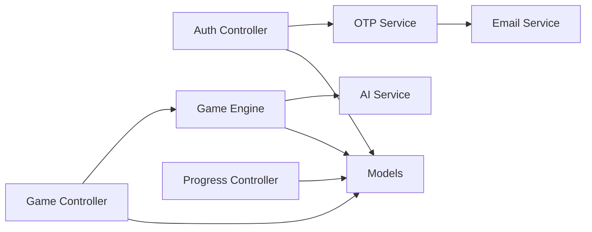

# Internal Service Dependencies

<cite>
**Referenced Files in This Document**
- [server.js](file://backend/server.js)
- [app.js](file://backend/app.js)
- [game-controller.js](file://backend/controllers/game-controller.js)
- [auth-controller.js](file://backend/controllers/auth-controller.js)
- [progress-controller.js](file://backend/controllers/progress-controller.js)
- [game-engine.js](file://backend/services/game-engine.js)
- [ai-service.js](file://backend/services/ai-service.js)
- [otp-service.js](file://backend/services/otp-service.js)
- [email-service.js](file://backend/services/email-service.js)
- [authMiddleware.js](file://backend/middleware/authMiddleware.js)
- [env.js](file://backend/config/env.js)
- [index.js](file://backend/models/index.js)
- [game-routes.js](file://backend/routes/game-routes.js)
- [auth-routes.js](file://backend/routes/auth-routes.js)
- [app-error.js](file://backend/utils/app-error.js)
</cite>

## Table of Contents
1. Introduction
2. Project Structure
3. Core Components
4. Architecture Overview
5. Detailed Component Analysis
6. Dependency Analysis
7. Performance Considerations
8. Troubleshooting Guide
9. Conclusion

## Introduction
This document explains how the application’s internal services depend on each other and communicate to orchestrate authentication, puzzle gameplay, progress tracking, and AI-assisted interactions. It details controller-to-service-to-model relationships, data flow, error propagation, service lifecycle management, and resource cleanup strategies. The goal is to make the system understandable for both technical and non-technical readers while providing precise references to source files.

## Project Structure
The backend follows a layered architecture:
- HTTP server bootstrapping and middleware pipeline
- Route definitions that delegate to controllers
- Controllers that enforce request boundaries and coordinate services
- Services encapsulating business logic (game engine, AI decisions, OTP/email)
- Models representing persistent entities with relationships
- Configuration and utilities for environment, errors, and async handling

**Diagram sources**
- [server.js:1-47](file://backend/server.js#L1-L47)
- [app.js:1-55](file://backend/app.js#L1-L55)
- [auth-routes.js:1-18](file://backend/routes/auth-routes.js#L1-L18)
- [game-routes.js:1-15](file://backend/routes/game-routes.js#L1-L15)
- [auth-controller.js:1-154](file://backend/controllers/auth-controller.js#L1-L154)
- [game-controller.js:1-128](file://backend/controllers/game-controller.js#L1-L128)
- [progress-controller.js:1-79](file://backend/controllers/progress-controller.js#L1-L79)
- [game-engine.js:1-124](file://backend/services/game-engine.js#L1-L124)
- [ai-service.js:1-51](file://backend/services/ai-service.js#L1-L51)
- [otp-service.js:1-99](file://backend/services/otp-service.js#L1-L99)
- [email-service.js:1-62](file://backend/services/email-service.js#L1-L62)
- [index.js:1-32](file://backend/models/index.js#L1-L32)

**Section sources**
- [server.js:1-47](file://backend/server.js#L1-L47)
- [app.js:1-55](file://backend/app.js#L1-L55)

## Core Components
- Authentication flow: JWT-based auth with OTP verification and email delivery.
- Game engine: Manages sessions, scenario state transitions, clue collection, decision making, and scoring.
- AI decision service: Optional external AI integration with deterministic fallback.
- Progress tracking: Persists outcomes, stars, scores, attempts, and skill indicators.
- Email service: Sends OTP codes via SMTP or logs them in dev mode.

Key responsibilities:
- Controllers validate inputs and coordinate services; they do not implement domain logic.
- Services encapsulate cross-cutting workflows and interact with models.
- Models define persistence and relationships.

**Section sources**
- [auth-controller.js:1-154](file://backend/controllers/auth-controller.js#L1-L154)
- [game-controller.js:1-128](file://backend/controllers/game-controller.js#L1-L128)
- [progress-controller.js:1-79](file://backend/controllers/progress-controller.js#L1-L79)
- [game-engine.js:1-124](file://backend/services/game-engine.js#L1-L124)
- [ai-service.js:1-51](file://backend/services/ai-service.js#L1-L51)
- [otp-service.js:1-99](file://backend/services/otp-service.js#L1-L99)
- [email-service.js:1-62](file://backend/services/email-service.js#L1-L62)
- [index.js:1-32](file://backend/models/index.js#L1-L32)

## Architecture Overview
The application uses an Express server with middleware for security, logging, and input validation. Routes mount feature-specific routers that call controllers. Controllers delegate to services for business logic. Services read/write models and may call external services (e.g., AI). Errors are propagated as structured AppError instances and handled centrally.

**Diagram sources**
- [server.js:1-47](file://backend/server.js#L1-L47)
- [app.js:1-55](file://backend/app.js#L1-L55)
- [game-routes.js:1-15](file://backend/routes/game-routes.js#L1-L15)
- [game-controller.js:1-128](file://backend/controllers/game-controller.js#L1-L128)
- [game-engine.js:1-124](file://backend/services/game-engine.js#L1-L124)
- [ai-service.js:1-51](file://backend/services/ai-service.js#L1-L51)
- [index.js:1-32](file://backend/models/index.js#L1-L32)

## Detailed Component Analysis

### Authentication Flow and OTP Lifecycle
Responsibilities:
- Register/login endpoints create users, send OTPs, verify codes, issue JWTs, and support refresh/logout.
- OTP service manages code generation, hashing, TTL, attempts, and delivery via email service.
- Email service sends emails if configured; otherwise logs OTP in dev mode.

Data flow highlights:
- Registration and login trigger OTP creation and sending; verification marks OTP consumed and issues tokens.
- Refresh validates token version to invalidate sessions when needed.

**Diagram sources**
- [auth-routes.js:1-18](file://backend/routes/auth-routes.js#L1-L18)
- [auth-controller.js:1-154](file://backend/controllers/auth-controller.js#L1-L154)
- [otp-service.js:1-99](file://backend/services/otp-service.js#L1-L99)
- [email-service.js:1-62](file://backend/services/email-service.js#L1-L62)
- [index.js:1-32](file://backend/models/index.js#L1-L32)

**Section sources**
- [auth-controller.js:1-154](file://backend/controllers/auth-controller.js#L1-L154)
- [otp-service.js:1-99](file://backend/services/otp-service.js#L1-L99)
- [email-service.js:1-62](file://backend/services/email-service.js#L1-L62)

### Game Engine Orchestration
Responsibilities:
- Start game sessions, manage state transitions (presentation -> exploration -> reveal -> completed), collect clues, enforce decision rules, persist history, and compute scores/stars.
- Provide chat interaction by assembling context from scenario content and player metrics, then calling AI decision service.

Controller-to-service-to-model relationships:
- Game controller validates actions and delegates to game engine.
- Game engine reads/writes GameSession, Scenario, PlayerProgress, PlayerSkill, AiInteraction, PlayerProfile.
- AI service optionally calls external AI endpoint; falls back deterministically if disabled or unavailable.

**Diagram sources**
- [game-controller.js:1-128](file://backend/controllers/game-controller.js#L1-L128)
- [game-engine.js:1-124](file://backend/services/game-engine.js#L1-L124)
- [index.js:1-32](file://backend/models/index.js#L1-L32)

**Section sources**
- [game-controller.js:1-128](file://backend/controllers/game-controller.js#L1-L128)
- [game-engine.js:1-124](file://backend/services/game-engine.js#L1-L124)

### AI Decision Integration
Responsibilities:
- Build context from scenario content and player metrics.
- Call external AI service with timeout and token; return decision with provider metadata.
- Fallback to deterministic logic when AI is disabled or fails.

**Diagram sources**
- [game-engine.js:1-124](file://backend/services/game-engine.js#L1-L124)
- [ai-service.js:1-51](file://backend/services/ai-service.js#L1-L51)

**Section sources**
- [ai-service.js:1-51](file://backend/services/ai-service.js#L1-L51)
- [game-engine.js:1-124](file://backend/services/game-engine.js#L1-L124)

### Progress Tracking and Skill Updates
Responsibilities:
- Submit progress after completing scenarios, computing stars/score based on session state.
- Update best stars, attempts, last evidence, and skill indicators per scenario tags.

**Diagram sources**
- [progress-controller.js:1-79](file://backend/controllers/progress-controller.js#L1-L79)
- [index.js:1-32](file://backend/models/index.js#L1-L32)

**Section sources**
- [progress-controller.js:1-79](file://backend/controllers/progress-controller.js#L1-L79)

### Service Lifecycle and Resource Cleanup
- Server startup: database connection established, Socket.IO initialized, HTTP server listens.
- Graceful shutdown: closes sockets, HTTP server, and database connection; enforces timeout to force exit.
- Email transporter: lazily created once per process and reused.
- AI requests: use AbortController with configurable timeout; ensure timeout cleared in finally block.

**Diagram sources**
- [server.js:1-47](file://backend/server.js#L1-L47)

**Section sources**
- [server.js:1-47](file://backend/server.js#L1-L47)
- [email-service.js:1-62](file://backend/services/email-service.js#L1-L62)
- [ai-service.js:1-51](file://backend/services/ai-service.js#L1-L51)

## Dependency Analysis
- Controllers depend on services for domain logic; services depend on models for persistence.
- Game engine depends on AI service for optional intelligence; OTP service depends on email service for delivery.
- Middleware provides authentication and input validation; routes wire controllers to endpoints.
- Environment configuration centralizes feature flags and external service settings.

**Diagram sources**
- [auth-controller.js:1-154](file://backend/controllers/auth-controller.js#L1-L154)
- [game-controller.js:1-128](file://backend/controllers/game-controller.js#L1-L128)
- [progress-controller.js:1-79](file://backend/controllers/progress-controller.js#L1-L79)
- [game-engine.js:1-124](file://backend/services/game-engine.js#L1-L124)
- [ai-service.js:1-51](file://backend/services/ai-service.js#L1-L51)
- [otp-service.js:1-99](file://backend/services/otp-service.js#L1-L99)
- [email-service.js:1-62](file://backend/services/email-service.js#L1-L62)
- [index.js:1-32](file://backend/models/index.js#L1-L32)

**Section sources**
- [env.js:1-40](file://backend/config/env.js#L1-L40)
- [index.js:1-32](file://backend/models/index.js#L1-L32)

## Performance Considerations
- Use lazy initialization for expensive resources (e.g., email transporter).
- Enforce timeouts for external calls (AI service) to prevent blocking.
- Keep session state minimal and persisted efficiently; avoid large payloads in memory.
- Limit retries and handle transient failures gracefully in AI integration.
- Leverage database indexes implied by model relations for common queries (userId, scenarioId).

[No sources needed since this section provides general guidance]

## Troubleshooting Guide
Common errors and propagation:
- Authentication failures: invalid or expired tokens raise structured errors; middleware converts JWT errors to AppError.
- OTP issues: invalid, expired, or max attempts reached produce specific error codes; wrong attempts increment counters.
- Game actions: invalid actions, missing clues, or already decided states throw conflict or bad request errors.
- AI unavailability: network errors or timeouts fall back to deterministic logic; warnings logged.

Error handling patterns:
- Controllers and services throw AppError with status code, code, and message.
- Central error handler processes AppError instances consistently across the app.

**Section sources**
- [authMiddleware.js:1-38](file://backend/middleware/authMiddleware.js#L1-L38)
- [otp-service.js:1-99](file://backend/services/otp-service.js#L1-L99)
- [game-controller.js:1-128](file://backend/controllers/game-controller.js#L1-L128)
- [ai-service.js:1-51](file://backend/services/ai-service.js#L1-L51)
- [app-error.js:1-12](file://backend/utils/app-error.js#L1-L12)

## Conclusion
The application cleanly separates concerns across controllers, services, and models, enabling robust authentication, gameplay, progress tracking, and optional AI assistance. Dependency injection is achieved through module-level imports and shared configuration, ensuring consistent instantiation and reuse of services. Errors propagate as structured exceptions, facilitating centralized handling and clear client feedback. Lifecycle management ensures graceful shutdown and efficient resource usage.

[No sources needed since this section summarizes without analyzing specific files]