# Client-Server Synchronization

<cite>
**Referenced Files in This Document**
- [game.js](file://backend/public/js/game.js)
- [world3d.js](file://backend/public/js/world3d.js)
- [api.js](file://backend/public/js/api.js)
- [puzzles.js](file://backend/public/js/puzzles.js)
- [game-controller.js](file://backend/controllers/game-controller.js)
- [game-routes.js](file://backend/routes/game-routes.js)
- [game-engine.js](file://backend/services/game-engine.js)
- [GameSession.js](file://backend/models/GameSession.js)
- [progress-controller.js](file://backend/controllers/progress-controller.js)
- [sockets/index.js](file://backend/sockets/index.js)
</cite>

## Table of Contents
1. [Introduction](#introduction)
2. [Project Structure](#project-structure)
3. [Core Components](#core-components)
4. [Architecture Overview](#architecture-overview)
5. [Detailed Component Analysis](#detailed-component-analysis)
6. [Dependency Analysis](#dependency-analysis)
7. [Performance Considerations](#performance-considerations)
8. [Troubleshooting Guide](#troubleshooting-guide)
9. [Conclusion](#conclusion)

## Introduction
This document explains how the game application synchronizes client-side Three.js 3D interactions with server-side state, covering the full session lifecycle from initialization to completion. It details request-response flows for user actions (collecting clues, choosing options), puzzle submissions, and progress updates. It also documents optimistic UI updates, error handling, retry strategies, and data consistency patterns when multiple clients interact with shared game state.

## Project Structure
The synchronization spans a thin client layer (Three.js world, puzzles, API wrapper) and a backend that owns authoritative game state:

- Client
  - Three.js world renders interactive objects and emits interaction events.
  - Puzzle engine runs local mini-games per clue.
  - API wrapper handles HTTP requests, auth, and mock mode.
  - Game orchestrator coordinates UI, world, puzzles, and API calls.

- Server
  - Routes expose REST endpoints for challenges, session start/state/action/chat, and progress.
  - Controller validates inputs and delegates to the game engine.
  - Engine manages sessions, scenario content, chat decisions, and metrics.
  - Models persist sessions and progress; sockets are initialized for future real-time features.

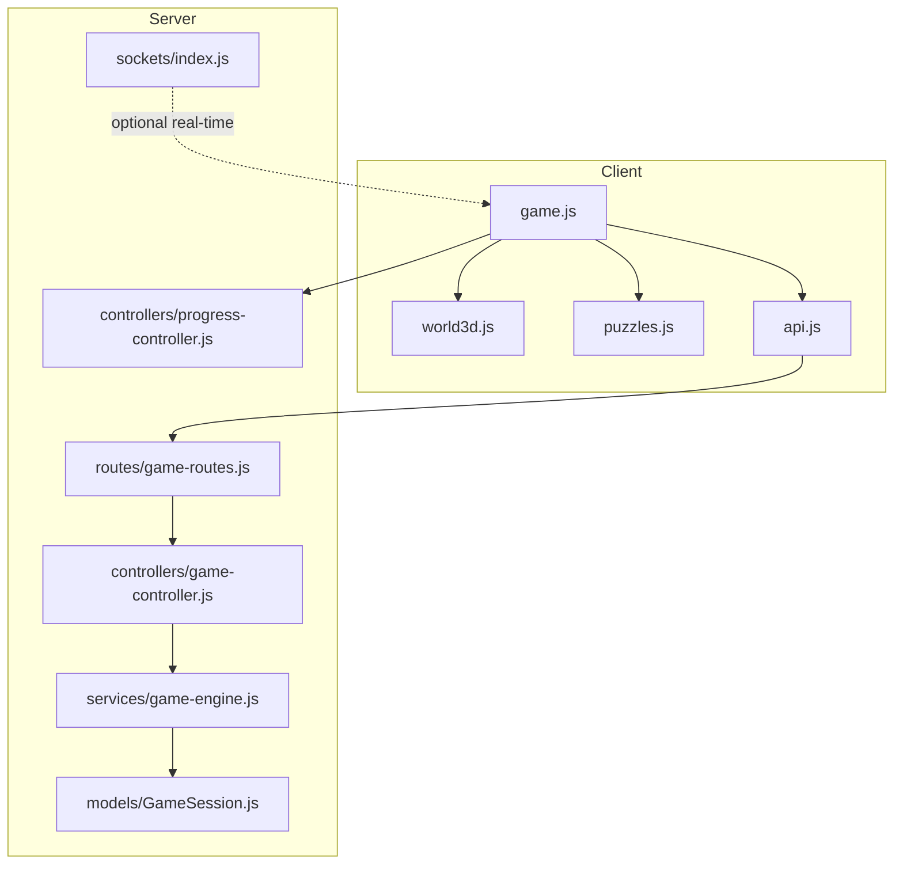

**Diagram sources**
- [game.js:382-482](file://backend/public/js/game.js#L382-L482)
- [world3d.js:1-30](file://backend/public/js/world3d.js#L1-L30)
- [puzzles.js:547-648](file://backend/public/js/puzzles.js#L547-L648)
- [api.js:170-204](file://backend/public/js/api.js#L170-L204)
- [game-routes.js:1-15](file://backend/routes/game-routes.js#L1-L15)
- [game-controller.js:18-128](file://backend/controllers/game-controller.js#L18-L128)
- [game-engine.js:51-64](file://backend/services/game-engine.js#L51-L64)
- [GameSession.js:1-15](file://backend/models/GameSession.js#L1-L15)
- [progress-controller.js:5-79](file://backend/controllers/progress-controller.js#L5-L79)
- [sockets/index.js:1-19](file://backend/sockets/index.js#L1-L19)

**Section sources**
- [game.js:382-482](file://backend/public/js/game.js#L382-L482)
- [game-routes.js:1-15](file://backend/routes/game-routes.js#L1-L15)
- [game-controller.js:18-128](file://backend/controllers/game-controller.js#L18-L128)
- [game-engine.js:51-64](file://backend/services/game-engine.js#L51-L64)
- [GameSession.js:1-15](file://backend/models/GameSession.js#L1-L15)
- [progress-controller.js:5-79](file://backend/controllers/progress-controller.js#L5-L79)
- [sockets/index.js:1-19](file://backend/sockets/index.js#L1-L19)

## Core Components
- Three.js World: Renders room, props, and interactive objects; tracks nearest object and emits interaction hints.
- Puzzle Engine: Runs localized skill puzzles per clue; resolves success/failure locally before syncing.
- API Wrapper: Centralizes HTTP calls, token management, guest/mock mode, and error normalization.
- Game Orchestrator: Manages session lifecycle, UI flow, and bridges world/puzzle actions to server state.
- Server Game Controller: Validates actions, enforces rules, persists state, and returns canonical state snapshots.
- Game Engine: Creates sessions, computes chat responses, and exposes scenario content and initial state.
- Progress Controller: Records completed attempts, stars, scores, and skill indicators.

**Section sources**
- [world3d.js:1-30](file://backend/public/js/world3d.js#L1-L30)
- [puzzles.js:547-648](file://backend/public/js/puzzles.js#L547-L648)
- [api.js:1-208](file://backend/public/js/api.js#L1-L208)
- [game.js:465-705](file://backend/public/js/game.js#L465-L705)
- [game-controller.js:18-128](file://backend/controllers/game-controller.js#L18-L128)
- [game-engine.js:5-124](file://backend/services/game-engine.js#L5-L124)
- [progress-controller.js:5-79](file://backend/controllers/progress-controller.js#L5-L79)

## Architecture Overview
The system uses an authoritative server model with optimistic UI updates on the client. The client performs local state changes immediately for responsiveness, then sends actions to the server. The server validates and persists the canonical state; the client reconciles by applying the returned state snapshot.

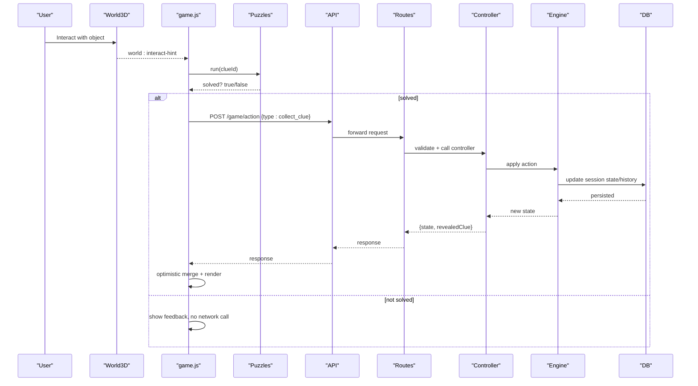

**Diagram sources**
- [world3d.js:244-293](file://backend/public/js/world3d.js#L244-L293)
- [game.js:539-631](file://backend/public/js/game.js#L539-L631)
- [puzzles.js:547-648](file://backend/public/js/puzzles.js#L547-L648)
- [api.js:177-182](file://backend/public/js/api.js#L177-L182)
- [game-routes.js:8-12](file://backend/routes/game-routes.js#L8-L12)
- [game-controller.js:52-116](file://backend/controllers/game-controller.js#L52-L116)
- [game-engine.js:51-64](file://backend/services/game-engine.js#L51-L64)

## Detailed Component Analysis

### Three.js World Interaction Flow
- The world builds props and assigns metadata (id, label, clueId).
- Each frame it computes distance to interactables, highlights nearest, and dispatches a custom event with the nearest object.
- The game listens for keyboard input or click to trigger interaction if near an object and not busy.

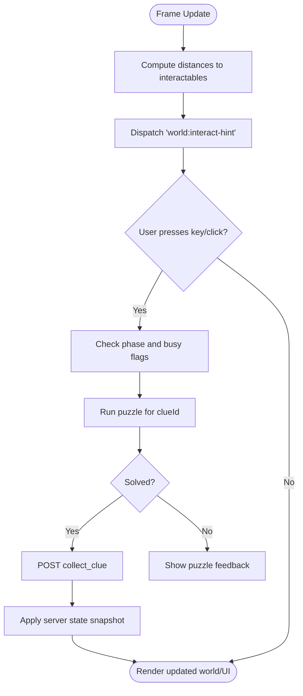

**Diagram sources**
- [world3d.js:221-293](file://backend/public/js/world3d.js#L221-L293)
- [game.js:375-380](file://backend/public/js/game.js#L375-L380)
- [game.js:539-557](file://backend/public/js/game.js#L539-L557)

**Section sources**
- [world3d.js:189-293](file://backend/public/js/world3d.js#L189-L293)
- [game.js:375-380](file://backend/public/js/game.js#L375-L380)
- [game.js:539-557](file://backend/public/js/game.js#L539-L557)

### Request-Response Cycle: Collect Clue
- Client triggers puzzle; on success, sends a collect_clue action with sessionId and clueId.
- Server validates phase, clue availability, duplicates, updates collected list, sets phase, records history, and persists.
- Client applies returned state and reveals clue UI.

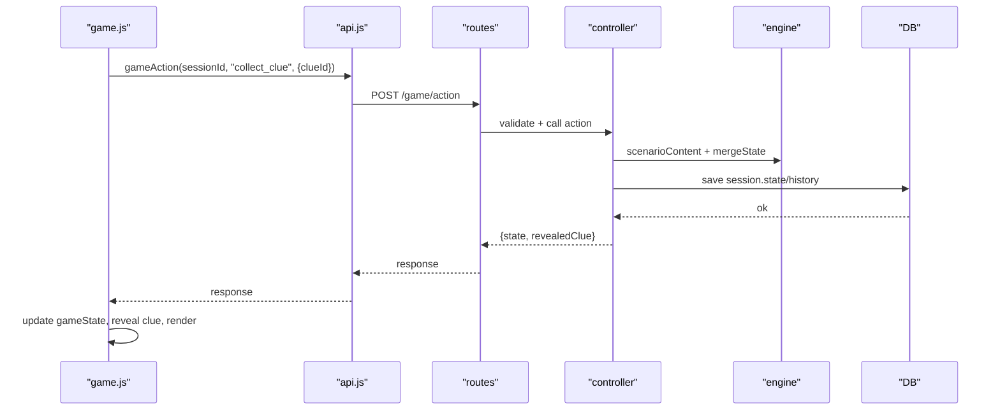

**Diagram sources**
- [game.js:623-631](file://backend/public/js/game.js#L623-L631)
- [api.js:177-182](file://backend/public/js/api.js#L177-L182)
- [game-routes.js:8-12](file://backend/routes/game-routes.js#L8-L12)
- [game-controller.js:52-116](file://backend/controllers/game-controller.js#L52-L116)

**Section sources**
- [game.js:623-631](file://backend/public/js/game.js#L623-L631)
- [game-controller.js:52-116](file://backend/controllers/game-controller.js#L52-L116)

### Request-Response Cycle: Choose Option and Complete
- After collecting all clues, the client presents options; selecting one triggers choose_option.
- Server ensures all clues are collected, validates option, sets score/stars/outcome, moves to reveal phase.
- Completing the mission sets phase to completed and marks completedAt.

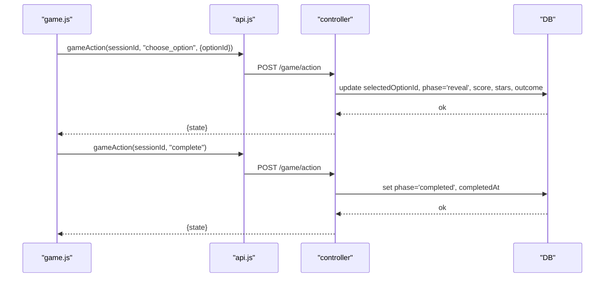

**Diagram sources**
- [game.js:633-641](file://backend/public/js/game.js#L633-L641)
- [game-controller.js:76-116](file://backend/controllers/game-controller.js#L76-L116)

**Section sources**
- [game.js:633-641](file://backend/public/js/game.js#L633-L641)
- [game-controller.js:76-116](file://backend/controllers/game-controller.js#L76-L116)

### Session Lifecycle: Initialization to Completion
- Initialization: load missions, start game for a scenario, create session with initial state.
- Exploration: collect clues via puzzles and sync; world marks clues visually.
- Decision: present options after all clues collected; submit choice.
- Completion: mark complete, submit progress, update skills, return to mission list.

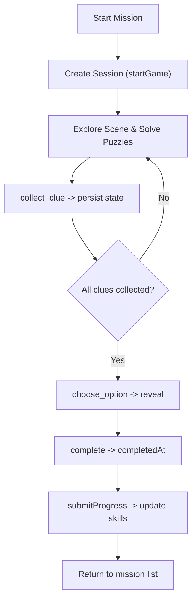

**Diagram sources**
- [game.js:465-482](file://backend/public/js/game.js#L465-L482)
- [game.js:623-705](file://backend/public/js/game.js#L623-L705)
- [game-controller.js:18-116](file://backend/controllers/game-controller.js#L18-L116)
- [progress-controller.js:5-79](file://backend/controllers/progress-controller.js#L5-L79)

**Section sources**
- [game.js:465-705](file://backend/public/js/game.js#L465-L705)
- [game-controller.js:18-116](file://backend/controllers/game-controller.js#L18-L116)
- [progress-controller.js:5-79](file://backend/controllers/progress-controller.js#L5-L79)

### Data Persistence and Recovery
- Sessions: JSONB state and history stored per session with expiration; controller asserts active sessions.
- Progress: PlayerProgress tracks bestStars, attempts, lastEvidence; skill indicators updated on completion.
- Recovery: Client stores access token and user info; API wrapper clears auth on 401 and provides fallbacks for guest/mock modes.

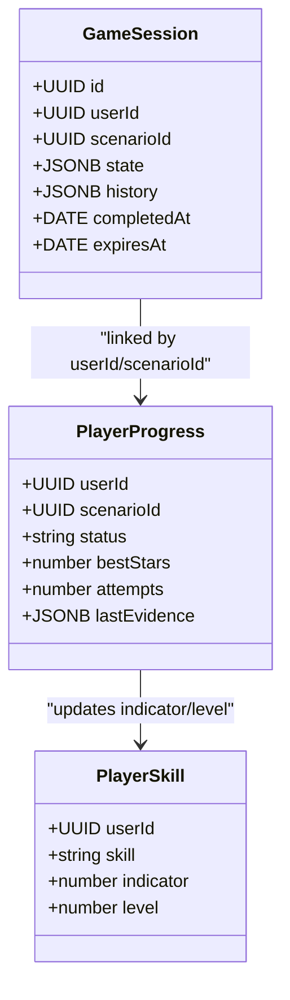

**Diagram sources**
- [GameSession.js:1-15](file://backend/models/GameSession.js#L1-L15)
- [progress-controller.js:26-59](file://backend/controllers/progress-controller.js#L26-L59)

**Section sources**
- [GameSession.js:1-15](file://backend/models/GameSession.js#L1-L15)
- [progress-controller.js:5-79](file://backend/controllers/progress-controller.js#L5-L79)
- [api.js:1-28](file://backend/public/js/api.js#L1-L28)

### Optimistic UI Updates and Reconciliation
- On collect_clue, the client immediately marks the clue as collected in the world and updates UI, then sends the action. If the server rejects (e.g., duplicate), the returned state will revert the change.
- On choose_option and complete, the client shows immediate feedback and animations, then applies the server’s final state snapshot.

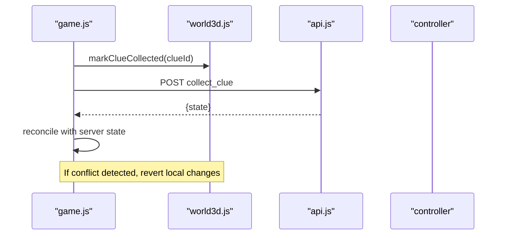

**Diagram sources**
- [game.js:553-557](file://backend/public/js/game.js#L553-L557)
- [game.js:623-631](file://backend/public/js/game.js#L623-L631)
- [game-controller.js:63-75](file://backend/controllers/game-controller.js#L63-L75)

**Section sources**
- [game.js:553-557](file://backend/public/js/game.js#L553-L557)
- [game.js:623-631](file://backend/public/js/game.js#L623-L631)
- [game-controller.js:63-75](file://backend/controllers/game-controller.js#L63-L75)

### Error Handling and Retry Strategies
- Network errors: API wrapper throws normalized errors; client surfaces messages and disables controls during busy states.
- Auth expiry: 401 clears auth and prompts re-login.
- Validation conflicts: Server returns specific codes (e.g., CLUE_ALREADY_COLLECTED, ALREADY_DECIDED); client prevents invalid actions and informs users.
- Retry: Busy guard prevents concurrent requests; client can retry after short delays on transient failures.

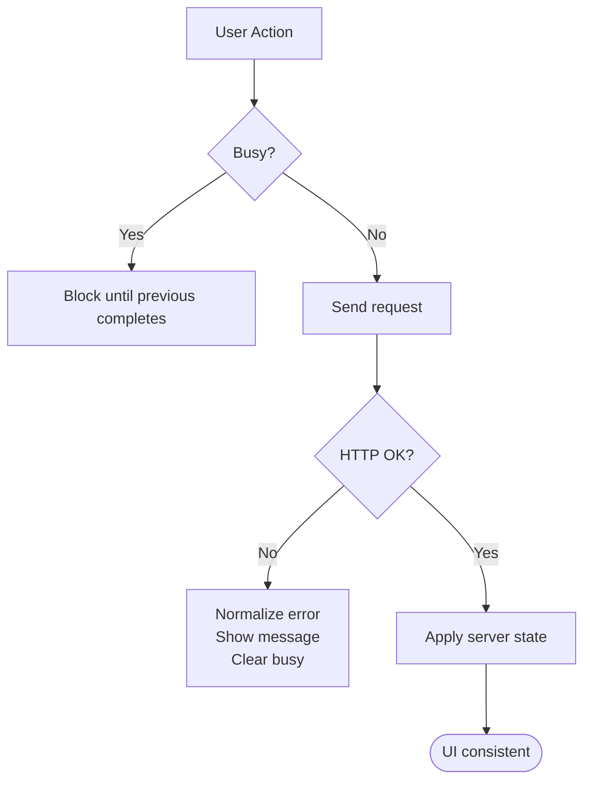

**Diagram sources**
- [api.js:30-61](file://backend/public/js/api.js#L30-L61)
- [game.js:110-127](file://backend/public/js/game.js#L110-L127)
- [game-controller.js:8-12](file://backend/controllers/game-controller.js#L8-L12)

**Section sources**
- [api.js:30-61](file://backend/public/js/api.js#L30-L61)
- [game.js:110-127](file://backend/public/js/game.js#L110-L127)
- [game-controller.js:8-12](file://backend/controllers/game-controller.js#L8-L12)

### Multi-Client Consistency and Conflict Resolution
- Authoritative server: All mutations go through the controller which validates against current session state and persists atomically.
- Conflict prevention: Duplicate clue collection and decision locking prevent race conditions.
- State reconciliation: Client always trusts server snapshot; any optimistic change is overwritten by server response.
- Real-time readiness: Socket infrastructure exists for joining game rooms; can be extended for live multi-client coordination.

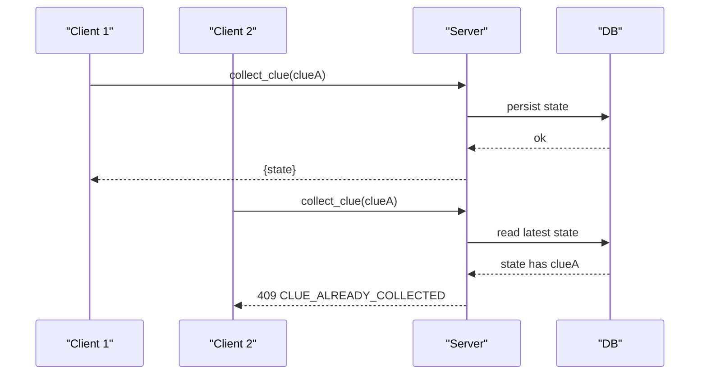

**Diagram sources**
- [game-controller.js:63-75](file://backend/controllers/game-controller.js#L63-L75)
- [sockets/index.js:3-15](file://backend/sockets/index.js#L3-L15)

**Section sources**
- [game-controller.js:63-75](file://backend/controllers/game-controller.js#L63-L75)
- [sockets/index.js:3-15](file://backend/sockets/index.js#L3-L15)

## Dependency Analysis
- Client dependencies:
  - game.js depends on world3d.js for rendering and interaction events, puzzles.js for clue challenges, and api.js for networking.
  - api.js depends on routes exposed by the server and handles auth persistence.

- Server dependencies:
  - game-routes.js wires controllers and validators.
  - game-controller.js depends on game-engine.js for business logic and models for persistence.
  - progress-controller.js depends on models to record outcomes and update skills.

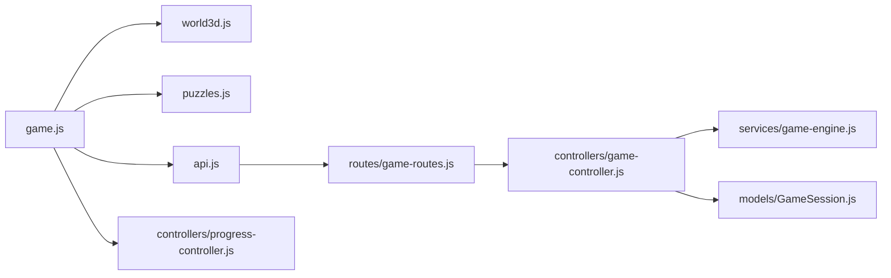

**Diagram sources**
- [game.js:382-705](file://backend/public/js/game.js#L382-L705)
- [world3d.js:1-30](file://backend/public/js/world3d.js#L1-L30)
- [puzzles.js:547-648](file://backend/public/js/puzzles.js#L547-L648)
- [api.js:170-204](file://backend/public/js/api.js#L170-L204)
- [game-routes.js:1-15](file://backend/routes/game-routes.js#L1-L15)
- [game-controller.js:18-128](file://backend/controllers/game-controller.js#L18-L128)
- [game-engine.js:51-64](file://backend/services/game-engine.js#L51-L64)
- [GameSession.js:1-15](file://backend/models/GameSession.js#L1-L15)
- [progress-controller.js:5-79](file://backend/controllers/progress-controller.js#L5-L79)

**Section sources**
- [game.js:382-705](file://backend/public/js/game.js#L382-L705)
- [game-routes.js:1-15](file://backend/routes/game-routes.js#L1-L15)
- [game-controller.js:18-128](file://backend/controllers/game-controller.js#L18-L128)
- [game-engine.js:51-64](file://backend/services/game-engine.js#L51-L64)
- [GameSession.js:1-15](file://backend/models/GameSession.js#L1-L15)
- [progress-controller.js:5-79](file://backend/controllers/progress-controller.js#L5-L79)

## Performance Considerations
- Minimize network calls: Only send actions after puzzle success; avoid redundant requests.
- Batch UI updates: Render once after receiving server state to reduce reflows.
- Efficient world updates: Use delta time and limit particle counts; dispose resources on scene exit.
- Debounce heavy operations: Use busy guards to prevent overlapping requests and UI thrashing.

[No sources needed since this section provides general guidance]

## Troubleshooting Guide
- Network errors: Check connectivity; API wrapper normalizes errors and clears busy state.
- Auth expired: Clear local auth and redirect to login; ensure tokens are refreshed.
- Invalid actions: Server returns validation errors; verify phases and required prerequisites (e.g., all clues collected).
- Stuck UI: Ensure busy flag is cleared; check for unhandled exceptions in event listeners.

**Section sources**
- [api.js:30-61](file://backend/public/js/api.js#L30-L61)
- [game.js:110-127](file://backend/public/js/game.js#L110-L127)
- [game-controller.js:8-12](file://backend/controllers/game-controller.js#L8-L12)

## Conclusion
The application implements robust client-server synchronization using an authoritative server model with optimistic UI updates. Three.js interactions are translated into well-defined API requests validated by the server, ensuring data consistency even under concurrent access. The session lifecycle is clearly modeled with persistent state and recovery mechanisms. Error handling and conflict resolution are explicit, providing a reliable experience across varying network conditions. Future enhancements can leverage the existing socket infrastructure for real-time collaboration.