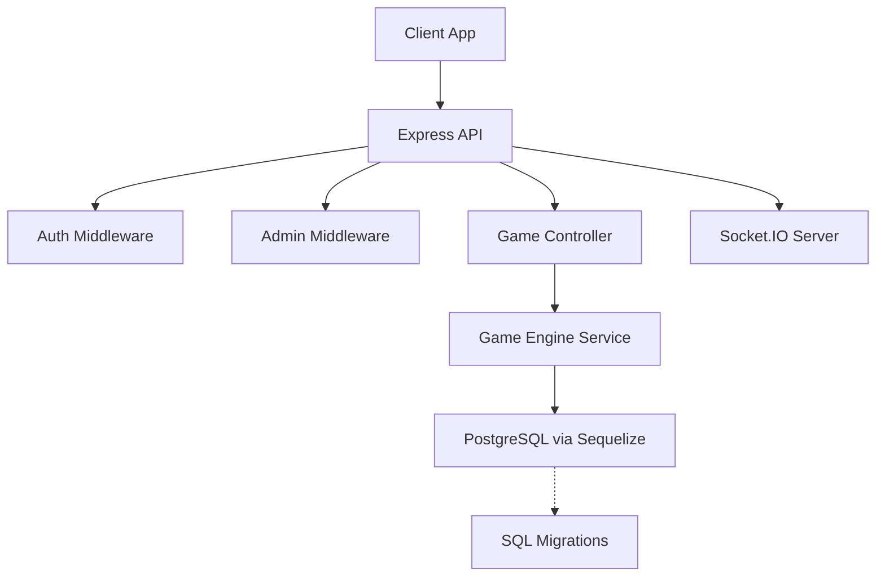
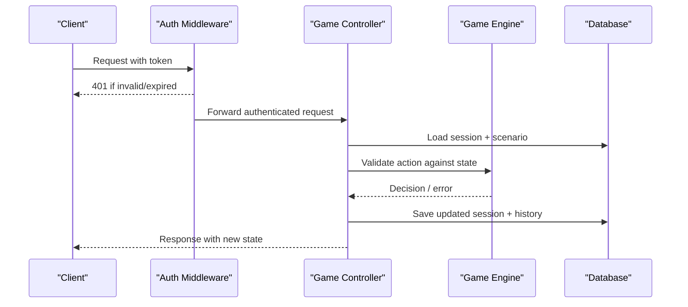
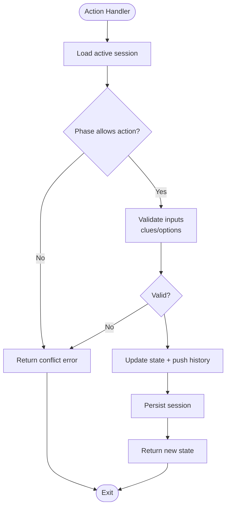
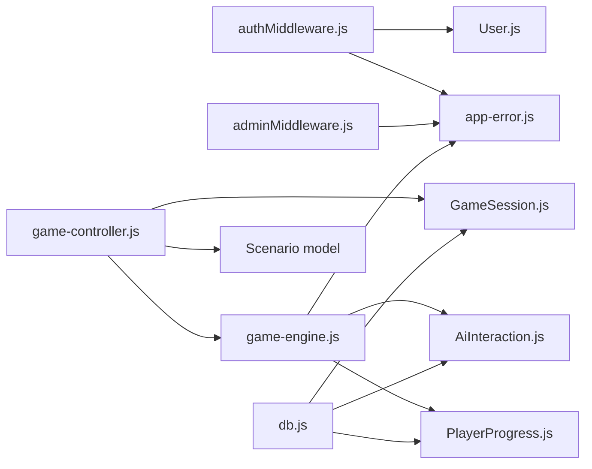

# Data Consistency & Conflict Resolution

<cite>
**Referenced Files in This Document**
- [authMiddleware.js](file://backend/middleware/authMiddleware.js)
- [adminMiddleware.js](file://backend/middleware/adminMiddleware.js)
- [auth-controller.js](file://backend/controllers/auth-controller.js)
- [game-controller.js](file://backend/controllers/game-controller.js)
- [game-engine.js](file://backend/services/game-engine.js)
- [db.js](file://backend/config/db.js)
- [GameSession.js](file://backend/models/GameSession.js)
- [User.js](file://backend/models/User.js)
- [PlayerProgress.js](file://backend/models/PlayerProgress.js)
- [AiInteraction.js](file://backend/models/AiInteraction.js)
- [otp-service.js](file://backend/services/otp-service.js)
- [index.js](file://backend/sockets/index.js)
- [app-error.js](file://backend/utils/app-error.js)
</cite>

## Table of Contents
1. Introduction
2. Project Structure
3. Core Components
4. Architecture Overview
5. Detailed Component Analysis
6. Dependency Analysis
7. Performance Considerations
8. Troubleshooting Guide
9. Conclusion

## Introduction
This document explains how the system maintains data consistency across distributed components and resolves conflicts when multiple clients act concurrently. It covers authentication middleware for access control, session-based game state management, conflict detection and prevention, versioning strategies, rollback patterns, and the trade-offs between consistency and availability. The focus is on ensuring that concurrent user actions do not corrupt shared state and that failures are handled safely.

## Project Structure
The backend is organized into controllers, services, models, middleware, configuration, and sockets:
- Controllers handle HTTP requests and orchestrate business logic.
- Services encapsulate domain operations (e.g., game engine, OTP).
- Models define database schemas using Sequelize.
- Middleware enforces authentication and authorization.
- Configuration manages database connections and environment settings.
- Sockets provide real-time room management for games.

**Diagram sources**
- [db.js:7-13](file://backend/config/db.js#L7-L13)
- [game-controller.js:18-120](file://backend/controllers/game-controller.js#L18-L120)
- [game-engine.js:51-123](file://backend/services/game-engine.js#L51-L123)
- [index.js:3-16](file://backend/sockets/index.js#L3-L16)

**Section sources**
- [db.js:7-13](file://backend/config/db.js#L7-L13)
- [game-controller.js:18-120](file://backend/controllers/game-controller.js#L18-L120)
- [game-engine.js:51-123](file://backend/services/game-engine.js#L51-L123)
- [index.js:3-16](file://backend/sockets/index.js#L3-L16)

## Core Components
- Authentication and session validation: JWT-based auth with token versioning to invalidate sessions on logout or password changes.
- Game session state: JSONB-backed session state with an immutable history log for auditability and replay.
- Access control: Role-based middleware to restrict admin-only endpoints.
- Database layer: PostgreSQL with connection pooling and optional SSL; migrations applied at startup when configured.
- Real-time coordination: Socket.IO rooms for joining game contexts.

Key responsibilities:
- Prevent unauthorized access and enforce consistent user identity across requests.
- Ensure only one decision per scenario phase and prevent duplicate clue collection.
- Persist durable, auditable state transitions and outcomes.
- Provide safe defaults and normalization for AI-driven interactions.

**Section sources**
- [authMiddleware.js:6-35](file://backend/middleware/authMiddleware.js#L6-L35)
- [adminMiddleware.js:3-8](file://backend/middleware/adminMiddleware.js#L3-L8)
- [GameSession.js:4-12](file://backend/models/GameSession.js#L4-L12)
- [db.js:7-13](file://backend/config/db.js#L7-L13)
- [index.js:3-16](file://backend/sockets/index.js#L3-L16)

## Architecture Overview
The request flow ensures authenticated access, validates session state, applies business rules, persists changes, and returns consistent responses. Conflicts are detected early using explicit checks before writes.

**Diagram sources**
- [authMiddleware.js:6-35](file://backend/middleware/authMiddleware.js#L6-L35)
- [game-controller.js:18-120](file://backend/controllers/game-controller.js#L18-L120)
- [game-engine.js:51-123](file://backend/services/game-engine.js#L51-L123)
- [db.js:7-13](file://backend/config/db.js#L7-L13)

## Detailed Component Analysis

### Authentication and Session Versioning
- Tokens include a version field derived from the user’s tokenVersion. On logout or refresh, tokenVersion increments, invalidating existing tokens.
- Middleware verifies the token and compares the embedded version with the current user record to detect stale sessions.

Conflict resolution strategy:
- Token version acts as a lightweight optimistic lock for authentication state. If a client uses an old token after logout, it is rejected.

Rollback mechanism:
- Logout updates tokenVersion atomically; subsequent requests fail fast without partial state changes.

**Section sources**
- [authMiddleware.js:6-35](file://backend/middleware/authMiddleware.js#L6-L35)
- [auth-controller.js:10-14](file://backend/controllers/auth-controller.js#L10-L14)
- [auth-controller.js:100-121](file://backend/controllers/auth-controller.js#L100-L121)
- [User.js:5-16](file://backend/models/User.js#L5-L16)

### Game State Management and Conflict Prevention
- Sessions store phase-aware state and an append-only history. Actions are validated against the current phase and collected clues.
- Duplicate actions (e.g., collecting the same clue twice, choosing an option after a decision) are rejected with explicit conflict codes.

Conflict resolution strategy:
- Explicit preconditions guard each mutation. If violated, the operation fails immediately, preventing inconsistent states.
- History entries capture every attempted action with timestamps, enabling audit and potential replay.

Optimistic locking pattern:
- While there is no row-level version column on GameSession, the combination of userId-scoped session lookup plus strict precondition checks prevents cross-user interference and reduces race windows. For higher contention scenarios, consider adding a numeric version field and conditional updates.

Rollback behavior:
- Each action updates both state and history within a single save call. If persistence fails, the transaction boundary (managed by Sequelize/DB) ensures no partial writes persist.

**Diagram sources**
- [game-controller.js:52-116](file://backend/controllers/game-controller.js#L52-L116)

**Section sources**
- [game-controller.js:8-16](file://backend/controllers/game-controller.js#L8-L16)
- [game-controller.js:52-116](file://backend/controllers/game-controller.js#L52-L116)
- [GameSession.js:4-12](file://backend/models/GameSession.js#L4-L12)

### Chat and AI-Assisted Interactions
- Chat reads the active session and scenario, computes player metrics, and calls the AI service to produce a decision and message.
- AI interactions are persisted with expiration to bound storage growth.

Consistency considerations:
- Chat does not mutate core game decisions; it appends interaction records. This keeps critical path mutations minimal and focused.

**Section sources**
- [game-engine.js:66-123](file://backend/services/game-engine.js#L66-L123)
- [AiInteraction.js:4-12](file://backend/models/AiInteraction.js#L4-L12)

### Access Control and Authorization
- Admin-only routes require explicit role checks. Unauthorized attempts return a forbidden error.
- Combined with auth middleware, this ensures only verified users can access protected resources and only admins can perform administrative operations.

**Section sources**
- [adminMiddleware.js:3-8](file://backend/middleware/adminMiddleware.js#L3-L8)
- [authMiddleware.js:6-35](file://backend/middleware/authMiddleware.js#L6-L35)

### Database Layer and Transactions
- PostgreSQL is used with connection pooling and retry options.
- Migrations can be applied automatically in non-production environments; production should use controlled migrations.
- Sequelize handles transactions at the ORM level; while explicit transactions are not used in the analyzed code paths, each controller method performs a single save call, minimizing partial writes.

Recommendation:
- For high-contention updates (e.g., scoring or progress), wrap multi-step updates in a database transaction to ensure atomicity.

**Section sources**
- [db.js:7-13](file://backend/config/db.js#L7-L13)
- [db.js:15-42](file://backend/config/db.js#L15-L42)

### Real-Time Coordination
- Socket.IO rooms allow clients to join game contexts. Current implementation focuses on logging and room membership; actual event broadcasting is not shown here.

Use case:
- Use rooms to broadcast state updates or events to participants in a shared game context, complementing REST-based persistence.

**Section sources**
- [index.js:3-16](file://backend/sockets/index.js#L3-L16)

## Dependency Analysis
The following diagram shows key dependencies among modules involved in consistency and conflict handling.

**Diagram sources**
- [authMiddleware.js:1-5](file://backend/middleware/authMiddleware.js#L1-L5)
- [adminMiddleware.js:1-2](file://backend/middleware/adminMiddleware.js#L1-L2)
- [game-controller.js:1-6](file://backend/controllers/game-controller.js#L1-L6)
- [game-engine.js:1-3](file://backend/services/game-engine.js#L1-L3)
- [db.js:1-5](file://backend/config/db.js#L1-L5)

**Section sources**
- [authMiddleware.js:1-5](file://backend/middleware/authMiddleware.js#L1-L5)
- [game-controller.js:1-6](file://backend/controllers/game-controller.js#L1-L6)
- [game-engine.js:1-3](file://backend/services/game-engine.js#L1-L3)
- [db.js:1-5](file://backend/config/db.js#L1-L5)

## Performance Considerations
- Connection pooling: Configured pool size and idle eviction reduce resource exhaustion under load.
- Read-heavy vs write-heavy: Game state reads are frequent; caching scenario content or computed metrics may reduce DB pressure.
- Append-only history: Keeps writes small but grows over time; consider pruning expired histories or archiving completed sessions.
- AI chat: External service calls add latency; consider timeouts and retries with backoff.
- Trade-offs: Strict preconditions and validations improve consistency but increase request complexity. For very high concurrency, consider server-side authoritative state with short-lived locks or optimistic versioning to reduce contention.

[No sources needed since this section provides general guidance]

## Troubleshooting Guide
Common issues and resolutions:
- Unauthorized or invalid token: Occurs when tokens are missing, malformed, or version mismatched after logout. Verify token presence and ensure clients re-authenticate after logout.
- Session not found or expired: Active session must exist and not be completed or expired. Ensure sessionId matches the authenticated user and session has not expired.
- Conflict errors: Duplicate clue collection or choosing an option after a decision triggers conflict responses. Clients should refresh state and avoid redundant actions.
- OTP verification failures: Expired or consumed codes, or too many attempts, result in specific error codes. Reissue OTP when appropriate.

Operational tips:
- Log database queries and socket events to trace flows.
- Use structured error codes to guide client recovery.
- Monitor session expiry and clean up inactive sessions periodically.

**Section sources**
- [authMiddleware.js:6-35](file://backend/middleware/authMiddleware.js#L6-L35)
- [game-controller.js:8-16](file://backend/controllers/game-controller.js#L8-L16)
- [game-controller.js:52-116](file://backend/controllers/game-controller.js#L52-L116)
- [otp-service.js:58-83](file://backend/services/otp-service.js#L58-L83)

## Conclusion
The system enforces data consistency through:
- Strong authentication with token versioning to invalidate stale sessions.
- Phase-aware game state with explicit preconditions to prevent conflicting updates.
- Append-only history for auditability and replay.
- Role-based access control to protect sensitive operations.
- Robust database configuration with pooling and migrations.

For higher contention scenarios, consider adding explicit optimistic version fields and wrapping multi-step updates in database transactions. Balance consistency with availability by carefully designing idempotent operations, leveraging append-only logs, and using short-lived locks where necessary.

[No sources needed since this section summarizes without analyzing specific files]