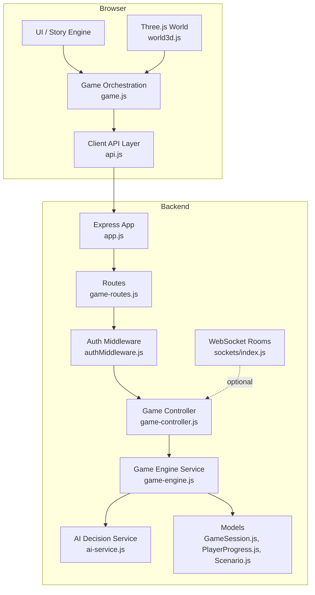
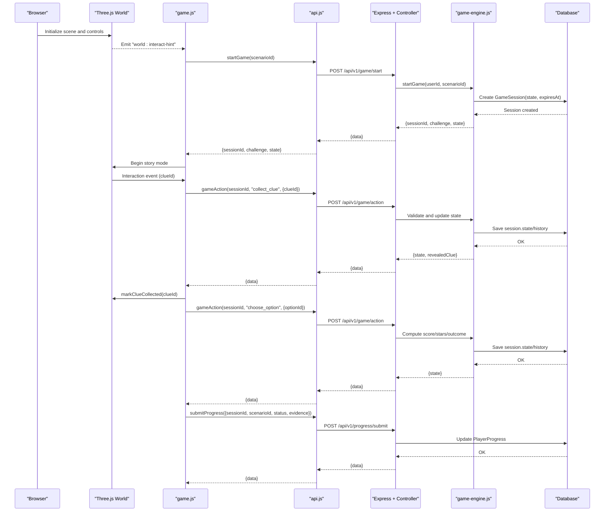
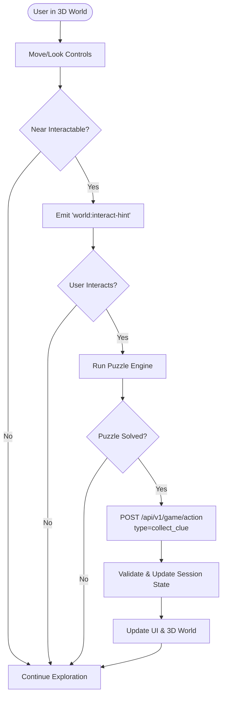
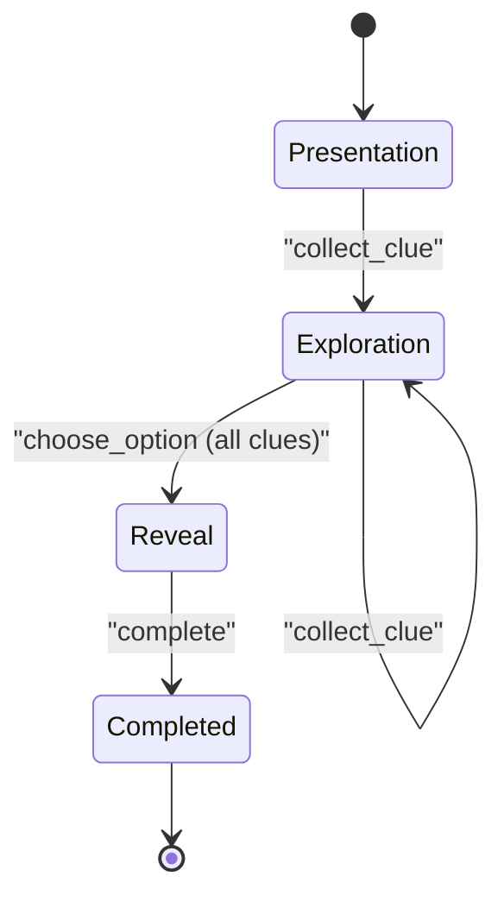
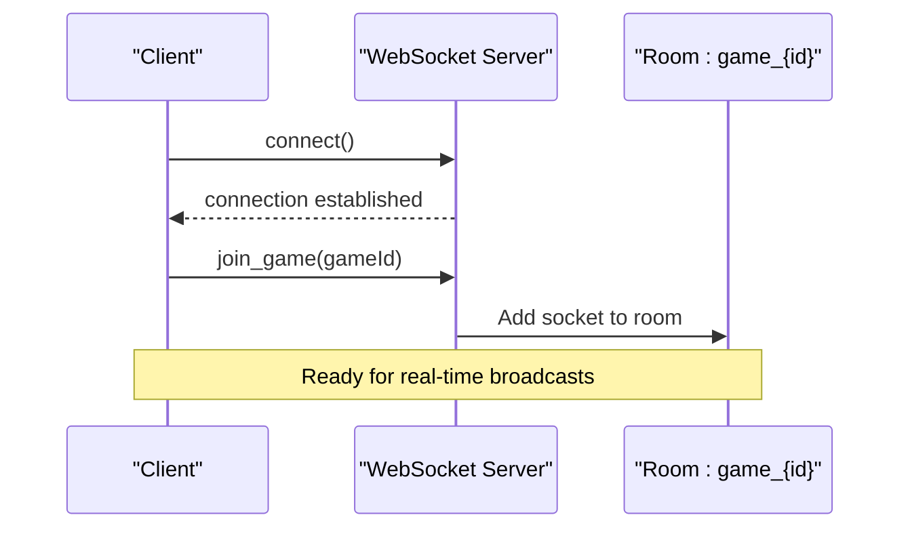
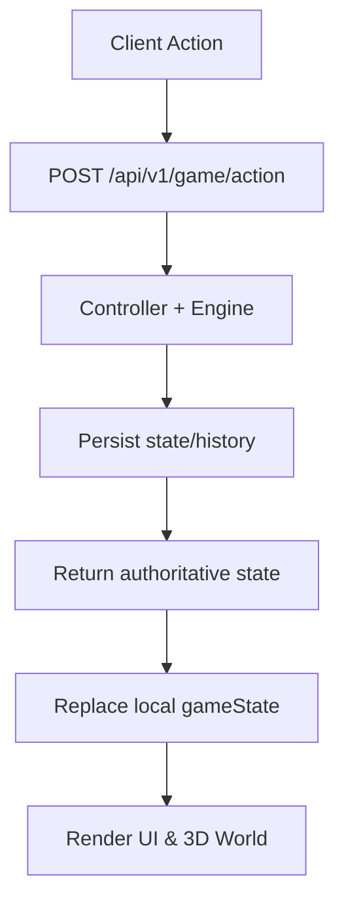
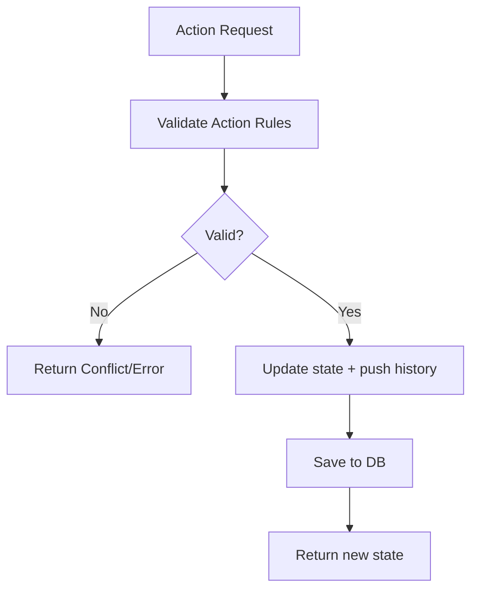
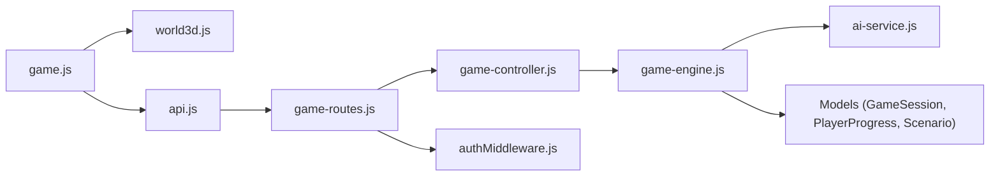

# Data Flow & State Management

<cite>
**Referenced Files in This Document**
- [app.js](file://backend/app.js)
- [game-routes.js](file://backend/routes/game-routes.js)
- [game-controller.js](file://backend/controllers/game-controller.js)
- [game-engine.js](file://backend/services/game-engine.js)
- [ai-service.js](file://backend/services/ai-service.js)
- [authMiddleware.js](file://backend/middleware/authMiddleware.js)
- [GameSession.js](file://backend/models/GameSession.js)
- [PlayerProgress.js](file://backend/models/PlayerProgress.js)
- [Scenario.js](file://backend/models/Scenario.js)
- [scenario-controller.js](file://backend/controllers/scenario-controller.js)
- [api.js](file://backend/public/js/api.js)
- [game.js](file://backend/public/js/game.js)
- [world3d.js](file://backend/public/js/world3d.js)
- [index.js](file://backend/sockets/index.js)
</cite>

## Table of Contents
1. Introduction
2. Project Structure
3. Core Components
4. Architecture Overview
5. Detailed Component Analysis
6. Dependency Analysis
7. Performance Considerations
8. Troubleshooting Guide
9. Conclusion

## Introduction
This document explains how user interactions in the Three.js 3D world are translated into API requests and database updates, how client and server state synchronize, and how game sessions flow from initialization to completion with persistence and recovery. It also covers real-time patterns via WebSocket rooms, data consistency and conflict resolution strategies, optimistic UI updates, caching strategies for large datasets, and performance optimizations.

## Project Structure
The application is a Node/Express backend serving a browser-based frontend that includes a Three.js 3D world, story engine, and puzzle system. The backend exposes REST endpoints for authentication, scenarios, game session management, progress tracking, scoring, resources, and analytics. A small WebSocket layer supports per-game rooms for future multiplayer features.

**Diagram sources**
- [app.js:15-50](file://backend/app.js#L15-L50)
- [game-routes.js:1-15](file://backend/routes/game-routes.js#L1-L15)
- [authMiddleware.js:6-35](file://backend/middleware/authMiddleware.js#L6-L35)
- [game-controller.js:18-120](file://backend/controllers/game-controller.js#L18-L120)
- [game-engine.js:51-123](file://backend/services/game-engine.js#L51-L123)
- [ai-service.js:18-48](file://backend/services/ai-service.js#L18-L48)
- [GameSession.js:4-12](file://backend/models/GameSession.js#L4-L12)
- [PlayerProgress.js:4-14](file://backend/models/PlayerProgress.js#L4-L14)
- [Scenario.js:4-15](file://backend/models/Scenario.js#L4-L15)
- [index.js:3-16](file://backend/sockets/index.js#L3-L16)

**Section sources**
- [app.js:15-50](file://backend/app.js#L15-L50)
- [game-routes.js:1-15](file://backend/routes/game-routes.js#L1-L15)

## Core Components
- Client orchestration (game.js): Manages screens, mission selection, session lifecycle, 3D world integration, clue collection, decision making, and finalization.
- Three.js world (world3d.js): Renders scene, handles movement/pointer lock, detects nearest interactable, emits interaction hints, and marks clues collected.
- Client API (api.js): Encapsulates HTTP calls, token handling, guest mode fallback, and mock responses for local development.
- Backend routes and controller (game-routes.js, game-controller.js): Define endpoints, validate input, enforce auth, and coordinate game actions.
- Game engine (game-engine.js): Creates sessions, validates actions, computes scores/states, integrates AI chat decisions, and persists history.
- AI service (ai-service.js): Provides deterministic fallback or remote AI decision based on environment configuration.
- Models (GameSession.js, PlayerProgress.js, Scenario.js): Persist sessions, player progress, and scenario content.
- WebSocket (sockets/index.js): Initializes socket connections and joins players to per-game rooms.

**Section sources**
- [game.js:8-20](file://backend/public/js/game.js#L8-L20)
- [world3d.js:7-29](file://backend/public/js/world3d.js#L7-L29)
- [api.js:3-14](file://backend/public/js/api.js#L3-L14)
- [game-routes.js:8-12](file://backend/routes/game-routes.js#L8-L12)
- [game-controller.js:18-120](file://backend/controllers/game-controller.js#L18-L120)
- [game-engine.js:51-123](file://backend/services/game-engine.js#L51-L123)
- [ai-service.js:18-48](file://backend/services/ai-service.js#L18-L48)
- [GameSession.js:4-12](file://backend/models/GameSession.js#L4-L12)
- [PlayerProgress.js:4-14](file://backend/models/PlayerProgress.js#L4-L14)
- [Scenario.js:4-15](file://backend/models/Scenario.js#L4-L15)
- [index.js:3-16](file://backend/sockets/index.js#L3-L16)

## Architecture Overview
The client initiates a game by starting a session, then interacts with the 3D world to collect clues and make decisions. Each action is validated server-side and persisted in a JSONB session state with an immutable history log. Completion triggers progress submission and score updates. Optional WebSocket rooms enable future real-time collaboration or live updates.

**Diagram sources**
- [game.js:465-482](file://backend/public/js/game.js#L465-L482)
- [game.js:539-557](file://backend/public/js/game.js#L539-L557)
- [game.js:623-641](file://backend/public/js/game.js#L623-L641)
- [game.js:677-705](file://backend/public/js/game.js#L677-L705)
- [api.js:170-199](file://backend/public/js/api.js#L170-L199)
- [game-routes.js:8-12](file://backend/routes/game-routes.js#L8-L12)
- [game-controller.js:18-120](file://backend/controllers/game-controller.js#L18-L120)
- [game-engine.js:51-123](file://backend/services/game-engine.js#L51-L123)
- [GameSession.js:4-12](file://backend/models/GameSession.js#L4-L12)
- [PlayerProgress.js:4-14](file://backend/models/PlayerProgress.js#L4-L14)

## Detailed Component Analysis

### Three.js World Interaction to Game Actions
- Movement and pointer lock are handled in the 3D world; when near an interactable, a hint is emitted to the UI.
- The UI listens for the hint and allows interaction via key press or click.
- On interaction, the client runs a puzzle; if solved, it calls the game action endpoint to collect the clue.
- The server validates the action, updates session state, records history, and returns updated state.
- The client updates the 3D world to reflect the collected clue visually.

**Diagram sources**
- [world3d.js:31-61](file://backend/public/js/world3d.js#L31-L61)
- [world3d.js:244-293](file://backend/public/js/world3d.js#L244-L293)
- [game.js:358-380](file://backend/public/js/game.js#L358-L380)
- [game.js:539-557](file://backend/public/js/game.js#L539-L557)
- [game-controller.js:52-116](file://backend/controllers/game-controller.js#L52-L116)

**Section sources**
- [world3d.js:31-61](file://backend/public/js/world3d.js#L31-L61)
- [world3d.js:244-293](file://backend/public/js/world3d.js#L244-L293)
- [game.js:358-380](file://backend/public/js/game.js#L358-L380)
- [game.js:539-557](file://backend/public/js/game.js#L539-L557)
- [game-controller.js:52-116](file://backend/controllers/game-controller.js#L52-L116)

### Game Session Lifecycle
- Initialization: Client calls startGame; server creates a GameSession with initial state and expiration time.
- Exploration: Client collects clues via gameAction; server enforces rules (e.g., all clues required before decision).
- Decision: Client chooses an option; server computes score, stars, outcome, and transitions phase to reveal.
- Completion: Client marks complete; server sets completedAt and returns final state; client submits progress.
- Recovery: Client can fetch current state using the state endpoint with sessionId; server merges initial state with persisted state and reveals clues based on collected IDs.

**Diagram sources**
- [game-controller.js:18-120](file://backend/controllers/game-controller.js#L18-L120)
- [game-engine.js:51-123](file://backend/services/game-engine.js#L51-L123)
- [GameSession.js:4-12](file://backend/models/GameSession.js#L4-L12)

**Section sources**
- [game-controller.js:18-120](file://backend/controllers/game-controller.js#L18-L120)
- [game-engine.js:51-123](file://backend/services/game-engine.js#L51-L123)
- [GameSession.js:4-12](file://backend/models/GameSession.js#L4-L12)

### Real-Time Data Streaming Patterns (Multiplayer)
- WebSocket initialization supports joining per-game rooms using a gameId.
- While not currently used for live state sync in the analyzed code, the room pattern enables broadcasting events like clue updates, opponent moves, or shared hints.
- Future integration could emit server-side events to clients in the same room after state changes.

**Diagram sources**
- [index.js:3-16](file://backend/sockets/index.js#L3-L16)

**Section sources**
- [index.js:3-16](file://backend/sockets/index.js#L3-L16)

### State Synchronization Between Client and Server
- Client maintains local state (missions, progress, sessionId, gameState, revealedClues, sessionXp).
- After each action, the server returns the authoritative state; client replaces local state to ensure consistency.
- For offline or degraded connectivity, the client uses a mock API fallback to continue development without backend.

**Diagram sources**
- [game.js:623-641](file://backend/public/js/game.js#L623-L641)
- [game-controller.js:52-116](file://backend/controllers/game-controller.js#L52-L116)
- [api.js:170-199](file://backend/public/js/api.js#L170-L199)

**Section sources**
- [game.js:623-641](file://backend/public/js/game.js#L623-L641)
- [game-controller.js:52-116](file://backend/controllers/game-controller.js#L52-L116)
- [api.js:170-199](file://backend/public/js/api.js#L170-L199)

### Data Consistency and Conflict Resolution
- Server enforces invariants: cannot collect already-collected clues, must collect all clues before choosing, cannot choose twice, must choose before completing.
- History array records every action timestamped, enabling auditability and potential replay/recovery.
- Expiration times prevent stale sessions from being used indefinitely.

**Diagram sources**
- [game-controller.js:52-116](file://backend/controllers/game-controller.js#L52-L116)
- [GameSession.js:4-12](file://backend/models/GameSession.js#L4-L12)

**Section sources**
- [game-controller.js:52-116](file://backend/controllers/game-controller.js#L52-L116)
- [GameSession.js:4-12](file://backend/models/GameSession.js#L4-L12)

### Optimistic UI Updates
- The client performs immediate visual feedback (e.g., marking clue collected in 3D world) after solving puzzles, then synchronizes with the server.
- If the server rejects the action, the client should revert UI changes; current implementation relies on server validation and error handling to maintain consistency.

**Section sources**
- [game.js:539-557](file://backend/public/js/game.js#L539-L557)
- [game-controller.js:52-116](file://backend/controllers/game-controller.js#L52-L116)

### Caching Strategies and Performance Optimizations
- Client-side caching:
  - LocalStorage stores access tokens and user profile for quick auth recovery.
  - Mock API provides offline-friendly responses during development.
- Server-side considerations:
  - Scenarios are filtered and sorted at query time; consider indexing published scenarios and age groups for performance.
  - Large payloads (e.g., scenario content) can be paginated or chunked if needed.
- Rendering optimizations:
  - Three.js renderer limits pixel ratio and uses efficient geometry/material reuse.
  - Animation loop caps delta time to avoid spikes.

**Section sources**
- [api.js:3-14](file://backend/public/js/api.js#L3-L14)
- [api.js:94-130](file://backend/public/js/api.js#L94-L130)
- [world3d.js:63-96](file://backend/public/js/world3d.js#L63-L96)
- [world3d.js:274-293](file://backend/public/js/world3d.js#L274-L293)

## Dependency Analysis
- Frontend dependencies:
  - game.js depends on world3d.js for 3D rendering and api.js for network calls.
  - api.js abstracts HTTP requests and provides mock fallbacks.
- Backend dependencies:
  - game-routes.js wires endpoints to game-controller.js.
  - game-controller.js orchestrates game-engine.js and persists via models.
  - game-engine.js integrates ai-service.js for chat decisions and reads/writes models.
  - authMiddleware.js protects routes and attaches user context.

**Diagram sources**
- [game.js:465-482](file://backend/public/js/game.js#L465-L482)
- [world3d.js:7-29](file://backend/public/js/world3d.js#L7-L29)
- [api.js:170-199](file://backend/public/js/api.js#L170-L199)
- [game-routes.js:8-12](file://backend/routes/game-routes.js#L8-L12)
- [game-controller.js:18-120](file://backend/controllers/game-controller.js#L18-L120)
- [game-engine.js:51-123](file://backend/services/game-engine.js#L51-L123)
- [ai-service.js:18-48](file://backend/services/ai-service.js#L18-L48)
- [authMiddleware.js:6-35](file://backend/middleware/authMiddleware.js#L6-L35)

**Section sources**
- [game-routes.js:8-12](file://backend/routes/game-routes.js#L8-L12)
- [game-controller.js:18-120](file://backend/controllers/game-controller.js#L18-L120)
- [game-engine.js:51-123](file://backend/services/game-engine.js#L51-L123)
- [ai-service.js:18-48](file://backend/services/ai-service.js#L18-L48)
- [authMiddleware.js:6-35](file://backend/middleware/authMiddleware.js#L6-L35)

## Performance Considerations
- Network:
  - Use bearer tokens efficiently; handle 401 errors to refresh auth state.
  - Batch independent loads (e.g., challenges, progress, score summary) where possible.
- Rendering:
  - Limit pixel ratio and use fog/shadows judiciously to reduce GPU load.
  - Avoid excessive dynamic objects; reuse geometries/materials.
- Database:
  - Index frequently queried fields (userId, scenarioId, isPublished).
  - Keep session.history concise; archive old histories periodically.
- AI:
  - Provide deterministic fallback when AI service is unavailable to maintain responsiveness.

[No sources needed since this section provides general guidance]

## Troubleshooting Guide
- Authentication failures:
  - Ensure token is present and valid; middleware verifies JWT and user version.
  - Handle 401 responses by clearing auth and prompting re-login.
- Session not found:
  - Verify sessionId matches active session and belongs to the authenticated user.
  - Check expiration time; expired sessions are rejected.
- Action conflicts:
  - Duplicate clue collection or repeated choices return conflict errors; client should disable further actions until resolved.
- AI chat issues:
  - If AI service is disabled or fails, deterministic fallback ensures replies still function.

**Section sources**
- [authMiddleware.js:6-35](file://backend/middleware/authMiddleware.js#L6-L35)
- [game-controller.js:8-16](file://backend/controllers/game-controller.js#L8-L16)
- [game-controller.js:52-116](file://backend/controllers/game-controller.js#L52-L116)
- [ai-service.js:18-48](file://backend/services/ai-service.js#L18-L48)

## Conclusion
The application implements a robust data flow from Three.js interactions to server-side validation and persistence, ensuring consistent state through authoritative server responses and detailed history logs. WebSocket rooms provide a foundation for real-time multiplayer features. Optimistic UI updates enhance responsiveness while maintaining integrity via strict server-side checks. Caching and performance optimizations improve scalability and user experience across large datasets and complex scenes.

[No sources needed since this section summarizes without analyzing specific files]