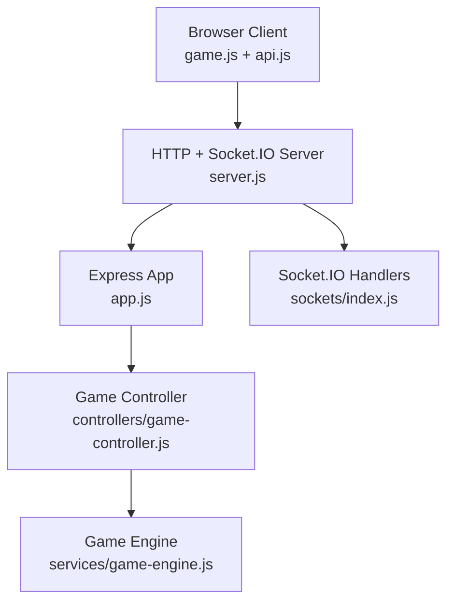
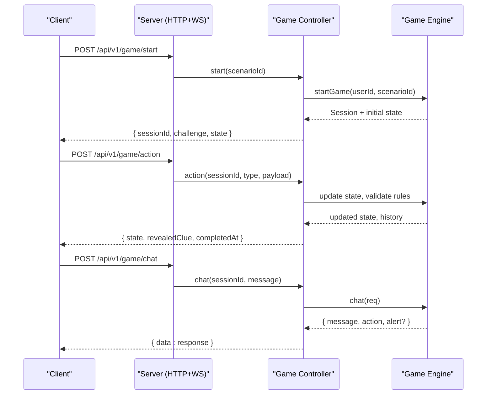
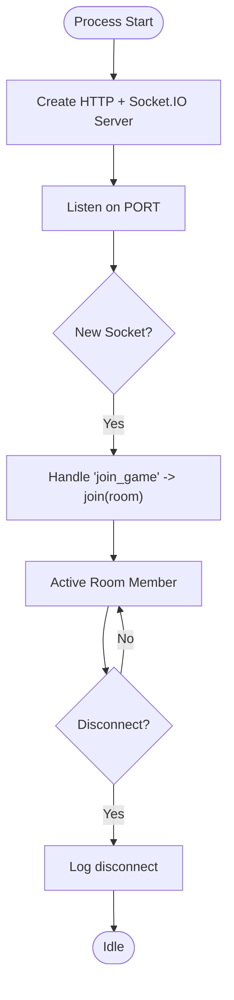
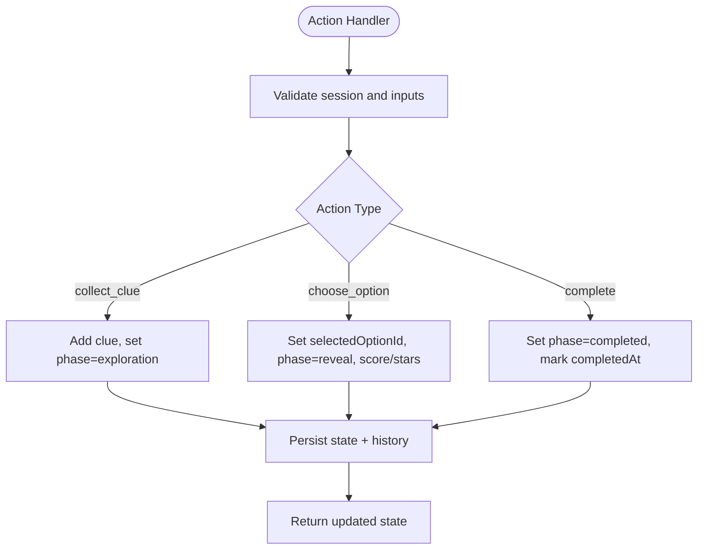
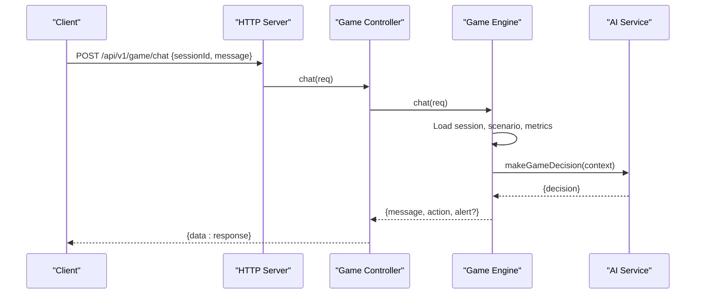
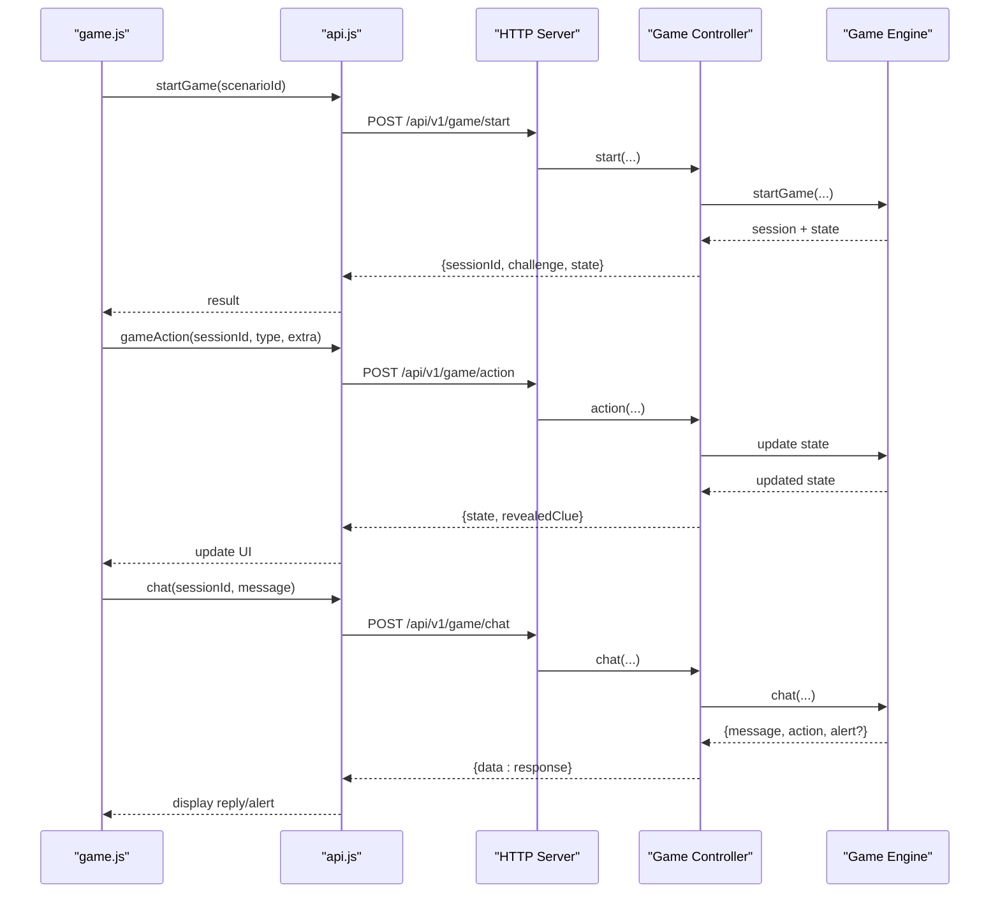
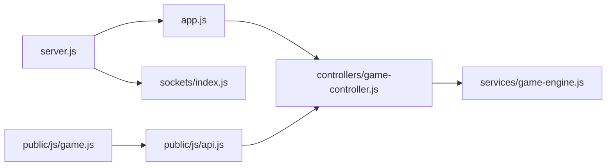

# Real-time Updates & WebSocket Events

<cite>
**Referenced Files in This Document**
- [server.js](file://backend/server.js)
- [sockets/index.js](file://backend/sockets/index.js)
- [app.js](file://backend/app.js)
- [game-controller.js](file://backend/controllers/game-controller.js)
- [game-engine.js](file://backend/services/game-engine.js)
- [api.js](file://backend/public/js/api.js)
- [game.js](file://backend/public/js/game.js)
</cite>

## Table of Contents
1. Introduction
2. Project Structure
3. Core Components
4. Architecture Overview
5. Detailed Component Analysis
6. Dependency Analysis
7. Performance Considerations
8. Troubleshooting Guide
9. Conclusion

## Introduction
This document explains how real-time communication is implemented across the application using Socket.IO and HTTP APIs. It covers connection establishment, event handling, room-based communication patterns, live updates for multiplayer features, chat functionality, and collaborative gameplay elements. It also documents event types, message formats, connection lifecycle management, reliability strategies, offline state handling, performance considerations for high-frequency updates, and scaling approaches for multi-server deployments.

## Project Structure
The real-time layer is composed of:
- A Node.js HTTP server that mounts an Express app and a Socket.IO server instance.
- A socket initialization module that registers events and rooms.
- Game controllers and services that manage game sessions and chat responses via HTTP.
- Frontend modules that drive the UI, initiate game flows, and communicate with the backend through REST endpoints.

**Diagram sources**
- [server.js:1-47](file://backend/server.js#L1-L47)
- [app.js:1-55](file://backend/app.js#L1-L55)
- [sockets/index.js:1-19](file://backend/sockets/index.js#L1-L19)
- [game-controller.js:1-128](file://backend/controllers/game-controller.js#L1-L128)
- [game-engine.js:1-124](file://backend/services/game-engine.js#L1-L124)

**Section sources**
- [server.js:1-47](file://backend/server.js#L1-L47)
- [app.js:1-55](file://backend/app.js#L1-L55)
- [sockets/index.js:1-19](file://backend/sockets/index.js#L1-L19)

## Core Components
- Socket.IO Server Initialization: The server creates a Socket.IO instance with CORS enabled and transports configured to support both WebSocket and polling fallbacks.
- Socket Event Handlers: The socket module logs connections, supports joining game rooms by ID, and logs disconnects.
- Game Flow via HTTP: The frontend uses REST endpoints to start games, perform actions (collect clues, choose options, complete), and chat with the AI assistant.
- Chat Assistant: The game engine processes chat messages, builds context from scenario content and player metrics, and returns structured responses including optional alerts.

Key responsibilities:
- Connection lifecycle: establish, join rooms, handle disconnects.
- Room-based communication: group sockets per game session or scenario.
- Live updates: currently driven by HTTP responses; Socket.IO rooms are available for future broadcast patterns.
- Chat: request-response flow returning NPC replies and safety alerts.

**Section sources**
- [server.js:10-25](file://backend/server.js#L10-L25)
- [sockets/index.js:3-16](file://backend/sockets/index.js#L3-L16)
- [game-controller.js:18-120](file://backend/controllers/game-controller.js#L18-L120)
- [game-engine.js:51-121](file://backend/services/game-engine.js#L51-L121)

## Architecture Overview
The system combines HTTP-driven game logic with Socket.IO for real-time channels. The current implementation uses HTTP for most game actions and chat, while Socket.IO provides room-based infrastructure ready for broadcasting live updates.

**Diagram sources**
- [game-controller.js:18-120](file://backend/controllers/game-controller.js#L18-L120)
- [game-engine.js:51-121](file://backend/services/game-engine.js#L51-L121)

## Detailed Component Analysis

### Socket.IO Setup and Lifecycle
- Server creation: The HTTP server is created and a Socket.IO server is attached with CORS and transport configuration.
- Connection handling: On connect, the socket is logged. Clients can join rooms using a game-scoped identifier. Disconnects are logged for observability.
- Graceful shutdown: On process signals, the server closes the Socket.IO server and database connections before exiting.

**Diagram sources**
- [server.js:10-25](file://backend/server.js#L10-L25)
- [sockets/index.js:3-16](file://backend/sockets/index.js#L3-L16)

**Section sources**
- [server.js:10-47](file://backend/server.js#L10-L47)
- [sockets/index.js:3-16](file://backend/sockets/index.js#L3-L16)

### Game Actions and State Management
- Start game: Creates a new session with an expiration window and initializes state.
- Action processing: Validates actions like collecting clues, choosing options, and completing scenarios. Enforces business rules such as requiring all clues before decision-making and preventing duplicate actions.
- State persistence: Updates and persists session state and history after each action.

**Diagram sources**
- [game-controller.js:52-116](file://backend/controllers/game-controller.js#L52-L116)

**Section sources**
- [game-controller.js:18-120](file://backend/controllers/game-controller.js#L18-L120)

### Chat Assistant Flow
- Request: Client sends a message with a session ID.
- Context building: The engine loads the active session, scenario content, and player metrics to build context.
- Decision: An AI service produces a decision including a message, optional action, and optional alert.
- Response: The controller returns the assistant’s message and any alert to the client.

**Diagram sources**
- [game-controller.js:118-120](file://backend/controllers/game-controller.js#L118-L120)
- [game-engine.js:66-121](file://backend/services/game-engine.js#L66-L121)

**Section sources**
- [game-controller.js:118-120](file://backend/controllers/game-controller.js#L118-L120)
- [game-engine.js:66-121](file://backend/services/game-engine.js#L66-L121)

### Frontend Integration and Live Updates
- API client: Provides methods to start games, perform actions, chat, and fetch resources. Includes guest mode and mock fallbacks for local development.
- Game UI: Drives mission selection, scene entry, clue collection, option choices, and completion flows. Uses HTTP calls to update state and render results.
- Chat UI: Submits messages and displays assistant replies and alerts.

**Diagram sources**
- [api.js:170-189](file://backend/public/js/api.js#L170-L189)
- [game.js:465-728](file://backend/public/js/game.js#L465-L728)
- [game-controller.js:18-120](file://backend/controllers/game-controller.js#L18-L120)
- [game-engine.js:51-121](file://backend/services/game-engine.js#L51-L121)

**Section sources**
- [api.js:1-208](file://backend/public/js/api.js#L1-L208)
- [game.js:465-728](file://backend/public/js/game.js#L465-L728)

## Dependency Analysis
- Server depends on Express app and Socket.IO initialization.
- Socket handlers depend on logging and room management.
- Game controller depends on models and game engine for state transitions and chat.
- Game engine depends on models and AI service for decisions and metrics.
- Frontend depends on API client and game UI modules to orchestrate user interactions.

**Diagram sources**
- [server.js:1-47](file://backend/server.js#L1-L47)
- [app.js:1-55](file://backend/app.js#L1-L55)
- [sockets/index.js:1-19](file://backend/sockets/index.js#L1-L19)
- [game-controller.js:1-128](file://backend/controllers/game-controller.js#L1-L128)
- [game-engine.js:1-124](file://backend/services/game-engine.js#L1-L124)
- [api.js:1-208](file://backend/public/js/api.js#L1-L208)
- [game.js:1-825](file://backend/public/js/game.js#L1-L825)

**Section sources**
- [server.js:1-47](file://backend/server.js#L1-L47)
- [app.js:1-55](file://backend/app.js#L1-L55)
- [sockets/index.js:1-19](file://backend/sockets/index.js#L1-L19)
- [game-controller.js:1-128](file://backend/controllers/game-controller.js#L1-L128)
- [game-engine.js:1-124](file://backend/services/game-engine.js#L1-L124)
- [api.js:1-208](file://backend/public/js/api.js#L1-L208)
- [game.js:1-825](file://backend/public/js/game.js#L1-L825)

## Performance Considerations
- Transport selection: The server enables both WebSocket and polling transports to ensure connectivity across restrictive networks. Prefer WebSocket for low-latency updates when available.
- Payload size: Keep event payloads minimal. For high-frequency updates, consider batching or delta updates to reduce bandwidth.
- Room scoping: Use rooms to target specific audiences (e.g., per game session) to avoid unnecessary broadcasts.
- Rate limiting: Apply rate limits at the API layer for chat and actions to prevent abuse and protect downstream AI services.
- Database load: Cache frequently accessed scenario content and minimize repeated queries during hot paths.
- Scaling: For horizontal scaling across multiple servers, use a pub/sub adapter (e.g., Redis) to synchronize rooms and broadcasts. Ensure sticky sessions if needed for certain features.

[No sources needed since this section provides general guidance]

## Troubleshooting Guide
Common issues and resolutions:
- Connection failures: Verify CORS settings and allowed origins. Ensure credentials are included where required.
- Room membership: Confirm clients emit the correct room identifiers and that the server joins the expected room.
- Session validity: Check session expiration and completion status before performing actions. Invalid or expired sessions will be rejected.
- Duplicate actions: Prevent re-collecting clues or re-deciding options. The server enforces these constraints; handle errors gracefully on the client.
- Chat errors: If the AI service is unavailable, the client should fall back to scripted responses and inform users.

Operational tips:
- Logging: Use provided logger calls around connection, room joins, and disconnects to trace issues.
- Graceful shutdown: Ensure the server closes sockets and DB connections on termination to avoid resource leaks.

**Section sources**
- [sockets/index.js:3-16](file://backend/sockets/index.js#L3-L16)
- [server.js:27-39](file://backend/server.js#L27-L39)
- [game-controller.js:8-16](file://backend/controllers/game-controller.js#L8-L16)

## Conclusion
The application integrates Socket.IO for real-time channel setup and room management, while leveraging HTTP APIs for deterministic game state transitions and chat interactions. Socket.IO rooms provide a foundation for broadcasting live updates to multiplayer participants. To fully realize real-time collaboration, extend the socket handlers to broadcast state changes and chat events within rooms, implement client-side reconnection strategies, and adopt scaling patterns such as Redis-backed pub/sub for multi-instance deployments.

[No sources needed since this section summarizes without analyzing specific files]