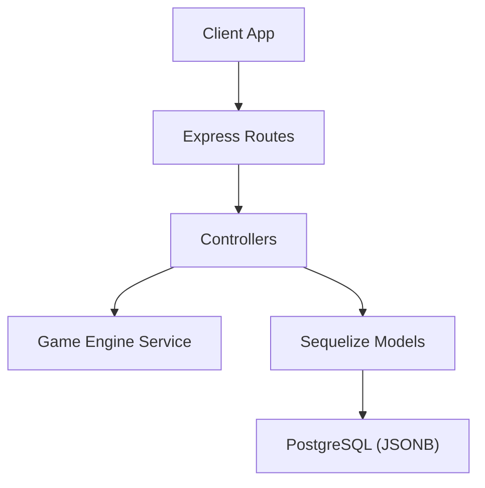
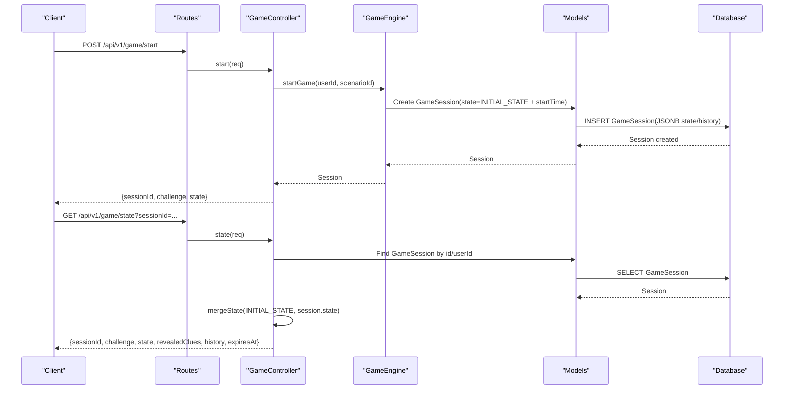
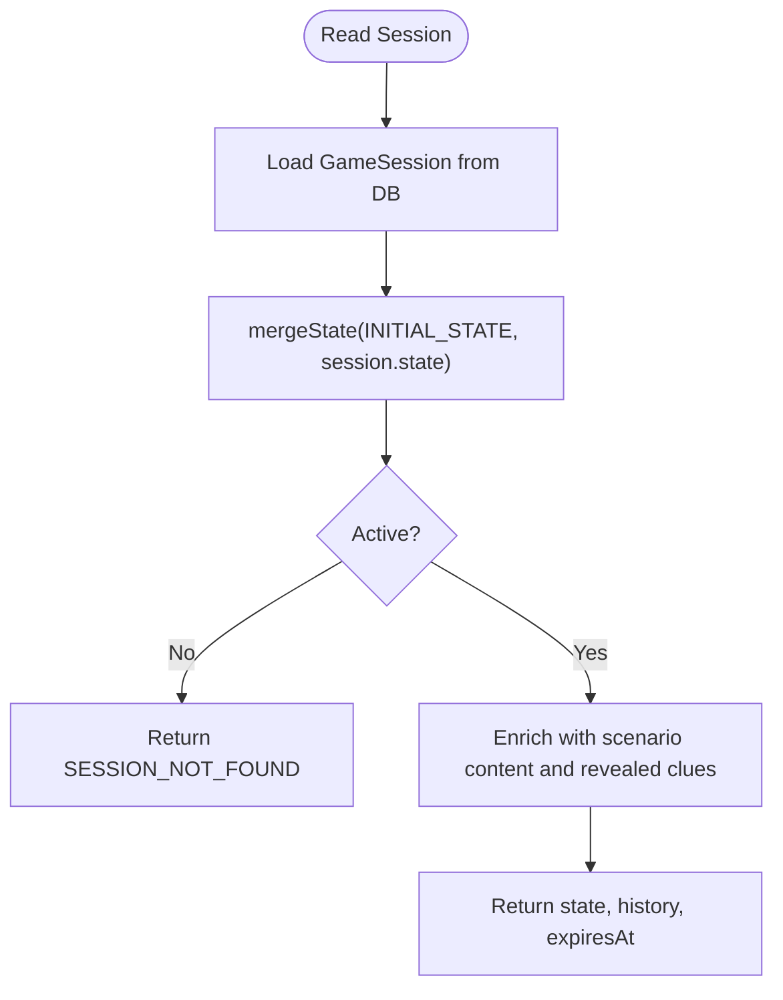
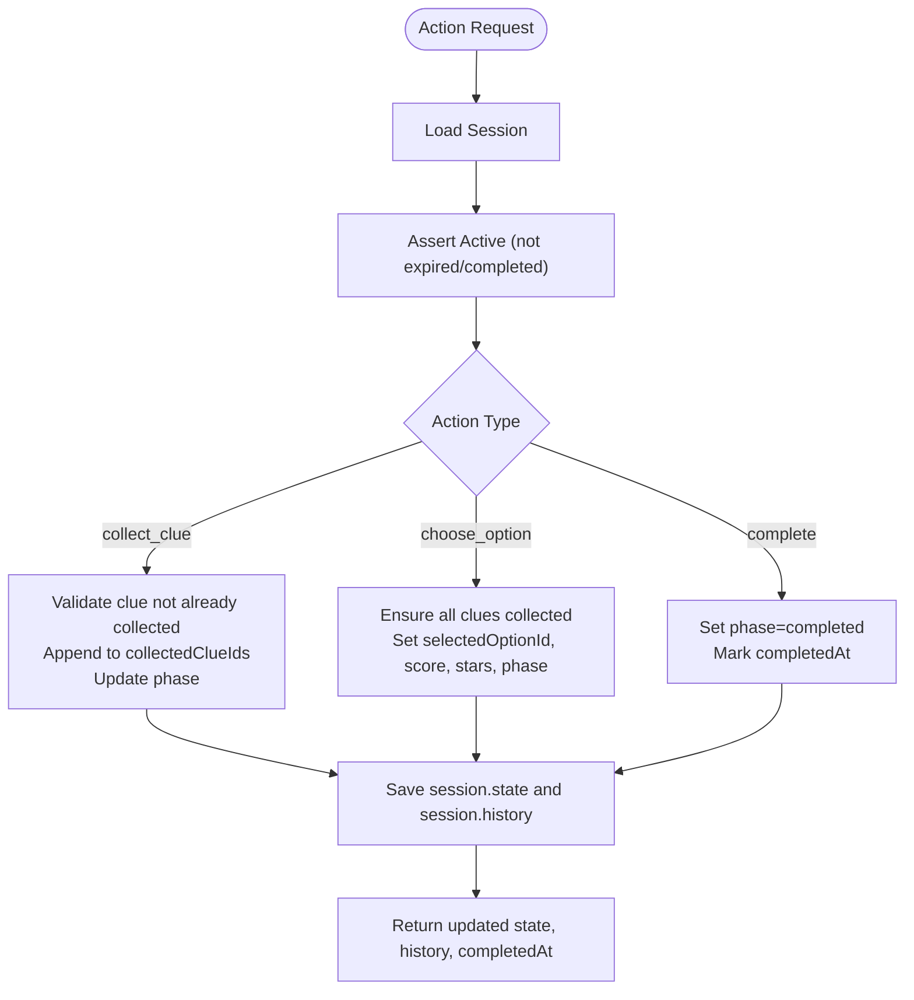
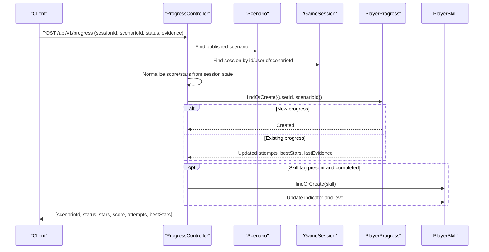
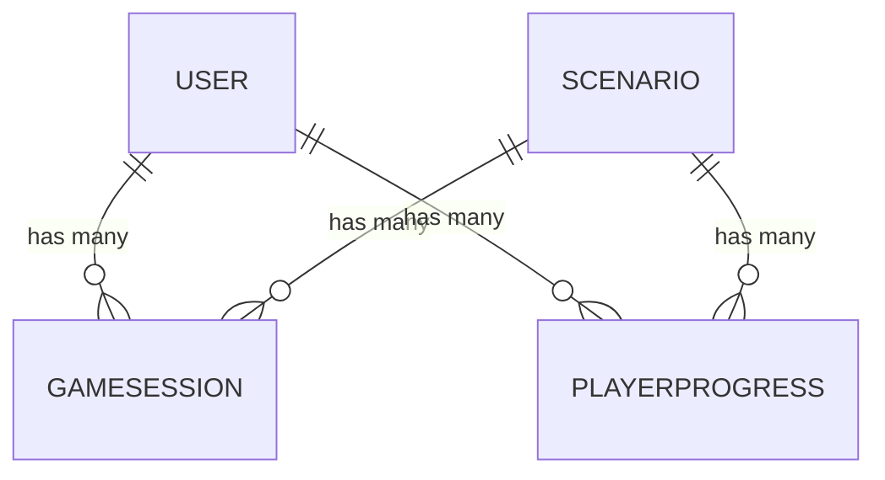
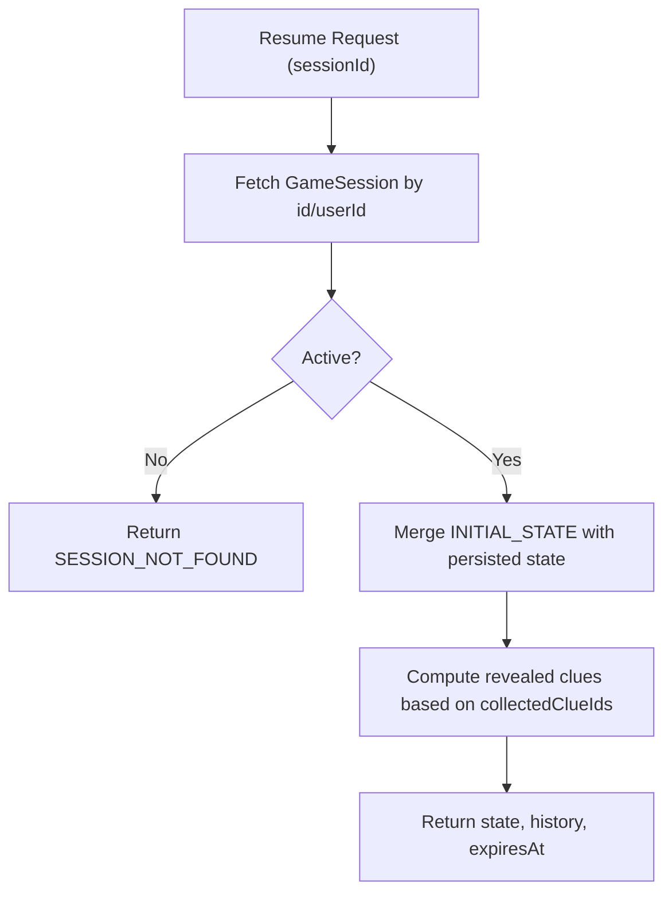
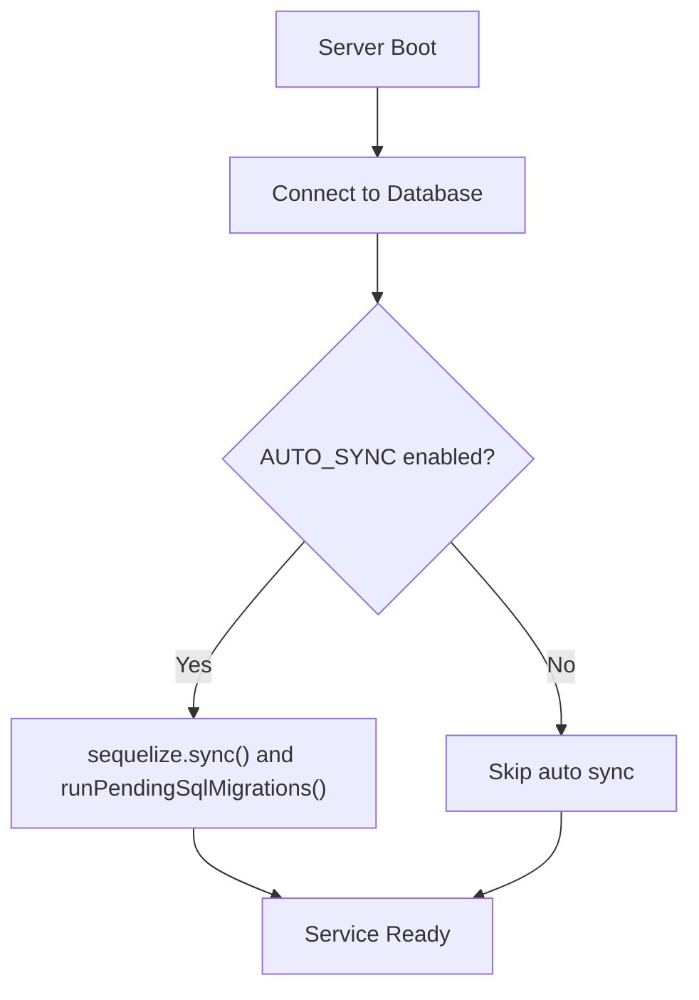
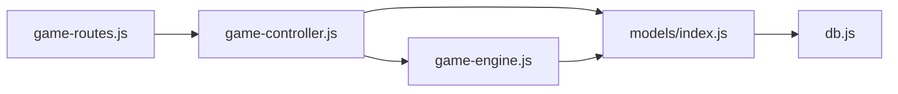

# State Persistence & Recovery

<cite>
**Referenced Files in This Document**
- [GameSession.js](file://backend/models/GameSession.js)
- [PlayerProgress.js](file://backend/models/PlayerProgress.js)
- [index.js](file://backend/models/index.js)
- [game-controller.js](file://backend/controllers/game-controller.js)
- [progress-controller.js](file://backend/controllers/progress-controller.js)
- [game-engine.js](file://backend/services/game-engine.js)
- [db.js](file://backend/config/db.js)
- [game-routes.js](file://backend/routes/game-routes.js)
- [game-schemas.js](file://backend/validators/game-schemas.js)
- [migrations-20260813-resource-catalogue.sql](file://backend/migrations-20260813-resource-catalogue.sql)
- [migrations-20260813-otp-verification.sql](file://backend/migrations-20260813-otp-verification.sql)
</cite>

## Table of Contents
1. Introduction
2. Project Structure
3. Core Components
4. Architecture Overview
5. Detailed Component Analysis
6. Dependency Analysis
7. Performance Considerations
8. Troubleshooting Guide
9. Conclusion

## Introduction
This document explains how the game application persists and recovers player state across sessions. It covers:
- How game sessions are stored in the database using JSONB fields for flexible state and history tracking.
- The serialization and deserialization processes that ensure consistent state when reading or writing session data.
- Recovery mechanisms for interrupted sessions, including automatic resume via active session checks and expiration handling.
- The relationship between GameSession and PlayerProgress models to track individual achievements and overall progress.
- Migration strategies, version compatibility considerations, and data integrity checks during session restoration.

## Project Structure
The persistence layer is implemented with Sequelize models and PostgreSQL JSONB columns. Controllers orchestrate request flows, while a service layer centralizes business logic for starting games and computing metrics. Routes and validators enforce input contracts.

**Diagram sources**
- [game-routes.js:1-15](file://backend/routes/game-routes.js#L1-L15)
- [game-controller.js:1-128](file://backend/controllers/game-controller.js#L1-L128)
- [game-engine.js:1-124](file://backend/services/game-engine.js#L1-L124)
- [GameSession.js:1-15](file://backend/models/GameSession.js#L1-L15)
- [PlayerProgress.js:1-17](file://backend/models/PlayerProgress.js#L1-L17)
- [db.js:1-45](file://backend/config/db.js#L1-L45)

**Section sources**
- [game-routes.js:1-15](file://backend/routes/game-routes.js#L1-L15)
- [db.js:1-45](file://backend/config/db.js#L1-L45)

## Core Components
- GameSession model stores per-session state and action history as JSONB, along with lifecycle timestamps.
- PlayerProgress model tracks long-term outcomes per scenario per user, including best stars, attempts, and last evidence snapshot.
- Game engine defines initial state, computes metrics, and creates new sessions with expiration windows.
- Controllers implement start, read, update, and submit flows, enforcing validation and business rules.
- Database configuration provides connection pooling, SSL options, and migration execution.

Key responsibilities:
- Session creation and expiration management.
- State merging to guarantee required keys exist on read.
- Action processing with history append and persistence.
- Progress submission with score/stars normalization and skill updates.

**Section sources**
- [GameSession.js:1-15](file://backend/models/GameSession.js#L1-L15)
- [PlayerProgress.js:1-17](file://backend/models/PlayerProgress.js#L1-L17)
- [game-engine.js:1-124](file://backend/services/game-engine.js#L1-L124)
- [game-controller.js:1-128](file://backend/controllers/game-controller.js#L1-L128)
- [progress-controller.js:1-79](file://backend/controllers/progress-controller.js#L1-L79)
- [db.js:1-45](file://backend/config/db.js#L1-L45)

## Architecture Overview
The system uses a layered architecture:
- API Layer: Express routes and middleware handle authentication and input validation.
- Controller Layer: Orchestrates requests, validates session activity, and delegates to the engine.
- Service Layer: Encapsulates game logic, metrics computation, and AI chat interactions.
- Data Layer: Sequelize models map to PostgreSQL tables; JSONB columns store flexible state and history.

**Diagram sources**
- [game-routes.js:1-15](file://backend/routes/game-routes.js#L1-L15)
- [game-controller.js:18-50](file://backend/controllers/game-controller.js#L18-L50)
- [game-engine.js:51-64](file://backend/services/game-engine.js#L51-L64)
- [GameSession.js:1-15](file://backend/models/GameSession.js#L1-L15)
- [db.js:1-45](file://backend/config/db.js#L1-L45)

## Detailed Component Analysis

### Session Storage and Serialization
- Session schema:
  - Primary key: UUID
  - User and scenario references
  - JSONB state: holds phase, collected clues, selected option, score, stars, and additional runtime fields
  - JSONB history: immutable log of actions with timestamps
  - Lifecycle: completedAt marks completion; expiresAt enforces time-bounded sessions
- Serialization/deserialization:
  - On write: controller merges current state into the session object and saves it back to JSONB
  - On read: controller merges INITIAL_STATE with persisted state to ensure all required keys exist even if missing from older records

**Diagram sources**
- [game-controller.js:30-50](file://backend/controllers/game-controller.js#L30-L50)
- [game-controller.js:14-16](file://backend/controllers/game-controller.js#L14-L16)
- [GameSession.js:1-15](file://backend/models/GameSession.js#L1-L15)

**Section sources**
- [GameSession.js:1-15](file://backend/models/GameSession.js#L1-L15)
- [game-controller.js:14-16](file://backend/controllers/game-controller.js#L14-L16)
- [game-controller.js:30-50](file://backend/controllers/game-controller.js#L30-L50)

### Action Processing and History Tracking
- Supported actions: collect_clue, choose_option, complete
- Validation:
  - Prevents duplicate clue collection
  - Requires all clues before choosing an option
  - Ensures a decision is made before completing
- History:
  - Each action appends an entry with type, relevant IDs, and timestamp
- Persistence:
  - Updated state and history are saved atomically to the session record

**Diagram sources**
- [game-controller.js:52-116](file://backend/controllers/game-controller.js#L52-L116)
- [game-schemas.js:7-12](file://backend/validators/game-schemas.js#L7-L12)

**Section sources**
- [game-controller.js:52-116](file://backend/controllers/game-controller.js#L52-L116)
- [game-schemas.js:7-12](file://backend/validators/game-schemas.js#L7-L12)

### Progress Submission and Achievement Tracking
- Submits final status (started, completed, failed) with optional evidence
- Validates scenario availability and session completeness when status is completed
- Normalizes scores and stars to safe ranges
- Updates PlayerProgress:
  - Creates or updates attempts and bestStars
  - Stores lastEvidence snapshot including sessionId, selectedOptionId, and score
- Skill progression:
  - If scenario has a skill tag and status is completed, increments indicator and recalculates level

**Diagram sources**
- [progress-controller.js:5-71](file://backend/controllers/progress-controller.js#L5-L71)
- [game-schemas.js:19-24](file://backend/validators/game-schemas.js#L19-L24)

**Section sources**
- [progress-controller.js:5-71](file://backend/controllers/progress-controller.js#L5-L71)
- [game-schemas.js:19-24](file://backend/validators/game-schemas.js#L19-L24)

### Relationship Between GameSession and PlayerProgress
- GameSession captures ephemeral, per-playthrough state and history
- PlayerProgress captures durable, cumulative outcomes per scenario per user
- Linkage:
  - Both reference userId and scenarioId
  - Progress submissions use sessionId to tie evidence to a specific playthrough
  - BestStars and attempts reflect repeated attempts across sessions
- Model relationships:
  - User has many GameSessions and PlayerProgress entries
  - Scenario has many GameSessions and PlayerProgress entries

**Diagram sources**
- [index.js:14-23](file://backend/models/index.js#L14-L23)

**Section sources**
- [index.js:14-23](file://backend/models/index.js#L14-L23)

### Recovery Mechanisms for Interrupted Sessions
- Automatic resume:
  - Clients can call the state endpoint with a previously issued sessionId
  - The server loads the session and returns merged state, revealed clues, and history
- Expiration handling:
  - Sessions have an expiresAt timestamp; controllers treat expired sessions as inactive
  - Chat and other operations require an active session (completedAt must be null)
- Integrity checks:
  - assertActive ensures no actions on completed or expired sessions
  - Input validation prevents invalid actions and enforces game flow constraints

**Diagram sources**
- [game-controller.js:30-50](file://backend/controllers/game-controller.js#L30-L50)
- [game-controller.js:8-16](file://backend/controllers/game-controller.js#L8-L16)
- [game-engine.js:66-71](file://backend/services/game-engine.js#L66-L71)

**Section sources**
- [game-controller.js:8-16](file://backend/controllers/game-controller.js#L8-L16)
- [game-controller.js:30-50](file://backend/controllers/game-controller.js#L30-L50)
- [game-engine.js:66-71](file://backend/services/game-engine.js#L66-L71)

### State Migration Strategies and Version Compatibility
- Schema evolution:
  - JSONB columns allow evolving state structures without breaking reads/writes
  - mergeState ensures backward compatibility by injecting default keys from INITIAL_STATE
- SQL migrations:
  - Pending SQL migrations are applied at startup when AUTO_SYNC is enabled
  - In production, AUTO_SYNC is disabled; migrations should be run explicitly
- Data integrity checks:
  - Validators enforce required fields and allowed values
  - Controllers validate business rules (e.g., all clues required before decision)
  - Scores and stars are normalized to safe ranges during progress submission

**Diagram sources**
- [db.js:15-42](file://backend/config/db.js#L15-L42)
- [migrations-20260813-resource-catalogue.sql:1-9](file://backend/migrations-20260813-resource-catalogue.sql#L1-L9)
- [migrations-20260813-otp-verification.sql:1-22](file://backend/migrations-20260813-otp-verification.sql#L1-L22)

**Section sources**
- [db.js:15-42](file://backend/config/db.js#L15-L42)
- [migrations-20260813-resource-catalogue.sql:1-9](file://backend/migrations-20260813-resource-catalogue.sql#L1-L9)
- [migrations-20260813-otp-verification.sql:1-22](file://backend/migrations-20260813-otp-verification.sql#L1-L22)

## Dependency Analysis
- Controllers depend on:
  - Models for data access
  - Engine for business logic and metrics
  - Validators for input schemas
- Engine depends on:
  - Models for scenarios, sessions, progress, skills, and AI interactions
- Database configuration provides connection pooling and migration utilities

**Diagram sources**
- [game-routes.js:1-15](file://backend/routes/game-routes.js#L1-L15)
- [game-controller.js:1-128](file://backend/controllers/game-controller.js#L1-L128)
- [game-engine.js:1-124](file://backend/services/game-engine.js#L1-L124)
- [index.js:1-32](file://backend/models/index.js#L1-L32)
- [db.js:1-45](file://backend/config/db.js#L1-L45)

**Section sources**
- [game-routes.js:1-15](file://backend/routes/game-routes.js#L1-L15)
- [game-controller.js:1-128](file://backend/controllers/game-controller.js#L1-L128)
- [game-engine.js:1-124](file://backend/services/game-engine.js#L1-L124)
- [index.js:1-32](file://backend/models/index.js#L1-L32)
- [db.js:1-45](file://backend/config/db.js#L1-L45)

## Performance Considerations
- Connection pooling:
  - Configured pool size and idle settings help manage concurrent requests efficiently
- JSONB storage:
  - Flexible state reduces schema changes but may increase payload sizes; keep state minimal and focused
- Query patterns:
  - Scoped queries by userId and scenarioId reduce scan costs
- Validation:
  - Early input validation prevents unnecessary processing and DB writes

[No sources needed since this section provides general guidance]

## Troubleshooting Guide
Common issues and resolutions:
- Session not found:
  - Ensure sessionId belongs to the authenticated user and is not expired or completed
  - Verify that the client passes the correct sessionId header or query parameter
- Invalid action:
  - Confirm the action type matches the current phase and prerequisites (e.g., all clues collected)
- Progress submission errors:
  - Ensure the scenario is published and the session is marked completed when submitting completed status
  - Check that scores and stars are within expected ranges; the controller normalizes them automatically
- Database connectivity:
  - Verify DATABASE_URL and SSL settings; check logs for connection errors
  - If AUTO_SYNC is enabled in development, confirm migrations ran successfully

**Section sources**
- [game-controller.js:8-16](file://backend/controllers/game-controller.js#L8-L16)
- [game-controller.js:52-116](file://backend/controllers/game-controller.js#L52-L116)
- [progress-controller.js:5-71](file://backend/controllers/progress-controller.js#L5-L71)
- [db.js:15-42](file://backend/config/db.js#L15-L42)

## Conclusion
The application persists game state using robust JSONB-backed sessions and durable progress records. State is safely serialized and deserialized through explicit merging with initial defaults, ensuring compatibility across versions. Recovery is straightforward: clients resume sessions by ID, with built-in checks for expiration and completion. Progress submissions consolidate per-playthrough outcomes into long-term achievements, with normalized scoring and skill progression. Migrations and validators provide a foundation for safe evolution and data integrity.