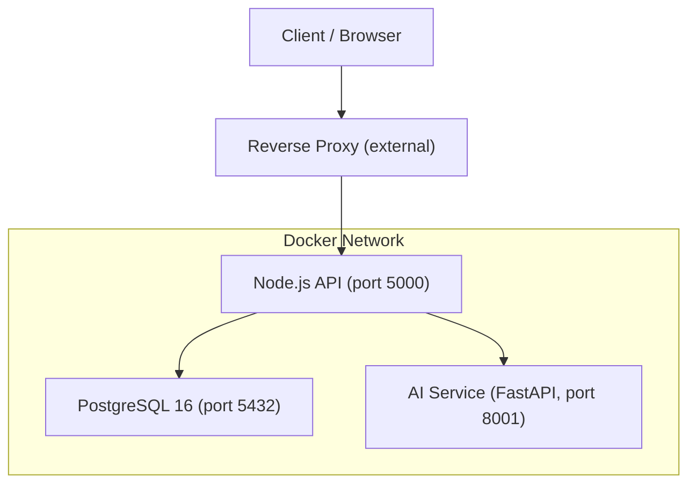
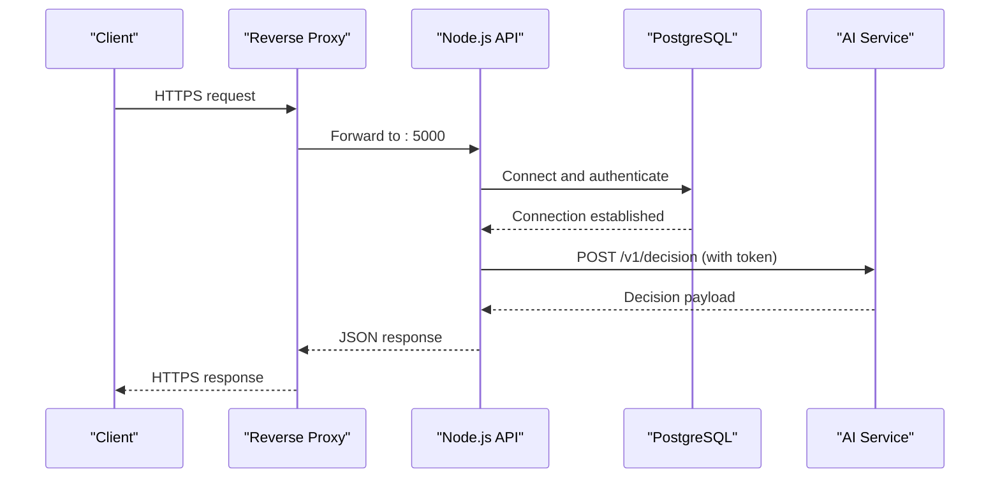
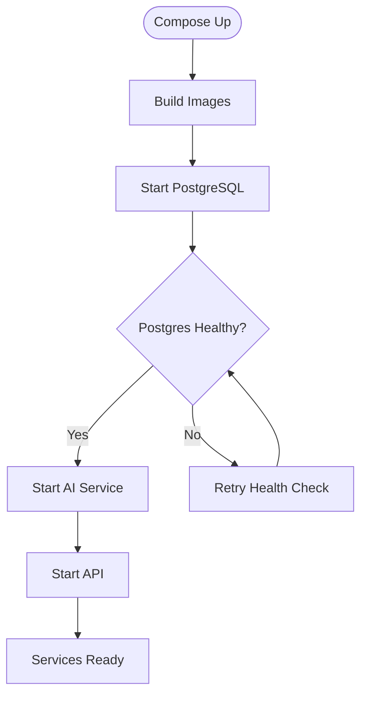
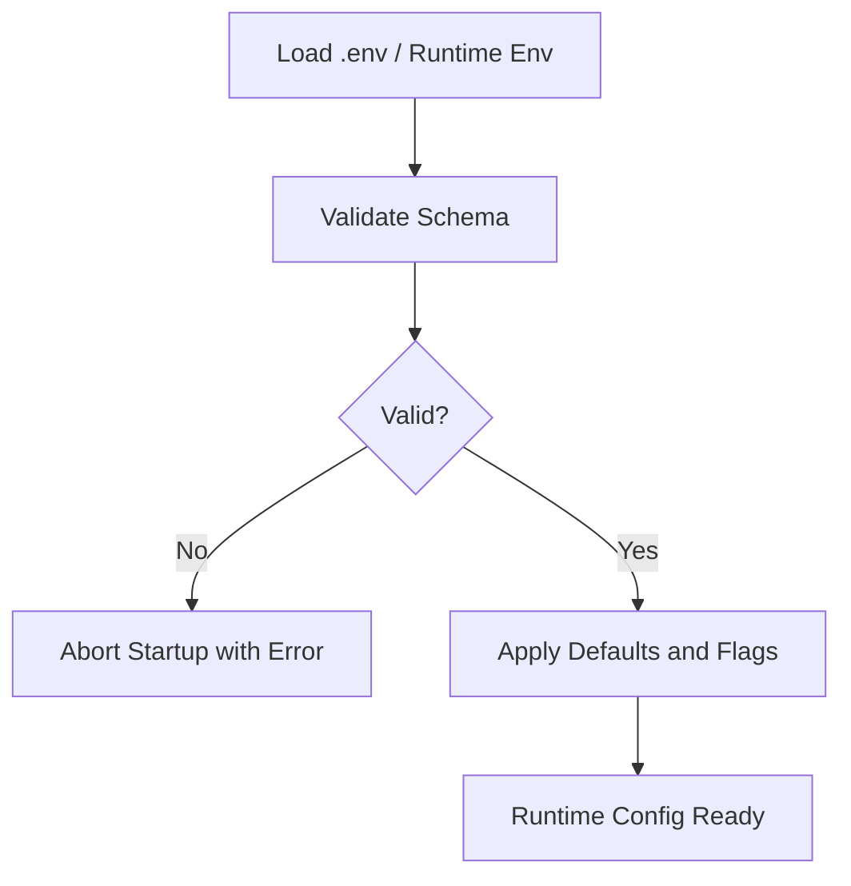
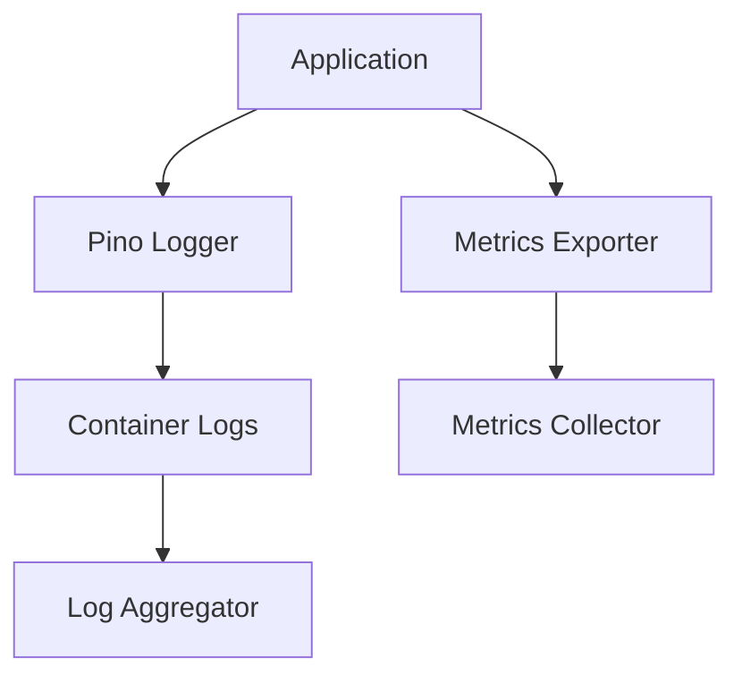
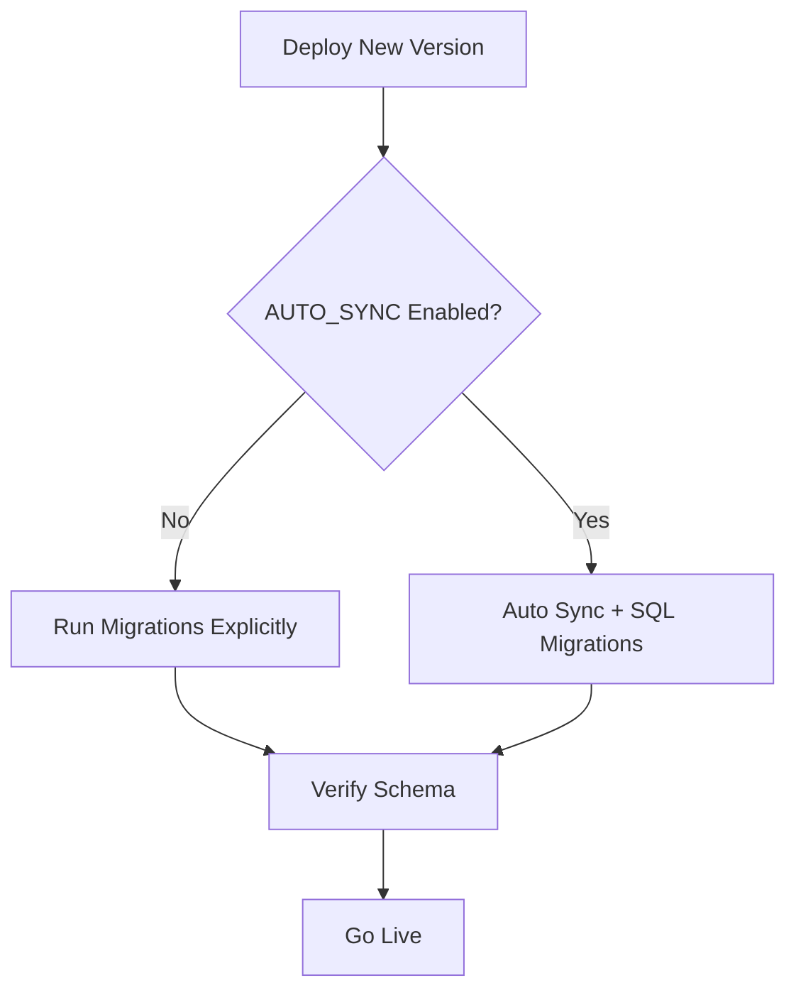
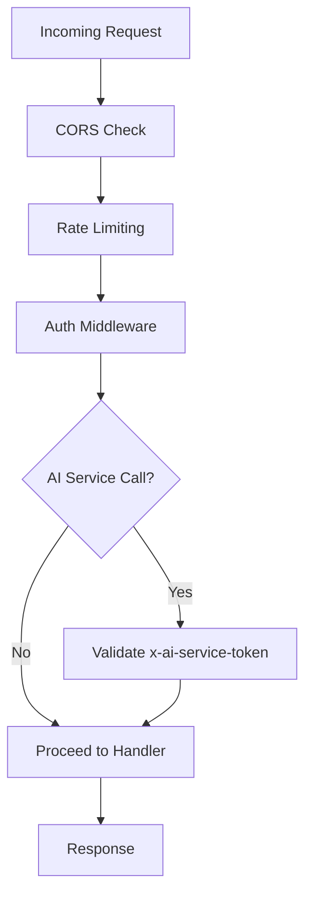
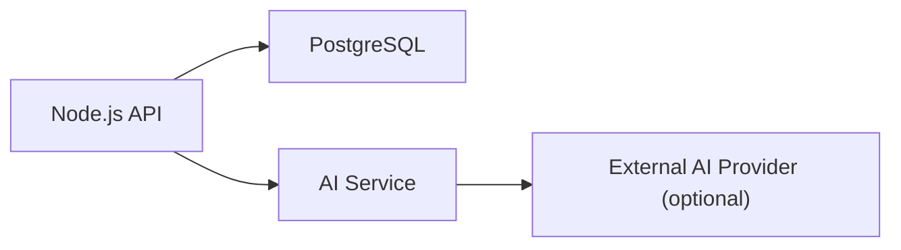
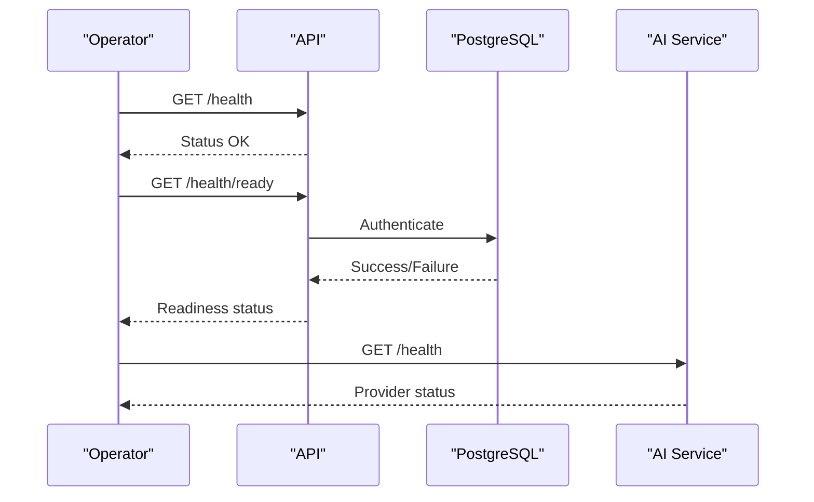

# Deployment Topology & Infrastructure

<cite>
**Referenced Files in This Document**
- [docker-compose.yml](file://docker-compose.yml)
- [DEPLOYMENT.md](file://DEPLOYMENT.md)
- [backend/Dockerfile](file://backend/Dockerfile)
- [backend/ai-service/Dockerfile](file://backend/ai-service/Dockerfile)
- [backend/config/env.js](file://backend/config/env.js)
- [backend/server.js](file://backend/server.js)
- [backend/config/db.js](file://backend/config/db.js)
- [backend/app.js](file://backend/app.js)
- [backend/middleware/security.js](file://backend/middleware/security.js)
- [backend/services/ai-service.js](file://backend/services/ai-service.js)
- [backend/ai-service/app/main.py](file://backend/ai-service/app/main.py)
- [backend/ai-service/app/config.py](file://backend/ai-service/app/config.py)
- [backend/config/logger.js](file://backend/config/logger.js)
</cite>

## Table of Contents
1. Introduction
2. Project Structure
3. Core Components
4. Architecture Overview
5. Detailed Component Analysis
6. Dependency Analysis
7. Performance Considerations
8. Troubleshooting Guide
9. Conclusion
10. Appendices

## Introduction
This document describes the production deployment topology and infrastructure for the AwarQuest system. It covers container orchestration with Docker Compose, environment configuration and secrets handling, service discovery between services, scaling strategies, monitoring and logging, backup and disaster recovery, database migrations and rollbacks, and security considerations including network isolation and access controls.

## Project Structure
The system is composed of three primary containerized services:
- PostgreSQL 16 as the relational data store
- Node.js/Express API server providing REST and WebSocket endpoints
- Python FastAPI AI microservice that provides deterministic or model-based decisions

Docker Compose defines the multi-service stack, including health checks, volumes, and inter-service dependencies. Each service has its own Dockerfile to build optimized images.

**Diagram sources**
- [docker-compose.yml:3-62](file://docker-compose.yml#L3-L62)
- [backend/Dockerfile:1-14](file://backend/Dockerfile#L1-L14)
- [backend/ai-service/Dockerfile:1-8](file://backend/ai-service/Dockerfile#L1-L8)

**Section sources**
- [docker-compose.yml:1-66](file://docker-compose.yml#L1-L66)
- [DEPLOYMENT.md:5-10](file://DEPLOYMENT.md#L5-L10)

## Core Components
- PostgreSQL: Persistent relational database with a named volume for data durability and a health check to ensure readiness before dependent services start.
- Node.js API: Express application with HTTP and WebSocket support, secure middleware, CORS, rate limiting, structured logging, and graceful shutdown.
- AI Service: FastAPI microservice with token-based authentication, health endpoint, and deterministic fallback when external AI providers are unavailable.

Key runtime behaviors:
- The API depends on both PostgreSQL and the AI service at startup.
- The AI service validates an internal token header for all decision requests.
- Environment variables are validated at startup to enforce correct configuration.

**Section sources**
- [docker-compose.yml:3-62](file://docker-compose.yml#L3-L62)
- [backend/server.js:9-46](file://backend/server.js#L9-L46)
- [backend/ai-service/app/main.py:14-33](file://backend/ai-service/app/main.py#L14-L33)
- [backend/config/env.js:6-39](file://backend/config/env.js#L6-L39)

## Architecture Overview
The production architecture uses Docker Compose to orchestrate services within a private network. External clients reach the API through a reverse proxy (e.g., Nginx/Traefik) which terminates TLS and forwards traffic to the API container. The API communicates with PostgreSQL over the Docker network and calls the AI service via an internal URL protected by a shared secret.

**Diagram sources**
- [docker-compose.yml:20-62](file://docker-compose.yml#L20-L62)
- [backend/services/ai-service.js:18-48](file://backend/services/ai-service.js#L18-L48)
- [backend/ai-service/app/main.py:22-33](file://backend/ai-service/app/main.py#L22-L33)

## Detailed Component Analysis

### Container Orchestration and Service Composition
- Services:
  - postgres: Postgres image with credentials, persistent volume, and health check.
  - ai-service: Built from backend/ai-service with Python runtime and Uvicorn entrypoint.
  - api: Built from backend with Node runtime, exposing port 5000 internally and mapped to 5001 externally.
- Dependencies:
  - API starts after PostgreSQL is healthy and AI service is started.
- Networking:
  - All services share a default Docker network; internal URLs use service names (e.g., http://ai-service:8001).

**Diagram sources**
- [docker-compose.yml:3-62](file://docker-compose.yml#L3-L62)

**Section sources**
- [docker-compose.yml:1-66](file://docker-compose.yml#L1-L66)

### Environment Configuration Management and Secrets Handling
- Backend environment validation:
  - Strict schema enforces required fields like DATABASE_URL, JWT secrets, and optional AI settings.
  - Production mode disables guest play and adjusts behavior accordingly.
- AI service configuration:
  - Pydantic Settings validate minimum token length and provide defaults.
- Secrets management recommendations:
  - Use Docker secrets or orchestrator-native secret stores instead of plaintext in compose files.
  - Rotate JWT secrets regularly and ensure they meet minimum length requirements.
  - Store SMTP credentials and API keys securely and inject them at runtime.

**Diagram sources**
- [backend/config/env.js:6-39](file://backend/config/env.js#L6-L39)
- [backend/ai-service/app/config.py:5-23](file://backend/ai-service/app/config.py#L5-L23)

**Section sources**
- [backend/config/env.js:1-40](file://backend/config/env.js#L1-L40)
- [backend/ai-service/app/config.py:1-24](file://backend/ai-service/app/config.py#L1-L24)
- [DEPLOYMENT.md:14-28](file://DEPLOYMENT.md#L14-L28)

### Service Discovery Patterns
- Internal communication uses Docker service names:
  - API calls AI service via http://ai-service:8001.
  - Database connection string references the postgres service name.
- For Kubernetes or other orchestrators:
  - Replace service names with DNS entries provided by the platform.
  - Use environment variables injected by the orchestrator to point to service endpoints.

**Section sources**
- [docker-compose.yml:20-62](file://docker-compose.yml#L20-L62)
- [backend/services/ai-service.js:18-48](file://backend/services/ai-service.js#L18-L48)

### Scaling Strategies and Load Balancing
- Horizontal scaling:
  - Run multiple replicas of the API container behind a reverse proxy or load balancer.
  - Ensure stateless API design; session state should be stored externally if needed.
- Database scaling:
  - Use managed PostgreSQL with read replicas and connection pooling.
  - Tune pool size based on replica count and workload.
- AI service scaling:
  - Scale AI service horizontally; each instance validates the same shared token.
  - Consider caching frequent decisions if appropriate.
- Reverse proxy:
  - Terminate TLS at the edge and distribute traffic across API instances.
  - Configure health checks and circuit breakers to handle upstream failures.

[No sources needed since this section provides general guidance]

### Monitoring and Logging Infrastructure
- Structured logging:
  - Pino logger configured with level control and optional pretty printing in non-production.
  - Request ID propagation via middleware for traceability.
- Metrics and observability:
  - Add metrics collection (e.g., Prometheus client) to expose key counters and latency histograms.
  - Centralize logs using a log aggregator (e.g., Loki, ELK) by shipping stdout/stderr from containers.
- Health endpoints:
  - API exposes health and readiness endpoints; AI service exposes a health endpoint indicating provider status.

**Diagram sources**
- [backend/config/logger.js:1-13](file://backend/config/logger.js#L1-L13)
- [backend/app.js:18-20](file://backend/app.js#L18-L20)
- [backend/ai-service/app/main.py:18-20](file://backend/ai-service/app/main.py#L18-L20)

**Section sources**
- [backend/config/logger.js:1-13](file://backend/config/logger.js#L1-L13)
- [backend/app.js:1-32](file://backend/app.js#L1-L32)
- [backend/ai-service/app/main.py:18-20](file://backend/ai-service/app/main.py#L18-L20)

### Backup and Disaster Recovery
- Database backups:
  - Schedule regular logical backups (e.g., pg_dump) and store offsite.
  - Test restore procedures periodically.
- Volume persistence:
  - Persist PostgreSQL data to a named volume or managed storage.
- Disaster recovery plan:
  - Define RTO/RPO targets.
  - Maintain runbooks for failover and restoration.
- Data integrity:
  - Enable WAL archiving and PITR where supported by your PostgreSQL setup.

[No sources needed since this section provides general guidance]

### Database Migrations and Rollback Strategies
- Migration approach:
  - In production, disable AUTO_SYNC and apply migrations explicitly.
  - SQL migrations are detected and executed when AUTO_SYNC is enabled (development only).
- Rollback strategy:
  - Version migrations and maintain rollback scripts.
  - Perform migrations during maintenance windows with zero-downtime techniques where possible.
- Validation:
  - Run migration tests against a staging environment mirroring production.

**Diagram sources**
- [backend/config/db.js:15-42](file://backend/config/db.js#L15-L42)
- [DEPLOYMENT.md:46-51](file://DEPLOYMENT.md#L46-L51)

**Section sources**
- [backend/config/db.js:1-45](file://backend/config/db.js#L1-L45)
- [DEPLOYMENT.md:46-51](file://DEPLOYMENT.md#L46-L51)

### Security Considerations
- Network isolation:
  - Keep database and AI service ports internal; expose only API to the reverse proxy.
  - Restrict cross-origin requests to known domains.
- Access controls:
  - Enforce JWT-based authentication with HttpOnly cookies.
  - Protect AI service with a shared token header validated on every request.
- Input validation and rate limiting:
  - Reject unsafe input patterns.
  - Apply rate limits for write operations, authentication, and OTP flows.
- TLS and headers:
  - Terminate TLS at the reverse proxy.
  - Use security headers via Helmet and configure CORS carefully.

**Diagram sources**
- [backend/app.js:21-29](file://backend/app.js#L21-L29)
- [backend/middleware/security.js:1-47](file://backend/middleware/security.js#L1-L47)
- [backend/ai-service/app/main.py:14-16](file://backend/ai-service/app/main.py#L14-L16)

**Section sources**
- [backend/middleware/security.js:1-47](file://backend/middleware/security.js#L1-L47)
- [backend/app.js:1-32](file://backend/app.js#L1-L32)
- [backend/ai-service/app/main.py:14-16](file://backend/ai-service/app/main.py#L14-L16)

## Dependency Analysis
The API depends on PostgreSQL and the AI service. The AI service depends on environment-provided tokens and optionally on an external AI provider.

**Diagram sources**
- [docker-compose.yml:20-62](file://docker-compose.yml#L20-L62)
- [backend/services/ai-service.js:18-48](file://backend/services/ai-service.js#L18-L48)
- [backend/ai-service/app/main.py:22-33](file://backend/ai-service/app/main.py#L22-L33)

**Section sources**
- [docker-compose.yml:1-66](file://docker-compose.yml#L1-L66)
- [backend/services/ai-service.js:1-51](file://backend/services/ai-service.js#L1-L51)

## Performance Considerations
- Connection pooling:
  - Tune PostgreSQL pool settings to match expected concurrency and replica capacity.
- Timeouts and retries:
  - Set reasonable timeouts for AI service calls and implement retries with backoff.
- Stateless scaling:
  - Keep API stateless to enable horizontal scaling.
- Resource limits:
  - Set CPU/memory limits per container to prevent noisy neighbor issues.
- Caching:
  - Consider caching frequent AI decisions or static content at the reverse proxy layer.

[No sources needed since this section provides general guidance]

## Troubleshooting Guide
- Health checks:
  - Verify API health and readiness endpoints.
  - Confirm AI service health endpoint indicates provider status.
- Common errors:
  - Invalid environment configuration will abort startup.
  - Database connection failures are logged and surfaced during startup.
  - AI service unavailability triggers deterministic fallback.
- Debugging:
  - Use request IDs to correlate logs across services.
  - Inspect structured logs for error details and context.

**Diagram sources**
- [DEPLOYMENT.md:39-42](file://DEPLOYMENT.md#L39-L42)
- [backend/config/db.js:15-28](file://backend/config/db.js#L15-L28)
- [backend/ai-service/app/main.py:18-20](file://backend/ai-service/app/main.py#L18-L20)

**Section sources**
- [backend/config/logger.js:1-13](file://backend/config/logger.js#L1-L13)
- [backend/config/db.js:15-28](file://backend/config/db.js#L15-L28)
- [backend/ai-service/app/main.py:18-20](file://backend/ai-service/app/main.py#L18-L20)

## Conclusion
The AwarQuest deployment uses a clear separation of concerns with containerized services orchestrated via Docker Compose. Environment validation and secure inter-service communication ensure reliability and safety. Production readiness includes explicit migrations, robust logging, and scalable patterns. Extending this foundation with centralized monitoring, automated backups, and strict network policies will further harden the system for production use.

## Appendices

### Environment Variables Reference
- Backend:
  - NODE_ENV, PORT, DATABASE_URL, DB_SSL, JWT_ACCESS_SECRET, JWT_REFRESH_SECRET, JWT_ACCESS_TTL, JWT_REFRESH_TTL, CORS_ORIGINS, TRUST_PROXY, LOG_LEVEL, AUTO_SYNC, AI_ENABLED, AI_SERVICE_URL, AI_SERVICE_TOKEN, AI_REQUEST_TIMEOUT_MS, SMTP_HOST, SMTP_PORT, SMTP_SECURE, SMTP_USER, SMTP_PASS, EMAIL_FROM, GUEST_PLAY_ENABLED
- AI Service:
  - GEMINI_API_KEY, GEMINI_MODEL, AI_SERVICE_TOKEN, AI_PORT, AI_LOG_LEVEL

**Section sources**
- [backend/config/env.js:6-39](file://backend/config/env.js#L6-L39)
- [backend/ai-service/app/config.py:5-23](file://backend/ai-service/app/config.py#L5-L23)
- [DEPLOYMENT.md:14-28](file://DEPLOYMENT.md#L14-L28)