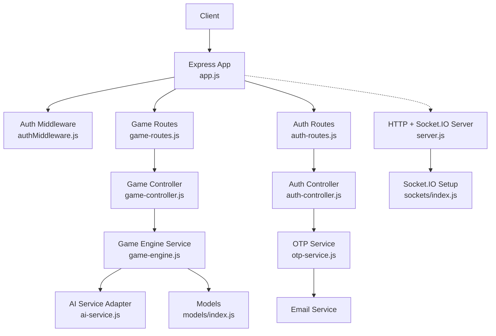
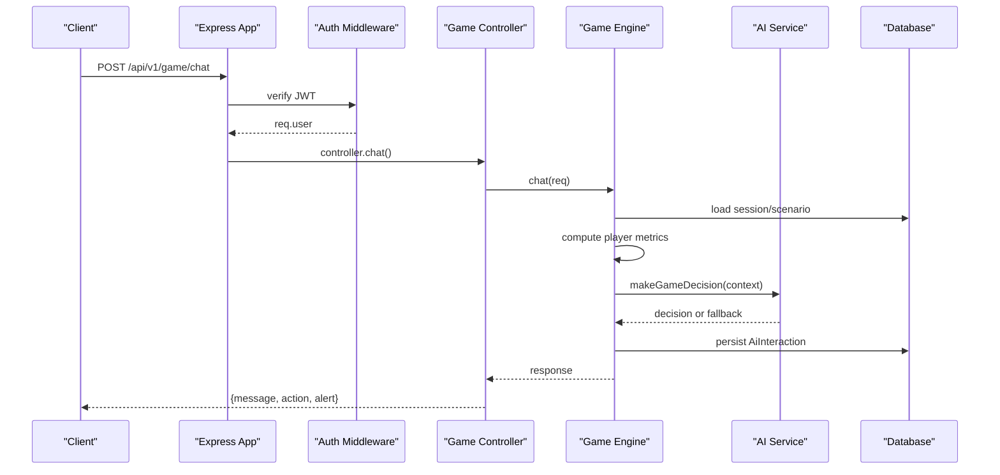
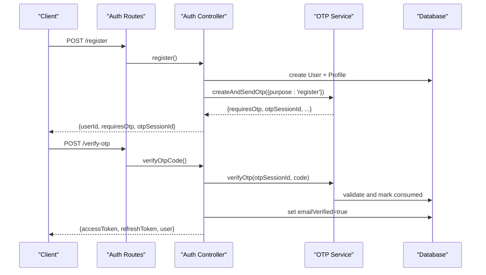
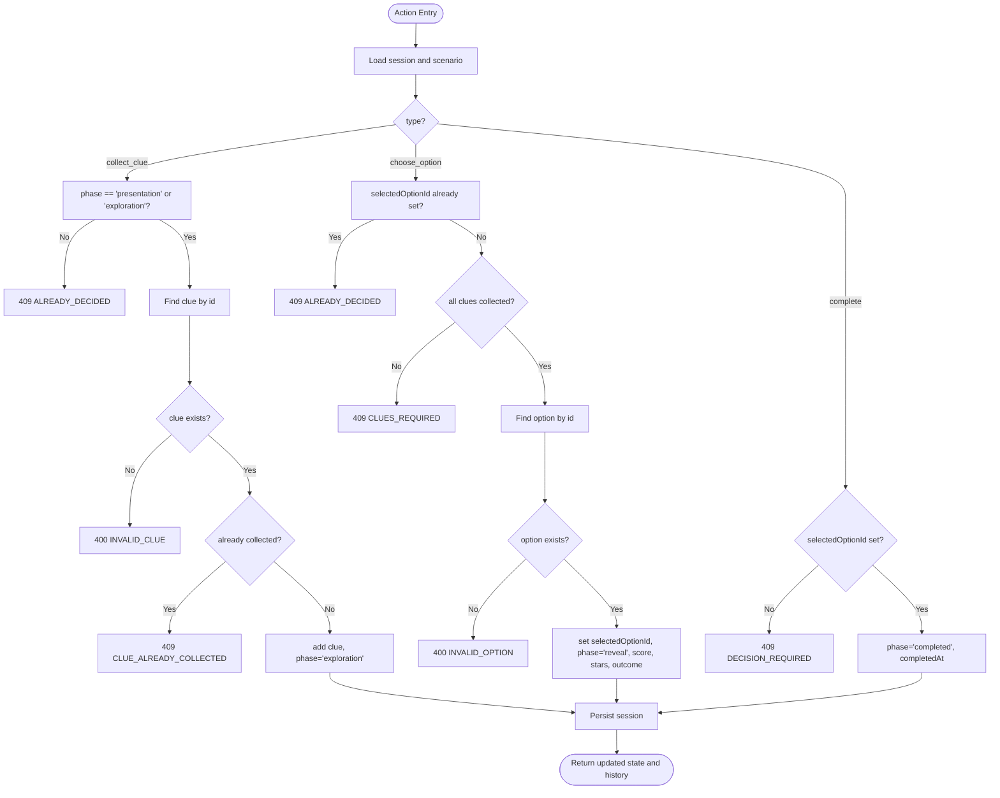
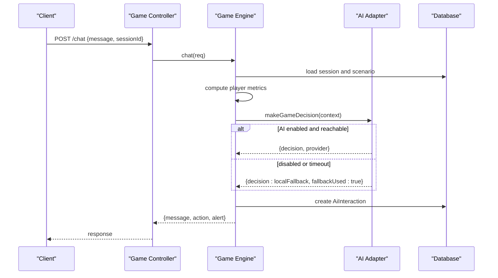
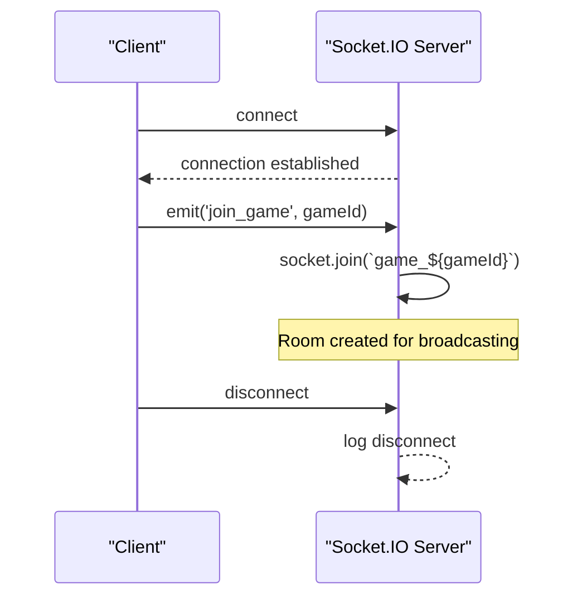
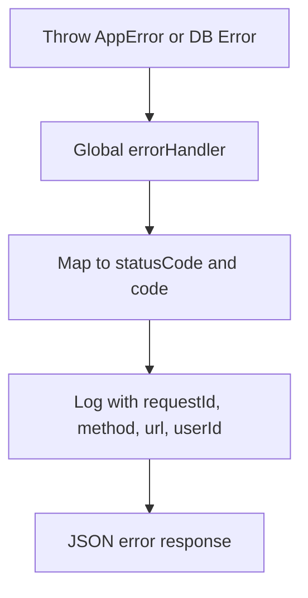
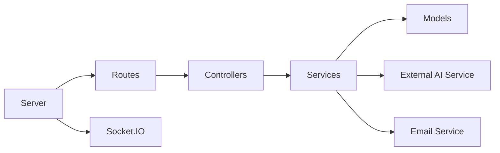

# Component Interactions

<cite>
**Referenced Files in This Document**
- [app.js](file://backend/app.js)
- [server.js](file://backend/server.js)
- [sockets/index.js](file://backend/sockets/index.js)
- [controllers/game-controller.js](file://backend/controllers/game-controller.js)
- [controllers/auth-controller.js](file://backend/controllers/auth-controller.js)
- [services/game-engine.js](file://backend/services/game-engine.js)
- [services/ai-service.js](file://backend/services/ai-service.js)
- [services/otp-service.js](file://backend/services/otp-service.js)
- [middleware/authMiddleware.js](file://backend/middleware/authMiddleware.js)
- [middleware/error-handler.js](file://backend/middleware/error-handler.js)
- [config/logger.js](file://backend/config/logger.js)
- [config/env.js](file://backend/config/env.js)
- [routes/game-routes.js](file://backend/routes/game-routes.js)
- [routes/auth-routes.js](file://backend/routes/auth-routes.js)
- [models/index.js](file://backend/models/index.js)
</cite>

## Table of Contents
1. [Introduction](#introduction)
2. [Project Structure](#project-structure)
3. [Core Components](#core-components)
4. [Architecture Overview](#architecture-overview)
5. [Detailed Component Analysis](#detailed-component-analysis)
6. [Dependency Analysis](#dependency-analysis)
7. [Performance Considerations](#performance-considerations)
8. [Troubleshooting Guide](#troubleshooting-guide)
9. [Conclusion](#conclusion)

## Introduction
This document explains how the Life Skills Adventure system’s components interact to deliver authenticated gameplay, puzzle validation, AI-guided chat, and real-time socket communication. It focuses on request flows through middleware, controllers, services, models, and external dependencies (AI service and email). It also covers error propagation, logging strategies, and debugging techniques for reliable operation.

## Project Structure
The backend is an Express application with:
- Routes that wire endpoints to controllers
- Controllers orchestrating business logic via services
- Services encapsulating domain logic and external integrations
- Models representing database entities
- Middleware for authentication, validation, security, and error handling
- A Socket.IO server for real-time features
- Centralized configuration and logging

**Diagram sources**
- [app.js:15-53](file://backend/app.js#L15-L53)
- [server.js:9-25](file://backend/server.js#L9-L25)
- [sockets/index.js:3-16](file://backend/sockets/index.js#L3-L16)
- [routes/game-routes.js:8-12](file://backend/routes/game-routes.js#L8-L12)
- [routes/auth-routes.js:9-15](file://backend/routes/auth-routes.js#L9-L15)
- [controllers/game-controller.js:18-120](file://backend/controllers/game-controller.js#L18-L120)
- [controllers/auth-controller.js:34-151](file://backend/controllers/auth-controller.js#L34-L151)
- [services/game-engine.js:51-121](file://backend/services/game-engine.js#L51-L121)
- [services/ai-service.js:18-48](file://backend/services/ai-service.js#L18-L48)
- [services/otp-service.js:23-96](file://backend/services/otp-service.js#L23-L96)
- [models/index.js:14-31](file://backend/models/index.js#L14-L31)

**Section sources**
- [app.js:15-53](file://backend/app.js#L15-L53)
- [server.js:9-25](file://backend/server.js#L9-L25)

## Core Components
- Application bootstrap and middleware pipeline: request ID, logging, CORS, JSON parsing, security, static assets, routes, not-found, and error handler.
- Authentication: JWT-based auth with refresh and logout; OTP verification flow for secure login/register.
- Game engine: session lifecycle, state transitions, clue collection, option selection, completion, and chat-driven guidance.
- AI integration: optional remote decision service with deterministic fallback and timeouts.
- Real-time sockets: room-based join events for game sessions.
- Configuration and logging: environment validation and structured logs.

**Section sources**
- [app.js:15-53](file://backend/app.js#L15-L53)
- [middleware/authMiddleware.js:6-35](file://backend/middleware/authMiddleware.js#L6-L35)
- [controllers/auth-controller.js:34-151](file://backend/controllers/auth-controller.js#L34-L151)
- [services/otp-service.js:23-96](file://backend/services/otp-service.js#L23-L96)
- [controllers/game-controller.js:18-120](file://backend/controllers/game-controller.js#L18-L120)
- [services/game-engine.js:51-121](file://backend/services/game-engine.js#L51-L121)
- [services/ai-service.js:18-48](file://backend/services/ai-service.js#L18-L48)
- [sockets/index.js:3-16](file://backend/sockets/index.js#L3-L16)
- [config/env.js:6-39](file://backend/config/env.js#L6-L39)
- [config/logger.js:1-12](file://backend/config/logger.js#L1-L12)

## Architecture Overview
The system follows a layered architecture:
- Presentation layer: Express routes and Socket.IO
- Control layer: Controllers handling HTTP requests
- Domain layer: Services implementing business rules
- Data layer: Sequelize models interacting with the database
- External integrations: AI decision service and email delivery

**Diagram sources**
- [routes/game-routes.js:12](file://backend/routes/game-routes.js#L12)
- [middleware/authMiddleware.js:6-35](file://backend/middleware/authMiddleware.js#L6-L35)
- [controllers/game-controller.js:118-120](file://backend/controllers/game-controller.js#L118-L120)
- [services/game-engine.js:66-121](file://backend/services/game-engine.js#L66-L121)
- [services/ai-service.js:18-48](file://backend/services/ai-service.js#L18-L48)
- [models/index.js:14-31](file://backend/models/index.js#L14-L31)

## Detailed Component Analysis

### Authentication Flow
- Registration creates a user and profile, then issues an OTP for email verification.
- Login verifies password and issues an OTP for confirmation.
- OTP verification marks email verified and issues access/refresh tokens via cookies.
- Refresh reissues tokens if the token version matches; logout invalidates by incrementing token version.

**Diagram sources**
- [routes/auth-routes.js:9-13](file://backend/routes/auth-routes.js#L9-L13)
- [controllers/auth-controller.js:34-89](file://backend/controllers/auth-controller.js#L34-L89)
- [services/otp-service.js:23-83](file://backend/services/otp-service.js#L23-L83)
- [models/index.js:14-31](file://backend/models/index.js#L14-L31)

**Section sources**
- [controllers/auth-controller.js:34-151](file://backend/controllers/auth-controller.js#L34-L151)
- [services/otp-service.js:23-96](file://backend/services/otp-service.js#L23-L96)
- [routes/auth-routes.js:9-15](file://backend/routes/auth-routes.js#L9-L15)

### Puzzle Validation and Session Lifecycle
- Start creates a new game session with initial state and returns scenario content.
- State reads current session state, reveals collected clues, and includes history.
- Action enforces game rules:
  - Collect clue only during presentation/exploration phases
  - Require all clues before choosing an option
  - Validate option existence and update score/stars/outcome
  - Complete finalizes the session

**Diagram sources**
- [controllers/game-controller.js:52-116](file://backend/controllers/game-controller.js#L52-L116)

**Section sources**
- [controllers/game-controller.js:18-120](file://backend/controllers/game-controller.js#L18-L120)

### AI-Guided Gameplay Chat
- The chat endpoint builds a context from session, scenario content, and player metrics.
- The AI adapter either calls the remote AI service or uses a deterministic fallback.
- Decisions are persisted as AI interactions for auditability.

**Diagram sources**
- [controllers/game-controller.js:118-120](file://backend/controllers/game-controller.js#L118-L120)
- [services/game-engine.js:66-121](file://backend/services/game-engine.js#L66-L121)
- [services/ai-service.js:18-48](file://backend/services/ai-service.js#L18-L48)
- [models/index.js:14-31](file://backend/models/index.js#L14-L31)

**Section sources**
- [services/game-engine.js:66-121](file://backend/services/game-engine.js#L66-L121)
- [services/ai-service.js:18-48](file://backend/services/ai-service.js#L18-L48)

### Real-Time Socket Connections
- Socket.IO server is initialized alongside the HTTP server.
- Clients can join game rooms using a join_game event with a gameId.
- Disconnects are logged for observability.

**Diagram sources**
- [server.js:9-25](file://backend/server.js#L9-L25)
- [sockets/index.js:3-16](file://backend/sockets/index.js#L3-L16)

**Section sources**
- [server.js:9-25](file://backend/server.js#L9-L25)
- [sockets/index.js:3-16](file://backend/sockets/index.js#L3-L16)

### Middleware Chain Execution
- Request enters Express app with middleware order:
  - Request ID injection
  - Structured HTTP logging
  - Security headers and CORS
  - JSON parsing with strict mode and size limits
  - Cookie parsing
  - Input sanitization
  - Route handlers
  - Not found and error handler

**Diagram sources**
- [app.js:15-53](file://backend/app.js#L15-L53)

**Section sources**
- [app.js:15-53](file://backend/app.js#L15-L53)

### Error Propagation and Logging Strategy
- Controllers and services throw typed errors via a shared error class.
- The global error handler maps database validation errors to appropriate status codes and emits structured logs.
- Development responses include extra detail; production hides internals.

**Diagram sources**
- [middleware/error-handler.js:8-49](file://backend/middleware/error-handler.js#L8-L49)
- [config/logger.js:1-12](file://backend/config/logger.js#L1-L12)

**Section sources**
- [middleware/error-handler.js:8-49](file://backend/middleware/error-handler.js#L8-L49)
- [config/logger.js:1-12](file://backend/config/logger.js#L1-L12)

## Dependency Analysis
- Controllers depend on services for business logic and on models for persistence.
- Game engine depends on AI adapter for decisions and on models for data.
- Auth controller depends on OTP service and models.
- Routes bind middleware and controllers to endpoints.
- Server wires HTTP and Socket.IO together.

**Diagram sources**
- [routes/game-routes.js:8-12](file://backend/routes/game-routes.js#L8-L12)
- [routes/auth-routes.js:9-15](file://backend/routes/auth-routes.js#L9-L15)
- [controllers/game-controller.js:1-120](file://backend/controllers/game-controller.js#L1-120)
- [controllers/auth-controller.js:1-151](file://backend/controllers/auth-controller.js#L1-151)
- [services/game-engine.js:1-121](file://backend/services/game-engine.js#L1-L121)
- [services/ai-service.js:1-48](file://backend/services/ai-service.js#L1-L48)
- [services/otp-service.js:1-96](file://backend/services/otp-service.js#L1-L96)
- [models/index.js:14-31](file://backend/models/index.js#L14-L31)
- [server.js:9-25](file://backend/server.js#L9-L25)

**Section sources**
- [routes/game-routes.js:8-12](file://backend/routes/game-routes.js#L8-L12)
- [routes/auth-routes.js:9-15](file://backend/routes/auth-routes.js#L9-L15)
- [controllers/game-controller.js:1-120](file://backend/controllers/game-controller.js#L1-120)
- [controllers/auth-controller.js:1-151](file://backend/controllers/auth-controller.js#L1-151)
- [services/game-engine.js:1-121](file://backend/services/game-engine.js#L1-L121)
- [services/ai-service.js:1-48](file://backend/services/ai-service.js#L1-L48)
- [services/otp-service.js:1-96](file://backend/services/otp-service.js#L1-L96)
- [models/index.js:14-31](file://backend/models/index.js#L14-L31)
- [server.js:9-25](file://backend/server.js#L9-L25)

## Performance Considerations
- AI decision calls are bounded by a configurable timeout to prevent slow downstream responses from blocking gameplay.
- Deterministic fallback ensures continuity when the AI service is unavailable or disabled.
- Strict JSON parsing and input rejection reduce overhead and risk.
- Structured logging with request IDs enables efficient tracing across components.
- Database queries are scoped to active sessions and users to minimize result sets.

[No sources needed since this section provides general guidance]

## Troubleshooting Guide
- Use the health and readiness endpoints to verify service availability and database connectivity.
- Inspect structured logs for request IDs to correlate client requests with server-side processing.
- For authentication issues, check JWT validity, token version mismatches, and cookie settings.
- For OTP problems, review attempts, expiration, and consumption status in the OTP service.
- For AI-related failures, confirm feature flags, service URL reachability, and token configuration; rely on fallback behavior.
- For game state inconsistencies, inspect session state transitions and history entries returned by the state endpoint.

**Section sources**
- [app.js:34-38](file://backend/app.js#L34-L38)
- [config/logger.js:1-12](file://backend/config/logger.js#L1-L12)
- [middleware/authMiddleware.js:6-35](file://backend/middleware/authMiddleware.js#L6-L35)
- [controllers/auth-controller.js:107-121](file://backend/controllers/auth-controller.js#L107-L121)
- [services/otp-service.js:58-96](file://backend/services/otp-service.js#L58-L96)
- [services/ai-service.js:18-48](file://backend/services/ai-service.js#L18-L48)
- [controllers/game-controller.js:30-49](file://backend/controllers/game-controller.js#L30-L49)

## Conclusion
The Life Skills Adventure system integrates authentication, game logic, AI guidance, and real-time sockets through a clear layered architecture. Controllers orchestrate flows, services encapsulate domain logic and external integrations, and models persist state. Robust middleware, centralized error handling, and structured logging provide reliability and observability. Optional AI integration enhances gameplay while maintaining resilience through deterministic fallbacks.