# Data Flow Patterns

<cite>
**Referenced Files in This Document**
- [app.js](file://backend/app.js)
- [server.js](file://backend/server.js)
- [sockets/index.js](file://backend/sockets/index.js)
- [config/db.js](file://backend/config/db.js)
- [routes/game-routes.js](file://backend/routes/game-routes.js)
- [routes/progress-routes.js](file://backend/routes/progress-routes.js)
- [controllers/game-controller.js](file://backend/controllers/game-controller.js)
- [controllers/progress-controller.js](file://backend/controllers/progress-controller.js)
- [services/game-engine.js](file://backend/services/game-engine.js)
- [middleware/authMiddleware.js](file://backend/middleware/authMiddleware.js)
- [middleware/validate.js](file://backend/middleware/validate.js)
- [validators/game-schemas.js](file://backend/validators/game-schemas.js)
- [models/GameSession.js](file://backend/models/GameSession.js)
- [models/PlayerProgress.js](file://backend/models/PlayerProgress.js)
- [public/js/api.js](file://backend/public/js/api.js)
- [public/js/game.js](file://backend/public/js/game.js)
- [public/js/puzzles.js](file://backend/public/js/puzzles.js)
- [public/js/world3d.js](file://backend/public/js/world3d.js)
</cite>

## Table of Contents
1. Introduction
2. Project Structure
3. Core Components
4. Architecture Overview
5. Detailed Component Analysis
6. Dependency Analysis
7. Performance Considerations
8. Troubleshooting Guide
9. Conclusion

## Introduction
This document explains how data moves through the Life Skills Adventure system from the Three.js frontend to Express middleware, controllers, services, and PostgreSQL, and back to the client. It covers:
- Request-response cycles for game sessions, actions, progress, and chat
- Real-time synchronization via Socket.IO (rooms and connection lifecycle)
- Optimistic UI updates and conflict resolution strategies
- Data consistency patterns across sessions, progress, and skills
- Complex flows such as puzzle solving, progress tracking, and multi-player state synchronization
- Data transformation layers, validation pipelines, and caching strategies

## Project Structure
The application is split into a Node/Express backend with Socket.IO and a browser-based frontend using Three.js. The backend exposes REST endpoints under /api/v1, validates inputs, enforces authentication, and persists session and progress data. The frontend manages 3D interactions, puzzles, and UI state, calling an API wrapper that supports mock mode for local development.

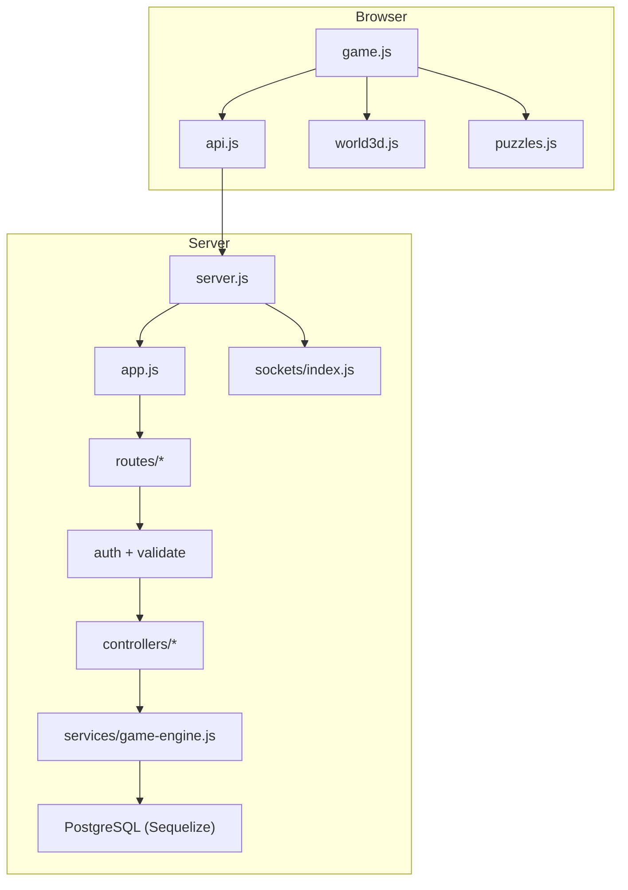

**Diagram sources**
- [server.js:1-47](file://backend/server.js#L1-L47)
- [app.js:1-55](file://backend/app.js#L1-L55)
- [sockets/index.js:1-19](file://backend/sockets/index.js#L1-L19)
- [routes/game-routes.js:1-15](file://backend/routes/game-routes.js#L1-L15)
- [routes/progress-routes.js:1-12](file://backend/routes/progress-routes.js#L1-L12)
- [controllers/game-controller.js:1-128](file://backend/controllers/game-controller.js#L1-L128)
- [controllers/progress-controller.js:1-79](file://backend/controllers/progress-controller.js#L1-L79)
- [services/game-engine.js:1-124](file://backend/services/game-engine.js#L1-L124)
- [config/db.js:1-45](file://backend/config/db.js#L1-L45)
- [public/js/api.js:1-208](file://backend/public/js/api.js#L1-L208)
- [public/js/game.js:1-825](file://backend/public/js/game.js#L1-L825)
- [public/js/world3d.js:1-363](file://backend/public/js/world3d.js#L1-L363)
- [public/js/puzzles.js:1-772](file://backend/public/js/puzzles.js#L1-L772)

**Section sources**
- [server.js:1-47](file://backend/server.js#L1-L47)
- [app.js:1-55](file://backend/app.js#L1-L55)

## Core Components
- Frontend API layer: Centralized HTTP client with auth token handling, error normalization, and a mock mode for offline/local testing.
- Game flow controller (frontend): Manages mission selection, scene entry, clue collection, decision making, and completion.
- 3D world engine: Three.js scene with interactable objects emitting interaction hints and events.
- Puzzle engine: In-browser mini-games per clue; success triggers evidence collection.
- Backend routes and middleware: Auth, input validation, rate limiting, security headers, and logging.
- Controllers and service layer: Validate business rules, persist sessions and progress, compute scores/stars, and integrate AI chat.
- Database models: GameSession and PlayerProgress store mutable game state and persistent achievements.
- Socket.IO: Connection management and room-based grouping for future real-time features.

**Section sources**
- [public/js/api.js:1-208](file://backend/public/js/api.js#L1-L208)
- [public/js/game.js:1-825](file://backend/public/js/game.js#L1-L825)
- [public/js/world3d.js:1-363](file://backend/public/js/world3d.js#L1-L363)
- [public/js/puzzles.js:1-772](file://backend/public/js/puzzles.js#L1-L772)
- [routes/game-routes.js:1-15](file://backend/routes/game-routes.js#L1-L15)
- [routes/progress-routes.js:1-12](file://backend/routes/progress-routes.js#L1-L12)
- [middleware/authMiddleware.js:1-38](file://backend/middleware/authMiddleware.js#L1-L38)
- [middleware/validate.js:1-14](file://backend/middleware/validate.js#L1-L14)
- [controllers/game-controller.js:1-128](file://backend/controllers/game-controller.js#L1-L128)
- [controllers/progress-controller.js:1-79](file://backend/controllers/progress-controller.js#L1-L79)
- [services/game-engine.js:1-124](file://backend/services/game-engine.js#L1-L124)
- [models/GameSession.js:1-15](file://backend/models/GameSession.js#L1-L15)
- [models/PlayerProgress.js:1-17](file://backend/models/PlayerProgress.js#L1-L17)

## Architecture Overview
The request-response cycle follows these layers:
- Browser: game.js orchestrates user actions and calls api.js methods.
- Server: server.js boots HTTP + Socket.IO; app.js configures middleware and mounts routes.
- Routes: route handlers attach auth and validation before invoking controllers.
- Controllers: enforce invariants, call services, and return normalized responses.
- Services: implement domain logic (session lifecycle, scoring, chat).
- Database: Sequelize models persist JSONB session state and progress records.

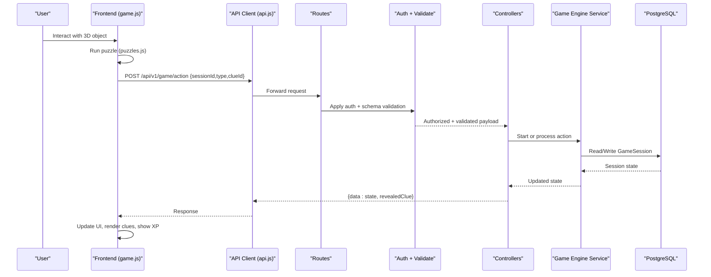

**Diagram sources**
- [public/js/game.js:539-631](file://backend/public/js/game.js#L539-L631)
- [public/js/puzzles.js:547-648](file://backend/public/js/puzzles.js#L547-L648)
- [public/js/api.js:170-182](file://backend/public/js/api.js#L170-L182)
- [routes/game-routes.js:8-12](file://backend/routes/game-routes.js#L8-L12)
- [middleware/authMiddleware.js:6-35](file://backend/middleware/authMiddleware.js#L6-L35)
- [middleware/validate.js:3-11](file://backend/middleware/validate.js#L3-L11)
- [controllers/game-controller.js:52-116](file://backend/controllers/game-controller.js#L52-L116)
- [services/game-engine.js:51-64](file://backend/services/game-engine.js#L51-L64)
- [models/GameSession.js:4-12](file://backend/models/GameSession.js#L4-L12)

## Detailed Component Analysis

### A. Request-Response Cycle: Starting a Game Session
- Frontend loads missions and starts a session by calling startGame.
- Backend creates a GameSession with initial state and returns scenario content plus merged state.
- Frontend renders briefing and enables story mode.

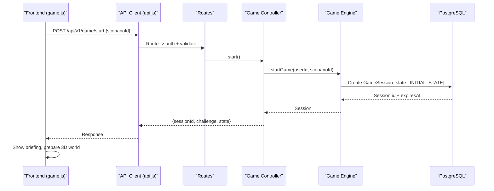

**Diagram sources**
- [public/js/game.js:465-482](file://backend/public/js/game.js#L465-L482)
- [public/js/api.js:170-175](file://backend/public/js/api.js#L170-L175)
- [routes/game-routes.js:8-10](file://backend/routes/game-routes.js#L8-L10)
- [controllers/game-controller.js:18-28](file://backend/controllers/game-controller.js#L18-L28)
- [services/game-engine.js:51-64](file://backend/services/game-engine.js#L51-L64)
- [models/GameSession.js:4-12](file://backend/models/GameSession.js#L4-L12)

**Section sources**
- [public/js/game.js:465-482](file://backend/public/js/game.js#L465-L482)
- [controllers/game-controller.js:18-28](file://backend/controllers/game-controller.js#L18-L28)
- [services/game-engine.js:51-64](file://backend/services/game-engine.js#L51-L64)

### B. Puzzle Solving Workflow and Evidence Collection
- User interacts with a 3D object; frontend runs a puzzle overlay.
- On success, frontend calls collect_clue action to persist collected clues.
- Backend validates phase/state, updates session state, and returns revealed clue info.

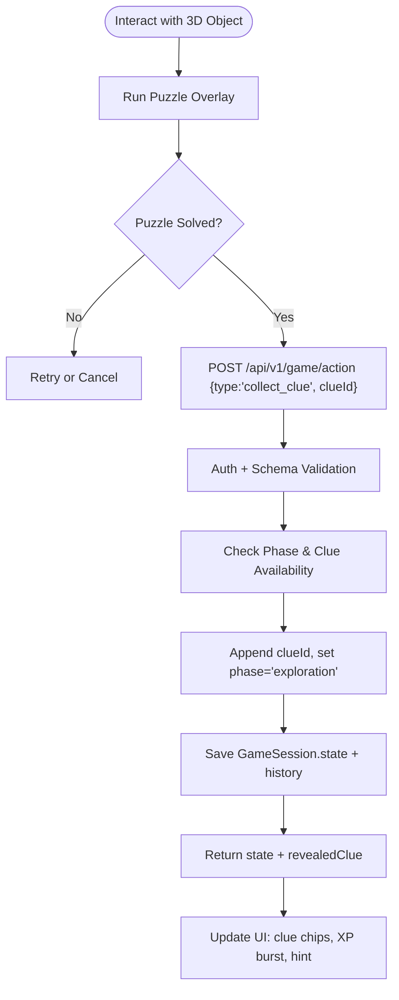

**Diagram sources**
- [public/js/game.js:539-557](file://backend/public/js/game.js#L539-L557)
- [public/js/puzzles.js:547-648](file://backend/public/js/puzzles.js#L547-L648)
- [public/js/api.js:177-182](file://backend/public/js/api.js#L177-L182)
- [routes/game-routes.js:11-12](file://backend/routes/game-routes.js#L11-L12)
- [controllers/game-controller.js:52-116](file://backend/controllers/game-controller.js#L52-L116)
- [validators/game-schemas.js:7-12](file://backend/validators/game-schemas.js#L7-L12)

**Section sources**
- [public/js/game.js:539-631](file://backend/public/js/game.js#L539-L631)
- [controllers/game-controller.js:52-116](file://backend/controllers/game-controller.js#L52-L116)

### C. Decision Making and Completion
- After collecting all clues, frontend presents options; choosing one transitions to reveal/completed phases.
- Backend enforces decision constraints, computes score and stars, marks completion, and returns final state.

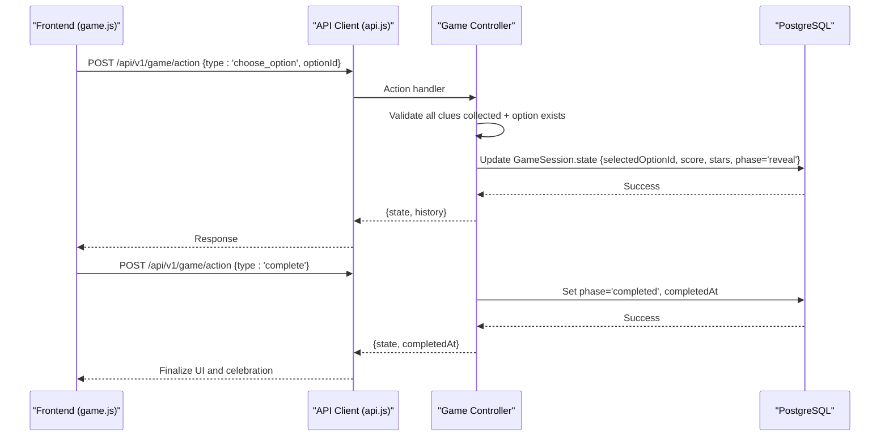

**Diagram sources**
- [public/js/game.js:633-705](file://backend/public/js/game.js#L633-L705)
- [public/js/api.js:177-182](file://backend/public/js/api.js#L177-L182)
- [controllers/game-controller.js:76-116](file://backend/controllers/game-controller.js#L76-L116)

**Section sources**
- [controllers/game-controller.js:76-116](file://backend/controllers/game-controller.js#L76-L116)
- [public/js/game.js:633-705](file://backend/public/js/game.js#L633-L705)

### D. Progress Tracking and Skill Updates
- After completing a mission, frontend submits progress with evidence summary.
- Backend verifies session completion, calculates safe score and stars, upserts PlayerProgress, and updates PlayerSkill indicators.

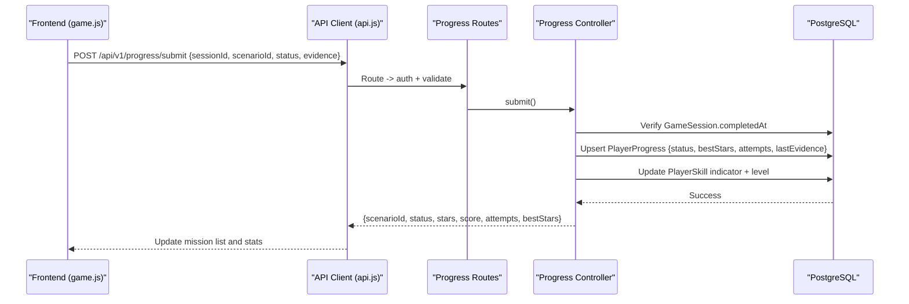

**Diagram sources**
- [public/js/game.js:677-705](file://backend/public/js/game.js#L677-L705)
- [public/js/api.js:195-204](file://backend/public/js/api.js#L195-L204)
- [routes/progress-routes.js:8-9](file://backend/routes/progress-routes.js#L8-L9)
- [controllers/progress-controller.js:5-71](file://backend/controllers/progress-controller.js#L5-L71)
- [models/PlayerProgress.js:4-14](file://backend/models/PlayerProgress.js#L4-L14)

**Section sources**
- [controllers/progress-controller.js:5-71](file://backend/controllers/progress-controller.js#L5-L71)
- [public/js/game.js:677-705](file://backend/public/js/game.js#L677-L705)

### E. Chat and AI Integration
- Frontend sends chat messages within an active session.
- Backend builds context from scenario content and player metrics, calls AI service, logs interaction, and returns assistant message and optional alert.

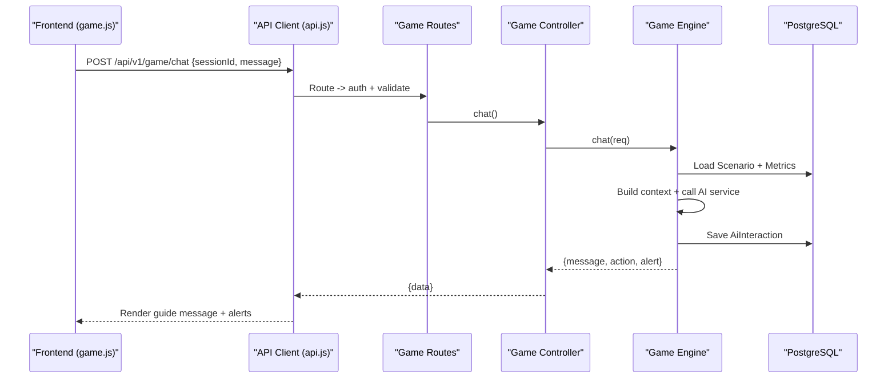

**Diagram sources**
- [public/js/game.js:707-728](file://backend/public/js/game.js#L707-L728)
- [public/js/api.js:184-189](file://backend/public/js/api.js#L184-L189)
- [routes/game-routes.js:12](file://backend/routes/game-routes.js#L12)
- [controllers/game-controller.js:118-120](file://backend/controllers/game-controller.js#L118-L120)
- [services/game-engine.js:66-121](file://backend/services/game-engine.js#L66-L121)

**Section sources**
- [services/game-engine.js:66-121](file://backend/services/game-engine.js#L66-L121)
- [controllers/game-controller.js:118-120](file://backend/controllers/game-controller.js#L118-L120)

### F. Real-Time Synchronization with Socket.IO
- Server initializes Socket.IO with CORS and transports.
- Clients can join rooms by gameId for future live updates.
- Current implementation logs connections and room joins; broadcast hooks are available for extending multiplayer state sync.

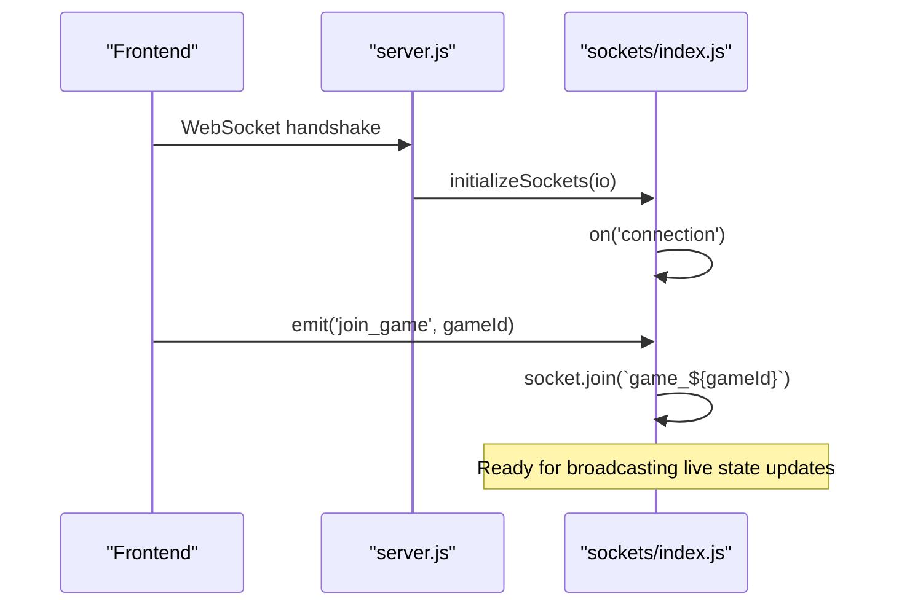

**Diagram sources**
- [server.js:1-47](file://backend/server.js#L1-L47)
- [sockets/index.js:1-19](file://backend/sockets/index.js#L1-L19)

**Section sources**
- [server.js:1-47](file://backend/server.js#L1-L47)
- [sockets/index.js:1-19](file://backend/sockets/index.js#L1-L19)

### G. Data Transformation Layers and Validation Pipelines
- Input validation: Joi schemas enforce structure and types for start, action, chat, and progress submissions.
- Output normalization: Controllers merge initial state with persisted state and sanitize fields (e.g., score bounds, stars).
- Error handling: Centralized AppError and asyncHandler ensure consistent error shapes and logging.

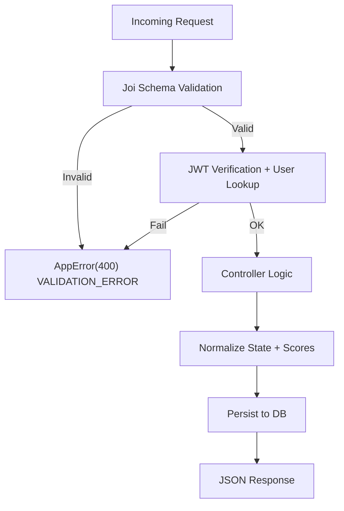

**Diagram sources**
- [middleware/validate.js:3-11](file://backend/middleware/validate.js#L3-L11)
- [validators/game-schemas.js:3-24](file://backend/validators/game-schemas.js#L3-L24)
- [middleware/authMiddleware.js:6-35](file://backend/middleware/authMiddleware.js#L6-L35)
- [controllers/game-controller.js:52-116](file://backend/controllers/game-controller.js#L52-L116)

**Section sources**
- [middleware/validate.js:1-14](file://backend/middleware/validate.js#L1-L14)
- [validators/game-schemas.js:1-27](file://backend/validators/game-schemas.js#L1-L27)
- [middleware/authMiddleware.js:1-38](file://backend/middleware/authMiddleware.js#L1-L38)

### H. Optimistic UI Updates and Conflict Resolution
- Optimistic UI: Frontend immediately updates local state (e.g., marking clue collected, showing XP bursts) before server confirmation to keep interactions responsive.
- Conflict resolution: Backend enforces authoritative state transitions (phase checks, duplicate clue prevention, decision locks) and returns errors like ALREADY_DECIDED or CLUES_REQUIRED. Frontend handles these by reverting or prompting the user.

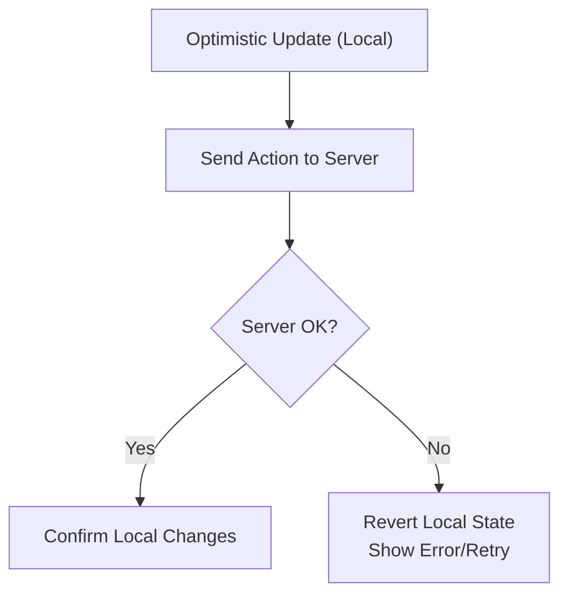

**Section sources**
- [public/js/game.js:539-631](file://backend/public/js/game.js#L539-L631)
- [controllers/game-controller.js:63-91](file://backend/controllers/game-controller.js#L63-L91)

### I. Multi-Player State Synchronization Strategy
- Room model: Clients join rooms identified by gameId for targeted broadcasts.
- Future extension: Use socket.emit.to('game_' + gameId) to push live state changes (e.g., other players’ decisions, shared objectives).
- Consistency: Maintain single source of truth in GameSession; clients reconcile via optimistic updates and server confirmations.

**Section sources**
- [sockets/index.js:3-15](file://backend/sockets/index.js#L3-L15)
- [server.js:13-21](file://backend/server.js#L13-L21)

### J. Caching Strategies
- No explicit in-memory cache is implemented.
- Potential optimizations:
  - Cache static scenario content at the edge or CDN.
  - Short-lived read cache for challenges listing if traffic spikes.
  - Debounce frequent state reads during high-frequency interactions.

[No sources needed since this section provides general guidance]

## Dependency Analysis
Key dependencies and relationships:
- Frontend modules depend on each other via global references (window.api, window.PuzzleEngine, window.AwarQuestWorld).
- Backend routes depend on middleware for auth and validation.
- Controllers depend on services for domain logic and models for persistence.
- Database configuration centralizes connection pooling and SSL settings.

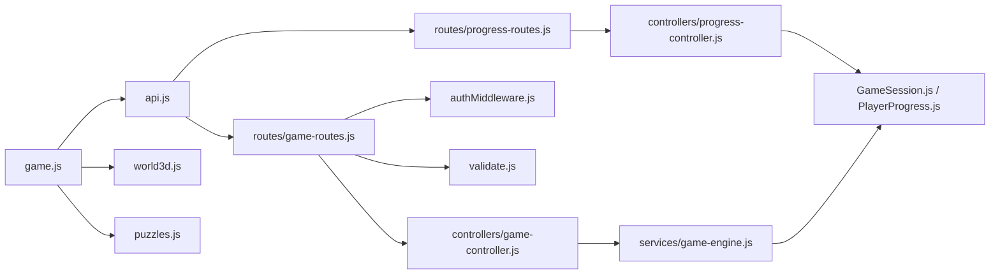

**Diagram sources**
- [public/js/game.js:1-825](file://backend/public/js/game.js#L1-L825)
- [public/js/api.js:1-208](file://backend/public/js/api.js#L1-L208)
- [public/js/world3d.js:1-363](file://backend/public/js/world3d.js#L1-L363)
- [public/js/puzzles.js:1-772](file://backend/public/js/puzzles.js#L1-L772)
- [routes/game-routes.js:1-15](file://backend/routes/game-routes.js#L1-L15)
- [routes/progress-routes.js:1-12](file://backend/routes/progress-routes.js#L1-L12)
- [middleware/authMiddleware.js:1-38](file://backend/middleware/authMiddleware.js#L1-L38)
- [middleware/validate.js:1-14](file://backend/middleware/validate.js#L1-L14)
- [controllers/game-controller.js:1-128](file://backend/controllers/game-controller.js#L1-L128)
- [controllers/progress-controller.js:1-79](file://backend/controllers/progress-controller.js#L1-L79)
- [services/game-engine.js:1-124](file://backend/services/game-engine.js#L1-L124)
- [models/GameSession.js:1-15](file://backend/models/GameSession.js#L1-L15)
- [models/PlayerProgress.js:1-17](file://backend/models/PlayerProgress.js#L1-L17)

**Section sources**
- [routes/game-routes.js:1-15](file://backend/routes/game-routes.js#L1-L15)
- [routes/progress-routes.js:1-12](file://backend/routes/progress-routes.js#L1-L12)
- [controllers/game-controller.js:1-128](file://backend/controllers/game-controller.js#L1-L128)
- [controllers/progress-controller.js:1-79](file://backend/controllers/progress-controller.js#L1-L79)
- [services/game-engine.js:1-124](file://backend/services/game-engine.js#L1-L124)

## Performance Considerations
- Database pool sizing: Configured pool with max/min/idle/evict settings; monitor query latency and adjust based on load.
- JSONB usage: Efficient for flexible session state but ensure indexes where necessary for queries.
- Frontend rendering: Three.js loop uses requestAnimationFrame; dispose scenes when switching screens to free memory.
- Network requests: Batch independent reads (missions, progress, scores) using Promise.all to reduce round trips.
- Validation: Early validation reduces unnecessary processing and DB writes.

[No sources needed since this section provides general guidance]

## Troubleshooting Guide
Common issues and resolutions:
- Authentication failures: Ensure valid JWT in Authorization header or cookie; check token version mismatch.
- Validation errors: Review request payloads against Joi schemas; fix missing or invalid fields.
- Session conflicts: Handle 409 errors indicating already decided or clues required; guide users to complete prerequisites.
- Database connectivity: Health endpoints expose readiness; verify environment variables and SSL settings.
- Socket.IO rooms: Confirm origin and credentials; log connection and room join events for debugging.

**Section sources**
- [middleware/authMiddleware.js:6-35](file://backend/middleware/authMiddleware.js#L6-L35)
- [middleware/validate.js:3-11](file://backend/middleware/validate.js#L3-L11)
- [controllers/game-controller.js:63-91](file://backend/controllers/game-controller.js#L63-L91)
- [app.js:34-38](file://backend/app.js#L34-L38)
- [sockets/index.js:3-15](file://backend/sockets/index.js#L3-L15)

## Conclusion
The Life Skills Adventure system implements a robust, layered data flow:
- Frontend orchestrates interactive experiences with Three.js and puzzles, performing optimistic UI updates for responsiveness.
- Backend enforces strict validation, authentication, and business rules, maintaining authoritative state in PostgreSQL.
- Socket.IO provides a foundation for real-time synchronization, enabling future multi-player scenarios with room-based broadcasts.
- Data consistency is ensured through server-side state transitions, conflict detection, and careful progression gating.
- Extensibility points include AI-driven chat, skill progression tracking, and scalable caching strategies.