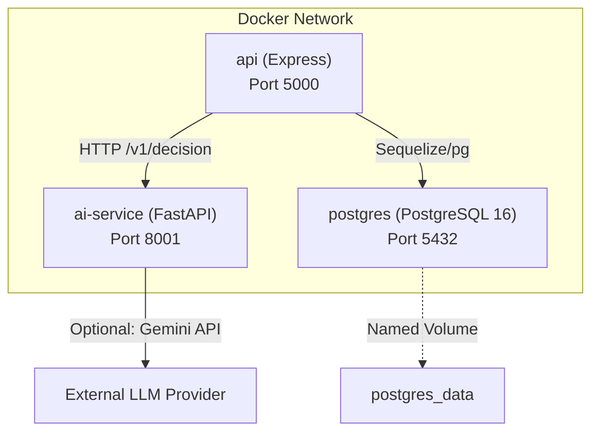
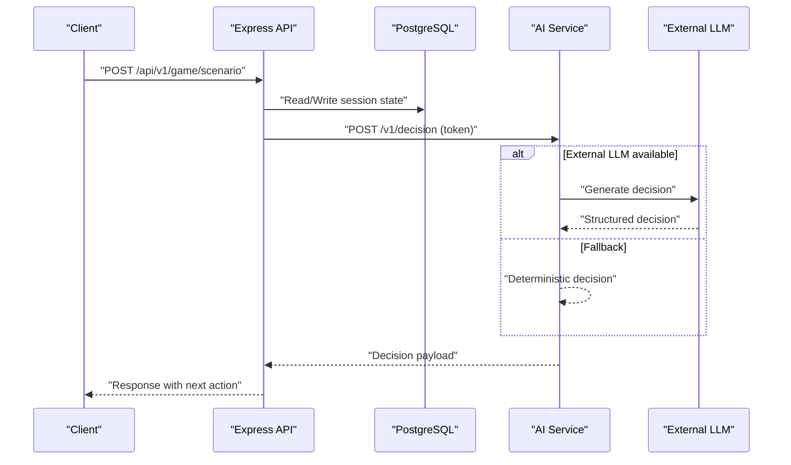
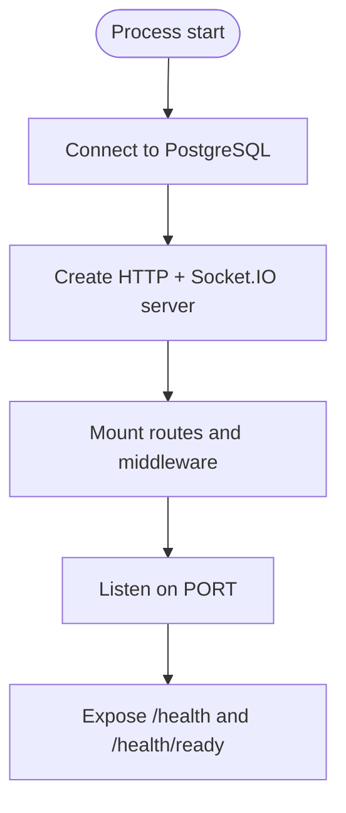
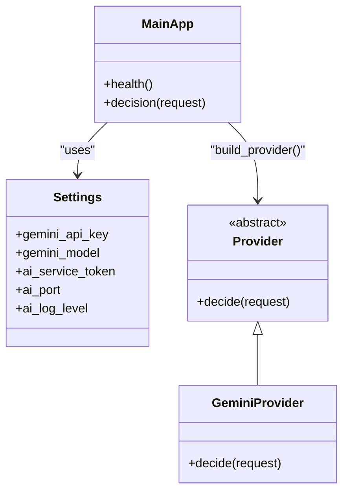
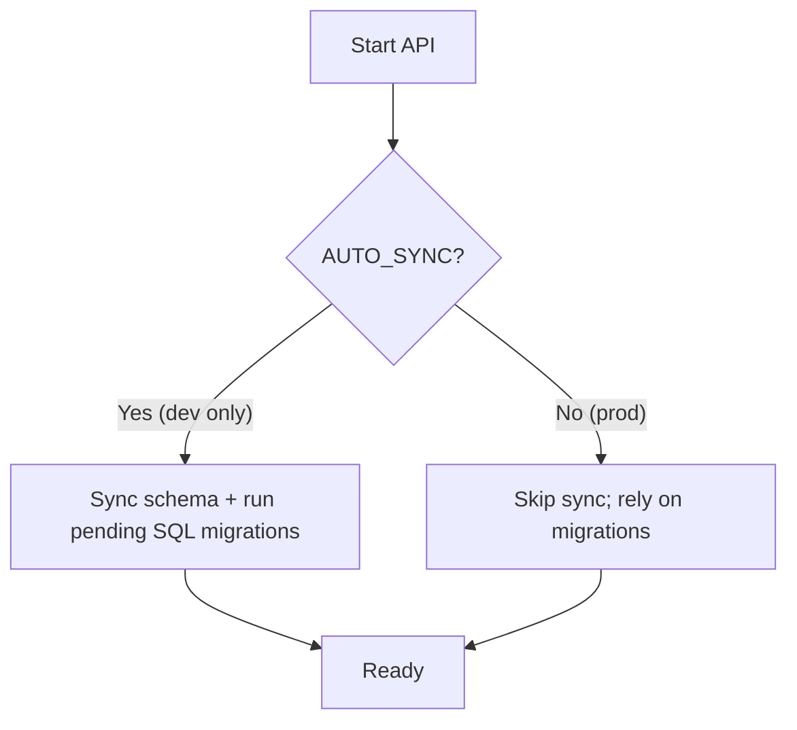
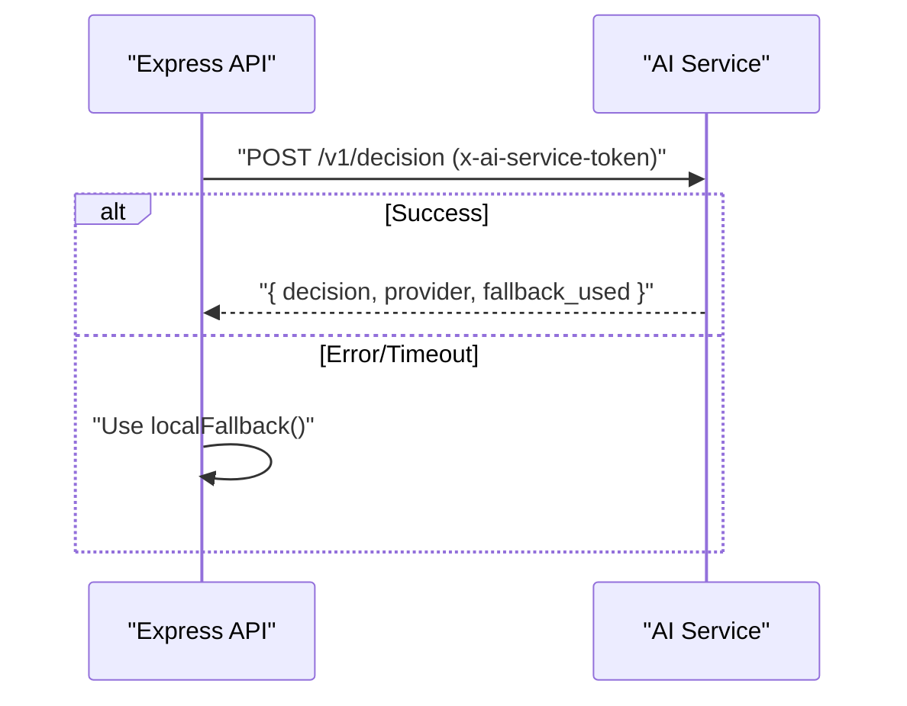
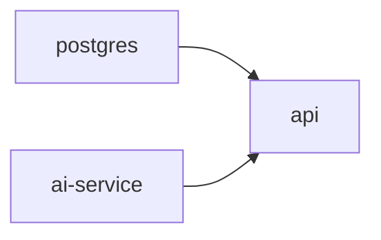

# Deployment Topology

<cite>
**Referenced Files in This Document**
- [docker-compose.yml](file://docker-compose.yml)
- [DEPLOYMENT.md](file://DEPLOYMENT.md)
- [backend/Dockerfile](file://backend/Dockerfile)
- [backend/ai-service/Dockerfile](file://backend/ai-service/Dockerfile)
- [backend/config/env.js](file://backend/config/env.js)
- [backend/config/db.js](file://backend/config/db.js)
- [backend/server.js](file://backend/server.js)
- [backend/app.js](file://backend/app.js)
- [backend/services/ai-service.js](file://backend/services/ai-service.js)
- [backend/ai-service/app/main.py](file://backend/ai-service/app/main.py)
- [backend/ai-service/app/config.py](file://backend/ai-service/app/config.py)
- [backend/ai-service/app/provider.py](file://backend/ai-service/app/provider.py)
- [backend/package.json](file://backend/package.json)
- [backend/ai-service/requirements.txt](file://backend/ai-service/requirements.txt)
</cite>

## Table of Contents
1. Introduction
2. Project Structure
3. Core Components
4. Architecture Overview
5. Detailed Component Analysis
6. Dependency Analysis
7. Performance Considerations
8. Troubleshooting Guide
9. Conclusion

## Introduction
This document describes the deployment topology for the Life Skills Adventure platform, focusing on a containerized architecture orchestrated with Docker Compose. The stack includes:
- Express backend (Node.js) exposing REST and WebSocket endpoints
- Python FastAPI AI microservice providing game decisions with deterministic fallback
- PostgreSQL 16 database for persistent data
- Redis cache is not present in this repository; if needed, it can be added as an additional service

The documentation covers network configuration, volume management, environment variable distribution, production strategies (scaling, health checks, service discovery), infrastructure requirements, resource allocation guidelines, monitoring setup, backup and recovery procedures, log aggregation, performance optimization, and troubleshooting.

## Project Structure
At runtime, Docker Compose defines three services:
- postgres: Relational database with a named volume for persistence and a health check
- ai-service: Python FastAPI service that validates requests via a shared token and returns structured decisions
- api: Node.js Express server that depends on both postgres and ai-service, exposes HTTP/WebSocket, and integrates with the AI service

**Diagram sources**
- [docker-compose.yml:3-66](file://docker-compose.yml#L3-L66)
- [backend/server.js:9-25](file://backend/server.js#L9-L25)
- [backend/ai-service/app/main.py:18-32](file://backend/ai-service/app/main.py#L18-L32)

**Section sources**
- [docker-compose.yml:1-66](file://docker-compose.yml#L1-L66)
- [DEPLOYMENT.md:1-61](file://DEPLOYMENT.md#L1-L61)

## Core Components
- Express API server: Initializes HTTP server, mounts routes, configures CORS, security middleware, logging, and exposes health endpoints. It also initializes Socket.IO for real-time features.
- AI microservice: Validates incoming requests using a shared token, supports optional Gemini integration, and provides deterministic fallback when external AI is unavailable.
- Database: PostgreSQL with connection pooling, SSL option, and migration support. Health-checked by Compose.
- Build artifacts: Multi-stage Node build and Python image with pinned dependencies.

Key responsibilities:
- Environment validation and defaults for robustness
- Secure inter-service communication via token
- Graceful shutdown and readiness probes
- Deterministic fallback to ensure uptime

**Section sources**
- [backend/app.js:15-55](file://backend/app.js#L15-L55)
- [backend/server.js:9-47](file://backend/server.js#L9-L47)
- [backend/config/env.js:6-39](file://backend/config/env.js#L6-L39)
- [backend/config/db.js:7-44](file://backend/config/db.js#L7-L44)
- [backend/ai-service/app/main.py:14-32](file://backend/ai-service/app/main.py#L14-L32)
- [backend/ai-service/app/config.py:5-23](file://backend/ai-service/app/config.py#L5-L23)
- [backend/Dockerfile:1-14](file://backend/Dockerfile#L1-L14)
- [backend/ai-service/Dockerfile:1-8](file://backend/ai-service/Dockerfile#L1-L8)

## Architecture Overview
The system follows a layered, containerized architecture:
- Client applications access the Express API over HTTPS (terminated at your reverse proxy).
- The Express API communicates with PostgreSQL for persistence and with the AI service for decision-making.
- The AI service optionally calls an external LLM provider; otherwise, it uses deterministic logic.

**Diagram sources**
- [backend/services/ai-service.js:18-48](file://backend/services/ai-service.js#L18-L48)
- [backend/ai-service/app/main.py:22-32](file://backend/ai-service/app/main.py#L22-L32)
- [backend/config/db.js:15-29](file://backend/config/db.js#L15-L29)

## Detailed Component Analysis

### Express Backend (Node.js)
- Entrypoint: Starts HTTP server, connects to the database, initializes Socket.IO, and listens on the configured port.
- Middleware: Security headers, CORS, JSON parsing with limits, request ID, rate limiting, error handling, and structured logging.
- Routes: Organized by feature under /api/v1/*, plus static assets and root index.
- Health endpoints: /health and /health/ready for liveness/readiness checks.

**Diagram sources**
- [backend/server.js:9-25](file://backend/server.js#L9-L25)
- [backend/app.js:15-55](file://backend/app.js#L15-L55)

**Section sources**
- [backend/server.js:1-47](file://backend/server.js#L1-L47)
- [backend/app.js:1-55](file://backend/app.js#L1-L55)
- [backend/config/logger.js:1-13](file://backend/config/logger.js#L1-L13)

### AI Microservice (Python FastAPI)
- Token verification: All decision endpoints require a shared token header validated via constant-time comparison.
- Decision endpoint: Accepts structured input, optionally calls Gemini, and returns a validated decision object. Falls back deterministically on errors or missing keys.
- Settings: Loaded from environment with validation and secrets handling.

**Diagram sources**
- [backend/ai-service/app/config.py:5-23](file://backend/ai-service/app/config.py#L5-L23)
- [backend/ai-service/app/main.py:14-32](file://backend/ai-service/app/main.py#L14-L32)
- [backend/ai-service/app/provider.py:8-37](file://backend/ai-service/app/provider.py#L8-L37)

**Section sources**
- [backend/ai-service/app/main.py:1-33](file://backend/ai-service/app/main.py#L1-L33)
- [backend/ai-service/app/config.py:1-24](file://backend/ai-service/app/config.py#L1-L24)
- [backend/ai-service/app/provider.py:1-38](file://backend/ai-service/app/provider.py#L1-L38)

### Database Integration
- Connection: Sequelize configured with dialect options, pool sizing, retry behavior, and optional SSL.
- Migrations: Supports automatic SQL migrations in development; enforced to use explicit migrations in production.
- Health: Readiness probe verifies connectivity.

**Diagram sources**
- [backend/config/db.js:15-42](file://backend/config/db.js#L15-L42)

**Section sources**
- [backend/config/db.js:1-45](file://backend/config/db.js#L1-L45)

### Inter-Service Communication
- The Express backend calls the AI service with a shared token and a timeout. On failure or unavailability, it falls back to deterministic logic.
- The AI service enforces token validation and returns a consistent response shape.

**Diagram sources**
- [backend/services/ai-service.js:18-48](file://backend/services/ai-service.js#L18-L48)
- [backend/ai-service/app/main.py:22-32](file://backend/ai-service/app/main.py#L22-L32)

**Section sources**
- [backend/services/ai-service.js:1-51](file://backend/services/ai-service.js#L1-L51)

## Dependency Analysis
Runtime dependencies between services are defined in Docker Compose:
- api depends_on postgres (healthy) and ai-service (started)
- ai-service has no internal dependencies
- postgres exposes a named volume for data persistence

**Diagram sources**
- [docker-compose.yml:3-66](file://docker-compose.yml#L3-L66)

**Section sources**
- [docker-compose.yml:1-66](file://docker-compose.yml#L1-L66)

## Performance Considerations
- Database connection pool: Tune pool size based on expected concurrency and CPU/memory. Current defaults provide a balanced baseline.
- Request timeouts: Configure AI request timeout to balance responsiveness and reliability.
- Rate limiting: Apply per-route or global rate limits to protect against abuse.
- Static assets: Serve via CDN or reverse proxy caching in front of the API.
- Scaling:
  - Horizontal scaling: Run multiple replicas of api and ai-service behind a load balancer. Keep postgres single-writer; consider read replicas for analytics-only workloads.
  - Statelessness: Ensure sessions are stored externally (e.g., Redis) if you scale horizontally.
  - Resource limits: Set CPU/memory limits per container to prevent noisy neighbor issues.
- Observability:
  - Structured logs: Use pino for API and standard logging for AI service; forward to centralized logging.
  - Metrics: Expose application metrics (e.g., request latency, error rates) and scrape with a metrics collector.
  - Health checks: Leverage /health and /health/ready for orchestration health probing.

[No sources needed since this section provides general guidance]

## Troubleshooting Guide
Common issues and resolutions:
- Database connection failures
  - Verify DATABASE_URL, credentials, and network reachability.
  - Check pg_isready and firewall rules.
  - Confirm AUTO_SYNC is disabled in production; apply migrations explicitly.
- AI service unreachable or returning errors
  - Validate AI_SERVICE_URL and AI_SERVICE_TOKEN match across services.
  - Inspect AI service logs for provider initialization errors.
  - Confirm fallback behavior is active when external provider is down.
- CORS errors
  - Ensure CORS_ORIGINS includes all client origins.
  - Verify credentials are allowed and methods/headers are permitted.
- Port conflicts
  - Confirm host ports are free or remapped in docker-compose.
- Graceful shutdown
  - Ensure SIGTERM/SIGINT handlers close sockets and DB connections.

Operational tips:
- Use health endpoints to verify readiness before routing traffic.
- Rotate secrets regularly and store them securely (secrets manager or encrypted env files).
- Back up PostgreSQL volumes regularly and test restore procedures.

**Section sources**
- [backend/config/db.js:15-42](file://backend/config/db.js#L15-L42)
- [backend/services/ai-service.js:18-48](file://backend/services/ai-service.js#L18-L48)
- [backend/app.js:21-32](file://backend/app.js#L21-L32)
- [docker-compose.yml:14-18](file://docker-compose.yml#L14-L18)
- [DEPLOYMENT.md:31-61](file://DEPLOYMENT.md#L31-L61)

## Conclusion
The Life Skills Adventure platform deploys as a resilient, containerized stack with clear separation of concerns:
- Express API handles business logic, authentication, and real-time features
- AI microservice provides intelligent decisions with deterministic fallback
- PostgreSQL persists critical state with safe migration practices
- Docker Compose orchestrates networking, volumes, and startup ordering

For production, enforce strict environment validation, secure secrets management, health-based readiness, and observability. Scale horizontally where appropriate, back up databases, and monitor performance to maintain reliability and responsiveness.

[No sources needed since this section summarizes without analyzing specific files]