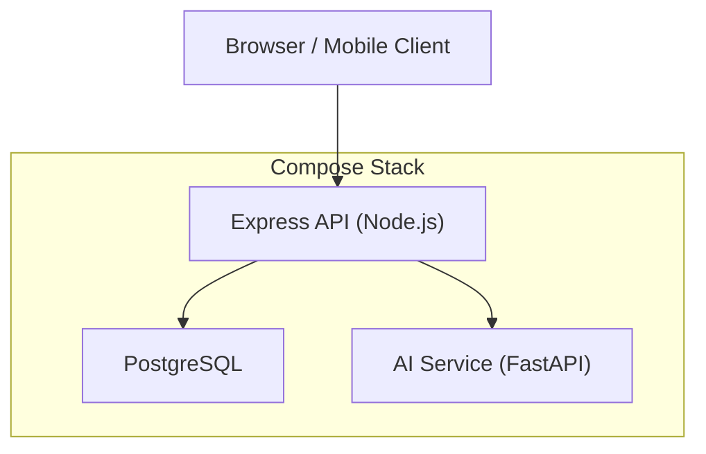
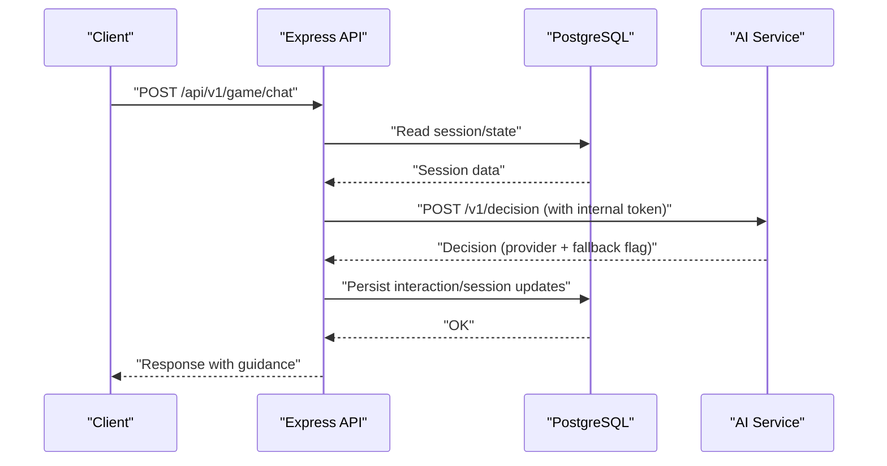
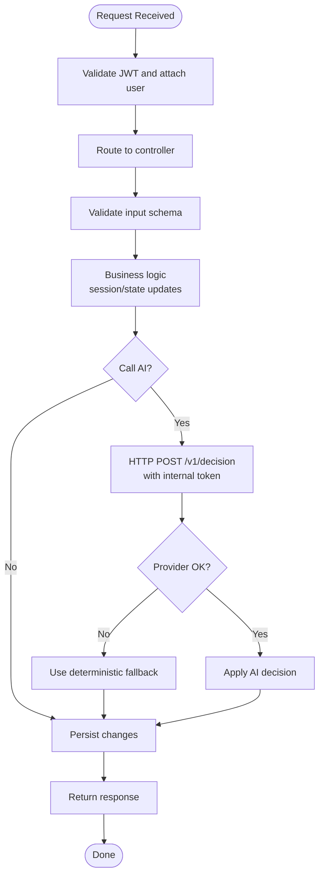
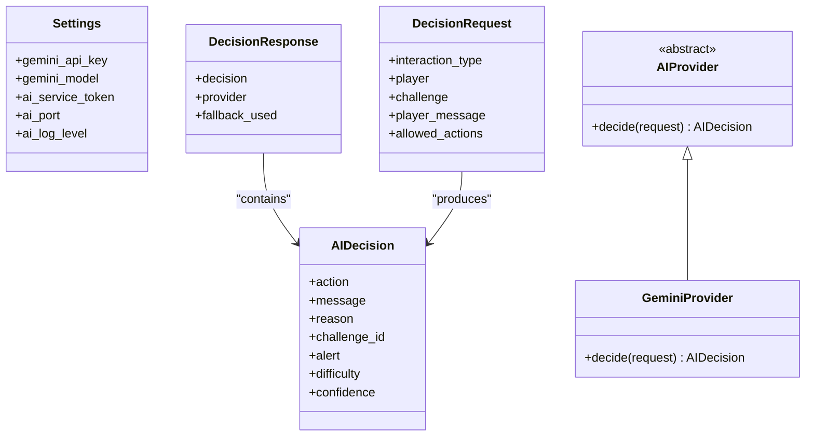
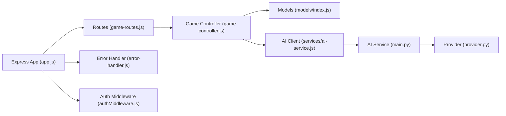

# Microservices Architecture

<cite>
**Referenced Files in This Document**
- [docker-compose.yml](file://docker-compose.yml)
- [backend/app.js](file://backend/app.js)
- [backend/server.js](file://backend/server.js)
- [backend/services/ai-service.js](file://backend/services/ai-service.js)
- [backend/config/env.js](file://backend/config/env.js)
- [backend/middleware/authMiddleware.js](file://backend/middleware/authMiddleware.js)
- [backend/middleware/error-handler.js](file://backend/middleware/error-handler.js)
- [backend/utils/app-error.js](file://backend/utils/app-error.js)
- [backend/controllers/game-controller.js](file://backend/controllers/game-controller.js)
- [backend/routes/game-routes.js](file://backend/routes/game-routes.js)
- [backend/models/index.js](file://backend/models/index.js)
- [backend/models/AiInteraction.js](file://backend/models/AiInteraction.js)
- [backend/ai-service/app/main.py](file://backend/ai-service/app/main.py)
- [backend/ai-service/app/config.py](file://backend/ai-service/app/config.py)
- [backend/ai-service/app/schemas.py](file://backend/ai-service/app/schemas.py)
- [backend/ai-service/app/provider.py](file://backend/ai-service/app/provider.py)
- [DEPLOYMENT.md](file://DEPLOYMENT.md)
</cite>

## Table of Contents
1. Introduction
2. Project Structure
3. Core Components
4. Architecture Overview
5. Detailed Component Analysis
6. Dependency Analysis
7. Performance Considerations
8. Troubleshooting Guide
9. Conclusion

## Introduction
This document describes the microservices architecture for the Life Skills Adventure platform, focusing on the separation between the main Express.js backend service and the Python FastAPI AI service. It explains service boundaries, communication protocols (REST API), authentication across services using shared tokens, data ownership patterns, deployment topology with Docker Compose, inter-service error handling, scalability considerations, load balancing approaches, and monitoring patterns for distributed systems.

## Project Structure
The system is composed of:
- PostgreSQL database for authoritative state (users, sessions, progress, resources, audit logs).
- Node.js/Express.js API service providing REST endpoints and WebSocket support for game logic, authentication, and orchestration.
- Python/FastAPI AI service that returns guided decisions for gameplay scenarios with deterministic fallback when external AI providers are unavailable.

**Diagram sources**
- [docker-compose.yml:3-62](file://docker-compose.yml#L3-L62)

**Section sources**
- [docker-compose.yml:3-62](file://docker-compose.yml#L3-L62)
- [DEPLOYMENT.md:5-10](file://DEPLOYMENT.md#L5-L10)

## Core Components
- Express API service:
  - Serves REST APIs under /api/v1/* and static frontend assets.
  - Manages authentication via HttpOnly JWT cookies and Bearer tokens.
  - Orchestrates game sessions, scenario content, and telemetry.
  - Calls the AI service for decision-making with a timeout and deterministic fallback.
- AI service:
  - Exposes a secure internal endpoint to compute next actions based on player context.
  - Supports Gemini provider with strict JSON schema validation and deterministic fallback.
  - Validates an internal token header for inter-service authorization.

Key responsibilities and boundaries:
- Data ownership:
  - Users, profiles, sessions, progress, skills, resources, and audit events reside in PostgreSQL and are owned by the Express API.
  - The AI service is stateless; it does not persist application state.
- Communication:
  - Inter-service call uses HTTP POST to /v1/decision with a shared secret header.
  - Client-to-API uses HTTPS (in production) with JWT-based auth.

**Section sources**
- [backend/app.js:15-54](file://backend/app.js#L15-L54)
- [backend/server.js:9-46](file://backend/server.js#L9-L46)
- [backend/services/ai-service.js:18-48](file://backend/services/ai-service.js#L18-L48)
- [backend/ai-service/app/main.py:14-32](file://backend/ai-service/app/main.py#L14-L32)
- [backend/ai-service/app/provider.py:12-37](file://backend/ai-service/app/provider.py#L12-L37)

## Architecture Overview
The runtime topology includes three containers orchestrated by Docker Compose:
- postgres: Relational store with health checks and persistent volumes.
- api: Express server with CORS, security headers, request logging, and graceful shutdown.
- ai-service: FastAPI service with token verification and provider abstraction.

**Diagram sources**
- [backend/routes/game-routes.js:8-12](file://backend/routes/game-routes.js#L8-L12)
- [backend/controllers/game-controller.js:118-120](file://backend/controllers/game-controller.js#L118-L120)
- [backend/services/ai-service.js:18-48](file://backend/services/ai-service.js#L18-L48)
- [backend/ai-service/app/main.py:22-32](file://backend/ai-service/app/main.py#L22-L32)
- [docker-compose.yml:3-62](file://docker-compose.yml#L3-L62)

## Detailed Component Analysis

### Express API Service
- Entry points:
  - Application bootstrap sets up middleware (security, CORS, JSON parsing, logging), mounts routes, serves static assets, and defines health/readiness endpoints.
  - Server startup initializes database connection, creates HTTP server, attaches Socket.IO, and handles graceful shutdown.
- Authentication:
  - Middleware extracts JWT from cookies or Authorization header, verifies signature, validates user presence and token version, and attaches user to request.
- Error handling:
  - Centralized error handler normalizes errors, maps Sequelize constraints to status codes, logs with requestId, and returns structured error responses.
- Game flow:
  - Controllers manage session lifecycle, validate actions, update state, and integrate with AI via the AI client service.

**Diagram sources**
- [backend/app.js:15-54](file://backend/app.js#L15-L54)
- [backend/middleware/authMiddleware.js:6-35](file://backend/middleware/authMiddleware.js#L6-L35)
- [backend/middleware/error-handler.js:15-49](file://backend/middleware/error-handler.js#L15-L49)
- [backend/controllers/game-controller.js:18-120](file://backend/controllers/game-controller.js#L18-L120)
- [backend/services/ai-service.js:18-48](file://backend/services/ai-service.js#L18-L48)

**Section sources**
- [backend/app.js:15-54](file://backend/app.js#L15-L54)
- [backend/server.js:9-46](file://backend/server.js#L9-L46)
- [backend/middleware/authMiddleware.js:6-35](file://backend/middleware/authMiddleware.js#L6-L35)
- [backend/middleware/error-handler.js:15-49](file://backend/middleware/error-handler.js#L15-L49)
- [backend/controllers/game-controller.js:18-120](file://backend/controllers/game-controller.js#L18-L120)

### AI Service (FastAPI)
- Security:
  - Endpoint requires a shared internal token header; mismatch results in 401 Unauthorized.
- Decision pipeline:
  - Builds provider if configured; otherwise uses deterministic logic.
  - Calls external model asynchronously with a timeout; on failure, falls back to deterministic decision.
- Schema enforcement:
  - Pydantic models enforce strict request/response contracts, including allowed actions and difficulty levels.

**Diagram sources**
- [backend/ai-service/app/config.py:5-23](file://backend/ai-service/app/config.py#L5-L23)
- [backend/ai-service/app/schemas.py:48-70](file://backend/ai-service/app/schemas.py#L48-L70)
- [backend/ai-service/app/provider.py:8-37](file://backend/ai-service/app/provider.py#L8-L37)

**Section sources**
- [backend/ai-service/app/main.py:14-32](file://backend/ai-service/app/main.py#L14-L32)
- [backend/ai-service/app/config.py:5-23](file://backend/ai-service/app/config.py#L5-L23)
- [backend/ai-service/app/schemas.py:48-70](file://backend/ai-service/app/schemas.py#L48-L70)
- [backend/ai-service/app/provider.py:12-37](file://backend/ai-service/app/provider.py#L12-L37)

### Service Boundaries and Data Ownership
- Express API owns:
  - User accounts, profiles, game sessions, progress, skills, scenarios, resources, and audit/analytics events stored in PostgreSQL.
  - Session state persistence and business rule enforcement.
- AI service owns:
  - Stateless decision computation based on provided context; no application state persistence.
- Shared state:
  - None beyond transient request payloads. All durable state lives in the database accessed by the API.

**Section sources**
- [backend/models/index.js:14-31](file://backend/models/index.js#L14-L31)
- [backend/models/AiInteraction.js:4-12](file://backend/models/AiInteraction.js#L4-L12)
- [backend/services/ai-service.js:18-48](file://backend/services/ai-service.js#L18-L48)

### Authentication Across Service Boundaries
- Client to API:
  - JWT issued by the API and delivered via HttpOnly cookie or Authorization header.
  - Middleware verifies token and attaches user context.
- API to AI service:
  - Internal token passed via a custom header; AI service validates against its configured secret.
  - Ensures only trusted internal callers can invoke decision endpoints.

**Section sources**
- [backend/middleware/authMiddleware.js:6-35](file://backend/middleware/authMiddleware.js#L6-L35)
- [backend/services/ai-service.js:24-33](file://backend/services/ai-service.js#L24-L33)
- [backend/ai-service/app/main.py:14-16](file://backend/ai-service/app/main.py#L14-L16)

### Deployment Topology and Orchestration
- Docker Compose defines:
  - postgres with health check and persistent volume.
  - ai-service built from the Python app directory with environment variables for provider configuration and internal token.
  - api built from the Node.js backend with environment variables for DB, JWT secrets, CORS, and AI integration toggles.
- Startup ordering:
  - API depends on postgres being healthy and ai-service started before launching.

**Section sources**
- [docker-compose.yml:3-62](file://docker-compose.yml#L3-L62)
- [DEPLOYMENT.md:31-43](file://DEPLOYMENT.md#L31-L43)

### Inter-Service Error Handling Strategies
- API side:
  - Uses timeouts and abort signals when calling AI service; on failure, logs warning and falls back to deterministic logic.
  - Centralized error handler normalizes errors, maps DB constraint violations to appropriate status codes, and returns consistent error envelopes with requestId.
- AI service side:
  - Validates internal token; returns 401 on unauthorized requests.
  - Wraps external provider calls with timeouts and exceptions; returns deterministic decision with fallback flag when errors occur.

**Section sources**
- [backend/services/ai-service.js:21-48](file://backend/services/ai-service.js#L21-L48)
- [backend/middleware/error-handler.js:8-49](file://backend/middleware/error-handler.js#L8-L49)
- [backend/utils/app-error.js:1-12](file://backend/utils/app-error.js#L1-L12)
- [backend/ai-service/app/main.py:22-32](file://backend/ai-service/app/main.py#L22-L32)

## Dependency Analysis
The following diagram shows key dependencies among core modules and services.

**Diagram sources**
- [backend/app.js:39-49](file://backend/app.js#L39-L49)
- [backend/routes/game-routes.js:1-14](file://backend/routes/game-routes.js#L1-L14)
- [backend/controllers/game-controller.js:1-120](file://backend/controllers/game-controller.js#L1-L120)
- [backend/models/index.js:1-31](file://backend/models/index.js#L1-L31)
- [backend/services/ai-service.js:1-51](file://backend/services/ai-service.js#L1-L51)
- [backend/ai-service/app/main.py:1-32](file://backend/ai-service/app/main.py#L1-L32)
- [backend/ai-service/app/provider.py:1-37](file://backend/ai-service/app/provider.py#L1-L37)
- [backend/middleware/error-handler.js:1-52](file://backend/middleware/error-handler.js#L1-L52)
- [backend/middleware/authMiddleware.js:1-38](file://backend/middleware/authMiddleware.js#L1-L38)

**Section sources**
- [backend/app.js:39-49](file://backend/app.js#L39-L49)
- [backend/routes/game-routes.js:1-14](file://backend/routes/game-routes.js#L1-L14)
- [backend/controllers/game-controller.js:1-120](file://backend/controllers/game-controller.js#L1-L120)
- [backend/services/ai-service.js:1-51](file://backend/services/ai-service.js#L1-L51)
- [backend/ai-service/app/main.py:1-32](file://backend/ai-service/app/main.py#L1-L32)
- [backend/ai-service/app/provider.py:1-37](file://backend/ai-service/app/provider.py#L1-L37)

## Performance Considerations
- Timeouts and resilience:
  - API enforces a configurable timeout for AI calls to prevent blocking long-running requests.
  - Deterministic fallback ensures availability even when external AI providers are down.
- Database access:
  - Health/readiness endpoints verify DB connectivity before serving traffic.
- Concurrency:
  - WebSocket support enables real-time interactions without additional round-trips for certain flows.
- Scalability:
  - Stateless AI service allows horizontal scaling behind a reverse proxy or load balancer.
  - API statelessness (except DB connections) supports multiple replicas.
- Load balancing:
  - Place a reverse proxy (e.g., Nginx, Traefik) in front of API and AI service replicas to distribute traffic and handle TLS termination.
- Monitoring:
  - Structured logging with requestId propagates across requests for tracing.
  - Health endpoints enable liveness/readiness probes in orchestrators.

[No sources needed since this section provides general guidance]

## Troubleshooting Guide
- Authentication failures:
  - Ensure JWT secrets match between issuance and verification and that cookies or Authorization headers are correctly set.
- AI service unavailability:
  - Check internal token header and network reachability; confirm AI_ENABLED and AI_SERVICE_URL settings.
  - Review logs for timeout or provider errors; fallback will be used automatically.
- Database issues:
  - Verify DATABASE_URL and SSL settings; use readiness endpoint to confirm DB connectivity.
- Error responses:
  - Inspect error envelope fields (code, message, requestId) returned by the centralized error handler.

**Section sources**
- [backend/middleware/authMiddleware.js:6-35](file://backend/middleware/authMiddleware.js#L6-L35)
- [backend/services/ai-service.js:21-48](file://backend/services/ai-service.js#L21-L48)
- [backend/app.js:34-38](file://backend/app.js#L34-L38)
- [backend/middleware/error-handler.js:15-49](file://backend/middleware/error-handler.js#L15-L49)

## Conclusion
The Life Skills Adventure platform separates concerns into a robust Express.js API and a resilient FastAPI AI service. The API owns all durable state and orchestrates gameplay, while the AI service provides intelligent, schema-validated decisions with deterministic fallback. Docker Compose simplifies local and production deployments, and clear authentication, error handling, and observability practices ensure reliability and maintainability. Horizontal scaling and load balancing are straightforward due to the stateless nature of both services, and structured logging plus health endpoints provide essential operational visibility.