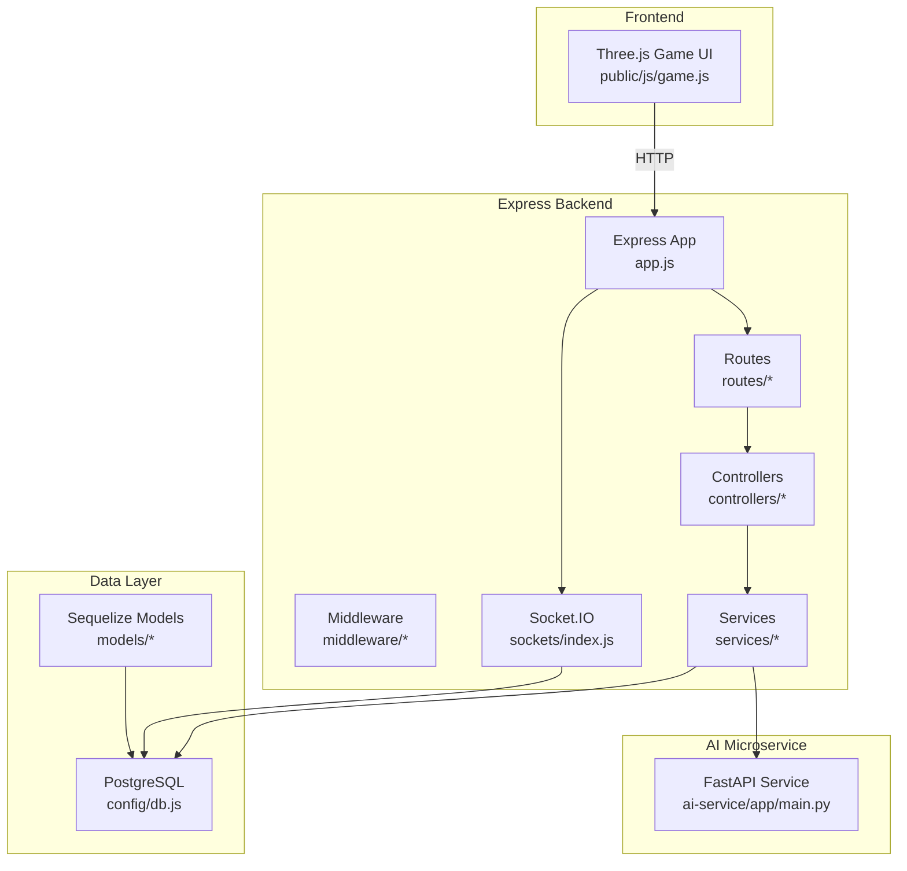
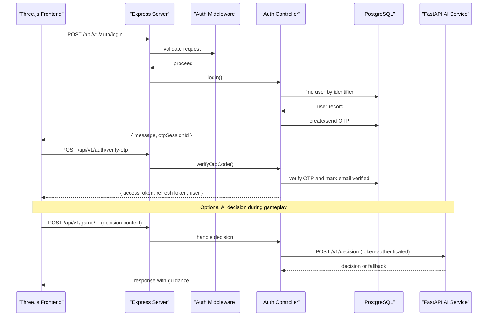
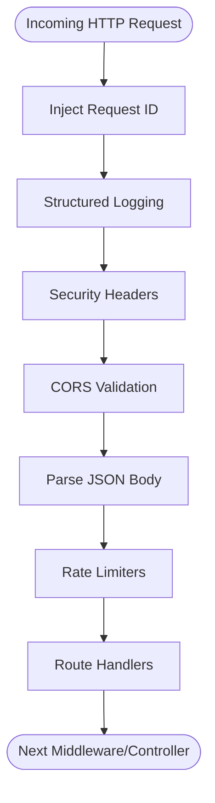
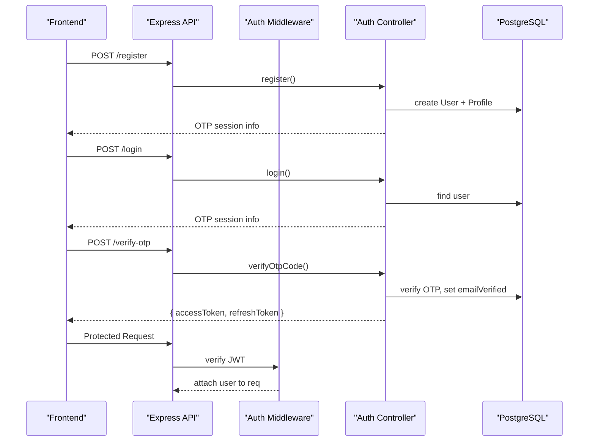
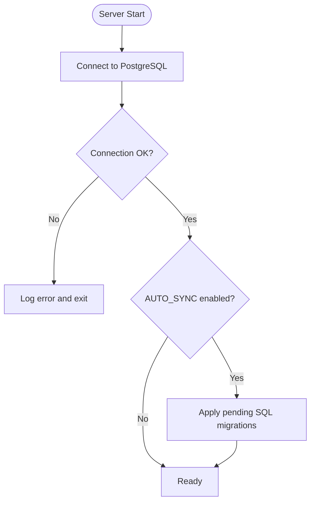
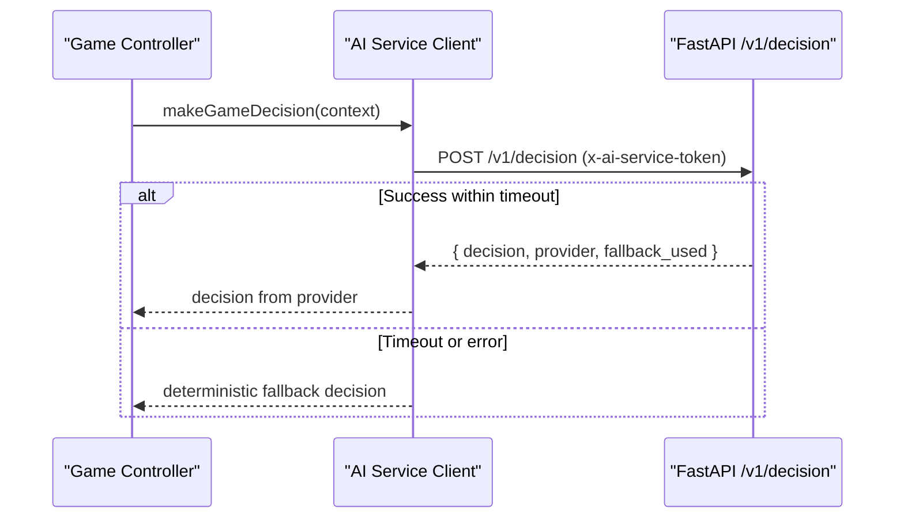
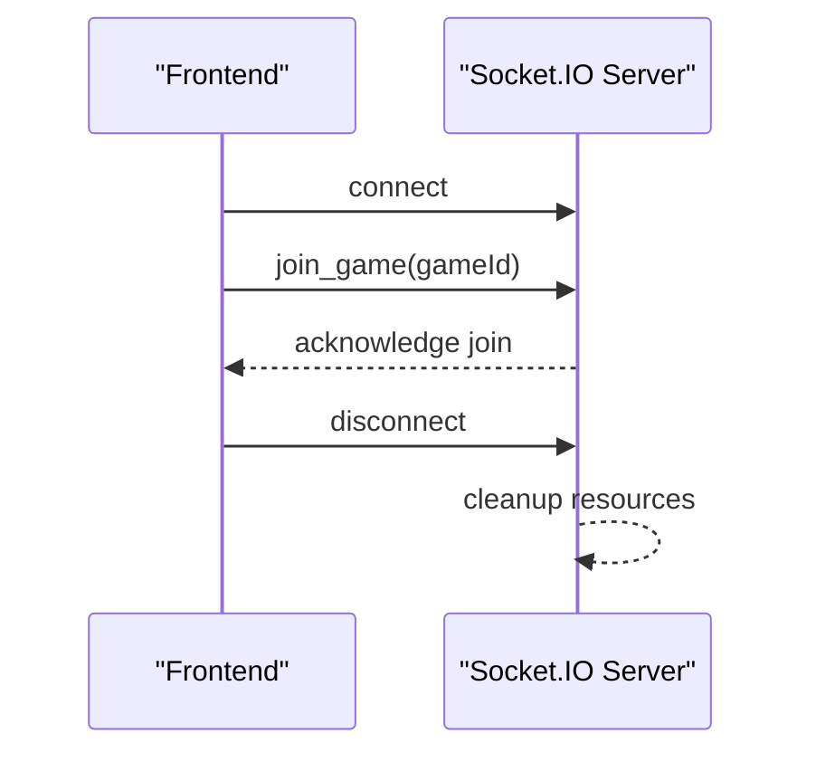
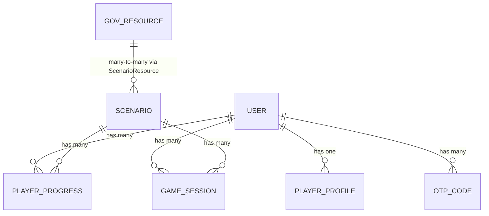
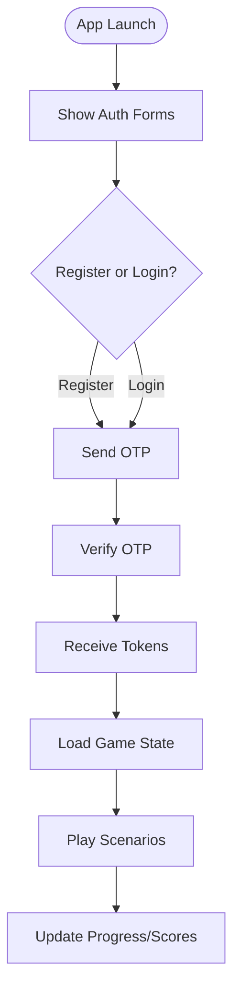
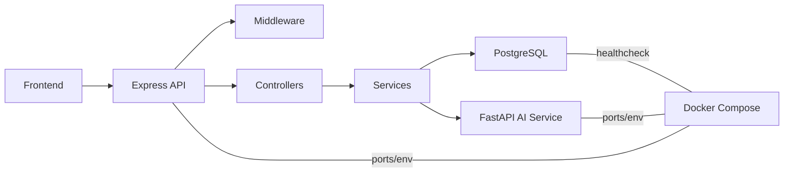

# System Design & Architecture Patterns

<cite>
**Referenced Files in This Document**
- [app.js](file://backend/app.js)
- [server.js](file://backend/server.js)
- [db.js](file://backend/config/db.js)
- [env.js](file://backend/config/env.js)
- [authMiddleware.js](file://backend/middleware/authMiddleware.js)
- [security.js](file://backend/middleware/security.js)
- [ai-service.js](file://backend/services/ai-service.js)
- [index.js](file://backend/sockets/index.js)
- [main.py](file://backend/ai-service/app/main.py)
- [docker-compose.yml](file://docker-compose.yml)
- [User.js](file://backend/models/User.js)
- [index.js](file://backend/models/index.js)
- [auth-routes.js](file://backend/routes/auth-routes.js)
- [auth-controller.js](file://backend/controllers/auth-controller.js)
- [game.js](file://backend/public/js/game.js)
</cite>

## Table of Contents
1. Introduction
2. Project Structure
3. Core Components
4. Architecture Overview
5. Detailed Component Analysis
6. Dependency Analysis
7. Performance Considerations
8. Troubleshooting Guide
9. Conclusion

## Introduction
This document describes the system design and architecture patterns for the Life Skills Adventure platform. It covers a layered Express.js backend, a Python FastAPI AI service, and a PostgreSQL database. The design emphasizes clear separation between presentation (Three.js frontend), business logic (Express controllers and services), and data access (Sequelize models). It also documents request-response flows, real-time communication via Socket.IO, inter-service calls to the AI service, and containerization with Docker Compose.

## Project Structure
The application is organized into logical layers:
- Presentation layer: Three.js-based frontend served statically by the Express server.
- API layer: Express routes, middleware, and controllers handling HTTP requests.
- Business logic layer: Services orchestrating domain operations and external integrations.
- Data access layer: Sequelize models and database configuration.
- Real-time layer: Socket.IO for live interactions such as joining game rooms.
- AI service: A separate FastAPI microservice providing decision support with fallback behavior.

**Diagram sources**
- [app.js:1-55](file://backend/app.js#L1-L55)
- [server.js:1-47](file://backend/server.js#L1-L47)
- [db.js:1-45](file://backend/config/db.js#L1-L45)
- [index.js:1-19](file://backend/sockets/index.js#L1-L19)
- [main.py:1-33](file://backend/ai-service/app/main.py#L1-L33)
- [game.js:1-200](file://backend/public/js/game.js#L1-L200)

**Section sources**
- [app.js:1-55](file://backend/app.js#L1-L55)
- [server.js:1-47](file://backend/server.js#L1-L47)
- [db.js:1-45](file://backend/config/db.js#L1-L45)
- [index.js:1-19](file://backend/sockets/index.js#L1-L19)
- [main.py:1-33](file://backend/ai-service/app/main.py#L1-L33)
- [game.js:1-200](file://backend/public/js/game.js#L1-L200)

## Core Components
- Express application bootstrap and middleware pipeline: security headers, CORS, JSON parsing, rate limiting, request ID injection, and error handling.
- Authentication and authorization: JWT-based auth with cookies, OTP verification flow, and session invalidation via token versioning.
- Database connectivity: Sequelize connection pool, SSL options, auto-sync guard, and SQL migration execution.
- AI service integration: Outbound HTTP call to FastAPI with token authentication and deterministic fallback when unavailable.
- Real-time communication: Socket.IO server initialized alongside HTTP server for game room events.
- Container orchestration: Docker Compose defines Postgres, AI service, and API services with environment variables and health checks.

**Section sources**
- [app.js:1-55](file://backend/app.js#L1-L55)
- [authMiddleware.js:1-38](file://backend/middleware/authMiddleware.js#L1-L38)
- [security.js:1-48](file://backend/middleware/security.js#L1-L48)
- [db.js:1-45](file://backend/config/db.js#L1-L45)
- [ai-service.js:1-51](file://backend/services/ai-service.js#L1-L51)
- [index.js:1-19](file://backend/sockets/index.js#L1-L19)
- [docker-compose.yml:1-66](file://docker-compose.yml#L1-L66)

## Architecture Overview
The platform follows a layered architecture:
- Presentation: Three.js frontend renders the 3D world and game UI, communicates via REST APIs and WebSocket events.
- API Layer: Express routes delegate to controllers; middleware enforces security, validation, and rate limits.
- Business Logic: Services encapsulate domain workflows, including AI decision-making and OTP/email flows.
- Data Access: Sequelize models define entities and relationships; database configuration manages connections and migrations.
- Real-time: Socket.IO provides event-driven updates for collaborative or live gameplay features.
- External Integration: FastAPI AI service offers decision support with robust fallback to deterministic logic.

**Diagram sources**
- [auth-routes.js:1-18](file://backend/routes/auth-routes.js#L1-L18)
- [auth-controller.js:1-154](file://backend/controllers/auth-controller.js#L1-L154)
- [db.js:1-45](file://backend/config/db.js#L1-L45)
- [main.py:1-33](file://backend/ai-service/app/main.py#L1-L33)

**Section sources**
- [auth-routes.js:1-18](file://backend/routes/auth-routes.js#L1-L18)
- [auth-controller.js:1-154](file://backend/controllers/auth-controller.js#L1-L154)
- [main.py:1-33](file://backend/ai-service/app/main.py#L1-L33)

## Detailed Component Analysis

### Express Application and Middleware Pipeline
- Security and cross-origin policies are configured early in the pipeline.
- Request IDs are injected for tracing across logs and responses.
- JSON body parsing includes size limits and strict mode.
- Routes are mounted under /api/v1 with optional write-rate limiting on mutating endpoints.
- Health endpoints expose readiness by verifying database connectivity.

**Diagram sources**
- [app.js:1-55](file://backend/app.js#L1-L55)
- [security.js:1-48](file://backend/middleware/security.js#L1-L48)

**Section sources**
- [app.js:1-55](file://backend/app.js#L1-L55)
- [security.js:1-48](file://backend/middleware/security.js#L1-L48)

### Authentication Flow
- Registration creates a user and profile, then issues an OTP for verification.
- Login verifies credentials and sends an OTP; subsequent verification marks email verified and issues tokens.
- Tokens are stored in httpOnly cookies and validated per request using middleware.
- Logout increments token version to invalidate existing sessions.

**Diagram sources**
- [auth-routes.js:1-18](file://backend/routes/auth-routes.js#L1-L18)
- [auth-controller.js:1-154](file://backend/controllers/auth-controller.js#L1-L154)
- [authMiddleware.js:1-38](file://backend/middleware/authMiddleware.js#L1-L38)
- [User.js:1-23](file://backend/models/User.js#L1-L23)

**Section sources**
- [auth-routes.js:1-18](file://backend/routes/auth-routes.js#L1-L18)
- [auth-controller.js:1-154](file://backend/controllers/auth-controller.js#L1-L154)
- [authMiddleware.js:1-38](file://backend/middleware/authMiddleware.js#L1-L38)
- [User.js:1-23](file://backend/models/User.js#L1-L23)

### Database Connectivity and Migrations
- Sequelize connects to PostgreSQL with configurable SSL and connection pooling.
- On startup, the app authenticates the connection and optionally syncs schema in non-production environments.
- Pending SQL migrations are executed at startup if enabled.

**Diagram sources**
- [db.js:1-45](file://backend/config/db.js#L1-L45)

**Section sources**
- [db.js:1-45](file://backend/config/db.js#L1-L45)

### AI Service Integration
- The backend calls the FastAPI AI service with a shared secret header for authentication.
- Requests include a timeout; failures or timeouts trigger a deterministic local fallback that uses curated hints and alerts based on player context.
- The AI service itself supports a health endpoint and returns provider metadata indicating whether it used Gemini or deterministic logic.

**Diagram sources**
- [ai-service.js:1-51](file://backend/services/ai-service.js#L1-L51)
- [main.py:1-33](file://backend/ai-service/app/main.py#L1-L33)

**Section sources**
- [ai-service.js:1-51](file://backend/services/ai-service.js#L1-L51)
- [main.py:1-33](file://backend/ai-service/app/main.py#L1-L33)

### Real-Time Communication with Socket.IO
- The HTTP server and Socket.IO server share the same Node process.
- Clients join game rooms by emitting join_game with a gameId; the server tracks room membership and logs events.
- Disconnect events are logged for observability.

**Diagram sources**
- [server.js:1-47](file://backend/server.js#L1-L47)
- [index.js:1-19](file://backend/sockets/index.js#L1-L19)

**Section sources**
- [server.js:1-47](file://backend/server.js#L1-L47)
- [index.js:1-19](file://backend/sockets/index.js#L1-L19)

### Data Model Relationships
- Users have one PlayerProfile and many Progress records and GameSessions.
- Scenarios relate to Resources through a many-to-many association.
- OTP codes belong to users and support verification flows.

**Diagram sources**
- [index.js:1-32](file://backend/models/index.js#L1-L32)

**Section sources**
- [index.js:1-32](file://backend/models/index.js#L1-L32)

### Frontend Interaction with Backend
- The Three.js frontend manages UI states, shows OTP prompts, and coordinates game phases.
- It interacts with the backend via REST endpoints for authentication and game state, and may use WebSockets for live updates.

**Diagram sources**
- [game.js:1-200](file://backend/public/js/game.js#L1-L200)
- [auth-routes.js:1-18](file://backend/routes/auth-routes.js#L1-L18)

**Section sources**
- [game.js:1-200](file://backend/public/js/game.js#L1-L200)
- [auth-routes.js:1-18](file://backend/routes/auth-routes.js#L1-L18)

## Dependency Analysis
- The Express app depends on middleware for security, logging, and validation; routes depend on controllers; controllers depend on services and models.
- The AI service client depends on environment configuration for URL and token; the FastAPI service validates incoming tokens and provides decisions.
- Docker Compose wires services together with environment variables and health checks.

**Diagram sources**
- [docker-compose.yml:1-66](file://docker-compose.yml#L1-L66)
- [env.js:1-40](file://backend/config/env.js#L1-L40)
- [ai-service.js:1-51](file://backend/services/ai-service.js#L1-L51)
- [main.py:1-33](file://backend/ai-service/app/main.py#L1-L33)

**Section sources**
- [docker-compose.yml:1-66](file://docker-compose.yml#L1-L66)
- [env.js:1-40](file://backend/config/env.js#L1-L40)
- [ai-service.js:1-51](file://backend/services/ai-service.js#L1-L51)
- [main.py:1-33](file://backend/ai-service/app/main.py#L1-L33)

## Performance Considerations
- Connection pooling: Configure Sequelize pool sizes appropriate to workload and database capacity.
- Rate limiting: Use route-specific limiters for auth and write-heavy endpoints to protect against abuse.
- Timeouts: Enforce request timeouts for AI service calls to prevent blocking long-running operations.
- Caching: Consider caching frequent reads (e.g., scenario metadata) to reduce database load.
- Observability: Leverage structured logging and request IDs for tracing performance bottlenecks.

[No sources needed since this section provides general guidance]

## Troubleshooting Guide
- Authentication failures: Check JWT secrets, cookie settings, and token version mismatches after logout.
- Database connectivity: Validate DATABASE_URL, SSL flags, and ensure the Postgres service is healthy before starting the API.
- AI service errors: Inspect AI_SERVICE_URL reachability, token correctness, and timeouts; confirm deterministic fallback is active when needed.
- Socket.IO issues: Confirm CORS origins include the frontend origin and that clients emit join_game with valid game identifiers.
- Environment misconfiguration: Review env schema validation errors and ensure all required variables are present.

**Section sources**
- [authMiddleware.js:1-38](file://backend/middleware/authMiddleware.js#L1-L38)
- [db.js:1-45](file://backend/config/db.js#L1-L45)
- [ai-service.js:1-51](file://backend/services/ai-service.js#L1-L51)
- [index.js:1-19](file://backend/sockets/index.js#L1-L19)
- [env.js:1-40](file://backend/config/env.js#L1-L40)

## Conclusion
The Life Skills Adventure platform employs a clean layered architecture with clear separation of concerns across presentation, API, business logic, and data access. The Express backend integrates with a FastAPI AI service for intelligent decision support while maintaining robust fallback behavior. Real-time capabilities are provided via Socket.IO, and containerization with Docker Compose simplifies deployment and service discovery within the development environment. Security, rate limiting, and observability are integrated throughout the stack to ensure reliability and maintainability.

[No sources needed since this section summarizes without analyzing specific files]