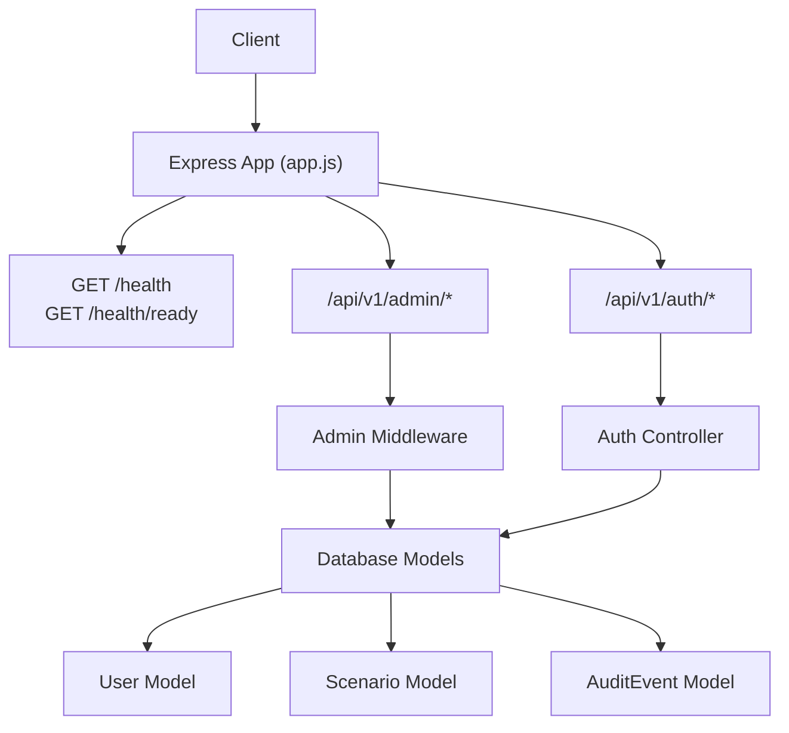
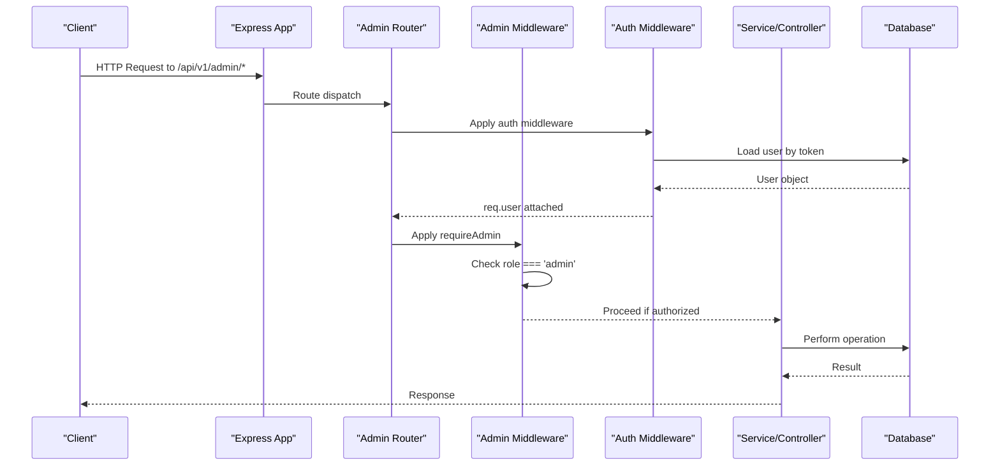
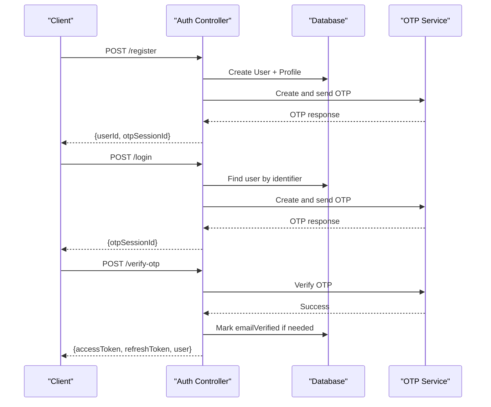
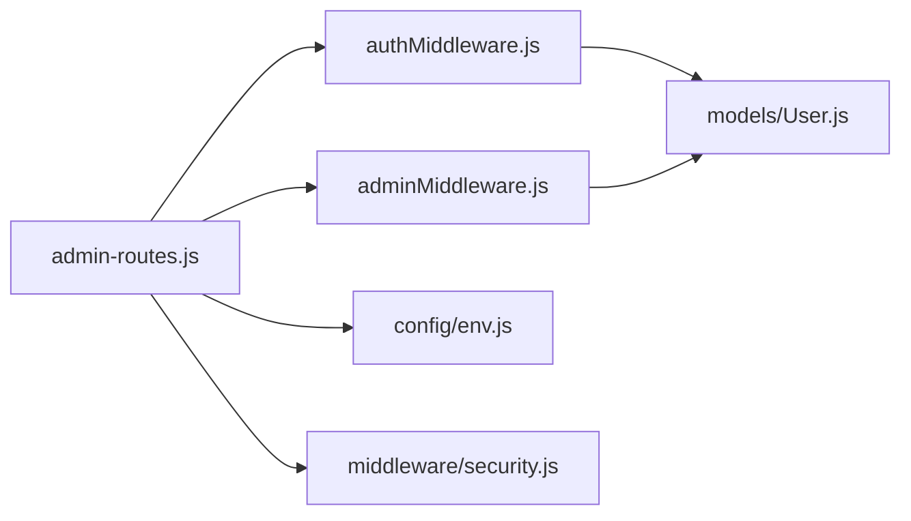
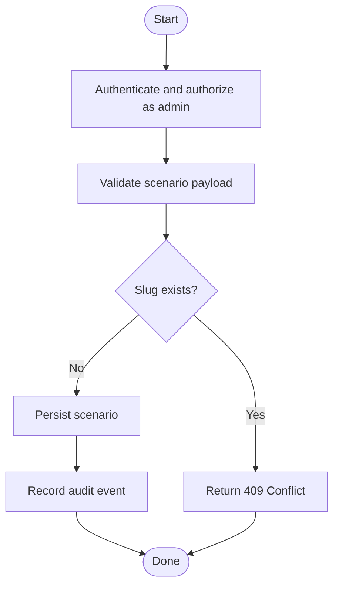
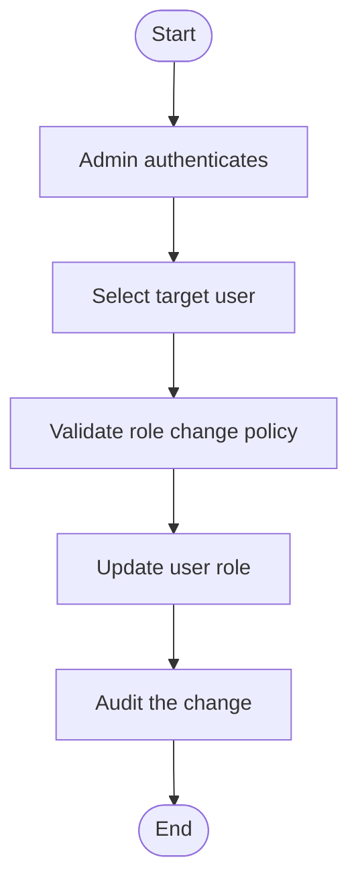

# Admin API

<cite>
**Referenced Files in This Document**
- [app.js](file://backend/app.js)
- [server.js](file://backend/server.js)
- [admin-routes.js](file://backend/routes/admin-routes.js)
- [auth-routes.js](file://backend/routes/auth-routes.js)
- [auth-controller.js](file://backend/controllers/auth-controller.js)
- [authMiddleware.js](file://backend/middleware/authMiddleware.js)
- [adminMiddleware.js](file://backend/middleware/adminMiddleware.js)
- [security.js](file://backend/middleware/security.js)
- [User.js](file://backend/models/User.js)
- [Scenario.js](file://backend/models/Scenario.js)
- [AuditEvent.js](file://backend/models/AuditEvent.js)
- [env.js](file://backend/config/env.js)
- [grant-admin.js](file://backend/scripts/grant-admin.js)
</cite>

## Table of Contents
1. Introduction
2. Project Structure
3. Core Components
4. Architecture Overview
5. Detailed Component Analysis
6. Dependency Analysis
7. Performance Considerations
8. Troubleshooting Guide
9. Conclusion
10. Appendices

## Introduction
This document provides comprehensive API documentation for administrative operations, focusing on scenario management, user administration, and system configuration endpoints. It covers admin-only workflows such as content creation, user role management, and system monitoring tools. The backend exposes a dedicated admin route group under /api/v1/admin and includes robust authentication and authorization mechanisms to protect sensitive operations.

Administrative capabilities are enforced via middleware that requires an authenticated session with the admin role. The system also supports health checks and readiness probes for operational monitoring.

## Project Structure
The application is an Express-based Node.js service. The admin API surface is mounted at /api/v1/admin. Authentication and authorization are handled by reusable middleware, while models define core entities like users, scenarios, and audit events. Environment configuration controls security settings, rate limits, and feature flags.

**Diagram sources**
- [app.js:34-49](file://backend/app.js#L34-L49)
- [auth-routes.js:9-15](file://backend/routes/auth-routes.js#L9-L15)
- [admin-routes.js:1-4](file://backend/routes/admin-routes.js#L1-L4)
- [User.js:5-15](file://backend/models/User.js#L5-L15)
- [Scenario.js:4-15](file://backend/models/Scenario.js#L4-L15)
- [AuditEvent.js:4-12](file://backend/models/AuditEvent.js#L4-L12)

**Section sources**
- [app.js:15-49](file://backend/app.js#L15-L49)
- [server.js:9-25](file://backend/server.js#L9-L25)

## Core Components
- Authentication and Authorization
  - JWT-based authentication with access and refresh tokens, cookie support, and token versioning to invalidate sessions.
  - Role-based authorization requiring the admin role for protected routes.
- Models
  - User: stores identity, credentials, role, and token version.
  - Scenario: defines game scenarios with metadata and content.
  - AuditEvent: records administrative actions for compliance and tracing.
- Security and Rate Limiting
  - Global request ID injection, unsafe input rejection, JSON size limits, and rate limiting for auth and write paths.
- Environment Configuration
  - Centralized environment validation and derived values (e.g., production mode disables guest play).

Key responsibilities:
- Enforce authentication on sensitive endpoints.
- Restrict admin-only operations to users with role=admin.
- Provide health and readiness endpoints for monitoring.
- Maintain audit trails for critical actions.

**Section sources**
- [authMiddleware.js:6-35](file://backend/middleware/authMiddleware.js#L6-L35)
- [adminMiddleware.js:3-8](file://backend/middleware/adminMiddleware.js#L3-L8)
- [User.js:5-15](file://backend/models/User.js#L5-L15)
- [Scenario.js:4-15](file://backend/models/Scenario.js#L4-L15)
- [AuditEvent.js:4-12](file://backend/models/AuditEvent.js#L4-L12)
- [security.js:4-45](file://backend/middleware/security.js#L4-L45)
- [env.js:6-39](file://backend/config/env.js#L6-L39)

## Architecture Overview
The admin API follows a layered architecture:
- Routes: Define URL patterns and attach middleware.
- Controllers: Implement business logic for requests.
- Middleware: Handle cross-cutting concerns (auth, admin role, validation, rate limiting).
- Models: Represent data and interact with the database.
- Config: Provides validated environment variables.

**Diagram sources**
- [app.js:49-49](file://backend/app.js#L49-L49)
- [authMiddleware.js:6-35](file://backend/middleware/authMiddleware.js#L6-L35)
- [adminMiddleware.js:3-8](file://backend/middleware/adminMiddleware.js#L3-L8)

## Detailed Component Analysis

### Authentication and Session Management
- Token issuance and rotation: Access and refresh tokens are issued with TTLs and include a token version tied to the user record.
- Cookie handling: Tokens can be stored in httpOnly cookies with secure and sameSite policies based on environment.
- OTP flow: Registration and login trigger OTP verification; successful verification marks email verified and issues tokens.
- Logout invalidates sessions by incrementing token version and clearing cookies.

Operational notes:
- Use POST /api/v1/auth/register to create accounts.
- Use POST /api/v1/auth/login to initiate login and receive OTP.
- Use POST /api/v1/auth/verify-otp to complete login and obtain tokens.
- Use POST /api/v1/auth/refresh to renew tokens.
- Use POST /api/v1/auth/logout to end sessions.

**Diagram sources**
- [auth-controller.js:34-121](file://backend/controllers/auth-controller.js#L34-L121)
- [auth-routes.js:9-15](file://backend/routes/auth-routes.js#L9-L15)

**Section sources**
- [auth-controller.js:10-121](file://backend/controllers/auth-controller.js#L10-L121)
- [auth-routes.js:9-15](file://backend/routes/auth-routes.js#L9-L15)
- [env.js:11-14](file://backend/config/env.js#L11-L14)

### Admin Authorization
- Admin-only protection: The requireAdmin middleware enforces that only users with role=admin can proceed.
- Integration: Attach requireAdmin to any admin route to restrict access.

Authorization behavior:
- If req.user is missing or role is not admin, return a 403 Forbidden error.
- Otherwise, continue to the next handler.

**Section sources**
- [adminMiddleware.js:3-8](file://backend/middleware/adminMiddleware.js#L3-L8)
- [User.js:5-15](file://backend/models/User.js#L5-L15)

### Scenario Management (Admin)
- Data model: Scenarios include slug, title, summary, ageGroup, difficulty, content (JSON), skillTags (array), isPublished, and version.
- Admin operations: Typical CRUD operations would include creating, updating, publishing/unpublishing, and deleting scenarios. These should be guarded by requireAdmin.

Recommended admin endpoints (conceptual):
- POST /api/v1/admin/scenarios — Create scenario
- PUT /api/v1/admin/scenarios/:id — Update scenario
- DELETE /api/v1/admin/scenarios/:id — Delete scenario
- PATCH /api/v1/admin/scenarios/:id/publish — Publish/unpublish

Notes:
- Ensure slug uniqueness and validate content schema before persisting.
- Increment version on updates to support optimistic concurrency control.

**Section sources**
- [Scenario.js:4-15](file://backend/models/Scenario.js#L4-L15)
- [adminMiddleware.js:3-8](file://backend/middleware/adminMiddleware.js#L3-L8)

### User Administration (Admin)
- Capabilities: View, update roles, deactivate/reactivate accounts, and manage profiles.
- Admin-only: All user administration endpoints must enforce requireAdmin.

Recommended admin endpoints (conceptual):
- GET /api/v1/admin/users — List users (paginated)
- GET /api/v1/admin/users/:id — Get user details
- PATCH /api/v1/admin/users/:id — Update user (e.g., role changes)
- DELETE /api/v1/admin/users/:id — Deactivate or remove user

Security considerations:
- Validate role transitions to prevent privilege escalation.
- Log all role changes to audit trail.

**Section sources**
- [User.js:5-15](file://backend/models/User.js#L5-L15)
- [adminMiddleware.js:3-8](file://backend/middleware/adminMiddleware.js#L3-L8)

### System Monitoring and Health Checks
- Health probe: GET /health returns service status and request ID.
- Readiness probe: GET /health/ready verifies database connectivity and returns readiness.

Usage:
- Integrate with orchestrators (e.g., Kubernetes liveness/readiness probes).
- Include request IDs in logs for traceability.

**Section sources**
- [app.js:34-38](file://backend/app.js#L34-L38)

### Audit Trails
- Audit model: Captures userId, action, entity, entityId, details (JSON), and ipAddress.
- Recommendation: Record admin actions (create/update/delete scenarios, role changes) using this model to maintain compliance and enable forensics.

Example audit entries (conceptual):
- action: "scenario.create", entity: "Scenario", details: { id, title }
- action: "user.role.update", entity: "User", details: { id, oldRole, newRole }

**Section sources**
- [AuditEvent.js:4-12](file://backend/models/AuditEvent.js#L4-L12)

### Bulk Operations and Maintenance Tasks
- Bulk scenario import: Accept a list of scenario objects, validate each, and persist in a transaction. Return partial success/failure results.
- Bulk user role updates: Accept a mapping of user IDs to roles, validate permissions, and apply changes with auditing.
- Maintenance tasks:
  - Grant admin role via script: scripts/grant-admin.js <username_or_email>.
  - Clean up expired OTP sessions and stale analytics events periodically.

Operational guidance:
- Wrap bulk operations in transactions to ensure consistency.
- Respect rate limits and implement pagination for large datasets.
- Log all maintenance actions with context (actor, timestamp, IP).

**Section sources**
- [grant-admin.js:12-29](file://backend/scripts/grant-admin.js#L12-L29)
- [security.js:23-45](file://backend/middleware/security.js#L23-L45)

## Dependency Analysis
The admin API depends on shared authentication and security infrastructure. The following diagram shows key dependencies among routes, middleware, controllers, and models.

**Diagram sources**
- [admin-routes.js:1-4](file://backend/routes/admin-routes.js#L1-L4)
- [adminMiddleware.js:3-8](file://backend/middleware/adminMiddleware.js#L3-L8)
- [authMiddleware.js:6-35](file://backend/middleware/authMiddleware.js#L6-L35)
- [User.js:5-15](file://backend/models/User.js#L5-L15)
- [env.js:6-39](file://backend/config/env.js#L6-L39)
- [security.js:4-45](file://backend/middleware/security.js#L4-L45)

**Section sources**
- [admin-routes.js:1-4](file://backend/routes/admin-routes.js#L1-L4)
- [authMiddleware.js:6-35](file://backend/middleware/authMiddleware.js#L6-L35)
- [adminMiddleware.js:3-8](file://backend/middleware/adminMiddleware.js#L3-L8)
- [User.js:5-15](file://backend/models/User.js#L5-L15)
- [env.js:6-39](file://backend/config/env.js#L6-L39)
- [security.js:4-45](file://backend/middleware/security.js#L4-L45)

## Performance Considerations
- Rate limiting: Auth and write endpoints are rate-limited to mitigate abuse.
- JSON payload limits: Enforced globally to prevent oversized payloads.
- Database queries: Use efficient queries and indexes for frequent filters (e.g., slug, role).
- Pagination: Implement pagination for list endpoints to reduce memory usage.
- Caching: Consider caching read-heavy admin lists with short TTLs where appropriate.

[No sources needed since this section provides general guidance]

## Troubleshooting Guide
Common issues and resolutions:
- 401 Unauthorized: Missing or invalid token; verify cookie/header presence and token validity.
- 403 Forbidden: User lacks admin role; confirm user.role is set to admin.
- 400 Unsafe Input: Rejects inputs containing suspicious characters; sanitize payloads.
- 429 Too Many Requests: Rate limit exceeded; back off and retry after windowMs.
- Health/Readiness failures: Database connection issues; check DATABASE_URL and SSL settings.

Operational tips:
- Inspect X-Request-Id in responses for log correlation.
- Review audit logs for failed or suspicious admin actions.
- Use grant-admin script to assign admin privileges when necessary.

**Section sources**
- [authMiddleware.js:6-35](file://backend/middleware/authMiddleware.js#L6-L35)
- [adminMiddleware.js:3-8](file://backend/middleware/adminMiddleware.js#L3-L8)
- [security.js:10-45](file://backend/middleware/security.js#L10-L45)
- [app.js:34-38](file://backend/app.js#L34-L38)
- [grant-admin.js:12-29](file://backend/scripts/grant-admin.js#L12-L29)

## Conclusion
The admin API provides a secure foundation for managing scenarios, users, and system configuration. Authentication and authorization are enforced through middleware, and health endpoints support operational monitoring. To fully realize administrative capabilities, implement controllers and routes under /api/v1/admin that leverage requireAdmin, validate inputs, and record audit events. Adopt bulk operations and maintenance scripts for efficient administration and ensure robust logging and rate limiting for reliability.

[No sources needed since this section summarizes without analyzing specific files]

## Appendices

### Administrative Workflows

#### Scenario Creation Workflow

**Diagram sources**
- [adminMiddleware.js:3-8](file://backend/middleware/adminMiddleware.js#L3-L8)
- [Scenario.js:4-15](file://backend/models/Scenario.js#L4-L15)
- [AuditEvent.js:4-12](file://backend/models/AuditEvent.js#L4-L12)

#### User Role Management Workflow

**Diagram sources**
- [User.js:5-15](file://backend/models/User.js#L5-L15)
- [adminMiddleware.js:3-8](file://backend/middleware/adminMiddleware.js#L3-L8)
- [AuditEvent.js:4-12](file://backend/models/AuditEvent.js#L4-L12)

### Endpoint Reference Summary
- Health and Readiness
  - GET /health
  - GET /health/ready
- Authentication
  - POST /api/v1/auth/register
  - POST /api/v1/auth/login
  - POST /api/v1/auth/verify-otp
  - POST /api/v1/auth/resend-otp
  - POST /api/v1/auth/logout
  - POST /api/v1/auth/refresh
- Admin (to be implemented under /api/v1/admin)
  - Scenario CRUD and publish toggles
  - User account management and role updates
  - System maintenance utilities

**Section sources**
- [app.js:34-49](file://backend/app.js#L34-L49)
- [auth-routes.js:9-15](file://backend/routes/auth-routes.js#L9-L15)
- [admin-routes.js:1-4](file://backend/routes/admin-routes.js#L1-L4)