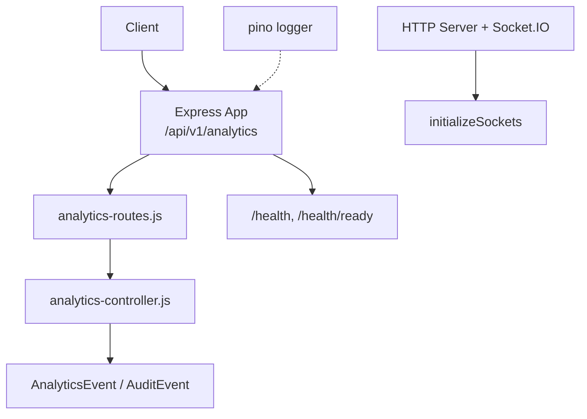
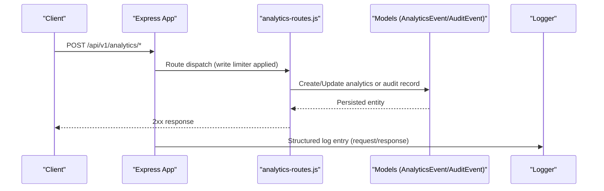
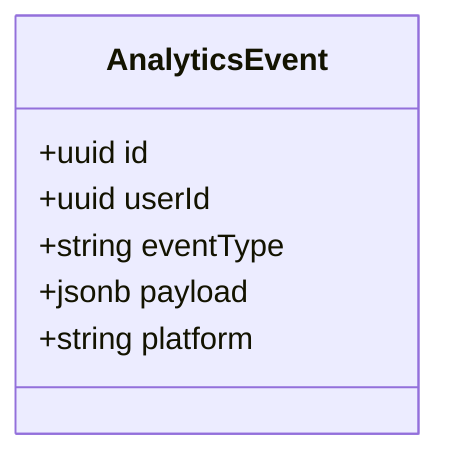
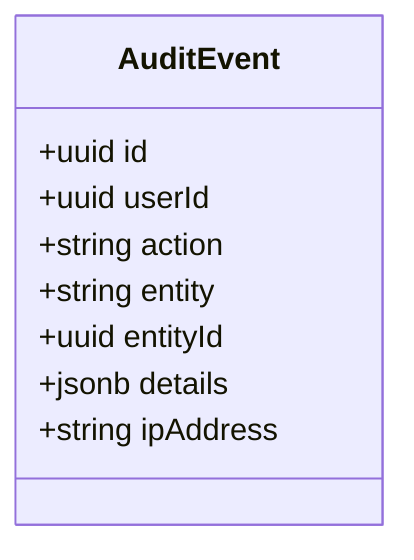
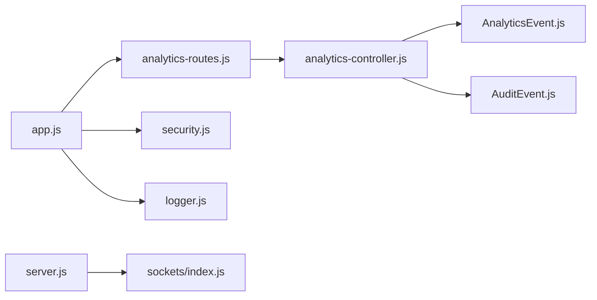

# Analytics API

<cite>
**Referenced Files in This Document**
- [app.js](file://backend/app.js)
- [server.js](file://backend/server.js)
- [analytics-routes.js](file://backend/routes/analytics-routes.js)
- [analytics-controller.js](file://backend/controllers/analytics-controller.js)
- [AnalyticsEvent.js](file://backend/models/AnalyticsEvent.js)
- [AuditEvent.js](file://backend/models/AuditEvent.js)
- [models/index.js](file://backend/models/index.js)
- [security.js](file://backend/middleware/security.js)
- [logger.js](file://backend/config/logger.js)
- [sockets/index.js](file://backend/sockets/index.js)
</cite>

## Table of Contents
1. [Introduction](#introduction)
2. [Project Structure](#project-structure)
3. [Core Components](#core-components)
4. [Architecture Overview](#architecture-overview)
5. [Detailed Component Analysis](#detailed-component-analysis)
6. [Dependency Analysis](#dependency-analysis)
7. [Performance Considerations](#performance-considerations)
8. [Troubleshooting Guide](#troubleshooting-guide)
9. [Conclusion](#conclusion)
10. [Appendices](#appendices)

## Introduction
This document provides comprehensive API documentation for analytics and monitoring capabilities exposed by the backend service. It focuses on:
- User behavior tracking via analytics events
- Performance metrics collection through structured logging and health endpoints
- Audit logging for compliance and security observability
- Real-time signaling via Socket.IO

The analytics subsystem is designed to be extensible: event schemas are defined as database models, routes are mounted under a dedicated namespace, and middleware enforces rate limits and input safety.

## Project Structure
The analytics-related surface area includes:
- Route mounting under /api/v1/analytics with write-rate limiting
- Data models for analytics and audit events
- Centralized application setup exposing health endpoints and request tracing
- Structured logging configuration
- Socket.IO initialization for real-time features

**Diagram sources**
- [app.js:34-49](file://backend/app.js#L34-L49)
- [analytics-routes.js:1-4](file://backend/routes/analytics-routes.js#L1-L4)
- [analytics-controller.js:1-2](file://backend/controllers/analytics-controller.js#L1-L2)
- [AnalyticsEvent.js:4-10](file://backend/models/AnalyticsEvent.js#L4-L10)
- [AuditEvent.js:4-12](file://backend/models/AuditEvent.js#L4-L12)
- [server.js:11-21](file://backend/server.js#L11-L21)
- [logger.js:5-11](file://backend/config/logger.js#L5-L11)

**Section sources**
- [app.js:34-49](file://backend/app.js#L34-L49)
- [server.js:11-21](file://backend/server.js#L11-L21)
- [analytics-routes.js:1-4](file://backend/routes/analytics-routes.js#L1-L4)
- [analytics-controller.js:1-2](file://backend/controllers/analytics-controller.js#L1-L2)
- [AnalyticsEvent.js:4-10](file://backend/models/AnalyticsEvent.js#L4-L10)
- [AuditEvent.js:4-12](file://backend/models/AuditEvent.js#L4-L12)
- [logger.js:5-11](file://backend/config/logger.js#L5-L11)

## Core Components
- Analytics Event Model: Captures user behavior events with a flexible payload.
- Audit Event Model: Records actions for compliance and security auditing.
- Analytics Routes: Mounted under /api/v1/analytics with write-rate limiting applied at mount time.
- Application Health: Endpoints for liveness and readiness checks.
- Logging: Structured logs via pino with optional pretty printing in non-production environments.
- Real-time: Socket.IO initialized for game-room based signaling.

Key responsibilities:
- Persist analytics events and audit records
- Enforce safe inputs and rate limits on writes
- Expose health endpoints for orchestration and monitoring
- Provide a foundation for future analytics query/reporting endpoints

**Section sources**
- [AnalyticsEvent.js:4-10](file://backend/models/AnalyticsEvent.js#L4-L10)
- [AuditEvent.js:4-12](file://backend/models/AuditEvent.js#L4-L12)
- [app.js:34-49](file://backend/app.js#L34-L49)
- [security.js:23-29](file://backend/middleware/security.js#L23-L29)
- [logger.js:5-11](file://backend/config/logger.js#L5-L11)
- [sockets/index.js:3-15](file://backend/sockets/index.js#L3-L15)

## Architecture Overview
The analytics architecture centers around an Express application that mounts route handlers under a protected namespace, persists data via Sequelize models, and emits structured logs. A separate HTTP server initializes Socket.IO for real-time communication.

**Diagram sources**
- [app.js:48-49](file://backend/app.js#L48-L49)
- [analytics-routes.js:1-4](file://backend/routes/analytics-routes.js#L1-L4)
- [AnalyticsEvent.js:4-10](file://backend/models/AnalyticsEvent.js#L4-L10)
- [AuditEvent.js:4-12](file://backend/models/AuditEvent.js#L4-L12)
- [logger.js:5-11](file://backend/config/logger.js#L5-L11)

## Detailed Component Analysis

### Analytics Event Model
Defines the schema for capturing user behavior events. The model supports:
- Unique identifier per event
- Optional association to a user
- Event type classification
- Flexible JSONB payload for arbitrary event details
- Platform context

**Diagram sources**
- [AnalyticsEvent.js:4-10](file://backend/models/AnalyticsEvent.js#L4-L10)

**Section sources**
- [AnalyticsEvent.js:4-10](file://backend/models/AnalyticsEvent.js#L4-L10)

### Audit Event Model
Captures audit trails for actions performed by users or systems. Fields include:
- Unique identifier
- Optional user association
- Action description
- Target entity and entity ID
- Additional details as JSONB
- Source IP address

**Diagram sources**
- [AuditEvent.js:4-12](file://backend/models/AuditEvent.js#L4-L12)

**Section sources**
- [AuditEvent.js:4-12](file://backend/models/AuditEvent.js#L4-L12)

### Analytics Routes and Controller
- Routes are mounted under /api/v1/analytics with a write limiter applied at mount time.
- The controller module exists but currently exports an empty object; endpoint implementations are not present in the provided files.

Implications:
- Write operations to analytics endpoints are rate-limited globally for this namespace.
- No query or reporting endpoints are implemented yet in the visible code.

**Section sources**
- [app.js:48-49](file://backend/app.js#L48-L49)
- [analytics-routes.js:1-4](file://backend/routes/analytics-routes.js#L1-L4)
- [analytics-controller.js:1-2](file://backend/controllers/analytics-controller.js#L1-L2)
- [security.js:23-29](file://backend/middleware/security.js#L23-L29)

### Health and Readiness Endpoints
- GET /health: Returns service status and request ID.
- GET /health/ready: Verifies database connectivity before marking the service ready.

These endpoints support external monitoring and orchestration systems.

**Section sources**
- [app.js:34-38](file://backend/app.js#L34-L38)

### Logging and Observability
- Structured logging via pino with configurable level and optional pretty printing in non-production.
- Request IDs propagated across requests for traceability.

**Section sources**
- [logger.js:5-11](file://backend/config/logger.js#L5-L11)
- [security.js:4-8](file://backend/middleware/security.js#L4-L8)

### Real-time Signaling (Socket.IO)
- Socket.IO server initialized alongside HTTP server.
- Rooms-based grouping for game sessions; connection and disconnect events logged.

Note: This is not an analytics API endpoint, but it can be used to emit real-time signals related to user interactions.

**Section sources**
- [server.js:11-21](file://backend/server.js#L11-L21)
- [sockets/index.js:3-15](file://backend/sockets/index.js#L3-L15)

## Dependency Analysis
The analytics subsystem depends on:
- Express app wiring and middleware stack
- Rate limiting middleware for write paths
- Sequelize models for persistence
- Pino logger for observability
- Socket.IO for real-time features

**Diagram sources**
- [app.js:48-49](file://backend/app.js#L48-L49)
- [analytics-routes.js:1-4](file://backend/routes/analytics-routes.js#L1-L4)
- [analytics-controller.js:1-2](file://backend/controllers/analytics-controller.js#L1-L2)
- [AnalyticsEvent.js:4-10](file://backend/models/AnalyticsEvent.js#L4-L10)
- [AuditEvent.js:4-12](file://backend/models/AuditEvent.js#L4-L12)
- [security.js:23-29](file://backend/middleware/security.js#L23-L29)
- [logger.js:5-11](file://backend/config/logger.js#L5-L11)
- [server.js:11-21](file://backend/server.js#L11-L21)
- [sockets/index.js:3-15](file://backend/sockets/index.js#L3-L15)

**Section sources**
- [app.js:48-49](file://backend/app.js#L48-L49)
- [security.js:23-29](file://backend/middleware/security.js#L23-L29)
- [models/index.js:9-10](file://backend/models/index.js#L9-L10)

## Performance Considerations
- Write rate limiting: All writes to /api/v1/analytics are limited to protect the system from bursts.
- Input validation: Unsafe input patterns are rejected early to reduce processing overhead.
- Structured logging: Use appropriate log levels to avoid excessive I/O in production.
- Database writes: Ensure indexes on frequently queried fields such as eventType, userId, and timestamps when adding query endpoints.

[No sources needed since this section provides general guidance]

## Troubleshooting Guide
Common issues and diagnostics:
- Too many requests on analytics writes: Indicates hitting the write rate limit. Reduce frequency or batch events.
- Unsafe input errors: Payload contains disallowed characters or patterns; sanitize inputs before sending.
- Service not ready: /health/ready failing indicates database connectivity issues; check DB credentials and network.
- Missing analytics endpoints: If calling unimplemented routes, expect 404; implement handlers in the analytics controller and register them in analytics routes.

Operational tips:
- Inspect structured logs for request correlation using X-Request-Id.
- Use /health and /health/ready for liveness/readiness probes.

**Section sources**
- [security.js:10-18](file://backend/middleware/security.js#L10-L18)
- [security.js:23-29](file://backend/middleware/security.js#L23-L29)
- [app.js:34-38](file://backend/app.js#L34-L38)

## Conclusion
The analytics subsystem provides a solid foundation for capturing user behavior and audit trails, with robust middleware protections and observability hooks. While the current implementation exposes route scaffolding and models, concrete analytics query and reporting endpoints are not implemented in the provided files. Future work should add controllers and routes for querying analytics data, generating reports, and integrating with external monitoring systems.

[No sources needed since this section summarizes without analyzing specific files]

## Appendices

### Event Schema Reference
- AnalyticsEvent
  - id: UUID primary key
  - userId: UUID (optional)
  - eventType: string (required)
  - payload: JSONB (default {})
  - platform: string (optional)
- AuditEvent
  - id: UUID primary key
  - userId: UUID (optional)
  - action: string (required)
  - entity: string (optional)
  - entityId: UUID (optional)
  - details: JSONB (default {})
  - ipAddress: string (optional)

**Section sources**
- [AnalyticsEvent.js:4-10](file://backend/models/AnalyticsEvent.js#L4-L10)
- [AuditEvent.js:4-12](file://backend/models/AuditEvent.js#L4-L12)

### Endpoint Summary
- POST /api/v1/analytics/* (write path)
  - Protected by write rate limiter
  - Intended for analytics and audit event ingestion
  - Controllers not implemented in provided files

- GET /health
  - Returns service status and request ID

- GET /health/ready
  - Verifies database connectivity

**Section sources**
- [app.js:34-49](file://backend/app.js#L34-L49)
- [analytics-routes.js:1-4](file://backend/routes/analytics-routes.js#L1-L4)
- [security.js:23-29](file://backend/middleware/security.js#L23-L29)

### Integration Notes
- External monitoring:
  - Use /health and /health/ready for orchestration probes
  - Consume structured logs via your logging pipeline
- Real-time:
  - Socket.IO rooms available for game sessions; extend as needed for live analytics dashboards

**Section sources**
- [server.js:11-21](file://backend/server.js#L11-L21)
- [sockets/index.js:3-15](file://backend/sockets/index.js#L3-L15)
- [logger.js:5-11](file://backend/config/logger.js#L5-L11)