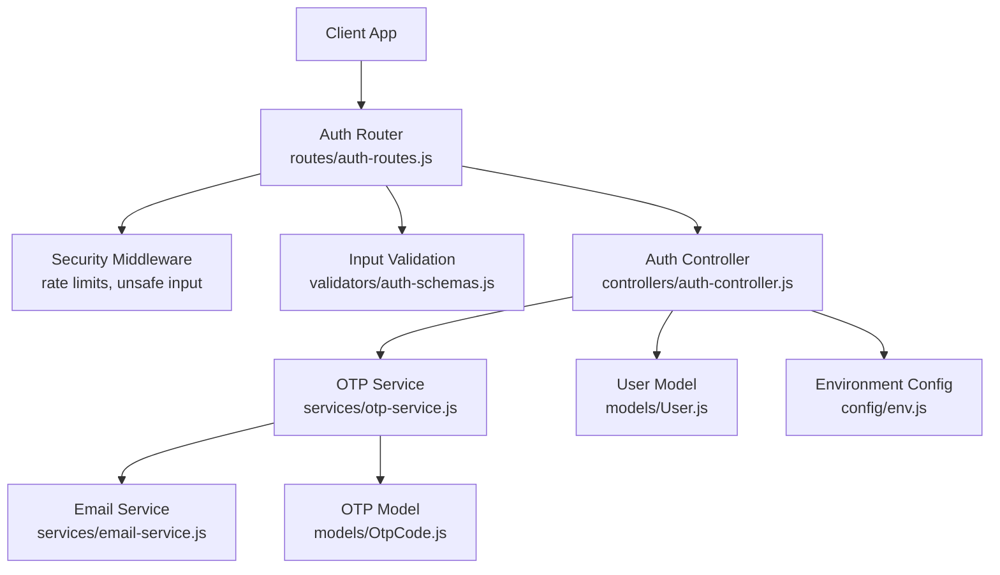
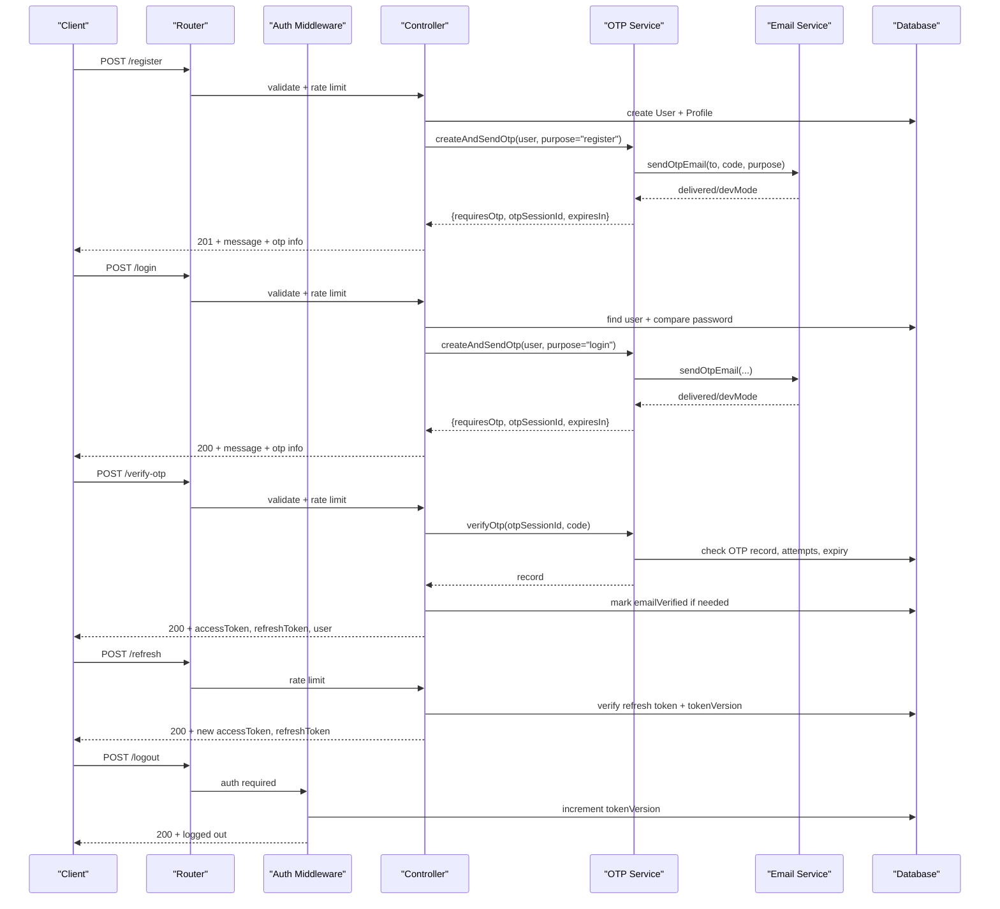
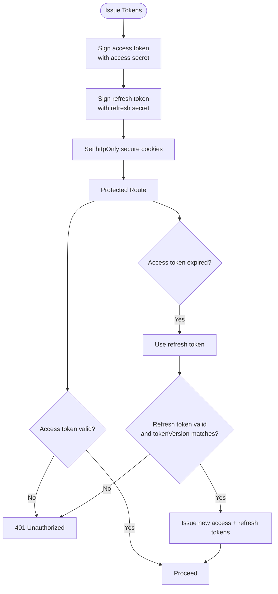
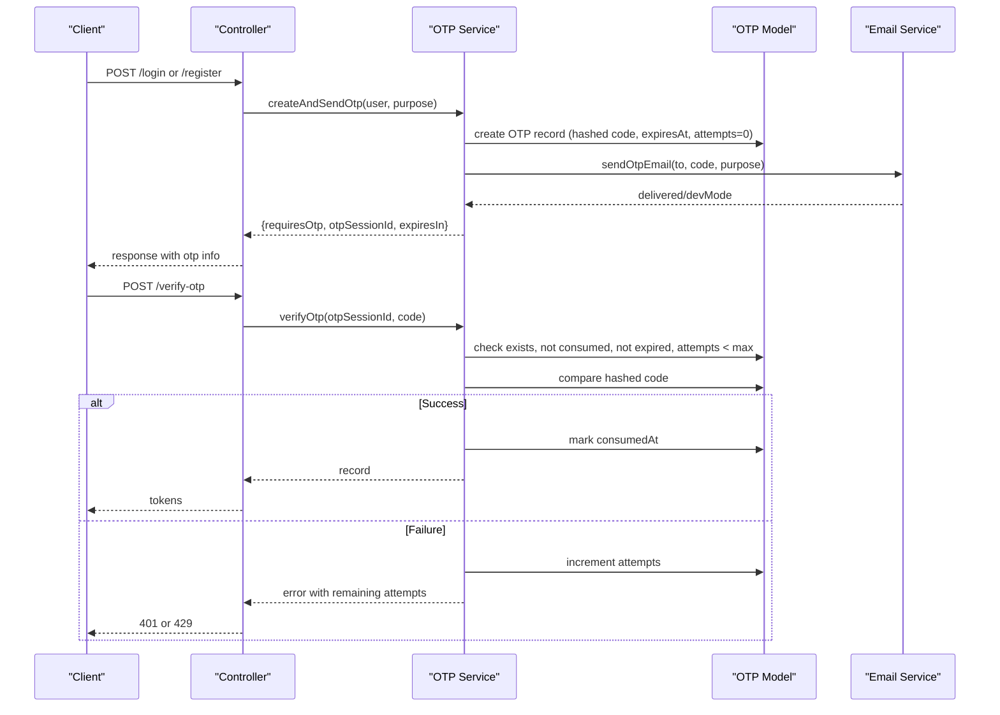
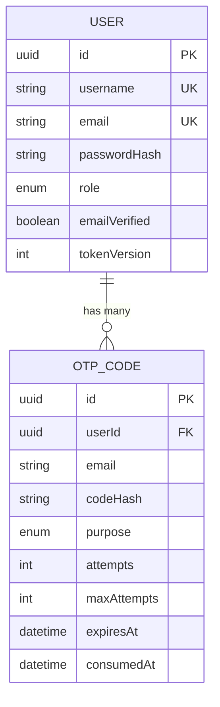
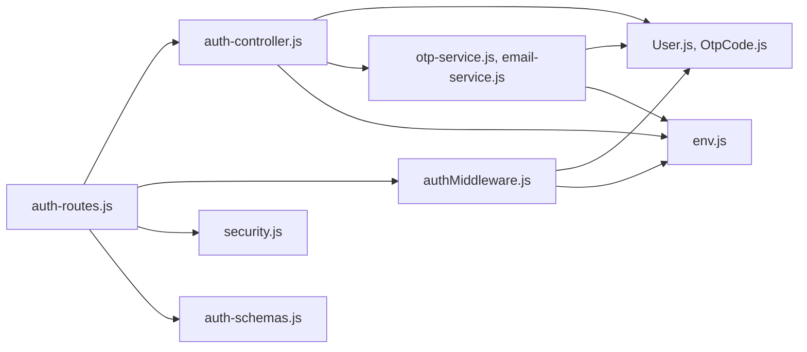

# Authentication API

<cite>
**Referenced Files in This Document**
- [auth-routes.js](file://backend/routes/auth-routes.js)
- [auth-controller.js](file://backend/controllers/auth-controller.js)
- [authMiddleware.js](file://backend/middleware/authMiddleware.js)
- [security.js](file://backend/middleware/security.js)
- [auth-schemas.js](file://backend/validators/auth-schemas.js)
- [otp-service.js](file://backend/services/otp-service.js)
- [email-service.js](file://backend/services/email-service.js)
- [User.js](file://backend/models/User.js)
- [OtpCode.js](file://backend/models/OtpCode.js)
- [env.js](file://backend/config/env.js)
- [app-error.js](file://backend/utils/app-error.js)
</cite>

## Table of Contents
1. [Introduction](#introduction)
2. [Project Structure](#project-structure)
3. [Core Components](#core-components)
4. [Architecture Overview](#architecture-overview)
5. [Detailed Component Analysis](#detailed-component-analysis)
6. [Dependency Analysis](#dependency-analysis)
7. [Performance Considerations](#performance-considerations)
8. [Troubleshooting Guide](#troubleshooting-guide)
9. [Conclusion](#conclusion)

## Introduction
This document provides comprehensive API documentation for the authentication system, covering user registration, login, OTP verification, password reset (via OTP), session management, and guest user support. It details HTTP methods, URL patterns, request/response schemas, authentication requirements, JWT lifecycle, refresh token mechanism, OTP flow, email integration, rate limiting, input validation, example scenarios, and error handling patterns.

## Project Structure
The authentication subsystem is implemented as an Express router with controllers, middleware, validators, services, and models:
- Routes define endpoints and apply security and validation middleware.
- Controllers implement business logic for auth flows.
- Middleware handles authentication, rate limiting, and unsafe input rejection.
- Validators enforce input schemas using Joi.
- Services encapsulate OTP generation/verification and email delivery.
- Models define database entities for users and OTP codes.
- Environment configuration centralizes secrets and feature flags.

**Diagram sources**
- [auth-routes.js:1-18](file://backend/routes/auth-routes.js#L1-L18)
- [security.js:1-48](file://backend/middleware/security.js#L1-L48)
- [auth-schemas.js:1-29](file://backend/validators/auth-schemas.js#L1-L29)
- [auth-controller.js:1-154](file://backend/controllers/auth-controller.js#L1-L154)
- [otp-service.js:1-99](file://backend/services/otp-service.js#L1-L99)
- [email-service.js:1-62](file://backend/services/email-service.js#L1-L62)
- [User.js:1-23](file://backend/models/User.js#L1-L23)
- [OtpCode.js:1-22](file://backend/models/OtpCode.js#L1-L22)
- [env.js:1-40](file://backend/config/env.js#L1-L40)

**Section sources**
- [auth-routes.js:1-18](file://backend/routes/auth-routes.js#L1-L18)
- [security.js:1-48](file://backend/middleware/security.js#L1-L48)
- [auth-schemas.js:1-29](file://backend/validators/auth-schemas.js#L1-L29)
- [auth-controller.js:1-154](file://backend/controllers/auth-controller.js#L1-L154)
- [otp-service.js:1-99](file://backend/services/otp-service.js#L1-L99)
- [email-service.js:1-62](file://backend/services/email-service.js#L1-L62)
- [User.js:1-23](file://backend/models/User.js#L1-L23)
- [OtpCode.js:1-22](file://backend/models/OtpCode.js#L1-L22)
- [env.js:1-40](file://backend/config/env.js#L1-L40)

## Core Components
- Authentication routes expose endpoints for register, login, guest login, OTP verification/resend, logout, and token refresh.
- Auth controller implements token issuance, OTP workflows, and session management.
- Auth middleware validates access tokens and enforces session validity via token versioning.
- Security middleware applies rate limits and rejects unsafe inputs.
- Validators enforce strict input schemas for all auth requests.
- OTP service manages code generation, hashing, TTL, attempts, and email delivery.
- Email service sends OTP emails or logs them in dev mode when SMTP is not configured.
- Models define User and OTP entities with appropriate constraints and scopes.

**Section sources**
- [auth-routes.js:1-18](file://backend/routes/auth-routes.js#L1-L18)
- [auth-controller.js:1-154](file://backend/controllers/auth-controller.js#L1-L154)
- [authMiddleware.js:1-38](file://backend/middleware/authMiddleware.js#L1-L38)
- [security.js:1-48](file://backend/middleware/security.js#L1-L48)
- [auth-schemas.js:1-29](file://backend/validators/auth-schemas.js#L1-L29)
- [otp-service.js:1-99](file://backend/services/otp-service.js#L1-L99)
- [email-service.js:1-62](file://backend/services/email-service.js#L1-L62)
- [User.js:1-23](file://backend/models/User.js#L1-L23)
- [OtpCode.js:1-22](file://backend/models/OtpCode.js#L1-L22)

## Architecture Overview
The authentication flow uses short-lived access tokens and longer-lived refresh tokens stored in secure cookies. Access tokens are validated by middleware on protected routes. OTPs are used to verify identity during registration and login before issuing tokens. Guest users can obtain a temporary session if enabled.

**Diagram sources**
- [auth-routes.js:1-18](file://backend/routes/auth-routes.js#L1-L18)
- [auth-controller.js:1-154](file://backend/controllers/auth-controller.js#L1-L154)
- [otp-service.js:1-99](file://backend/services/otp-service.js#L1-L99)
- [email-service.js:1-62](file://backend/services/email-service.js#L1-L62)
- [authMiddleware.js:1-38](file://backend/middleware/authMiddleware.js#L1-L38)

## Detailed Component Analysis

### Endpoints

#### Register
- Method: POST
- Path: /api/auth/register
- Rate Limit: authLimiter (see Security section)
- Input Validation: registerSchema
- Authentication: None
- Request Body:
  - username: string, trimmed, 3–32 chars, alphanumeric with underscores
  - email: string, valid email, max 255
  - password: string, min 8, max 128, must include uppercase, lowercase, digit, special character
  - ageGroup: optional enum defaulting to a standard group
- Response:
  - 201 Created: message, userId, requiresOtp, otpSessionId, email, expiresIn, message about delivery
  - Errors: 409 if email taken; 400 for invalid input; 429 for rate limit; 400 for unsafe input
- Notes: Creates user and profile, then issues OTP for email verification.

**Section sources**
- [auth-routes.js:1-18](file://backend/routes/auth-routes.js#L1-L18)
- [auth-schemas.js:1-29](file://backend/validators/auth-schemas.js#L1-L29)
- [auth-controller.js:34-52](file://backend/controllers/auth-controller.js#L34-L52)
- [otp-service.js:23-56](file://backend/services/otp-service.js#L23-L56)
- [security.js:31-45](file://backend/middleware/security.js#L31-L45)

#### Login
- Method: POST
- Path: /api/auth/login
- Rate Limit: authLimiter
- Input Validation: loginSchema
- Authentication: None
- Request Body:
  - identifier: string, trimmed, 3–255 chars (supports email or username)
  - password: same rules as register
- Response:
  - 200 OK: message indicating OTP step, requiresOtp, otpSessionId, email, expiresIn
  - Errors: 404 if not registered; 401 for invalid credentials; 400 for invalid input; 429 for rate limit; 400 for unsafe input
- Notes: Verifies password and issues OTP for login.

**Section sources**
- [auth-routes.js:1-18](file://backend/routes/auth-routes.js#L1-L18)
- [auth-schemas.js:1-29](file://backend/validators/auth-schemas.js#L1-L29)
- [auth-controller.js:54-74](file://backend/controllers/auth-controller.js#L54-L74)
- [otp-service.js:23-56](file://backend/services/otp-service.js#L23-L56)
- [security.js:31-45](file://backend/middleware/security.js#L31-L45)

#### Verify OTP
- Method: POST
- Path: /api/auth/verify-otp
- Rate Limit: otpLimiter
- Input Validation: verifyOtpSchema
- Authentication: None
- Request Body:
  - otpSessionId: UUID string
  - code: 6-digit numeric string
- Response:
  - 200 OK: accessToken, refreshToken, user object (id, username, role, emailVerified)
  - Errors: 400 for invalid/expired/used OTP; 401 for wrong code with remaining attempts; 429 for too many attempts; 404 if user not found
- Notes: Marks email as verified if needed and issues tokens.

**Section sources**
- [auth-routes.js:1-18](file://backend/routes/auth-routes.js#L1-L18)
- [auth-schemas.js:1-29](file://backend/validators/auth-schemas.js#L1-L29)
- [auth-controller.js:76-89](file://backend/controllers/auth-controller.js#L76-L89)
- [otp-service.js:58-83](file://backend/services/otp-service.js#L58-L83)
- [security.js:39-45](file://backend/middleware/security.js#L39-L45)

#### Resend OTP
- Method: POST
- Path: /api/auth/resend-otp
- Rate Limit: otpLimiter
- Input Validation: resendOtpSchema
- Authentication: None
- Request Body:
  - otpSessionId: UUID string
- Response:
  - 200 OK: message, requiresOtp, otpSessionId, email, expiresIn
  - Errors: 400 if session expired/invalid; 404 if user not found
- Notes: Invalidates previous pending OTPs for the same purpose and sends a new code.

**Section sources**
- [auth-routes.js:1-18](file://backend/routes/auth-routes.js#L1-L18)
- [auth-schemas.js:1-29](file://backend/validators/auth-schemas.js#L1-L29)
- [auth-controller.js:91-98](file://backend/controllers/auth-controller.js#L91-L98)
- [otp-service.js:85-96](file://backend/services/otp-service.js#L85-L96)
- [security.js:39-45](file://backend/middleware/security.js#L39-L45)

#### Logout
- Method: POST
- Path: /api/auth/logout
- Authentication: Required (access token)
- Request Body: None
- Response:
  - 200 OK: message confirming logout
  - Errors: 401 if unauthorized
- Notes: Increments user tokenVersion to invalidate existing tokens and clears cookies.

**Section sources**
- [auth-routes.js:1-18](file://backend/routes/auth-routes.js#L1-L18)
- [auth-controller.js:100-105](file://backend/controllers/auth-controller.js#L100-L105)
- [authMiddleware.js:6-35](file://backend/middleware/authMiddleware.js#L6-L35)

#### Refresh Token
- Method: POST
- Path: /api/auth/refresh
- Rate Limit: authLimiter
- Authentication: None (uses refresh token from cookie or body)
- Request Body: Optional refreshToken if not present in cookie
- Response:
  - 200 OK: accessToken, refreshToken
  - Errors: 401 if missing/invalid refresh token or session expired
- Notes: Issues new access and refresh tokens after verifying refresh token and tokenVersion.

**Section sources**
- [auth-routes.js:1-18](file://backend/routes/auth-routes.js#L1-L18)
- [auth-controller.js:107-121](file://backend/controllers/auth-controller.js#L107-L121)
- [security.js:31-37](file://backend/middleware/security.js#L31-L37)

#### Guest Login
- Method: POST
- Path: /api/auth/guest
- Rate Limit: authLimiter
- Authentication: None
- Request Body: None
- Response:
  - 200 OK: message, accessToken, refreshToken, user object including isGuest flag
  - Errors: 403 if guest play disabled
- Notes: Creates or retrieves a guest user and issues tokens.

**Section sources**
- [auth-routes.js:1-18](file://backend/routes/auth-routes.js#L1-L18)
- [auth-controller.js:123-151](file://backend/controllers/auth-controller.js#L123-L151)
- [env.js:30-39](file://backend/config/env.js#L30-L39)

### JWT Token Lifecycle and Session Management
- Access Token:
  - Short-lived, signed with access secret, included in cookies and optionally Authorization header.
  - Validated by auth middleware; includes user id and tokenVersion.
- Refresh Token:
  - Longer-lived, signed with refresh secret, stored in httpOnly secure cookies.
  - Used to issue new access tokens without re-authentication.
- Token Versioning:
  - Each user has a tokenVersion incremented on logout to invalidate prior sessions.
  - Both access and refresh tokens embed tokenVersion; mismatch results in unauthorized.
- Cookie Options:
  - httpOnly, secure in production, SameSite Strict, optional domain.

**Diagram sources**
- [auth-controller.js:10-32](file://backend/controllers/auth-controller.js#L10-L32)
- [auth-controller.js:107-121](file://backend/controllers/auth-controller.js#L107-L121)
- [authMiddleware.js:6-35](file://backend/middleware/authMiddleware.js#L6-L35)
- [env.js:11-15](file://backend/config/env.js#L11-L15)

**Section sources**
- [auth-controller.js:10-32](file://backend/controllers/auth-controller.js#L10-L32)
- [auth-controller.js:100-121](file://backend/controllers/auth-controller.js#L100-L121)
- [authMiddleware.js:6-35](file://backend/middleware/authMiddleware.js#L6-L35)
- [env.js:11-15](file://backend/config/env.js#L11-L15)

### OTP Generation and Verification Flow
- Generation:
  - Create a 6-digit code, hash it, store with user id, purpose, TTL, and attempt limits.
  - Send via email service; in dev mode, log code to console and return dev hint.
- Verification:
  - Lookup OTP by session id, ensure not consumed, not expired, within attempt limits.
  - Compare provided code with stored hash; increment attempts on failure.
  - On success, mark consumed and proceed to issue tokens.
- Resend:
  - Invalidate any pending OTPs for the same user/purpose and generate a new one.

**Diagram sources**
- [auth-controller.js:54-89](file://backend/controllers/auth-controller.js#L54-L89)
- [otp-service.js:23-96](file://backend/services/otp-service.js#L23-L96)
- [email-service.js:20-59](file://backend/services/email-service.js#L20-L59)
- [OtpCode.js:1-22](file://backend/models/OtpCode.js#L1-L22)

**Section sources**
- [otp-service.js:1-99](file://backend/services/otp-service.js#L1-L99)
- [email-service.js:1-62](file://backend/services/email-service.js#L1-L62)
- [auth-controller.js:54-98](file://backend/controllers/auth-controller.js#L54-L98)

### Email Service Integration
- SMTP Configuration:
  - Host, port, secure flag, user/pass from environment.
  - If not configured, operates in dev mode: logs OTP to server console and returns devMode flag.
- Email Content:
  - Subject varies by purpose (register vs login).
  - Includes plain text and HTML with code and expiration notice.
- Delivery Status:
  - Returns delivered flag and devMode indicator for client behavior.

**Section sources**
- [email-service.js:1-62](file://backend/services/email-service.js#L1-L62)
- [env.js:24-30](file://backend/config/env.js#L24-L30)

### Security Measures
- Rate Limiting:
  - authLimiter: restricts auth endpoints to prevent brute force.
  - otpLimiter: restricts OTP endpoints to reduce abuse.
  - writeLimiter: general write endpoint limiter.
- Unsafe Input Rejection:
  - Rejects payloads containing MongoDB-style operators or nested keys that could be exploited.
- Cookie Security:
  - httpOnly, secure in production, SameSite Strict, optional domain.
- Password Handling:
  - bcrypt hashing for passwords and OTP codes.
- Token Security:
  - Separate secrets for access and refresh tokens.
  - Token versioning to invalidate sessions on logout.

**Section sources**
- [security.js:1-48](file://backend/middleware/security.js#L1-L48)
- [auth-controller.js:16-32](file://backend/controllers/auth-controller.js#L16-L32)
- [User.js:1-23](file://backend/models/User.js#L1-L23)
- [otp-service.js:1-99](file://backend/services/otp-service.js#L1-L99)

### Data Models

**Diagram sources**
- [User.js:1-23](file://backend/models/User.js#L1-L23)
- [OtpCode.js:1-22](file://backend/models/OtpCode.js#L1-L22)

**Section sources**
- [User.js:1-23](file://backend/models/User.js#L1-L23)
- [OtpCode.js:1-22](file://backend/models/OtpCode.js#L1-L22)

## Dependency Analysis
- Routes depend on controllers, middleware (auth, validate, security), and validators.
- Controllers depend on models, services, and environment config.
- OTP service depends on email service and OTP model.
- Email service depends on environment config and logger.
- Auth middleware depends on JWT library, environment config, and user model.

**Diagram sources**
- [auth-routes.js:1-18](file://backend/routes/auth-routes.js#L1-L18)
- [auth-controller.js:1-154](file://backend/controllers/auth-controller.js#L1-L154)
- [authMiddleware.js:1-38](file://backend/middleware/authMiddleware.js#L1-L38)
- [security.js:1-48](file://backend/middleware/security.js#L1-L48)
- [auth-schemas.js:1-29](file://backend/validators/auth-schemas.js#L1-L29)
- [otp-service.js:1-99](file://backend/services/otp-service.js#L1-L99)
- [email-service.js:1-62](file://backend/services/email-service.js#L1-L62)
- [User.js:1-23](file://backend/models/User.js#L1-L23)
- [OtpCode.js:1-22](file://backend/models/OtpCode.js#L1-L22)
- [env.js:1-40](file://backend/config/env.js#L1-L40)

**Section sources**
- [auth-routes.js:1-18](file://backend/routes/auth-routes.js#L1-L18)
- [auth-controller.js:1-154](file://backend/controllers/auth-controller.js#L1-L154)
- [authMiddleware.js:1-38](file://backend/middleware/authMiddleware.js#L1-L38)
- [security.js:1-48](file://backend/middleware/security.js#L1-L48)
- [auth-schemas.js:1-29](file://backend/validators/auth-schemas.js#L1-L29)
- [otp-service.js:1-99](file://backend/services/otp-service.js#L1-L99)
- [email-service.js:1-62](file://backend/services/email-service.js#L1-L62)
- [User.js:1-23](file://backend/models/User.js#L1-L23)
- [OtpCode.js:1-22](file://backend/models/OtpCode.js#L1-L22)
- [env.js:1-40](file://backend/config/env.js#L1-L40)

## Performance Considerations
- Rate limiting protects against brute force and OTP spam; tune windows and max values based on expected traffic.
- OTP TTL balances security and usability; adjust OTP_TTL_MS if needed.
- Bcrypt cost factors affect CPU usage; ensure appropriate hashing rounds for your environment.
- Database indexes on OTP records improve lookup performance for verification and resends.
- Avoid excessive logging in production; use structured logging levels.

[No sources needed since this section provides general guidance]

## Troubleshooting Guide
Common errors and their causes:
- EMAIL_TAKEN: Registration failed because the email is already associated with an account.
- NOT_REGISTERED: Login failed because the identifier is not found.
- INVALID_CREDENTIALS: Login failed due to incorrect password.
- OTP_INVALID: OTP session not found or already consumed.
- OTP_EXPIRED: OTP code has exceeded its TTL.
- OTP_MAX_ATTEMPTS: Too many wrong attempts; request a new code.
- OTP_WRONG: Incorrect code with remaining attempts indicated.
- UNAUTHORIZED: Missing or invalid access/refresh token; session expired.
- TOO_MANY_REQUESTS: Rate limit exceeded; wait and retry.
- UNSAFE_INPUT: Payload contains potentially dangerous characters; sanitize input.

Debugging tips:
- Check SMTP configuration; in dev mode, OTPs are logged to the console.
- Inspect X-Request-Id headers for tracing requests.
- Verify cookie settings and CORS origins for cross-origin requests.
- Ensure tokenVersion increments on logout to invalidate sessions.

**Section sources**
- [auth-controller.js:34-151](file://backend/controllers/auth-controller.js#L34-L151)
- [otp-service.js:58-96](file://backend/services/otp-service.js#L58-L96)
- [security.js:4-19](file://backend/middleware/security.js#L4-L19)
- [app-error.js:1-12](file://backend/utils/app-error.js#L1-L12)

## Conclusion
The authentication system provides robust user registration and login flows secured by OTP verification, with secure JWT-based session management and guest user support. It incorporates strong input validation, rate limiting, and safe defaults for development and production environments. The modular design separates concerns across routes, controllers, middleware, validators, services, and models, enabling maintainability and scalability.

[No sources needed since this section summarizes without analyzing specific files]