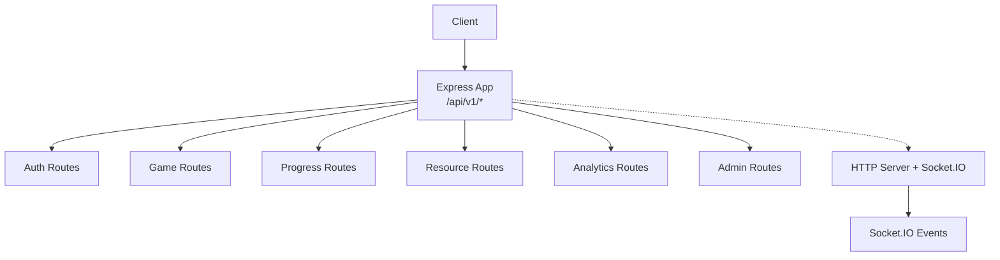
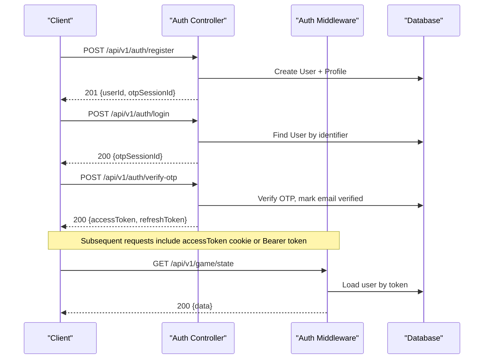
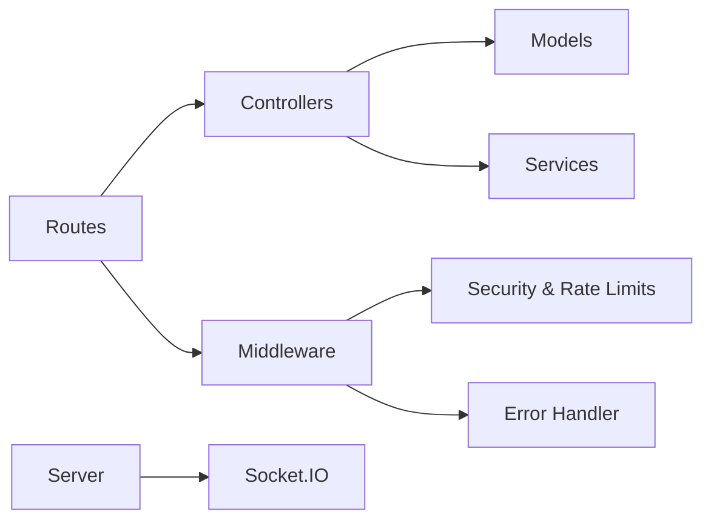

# Backend API Documentation

<cite>
**Referenced Files in This Document**
- [app.js](file://backend/app.js)
- [server.js](file://backend/server.js)
- [routes/auth-routes.js](file://backend/routes/auth-routes.js)
- [routes/game-routes.js](file://backend/routes/game-routes.js)
- [routes/progress-routes.js](file://backend/routes/progress-routes.js)
- [routes/resource-routes.js](file://backend/routes/resource-routes.js)
- [controllers/auth-controller.js](file://backend/controllers/auth-controller.js)
- [controllers/game-controller.js](file://backend/controllers/game-controller.js)
- [controllers/progress-controller.js](file://backend/controllers/progress-controller.js)
- [controllers/resource-controller.js](file://backend/controllers/resource-controller.js)
- [middleware/authMiddleware.js](file://backend/middleware/authMiddleware.js)
- [middleware/security.js](file://backend/middleware/security.js)
- [middleware/error-handler.js](file://backend/middleware/error-handler.js)
- [validators/auth-schemas.js](file://backend/validators/auth-schemas.js)
- [validators/game-schemas.js](file://backend/validators/game-schemas.js)
- [sockets/index.js](file://backend/sockets/index.js)
</cite>

## Table of Contents
1. Introduction
2. Project Structure
3. Core Components
4. Architecture Overview
5. Detailed Component Analysis
6. Dependency Analysis
7. Performance Considerations
8. Troubleshooting Guide
9. Conclusion
10. Appendices

## Introduction
This document provides comprehensive API documentation for the backend services, covering authentication, game management, progress tracking, resources, analytics, and admin functions. It includes REST endpoint specifications (methods, URL patterns, request/response schemas, authentication requirements, validation rules, and error responses), WebSocket events for real-time features, and the authentication flow with JWT tokens, OTP verification, and guest user support. Rate limiting, error handling patterns, and API versioning strategy are also documented.

## Project Structure
The application is an Express-based server with modular routes, controllers, middleware, validators, models, and Socket.IO integration for real-time features. The main app wires up security middleware, CORS, JSON parsing, rate limiters, and mounts versioned API routes under /api/v1. A separate HTTP server hosts a Socket.IO instance for real-time communication.

**Diagram sources**
- [app.js:15-49](file://backend/app.js#L15-L49)
- [server.js:9-25](file://backend/server.js#L9-L25)

**Section sources**
- [app.js:15-53](file://backend/app.js#L15-L53)
- [server.js:9-25](file://backend/server.js#L9-L25)

## Core Components
- Authentication: Register, login, OTP verification/resend, logout, token refresh, guest login.
- Game Management: Start session, get state, perform actions (collect clue, choose option, complete), chat, list challenges.
- Progress Tracking: Submit progress per scenario and list user progress.
- Resources: Public catalogue and regions; authenticated lists and scenario-scoped resources.
- Analytics and Admin: Route placeholders present; endpoints can be added later.
- Real-time: Socket.IO rooms for game sessions.

**Section sources**
- [routes/auth-routes.js:1-18](file://backend/routes/auth-routes.js#L1-L18)
- [routes/game-routes.js:1-15](file://backend/routes/game-routes.js#L1-L15)
- [routes/progress-routes.js:1-12](file://backend/routes/progress-routes.js#L1-L12)
- [routes/resource-routes.js:1-11](file://backend/routes/resource-routes.js#L1-L11)
- [sockets/index.js:1-19](file://backend/sockets/index.js#L1-L19)

## Architecture Overview
The API uses JWT-based authentication with access and refresh tokens stored in httpOnly cookies and optionally sent via Authorization header. Requests to protected routes require a valid access token. OTP is used for email verification during registration and login flows. Rate limiting protects sensitive endpoints. All errors are normalized through a central error handler.

**Diagram sources**
- [controllers/auth-controller.js:34-121](file://backend/controllers/auth-controller.js#L34-L121)
- [middleware/authMiddleware.js:6-35](file://backend/middleware/authMiddleware.js#L6-L35)

## Detailed Component Analysis

### Authentication API
Base path: /api/v1/auth

- POST /api/v1/auth/register
  - Auth: None
  - Rate limit: authLimiter
  - Request body schema:
    - username: string, trimmed, min 3, max 32, alphanumeric with underscores
    - email: string, trimmed, valid email, max 255
    - password: string, min 8, max 128, must include uppercase, lowercase, number, special character
    - ageGroup: optional enum default '18-24'
  - Success response: 201 with message, userId, otpSessionId
  - Errors: 409 if email taken; 400 on validation failure; 429 on rate limit

- POST /api/v1/auth/login
  - Auth: None
  - Rate limit: authLimiter
  - Request body schema:
    - identifier: string, trimmed, min 3, max 255 (email or username)
    - password: same constraints as register
  - Success response: 200 with message and otpSessionId
  - Errors: 404 if not registered; 401 invalid credentials; 400 validation; 429 rate limit

- POST /api/v1/auth/verify-otp
  - Auth: None
  - Rate limit: otpLimiter
  - Request body schema:
    - otpSessionId: UUID string
    - code: 6-digit numeric string
  - Success response: 200 with accessToken, refreshToken, user object
  - Errors: 400 validation; 404 user not found; 429 rate limit

- POST /api/v1/auth/resend-otp
  - Auth: None
  - Rate limit: otpLimiter
  - Request body schema:
    - otpSessionId: UUID string
  - Success response: 200 with message and otpSessionId
  - Errors: 400 validation; 429 rate limit

- POST /api/v1/auth/logout
  - Auth: Required (Bearer or cookie)
  - Behavior: Invalidates session by incrementing tokenVersion and clears cookies
  - Success response: 200 with message

- POST /api/v1/auth/refresh
  - Auth: None (uses refresh token from cookie or body)
  - Rate limit: authLimiter
  - Request body schema:
    - refreshToken: optional if provided in body; otherwise read from cookie
  - Success response: 200 with new accessToken, refreshToken
  - Errors: 401 if missing or invalid/expired token; 429 rate limit

- POST /api/v1/auth/guest
  - Auth: None
  - Rate limit: authLimiter
  - Behavior: Creates or retrieves a guest user and issues tokens
  - Success response: 200 with message, tokens, and user object including isGuest flag
  - Errors: 403 if guest play disabled; 429 rate limit

Authentication details:
- Tokens: Access and refresh JWTs signed with environment secrets and TTLs.
- Cookie options: httpOnly, secure in production, SameSite Strict, optional domain.
- Token storage: Cookies set on successful auth; clients may also send Bearer token in Authorization header.

**Section sources**
- [routes/auth-routes.js:1-18](file://backend/routes/auth-routes.js#L1-L18)
- [controllers/auth-controller.js:10-151](file://backend/controllers/auth-controller.js#L10-L151)
- [middleware/authMiddleware.js:6-35](file://backend/middleware/authMiddleware.js#L6-L35)
- [middleware/security.js:23-45](file://backend/middleware/security.js#L23-L45)
- [validators/auth-schemas.js:1-29](file://backend/validators/auth-schemas.js#L1-L29)

### Game Management API
Base path: /api/v1/game

- GET /api/v1/game/challenges
  - Auth: Required
  - Response: List of published scenarios with brief metadata

- POST /api/v1/game/start
  - Auth: Required
  - Request body schema:
    - scenarioId: UUID string
  - Success response: 201 with sessionId, challenge content, initial state

- GET /api/v1/game/state
  - Auth: Required
  - Query/header: sessionId via query or X-Session-Id header
  - Success response: sessionId, challenge, current state, revealed clues, history, expiresAt

- POST /api/v1/game/action
  - Auth: Required
  - Request body schema:
    - sessionId: UUID
    - type: one of collect_clue, choose_option, complete
    - clueId: required when type is collect_clue
    - optionId: required when type is choose_option
  - Success response: Updated state, optional revealed clue, updated history, completedAt if completed
  - Errors: 409 if already decided or clues required; 400 invalid action/clue/option; 404 session not found

- POST /api/v1/game/chat
  - Auth: Required
  - Request body schema:
    - sessionId: UUID
    - message: string, trimmed, length 1..500
  - Success response: Engine-provided chat response

Validation and business rules:
- Clues must be collected before choosing an option.
- Scoring and stars are bounded and derived from scenario options and session state.
- Session expiration enforced.

**Section sources**
- [routes/game-routes.js:1-15](file://backend/routes/game-routes.js#L1-L15)
- [controllers/game-controller.js:18-125](file://backend/controllers/game-controller.js#L18-L125)
- [validators/game-schemas.js:1-27](file://backend/validators/game-schemas.js#L1-L27)

### Progress Tracking API
Base path: /api/v1/progress

- GET /api/v1/progress
  - Auth: Required
  - Response: List of player progress entries ordered by most recent update

- POST /api/v1/progress/submit
  - Auth: Required
  - Rate limit: writeLimiter
  - Request body schema:
    - sessionId: UUID
    - scenarioId: UUID
    - status: one of started, completed, failed
    - evidence: optional object
  - Success response: 201 on creation or 200 on update with scenarioId, status, stars, score, attempts, bestStars
  - Errors: 404 scenario/session not found; 409 if completing incomplete session; 400 validation; 429 rate limit

Business rules:
- Completion requires an active completed session state.
- Stars and score are computed from session state and scenario options, clamped to safe ranges.
- Skill indicators are updated upon completion when applicable.

**Section sources**
- [routes/progress-routes.js:1-12](file://backend/routes/progress-routes.js#L1-L12)
- [controllers/progress-controller.js:5-76](file://backend/controllers/progress-controller.js#L5-L76)
- [validators/game-schemas.js:19-24](file://backend/validators/game-schemas.js#L19-L24)

### Resources API
Base path: /api/v1/resources

- GET /api/v1/resources/regions
  - Auth: Not required
  - Response: List of India regions with metadata

- GET /api/v1/resources/catalogue
  - Auth: Not required
  - Query params: state, profession, organisationType, freeOnly
  - Response: Curated and verified government resources with filtering and deduplication

- GET /api/v1/resources
  - Auth: Required
  - Query params: state, profession, organisationType, freeOnly
  - Response: Verified resources filtered by query

- GET /api/v1/resources/:scenarioId
  - Auth: Required
  - Response: Scenario-linked resources plus any scenario-specific verified resources

Notes:
- Official domains are auto-verified based on protocol and hostname patterns.
- Filtering supports region, profession tags, organization type, and free-only mode.

**Section sources**
- [routes/resource-routes.js:1-11](file://backend/routes/resource-routes.js#L1-L11)
- [controllers/resource-controller.js:1-13](file://backend/controllers/resource-controller.js#L1-L13)

### Analytics and Admin APIs
- Base paths: /api/v1/analytics, /api/v1/admin
- Current status: Route modules exist but no endpoints implemented yet.
- Guidance: Add controllers and route handlers following existing patterns (auth, validation, rate limiting).

**Section sources**
- [routes/analytics-routes.js:1-4](file://backend/routes/analytics-routes.js#L1-L4)
- [routes/admin-routes.js:1-4](file://backend/routes/admin-routes.js#L1-L4)

### WebSocket Events
Base transport: Socket.IO over websocket/polling

- Connection: Established automatically by client library
- Event: join_game(gameId)
  - Purpose: Join a room scoped to a game session
  - Usage: Clients call this after obtaining a sessionId to receive live updates for that game

- Event: disconnect
  - Purpose: Cleanup when client disconnects

Notes:
- Rooms are named game_<gameId>.
- No authentication is enforced at the socket layer in the current implementation; consider adding token-based authorization for production use.

**Section sources**
- [server.js:12-21](file://backend/server.js#L12-L21)
- [sockets/index.js:3-16](file://backend/sockets/index.js#L3-L16)

## Dependency Analysis
Key dependencies and relationships:
- Routes depend on controllers and middleware (auth, validate, rate limits).
- Controllers depend on models and services (game engine, OTP service).
- Middleware enforces security (CORS, helmet, input sanitization, rate limits).
- Error handler normalizes all errors and logs contextual information.

**Diagram sources**
- [app.js:15-53](file://backend/app.js#L15-L53)
- [server.js:9-25](file://backend/server.js#L9-L25)

**Section sources**
- [app.js:15-53](file://backend/app.js#L15-L53)
- [middleware/security.js:1-48](file://backend/middleware/security.js#L1-L48)
- [middleware/error-handler.js:1-52](file://backend/middleware/error-handler.js#L1-L52)

## Performance Considerations
- Input size limited to 10kb to prevent large payloads.
- Rate limiting:
  - Auth endpoints: 30 requests per 15 minutes
  - OTP endpoints: 10 requests per 15 minutes
  - Write endpoints (progress, analytics): 100 requests per 15 minutes
- Database queries are scoped to user and session where applicable to minimize overhead.
- Use X-Request-Id for tracing across services and logs.

[No sources needed since this section provides general guidance]

## Troubleshooting Guide
Common errors and handling:
- Validation errors: 400 with code VALIDATION_ERROR and descriptive message.
- Duplicate entries: 409 with code DUPLICATE_ENTRY.
- Unauthorized: 401 with UNAUTHORIZED or INVALID_TOKEN.
- Not found: 404 with NOT_FOUND.
- Internal errors: 500 with INTERNAL_ERROR; detailed messages only in development.
- Rate limiting: 429 with TOO_MANY_REQUESTS.

Debugging tips:
- Inspect X-Request-Id in responses to correlate logs.
- Check error.response.error.code and message for client-side feedback.
- For auth issues, ensure accessToken is present in cookies or Authorization header and has not expired.

**Section sources**
- [middleware/error-handler.js:1-52](file://backend/middleware/error-handler.js#L1-L52)
- [middleware/security.js:10-18](file://backend/middleware/security.js#L10-L18)

## Conclusion
The backend exposes a secure, versioned REST API with robust authentication (JWT + OTP), game lifecycle management, progress tracking, and resource discovery. Real-time capabilities are available via Socket.IO rooms. Centralized error handling and rate limiting improve reliability and safety. Future enhancements should add analytics and admin endpoints and consider socket-level authentication for enhanced security.

[No sources needed since this section summarizes without analyzing specific files]

## Appendices

### API Versioning Strategy
- All public endpoints are mounted under /api/v1.
- To introduce breaking changes, create a new version (e.g., /api/v2) and deprecate older versions gradually.

**Section sources**
- [app.js:39-49](file://backend/app.js#L39-L49)

### Security and Headers
- Helmet configured with CSP disabled and cross-origin resource policy set to allow cross-origin.
- CORS allows configured origins with credentials.
- Allowed headers include Content-Type, Authorization, X-CSRF-Token, X-Client-Platform, X-Request-Id.
- Unsafe input characters are rejected to prevent injection attacks.

**Section sources**
- [app.js:18-32](file://backend/app.js#L18-L32)
- [middleware/security.js:10-18](file://backend/middleware/security.js#L10-L18)

### Health Endpoints
- GET /health: Returns service status and requestId.
- GET /health/ready: Verifies database connectivity and returns readiness.

**Section sources**
- [app.js:34-38](file://backend/app.js#L34-L38)