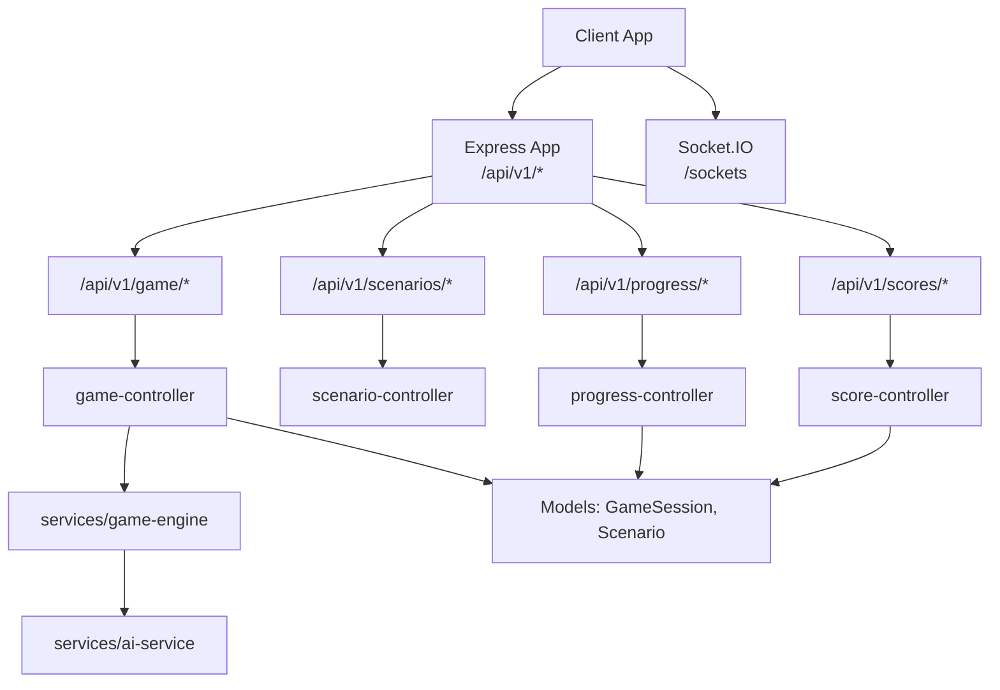
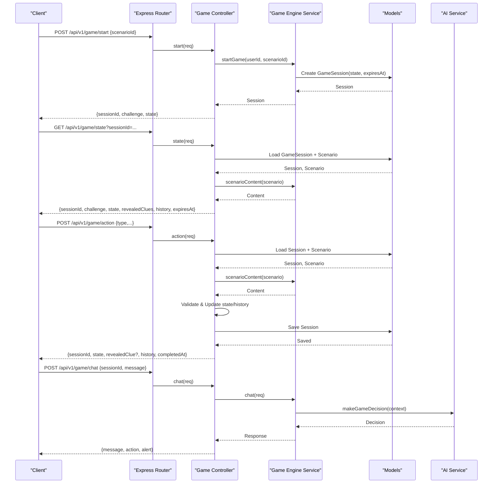
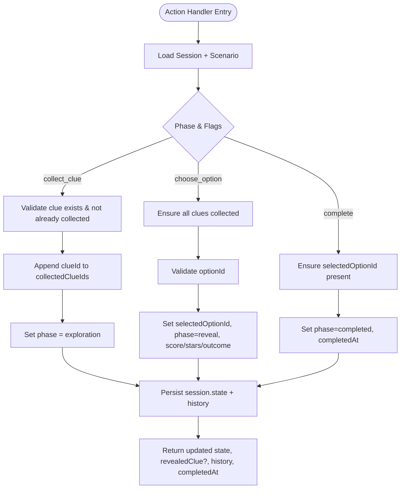
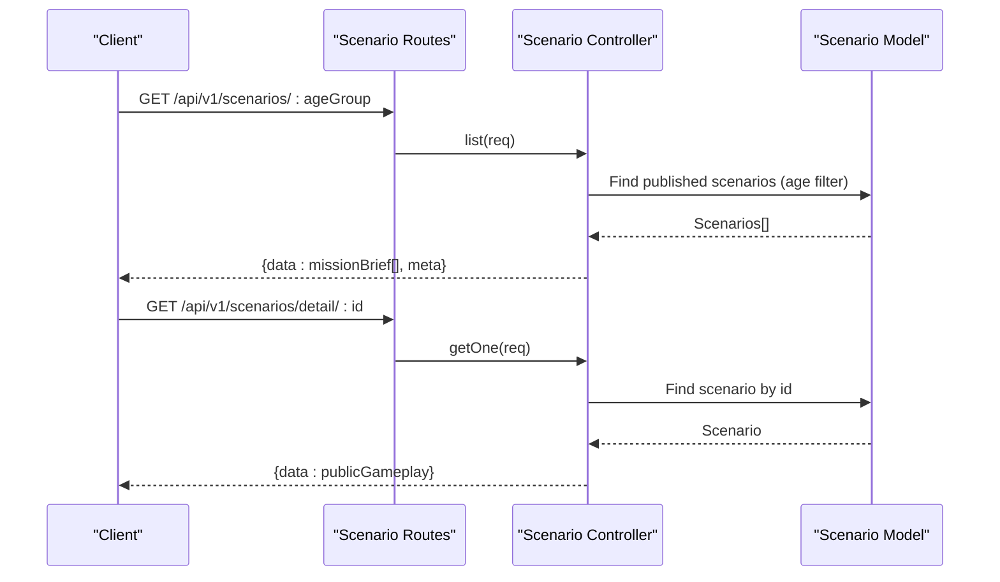
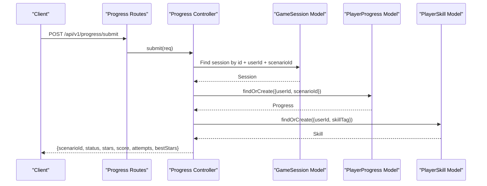
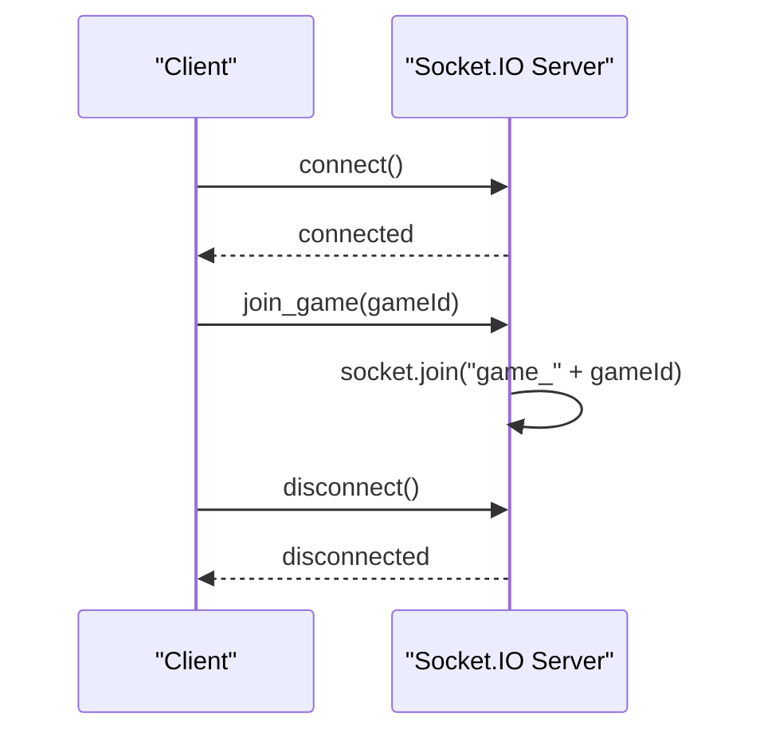
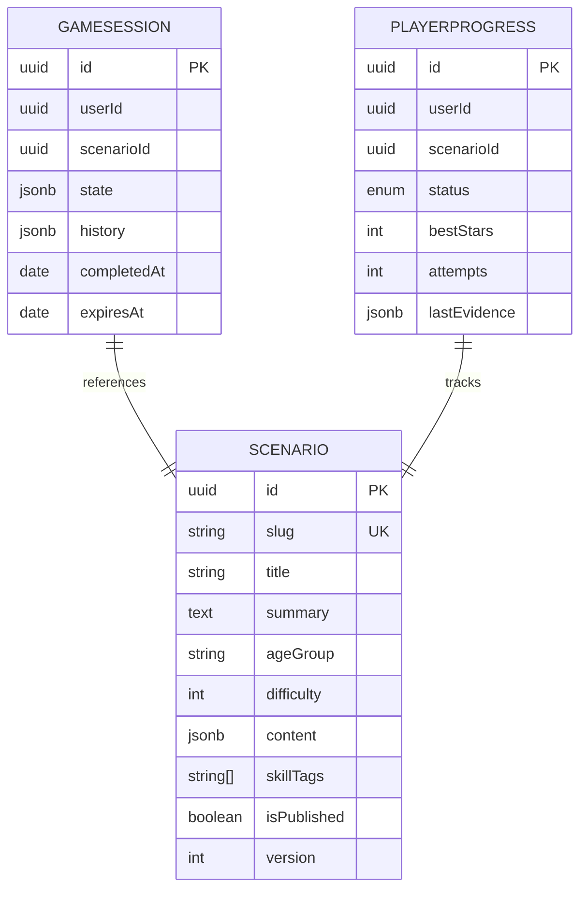
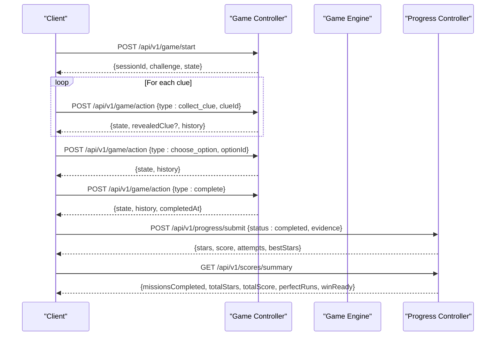
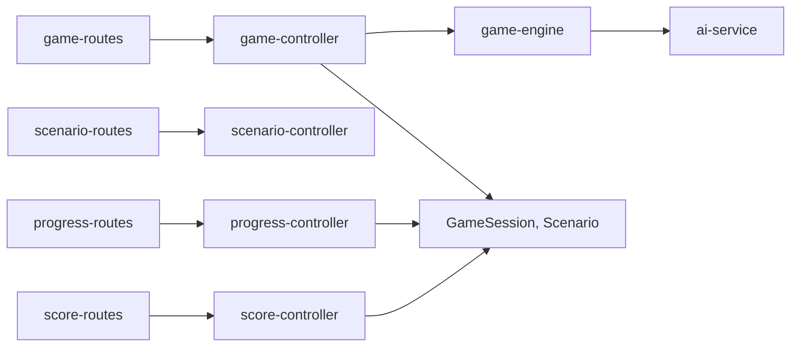

# Game Engine API

<cite>
**Referenced Files in This Document**
- [app.js](file://backend/app.js)
- [game-routes.js](file://backend/routes/game-routes.js)
- [scenario-routes.js](file://backend/routes/scenario-routes.js)
- [progress-routes.js](file://backend/routes/progress-routes.js)
- [score-routes.js](file://backend/routes/score-routes.js)
- [game-controller.js](file://backend/controllers/game-controller.js)
- [scenario-controller.js](file://backend/controllers/scenario-controller.js)
- [progress-controller.js](file://backend/controllers/progress-controller.js)
- [score-controller.js](file://backend/controllers/score-controller.js)
- [game-engine.js](file://backend/services/game-engine.js)
- [ai-service.js](file://backend/services/ai-service.js)
- [GameSession.js](file://backend/models/GameSession.js)
- [Scenario.js](file://backend/models/Scenario.js)
- [PlayerProgress.js](file://backend/models/PlayerProgress.js)
- [game-schemas.js](file://backend/validators/game-schemas.js)
- [index.js](file://backend/sockets/index.js)
</cite>

## Table of Contents
1. Introduction
2. Project Structure
3. Core Components
4. Architecture Overview
5. Detailed Component Analysis
6. Dependency Analysis
7. Performance Considerations
8. Troubleshooting Guide
9. Conclusion

## Introduction
This document provides detailed API documentation for the game engine endpoints that manage game sessions, scenario loading, puzzle interaction, action processing, and state synchronization. It also covers real-time event handling via Socket.IO, the game state model, session persistence, progress tracking, and performance considerations for high-frequency events. The goal is to help developers integrate with the backend services to build a responsive and reliable game experience.

## Project Structure
The backend exposes REST APIs under /api/v1 and integrates Socket.IO for real-time features. Key modules include:
- Routes: Define HTTP endpoints grouped by feature (game, scenarios, progress, scores).
- Controllers: Implement request handling logic and orchestrate services.
- Services: Encapsulate business logic (game engine, AI decisions).
- Models: Persist entities such as GameSession, Scenario, PlayerProgress.
- Validators: Enforce input schemas using Joi.
- Sockets: Manage WebSocket connections and rooms.

**Diagram sources**
- [app.js:39-48](file://backend/app.js#L39-L48)
- [game-routes.js:8-12](file://backend/routes/game-routes.js#L8-L12)
- [scenario-routes.js:1-2](file://backend/routes/scenario-routes.js#L1-L2)
- [progress-routes.js:8-9](file://backend/routes/progress-routes.js#L8-L9)
- [score-routes.js:6-6](file://backend/routes/score-routes.js#L6-L6)
- [game-controller.js:1-128](file://backend/controllers/game-controller.js#L1-L128)
- [scenario-controller.js:1-71](file://backend/controllers/scenario-controller.js#L1-L71)
- [progress-controller.js:1-79](file://backend/controllers/progress-controller.js#L1-L79)
- [score-controller.js:1-24](file://backend/controllers/score-controller.js#L1-L24)
- [game-engine.js:1-124](file://backend/services/game-engine.js#L1-L124)
- [ai-service.js:1-51](file://backend/services/ai-service.js#L1-L51)

**Section sources**
- [app.js:15-54](file://backend/app.js#L15-L54)
- [game-routes.js:1-15](file://backend/routes/game-routes.js#L1-L15)
- [scenario-routes.js:1-2](file://backend/routes/scenario-routes.js#L1-L2)
- [progress-routes.js:1-12](file://backend/routes/progress-routes.js#L1-L12)
- [score-routes.js:1-9](file://backend/routes/score-routes.js#L1-L9)

## Core Components
- Game Session Management: Start, query state, process actions, and complete sessions.
- Scenario Loading: Retrieve published scenarios and their public gameplay content.
- Action Processing: Collect clues, choose options, and complete scenarios with validation.
- State Synchronization: Return merged game state, revealed clues, history, and expiration.
- Real-time Events: Socket.IO connection lifecycle and room joining for live updates.
- Progress Tracking: Submit completion status, compute stars/score, update skills.
- Scoring Summary: Aggregate completed missions, stars, total score, and win readiness.

**Section sources**
- [game-controller.js:18-125](file://backend/controllers/game-controller.js#L18-L125)
- [scenario-controller.js:7-70](file://backend/controllers/scenario-controller.js#L7-L70)
- [progress-controller.js:5-79](file://backend/controllers/progress-controller.js#L5-L79)
- [score-controller.js:4-24](file://backend/controllers/score-controller.js#L4-L24)
- [index.js:3-18](file://backend/sockets/index.js#L3-L18)

## Architecture Overview
The game engine uses a layered architecture:
- Routes enforce authentication and input validation.
- Controllers coordinate requests with services and models.
- Services encapsulate core logic (session creation, chat decision-making).
- Models persist data (sessions, scenarios, progress).
- Socket.IO enables real-time communication channels.

**Diagram sources**
- [game-routes.js:8-12](file://backend/routes/game-routes.js#L8-L12)
- [game-controller.js:18-125](file://backend/controllers/game-controller.js#L18-L125)
- [game-engine.js:51-124](file://backend/services/game-engine.js#L51-L124)
- [ai-service.js:18-51](file://backend/services/ai-service.js#L18-L51)
- [GameSession.js:4-12](file://backend/models/GameSession.js#L4-L12)
- [Scenario.js:4-15](file://backend/models/Scenario.js#L4-L15)

## Detailed Component Analysis

### Game Session Endpoints
- Start Session
  - Endpoint: POST /api/v1/game/start
  - Auth: Required
  - Body: scenarioId (UUID)
  - Behavior: Creates a new GameSession with initial state and expiration; returns sessionId, scenario gameplay summary, and merged state.
  - Errors: Scenario not found or invalid input.

- Get Session State
  - Endpoint: GET /api/v1/game/state
  - Auth: Required
  - Query/Header: sessionId
  - Behavior: Returns current session state, scenario gameplay summary, revealed clues based on collected clues, history, and expiration time.
  - Errors: No active session found.

- Process Action
  - Endpoint: POST /api/v1/game/action
  - Auth: Required
  - Body: sessionId, type (collect_clue | choose_option | complete), clueId (for collect_clue), optionId (for choose_option)
  - Behavior: Validates action against current phase and scenario content; updates state and history; marks completion when appropriate.
  - Errors: Invalid action, already decided, missing clues, invalid clue/option, decision required.

- Chat
  - Endpoint: POST /api/v1/game/chat
  - Auth: Required
  - Body: sessionId, message
  - Behavior: Builds context from session and scenario metrics; calls AI service for decision; persists interaction; returns assistant response and optional alert.
  - Errors: Session not found, scenario not found.

**Diagram sources**
- [game-controller.js:52-116](file://backend/controllers/game-controller.js#L52-L116)
- [game-schemas.js:7-12](file://backend/validators/game-schemas.js#L7-L12)

**Section sources**
- [game-routes.js:8-12](file://backend/routes/game-routes.js#L8-L12)
- [game-controller.js:18-125](file://backend/controllers/game-controller.js#L18-L125)
- [game-schemas.js:3-17](file://backend/validators/game-schemas.js#L3-L17)

### Scenario Loading and Public Gameplay
- List Scenarios
  - Endpoint: GET /api/v1/scenarios/:ageGroup
  - Auth: Required
  - Behavior: Returns brief info for published scenarios filtered by age group.

- Get Scenario Detail
  - Endpoint: GET /api/v1/scenarios/detail/:id
  - Auth: Required
  - Behavior: Returns full public gameplay payload including presentation, interactables, world, puzzles, clues, options, and learning objectives.

**Diagram sources**
- [scenario-routes.js:1-2](file://backend/routes/scenario-routes.js#L1-L2)
- [scenario-controller.js:55-70](file://backend/controllers/scenario-controller.js#L55-L70)
- [Scenario.js:4-15](file://backend/models/Scenario.js#L4-L15)

**Section sources**
- [scenario-routes.js:1-2](file://backend/routes/scenario-routes.js#L1-L2)
- [scenario-controller.js:7-70](file://backend/controllers/scenario-controller.js#L7-L70)

### Progress Tracking and Scoring
- Submit Progress
  - Endpoint: POST /api/v1/progress/submit
  - Auth: Required
  - Body: sessionId, scenarioId, status (started | completed | failed), evidence (optional)
  - Behavior: Validates scenario and session; ensures completion before marking completed; computes stars and score from session state; updates PlayerProgress and skill indicators.

- List Progress
  - Endpoint: GET /api/v1/progress
  - Auth: Required
  - Behavior: Returns user’s progress records ordered by most recent.

- Score Summary
  - Endpoint: GET /api/v1/scores/summary
  - Auth: Required
  - Behavior: Aggregates completed missions count, total stars, total score, perfect runs, and win-ready flag.

**Diagram sources**
- [progress-routes.js:8-9](file://backend/routes/progress-routes.js#L8-L9)
- [progress-controller.js:5-79](file://backend/controllers/progress-controller.js#L5-L79)
- [PlayerProgress.js:4-14](file://backend/models/PlayerProgress.js#L4-L14)

**Section sources**
- [progress-routes.js:1-12](file://backend/routes/progress-routes.js#L1-L12)
- [progress-controller.js:1-79](file://backend/controllers/progress-controller.js#L1-L79)
- [score-routes.js:6-6](file://backend/routes/score-routes.js#L6-L6)
- [score-controller.js:4-24](file://backend/controllers/score-controller.js#L4-L24)

### Real-Time Event Handling (Socket.IO)
- Connection Lifecycle
  - On connect: Log socket ID.
  - Join Room: join_game(gameId) joins a room named game_{gameId}.
  - Disconnect: Log disconnect event.

**Diagram sources**
- [index.js:3-18](file://backend/sockets/index.js#L3-L18)

**Section sources**
- [index.js:1-19](file://backend/sockets/index.js#L1-L19)

### Game State Model and Persistence
- GameSession
  - Fields: id (UUID), userId, scenarioId, state (JSONB), history (JSONB), completedAt (DATE), expiresAt (DATE)
  - Purpose: Tracks per-user session state, action history, and lifecycle timestamps.

- Scenario
  - Fields: id (UUID), slug, title, summary, ageGroup, difficulty, content (JSONB), skillTags (ARRAY), isPublished (BOOLEAN), version (INTEGER)
  - Purpose: Defines scenario metadata and interactive content structure.

- PlayerProgress
  - Fields: id (UUID), userId, scenarioId, status (ENUM), bestStars (INTEGER), attempts (INTEGER), lastEvidence (JSONB)
  - Purpose: Records completion status, best stars, attempt counts, and latest evidence for analytics and scoring.

**Diagram sources**
- [GameSession.js:4-12](file://backend/models/GameSession.js#L4-L12)
- [Scenario.js:4-15](file://backend/models/Scenario.js#L4-L15)
- [PlayerProgress.js:4-14](file://backend/models/PlayerProgress.js#L4-L14)

**Section sources**
- [GameSession.js:1-15](file://backend/models/GameSession.js#L1-L15)
- [Scenario.js:1-18](file://backend/models/Scenario.js#L1-L18)
- [PlayerProgress.js:1-17](file://backend/models/PlayerProgress.js#L1-L17)

### Typical Game Flow Sequences
- Starting a Session
  - Client calls start with scenarioId; server creates session and returns sessionId plus initial state and scenario gameplay summary.

- Collecting Clues and Choosing Options
  - Client collects clues until all are gathered; then chooses an option; server validates and transitions phases accordingly.

- Completing a Session
  - Client completes the scenario; server marks session completed and returns final state and timestamp.

- Submitting Progress and Updating Scores
  - Client submits progress with status; server computes stars/score, updates PlayerProgress and skill indicators; client can fetch score summary.

**Diagram sources**
- [game-controller.js:18-125](file://backend/controllers/game-controller.js#L18-L125)
- [progress-controller.js:5-79](file://backend/controllers/progress-controller.js#L5-L79)
- [score-controller.js:4-24](file://backend/controllers/score-controller.js#L4-L24)

## Dependency Analysis
- Route-to-Controller Mapping
  - /api/v1/game -> game-controller
  - /api/v1/scenarios -> scenario-controller
  - /api/v1/progress -> progress-controller
  - /api/v1/scores -> score-controller

- Controller-to-Service Dependencies
  - game-controller depends on game-engine for session management and chat decisions.
  - game-engine depends on ai-service for decision generation and fallback behavior.

- Model Dependencies
  - game-controller and game-engine read/write GameSession and Scenario.
  - progress-controller reads/writes PlayerProgress and optionally updates PlayerSkill.
  - score-controller aggregates PlayerProgress and Scenario counts.

**Diagram sources**
- [game-routes.js:8-12](file://backend/routes/game-routes.js#L8-L12)
- [scenario-routes.js:1-2](file://backend/routes/scenario-routes.js#L1-L2)
- [progress-routes.js:8-9](file://backend/routes/progress-routes.js#L8-L9)
- [score-routes.js:6-6](file://backend/routes/score-routes.js#L6-L6)
- [game-controller.js:1-128](file://backend/controllers/game-controller.js#L1-L128)
- [game-engine.js:1-124](file://backend/services/game-engine.js#L1-L124)
- [ai-service.js:1-51](file://backend/services/ai-service.js#L1-L51)

**Section sources**
- [app.js:39-48](file://backend/app.js#L39-L48)
- [game-controller.js:1-128](file://backend/controllers/game-controller.js#L1-L128)
- [game-engine.js:1-124](file://backend/services/game-engine.js#L1-L124)
- [ai-service.js:1-51](file://backend/services/ai-service.js#L1-L51)

## Performance Considerations
- High-Frequency Actions
  - Minimize payload size by sending only necessary fields (e.g., clueId or optionId depending on action type).
  - Batch operations where possible at the client side to reduce network overhead.

- Database Efficiency
  - Use indexed queries (e.g., unique index on PlayerProgress.userId + scenarioId) to speed up lookups.
  - Avoid unnecessary reads by caching scenario content on the client after initial load.

- AI Service Latency
  - The AI decision call includes timeout handling and deterministic fallback to ensure responsiveness even if the external service is slow or unavailable.

- Rate Limiting and Security
  - Global JSON body limits and security middleware protect against large payloads and unsafe inputs.
  - CORS configuration restricts origins to trusted clients.

[No sources needed since this section provides general guidance]

## Troubleshooting Guide
Common errors and resolutions:
- SESSION_NOT_FOUND
  - Cause: Missing or expired session; incorrect sessionId.
  - Resolution: Ensure sessionId is valid and session has not expired or been completed.

- ALREADY_DECIDED
  - Cause: Attempting to collect clues or choose an option after a decision was made.
  - Resolution: Proceed to complete the scenario or start a new session.

- CLUES_REQUIRED
  - Cause: Trying to choose an option without collecting all required clues.
  - Resolution: Collect all clues before choosing an option.

- INVALID_CLUE / INVALID_OPTION
  - Cause: Provided clueId or optionId does not exist in the scenario content.
  - Resolution: Verify IDs against the scenario’s public gameplay payload.

- DECISION_REQUIRED
  - Cause: Attempting to complete without selecting an option.
  - Resolution: Choose an option before completing.

- SCENARIO_NOT_FOUND
  - Cause: Scenario not published or not available.
  - Resolution: Confirm scenarioId is published and accessible.

- CORS_ORIGIN_DENIED
  - Cause: Request origin not allowed.
  - Resolution: Configure client origin to match allowed CORS origins.

**Section sources**
- [game-controller.js:8-12](file://backend/controllers/game-controller.js#L8-L12)
- [game-controller.js:63-101](file://backend/controllers/game-controller.js#L63-L101)
- [game-engine.js:51-75](file://backend/services/game-engine.js#L51-L75)
- [app.js:21-29](file://backend/app.js#L21-L29)

## Conclusion
The game engine provides a robust set of endpoints for managing game sessions, interacting with scenarios, processing player actions, and tracking progress and scores. The architecture separates concerns across routes, controllers, services, and models, enabling maintainable and scalable functionality. Socket.IO supports real-time interactions, while validators and error handling ensure reliability. By following the documented flows and considering performance tips, developers can build responsive and engaging game experiences.