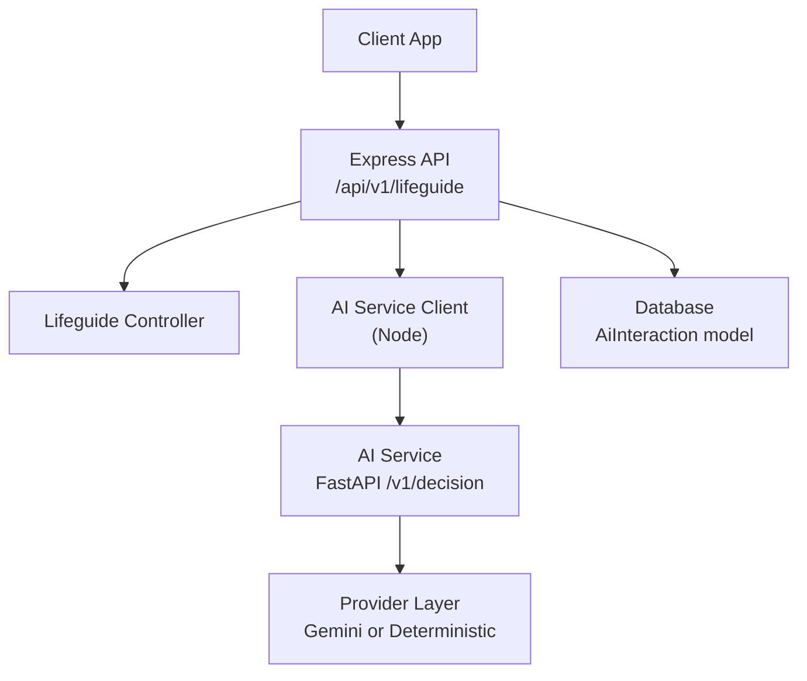
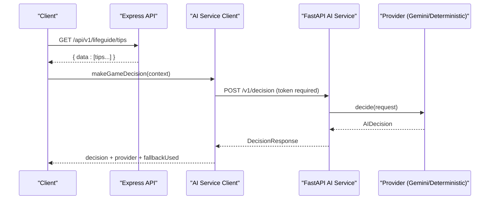
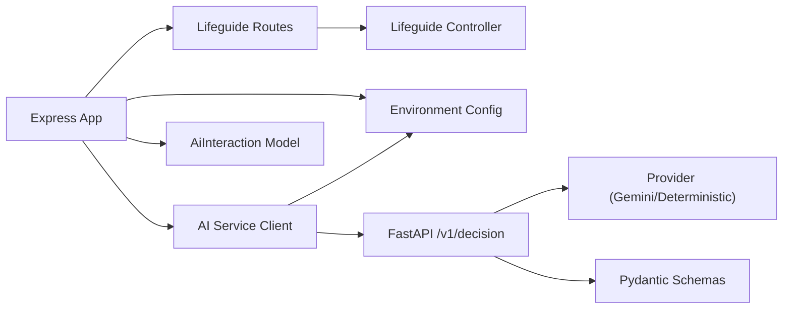
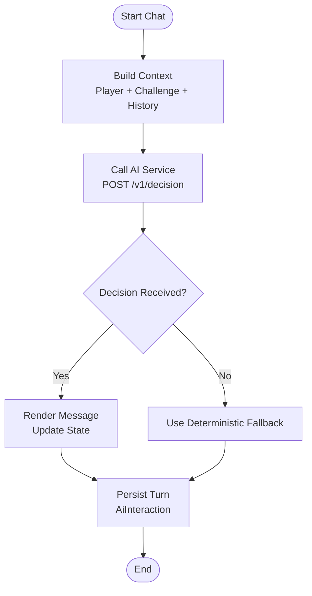

# Life Guide API

<cite>
**Referenced Files in This Document**
- [app.js](file://backend/app.js)
- [lifeguide-routes.js](file://backend/routes/lifeguide-routes.js)
- [lifeguide-controller.js](file://backend/controllers/lifeguide-controller.js)
- [ai-service.js](file://backend/services/ai-service.js)
- [env.js](file://backend/config/env.js)
- [AiInteraction.js](file://backend/models/AiInteraction.js)
- [main.py](file://backend/ai-service/app/main.py)
- [schemas.py](file://backend/ai-service/app/schemas.py)
- [provider.py](file://backend/ai-service/app/provider.py)
- [config.py](file://backend/ai-service/app/config.py)
- [chat-agent.js](file://backend/public/js/chat-agent.js)
</cite>

## Table of Contents
1. [Introduction](#introduction)
2. [Project Structure](#project-structure)
3. [Core Components](#core-components)
4. [Architecture Overview](#architecture-overview)
5. [Detailed Component Analysis](#detailed-component-analysis)
6. [Dependency Analysis](#dependency-analysis)
7. [Performance Considerations](#performance-considerations)
8. [Troubleshooting Guide](#troubleshooting-guide)
9. [Conclusion](#conclusion)
10. [Appendices](#appendices)

## Introduction
This document provides comprehensive API documentation for the Life Guide and AI assistance features. It covers:
- AI-powered guidance, personalized recommendations, and decision support
- Conversation management and context-aware adaptive responses
- Endpoints for chat interactions, advice retrieval, and learning assistance
- Integration with an internal AI service, response formatting, and fallback mechanisms
- Examples of AI conversations, recommendation queries, and guidance workflows

The system consists of:
- A Node.js backend exposing REST endpoints under /api/v1/lifeguide
- An internal AI service (FastAPI) providing decision-making via a deterministic or Gemini-based provider
- Client-side chat integration that can call either the backend or directly use Gemini with fallback to scripted replies

## Project Structure
The relevant parts of the project structure for Life Guide and AI are:
- Backend Express app mounts routes under /api/v1/lifeguide
- The lifeguide routes expose tips and integrate with the AI decision service
- The AI service exposes a health check and a decision endpoint protected by token verification
- Models persist AI interactions for analytics and continuity

**Diagram sources**
- [app.js:39-48](file://backend/app.js#L39-L48)
- [lifeguide-routes.js:5-5](file://backend/routes/lifeguide-routes.js#L5-L5)
- [ai-service.js:18-48](file://backend/services/ai-service.js#L18-L48)
- [main.py:18-32](file://backend/ai-service/app/main.py#L18-L32)
- [AiInteraction.js:4-12](file://backend/models/AiInteraction.js#L4-L12)

**Section sources**
- [app.js:39-48](file://backend/app.js#L39-L48)
- [lifeguide-routes.js:1-7](file://backend/routes/lifeguide-routes.js#L1-L7)

## Core Components
- Lifeguide REST endpoints: Provide curated tips and serve as entry points for AI-driven guidance.
- AI Decision Service Client: Orchestrates calls to the internal AI service with timeout and fallback logic.
- AI Service (FastAPI): Validates requests, authenticates via token, and delegates decisions to a provider (Gemini or deterministic).
- Data Model: Persists conversation turns and decisions for traceability and learning insights.

Key responsibilities:
- Advice retrieval: GET /api/v1/lifeguide/tips returns curated safety and learning tips.
- Decision support: POST /api/v1/lifeguide/decision (conceptual; implemented via client calling AI service) returns structured actions like hints, alerts, explanations, or next steps.
- Chat interactions: Frontend chat agent integrates with AI to provide contextual responses and falls back to scripted content when needed.

**Section sources**
- [lifeguide-controller.js:3-12](file://backend/controllers/lifeguide-controller.js#L3-L12)
- [ai-service.js:4-48](file://backend/services/ai-service.js#L4-L48)
- [main.py:18-32](file://backend/ai-service/app/main.py#L18-L32)
- [AiInteraction.js:4-12](file://backend/models/AiInteraction.js#L4-L12)

## Architecture Overview
The architecture supports robust, safe, and adaptive guidance:
- The backend exposes a minimal set of endpoints for tips and orchestrates AI decisions.
- The AI service enforces authentication and provides consistent JSON-decoded decisions.
- Fallbacks ensure reliability: deterministic rules in both backend and AI service layers.
- Context is preserved through request payloads including player state and challenge details.

**Diagram sources**
- [lifeguide-routes.js:5-5](file://backend/routes/lifeguide-routes.js#L5-L5)
- [ai-service.js:18-48](file://backend/services/ai-service.js#L18-L48)
- [main.py:18-32](file://backend/ai-service/app/main.py#L18-L32)
- [provider.py:12-37](file://backend/ai-service/app/provider.py#L12-L37)

## Detailed Component Analysis

### Lifeguide REST Endpoints
- GET /api/v1/lifeguide/tips
  - Purpose: Retrieve curated safety and learning tips for players.
  - Response: JSON object containing an array of tip entries with id, title, and body.
  - Use cases: Display quick guidance in UI, reinforce safety practices, and support learning objectives.

Example usage:
- Fetch tips at game start or after completing challenges to reinforce key concepts.

**Section sources**
- [lifeguide-routes.js:5-5](file://backend/routes/lifeguide-routes.js#L5-L5)
- [lifeguide-controller.js:3-12](file://backend/controllers/lifeguide-controller.js#L3-L12)

### AI Decision Service Client (Node)
- Function: makeGameDecision(context)
  - Behavior:
    - If AI is disabled, return deterministic fallback decision.
    - Otherwise, call FastAPI /v1/decision with timeout and token.
    - On error or timeout, log warning and return deterministic fallback.
  - Inputs: Player snapshot, challenge context, message, allowed actions.
  - Outputs: Structured decision with action, message, reason, confidence, optional alert/difficulty/challenge_id.

Fallback logic:
- Detect hint-seeking messages and respond with safe hints.
- Reinforce safety alerts when mistakes exceed thresholds.
- Default to verified explanation for general replies.

**Section sources**
- [ai-service.js:4-48](file://backend/services/ai-service.js#L4-L48)
- [env.js:20-23](file://backend/config/env.js#L20-L23)

### AI Service (FastAPI)
- Endpoints:
  - GET /health
    - Returns status and active provider type (gemini or deterministic).
  - POST /v1/decision
    - Requires header x-ai-service-token validated against configured secret.
    - Accepts DecisionRequest schema and returns DecisionResponse.
    - Delegates to provider; if unavailable or error occurs, returns deterministic decision.

Authentication:
- Token verification ensures only trusted services can invoke decision logic.

Provider selection:
- If Gemini API key is configured, uses GeminiProvider; otherwise, deterministic_decision.

**Section sources**
- [main.py:14-32](file://backend/ai-service/app/main.py#L14-L32)
- [config.py:5-23](file://backend/ai-service/app/config.py#L5-L23)

### Provider Layer (Gemini and Deterministic)
- Deterministic decision:
  - Matches hint keywords in player message and returns GIVE_HINT if allowed.
  - Otherwise returns NPC_REPLY with verified explanation.
- Gemini provider:
  - Configures generative model with JSON response schema.
  - Generates decision based on full request context and validates output.

Schema enforcement:
- Strict Pydantic models define allowed fields and constraints for inputs and outputs.

**Section sources**
- [provider.py:12-37](file://backend/ai-service/app/provider.py#L12-L37)
- [schemas.py:5-70](file://backend/ai-service/app/schemas.py#L5-L70)

### Conversation Management and Persistence
- AiInteraction model:
  - Stores userId, scenarioId, playerMessage, assistantMessage, decision (JSONB), and expiresAt.
  - Enables replay, analysis, and continuous learning across sessions.

Usage patterns:
- Persist each turn during chat or decision flows to build conversation history.
- Use expiresAt for retention policies and cleanup.

**Section sources**
- [AiInteraction.js:4-12](file://backend/models/AiInteraction.js#L4-L12)

### Frontend Chat Integration
- Chat Agent:
  - Builds context from slug, chapter, script, and chat history.
  - Attempts direct Gemini call; if unavailable, falls back to scripted reply.
  - Parses JSON responses and renders messages with speaker attribution.

Integration notes:
- When backend AI service is available, prefer it for security and consistency.
- Direct Gemini calls require API keys and should be used cautiously in production.

**Section sources**
- [chat-agent.js:131-174](file://backend/public/js/chat-agent.js#L131-L174)

## Dependency Analysis
- Express app mounts lifeguide routes under /api/v1/lifeguide.
- Lifeguide controller depends on async handler utility and returns static tips.
- AI service client depends on environment configuration for timeouts and tokens.
- FastAPI service depends on settings and provider abstraction.
- Schemas enforce strict contracts between client and server.

**Diagram sources**
- [app.js:39-48](file://backend/app.js#L39-L48)
- [lifeguide-routes.js:1-7](file://backend/routes/lifeguide-routes.js#L1-L7)
- [ai-service.js:1-48](file://backend/services/ai-service.js#L1-L48)
- [main.py:18-32](file://backend/ai-service/app/main.py#L18-L32)
- [schemas.py:48-70](file://backend/ai-service/app/schemas.py#L48-L70)
- [AiInteraction.js:4-12](file://backend/models/AiInteraction.js#L4-L12)

**Section sources**
- [app.js:39-48](file://backend/app.js#L39-L48)
- [env.js:6-39](file://backend/config/env.js#L6-L39)

## Performance Considerations
- Timeouts: AI requests are aborted after a configurable timeout to prevent blocking.
- Fallbacks: Deterministic logic ensures responsiveness even when AI is unavailable.
- Schema validation: Strict models reduce parsing overhead and errors.
- Logging: Warnings and errors are logged for observability and debugging.

Recommendations:
- Tune AI_REQUEST_TIMEOUT_MS based on expected latency.
- Cache frequent tips or common decisions where appropriate.
- Monitor error rates and fallback usage to detect issues early.

[No sources needed since this section provides general guidance]

## Troubleshooting Guide
Common issues and resolutions:
- Unauthorized access to AI service:
  - Ensure x-ai-service-token matches configured secret.
  - Validate token length and correctness in environment variables.
- AI service unavailability:
  - Check network connectivity and service health via /health.
  - Review logs for exceptions and timeouts.
- Invalid request payloads:
  - Verify all required fields conform to schemas (player, challenge, allowed_actions).
  - Confirm interaction_type is one of supported values.
- Fallback behavior:
  - If AI is disabled or errors occur, deterministic fallback will activate; verify context includes sufficient data for meaningful responses.

**Section sources**
- [main.py:14-32](file://backend/ai-service/app/main.py#L14-L32)
- [ai-service.js:18-48](file://backend/services/ai-service.js#L18-L48)
- [schemas.py:48-70](file://backend/ai-service/app/schemas.py#L48-L70)

## Conclusion
The Life Guide API provides a secure, reliable, and adaptive guidance system:
- Curated tips for immediate learning reinforcement
- AI-driven decision support with strong fallbacks
- Robust authentication and schema validation
- Persistent conversation tracking for continuity and analytics

Adopting these endpoints and patterns enables personalized, context-aware assistance while maintaining safety and performance.

[No sources needed since this section summarizes without analyzing specific files]

## Appendices

### API Reference

#### GET /api/v1/lifeguide/tips
- Description: Retrieves curated safety and learning tips.
- Response:
  - data: Array of tip objects with id, title, body.
- Example:
  - Request: GET /api/v1/lifeguide/tips
  - Response: { data: [{ id, title, body }, ...] }

**Section sources**
- [lifeguide-routes.js:5-5](file://backend/routes/lifeguide-routes.js#L5-L5)
- [lifeguide-controller.js:3-12](file://backend/controllers/lifeguide-controller.js#L3-L12)

#### POST /v1/decision (AI Service)
- Description: Requests an AI decision based on current game state and player message.
- Headers:
  - x-ai-service-token: Required; must match configured secret.
- Request Body (DecisionRequest):
  - interaction_type: "game_action" | "chat"
  - player: { age_group, current_challenge_id, topic, mistakes_for_topic, topic_mastery, challenge_streak }
  - challenge: { id, title, scenario, verified_explanation, safe_hint, allowed_answer_ids, verified_alerts }
  - player_message: string
  - allowed_actions: List of AIAction values
- Response (DecisionResponse):
  - decision: { action, message, reason, challenge_id?, alert?, difficulty?, confidence }
  - provider: "gemini" | "deterministic"
  - fallback_used: boolean

Notes:
- If AI is disabled or errors occur, deterministic decision is returned with fallback_used true.
- Timeout handling prevents long waits; adjust AI_REQUEST_TIMEOUT_MS as needed.

**Section sources**
- [main.py:18-32](file://backend/ai-service/app/main.py#L18-L32)
- [schemas.py:48-70](file://backend/ai-service/app/schemas.py#L48-L70)
- [provider.py:12-37](file://backend/ai-service/app/provider.py#L12-L37)
- [ai-service.js:18-48](file://backend/services/ai-service.js#L18-L48)

### Example Workflows

#### AI Conversation Flow
- Client sends player message and context to AI service via backend or directly.
- AI service validates input and selects provider.
- Provider returns structured decision; client renders message and updates state.
- Conversation turn persisted for future context.

**Diagram sources**
- [chat-agent.js:131-174](file://backend/public/js/chat-agent.js#L131-L174)
- [main.py:18-32](file://backend/ai-service/app/main.py#L18-L32)
- [AiInteraction.js:4-12](file://backend/models/AiInteraction.js#L4-L12)

#### Recommendation Query Flow
- Client constructs query with player snapshot and challenge context.
- Allowed actions constrain possible outcomes (e.g., RECOMMEND_CONTENT).
- AI decides whether to recommend content, show alert, or provide explanation.
- Client applies recommendation and updates UI accordingly.

**Section sources**
- [schemas.py:29-54](file://backend/ai-service/app/schemas.py#L29-L54)
- [provider.py:12-37](file://backend/ai-service/app/provider.py#L12-L37)