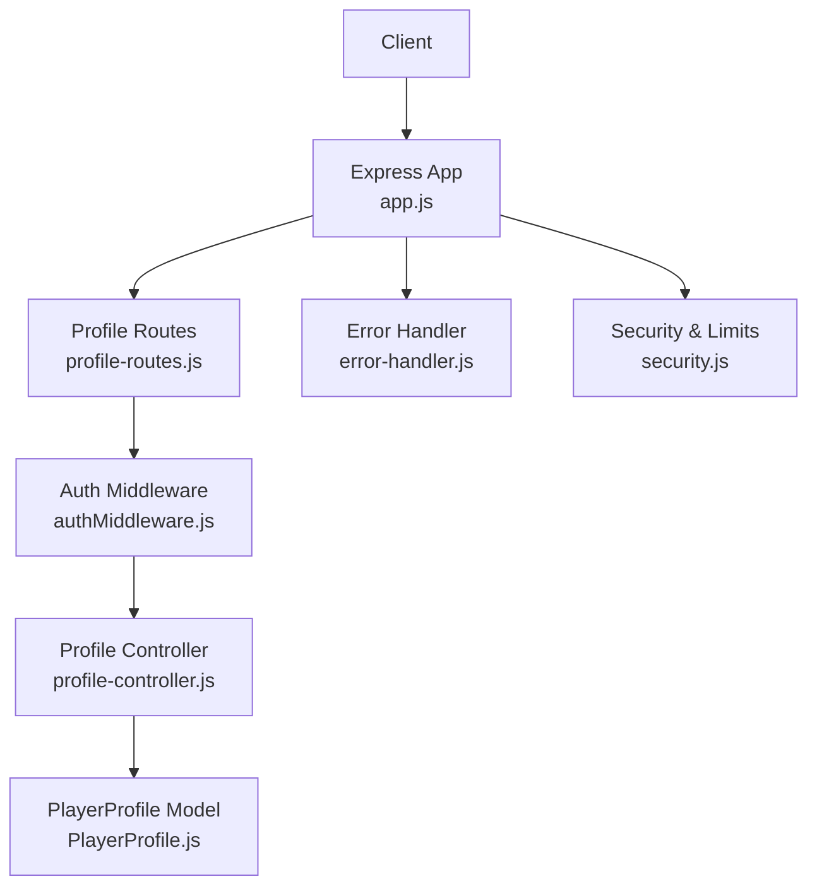
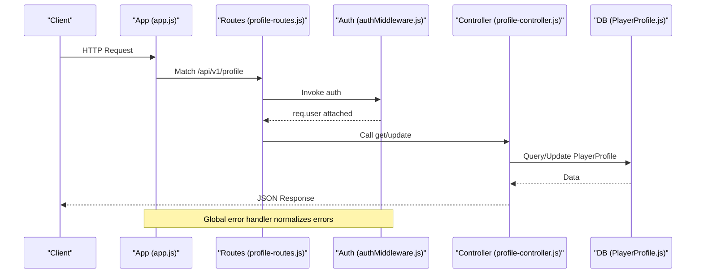
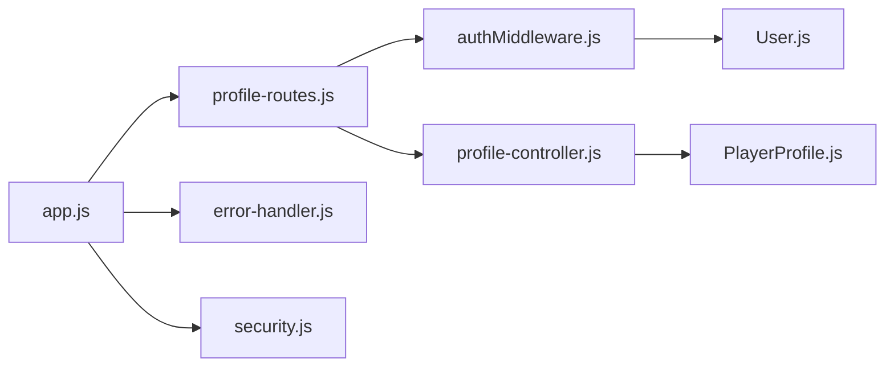

# Profile Management API

<cite>
**Referenced Files in This Document**
- [profile-controller.js](file://backend/controllers/profile-controller.js)
- [profile-routes.js](file://backend/routes/profile-routes.js)
- [PlayerProfile.js](file://backend/models/PlayerProfile.js)
- [User.js](file://backend/models/User.js)
- [authMiddleware.js](file://backend/middleware/authMiddleware.js)
- [validate.js](file://backend/middleware/validate.js)
- [app.js](file://backend/app.js)
- [error-handler.js](file://backend/middleware/error-handler.js)
- [security.js](file://backend/middleware/security.js)
- [env.js](file://backend/config/env.js)
</cite>

## Table of Contents
1. [Introduction](#introduction)
2. [Project Structure](#project-structure)
3. [Core Components](#core-components)
4. [Architecture Overview](#architecture-overview)
5. [Detailed Component Analysis](#detailed-component-analysis)
6. [Dependency Analysis](#dependency-analysis)
7. [Performance Considerations](#performance-considerations)
8. [Troubleshooting Guide](#troubleshooting-guide)
9. [Conclusion](#conclusion)

## Introduction
This document provides comprehensive API documentation for user profile management endpoints. It covers retrieving and updating a player’s profile, managing preferences, handling avatar references, and the security and validation mechanisms that protect these operations. The goal is to enable clients to implement profile creation (via update), updates, and retrieval with confidence, while understanding data privacy measures and error responses.

## Project Structure
The profile feature is implemented as a small, focused Express route set backed by a controller and a Sequelize model:
- Routes define HTTP endpoints under /api/v1/profile and attach authentication middleware.
- Controller methods handle GET and PATCH requests to read or update profile data.
- The PlayerProfile model defines the persistent schema for profile fields including preferences stored as JSONB.
- Authentication middleware validates tokens and attaches the authenticated user context.
- Global middleware enforces input safety, CORS, rate limiting, and standardized error formatting.

**Diagram sources**
- [app.js:34-49](file://backend/app.js#L34-L49)
- [profile-routes.js:1-9](file://backend/routes/profile-routes.js#L1-L9)
- [authMiddleware.js:1-38](file://backend/middleware/authMiddleware.js#L1-L38)
- [profile-controller.js:1-36](file://backend/controllers/profile-controller.js#L1-L36)
- [PlayerProfile.js:1-13](file://backend/models/PlayerProfile.js#L1-L13)
- [error-handler.js:1-52](file://backend/middleware/error-handler.js#L1-L52)
- [security.js:1-47](file://backend/middleware/security.js#L1-L47)

**Section sources**
- [app.js:34-49](file://backend/app.js#L34-L49)
- [profile-routes.js:1-9](file://backend/routes/profile-routes.js#L1-L9)

## Core Components
- Profile routes: Expose GET and PATCH on /api/v1/profile, protected by authentication.
- Profile controller: Implements retrieval and partial updates; merges preference objects safely.
- PlayerProfile model: Stores userId, fullName, avatarUrl, bio, and preferences (JSONB).
- Authentication middleware: Validates JWT from cookie or Authorization header, checks token version, and attaches user to request.
- Error handling: Normalizes errors into consistent JSON responses with codes and messages.
- Security middleware: Rejects unsafe input patterns, applies JSON size limits, and rate-limits write-heavy routes.

Key responsibilities:
- GET /api/v1/profile: Returns current user’s profile data, including username, fullName, avatarUrl, bio, and preferences.
- PATCH /api/v1/profile: Partially updates profile fields; preferences are merged rather than replaced.

**Section sources**
- [profile-routes.js:1-9](file://backend/routes/profile-routes.js#L1-L9)
- [profile-controller.js:5-34](file://backend/controllers/profile-controller.js#L5-L34)
- [PlayerProfile.js:4-11](file://backend/models/PlayerProfile.js#L4-L11)
- [authMiddleware.js:6-35](file://backend/middleware/authMiddleware.js#L6-L35)
- [error-handler.js:15-49](file://backend/middleware/error-handler.js#L15-L49)
- [security.js:10-29](file://backend/middleware/security.js#L10-L29)

## Architecture Overview
The profile endpoints follow a standard Express pipeline:
- Request arrives at app-level middleware (CORS, helmet, JSON parsing, security).
- Route matches /api/v1/profile and invokes auth middleware to validate identity.
- Controller reads or writes PlayerProfile via Sequelize.
- Errors are caught and normalized by the global error handler.

**Diagram sources**
- [app.js:34-49](file://backend/app.js#L34-L49)
- [profile-routes.js:1-9](file://backend/routes/profile-routes.js#L1-L9)
- [authMiddleware.js:6-35](file://backend/middleware/authMiddleware.js#L6-L35)
- [profile-controller.js:5-34](file://backend/controllers/profile-controller.js#L5-L34)
- [PlayerProfile.js:4-11](file://backend/models/PlayerProfile.js#L4-L11)
- [error-handler.js:15-49](file://backend/middleware/error-handler.js#L15-L49)

## Detailed Component Analysis

### Endpoints

#### Get Profile
- Method: GET
- Path: /api/v1/profile
- Authentication: Required (JWT)
- Description: Retrieves the authenticated user’s profile, including username, fullName, avatarUrl, bio, and preferences.
- Success response: JSON object containing a data field with profile details.
- Not found behavior: If no profile exists for the user, returns a 404 with an appropriate code and message.

Example success response shape:
{
  "data": {
    "userId": "<uuid>",
    "username": "<string>",
    "fullName": "<string|null>",
    "avatarUrl": "<string|null>",
    "bio": "<text|null>",
    "preferences": {}
  }
}

**Section sources**
- [profile-routes.js:6-7](file://backend/routes/profile-routes.js#L6-L7)
- [profile-controller.js:5-18](file://backend/controllers/profile-controller.js#L5-L18)
- [authMiddleware.js:6-35](file://backend/middleware/authMiddleware.js#L6-L35)

#### Update Profile
- Method: PATCH
- Path: /api/v1/profile
- Authentication: Required (JWT)
- Description: Partially updates profile fields. Only provided fields are updated. Preferences are merged with existing values.
- Supported fields:
  - fullName: string (optional)
  - avatarUrl: string (optional)
  - bio: text (optional)
  - preferences: object (optional; merged with existing preferences)
- Behavior:
  - Creates a profile if one does not exist for the user, initializing preferences to an empty object.
  - Updates only the fields present in the request body.
  - Merges new preferences into existing ones rather than replacing them entirely.

Example request body (partial):
{
  "fullName": "Jane Doe",
  "bio": "Game enthusiast",
  "preferences": {
    "theme": "dark",
    "notifications": true
  }
}

Success response:
{
  "data": { ... persisted profile fields ... }
}

**Section sources**
- [profile-routes.js:6-7](file://backend/routes/profile-routes.js#L6-L7)
- [profile-controller.js:20-34](file://backend/controllers/profile-controller.js#L20-L34)
- [PlayerProfile.js:4-11](file://backend/models/PlayerProfile.js#L4-L11)

### User Preference Management
- Storage: preferences stored as JSONB in PlayerProfile.
- Merge semantics: PATCH merges incoming preferences with existing preferences, preserving keys not overridden by the request.
- Validation: No explicit schema validation is applied to profile updates; general input safety is enforced globally.

Best practices:
- Send only the preference keys you intend to change to avoid unintended overrides.
- Treat preferences as a free-form configuration map; structure your keys consistently.

**Section sources**
- [profile-controller.js:20-34](file://backend/controllers/profile-controller.js#L20-L34)
- [PlayerProfile.js:10](file://backend/models/PlayerProfile.js#L10)

### Avatar Handling
- Field: avatarUrl stores a URL reference to the avatar image.
- Upload mechanism: There is no dedicated avatar upload endpoint in this module. Clients should store images externally and provide the resulting URL via PATCH.
- Validation: No server-side format validation for avatarUrl beyond general input safety checks.

Recommendations:
- Ensure URLs are HTTPS and point to accessible resources.
- Validate image dimensions and sizes on the client side before sending.

**Section sources**
- [PlayerProfile.js:8](file://backend/models/PlayerProfile.js#L8)
- [profile-controller.js:20-34](file://backend/controllers/profile-controller.js#L20-L34)
- [security.js:10-18](file://backend/middleware/security.js#L10-L18)

### Personalization Settings
- Stored in preferences as a JSONB object.
- Use PATCH to add, remove, or update personalization keys such as theme, language, notification toggles, etc.
- Because preferences are merged, you can incrementally build a settings object across multiple calls.

Example personalization update:
{
  "preferences": {
    "language": "en",
    "highContrast": true
  }
}

**Section sources**
- [profile-controller.js:20-34](file://backend/controllers/profile-controller.js#L20-L34)
- [PlayerProfile.js:10](file://backend/models/PlayerProfile.js#L10)

### Privacy and Sharing
- Current implementation: No public sharing or visibility controls are exposed through profile endpoints. Profiles are private to the authenticated user.
- To share profile information, clients must implement their own sharing logic using separate endpoints or services outside of this module.

Note: Any future sharing features would require additional endpoints and authorization checks not present in the current codebase.

**Section sources**
- [profile-routes.js:1-9](file://backend/routes/profile-routes.js#L1-L9)
- [profile-controller.js:5-34](file://backend/controllers/profile-controller.js#L5-L34)

### Profile Statistics
- Current implementation: No profile statistics endpoint is defined in this module.
- For analytics, consider using the analytics routes mounted under /api/v1/analytics in the application.

**Section sources**
- [app.js:34-49](file://backend/app.js#L34-L49)

### Validation Rules
- Input safety: Global middleware rejects payloads containing potentially unsafe characters or patterns (e.g., keys starting with $ or containing dots).
- JSON size limit: Requests are limited to a small payload size to prevent abuse.
- Schema validation: Profile endpoints do not use explicit Joi schemas; rely on safe defaults and merge behavior.

Operational notes:
- If you need stricter validation for profile fields, introduce a validation schema and apply it via the validate middleware.

**Section sources**
- [security.js:10-29](file://backend/middleware/security.js#L10-L29)
- [validate.js:1-13](file://backend/middleware/validate.js#L1-L13)

### Authentication and Session Security
- Token source: Accepts JWT from either the Authorization header (Bearer) or a cookie named accessToken.
- Verification: Verifies token signature and checks tokenVersion against the stored value to invalidate stale sessions.
- User context: Attaches the authenticated user (including id and username) to req.user for downstream controllers.

**Section sources**
- [authMiddleware.js:6-35](file://backend/middleware/authMiddleware.js#L6-L35)
- [User.js:5-16](file://backend/models/User.js#L5-L16)

### Data Privacy Measures
- Sensitive fields: passwordHash and tokenVersion are excluded from default user queries to reduce exposure.
- Logging: Authorization headers and cookies are redacted in logs.
- CORS: Configured to allow specific origins; unauthorized origins are rejected.
- CSRF protection: Not enabled by default; ensure proper cross-site protections at the client or reverse proxy layer if needed.

**Section sources**
- [User.js:13-16](file://backend/models/User.js#L13-L16)
- [app.js:18-32](file://backend/app.js#L18-L32)
- [env.js:6-39](file://backend/config/env.js#L6-L39)

## Dependency Analysis
The profile feature depends on several core modules:

**Diagram sources**
- [profile-routes.js:1-9](file://backend/routes/profile-routes.js#L1-L9)
- [profile-controller.js:1-36](file://backend/controllers/profile-controller.js#L1-L36)
- [PlayerProfile.js:1-13](file://backend/models/PlayerProfile.js#L1-L13)
- [authMiddleware.js:1-38](file://backend/middleware/authMiddleware.js#L1-L38)
- [User.js:1-23](file://backend/models/User.js#L1-L23)
- [app.js:34-49](file://backend/app.js#L34-L49)
- [error-handler.js:1-52](file://backend/middleware/error-handler.js#L1-L52)
- [security.js:1-47](file://backend/middleware/security.js#L1-L47)

**Section sources**
- [profile-routes.js:1-9](file://backend/routes/profile-routes.js#L1-L9)
- [profile-controller.js:1-36](file://backend/controllers/profile-controller.js#L1-L36)
- [authMiddleware.js:1-38](file://backend/middleware/authMiddleware.js#L1-L38)
- [PlayerProfile.js:1-13](file://backend/models/PlayerProfile.js#L1-L13)
- [User.js:1-23](file://backend/models/User.js#L1-L23)
- [app.js:34-49](file://backend/app.js#L34-L49)
- [error-handler.js:1-52](file://backend/middleware/error-handler.js#L1-L52)
- [security.js:1-47](file://backend/middleware/security.js#L1-L47)

## Performance Considerations
- Minimal DB queries: Each operation performs a single query (find or findOrCreate) plus a save.
- Preferences merging: Performed in memory; keep preference payloads small to avoid large JSONB updates.
- Rate limiting: Write-heavy routes benefit from rate limiting; consider applying similar limits to profile updates if usage grows.
- JSON size limits: Enforced globally to mitigate oversized payloads.

[No sources needed since this section provides general guidance]

## Troubleshooting Guide
Common issues and resolutions:
- 401 Unauthorized: Missing or invalid JWT; ensure the token is present in the Authorization header or cookie and has not expired.
- 404 Profile not found: No profile exists for the user; call PATCH to create one first.
- 400 Validation error: Input contains unsafe patterns or exceeds limits; sanitize and reduce payload size.
- 5xx Internal error: Unexpected server error; check logs for stack traces and requestId correlation.

Error response shape:
{
  "error": {
    "code": "<error_code>",
    "message": "<human-readable message>",
    "requestId": "<unique request id>"
  }
}

Debugging tips:
- Use the X-Request-Id header to correlate logs across services.
- In development, detailed error messages may be included in responses for 5xx errors.

**Section sources**
- [authMiddleware.js:6-35](file://backend/middleware/authMiddleware.js#L6-L35)
- [profile-controller.js:5-18](file://backend/controllers/profile-controller.js#L5-L18)
- [security.js:10-29](file://backend/middleware/security.js#L10-L29)
- [error-handler.js:15-49](file://backend/middleware/error-handler.js#L15-L49)

## Conclusion
The Profile Management API provides secure, minimal endpoints to retrieve and update user profiles, manage preferences, and maintain personalization settings. While there is no built-in avatar upload or profile sharing functionality, clients can integrate external storage and custom sharing flows. Robust authentication, input safety, and standardized error handling ensure reliable and secure interactions. For advanced needs like profile statistics or granular privacy controls, extend the API with additional endpoints following the established patterns.