# Achievement System

<cite>
**Referenced Files in This Document**
- [PlayerProgress.js](file://backend/models/PlayerProgress.js)
- [PlayerSkill.js](file://backend/models/PlayerSkill.js)
- [GameSession.js](file://backend/models/GameSession.js)
- [Scenario.js](file://backend/models/Scenario.js)
- [progress-controller.js](file://backend/controllers/progress-controller.js)
- [score-controller.js](file://backend/controllers/score-controller.js)
- [game-controller.js](file://backend/controllers/game-controller.js)
- [game-engine.js](file://backend/services/game-engine.js)
- [progress-routes.js](file://backend/routes/progress-routes.js)
- [score-routes.js](file://backend/routes/score-routes.js)
- [game-routes.js](file://backend/routes/game-routes.js)
- [game-schemas.js](file://backend/validators/game-schemas.js)
- [session-scoring.js](file://backend/public/js/session-scoring.js)
- [rewards.js](file://backend/public/js/rewards.js)
</cite>

## Table of Contents
1. [Introduction](#introduction)
2. [Project Structure](#project-structure)
3. [Core Components](#core-components)
4. [Architecture Overview](#architecture-overview)
5. [Detailed Component Analysis](#detailed-component-analysis)
6. [Dependency Analysis](#dependency-analysis)
7. [Performance Considerations](#performance-considerations)
8. [Troubleshooting Guide](#troubleshooting-guide)
9. [Conclusion](#conclusion)
10. [Appendices](#appendices)

## Introduction
This document explains the achievement system and progress tracking for the game. It covers the PlayerProgress model, achievement types and completion criteria, endpoints for submitting progress and retrieving status, XP calculation algorithms, milestone tracking, and achievement notification mechanisms. It also includes examples of progress submission workflows, achievement unlock events, and performance analytics data structures.

## Project Structure
The achievement system spans models, controllers, routes, validators, services, and frontend modules:
- Models define persistent entities for progress, skills, sessions, and scenarios.
- Controllers implement business logic for progress submission, scoring summaries, and gameplay state transitions.
- Routes expose authenticated endpoints with request validation.
- The game engine computes metrics and orchestrates session lifecycle and AI-assisted chat.
- Frontend modules compute engagement tiers, scale XP, and render celebration UI.

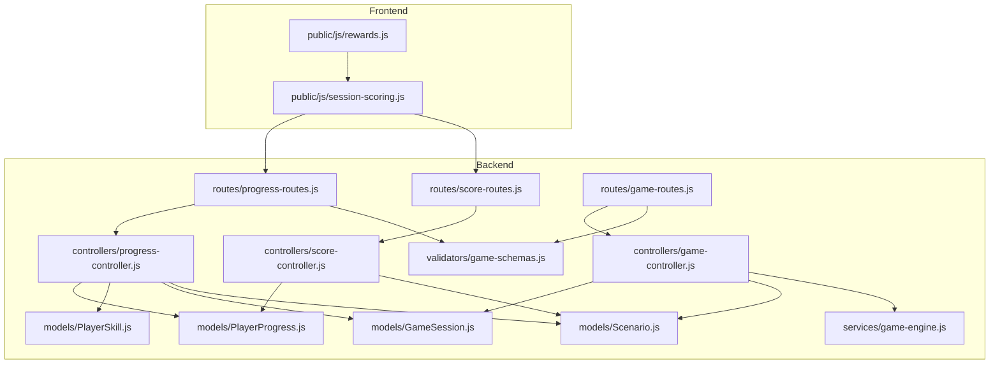

**Diagram sources**
- [progress-routes.js:1-12](file://backend/routes/progress-routes.js#L1-L12)
- [score-routes.js:1-9](file://backend/routes/score-routes.js#L1-L9)
- [game-routes.js:1-15](file://backend/routes/game-routes.js#L1-L15)
- [progress-controller.js:1-79](file://backend/controllers/progress-controller.js#L1-L79)
- [score-controller.js:1-24](file://backend/controllers/score-controller.js#L1-L24)
- [game-controller.js:1-128](file://backend/controllers/game-controller.js#L1-L128)
- [game-engine.js:1-124](file://backend/services/game-engine.js#L1-L124)
- [PlayerProgress.js:1-17](file://backend/models/PlayerProgress.js#L1-L17)
- [PlayerSkill.js:1-15](file://backend/models/PlayerSkill.js#L1-L15)
- [GameSession.js:1-15](file://backend/models/GameSession.js#L1-L15)
- [Scenario.js:1-18](file://backend/models/Scenario.js#L1-L18)
- [game-schemas.js:1-27](file://backend/validators/game-schemas.js#L1-L27)
- [session-scoring.js:1-221](file://backend/public/js/session-scoring.js#L1-L221)
- [rewards.js:1-66](file://backend/public/js/rewards.js#L1-L66)

**Section sources**
- [progress-routes.js:1-12](file://backend/routes/progress-routes.js#L1-L12)
- [score-routes.js:1-9](file://backend/routes/score-routes.js#L1-L9)
- [game-routes.js:1-15](file://backend/routes/game-routes.js#L1-L15)
- [progress-controller.js:1-79](file://backend/controllers/progress-controller.js#L1-L79)
- [score-controller.js:1-24](file://backend/controllers/score-controller.js#L1-L24)
- [game-controller.js:1-128](file://backend/controllers/game-controller.js#L1-L128)
- [game-engine.js:1-124](file://backend/services/game-engine.js#L1-L124)
- [PlayerProgress.js:1-17](file://backend/models/PlayerProgress.js#L1-L17)
- [PlayerSkill.js:1-15](file://backend/models/PlayerSkill.js#L1-L15)
- [GameSession.js:1-15](file://backend/models/GameSession.js#L1-L15)
- [Scenario.js:1-18](file://backend/models/Scenario.js#L1-L18)
- [game-schemas.js:1-27](file://backend/validators/game-schemas.js#L1-L27)
- [session-scoring.js:1-221](file://backend/public/js/session-scoring.js#L1-L221)
- [rewards.js:1-66](file://backend/public/js/rewards.js#L1-L66)

## Core Components
- PlayerProgress: Tracks per-scenario completion status, best stars, attempts, and last evidence payload including score and selected option.
- PlayerSkill: Per-user skill indicators and levels derived from completed scenarios.
- GameSession: Active session state, history, completion timestamp, and expiration.
- Scenario: Published content defining options, clues, difficulty, and skill tags.
- Progress Controller: Validates submissions, enforces completion rules, calculates stars and scores, updates progress and skills.
- Score Controller: Aggregates mission counts, total stars/scores, perfect runs, and win-ready status.
- Game Engine: Computes player metrics (accuracy, mastery, streaks), manages session lifecycle, and integrates AI chat context.
- Frontend Scoring: Determines engagement tier and scales XP; renders celebrations and learning recaps.

**Section sources**
- [PlayerProgress.js:1-17](file://backend/models/PlayerProgress.js#L1-L17)
- [PlayerSkill.js:1-15](file://backend/models/PlayerSkill.js#L1-L15)
- [GameSession.js:1-15](file://backend/models/GameSession.js#L1-L15)
- [Scenario.js:1-18](file://backend/models/Scenario.js#L1-L18)
- [progress-controller.js:1-79](file://backend/controllers/progress-controller.js#L1-L79)
- [score-controller.js:1-24](file://backend/controllers/score-controller.js#L1-L24)
- [game-engine.js:1-124](file://backend/services/game-engine.js#L1-L124)
- [session-scoring.js:1-221](file://backend/public/js/session-scoring.js#L1-L221)

## Architecture Overview
The achievement system is a layered flow:
- Client initiates a scenario via game routes, collects clues, chooses an option, and completes the session.
- After completion, the client submits progress to the progress endpoint with session and scenario identifiers.
- The server validates the session, computes stars and score, persists progress, and updates skill indicators.
- Clients can retrieve progress lists and overall summary metrics.
- Frontend computes engagement tier and displays rewards and XP bursts.

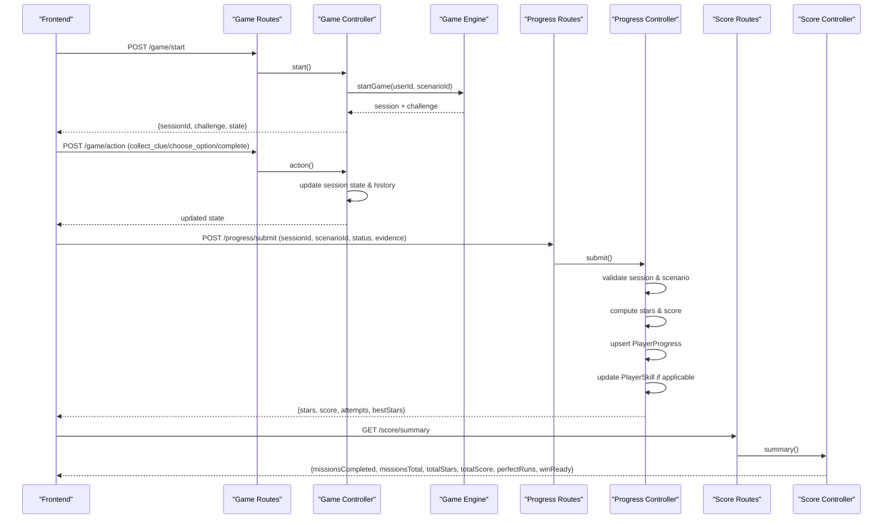

**Diagram sources**
- [game-routes.js:1-15](file://backend/routes/game-routes.js#L1-L15)
- [game-controller.js:1-128](file://backend/controllers/game-controller.js#L1-L128)
- [game-engine.js:1-124](file://backend/services/game-engine.js#L1-L124)
- [progress-routes.js:1-12](file://backend/routes/progress-routes.js#L1-L12)
- [progress-controller.js:1-79](file://backend/controllers/progress-controller.js#L1-L79)
- [score-routes.js:1-9](file://backend/routes/score-routes.js#L1-L9)
- [score-controller.js:1-24](file://backend/controllers/score-controller.js#L1-L24)

## Detailed Component Analysis

### PlayerProgress Model
- Fields: unique id, userId, scenarioId, status enum (started/completed/failed), bestStars, attempts, lastEvidence JSONB.
- Unique index on (userId, scenarioId) ensures one progress record per user per scenario.
- Used by progress controller to persist outcomes and by score controller for summaries.

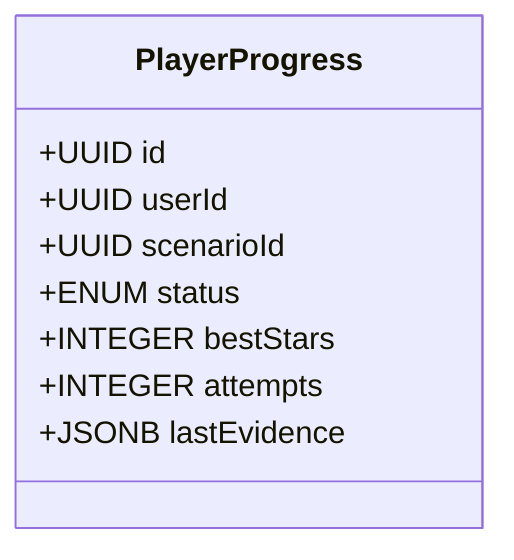

**Diagram sources**
- [PlayerProgress.js:1-17](file://backend/models/PlayerProgress.js#L1-L17)

**Section sources**
- [PlayerProgress.js:1-17](file://backend/models/PlayerProgress.js#L1-L17)

### PlayerSkill Model
- Fields: unique id, userId, skill string, level integer, indicator integer.
- Updated when a scenario with a skill tag is completed; indicator increases based on stars earned.

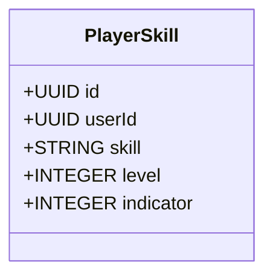

**Diagram sources**
- [PlayerSkill.js:1-15](file://backend/models/PlayerSkill.js#L1-L15)

**Section sources**
- [PlayerSkill.js:1-15](file://backend/models/PlayerSkill.js#L1-L15)

### GameSession Model
- Fields: unique id, userId, scenarioId, state JSONB, history JSONB, completedAt date, expiresAt date.
- Enforced by game controller actions and progress submission validation.

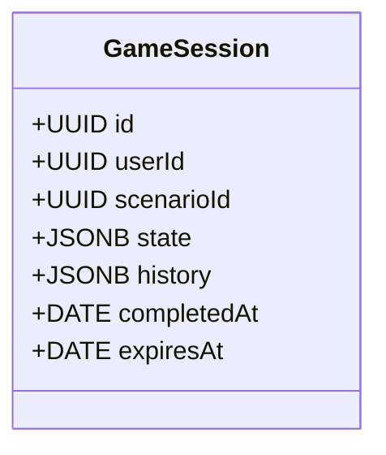

**Diagram sources**
- [GameSession.js:1-15](file://backend/models/GameSession.js#L1-L15)

**Section sources**
- [GameSession.js:1-15](file://backend/models/GameSession.js#L1-L15)

### Scenario Model
- Fields: unique slug, title, summary, ageGroup, difficulty, content JSONB, skillTags array, isPublished boolean, version integer.
- Drives available options, clues, and skill tagging used in progression and skill updates.

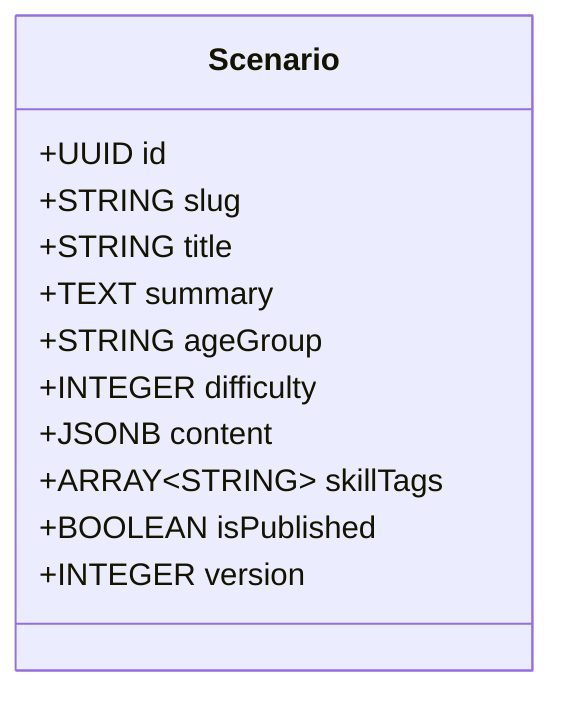

**Diagram sources**
- [Scenario.js:1-18](file://backend/models/Scenario.js#L1-L18)

**Section sources**
- [Scenario.js:1-18](file://backend/models/Scenario.js#L1-L18)

### Progress Submission Workflow
- Endpoint: POST /progress/submit with validated fields.
- Server checks scenario published status and active session; prevents premature completion.
- Computes awarded stars and safe score from session state or scenario option defaults.
- Upserts PlayerProgress, increments attempts, merges evidence, and updates PlayerSkill if applicable.

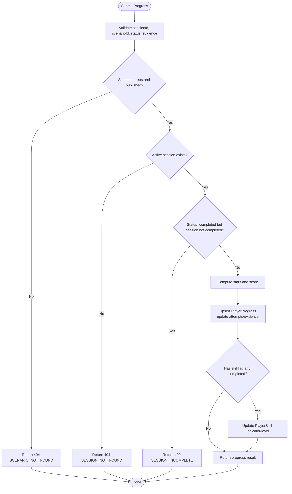

**Diagram sources**
- [progress-routes.js:1-12](file://backend/routes/progress-routes.js#L1-L12)
- [progress-controller.js:1-79](file://backend/controllers/progress-controller.js#L1-L79)
- [game-schemas.js:1-27](file://backend/validators/game-schemas.js#L1-L27)

**Section sources**
- [progress-routes.js:1-12](file://backend/routes/progress-routes.js#L1-L12)
- [progress-controller.js:1-79](file://backend/controllers/progress-controller.js#L1-L79)
- [game-schemas.js:1-27](file://backend/validators/game-schemas.js#L1-L27)

### XP Calculation Algorithms
- Session scoring determines engagement tier based on message patterns and puzzle interactions.
- Tier multipliers scale base XP to produce final XP values.
- Minimum XP floor ensures meaningful gains.

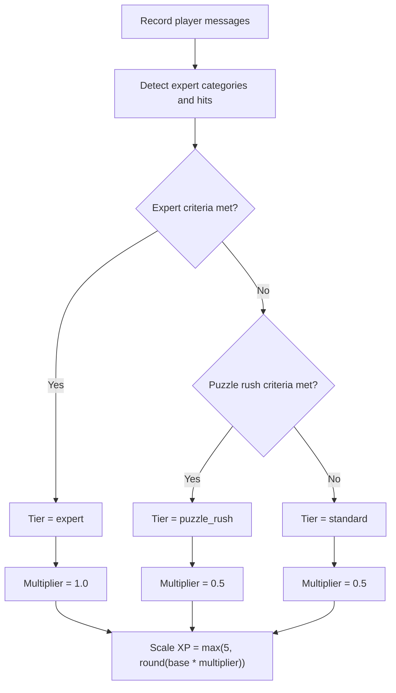

**Diagram sources**
- [session-scoring.js:1-221](file://backend/public/js/session-scoring.js#L1-L221)

**Section sources**
- [session-scoring.js:1-221](file://backend/public/js/session-scoring.js#L1-L221)

### Milestone Tracking Systems
- Best stars per scenario track optimal performance.
- Attempts count cumulative tries.
- Skill indicators increase with completed scenarios weighted by stars.
- Summary aggregates missions completed vs total published, total stars/scores, perfect runs, and win-ready flag.

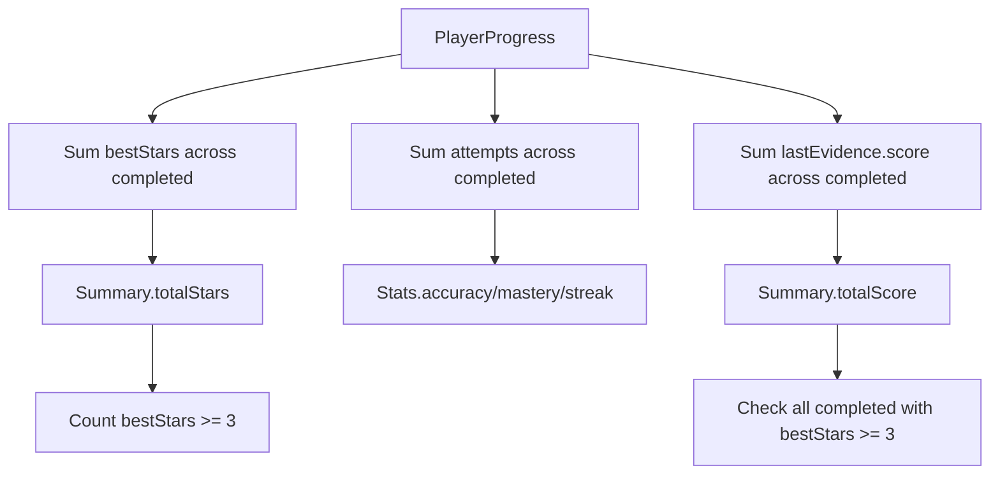

**Diagram sources**
- [score-controller.js:1-24](file://backend/controllers/score-controller.js#L1-L24)
- [progress-controller.js:1-79](file://backend/controllers/progress-controller.js#L1-L79)
- [game-engine.js:1-124](file://backend/services/game-engine.js#L1-L124)

**Section sources**
- [score-controller.js:1-24](file://backend/controllers/score-controller.js#L1-L24)
- [progress-controller.js:1-79](file://backend/controllers/progress-controller.js#L1-L79)
- [game-engine.js:1-124](file://backend/services/game-engine.js#L1-L124)

### Achievement Notification Mechanisms
- Frontend emits XP burst events and shows celebration overlays.
- Rewards module triggers confetti and modal feedback for level complete and perfect runs.

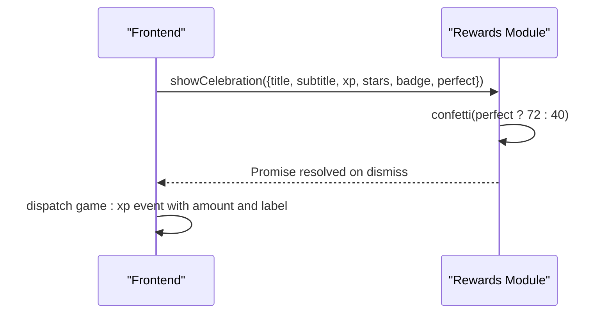

**Diagram sources**
- [rewards.js:1-66](file://backend/public/js/rewards.js#L1-L66)
- [session-scoring.js:1-221](file://backend/public/js/session-scoring.js#L1-L221)

**Section sources**
- [rewards.js:1-66](file://backend/public/js/rewards.js#L1-L66)
- [session-scoring.js:1-221](file://backend/public/js/session-scoring.js#L1-L221)

### API Endpoints
- Progress
  - GET /progress: List current user’s progress records.
  - POST /progress/submit: Submit scenario completion with session and evidence.
- Score
  - GET /score/summary: Retrieve aggregated progress and achievement metrics.
- Game
  - GET /game/challenges: List published scenarios.
  - POST /game/start: Start a new session for a scenario.
  - GET /game/state: Get current session state and revealed clues.
  - POST /game/action: Perform collect_clue, choose_option, or complete actions.
  - POST /game/chat: Chat with AI assistant within a session.

Validation schemas enforce required fields and allowed values for these endpoints.

**Section sources**
- [progress-routes.js:1-12](file://backend/routes/progress-routes.js#L1-L12)
- [score-routes.js:1-9](file://backend/routes/score-routes.js#L1-L9)
- [game-routes.js:1-15](file://backend/routes/game-routes.js#L1-L15)
- [game-schemas.js:1-27](file://backend/validators/game-schemas.js#L1-L27)

## Dependency Analysis
- Controllers depend on models for persistence and on services for advanced logic.
- Routes depend on middleware for authentication and validation.
- Frontend depends on backend APIs and internal modules for XP scaling and celebrations.

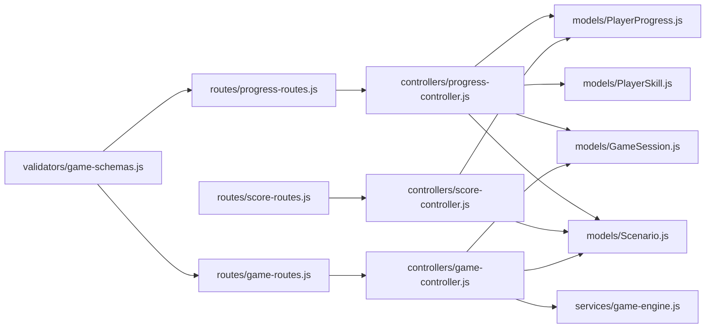

**Diagram sources**
- [game-schemas.js:1-27](file://backend/validators/game-schemas.js#L1-L27)
- [progress-routes.js:1-12](file://backend/routes/progress-routes.js#L1-L12)
- [score-routes.js:1-9](file://backend/routes/score-routes.js#L1-L9)
- [game-routes.js:1-15](file://backend/routes/game-routes.js#L1-L15)
- [progress-controller.js:1-79](file://backend/controllers/progress-controller.js#L1-L79)
- [score-controller.js:1-24](file://backend/controllers/score-controller.js#L1-L24)
- [game-controller.js:1-128](file://backend/controllers/game-controller.js#L1-L128)
- [game-engine.js:1-124](file://backend/services/game-engine.js#L1-L124)
- [PlayerProgress.js:1-17](file://backend/models/PlayerProgress.js#L1-L17)
- [PlayerSkill.js:1-15](file://backend/models/PlayerSkill.js#L1-L15)
- [GameSession.js:1-15](file://backend/models/GameSession.js#L1-L15)
- [Scenario.js:1-18](file://backend/models/Scenario.js#L1-L18)

**Section sources**
- [game-schemas.js:1-27](file://backend/validators/game-schemas.js#L1-L27)
- [progress-routes.js:1-12](file://backend/routes/progress-routes.js#L1-L12)
- [score-routes.js:1-9](file://backend/routes/score-routes.js#L1-L9)
- [game-routes.js:1-15](file://backend/routes/game-routes.js#L1-L15)
- [progress-controller.js:1-79](file://backend/controllers/progress-controller.js#L1-L79)
- [score-controller.js:1-24](file://backend/controllers/score-controller.js#L1-L24)
- [game-controller.js:1-128](file://backend/controllers/game-controller.js#L1-L128)
- [game-engine.js:1-124](file://backend/services/game-engine.js#L1-L124)
- [PlayerProgress.js:1-17](file://backend/models/PlayerProgress.js#L1-L17)
- [PlayerSkill.js:1-15](file://backend/models/PlayerSkill.js#L1-L15)
- [GameSession.js:1-15](file://backend/models/GameSession.js#L1-L15)
- [Scenario.js:1-18](file://backend/models/Scenario.js#L1-L18)

## Performance Considerations
- Use unique indexes on (userId, scenarioId) and (userId, skill) to avoid duplicates and speed lookups.
- Clamp stars and scores to safe ranges to prevent overflow and ensure consistent calculations.
- Batch queries where possible; current design uses targeted findOne/findOrCreate operations which are efficient for per-user/per-scenario contexts.
- Keep session state minimal; store only necessary fields in JSONB to reduce storage and query overhead.
- Frontend XP scaling is O(n) over messages and checks; consider debouncing heavy computations if message volume grows significantly.

[No sources needed since this section provides general guidance]

## Troubleshooting Guide
Common errors and resolutions:
- SCENARIO_NOT_FOUND: Ensure scenario exists and is published before submitting progress.
- SESSION_NOT_FOUND: Verify sessionId belongs to the current user and matches the scenario.
- SESSION_INCOMPLETE: Complete the mission in-game (set completedAt) before submitting status=completed.
- ALREADY_DECIDED / CLUES_REQUIRED / DECISION_REQUIRED: Follow the correct order of collecting clues, choosing an option, and completing the session.

Error handling is centralized through an application error utility and enforced by controllers.

**Section sources**
- [progress-controller.js:1-79](file://backend/controllers/progress-controller.js#L1-L79)
- [game-controller.js:1-128](file://backend/controllers/game-controller.js#L1-L128)

## Conclusion
The achievement system combines robust backend validation, clear progress modeling, and engaging frontend feedback. Progress submission enforces game integrity, while XP scaling and milestone tracking provide meaningful progression. The API surface supports comprehensive analytics and user-facing achievements.

[No sources needed since this section summarizes without analyzing specific files]

## Appendices

### Example Workflows
- Progress submission workflow:
  - Start a game session and perform actions to collect clues and choose an option.
  - Complete the session in-game to set completion timestamp.
  - Submit progress with sessionId, scenarioId, status=completed, and optional evidence.
  - Receive response with stars, score, attempts, and bestStars.
- Achievement unlock event:
  - Upon successful completion, skill indicator may increase and bestStars updated.
  - Frontend displays celebration overlay and XP burst based on engagement tier.

**Section sources**
- [game-controller.js:1-128](file://backend/controllers/game-controller.js#L1-L128)
- [progress-controller.js:1-79](file://backend/controllers/progress-controller.js#L1-L79)
- [session-scoring.js:1-221](file://backend/public/js/session-scoring.js#L1-L221)
- [rewards.js:1-66](file://backend/public/js/rewards.js#L1-L66)

### Analytics Data Structures
- Progress list: Array of PlayerProgress records for the current user.
- Summary: Object containing missionsCompleted, missionsTotal, totalStars, totalScore, perfectRuns, winReady.
- Player metrics: Accuracy, mistakeRate, topicMastery, challengeStreak computed from progress and skills.

**Section sources**
- [progress-controller.js:1-79](file://backend/controllers/progress-controller.js#L1-L79)
- [score-controller.js:1-24](file://backend/controllers/score-controller.js#L1-L24)
- [game-engine.js:1-124](file://backend/services/game-engine.js#L1-L124)