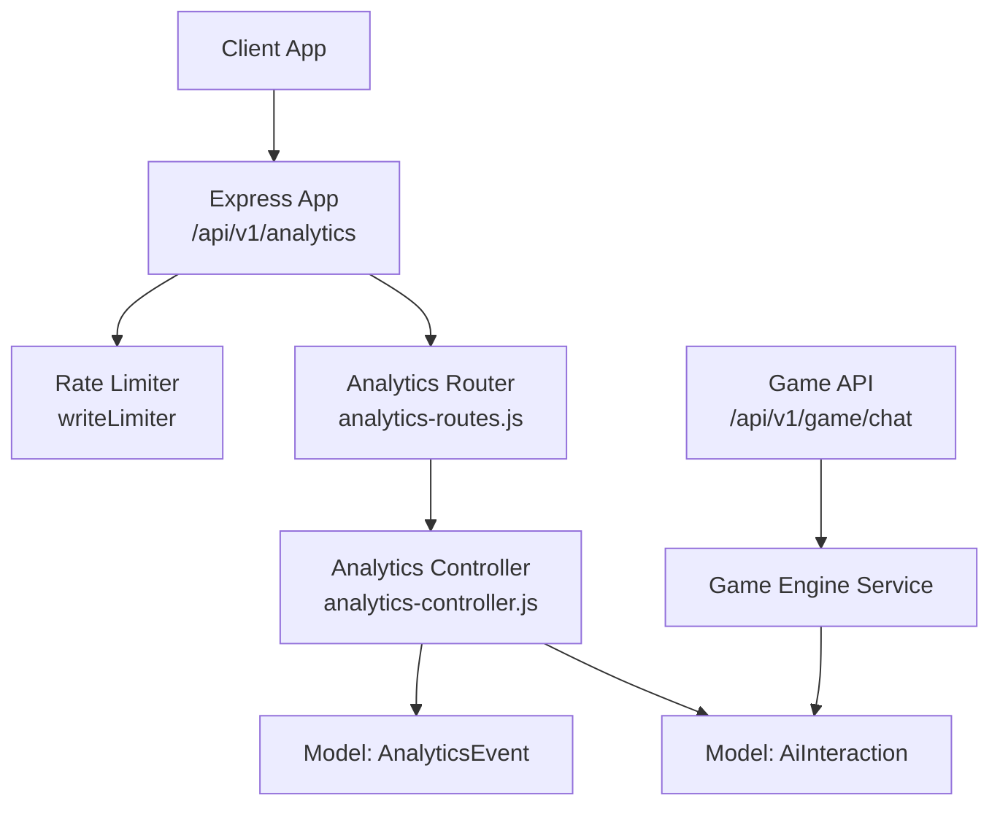
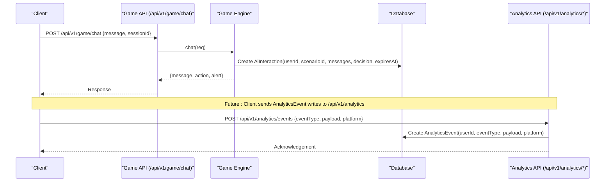
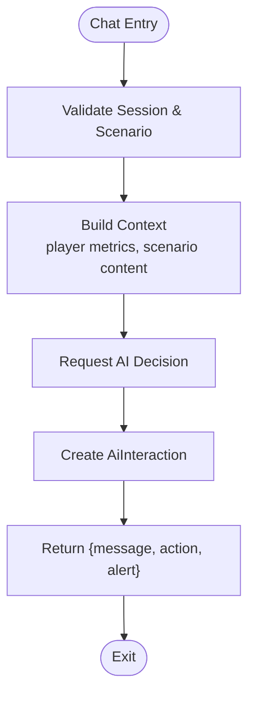
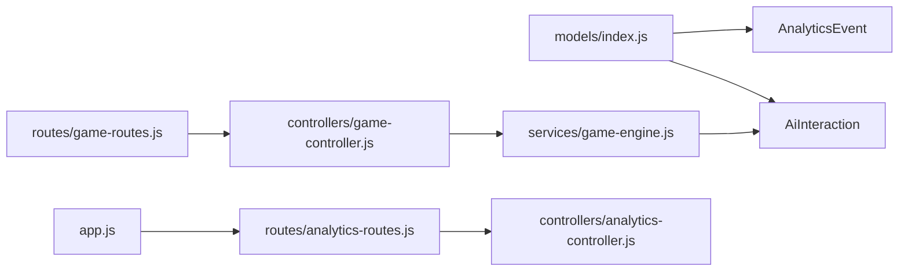

# Analytics & Performance Tracking

<cite>
**Referenced Files in This Document**
- [app.js](file://backend/app.js)
- [security.js](file://backend/middleware/security.js)
- [analytics-routes.js](file://backend/routes/analytics-routes.js)
- [analytics-controller.js](file://backend/controllers/analytics-controller.js)
- [AiInteraction.js](file://backend/models/AiInteraction.js)
- [AnalyticsEvent.js](file://backend/models/AnalyticsEvent.js)
- [index.js](file://backend/models/index.js)
- [game-engine.js](file://backend/services/game-engine.js)
- [game-routes.js](file://backend/routes/game-routes.js)
- [game-controller.js](file://backend/controllers/game-controller.js)
</cite>

## Table of Contents
1. Introduction
2. Project Structure
3. Core Components
4. Architecture Overview
5. Detailed Component Analysis
6. Dependency Analysis
7. Performance Considerations
8. Troubleshooting Guide
9. Conclusion
10. Appendices

## Introduction
This document explains the analytics and performance tracking capabilities implemented in the backend, focusing on:
- Logging AI guidance sessions via the AiInteraction model
- Capturing user behavior events through the AnalyticsEvent model
- Aggregating metrics for performance reporting and engagement analysis
- Defining endpoints and data flows for analytics ingestion and retrieval
- Providing examples of queries, dashboards, and workflows to analyze user engagement

The system is designed to be extensible: while models and core logging are present, analytics routes and controllers can be expanded to support richer reporting and aggregation features.

## Project Structure
The analytics subsystem spans models, services, routes, and middleware:
- Models define structured storage for AI interactions and analytics events
- The game engine service logs AI interactions during gameplay chat flows
- Routes expose an analytics endpoint group under /api/v1/analytics (currently a placeholder)
- Middleware applies rate limiting and request instrumentation to protect and observe analytics writes

**Diagram sources**
- [app.js:48-48](file://backend/app.js#L48-L48)
- [security.js:23-29](file://backend/middleware/security.js#L23-L29)
- [analytics-routes.js:1-4](file://backend/routes/analytics-routes.js#L1-L4)
- [analytics-controller.js:1-2](file://backend/controllers/analytics-controller.js#L1-L2)
- [AiInteraction.js:4-12](file://backend/models/AiInteraction.js#L4-L12)
- [AnalyticsEvent.js:4-10](file://backend/models/AnalyticsEvent.js#L4-L10)
- [game-routes.js:12-12](file://backend/routes/game-routes.js#L12-L12)
- [game-controller.js:118-120](file://backend/controllers/game-controller.js#L118-L120)
- [game-engine.js:66-121](file://backend/services/game-engine.js#L66-L121)

**Section sources**
- [app.js:48-48](file://backend/app.js#L48-L48)
- [security.js:23-29](file://backend/middleware/security.js#L23-L29)
- [analytics-routes.js:1-4](file://backend/routes/analytics-routes.js#L1-L4)
- [analytics-controller.js:1-2](file://backend/controllers/analytics-controller.js#L1-L2)
- [AiInteraction.js:4-12](file://backend/models/AiInteraction.js#L4-L12)
- [AnalyticsEvent.js:4-10](file://backend/models/AnalyticsEvent.js#L4-L10)
- [game-routes.js:12-12](file://backend/routes/game-routes.js#L12-L12)
- [game-controller.js:118-120](file://backend/controllers/game-controller.js#L118-L120)
- [game-engine.js:66-121](file://backend/services/game-engine.js#L66-L121)

## Core Components
- AiInteraction model: Records each AI-guided interaction within a scenario, including user message, assistant response, decision metadata, and expiration time.
- AnalyticsEvent model: Generic event log capturing user behavior with typed events and JSON payloads, optionally tagged by platform.
- Game engine integration: During chat-based gameplay, the engine computes context-aware responses and persists AiInteraction records.
- Analytics route group: Mounted at /api/v1/analytics with write rate limiting; currently a router placeholder ready for controller implementation.

Key responsibilities:
- Persist AI session artifacts for later analysis
- Capture behavioral telemetry for engagement and performance insights
- Provide a foundation for future analytics endpoints (queries, reports, dashboards)

**Section sources**
- [AiInteraction.js:4-12](file://backend/models/AiInteraction.js#L4-L12)
- [AnalyticsEvent.js:4-10](file://backend/models/AnalyticsEvent.js#L4-L10)
- [game-engine.js:66-121](file://backend/services/game-engine.js#L66-L121)
- [analytics-routes.js:1-4](file://backend/routes/analytics-routes.js#L1-L4)

## Architecture Overview
The analytics architecture combines real-time logging with structured storage:
- Gameplay chat triggers AI-driven responses and logs AiInteraction entries
- Future analytics endpoints will accept AnalyticsEvent writes and serve aggregated views
- Rate limiting protects write-heavy analytics endpoints
- Request IDs and structured logging enable traceability across components

**Diagram sources**
- [game-routes.js:12-12](file://backend/routes/game-routes.js#L12-L12)
- [game-controller.js:118-120](file://backend/controllers/game-controller.js#L118-L120)
- [game-engine.js:66-121](file://backend/services/game-engine.js#L66-L121)
- [AiInteraction.js:4-12](file://backend/models/AiInteraction.js#L4-L12)
- [AnalyticsEvent.js:4-10](file://backend/models/AnalyticsEvent.js#L4-L10)
- [app.js:48-48](file://backend/app.js#L48-L48)

## Detailed Component Analysis

### AiInteraction Model
Purpose:
- Log AI guidance sessions per user and scenario
- Store conversation fragments and decisions for post-hoc analysis
- Support lifecycle management via expiration timestamps

Fields:
- id: UUID primary key
- userId: UUID linking to the player
- scenarioId: UUID linking to the challenge/scenario
- playerMessage: Text of the user’s input
- assistantMessage: Text of the AI’s response
- decision: JSONB containing structured decision metadata
- expiresAt: Timestamp for retention or cleanup policies

Usage:
- Created during gameplay chat to capture AI-assisted decisions
- Can be queried to analyze guidance effectiveness, response patterns, and decision outcomes

Complexity considerations:
- Indexing on userId, scenarioId, and expiresAt improves query performance for cohort and retention analyses

**Section sources**
- [AiInteraction.js:4-12](file://backend/models/AiInteraction.js#L4-L12)
- [game-engine.js:107-114](file://backend/services/game-engine.js#L107-L114)

### AnalyticsEvent Model
Purpose:
- Record generic user behavior events with typed categories and rich payloads
- Enable flexible tracking of UI interactions, navigation, feature usage, and performance signals

Fields:
- id: UUID primary key
- userId: Optional UUID for user-scoped events
- eventType: String category (e.g., “screen_view”, “button_click”, “error”)
- payload: JSONB for arbitrary event details
- platform: Optional string indicating client platform

Usage:
- Future analytics endpoints will accept and aggregate these events
- Supports segmentation by eventType, platform, and time windows

Performance notes:
- Payload flexibility requires careful schema validation at ingestion
- Time-bounded queries should leverage indexes on eventType and createdAt (if added)

**Section sources**
- [AnalyticsEvent.js:4-10](file://backend/models/AnalyticsEvent.js#L4-L10)

### Game Engine Integration (AI Interaction Logging)
Flow:
- Client calls /api/v1/game/chat with message and active sessionId
- Game engine validates session and scenario, builds context with player metrics, and requests AI decision
- Engine persists AiInteraction with user message, assistant message, decision, and expiration
- Response includes assistant message, action type, and optional alert

**Diagram sources**
- [game-controller.js:118-120](file://backend/controllers/game-controller.js#L118-L120)
- [game-engine.js:66-121](file://backend/services/game-engine.js#L66-L121)

**Section sources**
- [game-controller.js:118-120](file://backend/controllers/game-controller.js#L118-L120)
- [game-engine.js:66-121](file://backend/services/game-engine.js#L66-L121)

### Analytics Routes and Controller
Current state:
- Route group mounted at /api/v1/analytics with write rate limiting
- Router and controller files exist but are placeholders awaiting implementation

Planned capabilities:
- Ingest AnalyticsEvent records
- Query aggregated metrics (e.g., daily active users, event counts, error rates)
- Generate performance reports (e.g., latency percentiles, error trends)
- Analyze engagement patterns (e.g., funnel conversion, feature adoption)

Security and resilience:
- writeLimiter enforces safe throughput for analytics writes
- Request ID propagation aids tracing and debugging

**Section sources**
- [app.js:48-48](file://backend/app.js#L48-L48)
- [security.js:23-29](file://backend/middleware/security.js#L23-L29)
- [analytics-routes.js:1-4](file://backend/routes/analytics-routes.js#L1-L4)
- [analytics-controller.js:1-2](file://backend/controllers/analytics-controller.js#L1-L2)

## Dependency Analysis
Model relationships and exports:
- Models index file exports both AnalyticsEvent and AiInteraction for use across services and controllers
- Game engine depends on AiInteraction to persist AI guidance sessions
- Analytics routes depend on the router and controller modules (to be extended)

**Diagram sources**
- [index.js:10-11](file://backend/models/index.js#L10-L11)
- [index.js:31-31](file://backend/models/index.js#L31-L31)
- [game-engine.js:1-1](file://backend/services/game-engine.js#L1-L1)
- [game-routes.js:1-15](file://backend/routes/game-routes.js#L1-L15)
- [game-controller.js:1-5](file://backend/controllers/game-controller.js#L1-L5)
- [app.js:48-48](file://backend/app.js#L48-L48)
- [analytics-routes.js:1-4](file://backend/routes/analytics-routes.js#L1-L4)
- [analytics-controller.js:1-2](file://backend/controllers/analytics-controller.js#L1-L2)

**Section sources**
- [index.js:10-11](file://backend/models/index.js#L10-L11)
- [index.js:31-31](file://backend/models/index.js#L31-L31)
- [game-engine.js:1-1](file://backend/services/game-engine.js#L1-L1)
- [game-routes.js:1-15](file://backend/routes/game-routes.js#L1-L15)
- [game-controller.js:1-5](file://backend/controllers/game-controller.js#L1-L5)
- [app.js:48-48](file://backend/app.js#L48-L48)
- [analytics-routes.js:1-4](file://backend/routes/analytics-routes.js#L1-L4)
- [analytics-controller.js:1-2](file://backend/controllers/analytics-controller.js#L1-L2)

## Performance Considerations
- Write rate limiting: The analytics route group uses writeLimiter to cap write throughput, protecting the database and downstream consumers from spikes.
- Efficient queries: For analytics aggregations, ensure appropriate indexes on frequently filtered fields such as userId, eventType, and timestamps.
- Payload size: Keep AnalyticsEvent payloads concise to reduce I/O overhead; consider batching or sampling high-frequency events.
- Expiration policy: AiInteraction.expiresAt enables automated cleanup to manage storage growth and query performance.
- Observability: Structured logging and request IDs facilitate tracing analytics writes and diagnosing bottlenecks.

[No sources needed since this section provides general guidance]

## Troubleshooting Guide
Common issues and resolutions:
- Too many requests: If analytics writes exceed limits, clients receive a rate limit error. Throttle client-side retries and implement exponential backoff.
- Unsafe input rejection: Input validation rejects payloads containing unsafe characters. Ensure sanitized inputs before sending.
- Missing session: Chat-related errors may indicate invalid or expired sessions. Verify sessionId and user context.
- Not found scenarios: Errors referencing missing scenarios suggest incorrect scenarioId or unpublished content. Confirm scenario availability.

Operational tips:
- Use X-Request-Id headers to correlate logs across middleware and services
- Monitor health endpoints to verify readiness and database connectivity
- Review error handler responses for standardized error codes and messages

**Section sources**
- [security.js:10-18](file://backend/middleware/security.js#L10-L18)
- [security.js:23-29](file://backend/middleware/security.js#L23-L29)
- [game-controller.js:8-12](file://backend/controllers/game-controller.js#L8-L12)
- [game-controller.js:52-101](file://backend/controllers/game-controller.js#L52-L101)
- [app.js:34-38](file://backend/app.js#L34-L38)

## Conclusion
The analytics and performance tracking foundation is in place with robust models for AI interactions and generic events, integrated into the gameplay flow. The analytics route group is prepared for expansion to support ingestion, querying, and reporting. By adding controllers and aggregation logic, teams can build dashboards and reports that illuminate user engagement, guide product improvements, and measure performance over time.

[No sources needed since this section summarizes without analyzing specific files]

## Appendices

### Data Collection Strategies
- AI guidance sessions: Automatically logged during chat interactions with structured decision metadata and expiration handling.
- User behavior events: Designed to capture diverse interactions via typed events and JSON payloads, enabling flexible tracking across platforms.
- Metrics computation: Derived metrics (e.g., accuracy, mastery, streaks) are computed in-game and can inform analytics when persisted or surfaced via events.

**Section sources**
- [game-engine.js:35-49](file://backend/services/game-engine.js#L35-L49)
- [game-engine.js:107-114](file://backend/services/game-engine.js#L107-L114)
- [AnalyticsEvent.js:4-10](file://backend/models/AnalyticsEvent.js#L4-L10)

### Reporting Formats and Examples
- Event ingestion: POST /api/v1/analytics/events with { eventType, payload, platform }
- Aggregation queries: Filter by eventType, userId, platform, and time ranges to compute daily active users, error rates, and feature adoption
- Performance reports: Compute latency percentiles and error trends using timestamped events and response metadata

Note: These endpoints and formats are conceptual extensions to the current placeholder routes and controller.

[No sources needed since this section describes conceptual extensions]