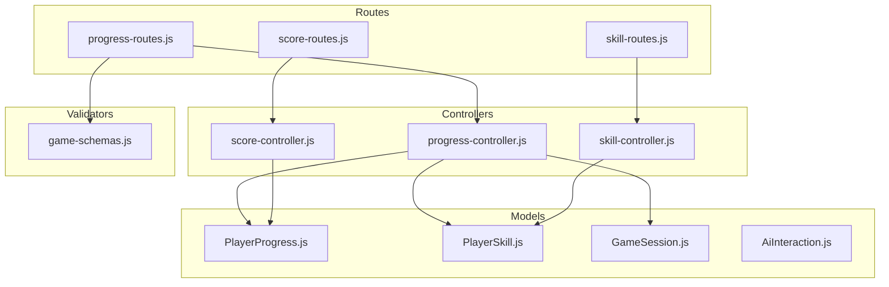
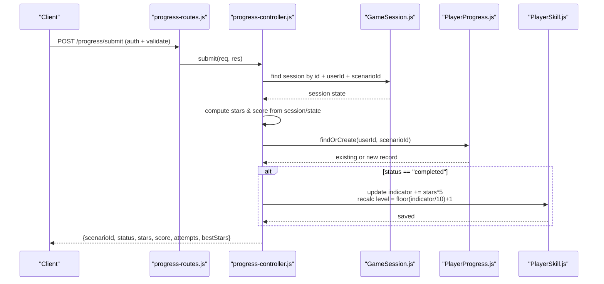
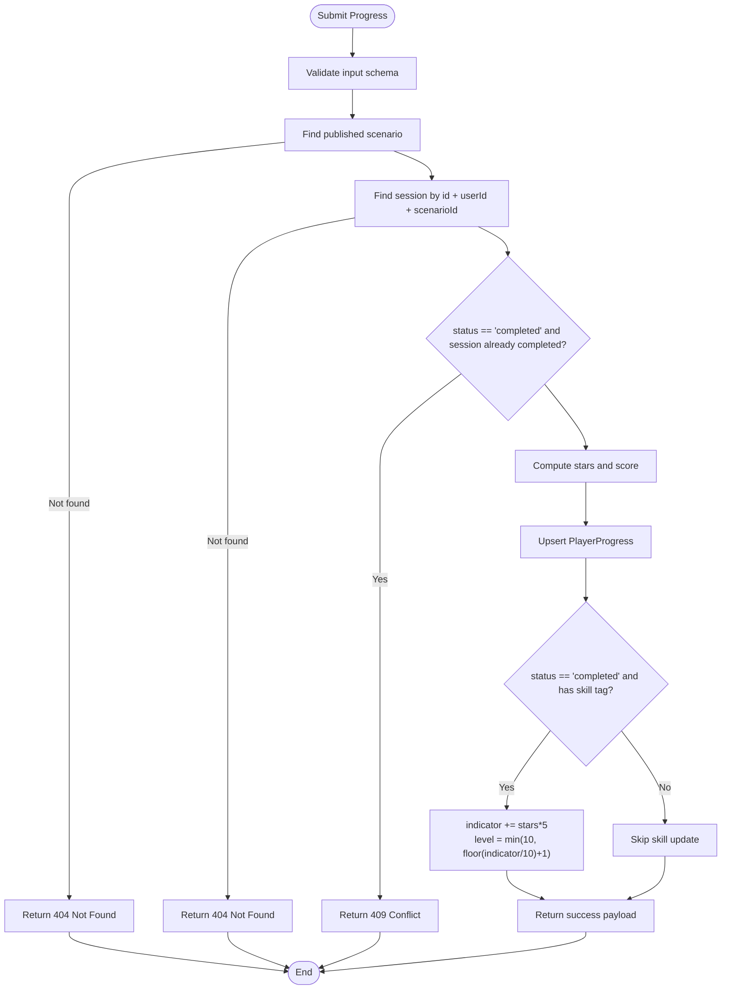
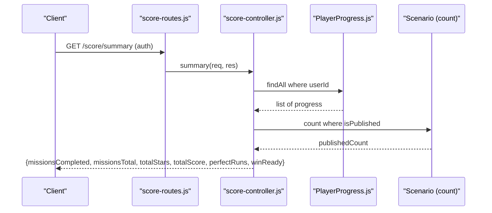
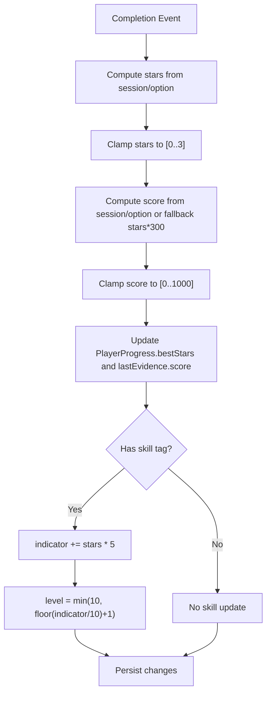
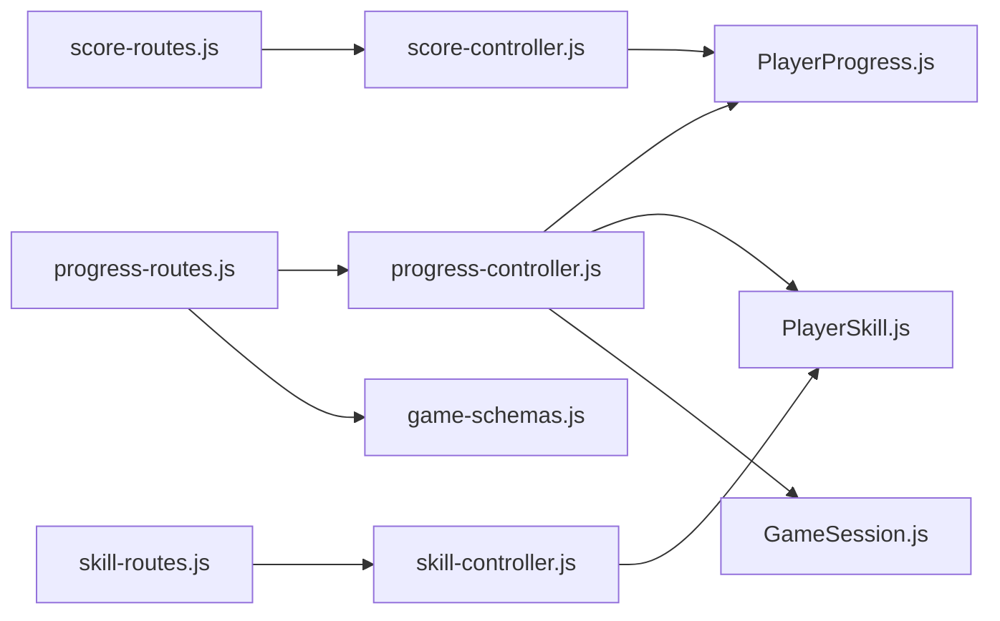

# Progress Tracking API

<cite>
**Referenced Files in This Document**
- [progress-controller.js](file://backend/controllers/progress-controller.js)
- [progress-routes.js](file://backend/routes/progress-routes.js)
- [score-controller.js](file://backend/controllers/score-controller.js)
- [score-routes.js](file://backend/routes/score-routes.js)
- [skill-controller.js](file://backend/controllers/skill-controller.js)
- [skill-routes.js](file://backend/routes/skill-routes.js)
- [PlayerProgress.js](file://backend/models/PlayerProgress.js)
- [PlayerSkill.js](file://backend/models/PlayerSkill.js)
- [GameSession.js](file://backend/models/GameSession.js)
- [AiInteraction.js](file://backend/models/AiInteraction.js)
- [game-schemas.js](file://backend/validators/game-schemas.js)
</cite>

## Table of Contents
1. [Introduction](#introduction)
2. [Project Structure](#project-structure)
3. [Core Components](#core-components)
4. [Architecture Overview](#architecture-overview)
5. [Detailed Component Analysis](#detailed-component-analysis)
6. [Dependency Analysis](#dependency-analysis)
7. [Performance Considerations](#performance-considerations)
8. [Troubleshooting Guide](#troubleshooting-guide)
9. [Conclusion](#conclusion)
10. [Appendices](#appendices)

## Introduction
This document provides comprehensive API documentation for progress tracking endpoints that manage skill progression, achievement unlocking, XP calculation, and level advancement. It details the player progress model, skill mastery metrics, AI interaction logging, and analytics surfaces such as progress summaries and skill breakdowns. It also explains scoring algorithms, experience point calculations, and milestone tracking systems implemented in the backend.

## Project Structure
The progress tracking system is implemented across controllers, routes, models, and validators:
- Routes expose authenticated endpoints for submitting progress, listing progress, retrieving score summaries, and listing skills.
- Controllers implement business logic for progress submission, summary computation, and skill listing.
- Models define persistent data structures for player progress, skills, game sessions, and AI interactions.
- Validators enforce request schemas for progress submissions.

**Diagram sources**
- [progress-routes.js:1-12](file://backend/routes/progress-routes.js#L1-L12)
- [score-routes.js:1-9](file://backend/routes/score-routes.js#L1-L9)
- [skill-routes.js:1-9](file://backend/routes/skill-routes.js#L1-L9)
- [progress-controller.js:1-79](file://backend/controllers/progress-controller.js#L1-L79)
- [score-controller.js:1-24](file://backend/controllers/score-controller.js#L1-L24)
- [skill-controller.js:1-10](file://backend/controllers/skill-controller.js#L1-L10)
- [PlayerProgress.js:1-17](file://backend/models/PlayerProgress.js#L1-L17)
- [PlayerSkill.js:1-15](file://backend/models/PlayerSkill.js#L1-L15)
- [GameSession.js:1-15](file://backend/models/GameSession.js#L1-L15)
- [AiInteraction.js:1-15](file://backend/models/AiInteraction.js#L1-L15)
- [game-schemas.js:1-27](file://backend/validators/game-schemas.js#L1-L27)

**Section sources**
- [progress-routes.js:1-12](file://backend/routes/progress-routes.js#L1-L12)
- [score-routes.js:1-9](file://backend/routes/score-routes.js#L1-L9)
- [skill-routes.js:1-9](file://backend/routes/skill-routes.js#L1-L9)
- [progress-controller.js:1-79](file://backend/controllers/progress-controller.js#L1-L79)
- [score-controller.js:1-24](file://backend/controllers/score-controller.js#L1-L24)
- [skill-controller.js:1-10](file://backend/controllers/skill-controller.js#L1-L10)
- [PlayerProgress.js:1-17](file://backend/models/PlayerProgress.js#L1-L17)
- [PlayerSkill.js:1-15](file://backend/models/PlayerSkill.js#L1-L15)
- [GameSession.js:1-15](file://backend/models/GameSession.js#L1-L15)
- [AiInteraction.js:1-15](file://backend/models/AiInteraction.js#L1-L15)
- [game-schemas.js:1-27](file://backend/validators/game-schemas.js#L1-L27)

## Core Components
- PlayerProgress: Tracks per-scenario status, best stars, attempts, and last evidence (including session context and score).
- PlayerSkill: Tracks per-user skill mastery via an indicator and derived level.
- GameSession: Holds runtime state and history for a scenario run; used to compute stars and scores on completion.
- AiInteraction: Logs AI-assisted decisions during gameplay (available for analytics and auditing).
- Score Summary: Aggregates completed missions, total stars, total score, perfect runs, and readiness for a win condition.
- Skill List: Returns all tracked skills with their current indicators and levels.

Key behaviors:
- Progress submission validates scenario existence and session ownership/completion constraints.
- Stars and score are computed from session state or scenario option defaults, then clamped to safe ranges.
- On completion, associated skill indicator increases by stars and level recalculates from indicator.
- Summary endpoint computes totals and milestones based on completed progress records.

**Section sources**
- [progress-controller.js:5-71](file://backend/controllers/progress-controller.js#L5-L71)
- [score-controller.js:4-21](file://backend/controllers/score-controller.js#L4-L21)
- [PlayerProgress.js:4-14](file://backend/models/PlayerProgress.js#L4-L14)
- [PlayerSkill.js:4-12](file://backend/models/PlayerSkill.js#L4-L12)
- [GameSession.js:4-12](file://backend/models/GameSession.js#L4-L12)
- [AiInteraction.js:4-12](file://backend/models/AiInteraction.js#L4-L12)

## Architecture Overview
The progress tracking flow involves route-level authentication and validation, controller-driven business logic, and model persistence.

**Diagram sources**
- [progress-routes.js:8-9](file://backend/routes/progress-routes.js#L8-L9)
- [progress-controller.js:5-71](file://backend/controllers/progress-controller.js#L5-L71)
- [GameSession.js:4-12](file://backend/models/GameSession.js#L4-L12)
- [PlayerProgress.js:4-14](file://backend/models/PlayerProgress.js#L4-L14)
- [PlayerSkill.js:4-12](file://backend/models/PlayerSkill.js#L4-L12)

## Detailed Component Analysis

### Progress Submission Endpoint
- Method and path: POST /progress/submit
- Authentication: Required
- Validation: Enforced by schema requiring sessionId, scenarioId, status, and optional evidence object
- Business rules:
  - Scenario must exist and be published
  - Session must belong to the requesting user and match the scenario
  - If marking as completed, session must not already be marked completed
  - Stars are derived from session state or scenario option default, clamped to 0–3
  - Score is derived from session state or option default, clamped to 0–1000; if none, defaults to stars × 300
  - Progress record stores bestStars, attempts, and lastEvidence including sessionId, selectedOptionId, and score
  - On completion, associated skill indicator increases by stars × 5 and level recalculated as floor(indicator/10)+1, capped at 100 indicator and level 10
- Response: Includes scenarioId, status, stars, score, attempts, bestStars

**Diagram sources**
- [progress-controller.js:5-71](file://backend/controllers/progress-controller.js#L5-L71)
- [game-schemas.js:19-24](file://backend/validators/game-schemas.js#L19-L24)

**Section sources**
- [progress-routes.js:8-9](file://backend/routes/progress-routes.js#L8-L9)
- [progress-controller.js:5-71](file://backend/controllers/progress-controller.js#L5-L71)
- [game-schemas.js:19-24](file://backend/validators/game-schemas.js#L19-L24)

### Progress Listing Endpoint
- Method and path: GET /progress
- Authentication: Required
- Behavior: Returns all progress records for the authenticated user ordered by most recent update

**Section sources**
- [progress-routes.js:8](file://backend/routes/progress-routes.js#L8)
- [progress-controller.js:73-76](file://backend/controllers/progress-controller.js#L73-L76)

### Score Summary Endpoint
- Method and path: GET /score/summary
- Authentication: Required
- Behavior: Computes aggregated metrics:
  - missionsCompleted: count of completed progress records
  - missionsTotal: count of published scenarios
  - totalStars: sum of bestStars across completed records
  - totalScore: sum of lastEvidence.score across completed records
  - perfectRuns: count of completed records with bestStars >= 3
  - winReady: true if all published scenarios are completed with bestStars >= 3

**Diagram sources**
- [score-routes.js:6](file://backend/routes/score-routes.js#L6)
- [score-controller.js:4-21](file://backend/controllers/score-controller.js#L4-L21)

**Section sources**
- [score-routes.js:6](file://backend/routes/score-routes.js#L6)
- [score-controller.js:4-21](file://backend/controllers/score-controller.js#L4-L21)

### Skill Breakdown Endpoint
- Method and path: GET /skills
- Authentication: Required
- Behavior: Returns all skills for the authenticated user ordered by indicator descending

**Section sources**
- [skill-routes.js:6](file://backend/routes/skill-routes.js#L6)
- [skill-controller.js:4-7](file://backend/controllers/skill-controller.js#L4-L7)

### Data Models

#### PlayerProgress Model
- Fields:
  - id: UUID primary key
  - userId: UUID foreign reference
  - scenarioId: UUID foreign reference
  - status: Enum of started, completed, failed
  - bestStars: Integer tracking best star rating achieved
  - attempts: Integer counting attempts
  - lastEvidence: JSONB storing contextual data like sessionId, selectedOptionId, score
- Indexes: Unique constraint on (userId, scenarioId)

**Section sources**
- [PlayerProgress.js:4-14](file://backend/models/PlayerProgress.js#L4-L14)

#### PlayerSkill Model
- Fields:
  - id: UUID primary key
  - userId: UUID foreign reference
  - skill: String identifying the skill
  - level: Integer derived from indicator
  - indicator: Integer representing mastery points
- Indexes: Unique constraint on (userId, skill)

**Section sources**
- [PlayerSkill.js:4-12](file://backend/models/PlayerSkill.js#L4-L12)

#### GameSession Model
- Fields:
  - id: UUID primary key
  - userId: UUID foreign reference
  - scenarioId: UUID foreign reference
  - state: JSONB holding runtime state (e.g., selectedOptionId, stars, score)
  - history: JSONB array of events
  - completedAt: Timestamp when session completed
  - expiresAt: Expiration timestamp

**Section sources**
- [GameSession.js:4-12](file://backend/models/GameSession.js#L4-L12)

#### AiInteraction Model
- Fields:
  - id: UUID primary key
  - userId: UUID foreign reference
  - scenarioId: UUID foreign reference
  - playerMessage: Text of user message
  - assistantMessage: Text of assistant response
  - decision: JSONB capturing decision metadata
  - expiresAt: Expiration timestamp

**Section sources**
- [AiInteraction.js:4-12](file://backend/models/AiInteraction.js#L4-L12)

### Scoring Algorithms and Milestone Tracking
- Star calculation:
  - Derived from session state or scenario option default; clamped to 0–3
- Score calculation:
  - Derived from session state or option default; clamped to 0–1000
  - Fallback: if no explicit score, defaults to stars × 300
- Skill mastery:
  - Indicator increases by stars × 5 on completion
  - Level recalculated as floor(indicator / 10) + 1, capped at 10
- Milestones:
  - Perfect runs: completed progress with bestStars >= 3
  - Win-ready: all published scenarios completed with bestStars >= 3

**Diagram sources**
- [progress-controller.js:17-58](file://backend/controllers/progress-controller.js#L17-L58)

**Section sources**
- [progress-controller.js:17-58](file://backend/controllers/progress-controller.js#L17-L58)

### Example Requests and Responses

- Submit progress
  - Request: POST /progress/submit with body containing sessionId, scenarioId, status, and optional evidence
  - Success response includes scenarioId, status, stars, score, attempts, bestStars
  - Error responses include 404 for missing scenario/session, 409 for incomplete session conflict

- List progress
  - Request: GET /progress
  - Response: Array of progress records for the user

- Score summary
  - Request: GET /score/summary
  - Response: Object with missionsCompleted, missionsTotal, totalStars, totalScore, perfectRuns, winReady

- Skills list
  - Request: GET /skills
  - Response: Array of skills with indicator and level

[No sources needed since this section summarizes usage patterns without quoting specific code content]

## Dependency Analysis
- Route-to-controller dependencies:
  - progress-routes.js depends on progress-controller.js and middleware/authMiddleware, middleware/validate
  - score-routes.js depends on score-controller.js
  - skill-routes.js depends on skill-controller.js
- Controller-to-model dependencies:
  - progress-controller.js uses PlayerProgress, Scenario, PlayerSkill, GameSession
  - score-controller.js uses PlayerProgress and Scenario
  - skill-controller.js uses PlayerSkill
- Validator dependency:
  - progress-routes.js uses game-schemas.js for progressSubmitSchema

**Diagram sources**
- [progress-routes.js:1-12](file://backend/routes/progress-routes.js#L1-L12)
- [score-routes.js:1-9](file://backend/routes/score-routes.js#L1-L9)
- [skill-routes.js:1-9](file://backend/routes/skill-routes.js#L1-L9)
- [progress-controller.js:1-79](file://backend/controllers/progress-controller.js#L1-L79)
- [score-controller.js:1-24](file://backend/controllers/score-controller.js#L1-L24)
- [skill-controller.js:1-10](file://backend/controllers/skill-controller.js#L1-L10)
- [PlayerProgress.js:1-17](file://backend/models/PlayerProgress.js#L1-L17)
- [PlayerSkill.js:1-15](file://backend/models/PlayerSkill.js#L1-L15)
- [GameSession.js:1-15](file://backend/models/GameSession.js#L1-L15)
- [game-schemas.js:1-27](file://backend/validators/game-schemas.js#L1-L27)

**Section sources**
- [progress-routes.js:1-12](file://backend/routes/progress-routes.js#L1-L12)
- [score-routes.js:1-9](file://backend/routes/score-routes.js#L1-L9)
- [skill-routes.js:1-9](file://backend/routes/skill-routes.js#L1-L9)
- [progress-controller.js:1-79](file://backend/controllers/progress-controller.js#L1-L79)
- [score-controller.js:1-24](file://backend/controllers/score-controller.js#L1-L24)
- [skill-controller.js:1-10](file://backend/controllers/skill-controller.js#L1-L10)
- [game-schemas.js:1-27](file://backend/validators/game-schemas.js#L1-L27)

## Performance Considerations
- Queries are scoped by userId to ensure efficient filtering and avoid cross-user data leakage.
- Unique indexes on (userId, scenarioId) and (userId, skill) prevent duplicate records and speed up lookups.
- Clamping values (stars 0–3, score 0–1000) reduces risk of overflow and ensures consistent aggregation.
- Summary computation aggregates over completed records only, minimizing unnecessary processing.

[No sources needed since this section provides general guidance]

## Troubleshooting Guide
Common issues and resolutions:
- Scenario not found: Ensure scenarioId corresponds to a published scenario.
- Session not found: Verify sessionId belongs to the authenticated user and matches the scenarioId.
- Session incomplete conflict: When submitting completed status, ensure the session is not already marked completed.
- Skill updates not applied: Confirm the scenario has a skill tag and status is completed; otherwise, skill indicator will not change.

Error handling is enforced via application error utilities and HTTP status codes in the progress submission flow.

**Section sources**
- [progress-controller.js:8-15](file://backend/controllers/progress-controller.js#L8-L15)

## Conclusion
The progress tracking API provides robust mechanisms for recording mission outcomes, computing performance metrics, and advancing skill mastery. It enforces strict validation and authorization, maintains clear data models for progress and skills, and offers summary endpoints for analytics and milestone tracking. The design supports extensibility for additional achievements and advanced analytics through the existing models and controller patterns.

[No sources needed since this section summarizes without analyzing specific files]

## Appendices

### API Endpoints Summary
- POST /progress/submit
  - Auth: Required
  - Validates: sessionId, scenarioId, status, evidence
  - Updates: PlayerProgress, PlayerSkill (on completion)
  - Returns: scenarioId, status, stars, score, attempts, bestStars

- GET /progress
  - Auth: Required
  - Returns: All progress records for the user

- GET /score/summary
  - Auth: Required
  - Returns: missionsCompleted, missionsTotal, totalStars, totalScore, perfectRuns, winReady

- GET /skills
  - Auth: Required
  - Returns: User’s skills with indicator and level

[No sources needed since this section lists endpoints without quoting specific code content]