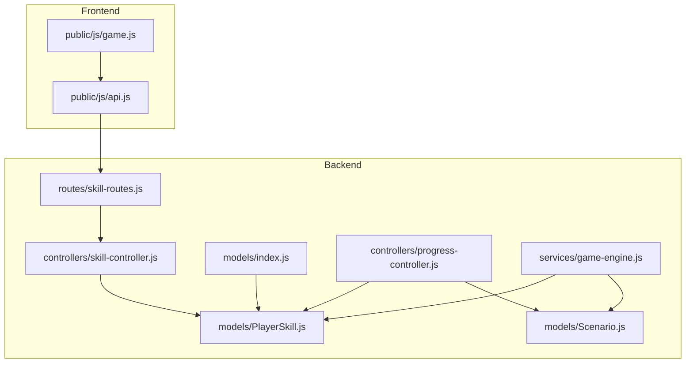
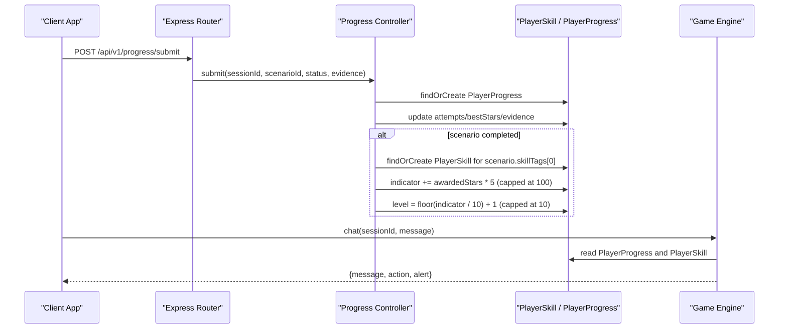
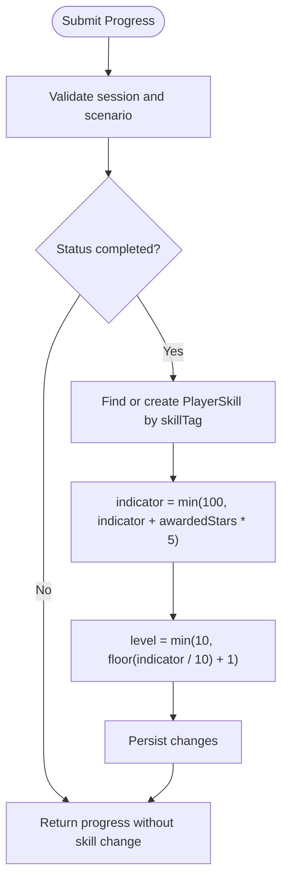
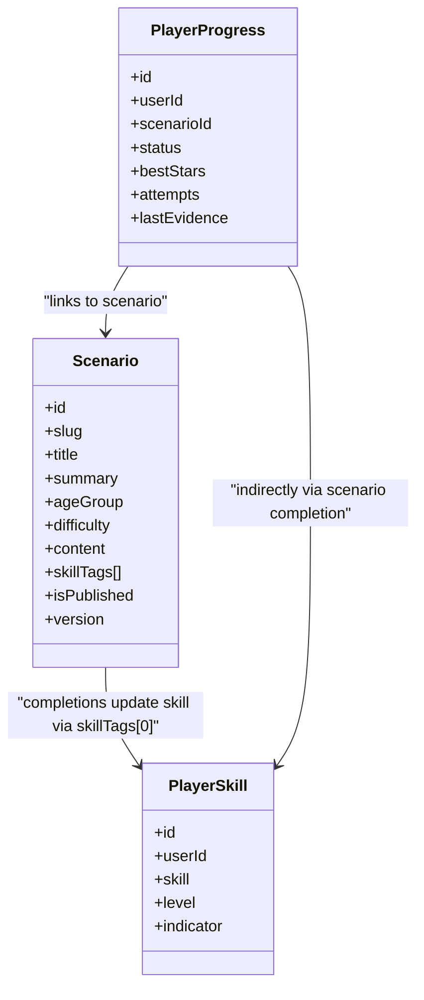
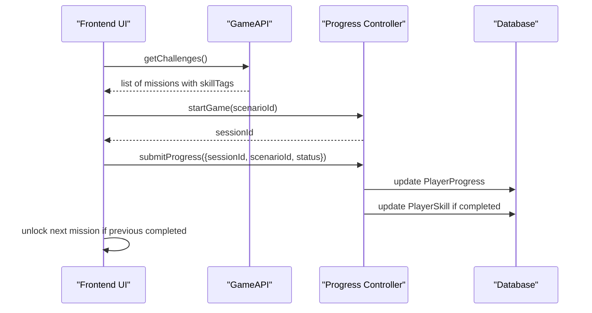
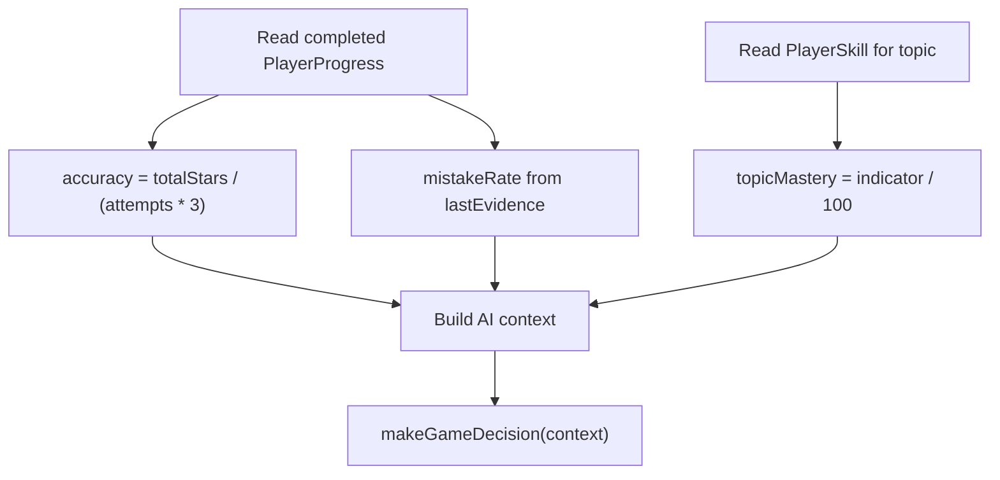
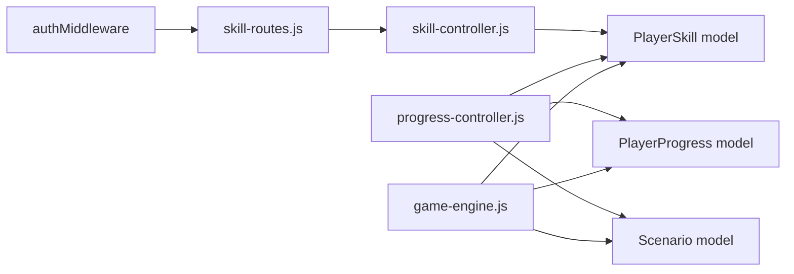

# Skill Management

<cite>
**Referenced Files in This Document**
- [PlayerSkill.js](file://backend/models/PlayerSkill.js)
- [index.js](file://backend/models/index.js)
- [skill-controller.js](file://backend/controllers/skill-controller.js)
- [skill-routes.js](file://backend/routes/skill-routes.js)
- [progress-controller.js](file://backend/controllers/progress-controller.js)
- [Scenario.js](file://backend/models/Scenario.js)
- [game-engine.js](file://backend/services/game-engine.js)
- [api.js](file://backend/public/js/api.js)
- [game.js](file://backend/public/js/game.js)
</cite>

## Table of Contents
1. [Introduction](#introduction)
2. [Project Structure](#project-structure)
3. [Core Components](#core-components)
4. [Architecture Overview](#architecture-overview)
5. [Detailed Component Analysis](#detailed-component-analysis)
6. [Dependency Analysis](#dependency-analysis)
7. [Performance Considerations](#performance-considerations)
8. [Troubleshooting Guide](#troubleshooting-guide)
9. [Conclusion](#conclusion)
10. [Appendices](#appendices)

## Introduction
This document explains the skill management system for player progression, focusing on how skills are modeled, tracked, and updated through gameplay. It covers:
- The PlayerSkill model structure and fields
- How mastery levels and indicators are calculated
- Endpoints to retrieve a player’s skills
- How completing scenarios updates skill metrics
- The scenario-to-skill mapping that drives progression and content unlocking

The goal is to help developers understand how skills influence gameplay progression, how to query skill data, and how to extend or integrate with the existing skill system.

## Project Structure
Skill-related functionality spans models, controllers, routes, services, and frontend utilities:
- Models define persistent skill records and relationships
- Controllers handle request processing and business logic
- Routes expose HTTP endpoints
- Services compute metrics used by AI-driven interactions
- Frontend code consumes APIs and renders skill progress

**Diagram sources**
- [skill-routes.js:1-9](file://backend/routes/skill-routes.js#L1-L9)
- [skill-controller.js:1-10](file://backend/controllers/skill-controller.js#L1-L10)
- [PlayerSkill.js:1-15](file://backend/models/PlayerSkill.js#L1-L15)
- [index.js:1-32](file://backend/models/index.js#L1-L32)
- [progress-controller.js:1-79](file://backend/controllers/progress-controller.js#L1-L79)
- [Scenario.js:1-18](file://backend/models/Scenario.js#L1-L18)
- [game-engine.js:1-124](file://backend/services/game-engine.js#L1-L124)
- [api.js:1-208](file://backend/public/js/api.js#L1-L208)
- [game.js:155-185](file://backend/public/js/game.js#L155-L185)

**Section sources**
- [skill-routes.js:1-9](file://backend/routes/skill-routes.js#L1-L9)
- [skill-controller.js:1-10](file://backend/controllers/skill-controller.js#L1-L10)
- [PlayerSkill.js:1-15](file://backend/models/PlayerSkill.js#L1-L15)
- [index.js:1-32](file://backend/models/index.js#L1-L32)
- [progress-controller.js:1-79](file://backend/controllers/progress-controller.js#L1-L79)
- [Scenario.js:1-18](file://backend/models/Scenario.js#L1-L18)
- [game-engine.js:1-124](file://backend/services/game-engine.js#L1-L124)
- [api.js:1-208](file://backend/public/js/api.js#L1-L208)
- [game.js:155-185](file://backend/public/js/game.js#L155-L185)

## Core Components
- PlayerSkill model stores per-user skill records with an indicator and level
- Progress controller updates PlayerProgress and adjusts PlayerSkill when scenarios complete
- Scenario model associates content with skillTags that drive skill growth
- Game engine computes topic mastery from PlayerSkill indicator for AI decisions
- Skill routes expose a GET endpoint to list a user’s skills

Key responsibilities:
- Persisting skill state (indicator, level)
- Calculating mastery metrics
- Mapping scenario completion to skill advancement
- Exposing skill retrieval via authenticated endpoints

**Section sources**
- [PlayerSkill.js:1-15](file://backend/models/PlayerSkill.js#L1-L15)
- [progress-controller.js:26-59](file://backend/controllers/progress-controller.js#L26-L59)
- [Scenario.js:1-18](file://backend/models/Scenario.js#L1-L18)
- [game-engine.js:35-49](file://backend/services/game-engine.js#L35-L49)
- [skill-routes.js:1-9](file://backend/routes/skill-routes.js#L1-L9)

## Architecture Overview
The skill system integrates scenario-based gameplay with persistent skill tracking:
- Players complete scenarios; upon completion, their best stars determine skill indicator increments
- Indicator values map to levels using a simple formula
- Topic mastery is derived from the indicator for AI-guided interactions
- A protected endpoint returns the current skill set for UI display

**Diagram sources**
- [progress-controller.js:5-59](file://backend/controllers/progress-controller.js#L5-L59)
- [game-engine.js:66-121](file://backend/services/game-engine.js#L66-L121)
- [PlayerSkill.js:1-15](file://backend/models/PlayerSkill.js#L1-L15)
- [Scenario.js:1-18](file://backend/models/Scenario.js#L1-L18)

## Detailed Component Analysis

### PlayerSkill Model
- Fields:
  - id: unique identifier
  - userId: links skill record to a user
  - skill: string tag identifying the skill domain
  - level: integer representing mastery tier
  - indicator: integer metric used to derive level and mastery
- Constraints:
  - Unique composite index on (userId, skill) ensures one record per skill per user

This model is the single source of truth for skill state and is updated only through controlled flows.

**Section sources**
- [PlayerSkill.js:1-15](file://backend/models/PlayerSkill.js#L1-L15)
- [index.js:24-25](file://backend/models/index.js#L24-L25)

### Skill Retrieval Endpoint
- Method: GET
- Path: /api/v1/skills (mounted under /skills)
- Authentication: required
- Behavior:
  - Returns all skills for the authenticated user
  - Ordered by indicator descending to surface strongest skills first

Use this endpoint to render skill dashboards or to gate content based on current skill states.

**Section sources**
- [skill-routes.js:1-9](file://backend/routes/skill-routes.js#L1-L9)
- [skill-controller.js:1-10](file://backend/controllers/skill-controller.js#L1-L10)

### Skill Progression and Mastery Calculation
- Trigger: submitting progress for a scenario
- Logic:
  - If scenario has a skillTag and status is completed:
    - Create or fetch the corresponding PlayerSkill for the user
    - Increase indicator by awardedStars multiplied by a fixed factor, capped at 100
    - Compute level as floor(indicator / 10) + 1, capped at 10
- Result:
  - Higher indicator yields higher level and stronger topic mastery
  - Mastery influences AI responses and difficulty adaptation

**Diagram sources**
- [progress-controller.js:5-59](file://backend/controllers/progress-controller.js#L5-L59)

**Section sources**
- [progress-controller.js:5-59](file://backend/controllers/progress-controller.js#L5-L59)

### Scenario-to-Skill Mapping and Hierarchy
- Scenarios carry a skillTags array; the first tag is used to associate completion with a specific skill
- Difficulty and ordering are managed in content and front-end rendering; there is no explicit prerequisite field in the Scenario model
- Front-end enforces sequential mission access by checking previous mission completion

**Diagram sources**
- [Scenario.js:1-18](file://backend/models/Scenario.js#L1-L18)
- [PlayerSkill.js:1-15](file://backend/models/PlayerSkill.js#L1-L15)
- [progress-controller.js:26-59](file://backend/controllers/progress-controller.js#L26-L59)

**Section sources**
- [Scenario.js:1-18](file://backend/models/Scenario.js#L1-L18)
- [progress-controller.js:26-59](file://backend/controllers/progress-controller.js#L26-L59)
- [game.js:414-451](file://backend/public/js/game.js#L414-L451)

### Gameplay Integration and Content Unlocking
- Front-end displays missions in order and locks subsequent missions until the prior one completes
- Each mission card shows its associated skill badge and difficulty
- Completion unlocks next steps and updates XP/stars visuals

**Diagram sources**
- [api.js:162-204](file://backend/public/js/api.js#L162-L204)
- [progress-controller.js:5-59](file://backend/controllers/progress-controller.js#L5-L59)
- [game.js:414-451](file://backend/public/js/game.js#L414-L451)

**Section sources**
- [api.js:162-204](file://backend/public/js/api.js#L162-L204)
- [game.js:414-451](file://backend/public/js/game.js#L414-L451)

### Mastery Metrics and AI Context
- Topic mastery is computed as indicator / 100
- This value is passed into AI context to tailor hints and alerts
- Accuracy and mistake rate are also considered for adaptive behavior

**Diagram sources**
- [game-engine.js:35-49](file://backend/services/game-engine.js#L35-L49)
- [game-engine.js:66-121](file://backend/services/game-engine.js#L66-L121)

**Section sources**
- [game-engine.js:35-49](file://backend/services/game-engine.js#L35-L49)
- [game-engine.js:66-121](file://backend/services/game-engine.js#L66-L121)

## Dependency Analysis
- Routes depend on middleware for authentication and controllers for handling requests
- Controllers depend on models for persistence and on services for advanced logic
- Services depend on models to compute metrics and interact with AI
- Frontend depends on API client methods to call backend endpoints

**Diagram sources**
- [skill-routes.js:1-9](file://backend/routes/skill-routes.js#L1-L9)
- [skill-controller.js:1-10](file://backend/controllers/skill-controller.js#L1-L10)
- [progress-controller.js:1-79](file://backend/controllers/progress-controller.js#L1-L79)
- [game-engine.js:1-124](file://backend/services/game-engine.js#L1-L124)
- [PlayerSkill.js:1-15](file://backend/models/PlayerSkill.js#L1-L15)
- [Scenario.js:1-18](file://backend/models/Scenario.js#L1-L18)

**Section sources**
- [skill-routes.js:1-9](file://backend/routes/skill-routes.js#L1-L9)
- [skill-controller.js:1-10](file://backend/controllers/skill-controller.js#L1-L10)
- [progress-controller.js:1-79](file://backend/controllers/progress-controller.js#L1-L79)
- [game-engine.js:1-124](file://backend/services/game-engine.js#L1-L124)

## Performance Considerations
- Queries are scoped by userId and use indexes where applicable (e.g., unique constraint on PlayerSkill)
- Indicator updates are bounded (max 100), preventing overflow issues
- Level calculation uses simple arithmetic, minimizing CPU overhead
- Batch operations are not used here; each submission updates a single progress row and potentially one skill row

[No sources needed since this section provides general guidance]

## Troubleshooting Guide
Common issues and resolutions:
- Session not found or incomplete:
  - Ensure the game session exists and is active before submitting progress
  - Verify that the scenario is published and matches the submitted scenarioId
- Skill not updating:
  - Confirm the scenario has a valid skillTag and that status is completed
  - Check that the indicator does not exceed the cap and that level recalculation runs after indicator update
- Mastery appears unchanged:
  - Verify that PlayerProgress.lastEvidence contains expected metrics
  - Confirm that topic mastery is computed from the correct skill tag

**Section sources**
- [progress-controller.js:5-59](file://backend/controllers/progress-controller.js#L5-L59)
- [game-engine.js:35-49](file://backend/services/game-engine.js#L35-L49)

## Conclusion
The skill management system ties scenario completion to persistent skill growth through a straightforward indicator and level model. Mastery metrics feed into AI-driven interactions, enabling adaptive experiences. The current implementation exposes a protected endpoint to list skills and updates skills automatically upon scenario completion. Extending the system can involve adding more granular prerequisites, richer skill hierarchies, or additional assessment queries while preserving the core indicator-level relationship.

[No sources needed since this section summarizes without analyzing specific files]

## Appendices

### API Reference: Skills
- GET /api/v1/skills
  - Authentication: required
  - Response: list of skills for the authenticated user, ordered by indicator descending

**Section sources**
- [skill-routes.js:1-9](file://backend/routes/skill-routes.js#L1-L9)
- [skill-controller.js:1-10](file://backend/controllers/skill-controller.js#L1-L10)

### Example Queries and Patterns
- Retrieve a player’s skills:
  - Call the skills endpoint to obtain current indicator and level per skill
- Calculate mastery:
  - Use indicator / 100 to derive topic mastery for AI context
- Skill-based content unlocking:
  - Enforce sequential mission access on the front-end by checking previous mission completion
  - Optionally gate new content by requiring minimum indicator thresholds per skill

**Section sources**
- [game-engine.js:35-49](file://backend/services/game-engine.js#L35-L49)
- [game.js:414-451](file://backend/public/js/game.js#L414-L451)