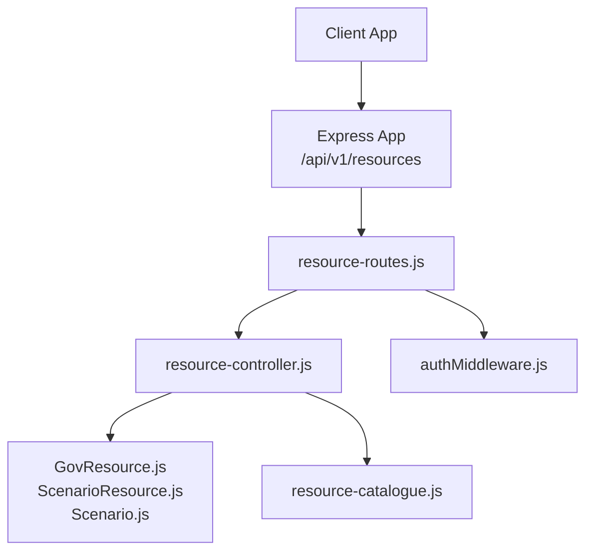
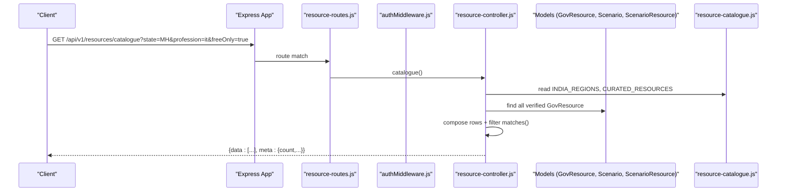
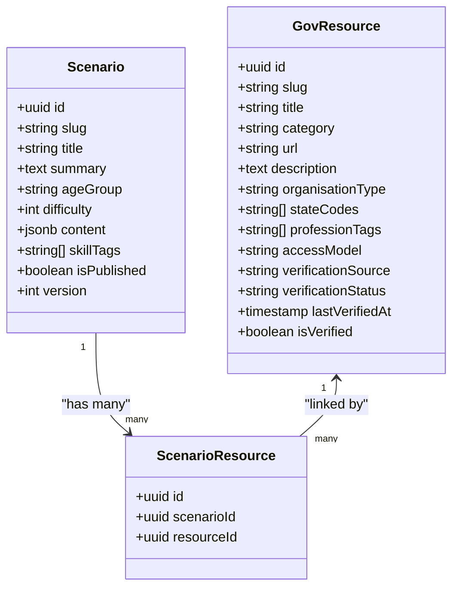
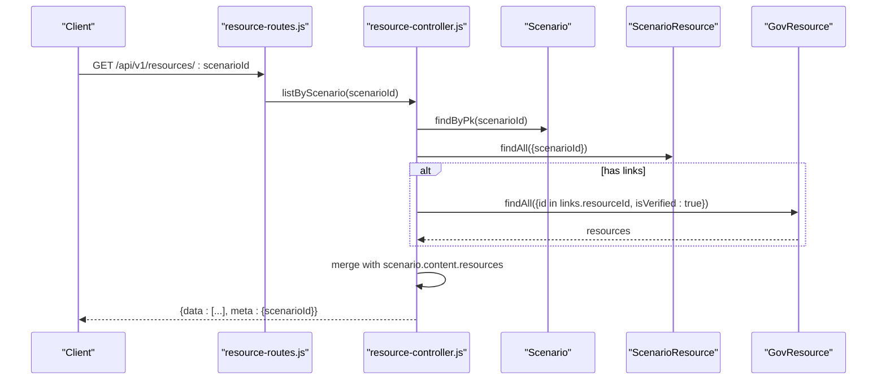
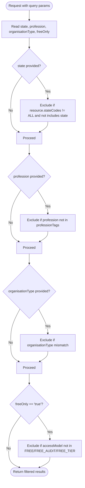
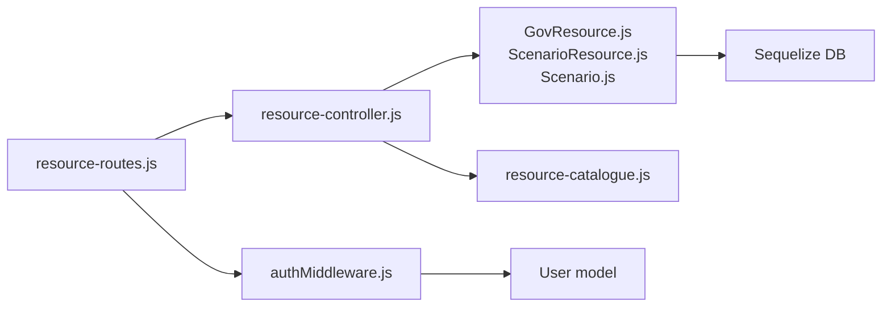

# Resource Management API

<cite>
**Referenced Files in This Document**
- [app.js](file://backend/app.js)
- [resource-routes.js](file://backend/routes/resource-routes.js)
- [resource-controller.js](file://backend/controllers/resource-controller.js)
- [GovResource.js](file://backend/models/GovResource.js)
- [ScenarioResource.js](file://backend/models/ScenarioResource.js)
- [Scenario.js](file://backend/models/Scenario.js)
- [authMiddleware.js](file://backend/middleware/authMiddleware.js)
- [resource-catalogue.js](file://backend/config/resource-catalogue.js)
- [RESOURCE_CATALOGUE.md](file://RESOURCE_CATALOGUE.md)
- [migrations-20260813-resource-catalogue.sql](file://backend/migrations-20260813-resource-catalogue.sql)
</cite>

## Table of Contents
1. [Introduction](#introduction)
2. [Project Structure](#project-structure)
3. [Core Components](#core-components)
4. [Architecture Overview](#architecture-overview)
5. [Detailed Component Analysis](#detailed-component-analysis)
6. [Dependency Analysis](#dependency-analysis)
7. [Performance Considerations](#performance-considerations)
8. [Troubleshooting Guide](#troubleshooting-guide)
9. [Conclusion](#conclusion)
10. [Appendices](#appendices)

## Introduction
This document provides detailed API documentation for resource management endpoints that power educational content discovery, scenario-linked resources, and verified content delivery. It covers the resource catalog system, government resource integration, contextual content delivery per scenario, search and filtering, classification and metadata, and access control. It also includes practical query examples and integration patterns for educational materials.

## Project Structure
The resource management feature is implemented as a small set of Express routes, a controller, models, and configuration:
- Routes are mounted under /api/v1/resources.
- The controller exposes endpoints for regions, catalogue listing, authenticated listing, and scenario-scoped listing.
- Models define the database schema for resources and their relationships to scenarios.
- Configuration defines curated resources and region metadata.
- Authentication middleware protects certain endpoints.

**Diagram sources**
- [app.js:39-49](file://backend/app.js#L39-L49)
- [resource-routes.js:1-11](file://backend/routes/resource-routes.js#L1-L11)
- [resource-controller.js:1-14](file://backend/controllers/resource-controller.js#L1-L14)
- [GovResource.js:1-22](file://backend/models/GovResource.js#L1-L22)
- [ScenarioResource.js:1-11](file://backend/models/ScenarioResource.js#L1-L11)
- [Scenario.js:1-18](file://backend/models/Scenario.js#L1-L18)
- [resource-catalogue.js:1-9](file://backend/config/resource-catalogue.js#L1-L9)
- [authMiddleware.js:1-38](file://backend/middleware/authMiddleware.js#L1-L38)

**Section sources**
- [app.js:39-49](file://backend/app.js#L39-L49)
- [resource-routes.js:1-11](file://backend/routes/resource-routes.js#L1-L11)

## Core Components
- Resource Catalog: A unified view combining curated entries, state directories, and database resources with consistent metadata and verification signals.
- Government Integration: Official IGOD state/UT directories and curated government portals are surfaced with official verification status.
- Scenario Linking: Resources can be linked to learning scenarios; the API returns both linked resources and scenario-inlined resources when available.
- Search and Filtering: Query parameters support filtering by state, profession, organisation type, and free-only mode.
- Access Control: Public discovery endpoints are safe for guests; scenario-scoped listing requires authentication.

Key responsibilities:
- resource-routes.js: Mounts endpoints and applies auth where required.
- resource-controller.js: Implements business logic for listing, filtering, serialization, and scenario linking.
- GovResource.js: Defines persistent resource model fields and defaults.
- ScenarioResource.js: Many-to-many link between scenarios and resources.
- Scenario.js: Holds scenario metadata including embedded content.resources.
- resource-catalogue.js: Provides region metadata and curated resources.
- authMiddleware.js: Validates JWT tokens and enforces authentication.

**Section sources**
- [resource-routes.js:1-11](file://backend/routes/resource-routes.js#L1-L11)
- [resource-controller.js:1-14](file://backend/controllers/resource-controller.js#L1-L14)
- [GovResource.js:1-22](file://backend/models/GovResource.js#L1-L22)
- [ScenarioResource.js:1-11](file://backend/models/ScenarioResource.js#L1-L11)
- [Scenario.js:1-18](file://backend/models/Scenario.js#L1-L18)
- [resource-catalogue.js:1-9](file://backend/config/resource-catalogue.js#L1-L9)
- [authMiddleware.js:1-38](file://backend/middleware/authMiddleware.js#L1-L38)

## Architecture Overview
The API follows a layered structure:
- HTTP layer (Express app) mounts resource routes under /api/v1/resources.
- Routing layer selects handlers based on path and method.
- Controller layer implements filtering, serialization, and data composition.
- Data layer reads from Sequelize models and config.
- Security layer validates requests via middleware.

**Diagram sources**
- [app.js:39-49](file://backend/app.js#L39-L49)
- [resource-routes.js:1-11](file://backend/routes/resource-routes.js#L1-L11)
- [resource-controller.js:1-14](file://backend/controllers/resource-controller.js#L1-L14)
- [resource-catalogue.js:1-9](file://backend/config/resource-catalogue.js#L1-L9)

## Detailed Component Analysis

### Endpoints

#### GET /api/v1/resources/regions
- Purpose: List supported Indian states and Union Territories with directory links.
- Authentication: Not required.
- Response: Array of regions with code, name, type, and directoryUrl; includes count and source in meta.
- Use case: Populate dropdowns or filters for state-based discovery.

**Section sources**
- [resource-routes.js:6](file://backend/routes/resource-routes.js#L6)
- [resource-controller.js:9](file://backend/controllers/resource-controller.js#L9)
- [resource-catalogue.js:1-3](file://backend/config/resource-catalogue.js#L1-L3)

#### GET /api/v1/resources/catalogue
- Purpose: Unified catalogue of verified resources, curated entries, and state directories.
- Authentication: Not required.
- Query Parameters:
  - state: Filter by state code (e.g., MH). Adds a synthetic “State Government Services” entry when specified.
  - profession: Filter by profession tag (e.g., it).
  - organisationType: Filter by organisation type (e.g., GOVERNMENT, NONPROFIT, EDUCATIONAL, PUBLIC_EDUCATION, PRIVATE_LIMITED).
  - freeOnly: When true, only return resources with accessModel FREE, FREE_AUDIT, or FREE_TIER.
- Response: Array of resources with standardized metadata; meta includes count and a warning about non-government resources.
- Notes:
  - State-specific directory entry is included when a valid state code is provided.
  - Deduplication ensures unique entries by slug/title.
  - Verification status may be OFFICIAL_DOMAIN for official domains or DIRECTORY_REVIEWED otherwise.

**Section sources**
- [resource-routes.js:7](file://backend/routes/resource-routes.js#L7)
- [resource-controller.js:10](file://backend/controllers/resource-controller.js#L10)
- [resource-catalogue.js:4-8](file://backend/config/resource-catalogue.js#L4-L8)

#### GET /api/v1/resources
- Purpose: List verified resources from the database.
- Authentication: Required (JWT).
- Query Parameters: Same as catalogue (state, profession, organisationType, freeOnly).
- Response: Array of serialized resources filtered by query.

**Section sources**
- [resource-routes.js:8](file://backend/routes/resource-routes.js#L8)
- [resource-controller.js:11](file://backend/controllers/resource-controller.js#L11)
- [authMiddleware.js:6-35](file://backend/middleware/authMiddleware.js#L6-L35)

#### GET /api/v1/resources/:scenarioId
- Purpose: Return resources linked to a specific scenario plus any scenario-inlined resources.
- Authentication: Required (JWT).
- Path Parameter: scenarioId (UUID).
- Behavior:
  - Verifies scenario existence; returns 404 if not found.
  - Loads ScenarioResource links for the scenario.
  - Returns linked GovResource entries (verified only).
  - Also includes scenario.content.resources entries that have a url and are not explicitly marked unverified.
- Response: Array of resources with scenarioId in meta.

**Section sources**
- [resource-routes.js:9](file://backend/routes/resource-routes.js#L9)
- [resource-controller.js:12](file://backend/controllers/resource-controller.js#L12)
- [Scenario.js:4-15](file://backend/models/Scenario.js#L4-L15)
- [ScenarioResource.js:4-8](file://backend/models/ScenarioResource.js#L4-L8)

### Resource Classification System and Metadata
- Fields returned per resource include:
  - id, slug, title, category, url, description
  - organisationType: GOVERNMENT, NONPROFIT, EDUCATIONAL, PUBLIC_EDUCATION, PRIVATE_LIMITED
  - stateCodes: array of state codes; ALL indicates national scope
  - professionTags: array of tags such as law, marketing, finance, business, it, engineering, education, agriculture, health, creative, jobs
  - accessModel: FREE, FREE_AUDIT, FREE_TIER
  - isFree: boolean derived from accessModel
  - isVerified: boolean indicating verification
  - verificationSource: string describing source of verification
  - verificationStatus: OFFICIAL_DOMAIN or DIRECTORY_REVIEWED
  - lastVerifiedAt: timestamp
  - domainValidated: boolean indicating official domain validation
- Database schema supports these fields with sensible defaults.

**Diagram sources**
- [GovResource.js:4-19](file://backend/models/GovResource.js#L4-L19)
- [ScenarioResource.js:4-8](file://backend/models/ScenarioResource.js#L4-L8)
- [Scenario.js:4-15](file://backend/models/Scenario.js#L4-L15)

**Section sources**
- [GovResource.js:4-19](file://backend/models/GovResource.js#L4-L19)
- [resource-controller.js:7-8](file://backend/controllers/resource-controller.js#L7-L8)
- [migrations-20260813-resource-catalogue.sql:1-9](file://backend/migrations-20260813-resource-catalogue.sql#L1-L9)

### Content Verification and Government Integration
- Official domain detection: URLs ending in .gov.in, .nic.in, or .mygov.in with https are treated as official domains and receive OFFICIAL_DOMAIN verification status.
- Curated government resources: myScheme, IGOD, Skill India Digital, SWAYAM, NPTEL, Startup India, Udyam Registration, eCourts, India Code, RBI Financial Education, SEBI Investor are included with OFFICIAL verification status.
- Non-government resources: Marked as NONPROFIT, EDUCATIONAL, or PRIVATE_LIMITED with DIRECTORY_REVIEWED status; clients should confirm fees, eligibility, privacy, and availability on destination sites.

**Section sources**
- [resource-controller.js:6-8](file://backend/controllers/resource-controller.js#L6-L8)
- [resource-catalogue.js:4-8](file://backend/config/resource-catalogue.js#L4-L8)
- [RESOURCE_CATALOGUE.md:1-11](file://RESOURCE_CATALOGUE.md#L1-L11)

### Contextual Content Delivery (Scenario-Linked Resources)
- Scenario-scoped endpoint returns:
  - Linked resources via ScenarioResource table (verified only).
  - Inline resources from scenario.content.resources that include a url and are not explicitly unverified.
- This enables rich, scenario-specific learning paths while maintaining a centralised resource catalog.

**Diagram sources**
- [resource-routes.js:9](file://backend/routes/resource-routes.js#L9)
- [resource-controller.js:12](file://backend/controllers/resource-controller.js#L12)
- [Scenario.js:4-15](file://backend/models/Scenario.js#L4-L15)
- [ScenarioResource.js:4-8](file://backend/models/ScenarioResource.js#L4-L8)

**Section sources**
- [resource-controller.js:12](file://backend/controllers/resource-controller.js#L12)
- [Scenario.js:4-15](file://backend/models/Scenario.js#L4-L15)
- [ScenarioResource.js:4-8](file://backend/models/ScenarioResource.js#L4-L8)

### Access Control Mechanisms
- Public endpoints:
  - /api/v1/resources/regions
  - /api/v1/resources/catalogue
- Protected endpoints:
  - /api/v1/resources (authenticated listing)
  - /api/v1/resources/:scenarioId (scenario-scoped listing)
- Authentication uses JWT stored in cookies or Authorization header; invalid or expired tokens result in 401 errors.

**Section sources**
- [resource-routes.js:3-9](file://backend/routes/resource-routes.js#L3-L9)
- [authMiddleware.js:6-35](file://backend/middleware/authMiddleware.js#L6-L35)

### Search and Filtering Logic
- Supported query parameters:
  - state: Filters by state code; respects resources scoped to ALL or specific states.
  - profession: Filters by professionTags.
  - organisationType: Filters by organisationType.
  - freeOnly: Filters to FREE, FREE_AUDIT, or FREE_TIER access models.
- Matching rules:
  - If state is provided and resource stateCodes does not include ALL and does not include the requested state, the resource is excluded.
  - Profession must be present in professionTags.
  - OrganisationType must match exactly.
  - freeOnly excludes resources not in the free access models.

**Diagram sources**
- [resource-controller.js:8](file://backend/controllers/resource-controller.js#L8)

**Section sources**
- [resource-controller.js:8](file://backend/controllers/resource-controller.js#L8)

### Example Queries and Integration Patterns
- Discover state-specific government services:
  - GET /api/v1/resources/catalogue?state=MH
  - Expect a synthetic “Maharashtra Government Services” entry alongside other verified resources.
- Filter by profession and free access:
  - GET /api/v1/resources/catalogue?profession=it&freeOnly=true
- Retrieve scenario-linked resources:
  - GET /api/v1/resources/:scenarioId (with valid JWT)
  - Combine with scenario details to build contextual learning paths.
- Build a resource browser:
  - Fetch regions to populate state filters.
  - Use catalogue for initial browsing; use authenticated list for full database-backed resources.
  - Apply profession and organisationType filters to narrow results.
  - Respect freeOnly to show only free or audit-accessible resources.

[No sources needed since this section provides usage guidance]

## Dependency Analysis
- Routes depend on controllers and middleware.
- Controllers depend on models and configuration.
- Models depend on database connection configuration.
- Authentication middleware depends on JWT secrets and user models.

**Diagram sources**
- [resource-routes.js:1-11](file://backend/routes/resource-routes.js#L1-L11)
- [resource-controller.js:1-14](file://backend/controllers/resource-controller.js#L1-L14)
- [authMiddleware.js:1-38](file://backend/middleware/authMiddleware.js#L1-L38)
- [GovResource.js:1-22](file://backend/models/GovResource.js#L1-L22)
- [ScenarioResource.js:1-11](file://backend/models/ScenarioResource.js#L1-L11)
- [Scenario.js:1-18](file://backend/models/Scenario.js#L1-L18)
- [resource-catalogue.js:1-9](file://backend/config/resource-catalogue.js#L1-L9)

**Section sources**
- [resource-routes.js:1-11](file://backend/routes/resource-routes.js#L1-L11)
- [resource-controller.js:1-14](file://backend/controllers/resource-controller.js#L1-L14)
- [authMiddleware.js:1-38](file://backend/middleware/authMiddleware.js#L1-L38)

## Performance Considerations
- Catalogue composition merges curated resources, state directory entries, and database results; deduplication occurs client-side or server-side depending on implementation. For large datasets, consider pagination or caching strategies at the API layer.
- Filtering is applied in-memory after fetching verified resources; indexing on frequently queried fields (e.g., isVerified, category, professionTags) can improve performance.
- Scenario-scoped listing performs multiple queries; ensure indexes on ScenarioResource.scenarioId and ScenarioResource.resourceId.

[No sources needed since this section provides general guidance]

## Troubleshooting Guide
- 401 Unauthorized:
  - Missing or invalid JWT token on protected endpoints (/resources and /resources/:scenarioId).
  - Ensure cookie or Authorization header contains a valid token.
- 404 Scenario Not Found:
  - Scenario ID does not exist; verify scenarioId parameter.
- Empty Results:
  - Filters too restrictive; try removing freeOnly or broadening profession/state filters.
  - Verify that resources are marked isVerified=true in the database.
- CORS Errors:
  - Ensure client origin is allowed by server configuration.

**Section sources**
- [authMiddleware.js:6-35](file://backend/middleware/authMiddleware.js#L6-L35)
- [resource-controller.js:12](file://backend/controllers/resource-controller.js#L12)

## Conclusion
The Resource Management API provides a robust foundation for discovering and delivering educational content through a unified catalog, government integrations, and scenario-linked resources. With flexible filtering, clear verification signals, and controlled access, it supports building engaging learning experiences tailored to users’ professions, regions, and needs.

[No sources needed since this section summarizes without analyzing specific files]

## Appendices

### API Reference Summary
- GET /api/v1/resources/regions
  - Public
  - Returns regions with directory links
- GET /api/v1/resources/catalogue
  - Public
  - Query: state, profession, organisationType, freeOnly
  - Returns unified catalogue with metadata and warnings
- GET /api/v1/resources
  - Authenticated
  - Query: state, profession, organisationType, freeOnly
  - Returns verified database resources
- GET /api/v1/resources/:scenarioId
  - Authenticated
  - Returns scenario-linked and inline resources

**Section sources**
- [resource-routes.js:6-9](file://backend/routes/resource-routes.js#L6-L9)
- [resource-controller.js:9-12](file://backend/controllers/resource-controller.js#L9-L12)

### Data Model Reference
- GovResource fields: id, slug, title, category, url, description, organisationType, stateCodes, professionTags, accessModel, verificationSource, verificationStatus, lastVerifiedAt, isVerified
- ScenarioResource fields: id, scenarioId, resourceId
- Scenario fields: id, slug, title, summary, ageGroup, difficulty, content, skillTags, isPublished, version

**Section sources**
- [GovResource.js:4-19](file://backend/models/GovResource.js#L4-L19)
- [ScenarioResource.js:4-8](file://backend/models/ScenarioResource.js#L4-L8)
- [Scenario.js:4-15](file://backend/models/Scenario.js#L4-L15)

### Migration Notes
- Additional columns added to GovResources table for classification and verification metadata.

**Section sources**
- [migrations-20260813-resource-catalogue.sql:1-9](file://backend/migrations-20260813-resource-catalogue.sql#L1-L9)