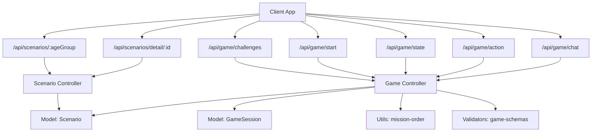
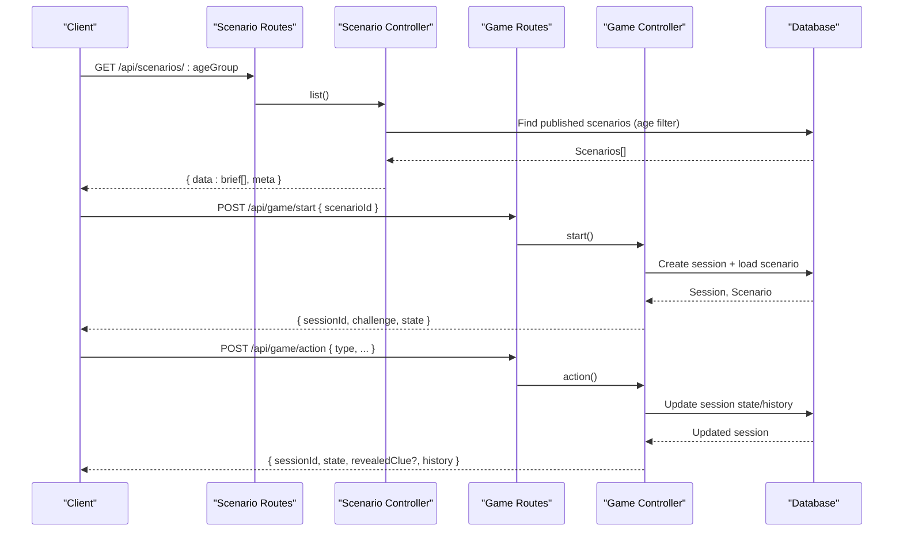
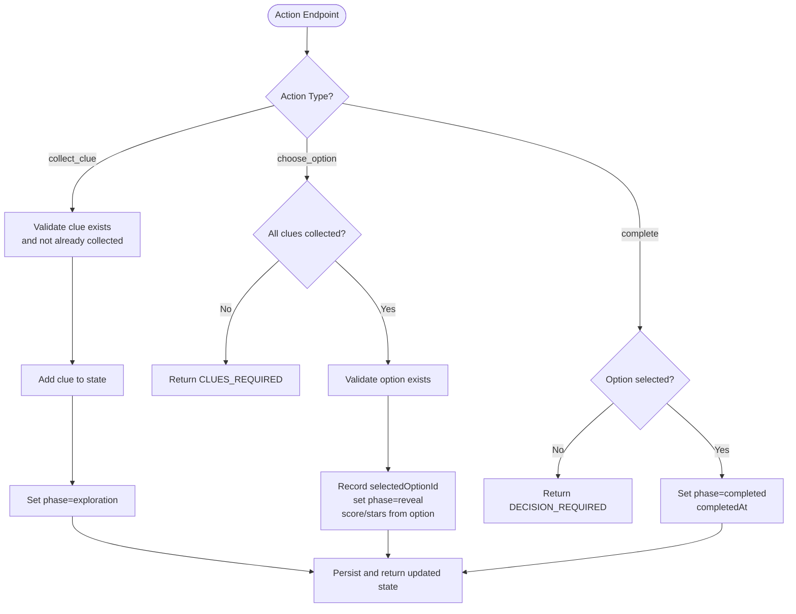
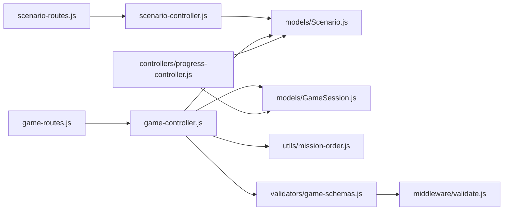

# Scenario Management API

<cite>
**Referenced Files in This Document**
- [scenario-routes.js](file://backend/routes/scenario-routes.js)
- [scenario-controller.js](file://backend/controllers/scenario-controller.js)
- [game-routes.js](file://backend/routes/game-routes.js)
- [game-controller.js](file://backend/controllers/game-controller.js)
- [Scenario.js](file://backend/models/Scenario.js)
- [ScenarioResource.js](file://backend/models/ScenarioResource.js)
- [seed-scenarios.js](file://backend/scripts/seed-scenarios.js)
- [mission-order.js](file://backend/utils/mission-order.js)
- [game-schemas.js](file://backend/validators/game-schemas.js)
- [validate.js](file://backend/middleware/validate.js)
- [progress-controller.js](file://backend/controllers/progress-controller.js)
</cite>

## Table of Contents
1. [Introduction](#introduction)
2. [Project Structure](#project-structure)
3. [Core Components](#core-components)
4. [Architecture Overview](#architecture-overview)
5. [Detailed Component Analysis](#detailed-component-analysis)
6. [Dependency Analysis](#dependency-analysis)
7. [Performance Considerations](#performance-considerations)
8. [Troubleshooting Guide](#troubleshooting-guide)
9. [Conclusion](#conclusion)
10. [Appendices](#appendices)

## Introduction
This document provides detailed API documentation for scenario management endpoints, focusing on discovery, retrieval, and gameplay interaction with scenarios. It explains the scenario content structure, difficulty scaling, prerequisite management (clues), publishing controls, versioning, and validation. It also covers scenario templates, branching logic via options, and reward systems tied to player progress.

## Project Structure
The scenario system is implemented as a set of routes, controllers, models, validators, and utilities:
- Routes define HTTP endpoints for listing and retrieving scenarios, and for starting/managing game sessions.
- Controllers implement business logic for listing, fetching, session lifecycle, actions, and progress submission.
- Models define persistent entities such as Scenario and ScenarioResource.
- Validators enforce request schemas for game actions and chat.
- Utilities provide consistent ordering and error handling.

**Diagram sources**
- [scenario-routes.js:1-2](file://backend/routes/scenario-routes.js#L1-L2)
- [game-routes.js:1-15](file://backend/routes/game-routes.js#L1-L15)
- [scenario-controller.js:55-68](file://backend/controllers/scenario-controller.js#L55-L68)
- [game-controller.js:18-125](file://backend/controllers/game-controller.js#L18-L125)
- [Scenario.js:4-15](file://backend/models/Scenario.js#L4-L15)
- [mission-order.js:1-18](file://backend/utils/mission-order.js#L1-L18)
- [game-schemas.js:1-27](file://backend/validators/game-schemas.js#L1-L27)

**Section sources**
- [scenario-routes.js:1-2](file://backend/routes/scenario-routes.js#L1-L2)
- [game-routes.js:1-15](file://backend/routes/game-routes.js#L1-L15)
- [scenario-controller.js:55-68](file://backend/controllers/scenario-controller.js#L55-L68)
- [game-controller.js:18-125](file://backend/controllers/game-controller.js#L18-L125)
- [Scenario.js:4-15](file://backend/models/Scenario.js#L4-L15)
- [mission-order.js:1-18](file://backend/utils/mission-order.js#L1-L18)
- [game-schemas.js:1-27](file://backend/validators/game-schemas.js#L1-L27)

## Core Components
- Scenario model: Defines fields including slug, title, summary, ageGroup, difficulty, content (JSONB), skillTags, isPublished, and version.
- Scenario controller: Provides public briefs and full gameplay payloads; filters by published status and age group; normalizes resources.
- Game controller: Manages session lifecycle (start, state, action, chat), enforces clue prerequisites, scoring, and completion flow.
- Validators: Enforce schema for start, action, chat, and progress submission.
- Mission order utility: Ensures deterministic ordering of scenarios for discovery.

Key responsibilities:
- Discovery: List scenarios filtered by age group or return all published challenges.
- Retrieval: Fetch a single published scenario by ID.
- Gameplay: Start a session, collect clues, choose options, complete, and chat.
- Progress: Submit completion status and persist stars/score per scenario.

**Section sources**
- [Scenario.js:4-15](file://backend/models/Scenario.js#L4-L15)
- [scenario-controller.js:7-53](file://backend/controllers/scenario-controller.js#L7-L53)
- [game-controller.js:18-125](file://backend/controllers/game-controller.js#L18-L125)
- [game-schemas.js:1-27](file://backend/validators/game-schemas.js#L1-L27)
- [mission-order.js:1-18](file://backend/utils/mission-order.js#L1-L18)

## Architecture Overview
The API exposes two primary flows:
- Scenario discovery and retrieval: GET endpoints that return curated metadata or full gameplay-ready content for published scenarios.
- Sessioned gameplay: POST/GET endpoints to start a session, query state, perform actions (collect clues, choose options, complete), and optionally chat.

**Diagram sources**
- [scenario-routes.js:1-2](file://backend/routes/scenario-routes.js#L1-L2)
- [game-routes.js:1-15](file://backend/routes/game-routes.js#L1-L15)
- [scenario-controller.js:55-68](file://backend/controllers/scenario-controller.js#L55-L68)
- [game-controller.js:18-116](file://backend/controllers/game-controller.js#L18-L116)

## Detailed Component Analysis

### Scenario Discovery and Retrieval
- GET /api/scenarios/:ageGroup
  - Purpose: List published scenarios suitable for an age group.
  - Behavior: Filters by isPublished=true and ageGroup match or 'all'; returns a brief payload; sorted deterministically.
  - Response includes: id, slug, title, summary, ageGroup, difficulty, skillTags, version, estimatedMinutes, learningObjectives count.
- GET /api/scenarios/detail/:id
  - Purpose: Retrieve full gameplay content for a specific published scenario.
  - Behavior: Returns normalized content including presentation, interactables, world, puzzles, learning objectives, clues (id/title), options (id/text), and estimated minutes.

Notes:
- Only published scenarios are exposed publicly.
- Age-based filtering supports targeted discovery.

**Section sources**
- [scenario-routes.js:1-2](file://backend/routes/scenario-routes.js#L1-L2)
- [scenario-controller.js:55-68](file://backend/controllers/scenario-controller.js#L55-L68)
- [scenario-controller.js:7-53](file://backend/controllers/scenario-controller.js#L7-L53)
- [mission-order.js:1-18](file://backend/utils/mission-order.js#L1-L18)

### Scenario Content Structure
A scenario’s content is stored as JSONB and consumed by both discovery and gameplay flows. Typical fields include:
- topic: Category tag for the scenario theme.
- scenario: Narrative context for the user.
- estimatedMinutes: Expected duration.
- presentation: hook and objective text.
- learningObjectives: Array of educational goals.
- interactables: Objects users can interact with in the UI.
- world: Optional world context for immersive experiences.
- puzzles: Puzzle definitions (if any).
- clues: Discoverable hints with id and title/description.
- options: Decision points with id, text, score, stars, outcome.
- explanation: Post-decision feedback.
- safeHint: Guidance hint for players.
- verifiedAlerts: Safety alerts with type and priority.
- resources: Verified external links with url and isVerified flag.

Validation and normalization:
- The controller normalizes responses to hide internal fields and ensure safe defaults.
- Resources are filtered to only include verified entries.

**Section sources**
- [Scenario.js:4-15](file://backend/models/Scenario.js#L4-L15)
- [scenario-controller.js:7-53](file://backend/controllers/scenario-controller.js#L7-L53)
- [seed-scenarios.js:9-232](file://backend/scripts/seed-scenarios.js#L9-L232)

### Difficulty Scaling and Prerequisite Management
- Difficulty: Integer field on Scenario used for categorization and potential progression gating.
- Prerequisites: Clues act as prerequisites for making a decision. The action endpoint enforces that all clues must be collected before choosing an option.
- Branching logic: Options represent branching decisions; each option carries score and stars, influencing rewards and outcomes.

**Diagram sources**
- [game-controller.js:52-116](file://backend/controllers/game-controller.js#L52-L116)

**Section sources**
- [game-controller.js:52-116](file://backend/controllers/game-controller.js#L52-L116)
- [Scenario.js:4-15](file://backend/models/Scenario.js#L4-L15)

### Publishing Controls and Version Control
- Publishing: Scenarios are only discoverable when isPublished=true.
- Versioning: A version integer tracks revisions; returned in brief payloads for client awareness.
- Seeding: Seed script upserts scenarios by slug, enabling repeatable setup and updates.

Operational notes:
- Use seed script to create/update scenarios during development or CI.
- Promote scenarios to production by setting isPublished=true and incrementing version when content changes.

**Section sources**
- [scenario-controller.js:55-68](file://backend/controllers/scenario-controller.js#L55-L68)
- [Scenario.js:4-15](file://backend/models/Scenario.js#L4-L15)
- [seed-scenarios.js:234-249](file://backend/scripts/seed-scenarios.js#L234-L249)

### Reward Systems and Player Progress
- Stars and Score: Derived from chosen option; clamped to safe ranges.
- Progress Submission: Endpoints allow submitting completed status, evidence, and persisting best stars and attempts.
- Skill Tracking: Completion can update player skills based on scenario tags.

Flow highlights:
- In-game actions compute score and stars.
- Progress submission persists bestStars, attempts, lastEvidence, and updates skill indicators.

**Section sources**
- [game-controller.js:86-116](file://backend/controllers/game-controller.js#L86-L116)
- [progress-controller.js:5-71](file://backend/controllers/progress-controller.js#L5-L71)

### Validation and Error Handling
- Request validation: Joi schemas validate start, action, chat, and progress submissions.
- Middleware: Centralized validation middleware converts errors to standardized AppError responses.
- Common errors: SESSION_NOT_FOUND, ALREADY_DECIDED, INVALID_CLUE, CLUE_ALREADY_COLLECTED, CLUES_REQUIRED, INVALID_OPTION, DECISION_REQUIRED, INVALID_ACTION.

**Section sources**
- [game-schemas.js:1-27](file://backend/validators/game-schemas.js#L1-L27)
- [validate.js:1-14](file://backend/middleware/validate.js#L1-L14)
- [game-controller.js:8-16](file://backend/controllers/game-controller.js#L8-L16)
- [game-controller.js:52-116](file://backend/controllers/game-controller.js#L52-L116)

## Dependency Analysis
The following diagram shows key dependencies among modules involved in scenario management and gameplay.

**Diagram sources**
- [scenario-routes.js:1-2](file://backend/routes/scenario-routes.js#L1-L2)
- [game-routes.js:1-15](file://backend/routes/game-routes.js#L1-L15)
- [scenario-controller.js:55-68](file://backend/controllers/scenario-controller.js#L55-L68)
- [game-controller.js:18-125](file://backend/controllers/game-controller.js#L18-L125)
- [Scenario.js:4-15](file://backend/models/Scenario.js#L4-L15)
- [game-schemas.js:1-27](file://backend/validators/game-schemas.js#L1-L27)
- [validate.js:1-14](file://backend/middleware/validate.js#L1-L14)
- [progress-controller.js:5-71](file://backend/controllers/progress-controller.js#L5-L71)

**Section sources**
- [scenario-routes.js:1-2](file://backend/routes/scenario-routes.js#L1-L2)
- [game-routes.js:1-15](file://backend/routes/game-routes.js#L1-L15)
- [scenario-controller.js:55-68](file://backend/controllers/scenario-controller.js#L55-L68)
- [game-controller.js:18-125](file://backend/controllers/game-controller.js#L18-L125)
- [Scenario.js:4-15](file://backend/models/Scenario.js#L4-L15)
- [game-schemas.js:1-27](file://backend/validators/game-schemas.js#L1-L27)
- [validate.js:1-14](file://backend/middleware/validate.js#L1-L14)
- [progress-controller.js:5-71](file://backend/controllers/progress-controller.js#L5-L71)

## Performance Considerations
- Filtering by isPublished reduces dataset size for discovery endpoints.
- Deterministic sorting ensures stable ordering without extra computation.
- Normalizing responses avoids sending unnecessary fields, reducing payload size.
- Clue collection and option selection are validated server-side to prevent redundant operations.

[No sources needed since this section provides general guidance]

## Troubleshooting Guide
Common issues and resolutions:
- No scenarios listed: Ensure at least one scenario has isPublished=true and matches the requested ageGroup or is tagged 'all'.
- Cannot choose option: Collect all clues first; the endpoint enforces prerequisite collection.
- Already decided: You cannot change your decision once an option is selected; complete the scenario instead.
- Invalid clue or option: Verify IDs exist in the scenario’s content.
- Session expired or not found: Start a new session if the previous one expired or was not found.

**Section sources**
- [game-controller.js:8-16](file://backend/controllers/game-controller.js#L8-L16)
- [game-controller.js:52-116](file://backend/controllers/game-controller.js#L52-L116)
- [scenario-controller.js:55-68](file://backend/controllers/scenario-controller.js#L55-L68)

## Conclusion
The scenario management API provides robust endpoints for discovering and playing scenarios with clear publishing controls, versioning, and validation. Gameplay enforces structured learning through clue prerequisites and branching decisions, while rewards and progress tracking support long-term engagement. Use the provided endpoints and models to build rich, educational experiences aligned with safety and learning objectives.

[No sources needed since this section summarizes without analyzing specific files]

## Appendices

### API Reference Summary

- Scenario Discovery
  - GET /api/scenarios/:ageGroup
    - Returns published scenarios filtered by age group; includes brief metadata.
  - GET /api/scenarios/detail/:id
    - Returns full gameplay content for a published scenario.

- Game Session
  - GET /api/game/challenges
    - Lists all published challenges (brief).
  - POST /api/game/start
    - Starts a session for a scenario; returns sessionId, challenge, and initial state.
  - GET /api/game/state
    - Retrieves current session state, revealed clues, and history.
  - POST /api/game/action
    - Performs actions: collect_clue, choose_option, complete.
  - POST /api/game/chat
    - Sends chat messages within a session.

- Progress
  - POST /api/progress (via progress controller)
    - Submits completion status, evidence, and persists stars/score and skill updates.

**Section sources**
- [scenario-routes.js:1-2](file://backend/routes/scenario-routes.js#L1-L2)
- [game-routes.js:1-15](file://backend/routes/game-routes.js#L1-L15)
- [game-controller.js:18-125](file://backend/controllers/game-controller.js#L18-L125)
- [progress-controller.js:5-71](file://backend/controllers/progress-controller.js#L5-L71)

### Scenario Template Example
Use the seed script as a reference for creating new scenarios. Each entry defines:
- slug, title, summary, ageGroup, difficulty, skillTags, isPublished, version
- content object with narrative, objectives, interactables, clues, options, explanation, safeHint, verifiedAlerts, and resources

To add or update scenarios:
- Insert or update entries in the seed script using upsert by slug.
- Run the seed script to apply changes to the database.

**Section sources**
- [seed-scenarios.js:9-232](file://backend/scripts/seed-scenarios.js#L9-L232)
- [seed-scenarios.js:234-249](file://backend/scripts/seed-scenarios.js#L234-L249)