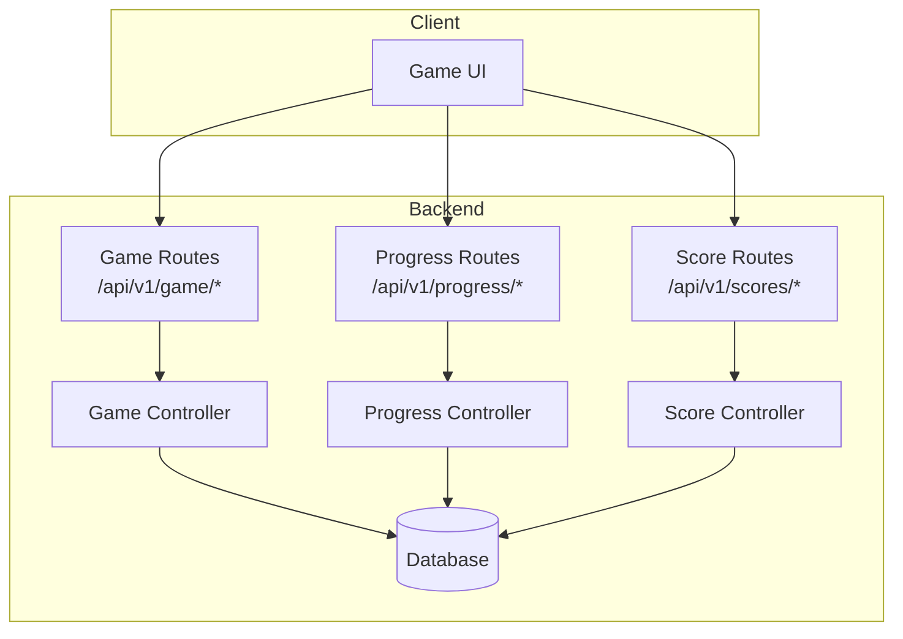
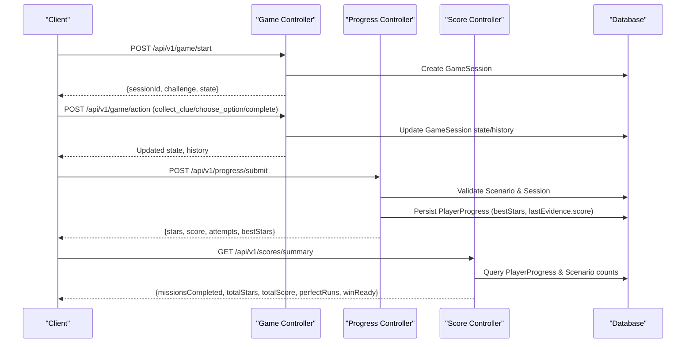
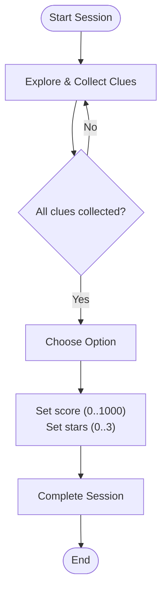
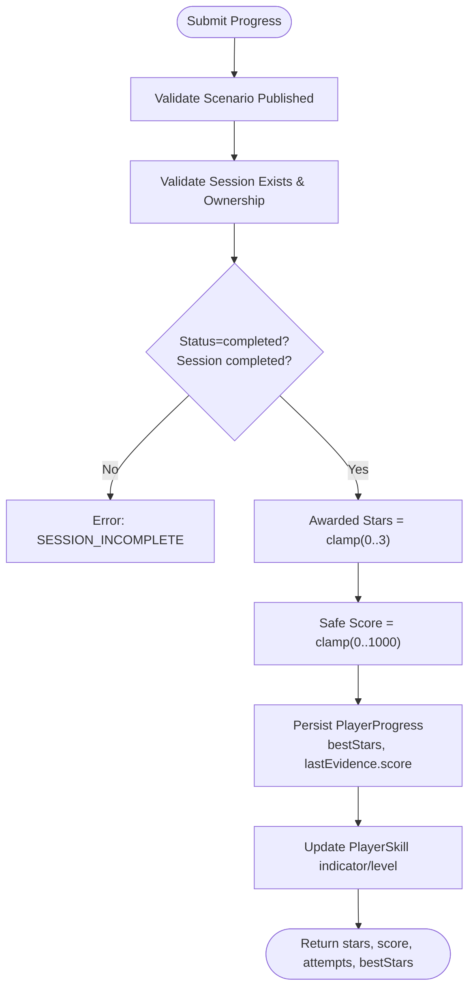
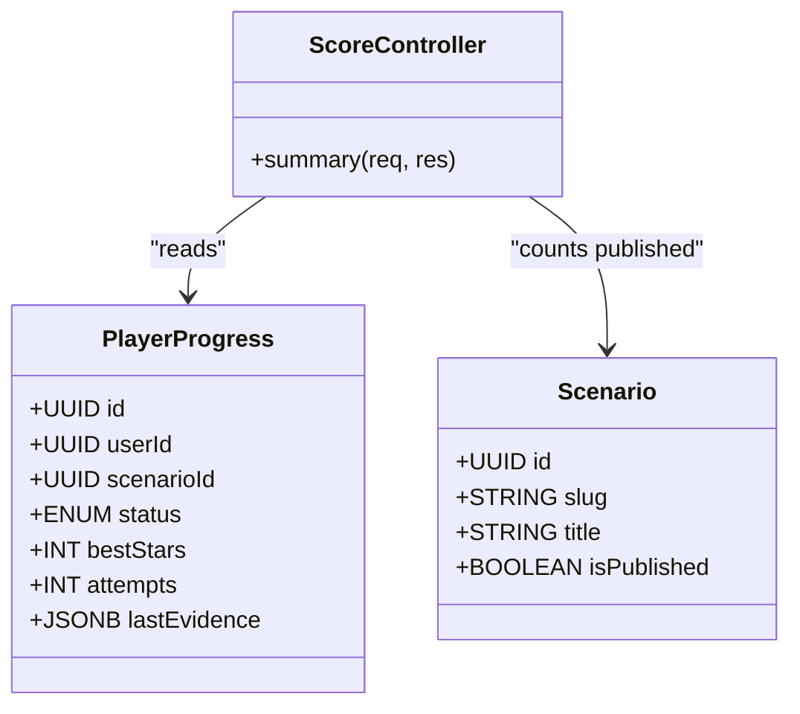
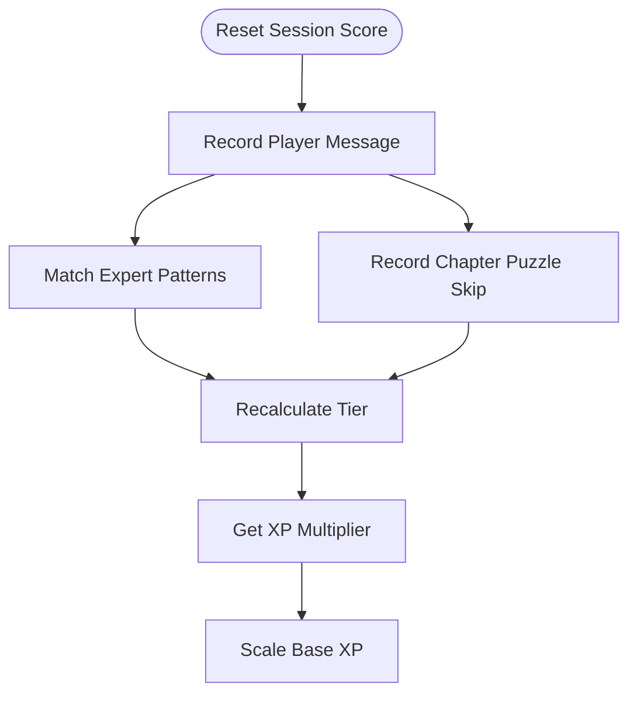
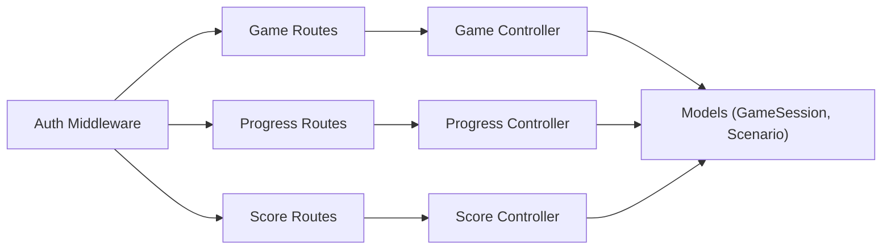

# Score Management API

<cite>
**Referenced Files in This Document**
- [score-controller.js](file://backend/controllers/score-controller.js)
- [score-routes.js](file://backend/routes/score-routes.js)
- [progress-controller.js](file://backend/controllers/progress-controller.js)
- [progress-routes.js](file://backend/routes/progress-routes.js)
- [game-controller.js](file://backend/controllers/game-controller.js)
- [game-routes.js](file://backend/routes/game-routes.js)
- [PlayerProgress.js](file://backend/models/PlayerProgress.js)
- [GameSession.js](file://backend/models/GameSession.js)
- [Scenario.js](file://backend/models/Scenario.js)
- [authMiddleware.js](file://backend/middleware/authMiddleware.js)
- [session-scoring.js](file://backend/public/js/session-scoring.js)
- [app.js](file://backend/app.js)
</cite>

## Table of Contents
1. Introduction
2. Project Structure
3. Core Components
4. Architecture Overview
5. Detailed Component Analysis
6. Dependency Analysis
7. Performance Considerations
8. Troubleshooting Guide
9. Conclusion

## Introduction
This document provides detailed API documentation for score management endpoints, including scoring algorithms, leaderboard and ranking features, performance metrics, point calculation systems, achievement bonuses, and fair play enforcement. It covers submitting scores, retrieving rankings, and accessing performance analytics with examples and validation rules.

## Project Structure
The score management system spans game session handling, progress submission, and summary retrieval:
- Game session lifecycle and state transitions are managed by the game controller and routes.
- Progress submission validates sessions and persists best stars and scores to player progress records.
- Score summary aggregates completed missions, total stars, total score, perfect runs, and readiness indicators.
- Client-side session scoring computes engagement tiers and XP multipliers that influence final outcomes.

**Diagram sources**
- [game-routes.js:1-15](file://backend/routes/game-routes.js#L1-L15)
- [progress-routes.js:1-12](file://backend/routes/progress-routes.js#L1-L12)
- [score-routes.js:1-9](file://backend/routes/score-routes.js#L1-L9)
- [game-controller.js:1-128](file://backend/controllers/game-controller.js#L1-L128)
- [progress-controller.js:1-79](file://backend/controllers/progress-controller.js#L1-L79)
- [score-controller.js:1-24](file://backend/controllers/score-controller.js#L1-L24)

**Section sources**
- [app.js:40-50](file://backend/app.js#L40-L50)
- [game-routes.js:1-15](file://backend/routes/game-routes.js#L1-L15)
- [progress-routes.js:1-12](file://backend/routes/progress-routes.js#L1-L12)
- [score-routes.js:1-9](file://backend/routes/score-routes.js#L1-L9)

## Core Components
- Game Session Management: Creates and updates active sessions, enforces decision flow (collect clues, choose option, complete), and caps scores and stars within safe bounds.
- Progress Submission: Validates scenario and session, enforces completion before submission, calculates awarded stars and score, persists best results, and updates skill indicators.
- Score Summary: Aggregates per-user progress to compute missions completed, total stars, total score, perfect runs, and win-ready status against published scenarios.
- Client-Side Scoring: Tracks expert engagement, puzzle behavior, and chat usage to determine tier and XP multiplier used during gameplay.

**Section sources**
- [game-controller.js:18-128](file://backend/controllers/game-controller.js#L18-L128)
- [progress-controller.js:5-79](file://backend/controllers/progress-controller.js#L5-L79)
- [score-controller.js:4-23](file://backend/controllers/score-controller.js#L4-L23)
- [session-scoring.js:94-144](file://backend/public/js/session-scoring.js#L94-L144)

## Architecture Overview
The scoring pipeline integrates client-side engagement tracking with server-side validation and persistence:
- The client tracks engagement and determines a tier and XP multiplier.
- During gameplay, actions update session state; options carry predefined score and star values.
- On completion, the client submits progress with session context; the server validates and persists best outcomes.
- A summary endpoint aggregates user performance across scenarios.

**Diagram sources**
- [game-controller.js:18-128](file://backend/controllers/game-controller.js#L18-L128)
- [progress-controller.js:5-79](file://backend/controllers/progress-controller.js#L5-L79)
- [score-controller.js:4-23](file://backend/controllers/score-controller.js#L4-L23)
- [game-routes.js:1-15](file://backend/routes/game-routes.js#L1-L15)
- [progress-routes.js:1-12](file://backend/routes/progress-routes.js#L1-L12)
- [score-routes.js:1-9](file://backend/routes/score-routes.js#L1-L9)

## Detailed Component Analysis

### Game Session and Scoring Flow
- Session creation initializes state and returns public scenario content.
- Actions enforce phase transitions: exploration -> reveal -> completed.
- Option selection sets capped score (0–1000) and stars (0–3).
- Completion marks session end time and prevents further actions.

**Diagram sources**
- [game-controller.js:52-116](file://backend/controllers/game-controller.js#L52-L116)

**Section sources**
- [game-controller.js:18-128](file://backend/controllers/game-controller.js#L18-L128)
- [game-routes.js:1-15](file://backend/routes/game-routes.js#L1-L15)

### Progress Submission and Validation
- Validates scenario is published and session belongs to the authenticated user.
- Enforces completion before progress submission.
- Calculates awarded stars and safe score from session state or option defaults.
- Persists best stars and last evidence (including score) and increments attempts on updates.
- Updates player skill indicator based on stars earned.

**Diagram sources**
- [progress-controller.js:5-79](file://backend/controllers/progress-controller.js#L5-L79)

**Section sources**
- [progress-controller.js:5-79](file://backend/controllers/progress-controller.js#L5-L79)
- [progress-routes.js:1-12](file://backend/routes/progress-routes.js#L1-L12)

### Score Summary and Leaderboard Metrics
- Retrieves all progress rows for the authenticated user.
- Computes missions completed, total stars, total score, perfect runs (stars >= 3), and win-ready flag when all published scenarios are completed with perfect runs.
- Uses published scenario count to contextualize completion.

**Diagram sources**
- [score-controller.js:4-23](file://backend/controllers/score-controller.js#L4-L23)
- [PlayerProgress.js:1-17](file://backend/models/PlayerProgress.js#L1-L17)
- [Scenario.js:1-18](file://backend/models/Scenario.js#L1-L18)

**Section sources**
- [score-controller.js:4-23](file://backend/controllers/score-controller.js#L4-L23)

### Client-Side Engagement and XP Multiplier
- Tracks expert hits via keyword patterns and categories.
- Determines tier: expert, standard, or puzzle_rush based on engagement signals.
- Provides XP multiplier and scaled XP calculations for learning outcomes.

**Diagram sources**
- [session-scoring.js:94-144](file://backend/public/js/session-scoring.js#L94-L144)

**Section sources**
- [session-scoring.js:94-144](file://backend/public/js/session-scoring.js#L94-L144)

## Dependency Analysis
- Authentication middleware secures all score-related endpoints using JWT verification and session checks.
- Game controller depends on database models for session and scenario data.
- Progress controller depends on game session state and scenario definitions to calculate awards.
- Score controller aggregates progress and scenario metadata for summaries.

**Diagram sources**
- [authMiddleware.js:1-38](file://backend/middleware/authMiddleware.js#L1-L38)
- [game-routes.js:1-15](file://backend/routes/game-routes.js#L1-L15)
- [progress-routes.js:1-12](file://backend/routes/progress-routes.js#L1-L12)
- [score-routes.js:1-9](file://backend/routes/score-routes.js#L1-L9)
- [game-controller.js:1-128](file://backend/controllers/game-controller.js#L1-L128)
- [progress-controller.js:1-79](file://backend/controllers/progress-controller.js#L1-L79)
- [score-controller.js:1-24](file://backend/controllers/score-controller.js#L1-L24)

**Section sources**
- [authMiddleware.js:1-38](file://backend/middleware/authMiddleware.js#L1-L38)
- [game-routes.js:1-15](file://backend/routes/game-routes.js#L1-L15)
- [progress-routes.js:1-12](file://backend/routes/progress-routes.js#L1-L12)
- [score-routes.js:1-9](file://backend/routes/score-routes.js#L1-L9)

## Performance Considerations
- Use indexed queries for PlayerProgress by userId and unique constraints on (userId, scenarioId) to optimize lookups.
- Cap score and stars at the server to prevent excessive payloads and ensure consistent aggregation.
- Keep session history concise; avoid storing large blobs in history to reduce storage and query times.
- Batch operations where possible (e.g., computing summary totals) to minimize database round-trips.

## Troubleshooting Guide
Common errors and resolutions:
- UNAUTHORIZED: Missing or invalid JWT token; verify authentication header or cookie.
- SESSION_NOT_FOUND: Invalid or expired session; ensure start was called and session not expired.
- SESSION_INCOMPLETE: Submitted progress with status completed without completing in-game first; call complete action before submit.
- ALREADY_DECIDED: Attempted to collect clues or choose option after decision; proceed to complete.
- CLUES_REQUIRED: Must collect all clues before choosing an option; gather missing clues.
- INVALID_OPTION or INVALID_CLUE: Provided IDs not present in scenario content; verify scenario content.
- DECISION_REQUIRED: Completed without selecting an option; choose an option before completing.

**Section sources**
- [authMiddleware.js:6-35](file://backend/middleware/authMiddleware.js#L6-L35)
- [game-controller.js:8-12](file://backend/controllers/game-controller.js#L8-L12)
- [game-controller.js:63-101](file://backend/controllers/game-controller.js#L63-L101)
- [progress-controller.js:8-15](file://backend/controllers/progress-controller.js#L8-L15)

## Conclusion
The score management system combines robust server-side validation with client-side engagement tracking to deliver fair, secure, and informative scoring. Endpoints support full lifecycle management: starting sessions, making decisions, completing scenarios, submitting validated progress, and retrieving aggregated performance summaries. The design ensures safety through bounded scores, strict phase enforcement, and authenticated access, while providing clear metrics for leaderboards and competitive ranking.