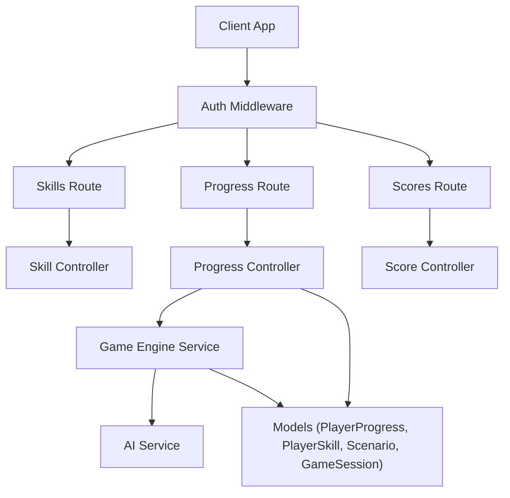
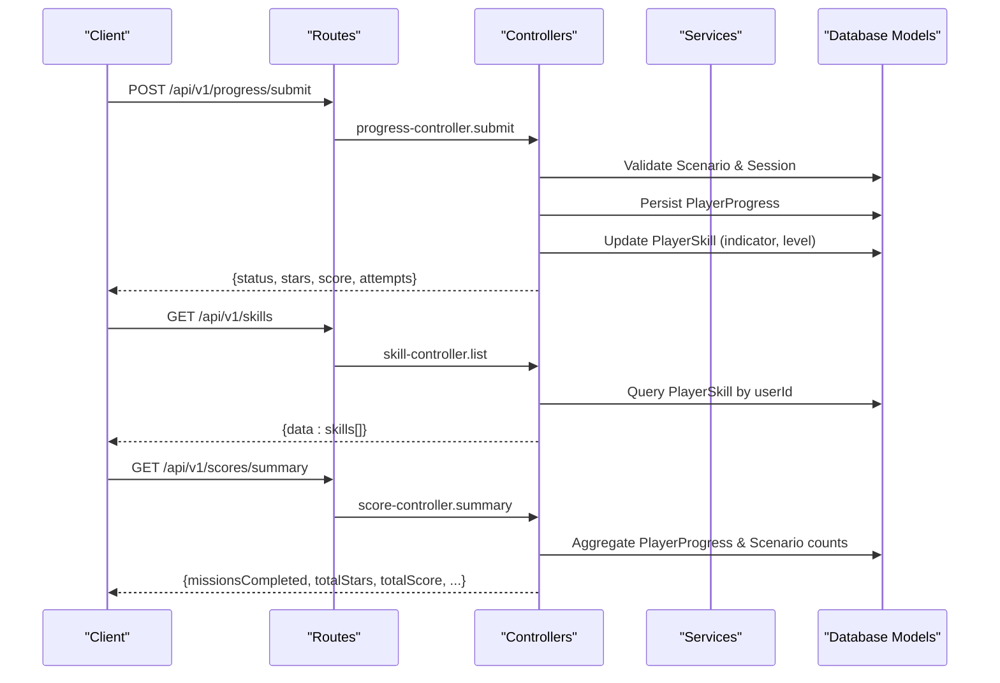
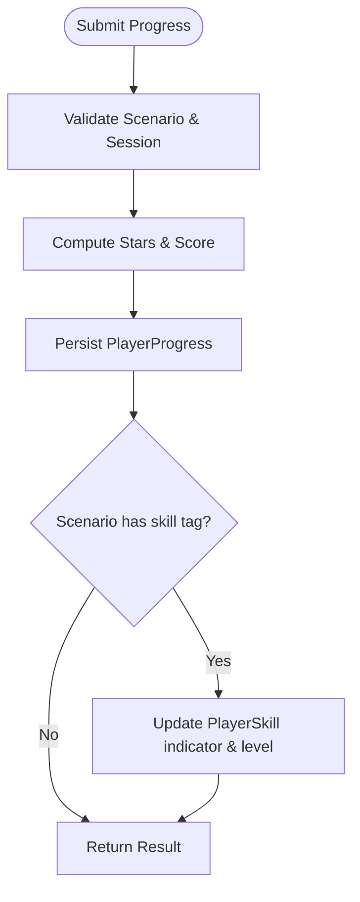
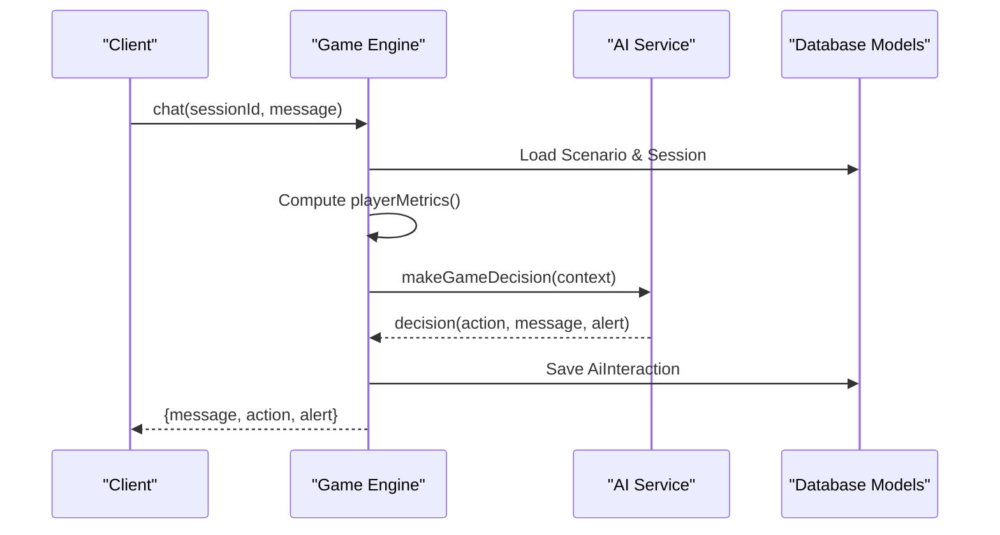
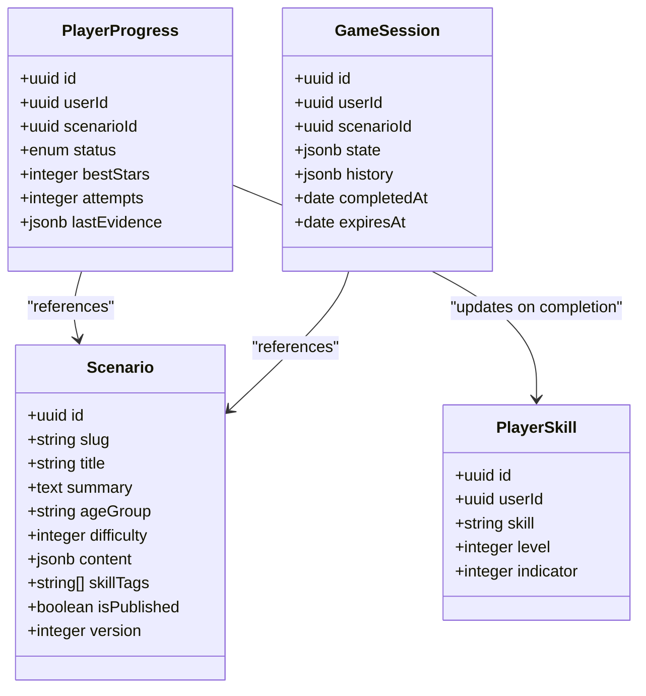
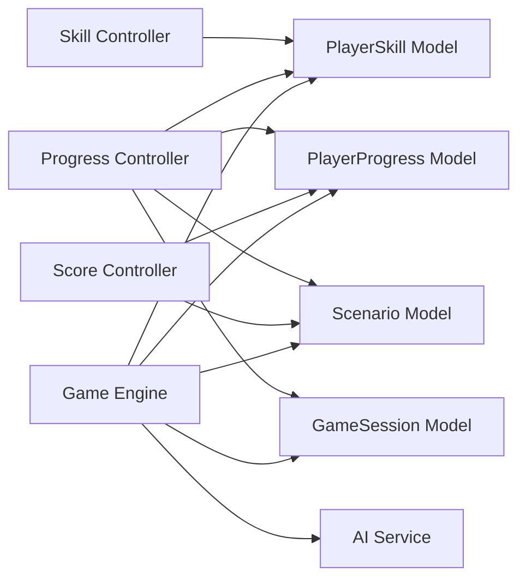

# Skill Development API

<cite>
**Referenced Files in This Document**
- [skill-controller.js](file://backend/controllers/skill-controller.js)
- [skill-routes.js](file://backend/routes/skill-routes.js)
- [progress-controller.js](file://backend/controllers/progress-controller.js)
- [progress-routes.js](file://backend/routes/progress-routes.js)
- [score-controller.js](file://backend/controllers/score-controller.js)
- [score-routes.js](file://backend/routes/score-routes.js)
- [game-engine.js](file://backend/services/game-engine.js)
- [ai-service.js](file://backend/services/ai-service.js)
- [PlayerSkill.js](file://backend/models/PlayerSkill.js)
- [PlayerProgress.js](file://backend/models/PlayerProgress.js)
- [GameSession.js](file://backend/models/GameSession.js)
- [Scenario.js](file://backend/models/Scenario.js)
- [game-schemas.js](file://backend/validators/game-schemas.js)
</cite>

## Table of Contents
1. Introduction
2. Project Structure
3. Core Components
4. Architecture Overview
5. Detailed Component Analysis
6. Dependency Analysis
7. Performance Considerations
8. Troubleshooting Guide
9. Conclusion
10. Appendices

## Introduction
This document provides comprehensive API documentation for skill development endpoints that support skill assessment, proficiency tracking, and learning path management. It covers how skills are modeled, how progress is recorded, how scores and stars are computed, and how adaptive learning features influence content delivery and recommendations. The system uses scenario-based missions to evaluate skills, updates player skill indicators and levels upon completion, and exposes endpoints to retrieve skill lists, submit progress, and obtain performance summaries.

## Project Structure
The skill development functionality spans controllers, routes, services, models, and validators:
- Routes define HTTP endpoints under /api/v1 paths for skills, progress, and scores.
- Controllers implement request handling logic and orchestrate data persistence.
- Services encapsulate game flow, metrics computation, and AI-driven decisions.
- Models define the database schema for PlayerSkill, PlayerProgress, GameSession, and Scenario.
- Validators enforce input schemas for robustness.

**Diagram sources**
- [skill-routes.js:1-9](file://backend/routes/skill-routes.js#L1-L9)
- [progress-routes.js:1-12](file://backend/routes/progress-routes.js#L1-L12)
- [score-routes.js:1-9](file://backend/routes/score-routes.js#L1-L9)
- [skill-controller.js:1-10](file://backend/controllers/skill-controller.js#L1-L10)
- [progress-controller.js:1-79](file://backend/controllers/progress-controller.js#L1-L79)
- [score-controller.js:1-24](file://backend/controllers/score-controller.js#L1-L24)
- [game-engine.js:1-124](file://backend/services/game-engine.js#L1-L124)
- [ai-service.js:1-51](file://backend/services/ai-service.js#L1-L51)

**Section sources**
- [skill-routes.js:1-9](file://backend/routes/skill-routes.js#L1-L9)
- [progress-routes.js:1-12](file://backend/routes/progress-routes.js#L1-L12)
- [score-routes.js:1-9](file://backend/routes/score-routes.js#L1-L9)

## Core Components
- Skill listing endpoint retrieves a user’s skills with their indicator and level.
- Progress submission records mission outcomes, awards stars and score, and updates skill indicators and levels.
- Score summary aggregates completed missions, total stars, total score, and win readiness.
- Game engine computes player metrics and orchestrates session lifecycle and AI interactions.
- AI service provides deterministic fallback or remote decision-making for hints, alerts, and NPC replies.

Key responsibilities:
- Skill controller: list skills for authenticated users.
- Progress controller: validate submissions, persist progress, update skills on completion.
- Score controller: compute summary metrics across all scenarios.
- Game engine: manage sessions, compute metrics, integrate AI decisions.
- AI service: decide actions based on context or fallback rules.

**Section sources**
- [skill-controller.js:1-10](file://backend/controllers/skill-controller.js#L1-L10)
- [progress-controller.js:1-79](file://backend/controllers/progress-controller.js#L1-L79)
- [score-controller.js:1-24](file://backend/controllers/score-controller.js#L1-L24)
- [game-engine.js:1-124](file://backend/services/game-engine.js#L1-L124)
- [ai-service.js:1-51](file://backend/services/ai-service.js#L1-L51)

## Architecture Overview
The skill development architecture integrates scenario-based gameplay with skill modeling and adaptive learning:
- Players complete scenarios (missions) and submit progress.
- On completion, stars and scores are awarded; skill indicators increase and levels adjust.
- Metrics such as accuracy, mistake rate, topic mastery, and challenge streak inform AI-driven responses.
- Endpoints expose skill lists, progress history, and performance summaries.

**Diagram sources**
- [progress-routes.js:1-12](file://backend/routes/progress-routes.js#L1-L12)
- [progress-controller.js:1-79](file://backend/controllers/progress-controller.js#L1-L79)
- [skill-routes.js:1-9](file://backend/routes/skill-routes.js#L1-L9)
- [skill-controller.js:1-10](file://backend/controllers/skill-controller.js#L1-L10)
- [score-routes.js:1-9](file://backend/routes/score-routes.js#L1-L9)
- [score-controller.js:1-24](file://backend/controllers/score-controller.js#L1-L24)

## Detailed Component Analysis

### Skill Assessment and Proficiency Tracking
- Skill model stores per-user skill entries with an indicator (0–100) and level (1–10).
- Progress submission updates skill indicator based on awarded stars and recalculates level.
- Metrics used for adaptive behavior include topic mastery derived from indicator, mistake rate, and challenge streak.

**Diagram sources**
- [progress-controller.js:5-71](file://backend/controllers/progress-controller.js#L5-L71)
- [PlayerSkill.js:1-15](file://backend/models/PlayerSkill.js#L1-L15)
- [PlayerProgress.js:1-17](file://backend/models/PlayerProgress.js#L1-L17)
- [Scenario.js:1-18](file://backend/models/Scenario.js#L1-L18)

**Section sources**
- [PlayerSkill.js:1-15](file://backend/models/PlayerSkill.js#L1-L15)
- [progress-controller.js:50-59](file://backend/controllers/progress-controller.js#L50-L59)
- [game-engine.js:35-49](file://backend/services/game-engine.js#L35-L49)

### Learning Path Management and Personalized Recommendations
- Adaptive learning leverages player metrics to tailor AI responses (hints, alerts, explanations).
- Context includes age group, current challenge, topic mastery, mistakes, and challenge streak.
- AI service either calls a remote decision endpoint or applies deterministic fallback rules.

**Diagram sources**
- [game-engine.js:66-121](file://backend/services/game-engine.js#L66-L121)
- [ai-service.js:18-48](file://backend/services/ai-service.js#L18-L48)
- [GameSession.js:1-15](file://backend/models/GameSession.js#L1-L15)
- [Scenario.js:1-18](file://backend/models/Scenario.js#L1-L18)

**Section sources**
- [game-engine.js:35-49](file://backend/services/game-engine.js#L35-L49)
- [game-engine.js:66-121](file://backend/services/game-engine.js#L66-L121)
- [ai-service.js:4-16](file://backend/services/ai-service.js#L4-L16)
- [ai-service.js:18-48](file://backend/services/ai-service.js#L18-L48)

### Skill Evaluation and Content Delivery
- Scenarios carry skill tags that map to skill categories.
- Completion of scenarios influences skill indicators and levels, shaping future content and AI guidance.
- Validators ensure structured inputs for starting games, performing actions, chatting, and submitting progress.

**Diagram sources**
- [PlayerSkill.js:1-15](file://backend/models/PlayerSkill.js#L1-L15)
- [PlayerProgress.js:1-17](file://backend/models/PlayerProgress.js#L1-L17)
- [GameSession.js:1-15](file://backend/models/GameSession.js#L1-L15)
- [Scenario.js:1-18](file://backend/models/Scenario.js#L1-L18)

**Section sources**
- [Scenario.js:1-18](file://backend/models/Scenario.js#L1-L18)
- [game-schemas.js:1-27](file://backend/validators/game-schemas.js#L1-L27)

### Endpoints Reference

#### Skills
- GET /api/v1/skills
  - Purpose: List all skills for the authenticated user.
  - Authentication: Required.
  - Response: Array of skills with indicator and level.
  - Notes: Ordered by indicator descending.

**Section sources**
- [skill-routes.js:1-9](file://backend/routes/skill-routes.js#L1-L9)
- [skill-controller.js:1-10](file://backend/controllers/skill-controller.js#L1-L10)

#### Progress
- POST /api/v1/progress/submit
  - Purpose: Submit mission outcome with evidence.
  - Authentication: Required.
  - Validation: Uses progressSubmitSchema.
  - Behavior: Validates scenario and session, persists progress, updates skill indicator and level on completion.
  - Response: Includes scenarioId, status, stars, score, attempts, bestStars.

- GET /api/v1/progress
  - Purpose: Retrieve progress history for the authenticated user.
  - Authentication: Required.
  - Response: Array of progress records ordered by updatedAt descending.

**Section sources**
- [progress-routes.js:1-12](file://backend/routes/progress-routes.js#L1-L12)
- [progress-controller.js:5-79](file://backend/controllers/progress-controller.js#L5-L79)
- [game-schemas.js:19-24](file://backend/validators/game-schemas.js#L19-L24)

#### Scores
- GET /api/v1/scores/summary
  - Purpose: Get aggregated performance metrics.
  - Authentication: Required.
  - Response: missionsCompleted, missionsTotal, totalStars, totalScore, perfectRuns, winReady.

**Section sources**
- [score-routes.js:1-9](file://backend/routes/score-routes.js#L1-L9)
- [score-controller.js:1-24](file://backend/controllers/score-controller.js#L1-L24)

#### Game and Chat (Supporting Skill Evaluation)
- POST /api/v1/game/start
  - Purpose: Start a new game session for a scenario.
  - Authentication: Required.
  - Validation: Uses startGameSchema.
  - Behavior: Creates GameSession with initial state and expiry.

- POST /api/v1/game/action
  - Purpose: Perform in-game actions (collect clue, choose option, complete).
  - Authentication: Required.
  - Validation: Uses gameActionSchema.
  - Behavior: Updates session state and history.

- POST /api/v1/game/chat
  - Purpose: Interact with Life Guide AI for hints and safety reinforcement.
  - Authentication: Required.
  - Validation: Uses chatSchema.
  - Behavior: Computes player metrics, constructs context, calls AI service, saves interaction.

**Section sources**
- [game-engine.js:51-64](file://backend/services/game-engine.js#L51-L64)
- [game-engine.js:66-121](file://backend/services/game-engine.js#L66-L121)
- [game-schemas.js:3-17](file://backend/validators/game-schemas.js#L3-L17)

## Dependency Analysis
- Controllers depend on models for data access and on services for complex logic.
- Game engine depends on AI service for adaptive decisions and on models for session and scenario data.
- AI service optionally depends on external AI service URL and token; falls back deterministically when disabled or unavailable.
- Validators provide strict input schemas to prevent malformed requests.

**Diagram sources**
- [skill-controller.js:1-10](file://backend/controllers/skill-controller.js#L1-L10)
- [progress-controller.js:1-79](file://backend/controllers/progress-controller.js#L1-L79)
- [score-controller.js:1-24](file://backend/controllers/score-controller.js#L1-L24)
- [game-engine.js:1-124](file://backend/services/game-engine.js#L1-L124)
- [ai-service.js:1-51](file://backend/services/ai-service.js#L1-L51)
- [PlayerSkill.js:1-15](file://backend/models/PlayerSkill.js#L1-L15)
- [PlayerProgress.js:1-17](file://backend/models/PlayerProgress.js#L1-L17)
- [GameSession.js:1-15](file://backend/models/GameSession.js#L1-L15)
- [Scenario.js:1-18](file://backend/models/Scenario.js#L1-L18)

**Section sources**
- [game-engine.js:1-124](file://backend/services/game-engine.js#L1-L124)
- [ai-service.js:1-51](file://backend/services/ai-service.js#L1-L51)

## Performance Considerations
- Use indexes on unique constraints (userId+skill, userId+scenarioId) to optimize lookups.
- Limit queries to necessary fields and avoid N+1 patterns by batching where possible.
- Cache frequently accessed scenario metadata if needed.
- Set appropriate timeouts for AI service calls to prevent blocking requests.
- Normalize and sanitize JSON payloads to reduce storage overhead.

[No sources needed since this section provides general guidance]

## Troubleshooting Guide
Common issues and resolutions:
- Scenario not found: Ensure the scenario exists and is published before starting or submitting progress.
- Session not found: Verify sessionId matches an active session for the user and scenario.
- Session incomplete: Complete the mission in-game before submitting progress with status 'completed'.
- AI decision unavailable: When AI is disabled or times out, deterministic fallback provides hints, alerts, and NPC replies.

Error codes and messages originate from application error utilities and controller validations.

**Section sources**
- [progress-controller.js:5-15](file://backend/controllers/progress-controller.js#L5-L15)
- [ai-service.js:18-48](file://backend/services/ai-service.js#L18-L48)

## Conclusion
The Skill Development API provides a robust framework for assessing skills, tracking proficiency, and managing personalized learning paths through scenario-based missions. Progress submissions drive skill indicator updates and level progression, while adaptive AI enhances content delivery and guidance. Endpoints for skills, progress, and scores enable comprehensive monitoring and reporting of learner outcomes.

[No sources needed since this section summarizes without analyzing specific files]

## Appendices

### Data Models Summary
- PlayerSkill: Tracks per-user skill proficiency via indicator (0–100) and level (1–10).
- PlayerProgress: Records mission status, best stars, attempts, and last evidence including selected option and score.
- GameSession: Holds session state, history, completion timestamp, and expiration.
- Scenario: Defines mission content, skill tags, difficulty, and publication status.

**Section sources**
- [PlayerSkill.js:1-15](file://backend/models/PlayerSkill.js#L1-L15)
- [PlayerProgress.js:1-17](file://backend/models/PlayerProgress.js#L1-L17)
- [GameSession.js:1-15](file://backend/models/GameSession.js#L1-L15)
- [Scenario.js:1-18](file://backend/models/Scenario.js#L1-L18)

### Example Workflows

#### Skill Assessment Workflow
- Start a game session for a scenario.
- Collect clues and choose options within the session.
- Submit progress with status and evidence.
- Receive stars and score; skill indicator increases and level updates on completion.

**Section sources**
- [game-engine.js:51-64](file://backend/services/game-engine.js#L51-L64)
- [progress-controller.js:5-71](file://backend/controllers/progress-controller.js#L5-L71)

#### Progress Report and Personalized Learning Path
- Retrieve progress history to review past attempts and outcomes.
- Obtain score summary to assess overall performance and readiness.
- Use chat to receive hints or safety alerts tailored to mistakes and mastery.

**Section sources**
- [progress-routes.js:1-12](file://backend/routes/progress-routes.js#L1-L12)
- [score-routes.js:1-9](file://backend/routes/score-routes.js#L1-L9)
- [game-engine.js:66-121](file://backend/services/game-engine.js#L66-L121)
- [ai-service.js:4-16](file://backend/services/ai-service.js#L4-L16)