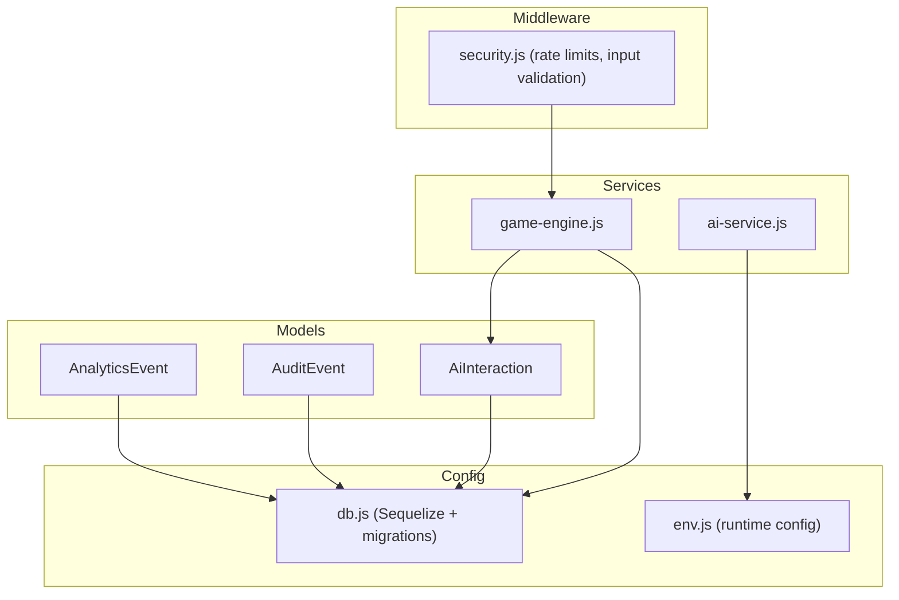
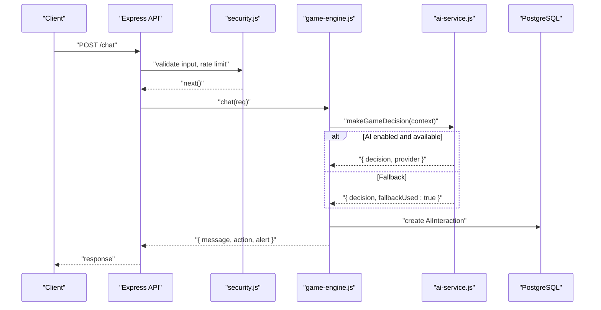
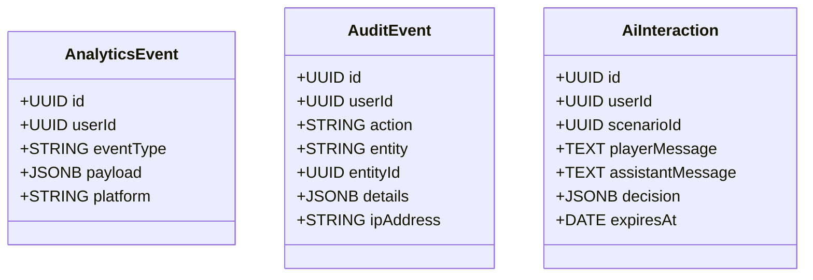
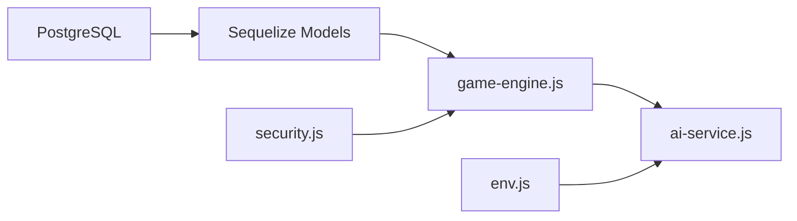

# Analytics & Audit Models

<cite>
**Referenced Files in This Document**
- [AnalyticsEvent.js](file://backend/models/AnalyticsEvent.js)
- [AuditEvent.js](file://backend/models/AuditEvent.js)
- [AiInteraction.js](file://backend/models/AiInteraction.js)
- [index.js](file://backend/models/index.js)
- [db.js](file://backend/config/db.js)
- [game-engine.js](file://backend/services/game-engine.js)
- [ai-service.js](file://backend/services/ai-service.js)
- [security.js](file://backend/middleware/security.js)
- [env.js](file://backend/config/env.js)
</cite>

## Table of Contents
1. Introduction
2. Project Structure
3. Core Components
4. Architecture Overview
5. Detailed Component Analysis
6. Dependency Analysis
7. Performance Considerations
8. Troubleshooting Guide
9. Conclusion
10. Appendices

## Introduction
This document provides comprehensive data model documentation for analytics and audit tracking entities: AnalyticsEvent, AuditEvent, and AiInteraction. It explains event schemas, timestamp handling, retention policies, user behavior analysis patterns, system audit trails, AI interaction logging, categorization strategies, metadata storage, query optimization techniques, sample queries, privacy considerations, anonymization practices, compliance requirements, and guidelines for extending event tracking with custom analytics.

## Project Structure
The analytics and audit models are defined as Sequelize models and integrated into the application via a central index that exposes them to services and controllers. Database connectivity and migration execution are configured centrally.

**Diagram sources**
- [AnalyticsEvent.js:4-10](file://backend/models/AnalyticsEvent.js#L4-L10)
- [AuditEvent.js:4-12](file://backend/models/AuditEvent.js#L4-L12)
- [AiInteraction.js:4-12](file://backend/models/AiInteraction.js#L4-L12)
- [db.js:7-13](file://backend/config/db.js#L7-L13)
- [game-engine.js:107-114](file://backend/services/game-engine.js#L107-L114)
- [ai-service.js:18-47](file://backend/services/ai-service.js#L18-L47)
- [security.js:23-45](file://backend/middleware/security.js#L23-L45)

**Section sources**
- [db.js:7-13](file://backend/config/db.js#L7-L13)
- [index.js:9-11](file://backend/models/index.js#L9-L11)

## Core Components
- AnalyticsEvent: Captures user behavior events with flexible JSONB payload for extensibility.
- AuditEvent: Records security-relevant actions with entity context and optional IP address.
- AiInteraction: Logs AI-assisted interactions including messages, decisions, and expiration policy.

Key schema highlights:
- All models use UUID primary keys.
- JSONB fields store rich metadata without schema rigidity.
- Timestamps and expiration fields support lifecycle management and retention.

**Section sources**
- [AnalyticsEvent.js:4-10](file://backend/models/AnalyticsEvent.js#L4-L10)
- [AuditEvent.js:4-12](file://backend/models/AuditEvent.js#L4-L12)
- [AiInteraction.js:4-12](file://backend/models/AiInteraction.js#L4-L12)

## Architecture Overview
The game engine orchestrates AI-driven interactions and persists logs to the database. The AI service can be enabled or disabled; when disabled, deterministic fallback logic is used. Security middleware enforces rate limits and input validation before requests reach business logic.

**Diagram sources**
- [game-engine.js:66-120](file://backend/services/game-engine.js#L66-L120)
- [ai-service.js:18-47](file://backend/services/ai-service.js#L18-L47)
- [security.js:23-45](file://backend/middleware/security.js#L23-L45)

## Detailed Component Analysis

### AnalyticsEvent Model
Purpose: Track user behavior events with a flexible payload.

Schema overview:
- id: UUID primary key
- userId: UUID (optional)
- eventType: string (required)
- payload: JSONB (default empty object)
- platform: string (optional)

Usage patterns:
- Categorize events by eventType (e.g., "scenario_start", "option_selected", "hint_requested").
- Store contextual metadata in payload (e.g., scenarioId, optionId, device info).
- Use platform to segment analytics by client type.

Query optimization tips:
- Add indexes on eventType and userId for frequent filters.
- Partition by time if high volume (e.g., monthly partitions).
- Keep payload minimal; avoid deeply nested structures for large payloads.

Sample queries:
- Count events by type over last 7 days:
  - SELECT eventType, COUNT(*) FROM "AnalyticsEvent" WHERE "createdAt" >= NOW() - INTERVAL '7 days' GROUP BY eventType;
- Top users by event count:
  - SELECT userId, COUNT(*) AS event_count FROM "AnalyticsEvent" WHERE "createdAt" >= NOW() - INTERVAL '30 days' GROUP BY userId ORDER BY event_count DESC LIMIT 20;

Retention policy:
- No explicit TTL in model; implement periodic cleanup jobs to archive or delete old records based on business policy.

Privacy considerations:
- Avoid storing PII in payload; use hashed identifiers where possible.
- Mask sensitive fields in logs and reports.

**Section sources**
- [AnalyticsEvent.js:4-10](file://backend/models/AnalyticsEvent.js#L4-L10)

### AuditEvent Model
Purpose: Record security-relevant actions for compliance and incident response.

Schema overview:
- id: UUID primary key
- userId: UUID (optional)
- action: string (required)
- entity: string (optional)
- entityId: UUID (optional)
- details: JSONB (default empty object)
- ipAddress: string (optional)

Usage patterns:
- Log actions like "login", "password_change", "resource_access".
- Include entity and entityId to tie actions to specific resources.
- Capture request context in details (e.g., headers, user agent).

Query optimization tips:
- Index on action and createdAt for fast filtering.
- Consider composite indexes on (action, createdAt) for common queries.

Sample queries:
- Recent failed login attempts per IP:
  - SELECT ipAddress, COUNT(*) AS attempts FROM "AuditEvent" WHERE action = 'login_failed' AND "createdAt" >= NOW() - INTERVAL '1 hour' GROUP BY ipAddress HAVING COUNT(*) > 5;
- Audit trail for a resource:
  - SELECT * FROM "AuditEvent" WHERE entity = 'Scenario' AND entityId = '<id>' ORDER BY "createdAt" DESC;

Retention policy:
- Retain for compliance periods (e.g., 1–3 years); archive older records to cold storage.

Privacy considerations:
- Redact or hash IPs in non-security contexts; enforce strict access controls.

**Section sources**
- [AuditEvent.js:4-12](file://backend/models/AuditEvent.js#L4-L12)

### AiInteraction Model
Purpose: Persist AI-assisted interactions for analysis, debugging, and safety review.

Schema overview:
- id: UUID primary key
- userId: UUID (required)
- scenarioId: UUID (required)
- playerMessage: text (required)
- assistantMessage: text (required)
- decision: JSONB (default empty object)
- expiresAt: date (required)

Usage patterns:
- Log each chat turn with full context (messages and decision).
- Use expiresAt to enforce short-term retention for privacy and storage costs.
- Analyze decisions to improve prompts and fallback logic.

Query optimization tips:
- Index on userId and scenarioId for session-based retrieval.
- Add index on expiresAt for cleanup jobs.

Sample queries:
- Interactions for a user in last 7 days:
  - SELECT * FROM "AiInteraction" WHERE userId = '<id>' AND "expiresAt" > NOW() - INTERVAL '7 days' ORDER BY "createdAt" DESC;
- Most frequent decision actions:
  - SELECT (decision->>'action')::text AS action, COUNT(*) AS cnt FROM "AiInteraction" GROUP BY action ORDER BY cnt DESC;

Retention policy:
- Automatic deletion after expiresAt; schedule a job to purge expired rows.

Privacy considerations:
- Anonymize or pseudonymize userId in reports; mask messages in logs.

**Section sources**
- [AiInteraction.js:4-12](file://backend/models/AiInteraction.js#L4-L12)
- [game-engine.js:107-114](file://backend/services/game-engine.js#L107-L114)

### Data Relationships and Exposure
All three models are exported from the models index and can be used across services and routes.

**Diagram sources**
- [AnalyticsEvent.js:4-10](file://backend/models/AnalyticsEvent.js#L4-L10)
- [AuditEvent.js:4-12](file://backend/models/AuditEvent.js#L4-L12)
- [AiInteraction.js:4-12](file://backend/models/AiInteraction.js#L4-L12)
- [index.js:9-11](file://backend/models/index.js#L9-L11)

**Section sources**
- [index.js:9-11](file://backend/models/index.js#L9-L11)

## Dependency Analysis
- Models depend on Sequelize configuration and PostgreSQL.
- Game engine depends on AiInteraction model and AI service integration.
- AI service uses environment configuration to enable/disable external calls and apply fallback logic.
- Security middleware applies rate limiting and input validation to protect endpoints that may write to these models.

**Diagram sources**
- [db.js:7-13](file://backend/config/db.js#L7-L13)
- [game-engine.js:107-114](file://backend/services/game-engine.js#L107-L114)
- [ai-service.js:18-47](file://backend/services/ai-service.js#L18-L47)
- [env.js:6-31](file://backend/config/env.js#L6-L31)
- [security.js:23-45](file://backend/middleware/security.js#L23-L45)

**Section sources**
- [db.js:7-13](file://backend/config/db.js#L7-L13)
- [env.js:6-31](file://backend/config/env.js#L6-L31)
- [security.js:23-45](file://backend/middleware/security.js#L23-L45)

## Performance Considerations
- Indexing:
  - AnalyticsEvent: eventType, userId, createdAt
  - AuditEvent: action, createdAt, (action, createdAt)
  - AiInteraction: userId, scenarioId, expiresAt
- Query patterns:
  - Prefer time-bounded queries using createdAt or expiresAt.
  - Use selective payload fields to reduce I/O.
- Storage:
  - Implement partitioning by time for high-volume tables.
  - Archive old records to cheaper storage.
- Rate limiting:
  - Apply write limits to prevent abuse and ensure stability.

[No sources needed since this section provides general guidance]

## Troubleshooting Guide
Common issues and mitigations:
- AI service unavailability:
  - Deterministic fallback ensures continuity; check logs for fallback usage.
- Excessive writes:
  - Enforce rate limits; monitor error responses for throttling.
- Input validation failures:
  - Reject unsafe inputs early; log request IDs for tracing.

Operational checks:
- Verify database connection and SSL settings.
- Confirm environment flags for AI feature toggles.
- Review rate limiter configurations and adjust thresholds as needed.

**Section sources**
- [ai-service.js:18-47](file://backend/services/ai-service.js#L18-L47)
- [security.js:23-45](file://backend/middleware/security.js#L23-L45)
- [db.js:7-13](file://backend/config/db.js#L7-L13)
- [env.js:6-31](file://backend/config/env.js#L6-L31)

## Conclusion
The analytics and audit models provide a robust foundation for tracking user behavior, maintaining secure audit trails, and logging AI interactions with clear retention policies. By applying indexing, partitioning, and careful payload design, the system can scale while preserving privacy and compliance. Extending event tracking involves adding new event types and enriching payloads, while adhering to governance and security standards.

[No sources needed since this section summarizes without analyzing specific files]

## Appendices

### Event Categorization Guidelines
- AnalyticsEvent:
  - eventType taxonomy: navigation, interaction, completion, error, hint, scoring.
  - payload structure: include contextual identifiers (scenarioId, optionId), timestamps, device/platform hints.
- AuditEvent:
  - action taxonomy: auth, admin, data_access, config_change.
  - details: capture relevant request metadata without PII.
- AiInteraction:
  - decision fields: action, message, alert, confidence, reason.

### Timestamp Handling
- Use UTC timestamps consistently.
- Leverage expiresAt for automatic cleanup of transient data.
- Ensure createdAt fields exist for historical analysis (add indexes accordingly).

### Data Retention Policies
- AnalyticsEvent: retain for reporting windows (e.g., 90 days) then archive.
- AuditEvent: retain per compliance (e.g., 1–3 years).
- AiInteraction: expire after short window (e.g., 7 days) to minimize storage and risk.

### Privacy, Anonymization, and Compliance
- Minimize PII in payloads; prefer hashed identifiers.
- Mask or tokenize sensitive fields in logs and exports.
- Enforce role-based access to audit and analytics data.
- Comply with regional regulations (e.g., data minimization, right to erasure).

### Query Optimization Techniques
- Time-bounded queries with indexes on createdAt/expiresAt.
- Selective field projection to reduce payload size.
- Aggregations precomputed via materialized views for dashboards.
- Partitioning by month/quarter for large tables.

### Sample Queries
- Analytics reporting:
  - Daily active users: SELECT DATE("createdAt") AS day, COUNT(DISTINCT userId) FROM "AnalyticsEvent" GROUP BY day ORDER BY day;
  - Feature adoption: SELECT eventType, COUNT(*) FROM "AnalyticsEvent" WHERE "createdAt" >= NOW() - INTERVAL '30 days' GROUP BY eventType;
- Audit trail generation:
  - User activity timeline: SELECT action, details, "createdAt" FROM "AuditEvent" WHERE userId = '<id>' ORDER BY "createdAt" DESC;
  - Suspicious activity: SELECT ipAddress, COUNT(*) FROM "AuditEvent" WHERE action IN ('login_failed','admin_access') GROUP BY ipAddress HAVING COUNT(*) > 10;
- AI interaction analysis:
  - Decision distribution: SELECT (decision->>'action')::text AS action, COUNT(*) FROM "AiInteraction" GROUP BY action;
  - Interaction volume by scenario: SELECT scenarioId, COUNT(*) FROM "AiInteraction" GROUP BY scenarioId ORDER BY COUNT(*) DESC;

### Extending Event Tracking and Custom Analytics
- Add new event types under AnalyticsEvent with descriptive eventType values.
- Enrich payload with consistent schema conventions (e.g., versioned payload objects).
- Introduce new audit actions in AuditEvent with structured details.
- Extend AiInteraction decision schema to capture new AI behaviors.
- Implement background jobs for aggregation, archiving, and cleanup.
- Validate inputs and enforce rate limits at API boundaries.

**Section sources**
- [AnalyticsEvent.js:4-10](file://backend/models/AnalyticsEvent.js#L4-L10)
- [AuditEvent.js:4-12](file://backend/models/AuditEvent.js#L4-L12)
- [AiInteraction.js:4-12](file://backend/models/AiInteraction.js#L4-L12)
- [game-engine.js:107-114](file://backend/services/game-engine.js#L107-L114)
- [security.js:23-45](file://backend/middleware/security.js#L23-L45)