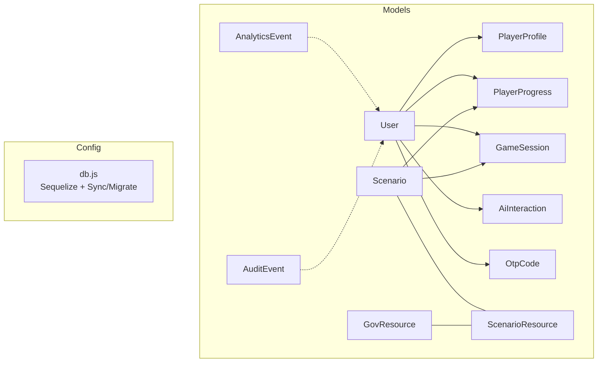
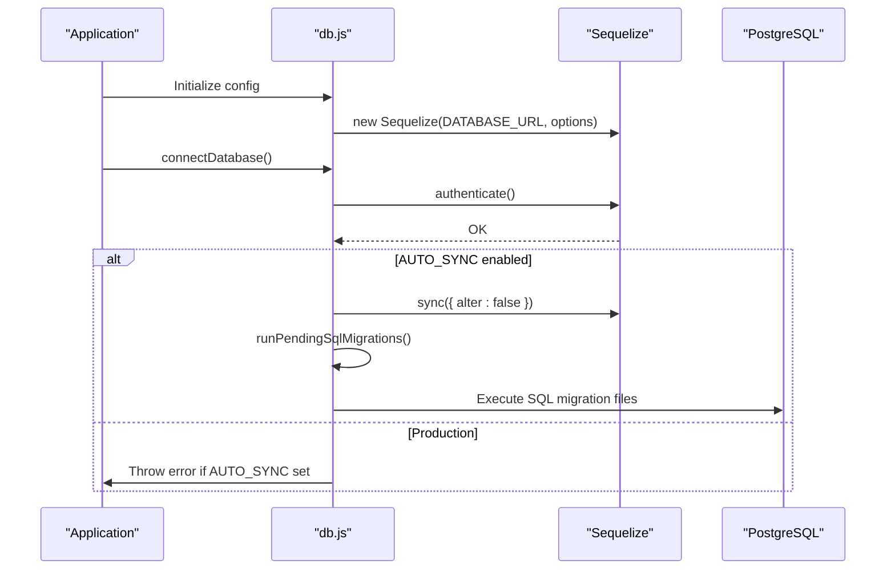
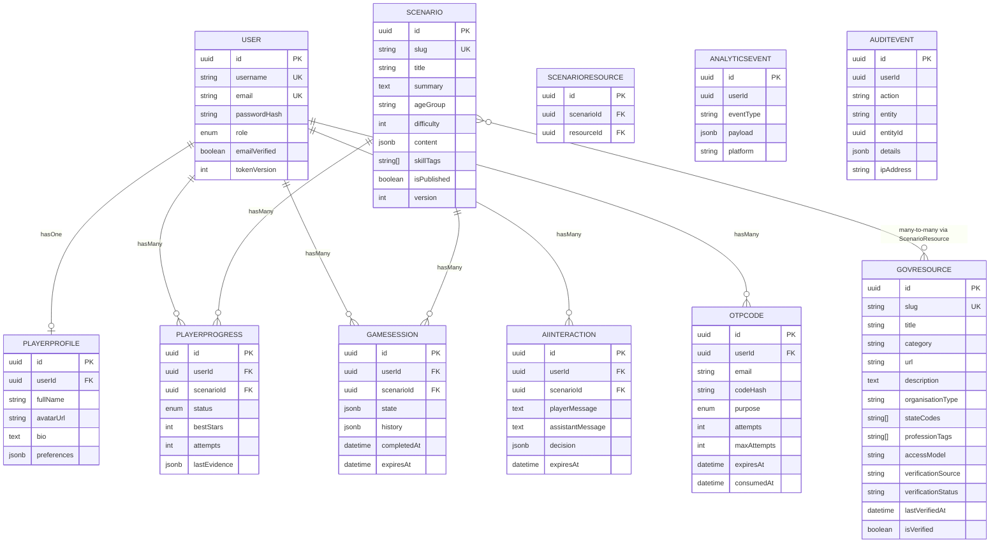
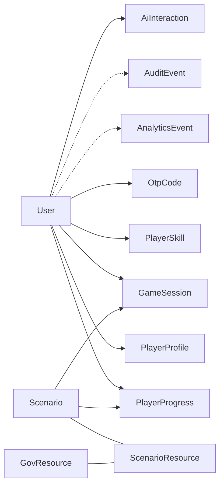

# Database Schema & Data Models

<cite>
**Referenced Files in This Document**
- [models/index.js](file://backend/models/index.js)
- [models/User.js](file://backend/models/User.js)
- [models/PlayerProfile.js](file://backend/models/PlayerProfile.js)
- [models/PlayerProgress.js](file://backend/models/PlayerProgress.js)
- [models/GameSession.js](file://backend/models/GameSession.js)
- [models/Scenario.js](file://backend/models/Scenario.js)
- [models/GovResource.js](file://backend/models/GovResource.js)
- [models/ScenarioResource.js](file://backend/models/ScenarioResource.js)
- [models/AnalyticsEvent.js](file://backend/models/AnalyticsEvent.js)
- [models/AuditEvent.js](file://backend/models/AuditEvent.js)
- [models/AiInteraction.js](file://backend/models/AiInteraction.js)
- [models/OtpCode.js](file://backend/models/OtpCode.js)
- [config/db.js](file://backend/config/db.js)
</cite>

## Table of Contents
1. Introduction
2. Project Structure
3. Core Components
4. Architecture Overview
5. Detailed Component Analysis
6. Dependency Analysis
7. Performance Considerations
8. Troubleshooting Guide
9. Conclusion
10. Appendices

## Introduction
This document provides a comprehensive data model and schema reference for the application’s PostgreSQL database, implemented with Sequelize ORM. It covers all core entities (User profiles, PlayerProgress, GameSessions, Scenarios, Resources), their relationships, constraints, indexes, validation rules, migration strategy, data access patterns, query optimization, caching strategies, transactions, backup/recovery procedures, security measures, and guidelines for extending the schema while maintaining backward compatibility.

## Project Structure
The data models are defined as Sequelize models under backend/models, with relationship definitions centralized in backend/models/index.js. The database connection and synchronization/migration logic reside in backend/config/db.js.

**Diagram sources**
- [models/index.js:14-29](file://backend/models/index.js#L14-L29)
- [config/db.js:7-23](file://backend/config/db.js#L7-L23)

**Section sources**
- [models/index.js:1-32](file://backend/models/index.js#L1-L32)
- [config/db.js:1-45](file://backend/config/db.js#L1-L45)

## Core Components
This section summarizes each entity’s purpose, key fields, and notable constraints or validations.

- User
  - Purpose: Authentication and authorization identity; role-based access control.
  - Key fields: UUID primary key, unique username/email, password hash, role enum, email verification flag, token version.
  - Validation: Email format enforced at model level; default scopes exclude sensitive fields by default.
  - Security: Passwords stored as hashes; comparePassword method provided.

- PlayerProfile
  - Purpose: Extended user profile metadata.
  - Key fields: UUID PK, userId FK, optional fullName/avatarUrl/bio, JSONB preferences.
  - Relationship: One-to-one with User via userId.

- Scenario
  - Purpose: Curated learning scenarios with content and metadata.
  - Key fields: Unique slug, title, summary, ageGroup, difficulty, JSONB content, string array skillTags, publish flag, version.
  - Relationships: Many-to-many with GovResource through ScenarioResource; one-to-many with PlayerProgress and GameSession.

- GovResource
  - Purpose: Catalog of government resources linked to scenarios.
  - Key fields: Unique slug, title, category, url, description, organization type, state codes array, profession tags, access model, verification fields, boolean isVerified.
  - Relationships: Many-to-many with Scenario through ScenarioResource.

- ScenarioResource
  - Purpose: Join table for Scenario-GovResource many-to-many.
  - Key fields: UUID PK, scenarioId FK, resourceId FK.

- PlayerProgress
  - Purpose: Tracks per-user completion status and performance per scenario.
  - Key fields: UUID PK, userId FK, scenarioId FK, status enum, bestStars integer, attempts integer, JSONB lastEvidence.
  - Indexes: Unique composite index on (userId, scenarioId).

- GameSession
  - Purpose: Ephemeral session state for active gameplay.
  - Key fields: UUID PK, userId FK, scenarioId FK, JSONB state/history, completedAt timestamp, non-null expiresAt.

- AnalyticsEvent
  - Purpose: Event-driven analytics capture.
  - Key fields: UUID PK, optional userId, eventType required, JSONB payload, platform string.

- AuditEvent
  - Purpose: Immutable audit trail for administrative and system actions.
  - Key fields: UUID PK, optional userId, action required, entity/entityId, JSONB details, ipAddress.

- AiInteraction
  - Purpose: Records AI-assisted interactions within scenarios.
  - Key fields: UUID PK, userId FK, scenarioId FK, playerMessage, assistantMessage, JSONB decision, non-null expiresAt.

- OtpCode
  - Purpose: Time-bound, hashed OTP storage for login/register flows.
  - Key fields: UUID PK, userId FK, email, codeHash, purpose enum, attempts/maxAttempts, expiresAt, consumedAt.
  - Indexes: Composite on (userId, purpose) and on expiresAt.

**Section sources**
- [models/User.js:5-16](file://backend/models/User.js#L5-L16)
- [models/PlayerProfile.js:4-11](file://backend/models/PlayerProfile.js#L4-L11)
- [models/Scenario.js:4-15](file://backend/models/Scenario.js#L4-L15)
- [models/GovResource.js:4-19](file://backend/models/GovResource.js#L4-L19)
- [models/ScenarioResource.js:4-8](file://backend/models/ScenarioResource.js#L4-L8)
- [models/PlayerProgress.js:4-14](file://backend/models/PlayerProgress.js#L4-L14)
- [models/GameSession.js:4-12](file://backend/models/GameSession.js#L4-L12)
- [models/AnalyticsEvent.js:4-10](file://backend/models/AnalyticsEvent.js#L4-L10)
- [models/AuditEvent.js:4-12](file://backend/models/AuditEvent.js#L4-L12)
- [models/AiInteraction.js:4-12](file://backend/models/AiInteraction.js#L4-L12)
- [models/OtpCode.js:4-19](file://backend/models/OtpCode.js#L4-L19)

## Architecture Overview
The data layer uses Sequelize to define models and relationships, with PostgreSQL as the underlying dialect. Connection pooling, SSL options, and logging are configured centrally. In development, automatic schema sync can be enabled; in production, migrations must be used. SQL migration files are executed at startup when AUTO_SYNC is enabled.

**Diagram sources**
- [config/db.js:7-23](file://backend/config/db.js#L7-L23)
- [config/db.js:31-42](file://backend/config/db.js#L31-L42)

**Section sources**
- [config/db.js:1-45](file://backend/config/db.js#L1-L45)

## Detailed Component Analysis

### Entity Relationship Model
The following diagram maps the core entities and their relationships as defined in the models index.

**Diagram sources**
- [models/index.js:14-29](file://backend/models/index.js#L14-L29)
- [models/User.js:5-16](file://backend/models/User.js#L5-L16)
- [models/PlayerProfile.js:4-11](file://backend/models/PlayerProfile.js#L4-L11)
- [models/Scenario.js:4-15](file://backend/models/Scenario.js#L4-L15)
- [models/GovResource.js:4-19](file://backend/models/GovResource.js#L4-L19)
- [models/ScenarioResource.js:4-8](file://backend/models/ScenarioResource.js#L4-L8)
- [models/PlayerProgress.js:4-14](file://backend/models/PlayerProgress.js#L4-L14)
- [models/GameSession.js:4-12](file://backend/models/GameSession.js#L4-L12)
- [models/AnalyticsEvent.js:4-10](file://backend/models/AnalyticsEvent.js#L4-L10)
- [models/AuditEvent.js:4-12](file://backend/models/AuditEvent.js#L4-L12)
- [models/AiInteraction.js:4-12](file://backend/models/AiInteraction.js#L4-L12)
- [models/OtpCode.js:4-19](file://backend/models/OtpCode.js#L4-L19)

### Data Access Patterns and Query Optimization
- Prefer scoped queries to avoid loading sensitive attributes (e.g., default scope excludes passwordHash/tokenVersion).
- Use includes judiciously to reduce N+1 queries; pre-load related records where necessary.
- Leverage existing indexes:
  - Unique composite index on PlayerProgress(userId, scenarioId) ensures fast lookups and prevents duplicate progress entries.
  - Unique indexes on User.username/email and Scenario.slug support efficient joins and lookups.
  - OtpCode indexes on (userId, purpose) and expiresAt optimize OTP retrieval and cleanup.
- For large JSONB payloads (state, history, lastEvidence, payload, details), consider:
  - Selecting only needed fields using Sequelize’s attributes option.
  - Using PostgreSQL JSONB operators for filtering when appropriate.
  - Archiving or pruning expired sessions and events periodically.

[No sources needed since this section provides general guidance]

### Caching Strategies
- Session-level caching: Cache frequently read scenario metadata and resource catalogs in an in-memory cache (e.g., Redis) with short TTLs to reduce DB load.
- Read-heavy analytics: Aggregate daily/hourly metrics into materialized views or summary tables; serve from cache.
- Eviction policies: Invalidate caches on write operations (e.g., scenario updates, resource changes).

[No sources needed since this section provides general guidance]

### Transactions and Error Handling
- Wrap multi-step writes (e.g., creating a GameSession and recording initial progress) in transactions to ensure atomicity.
- Handle constraint violations (unique keys, foreign keys) gracefully and return meaningful errors to clients.
- Log failures with correlation IDs for observability.

[No sources needed since this section provides general guidance]

### Backup and Recovery Procedures
- Schedule regular logical backups (e.g., pg_dump) of the PostgreSQL instance.
- Maintain point-in-time recovery (WAL archiving) for critical environments.
- Test restore procedures regularly to validate integrity and RTO/RPO targets.
- Encrypt backups at rest and in transit.

[No sources needed since this section provides general guidance]

### Security Measures
- Authentication and Authorization:
  - Store passwords as hashes; use bcrypt.compare for verification.
  - Enforce role-based access (player/admin) at API boundaries.
- Data Protection:
  - Use HTTPS/TLS for client connections; enable DB SSL in production via configuration.
  - Hash OTP codes before storage; enforce expiration and attempt limits.
- Privacy Compliance:
  - Minimize collection of PII; mask logs for sensitive fields.
  - Provide mechanisms to export/delete user data upon request.
- Auditability:
  - Record admin and sensitive actions in AuditEvent with IP address and details.

**Section sources**
- [models/User.js:5-20](file://backend/models/User.js#L5-L20)
- [models/OtpCode.js:4-19](file://backend/models/OtpCode.js#L4-L19)
- [config/db.js:7-12](file://backend/config/db.js#L7-L12)

### Extending the Schema and Backward Compatibility
- Add new entities as new model files and register relationships in models/index.js.
- Use migrations to evolve schema safely; avoid relying on AUTO_SYNC in production.
- Preserve backward compatibility:
  - Add nullable columns with defaults rather than altering existing columns.
  - Introduce new enums carefully; avoid changing existing values.
  - Version content-rich entities (e.g., Scenario.version) to support rollbacks and feature flags.
- Update default scopes and API responses gradually to avoid breaking clients.

[No sources needed since this section provides general guidance]

## Dependency Analysis
Relationships and dependencies among models are centralized in the models index file.

**Diagram sources**
- [models/index.js:14-29](file://backend/models/index.js#L14-L29)

**Section sources**
- [models/index.js:1-32](file://backend/models/index.js#L1-L32)

## Performance Considerations
- Connection Pooling: Configured pool size and timeouts to handle concurrent requests efficiently.
- Query Efficiency:
  - Use selective attributes to minimize payload sizes.
  - Utilize indexes on high-cardinality and frequently filtered columns.
- Storage Optimization:
  - Archive or purge expired GameSession and AiInteraction records based on expiresAt.
  - Periodically clean consumed/expired OTP codes.
- Monitoring:
  - Enable slow query logging and track query latency.
  - Monitor connection pool utilization and adjust pool settings as needed.

**Section sources**
- [config/db.js:7-13](file://backend/config/db.js#L7-L13)

## Troubleshooting Guide
- Connection Issues:
  - Verify DATABASE_URL and SSL settings; check authentication success logs.
- Migration Errors:
  - Ensure AUTO_SYNC is disabled in production; apply SQL migration files manually if needed.
- Constraint Violations:
  - Duplicate usernames/emails or scenario slugs will fail inserts; validate inputs upstream.
  - Foreign key mismatches indicate referential integrity issues; verify related records exist.
- Performance Degradation:
  - Inspect missing indexes; add targeted indexes for hot paths.
  - Reduce JSONB payload sizes or archive historical data.

**Section sources**
- [config/db.js:15-28](file://backend/config/db.js#L15-L28)
- [config/db.js:31-42](file://backend/config/db.js#L31-L42)

## Conclusion
The data model is designed for scalability, clarity, and maintainability. Centralized relationship definitions, explicit indexes, and careful use of JSONB enable flexible yet performant data access. Migrations and secure defaults protect data integrity and privacy. Following the recommended practices for transactions, caching, and backups will ensure robust operation in production.

## Appendices

### Sample Queries (Conceptual)
- Get a user’s current game session for a scenario:
  - Find GameSession by userId and scenarioId where expiresAt is in the future.
- Retrieve a scenario with its associated resources:
  - Load Scenario with included GovResource via ScenarioResource join.
- Record an analytics event:
  - Insert AnalyticsEvent with eventType and payload; optionally associate userId and platform.
- Create or update player progress:
  - Upsert PlayerProgress ensuring uniqueness on (userId, scenarioId); update status, bestStars, attempts, lastEvidence.

[No sources needed since this section provides conceptual examples]

### Migration Strategy
- Development:
  - AUTO_SYNC may be enabled to auto-create/update schema; not allowed in production.
- Production:
  - Use SQL migration files executed at startup when AUTO_SYNC is enabled; otherwise, manage migrations externally and apply them during deployments.

**Section sources**
- [config/db.js:19-23](file://backend/config/db.js#L19-L23)
- [config/db.js:31-42](file://backend/config/db.js#L31-L42)