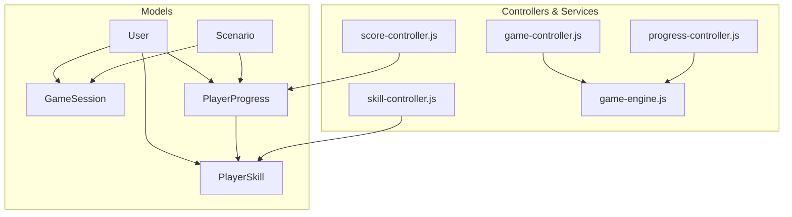
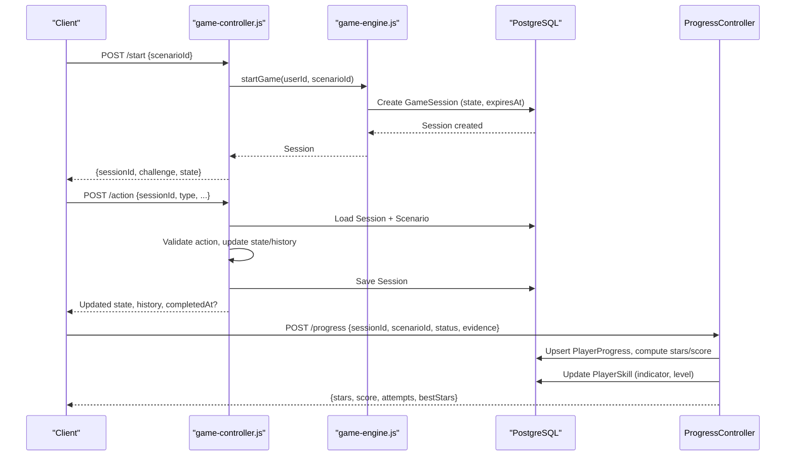
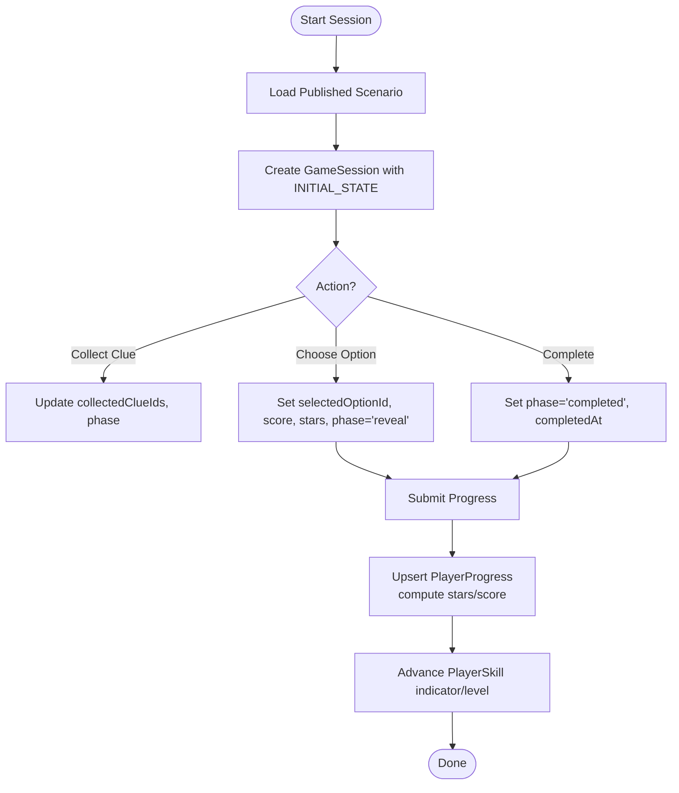
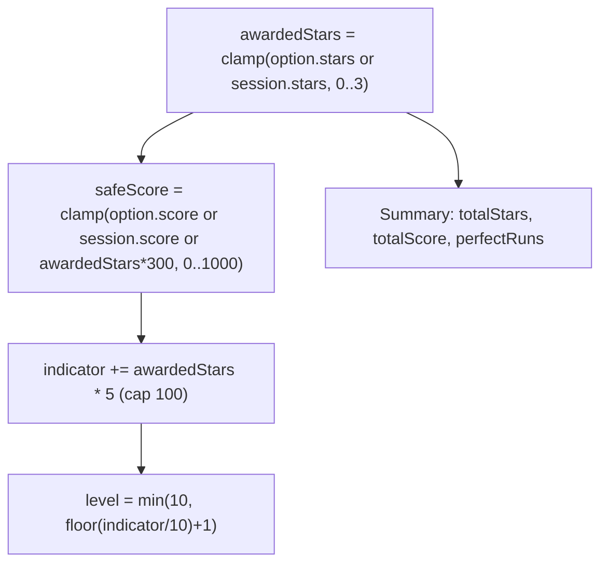
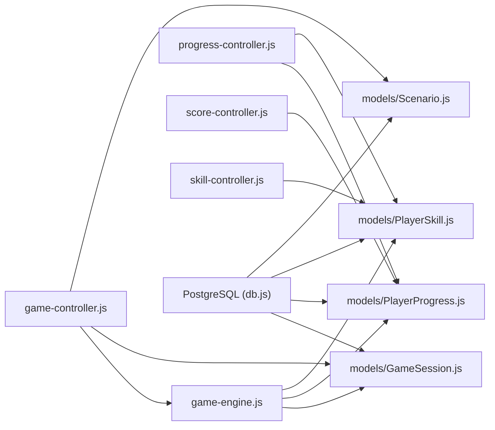

# Game State & Progress Models

<cite>
**Referenced Files in This Document**
- [GameSession.js](file://backend/models/GameSession.js)
- [PlayerProgress.js](file://backend/models/PlayerProgress.js)
- [PlayerSkill.js](file://backend/models/PlayerSkill.js)
- [Scenario.js](file://backend/models/Scenario.js)
- [index.js](file://backend/models/index.js)
- [User.js](file://backend/models/User.js)
- [game-controller.js](file://backend/controllers/game-controller.js)
- [progress-controller.js](file://backend/controllers/progress-controller.js)
- [skill-controller.js](file://backend/controllers/skill-controller.js)
- [score-controller.js](file://backend/controllers/score-controller.js)
- [game-engine.js](file://backend/services/game-engine.js)
- [db.js](file://backend/config/db.js)
</cite>

## Table of Contents
1. Introduction
2. Project Structure
3. Core Components
4. Architecture Overview
5. Detailed Component Analysis
6. Dependency Analysis
7. Performance Considerations
8. Troubleshooting Guide
9. Conclusion
10. Appendices

## Introduction
This document provides comprehensive data model documentation for game state and progress tracking entities: GameSession, PlayerProgress, PlayerSkill, and Scenario. It explains entity relationships, foreign key constraints, validation rules, and the complex interactions between scenarios, sessions, and player progress. It also documents XP calculation, skill progression, achievement systems, sample queries, performance considerations, and guidelines for adding new mechanics while maintaining backward compatibility.

## Project Structure
The backend uses Sequelize models to define persistent entities and controllers/services to implement business logic. The core game state and progress entities are defined under backend/models, with relationships declared in a central index file. Controllers handle session management, progress submission, skill listing, and scoring summaries. A game engine service orchestrates scenario content, metrics, and AI-assisted chat flows.

**Diagram sources**
- [index.js:14-27](file://backend/models/index.js#L14-L27)
- [game-controller.js:1-128](file://backend/controllers/game-controller.js#L1-L128)
- [progress-controller.js:1-79](file://backend/controllers/progress-controller.js#L1-L79)
- [skill-controller.js:1-10](file://backend/controllers/skill-controller.js#L1-L10)
- [score-controller.js:1-24](file://backend/controllers/score-controller.js#L1-L24)
- [game-engine.js:1-124](file://backend/services/game-engine.js#L1-L124)

**Section sources**
- [index.js:14-27](file://backend/models/index.js#L14-L27)
- [db.js:7-13](file://backend/config/db.js#L7-L13)

## Core Components
- GameSession: Represents an active or completed playthrough of a Scenario by a User. Stores transient state and history as JSONB, with expiration handling.
- PlayerProgress: Tracks per-user, per-scenario completion status, best stars, attempts, and last evidence payload.
- PlayerSkill: Tracks user-level proficiency indicators and levels for skills associated with scenarios.
- Scenario: Defines playable challenges, including metadata, difficulty, content, skill tags, and publication status.

Key attributes and validations:
- GameSession: UUID primary key; required userId and scenarioId; JSONB state and history; optional completedAt; required expiresAt.
- PlayerProgress: Unique composite index on (userId, scenarioId); ENUM status with defaults; integer bestStars and attempts; JSONB lastEvidence.
- PlayerSkill: Unique composite index on (userId, skill); integer level and indicator.
- Scenario: Unique slug; required title and ageGroup; integer difficulty; JSONB content; ARRAY of skillTags; boolean isPublished; integer version.

Relationships (declared in models/index.js):
- User 1:N GameSession (onDelete CASCADE)
- User 1:N PlayerProgress (onDelete CASCADE)
- User 1:N PlayerSkill (onDelete CASCADE)
- Scenario 1:N GameSession (onDelete RESTRICT)
- Scenario 1:N PlayerProgress (onDelete RESTRICT)

**Section sources**
- [GameSession.js:4-12](file://backend/models/GameSession.js#L4-L12)
- [PlayerProgress.js:4-14](file://backend/models/PlayerProgress.js#L4-L14)
- [PlayerSkill.js:4-12](file://backend/models/PlayerSkill.js#L4-L12)
- [Scenario.js:4-15](file://backend/models/Scenario.js#L4-L15)
- [index.js:14-27](file://backend/models/index.js#L14-L27)

## Architecture Overview
The system centers around Scenario-driven gameplay. Users start GameSessions tied to published Scenarios. During play, state transitions and actions are validated and persisted. Upon completion, PlayerProgress records outcomes and awards stars/scores. Skills advance based on earned stars. A score summary aggregates totals across all completed missions.

**Diagram sources**
- [game-controller.js:18-116](file://backend/controllers/game-controller.js#L18-L116)
- [progress-controller.js:5-71](file://backend/controllers/progress-controller.js#L5-L71)
- [game-engine.js:51-64](file://backend/services/game-engine.js#L51-L64)

## Detailed Component Analysis

### Entity Relationships and Constraints
- User to GameSession: One-to-many with cascade delete on User removal.
- User to PlayerProgress: One-to-many with cascade delete on User removal.
- User to PlayerSkill: One-to-many with cascade delete on User removal.
- Scenario to GameSession: One-to-many with restrict delete to preserve session integrity.
- Scenario to PlayerProgress: One-to-many with restrict delete to preserve historical progress.
- Unique constraints:
  - PlayerProgress: unique (userId, scenarioId).
  - PlayerSkill: unique (userId, skill).
  - Scenario: unique slug.

These constraints ensure referential integrity and prevent accidental deletion of critical game data.

**Section sources**
- [index.js:14-27](file://backend/models/index.js#L14-L27)
- [PlayerProgress.js:12-14](file://backend/models/PlayerProgress.js#L12-L14)
- [PlayerSkill.js:10-12](file://backend/models/PlayerSkill.js#L10-L12)
- [Scenario.js:5-7](file://backend/models/Scenario.js#L5-L7)

### Data Validation Rules
- Status enum for PlayerProgress: started, completed, failed.
- Stars capped between 0 and 3 during action processing and progress submission.
- Score capped between 0 and 1000 during action processing and progress submission.
- Session must be active (not expired, not completed) for state reads and actions.
- Scenario must be published to be selectable for starting a session.

Validation occurs in controllers and engine functions before persisting changes.

**Section sources**
- [PlayerProgress.js:8-11](file://backend/models/PlayerProgress.js#L8-L11)
- [game-controller.js:8-12](file://backend/controllers/game-controller.js#L8-L12)
- [game-controller.js:63-91](file://backend/controllers/game-controller.js#L63-L91)
- [progress-controller.js:8-15](file://backend/controllers/progress-controller.js#L8-L15)
- [progress-controller.js:19-24](file://backend/controllers/progress-controller.js#L19-L24)
- [game-engine.js:51-53](file://backend/services/game-engine.js#L51-L53)

### Complex Relationships Between Scenarios, Sessions, and Progress
- A Scenario defines available options and clues; a GameSession captures the evolving state of a single attempt.
- PlayerProgress persists the outcome per Scenario per User, including bestStars and attempts.
- Skill advancement is tied to the first skillTag of the Scenario when a progress entry is marked completed.

**Diagram sources**
- [game-controller.js:52-116](file://backend/controllers/game-controller.js#L52-L116)
- [progress-controller.js:5-71](file://backend/controllers/progress-controller.js#L5-L71)
- [game-engine.js:51-64](file://backend/services/game-engine.js#L51-L64)

**Section sources**
- [game-controller.js:52-116](file://backend/controllers/game-controller.js#L52-L116)
- [progress-controller.js:5-71](file://backend/controllers/progress-controller.js#L5-L71)
- [game-engine.js:51-64](file://backend/services/game-engine.js#L51-L64)

### XP Calculation, Skill Progression, and Achievements
- Stars: Derived from option.stars or session state, clamped to [0, 3].
- Score: Derived from option.score or session state, clamped to [0, 1000]; fallback uses awardedStars * 300 if needed.
- Skill Indicator: Increases by awardedStars * 5 per completed scenario, capped at 100.
- Skill Level: Computed as floor(indicator / 10) + 1, capped at 10.
- Achievements: Not explicitly modeled beyond bestStars and totalScore; perfect runs (bestStars >= 3) are counted in score summaries.

**Diagram sources**
- [progress-controller.js:19-24](file://backend/controllers/progress-controller.js#L19-L24)
- [progress-controller.js:50-58](file://backend/controllers/progress-controller.js#L50-L58)
- [score-controller.js:4-20](file://backend/controllers/score-controller.js#L4-L20)

**Section sources**
- [progress-controller.js:19-24](file://backend/controllers/progress-controller.js#L19-L24)
- [progress-controller.js:50-58](file://backend/controllers/progress-controller.js#L50-L58)
- [score-controller.js:4-20](file://backend/controllers/score-controller.js#L4-L20)

### Sample Queries
Note: These are conceptual examples aligned with the implemented behavior. Use your ORM or database client to execute them.

- Start a new session for a published scenario:
  - Find published Scenario by id.
  - Create GameSession with INITIAL_STATE and expiresAt set to now + 24 hours.
  - Return sessionId, scenario challenge preview, and merged initial state.

- Retrieve current session state:
  - Find GameSession by sessionId and userId where completedAt is null and expiresAt > now.
  - Load Scenario to compute revealed clues based on collectedClueIds.
  - Return sessionId, challenge, state, revealedClues, history, expiresAt.

- Perform an action (collect clue or choose option):
  - Validate session activity and phase constraints.
  - For collect_clue: ensure clue exists and not already collected; update collectedClueIds and phase.
  - For choose_option: require all clues collected; set selectedOptionId, score, stars, phase='reveal'.
  - Persist updated state and history.

- Submit progress:
  - Verify Scenario is published and Session exists and matches userId/scenarioId.
  - If marking completed, ensure session.completedAt is set.
  - Compute awardedStars and safeScore; upsert PlayerProgress with bestStars and attempts.
  - If Scenario has a skillTag, update PlayerSkill indicator and level.

- List progress and skills:
  - Query PlayerProgress for userId ordered by updatedAt desc.
  - Query PlayerSkill for userId ordered by indicator desc.

- Score summary:
  - Aggregate completed PlayerProgress entries to compute missionsCompleted, totalStars, totalScore, perfectRuns, and winReady flag.

**Section sources**
- [game-controller.js:18-116](file://backend/controllers/game-controller.js#L18-L116)
- [progress-controller.js:5-79](file://backend/controllers/progress-controller.js#L5-L79)
- [skill-controller.js:4-7](file://backend/controllers/skill-controller.js#L4-L7)
- [score-controller.js:4-20](file://backend/controllers/score-controller.js#L4-L20)
- [game-engine.js:51-64](file://backend/services/game-engine.js#L51-L64)

## Dependency Analysis
- Controllers depend on models via Sequelize associations and on services for shared logic.
- game-controller.js depends on game-engine.js for session lifecycle and scenario content normalization.
- progress-controller.js depends on models to persist progress and update skills.
- score-controller.js aggregates PlayerProgress and counts published Scenarios.
- All models rely on the database configuration for connection pooling and dialect settings.

**Diagram sources**
- [game-controller.js:1-128](file://backend/controllers/game-controller.js#L1-L128)
- [progress-controller.js:1-79](file://backend/controllers/progress-controller.js#L1-L79)
- [score-controller.js:1-24](file://backend/controllers/score-controller.js#L1-L24)
- [skill-controller.js:1-10](file://backend/controllers/skill-controller.js#L1-L10)
- [game-engine.js:1-124](file://backend/services/game-engine.js#L1-L124)
- [db.js:7-13](file://backend/config/db.js#L7-L13)

**Section sources**
- [game-controller.js:1-128](file://backend/controllers/game-controller.js#L1-L128)
- [progress-controller.js:1-79](file://backend/controllers/progress-controller.js#L1-L79)
- [score-controller.js:1-24](file://backend/controllers/score-controller.js#L1-L24)
- [skill-controller.js:1-10](file://backend/controllers/skill-controller.js#L1-L10)
- [game-engine.js:1-124](file://backend/services/game-engine.js#L1-L124)
- [db.js:7-13](file://backend/config/db.js#L7-L13)

## Performance Considerations
- Database pool sizing: Connection pool configured with max/min/idle settings suitable for moderate concurrency. Adjust based on load.
- Indexes:
  - Unique indexes on (userId, scenarioId) for PlayerProgress and (userId, skill) for PlayerSkill reduce lookup cost and enforce uniqueness.
  - Consider additional indexes on frequently queried fields such as GameSession.expiresAt and GameSession.completedAt for session cleanup tasks.
- JSONB usage:
  - GameSession.state and history are JSONB; consider indexing specific keys if querying deeply nested structures becomes frequent.
- Expiration strategy:
  - Sessions expire after 24 hours; implement periodic cleanup to remove expired sessions to maintain table size.
- Aggregation:
  - Score summary aggregates completed progress rows; paginate or cache results if datasets grow large.
- Caching strategies:
  - Cache published Scenario listings and brief metadata to reduce repeated reads.
  - Cache PlayerSkill lists per user for short durations to minimize repeated queries.
  - Consider read replicas for heavy analytics queries like score summaries.

[No sources needed since this section provides general guidance]

## Troubleshooting Guide
Common issues and resolutions:
- Session not found or expired:
  - Ensure sessionId belongs to the authenticated user and is not completed or expired.
  - Check expiresAt and completedAt fields in GameSession.
- Already decided or duplicate actions:
  - Actions like collect_clue and choose_option are guarded against repeated execution within a session.
- Session incomplete when submitting progress:
  - Mark session as completed before submitting progress with status 'completed'.
- Scenario not found or unpublished:
  - Only published Scenarios can be used to start sessions or submit progress.
- Skill updates not applied:
  - Ensure Scenario has a skillTag and progress status is 'completed' to trigger skill advancement.

Operational checks:
- Validate database connectivity and pool settings.
- Review logs for constraint violations or invalid states.
- Confirm that AUTO_SYNC is disabled in production and migrations are used.

**Section sources**
- [game-controller.js:8-12](file://backend/controllers/game-controller.js#L8-L12)
- [game-controller.js:63-91](file://backend/controllers/game-controller.js#L63-L91)
- [progress-controller.js:8-15](file://backend/controllers/progress-controller.js#L8-L15)
- [game-engine.js:51-53](file://backend/services/game-engine.js#L51-L53)
- [db.js:19-24](file://backend/config/db.js#L19-L24)

## Conclusion
The data model cleanly separates transient session state from persistent progress and skill metrics. Relationships enforce integrity, while validation ensures consistent gameplay flow. XP and skill progression are straightforward and scalable. With appropriate indexing, caching, and cleanup strategies, the system can support large-scale gaming data efficiently. Extending mechanics should follow established patterns: add fields to models, update controllers/services, and maintain backward compatibility through defaults and versioning.

[No sources needed since this section summarizes without analyzing specific files]

## Appendices

### Adding New Game Mechanics Guidelines
- Model changes:
  - Add new fields to relevant models with sensible defaults to preserve backward compatibility.
  - Define indexes for new query patterns.
- Controller/service updates:
  - Implement validation and transformation logic in controllers; keep reusable logic in services.
  - Ensure new mechanics integrate with existing session state and progress submission flows.
- Backward compatibility:
  - Use default values for new fields.
  - Avoid breaking changes to existing JSONB structures unless necessary; prefer additive changes.
- Testing:
  - Add tests for new endpoints and edge cases (e.g., missing fields, invalid states).
- Documentation:
  - Update this document to reflect new entities, relationships, and calculations.

[No sources needed since this section provides general guidance]