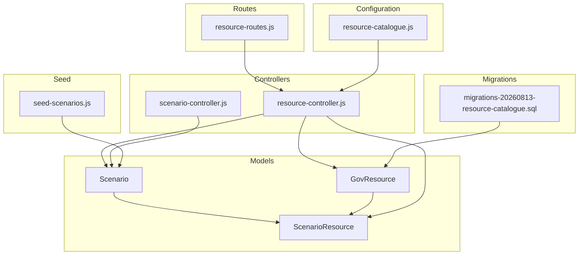
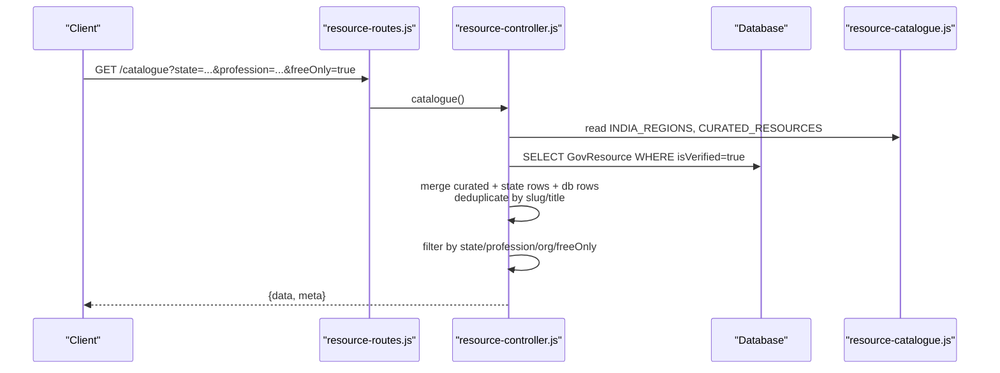
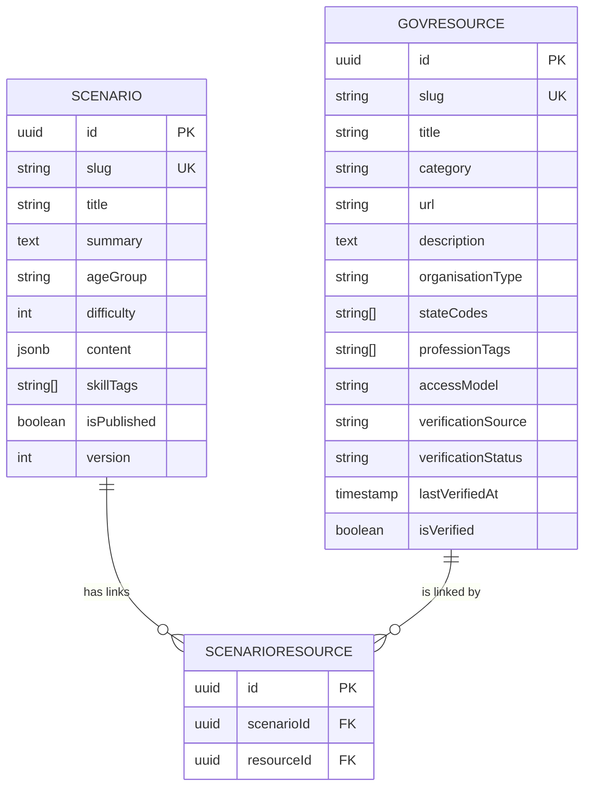
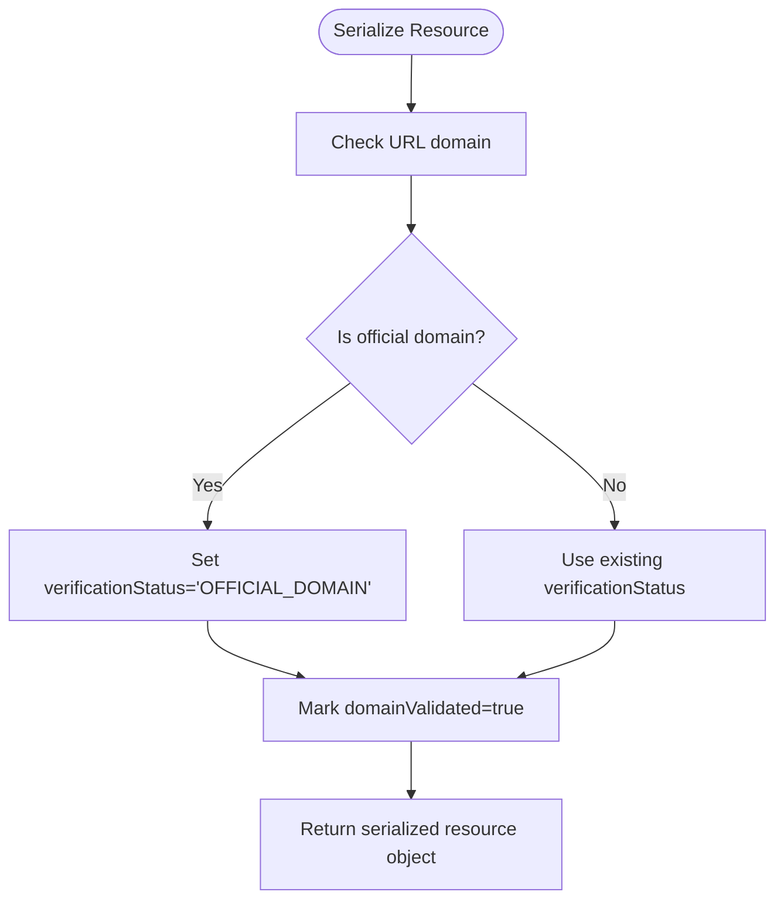
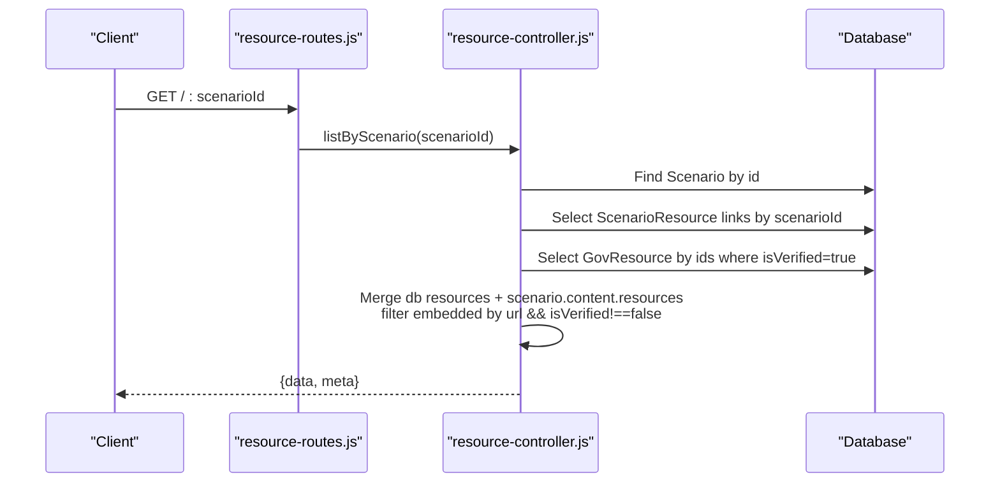
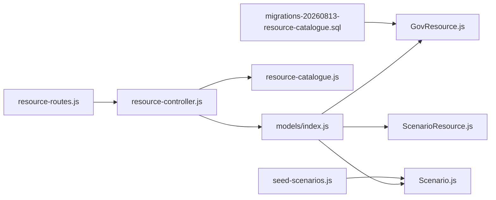

# Resource Management Models

<cite>
**Referenced Files in This Document**
- [GovResource.js](file://backend/models/GovResource.js)
- [ScenarioResource.js](file://backend/models/ScenarioResource.js)
- [Scenario.js](file://backend/models/Scenario.js)
- [index.js](file://backend/models/index.js)
- [resource-catalogue.js](file://backend/config/resource-catalogue.js)
- [resource-controller.js](file://backend/controllers/resource-controller.js)
- [scenario-controller.js](file://backend/controllers/scenario-controller.js)
- [resource-routes.js](file://backend/routes/resource-routes.js)
- [migrations-20260813-resource-catalogue.sql](file://backend/migrations-20260813-resource-catalogue.sql)
- [seed-scenarios.js](file://backend/scripts/seed-scenarios.js)
</cite>

## Table of Contents
1. Introduction
2. Project Structure
3. Core Components
4. Architecture Overview
5. Detailed Component Analysis
6. Dependency Analysis
7. Performance Considerations
8. Troubleshooting Guide
9. Conclusion
10. Appendices

## Introduction
This document explains the data models and workflows that manage educational resources and their association with game scenarios. It focuses on:
- The GovResource entity for catalogued, verified resources
- The Scenario entity for game missions and embedded content
- The ScenarioResource junction table that implements a many-to-many relationship between Scenarios and Resources
- Resource categorization, verification status, and content linking mechanisms
- How resources are retrieved and presented during gameplay
- Sample queries for filtering and retrieval
- Workflows for content management and validation
- Guidelines for adding new resource types and maintaining quality

## Project Structure
The resource system spans models, configuration, controllers, routes, migrations, and seed scripts:
- Models define entities and relationships
- Configuration provides curated resources and region metadata
- Controllers implement retrieval, filtering, and serialization logic
- Routes expose endpoints for discovery and scenario-linked access
- Migrations add schema fields for categorization and verification
- Seed scripts populate scenarios with embedded resources

**Diagram sources**
- [index.js:26-27](file://backend/models/index.js#L26-L27)
- [resource-controller.js:1-13](file://backend/controllers/resource-controller.js#L1-L13)
- [scenario-controller.js:45-52](file://backend/controllers/scenario-controller.js#L45-L52)
- [resource-routes.js:1-10](file://backend/routes/resource-routes.js#L1-L10)
- [resource-catalogue.js:1-9](file://backend/config/resource-catalogue.js#L1-L9)
- [migrations-20260813-resource-catalogue.sql:1-9](file://backend/migrations-20260813-resource-catalogue.sql#L1-L9)
- [seed-scenarios.js:1-255](file://backend/scripts/seed-scenarios.js#L1-L255)

**Section sources**
- [index.js:26-27](file://backend/models/index.js#L26-L27)
- [resource-controller.js:1-13](file://backend/controllers/resource-controller.js#L1-L13)
- [scenario-controller.js:45-52](file://backend/controllers/scenario-controller.js#L45-L52)
- [resource-routes.js:1-10](file://backend/routes/resource-routes.js#L1-L10)
- [resource-catalogue.js:1-9](file://backend/config/resource-catalogue.js#L1-L9)
- [migrations-20260813-resource-catalogue.sql:1-9](file://backend/migrations-20260813-resource-catalogue.sql#L1-L9)
- [seed-scenarios.js:1-255](file://backend/scripts/seed-scenarios.js#L1-L255)

## Core Components
- GovResource: Represents a catalogued educational or government resource with categorization, access model, and verification attributes.
- Scenario: Represents a game mission with structured content including embedded resources.
- ScenarioResource: Junction table linking Scenarios to GovResources (many-to-many).
- Resource Catalogue: Curated list of resources and region metadata used to build the public catalogue.
- Controllers: Provide APIs to list, filter, and retrieve resources; also normalize scenario content for gameplay.

Key responsibilities:
- Categorization via category, professionTags, stateCodes, organisationType
- Verification via isVerified, verificationStatus, verificationSource, lastVerifiedAt
- Content linking via Scenario.content.resources and ScenarioResource associations
- Filtering by state, profession, organisation type, and free-only mode
- Serialization to present consistent resource objects to clients

**Section sources**
- [GovResource.js:4-19](file://backend/models/GovResource.js#L4-L19)
- [Scenario.js:4-15](file://backend/models/Scenario.js#L4-L15)
- [ScenarioResource.js:4-8](file://backend/models/ScenarioResource.js#L4-L8)
- [resource-catalogue.js:1-9](file://backend/config/resource-catalogue.js#L1-L9)
- [resource-controller.js:1-13](file://backend/controllers/resource-controller.js#L1-L13)
- [scenario-controller.js:45-52](file://backend/controllers/scenario-controller.js#L45-L52)

## Architecture Overview
The resource system exposes two primary flows:
- Public catalogue discovery: Aggregates curated resources, region directories, and database resources, then filters based on query parameters.
- Scenario-linked resources: Retrieves resources associated with a specific scenario through the junction table and merges them with embedded resources from the scenario’s content.

**Diagram sources**
- [resource-routes.js:6-8](file://backend/routes/resource-routes.js#L6-L8)
- [resource-controller.js:9-11](file://backend/controllers/resource-controller.js#L9-L11)
- [resource-catalogue.js:1-9](file://backend/config/resource-catalogue.js#L1-L9)

**Section sources**
- [resource-routes.js:6-8](file://backend/routes/resource-routes.js#L6-L8)
- [resource-controller.js:9-11](file://backend/controllers/resource-controller.js#L9-L11)
- [resource-catalogue.js:1-9](file://backend/config/resource-catalogue.js#L1-L9)

## Detailed Component Analysis

### Data Model Relationships
- Scenario has many GovResources through ScenarioResource (many-to-many).
- GovResource belongs to many Scenarios through ScenarioResource.
- ScenarioResource stores scenarioId and resourceId pairs.

**Diagram sources**
- [Scenario.js:4-15](file://backend/models/Scenario.js#L4-L15)
- [GovResource.js:4-19](file://backend/models/GovResource.js#L4-L19)
- [ScenarioResource.js:4-8](file://backend/models/ScenarioResource.js#L4-L8)
- [index.js:26-27](file://backend/models/index.js#L26-L27)

**Section sources**
- [Scenario.js:4-15](file://backend/models/Scenario.js#L4-L15)
- [GovResource.js:4-19](file://backend/models/GovResource.js#L4-L19)
- [ScenarioResource.js:4-8](file://backend/models/ScenarioResource.js#L4-L8)
- [index.js:26-27](file://backend/models/index.js#L26-L27)

### Resource Categorization and Filtering
- Categories include schemes, education, law, finance, engineering-it, business-entrepreneurship, digital-inclusion, etc.
- Profession tags enable targeting by domain expertise (e.g., it, engineering, finance, law).
- State codes allow regional scoping; ALL indicates nationwide applicability.
- Access model supports FREE, FREE_AUDIT, and other tiers; free-only filtering is supported.
- Organisation type distinguishes GOVERNMENT, PUBLIC_EDUCATION, NONPROFIT, EDUCATIONAL, PRIVATE_LIMITED.

Filtering logic:
- State filter matches if resource includes ALL or the requested state code.
- Profession filter requires at least one matching tag.
- Organisation type filter must match exactly.
- Free-only filter restricts to allowed free access models.

**Section sources**
- [resource-catalogue.js:1-9](file://backend/config/resource-catalogue.js#L1-L9)
- [resource-controller.js:5-8](file://backend/controllers/resource-controller.js#L5-L8)

### Verification Status and Validation
Verification attributes:
- isVerified: Boolean flag controlling inclusion in lists and catalogue.
- verificationStatus: Enum-like values such as OFFICIAL, OFFICIAL_DOMAIN, DIRECTORY_REVIEWED, PENDING_REVIEW.
- verificationSource: Indicates source of verification (e.g., NIC/MeitY, Ministry of Education, Organisation website).
- lastVerifiedAt: Timestamp of last verification event.

Validation behavior:
- Domain validation infers OFFICIAL_DOMAIN when URL uses trusted TLDs (.gov.in, .nic.in, .mygov.in).
- Default verificationStatus falls back to DIRECTORY_REVIEWED when not explicitly set.
- Only resources with isVerified=true are included in catalogue and list endpoints.

**Diagram sources**
- [resource-controller.js:6-7](file://backend/controllers/resource-controller.js#L6-L7)

**Section sources**
- [GovResource.js:15-18](file://backend/models/GovResource.js#L15-L18)
- [resource-controller.js:6-7](file://backend/controllers/resource-controller.js#L6-L7)

### Scenario-Resource Association and Gameplay Access
Two mechanisms associate resources with scenarios:
- Many-to-many via ScenarioResource: Links stored in the database.
- Embedded resources in Scenario.content.resources: Inline resources attached directly to scenario content.

During gameplay:
- Scenario normalization filters embedded resources to include only those with a valid URL and where isVerified is not false.
- Scenario-linked endpoint retrieves both database-linked resources and embedded resources, merging and deduplicating for presentation.

**Diagram sources**
- [resource-routes.js:9](file://backend/routes/resource-routes.js#L9)
- [resource-controller.js:12](file://backend/controllers/resource-controller.js#L12)
- [scenario-controller.js:45-52](file://backend/controllers/scenario-controller.js#L45-L52)

**Section sources**
- [resource-controller.js:12](file://backend/controllers/resource-controller.js#L12)
- [scenario-controller.js:45-52](file://backend/controllers/scenario-controller.js#L45-L52)

### API Endpoints for Resource Retrieval
- GET /regions: Returns region metadata for Indian states/UTs.
- GET /catalogue: Public discovery endpoint aggregating curated and database resources with filtering.
- GET /: Protected list of verified resources with filtering.
- GET /:scenarioId: Protected endpoint returning scenario-linked resources and embedded resources.

Authentication:
- Discovery endpoints (/regions, /catalogue) are safe for guest play.
- Scenario-linked and full list endpoints require authentication.

**Section sources**
- [resource-routes.js:5-9](file://backend/routes/resource-routes.js#L5-L9)

### Sample Queries and Usage Patterns
Below are conceptual queries aligned with the implemented logic. Replace placeholders with actual values when executing.

- Retrieve all verified resources:
  - Query: SELECT * FROM "GovResources" WHERE "isVerified" = true ORDER BY "title" ASC;
  - Purpose: Base dataset for listing and catalogue aggregation.

- Filter resources by state, profession, organisation type, and free-only:
  - Query: SELECT * FROM "GovResources" WHERE "isVerified" = true AND ("stateCodes" @> ARRAY['STATE_CODE']) AND "professionTags" @> ARRAY['PROFESSION'] AND "organisationType" = 'ORG_TYPE' AND "accessModel" IN ('FREE','FREE_AUDIT','FREE_TIER');
  - Purpose: Match catalogue filtering rules for state, profession, org type, and free-only.

- Get scenario-linked resources:
  - Step 1: SELECT * FROM "ScenarioResource" WHERE "scenarioId" = 'SCENARIO_UUID';
  - Step 2: SELECT * FROM "GovResources" WHERE "id" IN (resource_ids) AND "isVerified" = true;
  - Purpose: Fetch database-linked resources for a scenario.

- Merge embedded resources from scenario content:
  - Logic: From Scenario.content.resources, include entries where url is present and isVerified is not false.
  - Purpose: Combine with database-linked resources for final presentation.

- Deduplicate merged results:
  - Strategy: Remove duplicates by slug or title after merging curated, state directory, and database resources.
  - Purpose: Ensure unique resource list in catalogue responses.

**Section sources**
- [resource-controller.js:9-12](file://backend/controllers/resource-controller.js#L9-L12)
- [scenario-controller.js:45-52](file://backend/controllers/scenario-controller.js#L45-L52)

### Content Management Workflows
- Catalogue population:
  - Curated resources are defined in configuration and merged with database resources.
  - Region-specific directories are added dynamically based on selected state.
  - Deduplication ensures no duplicate entries appear in the response.

- Scenario seeding:
  - Seed script creates or updates scenarios with embedded resources marked as verified.
  - Each scenario includes learning objectives, interactables, clues, options, and resources.

- Verification workflow:
  - New resources should be added to the database with appropriate categorization and verification attributes.
  - For curated resources, update configuration with accurate URLs, categories, tags, and verification status.
  - Validate domains to infer official status and set lastVerifiedAt when re-verifying.

**Section sources**
- [resource-controller.js:9-11](file://backend/controllers/resource-controller.js#L9-L11)
- [seed-scenarios.js:10-231](file://backend/scripts/seed-scenarios.js#L10-L231)
- [resource-catalogue.js:1-9](file://backend/config/resource-catalogue.js#L1-L9)

### Guidelines for Adding New Resource Types and Maintaining Quality
- Add new resource types:
  - Define category and organisationType consistently with existing taxonomy.
  - Populate professionTags to enable targeted filtering.
  - Set stateCodes appropriately; use ALL for nationwide resources.
  - Choose accessModel reflecting availability (e.g., FREE, FREE_AUDIT).
  - Record verificationSource and set verificationStatus to reflect review outcome.
  - Ensure isVerified is true only after successful validation.

- Maintain content quality:
  - Regularly verify URLs and update lastVerifiedAt.
  - Remove or mark non-official resources if they fail verification checks.
  - Keep descriptions concise and accurate.
  - Audit embedded resources in scenarios to ensure they remain relevant and verified.

- Best practices:
  - Prefer official domains for higher trust; leverage domain validation to auto-set verification status.
  - Use professional tags to improve discoverability across professions.
  - Avoid duplicating resources; rely on slug/title deduplication in catalogue responses.
  - Protect sensitive endpoints; only authenticated users can access scenario-linked resources.

**Section sources**
- [GovResource.js:4-19](file://backend/models/GovResource.js#L4-L19)
- [resource-controller.js:6-8](file://backend/controllers/resource-controller.js#L6-L8)
- [resource-catalogue.js:1-9](file://backend/config/resource-catalogue.js#L1-L9)

## Dependency Analysis
- Models depend on Sequelize and database configuration.
- Controllers depend on models, configuration, and utilities for async handling and error management.
- Routes depend on middleware for authentication and controllers for logic.
- Migrations extend the GovResource schema with categorization and verification fields.
- Seed scripts depend on Scenario model to upsert missions with embedded resources.

**Diagram sources**
- [resource-routes.js:1-10](file://backend/routes/resource-routes.js#L1-L10)
- [resource-controller.js:1-13](file://backend/controllers/resource-controller.js#L1-L13)
- [index.js:1-32](file://backend/models/index.js#L1-L32)
- [GovResource.js:1-22](file://backend/models/GovResource.js#L1-L22)
- [Scenario.js:1-18](file://backend/models/Scenario.js#L1-L18)
- [ScenarioResource.js:1-11](file://backend/models/ScenarioResource.js#L1-L11)
- [resource-catalogue.js:1-9](file://backend/config/resource-catalogue.js#L1-L9)
- [migrations-20260813-resource-catalogue.sql:1-9](file://backend/migrations-20260813-resource-catalogue.sql#L1-L9)
- [seed-scenarios.js:1-255](file://backend/scripts/seed-scenarios.js#L1-L255)

**Section sources**
- [resource-routes.js:1-10](file://backend/routes/resource-routes.js#L1-L10)
- [resource-controller.js:1-13](file://backend/controllers/resource-controller.js#L1-L13)
- [index.js:1-32](file://backend/models/index.js#L1-L32)
- [GovResource.js:1-22](file://backend/models/GovResource.js#L1-L22)
- [Scenario.js:1-18](file://backend/models/Scenario.js#L1-L18)
- [ScenarioResource.js:1-11](file://backend/models/ScenarioResource.js#L1-L11)
- [resource-catalogue.js:1-9](file://backend/config/resource-catalogue.js#L1-L9)
- [migrations-20260813-resource-catalogue.sql:1-9](file://backend/migrations-20260813-resource-catalogue.sql#L1-L9)
- [seed-scenarios.js:1-255](file://backend/scripts/seed-scenarios.js#L1-L255)

## Performance Considerations
- Indexing:
  - Consider indexing "isVerified", "category", "stateCodes", "professionTags", and "organisationType" to optimize filtering queries.
- Query efficiency:
  - Use array operators for stateCodes and professionTags to reduce client-side filtering overhead.
- Deduplication:
  - Perform server-side deduplication by slug/title to minimize payload size and avoid redundant UI rendering.
- Pagination:
  - Introduce pagination for large resource lists to improve response times and reduce bandwidth usage.
- Caching:
  - Cache catalogue responses for short periods to reduce repeated database reads and configuration processing.

[No sources needed since this section provides general guidance]

## Troubleshooting Guide
Common issues and resolutions:
- Missing resources in catalogue:
  - Verify isVerified is true for the resource.
  - Check that category, stateCodes, professionTags, and accessModel align with filter criteria.
- Incorrect verification status:
  - Confirm URL domain matches official TLDs to trigger OFFICIAL_DOMAIN inference.
  - Update verificationSource and lastVerifiedAt after manual review.
- Scenario-linked resources not appearing:
  - Ensure ScenarioResource entries exist for the scenario and resource IDs.
  - Verify embedded resources have valid URLs and isVerified is not false.
- Authentication errors:
  - Protected endpoints require valid authentication tokens; ensure middleware is configured correctly.

**Section sources**
- [resource-controller.js:9-12](file://backend/controllers/resource-controller.js#L9-L12)
- [scenario-controller.js:45-52](file://backend/controllers/scenario-controller.js#L45-L52)
- [resource-routes.js:5-9](file://backend/routes/resource-routes.js#L5-L9)

## Conclusion
The resource management system provides a robust framework for categorizing, verifying, and associating educational resources with game scenarios. Through a combination of database-backed many-to-many relationships and embedded scenario content, the system supports flexible discovery and contextualized access during gameplay. Adhering to the outlined workflows and guidelines ensures high-quality, reliable resources that enhance learning outcomes while maintaining safety and trustworthiness.

[No sources needed since this section summarizes without analyzing specific files]

## Appendices

### Appendix A: Entity Field Reference
- GovResource fields:
  - id, slug, title, category, url, description
  - organisationType, stateCodes, professionTags
  - accessModel, verificationSource, verificationStatus, lastVerifiedAt, isVerified
- Scenario fields:
  - id, slug, title, summary, ageGroup, difficulty
  - content (JSONB), skillTags, isPublished, version
- ScenarioResource fields:
  - id, scenarioId, resourceId

**Section sources**
- [GovResource.js:4-19](file://backend/models/GovResource.js#L4-L19)
- [Scenario.js:4-15](file://backend/models/Scenario.js#L4-L15)
- [ScenarioResource.js:4-8](file://backend/models/ScenarioResource.js#L4-L8)

### Appendix B: Migration Notes
- Added columns to GovResources for categorization and verification:
  - organisationType, stateCodes, professionTags, accessModel
  - verificationSource, verificationStatus, lastVerifiedAt

**Section sources**
- [migrations-20260813-resource-catalogue.sql:1-9](file://backend/migrations-20260813-resource-catalogue.sql#L1-L9)