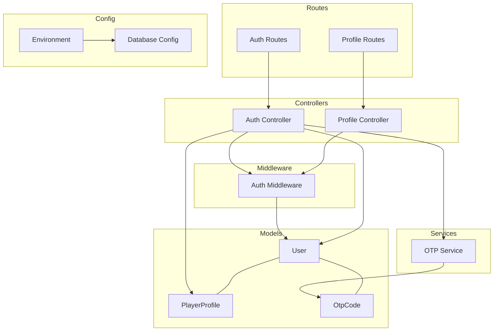
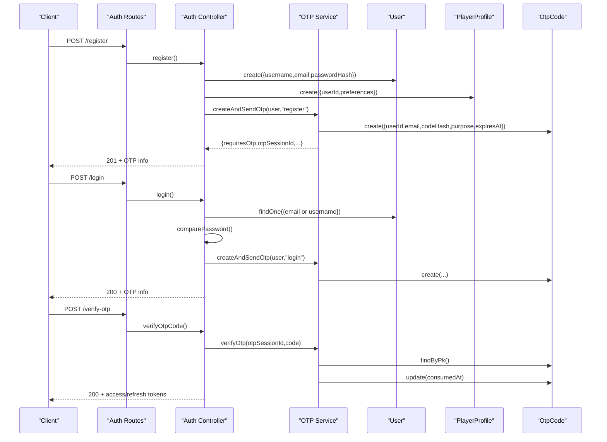
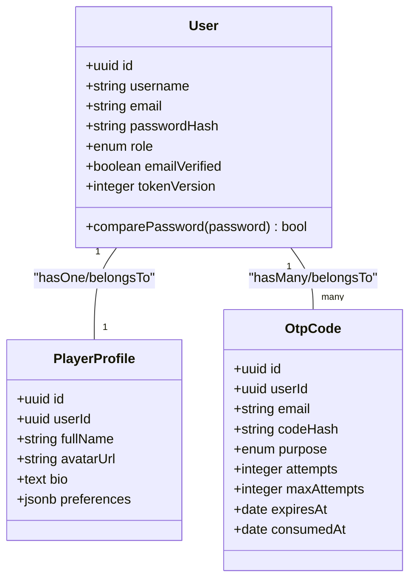
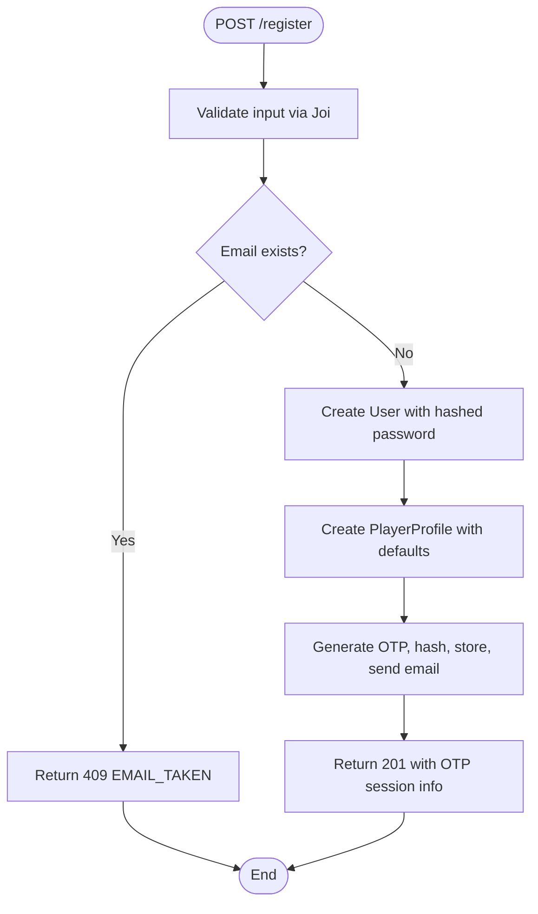
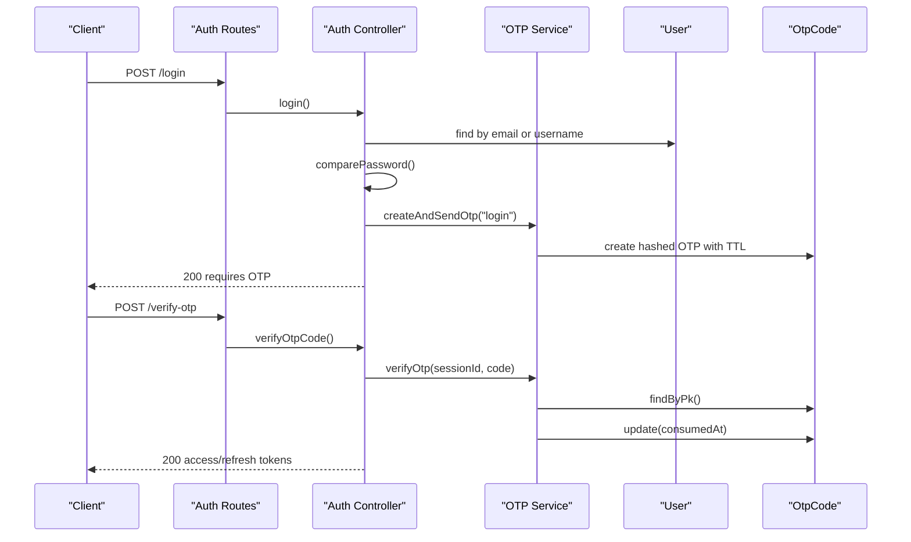
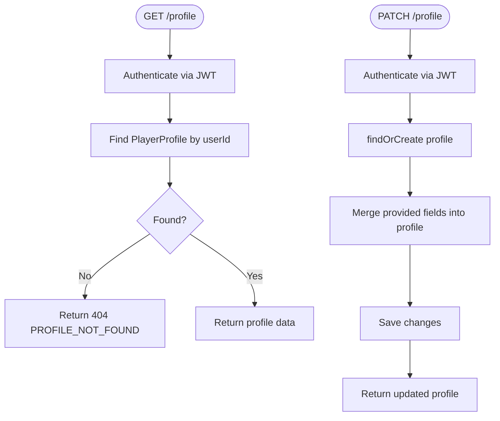
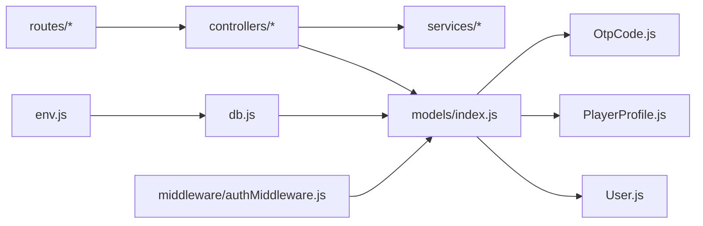

# User Management Models

<cite>
**Referenced Files in This Document**
- [User.js](file://backend/models/User.js)
- [PlayerProfile.js](file://backend/models/PlayerProfile.js)
- [OtpCode.js](file://backend/models/OtpCode.js)
- [models/index.js](file://backend/models/index.js)
- [auth-controller.js](file://backend/controllers/auth-controller.js)
- [profile-controller.js](file://backend/controllers/profile-controller.js)
- [otp-service.js](file://backend/services/otp-service.js)
- [authMiddleware.js](file://backend/middleware/authMiddleware.js)
- [auth-routes.js](file://backend/routes/auth-routes.js)
- [profile-routes.js](file://backend/routes/profile-routes.js)
- [env.js](file://backend/config/env.js)
- [db.js](file://backend/config/db.js)
- [auth-schemas.js](file://backend/validators/auth-schemas.js)
</cite>

## Table of Contents
1. [Introduction](#introduction)
2. [Project Structure](#project-structure)
3. [Core Components](#core-components)
4. [Architecture Overview](#architecture-overview)
5. [Detailed Component Analysis](#detailed-component-analysis)
6. [Dependency Analysis](#dependency-analysis)
7. [Performance Considerations](#performance-considerations)
8. [Troubleshooting Guide](#troubleshooting-guide)
9. [Conclusion](#conclusion)
10. [Appendices](#appendices)

## Introduction
This document provides comprehensive data model documentation for user management entities: User, PlayerProfile, and OtpCode. It details schema definitions, field types, constraints, validation rules, relationships, authentication flows, OTP verification, profile management features, security considerations, and guidelines for extending functionality while maintaining data integrity.

## Project Structure
The user management domain is implemented using Sequelize models, Express routes, controllers, middleware, and services. The core files involved are:
- Data models: User, PlayerProfile, OtpCode
- Relationships defined centrally in the models index
- Authentication and OTP flows via controllers and services
- Validation schemas for input sanitization
- Middleware for JWT-based session handling
- Environment configuration for secrets and behavior flags

**Diagram sources**
- [models/index.js:14-29](file://backend/models/index.js#L14-L29)
- [auth-controller.js:1-154](file://backend/controllers/auth-controller.js#L1-L154)
- [profile-controller.js:1-37](file://backend/controllers/profile-controller.js#L1-L37)
- [otp-service.js:1-99](file://backend/services/otp-service.js#L1-L99)
- [authMiddleware.js:1-38](file://backend/middleware/authMiddleware.js#L1-L38)
- [auth-routes.js:1-18](file://backend/routes/auth-routes.js#L1-L18)
- [profile-routes.js:1-10](file://backend/routes/profile-routes.js#L1-L10)
- [env.js:1-40](file://backend/config/env.js#L1-L40)
- [db.js:1-45](file://backend/config/db.js#L1-L45)

**Section sources**
- [models/index.js:14-29](file://backend/models/index.js#L14-L29)
- [auth-routes.js:1-18](file://backend/routes/auth-routes.js#L1-L18)
- [profile-routes.js:1-10](file://backend/routes/profile-routes.js#L1-L10)

## Core Components
This section outlines the three primary entities and their responsibilities:
- User: Core identity with credentials, role, email verification status, and token versioning for session invalidation.
- PlayerProfile: Optional extended profile linked to a single user, storing personal details and preferences.
- OtpCode: Time-bound, hashed one-time codes used for login and registration verification, with attempt limits and expiration.

Key relationship definitions:
- One-to-one between User and PlayerProfile (via userId foreign key).
- One-to-many from User to OtpCode (a user can have many OTP records over time).

Security and validation highlights:
- Passwords are hashed using bcrypt before storage.
- OTP codes are hashed and stored; plaintext never persisted.
- Input validation enforced via Joi schemas on routes.
- JWT tokens include a tokenVersion to support logout and refresh workflows.

**Section sources**
- [User.js:5-16](file://backend/models/User.js#L5-L16)
- [PlayerProfile.js:4-11](file://backend/models/PlayerProfile.js#L4-L11)
- [OtpCode.js:4-19](file://backend/models/OtpCode.js#L4-L19)
- [models/index.js:14-29](file://backend/models/index.js#L14-L29)
- [auth-schemas.js:5-26](file://backend/validators/auth-schemas.js#L5-L26)

## Architecture Overview
The authentication and OTP flow integrates routes, controllers, middleware, services, and models:
- Registration creates a User and a PlayerProfile, then issues an OTP for email verification.
- Login verifies password and issues an OTP for two-factor confirmation.
- OTP verification marks the code as consumed and returns authenticated tokens.
- Profile endpoints allow retrieving and updating player details.

**Diagram sources**
- [auth-routes.js:9-15](file://backend/routes/auth-routes.js#L9-L15)
- [auth-controller.js:34-89](file://backend/controllers/auth-controller.js#L34-L89)
- [otp-service.js:23-83](file://backend/services/otp-service.js#L23-L83)
- [models/index.js:14-29](file://backend/models/index.js#L14-L29)

## Detailed Component Analysis

### User Entity
- Fields:
  - id: UUID primary key
  - username: string, unique, required
  - email: string, unique, required, validated as email format
  - passwordHash: string, required
  - role: enum 'player' | 'admin', default 'player'
  - emailVerified: boolean, default false
  - tokenVersion: integer, default 0 (used for session invalidation)
- Scopes:
  - Default scope excludes sensitive fields (passwordHash, tokenVersion)
  - withAuth scope includes sensitive fields for internal operations
- Methods:
  - comparePassword(password): async comparison against stored hash

Relationships:
- One-to-one with PlayerProfile (hasOne)
- One-to-many with OtpCode (hasMany)

Validation and Security:
- Email uniqueness enforced at database level
- Password hashing via bcrypt during registration and guest login
- Token versioning supports secure logout and refresh

**Section sources**
- [User.js:5-20](file://backend/models/User.js#L5-L20)
- [models/index.js:14-29](file://backend/models/index.js#L14-L29)
- [auth-controller.js:34-44](file://backend/controllers/auth-controller.js#L34-L44)
- [auth-controller.js:107-121](file://backend/controllers/auth-controller.js#L107-L121)

### PlayerProfile Entity
- Fields:
  - id: UUID primary key
  - userId: UUID, required (foreign key to User)
  - fullName: string, optional
  - avatarUrl: string, optional
  - bio: text, optional
  - preferences: JSONB, default empty object
Relationships:
- Belongs to User (belongsTo)
- One-to-one linkage via userId

Usage:
- Created automatically during user registration with default preferences
- Updated via profile controller with partial updates and preference merging

**Section sources**
- [PlayerProfile.js:4-11](file://backend/models/PlayerProfile.js#L4-L11)
- [models/index.js:14-15](file://backend/models/index.js#L14-L15)
- [profile-controller.js:5-33](file://backend/controllers/profile-controller.js#L5-L33)

### OtpCode Entity
- Fields:
  - id: UUID primary key
  - userId: UUID, required
  - email: string, required
  - codeHash: string, required (hashed OTP)
  - purpose: enum 'login' | 'register'
  - attempts: integer, default 0
  - maxAttempts: integer, default 5
  - expiresAt: date, required
  - consumedAt: date, nullable
- Indexes:
  - Composite index on (userId, purpose)
  - Index on expiresAt for efficient expiry checks

Behavior:
- OTP generation: random 6-digit code, hashed, TTL set to 10 minutes
- Verification: checks existence, consumption, expiration, attempt limit, and compares hashed code
- Resend: invalidates pending OTPs for the same purpose and sends a new code

**Section sources**
- [OtpCode.js:4-19](file://backend/models/OtpCode.js#L4-L19)
- [otp-service.js:12-21](file://backend/services/otp-service.js#L12-L21)
- [otp-service.js:23-56](file://backend/services/otp-service.js#L23-L56)
- [otp-service.js:58-83](file://backend/services/otp-service.js#L58-L83)
- [otp-service.js:85-96](file://backend/services/otp-service.js#L85-L96)

### Class Diagram

**Diagram sources**
- [User.js:5-16](file://backend/models/User.js#L5-L16)
- [PlayerProfile.js:4-11](file://backend/models/PlayerProfile.js#L4-L11)
- [OtpCode.js:4-19](file://backend/models/OtpCode.js#L4-L19)
- [models/index.js:14-29](file://backend/models/index.js#L14-L29)

### API Flow Diagrams

#### Registration Flow

**Diagram sources**
- [auth-routes.js:9](file://backend/routes/auth-routes.js#L9)
- [auth-controller.js:34-52](file://backend/controllers/auth-controller.js#L34-L52)
- [otp-service.js:23-56](file://backend/services/otp-service.js#L23-L56)
- [auth-schemas.js:5-11](file://backend/validators/auth-schemas.js#L5-L11)

#### Login and OTP Verification Flow

**Diagram sources**
- [auth-routes.js:10-13](file://backend/routes/auth-routes.js#L10-L13)
- [auth-controller.js:54-89](file://backend/controllers/auth-controller.js#L54-L89)
- [otp-service.js:23-83](file://backend/services/otp-service.js#L23-L83)

#### Profile Management Flow

**Diagram sources**
- [profile-routes.js:6-7](file://backend/routes/profile-routes.js#L6-L7)
- [profile-controller.js:5-33](file://backend/controllers/profile-controller.js#L5-L33)
- [authMiddleware.js:6-27](file://backend/middleware/authMiddleware.js#L6-L27)

## Dependency Analysis
- Models depend on Sequelize and environment configuration for database connection.
- Controllers depend on models and services for business logic.
- Services encapsulate OTP generation, hashing, and email delivery.
- Middleware validates JWT tokens and attaches user context to requests.
- Routes wire HTTP endpoints to controllers with validation and rate limiting.

**Diagram sources**
- [env.js:1-40](file://backend/config/env.js#L1-L40)
- [db.js:1-45](file://backend/config/db.js#L1-L45)
- [models/index.js:1-32](file://backend/models/index.js#L1-L32)
- [auth-routes.js:1-18](file://backend/routes/auth-routes.js#L1-L18)
- [authMiddleware.js:1-38](file://backend/middleware/authMiddleware.js#L1-L38)

**Section sources**
- [models/index.js:1-32](file://backend/models/index.js#L1-L32)
- [authMiddleware.js:1-38](file://backend/middleware/authMiddleware.js#L1-L38)

## Performance Considerations
- Database pool sizing and retry settings are configured for PostgreSQL connections.
- Expiry indexes on OTP records improve lookup performance for expired code cleanup.
- JWT token versioning avoids expensive session revocation scans by embedding version in tokens.
- Preference merging uses JSONB to minimize writes and enable flexible updates.

[No sources needed since this section provides general guidance]

## Troubleshooting Guide
Common errors and resolutions:
- EMAIL_TAKEN: Duplicate email during registration; choose a different email.
- INVALID_CREDENTIALS: Incorrect password; ensure correct credentials.
- OTP_INVALID: Code already used or invalid session; request a new code.
- OTP_EXPIRED: Code exceeded TTL; resend OTP.
- OTP_MAX_ATTEMPTS: Too many wrong attempts; request a new code.
- UNAUTHORIZED: Missing or invalid JWT; refresh or re-login.
- PROFILE_NOT_FOUND: No profile associated with user; profile creation occurs on registration.

Operational notes:
- In development mode, OTP may be logged for testing; avoid exposing dev OTP in production.
- Ensure SMTP settings are configured for email delivery; otherwise, dev mode will provide OTP hints.

**Section sources**
- [auth-controller.js:34-89](file://backend/controllers/auth-controller.js#L34-L89)
- [otp-service.js:58-96](file://backend/services/otp-service.js#L58-L96)
- [profile-controller.js:5-33](file://backend/controllers/profile-controller.js#L5-L33)

## Conclusion
The user management system implements robust authentication and OTP verification with clear data models and secure practices. User identities are protected via hashed passwords and JWT sessions with versioning. Profiles extend user data flexibly using JSONB preferences. OTP codes are securely stored as hashes with strict TTL and attempt limits. The architecture separates concerns across routes, controllers, middleware, services, and models, enabling maintainability and extensibility.

[No sources needed since this section summarizes without analyzing specific files]

## Appendices

### Sample Queries and Usage Patterns
Note: These are usage patterns derived from the implementation. Replace placeholders with actual values when integrating.

- Register a new user:
  - Endpoint: POST /api/auth/register
  - Body: { username, email, password, ageGroup? }
  - Expected: 201 with message and OTP session info

- Login and initiate OTP:
  - Endpoint: POST /api/auth/login
  - Body: { identifier (email or username), password }
  - Expected: 200 with message and OTP session info

- Verify OTP and complete login:
  - Endpoint: POST /api/auth/verify-otp
  - Body: { otpSessionId, code }
  - Expected: 200 with accessToken and refreshToken

- Resend OTP:
  - Endpoint: POST /api/auth/resend-otp
  - Body: { otpSessionId }
  - Expected: 200 with new OTP session info

- Get profile:
  - Endpoint: GET /api/profile
  - Headers: Authorization: Bearer <accessToken>
  - Expected: 200 with profile data

- Update profile:
  - Endpoint: PATCH /api/profile
  - Headers: Authorization: Bearer <accessToken>
  - Body: { fullName?, avatarUrl?, bio?, preferences? }
  - Expected: 200 with updated profile

- Logout:
  - Endpoint: POST /api/auth/logout
  - Headers: Authorization: Bearer <accessToken>
  - Expected: 200 with success message

- Refresh tokens:
  - Endpoint: POST /api/auth/refresh
  - Body or Cookie: refreshToken
  - Expected: 200 with new accessToken and refreshToken

**Section sources**
- [auth-routes.js:9-15](file://backend/routes/auth-routes.js#L9-L15)
- [profile-routes.js:6-7](file://backend/routes/profile-routes.js#L6-L7)
- [auth-controller.js:34-121](file://backend/controllers/auth-controller.js#L34-L121)
- [profile-controller.js:5-33](file://backend/controllers/profile-controller.js#L5-L33)

### Security Considerations
- Password hashing: bcrypt used for both registration and guest login.
- OTP security: Codes are hashed before storage; plaintext never persisted.
- Session management: JWT tokens include tokenVersion; logout increments version to invalidate existing tokens.
- Rate limiting: authLimiter and otpLimiter protect endpoints from abuse.
- Environment validation: Strict schema enforces required secrets and safe defaults.
- Guest play: Disabled in production to prevent unauthorized access.

**Section sources**
- [auth-controller.js:34-44](file://backend/controllers/auth-controller.js#L34-L44)
- [auth-controller.js:100-121](file://backend/controllers/auth-controller.js#L100-L121)
- [otp-service.js:23-56](file://backend/services/otp-service.js#L23-L56)
- [env.js:6-31](file://backend/config/env.js#L6-L31)

### Guidelines for Extending User Functionality
- Add new user attributes carefully; consider default scopes to exclude sensitive fields by default.
- Extend profiles with additional JSONB keys rather than frequent schema changes.
- Introduce new OTP purposes only if necessary; reuse existing enums where possible.
- Maintain data integrity by enforcing unique constraints at the database level and validating inputs via Joi schemas.
- Use middleware to enforce authorization and rate limiting consistently across new endpoints.
- Prefer migrations over AUTO_SYNC in production to ensure controlled schema evolution.

**Section sources**
- [User.js:5-16](file://backend/models/User.js#L5-L16)
- [PlayerProfile.js:4-11](file://backend/models/PlayerProfile.js#L4-L11)
- [OtpCode.js:4-19](file://backend/models/OtpCode.js#L4-L19)
- [auth-schemas.js:5-26](file://backend/validators/auth-schemas.js#L5-L26)
- [db.js:15-24](file://backend/config/db.js#L15-L24)