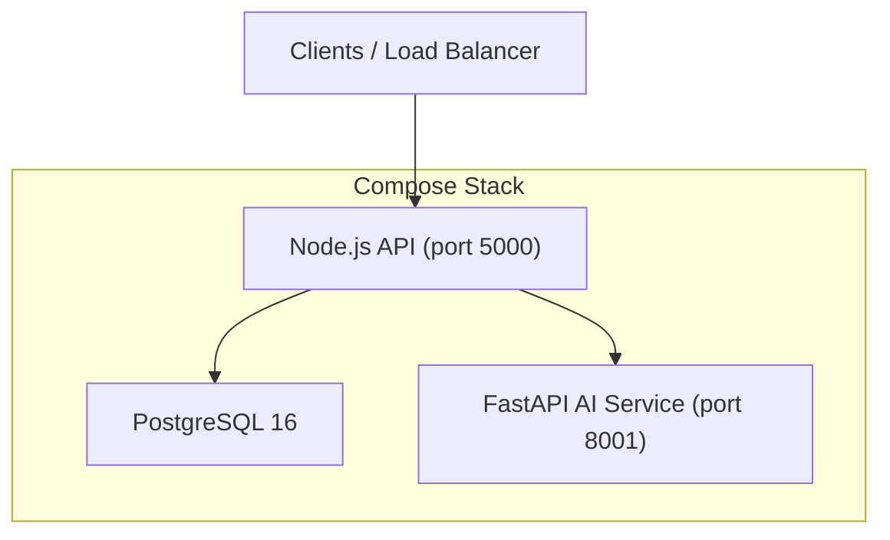
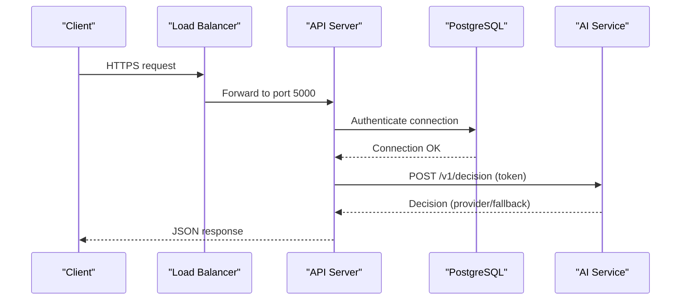
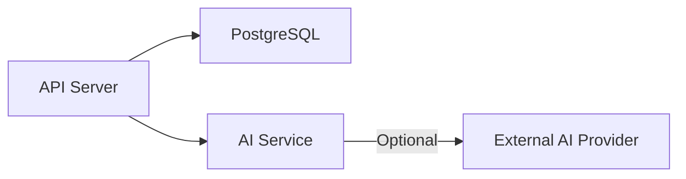

# Deployment & Production Setup

<cite>
**Referenced Files in This Document**
- [docker-compose.yml](file://docker-compose.yml)
- [backend/Dockerfile](file://backend/Dockerfile)
- [backend/ai-service/Dockerfile](file://backend/ai-service/Dockerfile)
- [backend/config/env.js](file://backend/config/env.js)
- [backend/config/db.js](file://backend/config/db.js)
- [backend/server.js](file://backend/server.js)
- [backend/app.js](file://backend/app.js)
- [backend/middleware/security.js](file://backend/middleware/security.js)
- [backend/config/logger.js](file://backend/config/logger.js)
- [backend/sockets/index.js](file://backend/sockets/index.js)
- [backend/package.json](file://backend/package.json)
- [backend/ai-service/app/config.py](file://backend/ai-service/app/config.py)
- [backend/ai-service/app/main.py](file://backend/ai-service/app/main.py)
- [DEPLOYMENT.md](file://DEPLOYMENT.md)
</cite>

## Table of Contents
1. Introduction
2. Project Structure
3. Core Components
4. Architecture Overview
5. Detailed Component Analysis
6. Dependency Analysis
7. Performance Considerations
8. Troubleshooting Guide
9. Conclusion
10. Appendices

## Introduction
This document provides production deployment guidance for the AwarQuest system, covering container orchestration with Docker Compose, environment configuration, service dependencies, database setup and migrations, monitoring and logging, health checks, scaling, load balancing, CDN usage for static assets, SSL/TLS management, security hardening, compliance considerations, platform-specific deployment steps, rollback strategies, update procedures, and maintenance windows.

## Project Structure
The system is composed of three primary services:
- PostgreSQL 16 database
- Node.js/Express API server (REST + WebSocket)
- Python FastAPI AI microservice

Docker Compose orchestrates these services, defines networking, ports, volumes, health checks, and startup ordering. The API serves REST endpoints and WebSocket connections, while the AI service provides deterministic or model-based decisions behind a token-protected interface.

**Diagram sources**
- [docker-compose.yml:3-62](file://docker-compose.yml#L3-L62)
- [backend/server.js:9-25](file://backend/server.js#L9-L25)
- [backend/ai-service/app/main.py:18-32](file://backend/ai-service/app/main.py#L18-L32)

**Section sources**
- [docker-compose.yml:1-66](file://docker-compose.yml#L1-L66)
- [backend/Dockerfile:1-14](file://backend/Dockerfile#L1-L14)
- [backend/ai-service/Dockerfile:1-8](file://backend/ai-service/Dockerfile#L1-L8)

## Core Components
- Database: PostgreSQL via Docker image with persistent volume and health check.
- API: Express app with secure defaults, CORS, rate limiting, structured logging, health endpoints, and Socket.IO.
- AI Service: FastAPI service with internal token verification, optional external provider, and deterministic fallback.

Key runtime behaviors:
- Startup sequence ensures DB connectivity before listening.
- Graceful shutdown closes sockets and DB pool.
- Health endpoints expose liveness/readiness for orchestration.

**Section sources**
- [docker-compose.yml:3-62](file://docker-compose.yml#L3-L62)
- [backend/server.js:9-46](file://backend/server.js#L9-L46)
- [backend/app.js:15-53](file://backend/app.js#L15-L53)
- [backend/ai-service/app/main.py:14-32](file://backend/ai-service/app/main.py#L14-L32)

## Architecture Overview
The API depends on PostgreSQL and optionally on the AI service. The AI service validates an internal token and either calls an external provider or uses deterministic logic. All services are containerized and orchestrated by Docker Compose.

**Diagram sources**
- [docker-compose.yml:20-62](file://docker-compose.yml#L20-L62)
- [backend/server.js:9-25](file://backend/server.js#L9-L25)
- [backend/ai-service/app/main.py:22-32](file://backend/ai-service/app/main.py#L22-L32)

## Detailed Component Analysis

### Container Orchestration and Environment Configuration
- Services:
  - postgres: image, credentials, port mapping, persistent volume, health check.
  - ai-service: build context, env vars for provider key/model, internal token, port mapping, restart policy.
  - api: build context, env vars for DB, JWT secrets, TTLs, CORS, AI integration flags, SMTP settings, guest play toggle, port mapping, depends_on with conditions, restart policy.
- Networking:
  - Internal DNS resolution between containers (e.g., ai-service URL).
- Volumes:
  - Persistent storage for PostgreSQL data.

Environment variables are validated at startup using a strict schema; invalid values cause immediate failure. Production mode disables guest play and enforces stricter behavior.

**Section sources**
- [docker-compose.yml:3-62](file://docker-compose.yml#L3-L62)
- [backend/config/env.js:6-39](file://backend/config/env.js#L6-L39)

### Database Setup, Migrations, and Backup Strategy
- Connection:
  - Sequelize configured with dialect, logging, SSL option, pool sizing, and retry attempts.
- Migration strategy:
  - AUTO_SYNC is enforced to be disabled in production; schema changes must be applied via migrations.
  - Pending SQL migration files are auto-applied only when AUTO_SYNC is enabled (development).
- Health readiness:
  - /health/ready endpoint verifies DB connectivity.

Backup recommendations:
- Use native PostgreSQL backups (logical dumps) from the persistent volume or managed service snapshots.
- Schedule periodic backups and test restore procedures regularly.
- For managed databases, enable automated backups and point-in-time recovery if available.

**Section sources**
- [backend/config/db.js:7-42](file://backend/config/db.js#L7-L42)
- [backend/app.js:34-38](file://backend/app.js#L34-L38)
- [DEPLOYMENT.md:46-51](file://DEPLOYMENT.md#L46-L51)

### Monitoring, Logging, and Health Checks
- Structured logging:
  - Pino logger with level control and pretty printing in non-production environments.
- Request tracing:
  - X-Request-Id propagated across requests and included in logs.
- Health endpoints:
  - Liveness: /health returns service status.
  - Readiness: /health/ready verifies DB connectivity.
- Socket.IO:
  - Logs connection events for real-time features.

Operational tips:
- Centralize logs (e.g., stdout) and ship to a log aggregation service.
- Configure alerting on error rates and readiness failures.
- Expose metrics via your platform’s built-in metrics collection or integrate a metrics exporter.

**Section sources**
- [backend/config/logger.js:1-12](file://backend/config/logger.js#L1-L12)
- [backend/middleware/security.js:4-8](file://backend/middleware/security.js#L4-L8)
- [backend/app.js:34-38](file://backend/app.js#L34-L38)
- [backend/sockets/index.js:3-15](file://backend/sockets/index.js#L3-L15)

### Security Hardening and Compliance
- Input validation and sanitization:
  - Strict JSON parsing with size limits and unsafe input rejection.
- Rate limiting:
  - Global write limiter and specific limits for auth and OTP flows.
- CORS:
  - Explicit allowlist of origins with credentials support.
- Helmet:
  - Security headers enabled (with CSP disabled per app needs).
- Secrets:
  - JWT secrets and AI internal token validated for length and presence.
- TLS:
  - Terminate TLS at the reverse proxy/load balancer; do not run HTTPS inside containers unless required by your network policy.

Compliance considerations:
- Enforce least privilege for DB access.
- Rotate secrets regularly and store them in a secrets manager.
- Audit access to admin endpoints and sensitive operations.
- Ensure data retention and deletion policies align with applicable regulations.

**Section sources**
- [backend/middleware/security.js:10-47](file://backend/middleware/security.js#L10-L47)
- [backend/app.js:15-32](file://backend/app.js#L15-L32)
- [backend/config/env.js:6-31](file://backend/config/env.js#L6-L31)
- [backend/ai-service/app/config.py:5-23](file://backend/ai-service/app/config.py#L5-L23)

### Scaling and Load Balancing
- Horizontal scaling:
  - Run multiple API replicas behind a load balancer; stateless design supports scaling out.
  - Keep a single PostgreSQL instance or use a managed HA database.
- Session handling:
  - Cookies are used for authentication; ensure sticky sessions are not required if tokens are stored client-side and server-side session state is minimal.
- Concurrency:
  - Tune DB pool size based on replica count and expected concurrency.
- Real-time:
  - If scaling Socket.IO beyond one node, configure a message adapter (e.g., Redis) for cross-process pub/sub.

**Section sources**
- [docker-compose.yml:31-62](file://docker-compose.yml#L31-L62)
- [backend/server.js:12-25](file://backend/server.js#L12-L25)
- [backend/config/db.js:7-13](file://backend/config/db.js#L7-L13)

### CDN Configuration for Static Assets
- Static files:
  - The API serves static assets from the public directory.
- CDN integration:
  - Offload static assets to a CDN by serving them from a separate origin or path and updating CORS to include CDN domains.
  - Cache static assets with appropriate cache-control headers at the CDN layer.

**Section sources**
- [backend/app.js:50-51](file://backend/app.js#L50-L51)
- [backend/app.js:21-29](file://backend/app.js#L21-L29)

### SSL/TLS Certificate Management
- Termination:
  - Terminate TLS at the reverse proxy or ingress controller; forward traffic over HTTP within the cluster.
- Certificates:
  - Use automated certificate provisioning (e.g., ACME/Let’s Encrypt) via your platform’s managed solution.
- Security:
  - Enforce modern TLS versions and ciphers at the edge.

[No sources needed since this section provides general guidance]

### Platform-Specific Deployment Guides

#### Kubernetes
- Deployments:
  - Create Deployments for API and AI service with resource requests/limits and replicas.
  - Use a StatefulSet or managed database for PostgreSQL.
- Services and Ingress:
  - Expose API via Service and Ingress with TLS termination.
- ConfigMaps and Secrets:
  - Store environment variables and secrets securely.
- Probes:
  - Map liveness to /health and readiness to /health/ready.
- Storage:
  - Use PersistentVolumeClaims for PostgreSQL data.

[No sources needed since this section provides general guidance]

#### Docker Swarm
- Stack:
  - Define services similar to docker-compose with constraints and replicas.
- Secrets:
  - Use Docker secrets for sensitive configuration.
- Networks:
  - Ensure overlay networking for inter-service communication.

[No sources needed since this section provides general guidance]

#### Managed Cloud (AWS/GCP/Azure)
- Compute:
  - Use container orchestration (EKS/GKE/AKS) or serverless containers (Fargate/Cloud Run/Azure Container Instances).
- Database:
  - Use managed PostgreSQL with automated backups and encryption.
- Reverse Proxy:
  - Use managed load balancers with TLS termination and WAF.

[No sources needed since this section provides general guidance]

### Rollback Procedures and Update Strategies
- Rolling updates:
  - Update API and AI service images incrementally with zero-downtime deployments.
- Database migrations:
  - Apply migrations before deploying new code; ensure backward compatibility during rollout.
- Rollback:
  - Revert container images to previous known-good versions.
  - If migration introduced breaking changes, prepare a compensating migration or revert data changes carefully.

**Section sources**
- [DEPLOYMENT.md:46-51](file://DEPLOYMENT.md#L46-L51)

### Maintenance Windows
- Plan maintenance during low-traffic periods.
- Drain connections gracefully; the server handles SIGTERM/SIGINT for graceful shutdown.
- Perform DB maintenance tasks (vacuum, analyze) outside peak hours.

**Section sources**
- [backend/server.js:27-39](file://backend/server.js#L27-L39)

## Dependency Analysis
Service relationships and startup order:
- API depends on PostgreSQL and AI service.
- AI service depends on environment configuration and optional external provider.
- Health checks ensure readiness before routing traffic.

**Diagram sources**
- [docker-compose.yml:20-62](file://docker-compose.yml#L20-L62)
- [backend/ai-service/app/main.py:22-32](file://backend/ai-service/app/main.py#L22-L32)

**Section sources**
- [docker-compose.yml:3-62](file://docker-compose.yml#L3-L62)
- [backend/package.json:21-37](file://backend/package.json#L21-L37)

## Performance Considerations
- Database pooling:
  - Adjust pool size based on concurrent connections and CPU/memory.
- Rate limiting:
  - Tune limits for write-heavy endpoints and auth flows.
- Caching:
  - Consider caching frequent reads at the CDN or application layer where appropriate.
- Observability:
  - Track request latency, error rates, and DB query performance.
- Resource limits:
  - Set CPU/memory limits for containers to prevent noisy neighbor issues.

[No sources needed since this section provides general guidance]

## Troubleshooting Guide
Common issues and diagnostics:
- Startup failures:
  - Validate environment variables against the schema; errors will abort early.
- DB connectivity:
  - Check /health/ready; verify DATABASE_URL and SSL settings.
- AI service unavailability:
  - Verify internal token and network reachability; the API falls back to deterministic logic.
- High error rates:
  - Inspect structured logs for requestId correlation; review error handler responses.
- Socket.IO disconnects:
  - Review socket logs for join/disconnect events.

Remediation steps:
- Fix misconfigured environment variables and redeploy.
- Restore DB connectivity and adjust pool settings if necessary.
- Confirm AI provider keys and model names if enabling external provider.
- Scale horizontally to mitigate spikes; tune rate limits.

**Section sources**
- [backend/config/env.js:33-39](file://backend/config/env.js#L33-L39)
- [backend/config/db.js:15-28](file://backend/config/db.js#L15-L28)
- [backend/app.js:34-38](file://backend/app.js#L34-L38)
- [backend/middleware/error-handler.js:15-49](file://backend/middleware/error-handler.js#L15-L49)
- [backend/sockets/index.js:3-15](file://backend/sockets/index.js#L3-L15)

## Conclusion
The AwarQuest system is designed for robust production deployment with clear separation of concerns, strong security defaults, and operational observability. Follow the environment configuration, migration, and scaling guidelines to ensure reliability and maintainability. Use platform-native tools for TLS, secrets, and monitoring to meet enterprise requirements.

## Appendices

### Environment Variables Reference
- Backend:
  - NODE_ENV, PORT, DATABASE_URL, DB_SSL, JWT_ACCESS_SECRET, JWT_REFRESH_SECRET, JWT_ACCESS_TTL, JWT_REFRESH_TTL, COOKIE_DOMAIN, CORS_ORIGINS, TRUST_PROXY, LOG_LEVEL, AUTO_SYNC, AI_ENABLED, AI_SERVICE_URL, AI_SERVICE_TOKEN, AI_REQUEST_TIMEOUT_MS, SMTP_HOST, SMTP_PORT, SMTP_SECURE, SMTP_USER, SMTP_PASS, EMAIL_FROM, GUEST_PLAY_ENABLED.
- AI Service:
  - GEMINI_API_KEY, GEMINI_MODEL, AI_SERVICE_TOKEN, AI_PORT, AI_LOG_LEVEL.

**Section sources**
- [backend/config/env.js:6-31](file://backend/config/env.js#L6-L31)
- [backend/ai-service/app/config.py:5-23](file://backend/ai-service/app/config.py#L5-L23)

### Health Endpoints
- Liveness: GET /health
- Readiness: GET /health/ready

**Section sources**
- [backend/app.js:34-38](file://backend/app.js#L34-L38)

### Quick Start Commands
- Build and start stack: docker compose up -d --build
- Run migrations: docker exec -it awarquest_api npm run migrate
- Grant admin: docker exec -it awarquest_api node scripts/grant-admin.js <username_or_email>

**Section sources**
- [DEPLOYMENT.md:31-60](file://DEPLOYMENT.md#L31-L60)
- [backend/package.json:7-16](file://backend/package.json#L7-L16)