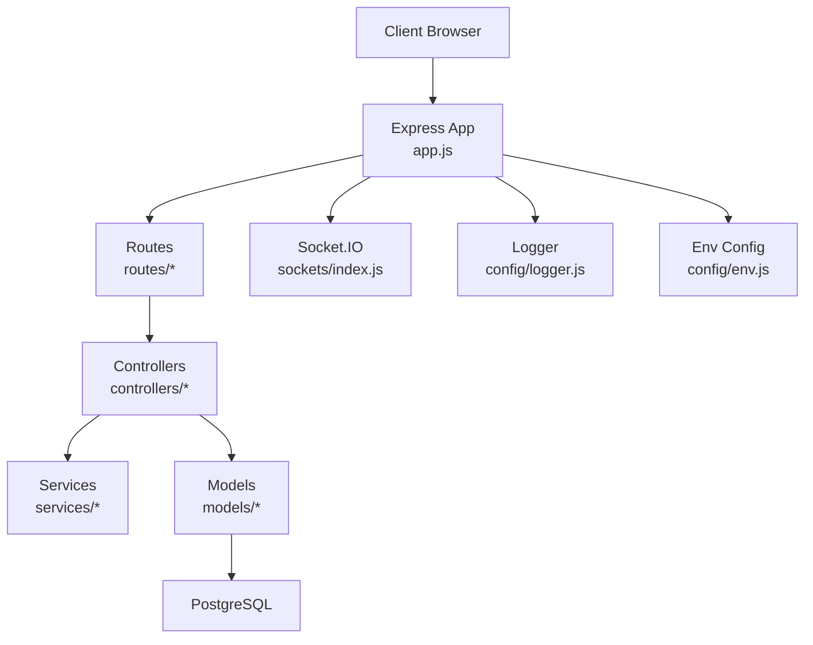
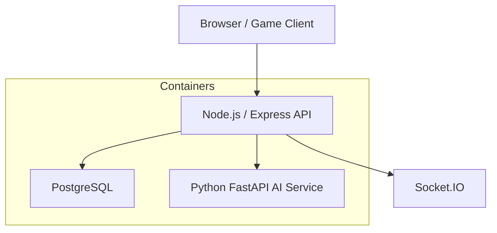
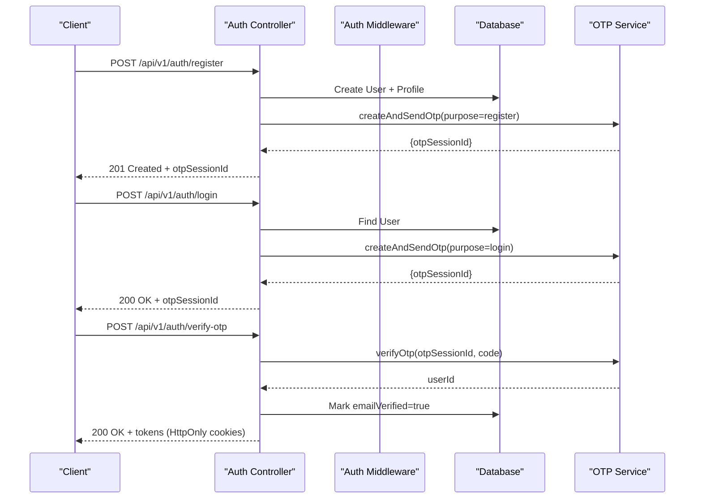
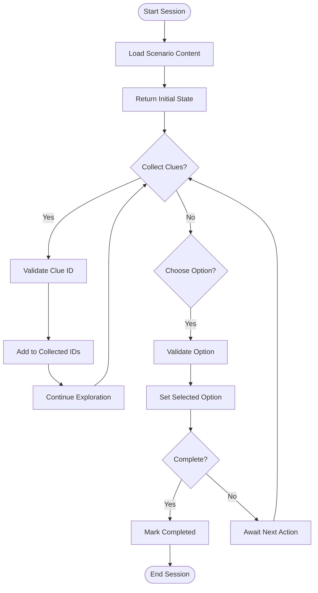
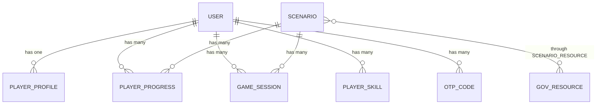
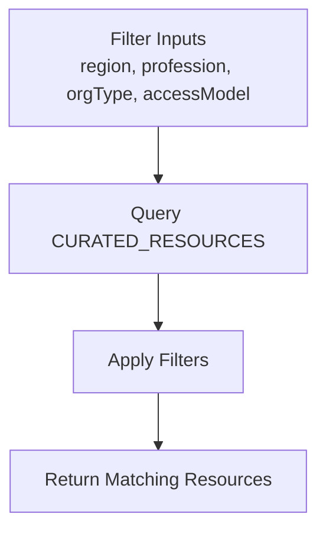
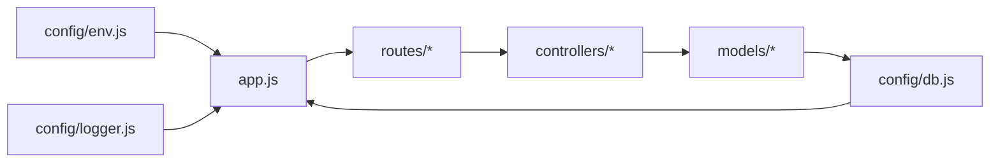

# Development Guide & Best Practices

<cite>
**Referenced Files in This Document**
- [README_GAME.md](file://README_GAME.md)
- [RESOURCE_CATALOGUE.md](file://RESOURCE_CATALOGUE.md)
- [DEPLOYMENT.md](file://DEPLOYMENT.md)
- [backend/package.json](file://backend/package.json)
- [backend/app.js](file://backend/app.js)
- [backend/server.js](file://backend/server.js)
- [backend/config/env.js](file://backend/config/env.js)
- [backend/config/logger.js](file://backend/config/logger.js)
- [backend/config/db.js](file://backend/config/db.js)
- [backend/models/index.js](file://backend/models/index.js)
- [backend/models/User.js](file://backend/models/User.js)
- [backend/models/Scenario.js](file://backend/models/Scenario.js)
- [backend/models/GovResource.js](file://backend/models/GovResource.js)
- [backend/middleware/authMiddleware.js](file://backend/middleware/authMiddleware.js)
- [backend/middleware/error-handler.js](file://backend/middleware/error-handler.js)
- [backend/controllers/auth-controller.js](file://backend/controllers/auth-controller.js)
- [backend/controllers/game-controller.js](file://backend/controllers/game-controller.js)
- [backend/config/resource-catalogue.js](file://backend/config/resource-catalogue.js)
</cite>

## Table of Contents
1. Introduction
2. Project Structure
3. Core Components
4. Architecture Overview
5. Detailed Component Analysis
6. Dependency Analysis
7. Performance Considerations
8. Troubleshooting Guide
9. Conclusion
10. Appendices

## Introduction
This guide provides development standards, project structure guidance, and workflows for building, extending, and maintaining the AwarQuest game backend and its educational resource catalog. It covers JavaScript conventions, API design principles, database naming conventions, Git branching strategy, pull request process, code review guidelines, debugging and logging practices, performance profiling, extending scenarios and puzzles, accessibility and internationalization considerations, and troubleshooting common issues.

## Project Structure
The repository is organized into a Node.js/Express backend with modular routes, controllers, middleware, models, configuration, and utilities. The frontend assets are served statically under public/. An AI microservice (FastAPI) can be integrated optionally.

Key directories and responsibilities:
- backend/app.js: Express application setup, global middleware, health endpoints, route mounting, static file serving.
- backend/server.js: HTTP server bootstrap, Socket.IO initialization, graceful shutdown.
- backend/config: Environment validation, logger, database connection, resource catalogue definitions.
- backend/routes: Feature-based route modules grouped by domain (auth, game, progress, resources, admin, etc.).
- backend/controllers: Request handlers implementing business logic and orchestrating services.
- backend/services: Cross-cutting features like game engine, OTP, email, and AI integration.
- backend/middleware: Security, validation, authentication, error handling.
- backend/models: Sequelize ORM models and associations.
- backend/public: Static assets including game UI and client-side scripts.
- backend/scripts: Utility scripts for seeding and admin tasks.
- backend/test: Game flow tests.

**Diagram sources**
- [backend/app.js:1-55](file://backend/app.js#L1-L55)
- [backend/server.js:1-47](file://backend/server.js#L1-L47)
- [backend/config/logger.js:1-13](file://backend/config/logger.js#L1-L13)
- [backend/config/env.js:1-40](file://backend/config/env.js#L1-L40)

**Section sources**
- [backend/app.js:1-55](file://backend/app.js#L1-L55)
- [backend/server.js:1-47](file://backend/server.js#L1-L47)
- [backend/package.json:1-43](file://backend/package.json#L1-L43)

## Core Components
- Application bootstrap and middleware pipeline:
  - Health endpoints and readiness checks.
  - Security headers, CORS, JSON parsing limits, cookie parsing, input sanitization.
  - Structured logging via Pino with redaction of sensitive headers.
- Authentication and authorization:
  - JWT access and refresh tokens with HttpOnly cookies.
  - OTP-based verification flow for registration and login.
  - Guest play mode controlled by environment flags.
- Game session management:
  - Start, state retrieval, action processing, completion, and chat hints.
  - State machine enforcing clue collection before decisions.
- Resource catalogue:
  - Curated government and non-government resources with region, profession tags, and access model metadata.
- Database layer:
  - Sequelize ORM with PostgreSQL, migrations, and optional auto-sync guardrails.

**Section sources**
- [backend/app.js:15-53](file://backend/app.js#L15-L53)
- [backend/middleware/authMiddleware.js:1-38](file://backend/middleware/authMiddleware.js#L1-L38)
- [backend/controllers/auth-controller.js:1-154](file://backend/controllers/auth-controller.js#L1-L154)
- [backend/controllers/game-controller.js:1-128](file://backend/controllers/game-controller.js#L1-L128)
- [backend/config/resource-catalogue.js:1-9](file://backend/config/resource-catalogue.js#L1-L9)
- [backend/config/db.js:1-45](file://backend/config/db.js#L1-L45)

## Architecture Overview
The system runs as a containerized stack with PostgreSQL, an Express API server, and an optional FastAPI AI service. The API handles authentication, scenario distribution, telemetry, and rule validation. The AI service provides contextual hints with deterministic fallback to ensure uptime.

**Diagram sources**
- [DEPLOYMENT.md:5-11](file://DEPLOYMENT.md#L5-L11)
- [backend/server.js:1-47](file://backend/server.js#L1-L47)

## Detailed Component Analysis

### Authentication Flow
- Registration creates a user and profile, sends OTP, and returns OTP session details.
- Login verifies password and sends OTP; subsequent OTP verification marks email verified and issues tokens.
- Logout invalidates sessions by incrementing token version and clearing cookies.
- Refresh reissues tokens if the session is still valid.

**Diagram sources**
- [backend/controllers/auth-controller.js:34-121](file://backend/controllers/auth-controller.js#L34-L121)

**Section sources**
- [backend/controllers/auth-controller.js:1-154](file://backend/controllers/auth-controller.js#L1-L154)
- [backend/middleware/authMiddleware.js:1-38](file://backend/middleware/authMiddleware.js#L1-L38)

### Game Session Flow
- Start creates a session, returns initial state and scenario content.
- State retrieves current session state, revealed clues, and history.
- Action enforces game rules: collect clues, choose option only after all clues, complete to finalize.
- Chat delegates to the game engine for hints.

**Diagram sources**
- [backend/controllers/game-controller.js:18-128](file://backend/controllers/game-controller.js#L18-L128)

**Section sources**
- [backend/controllers/game-controller.js:1-128](file://backend/controllers/game-controller.js#L1-L128)

### Data Model Relationships
Core entities include User, PlayerProfile, Scenario, GovResource, PlayerProgress, GameSession, AuditEvent, AnalyticsEvent, AiInteraction, and OtpCode. Associations define one-to-one and many-to-many relationships, such as Scenario to GovResource through ScenarioResource.

**Diagram sources**
- [backend/models/index.js:1-32](file://backend/models/index.js#L1-L32)

**Section sources**
- [backend/models/index.js:1-32](file://backend/models/index.js#L1-L32)
- [backend/models/User.js:1-23](file://backend/models/User.js#L1-L23)
- [backend/models/Scenario.js:1-18](file://backend/models/Scenario.js#L1-L18)
- [backend/models/GovResource.js:1-22](file://backend/models/GovResource.js#L1-L22)

### Resource Catalogue System
The catalogue supports filtering by region (state or union territory), profession tags, organization type, and access model. Curated entries include government schemes, education platforms, legal repositories, and financial literacy resources. Non-government resources are labeled clearly and marked with verification status.

**Diagram sources**
- [backend/config/resource-catalogue.js:1-9](file://backend/config/resource-catalogue.js#L1-L9)
- [RESOURCE_CATALOGUE.md:1-14](file://RESOURCE_CATALOGUE.md#L1-L14)

**Section sources**
- [backend/config/resource-catalogue.js:1-9](file://backend/config/resource-catalogue.js#L1-L9)
- [RESOURCE_CATALOGUE.md:1-14](file://RESOURCE_CATALOGUE.md#L1-L14)

## Dependency Analysis
- Environment configuration is validated at startup using Joi, ensuring required secrets and safe defaults.
- Logging uses Pino with structured fields and optional pretty printing in development.
- Database connectivity includes SSL options, pool tuning, retry settings, and migration execution.
- Error handling centralizes status codes, error codes, and request context logging.

**Diagram sources**
- [backend/config/env.js:1-40](file://backend/config/env.js#L1-L40)
- [backend/config/logger.js:1-13](file://backend/config/logger.js#L1-L13)
- [backend/config/db.js:1-45](file://backend/config/db.js#L1-L45)
- [backend/app.js:1-55](file://backend/app.js#L1-L55)

**Section sources**
- [backend/config/env.js:1-40](file://backend/config/env.js#L1-L40)
- [backend/config/logger.js:1-13](file://backend/config/logger.js#L1-L13)
- [backend/config/db.js:1-45](file://backend/config/db.js#L1-L45)
- [backend/middleware/error-handler.js:1-52](file://backend/middleware/error-handler.js#L1-L52)

## Performance Considerations
- Use production-grade logging levels and avoid verbose debug logs in high-throughput paths.
- Tune database connection pool sizes based on expected concurrency and workload.
- Enforce strict JSON parsing limits to prevent large payloads from impacting memory.
- Leverage caching strategies for read-heavy endpoints (e.g., scenario listings).
- Profile hot paths using built-in Node.js tools and consider sampling profilers for long-running processes.
- Ensure WebSocket connections are managed efficiently and closed gracefully during shutdown.

[No sources needed since this section provides general guidance]

## Troubleshooting Guide
Common issues and resolutions:
- Authentication failures:
  - Verify JWT secrets and token versions match between client and server.
  - Check cookie domains and secure flags for cross-origin setups.
- Database connection errors:
  - Confirm DATABASE_URL, SSL settings, and network reachability.
  - Ensure migrations are applied when AUTO_SYNC is disabled.
- Not found or internal errors:
  - Inspect centralized error responses for error codes and requestId.
  - Review structured logs for method, URL, and user context.
- CORS denials:
  - Update allowed origins in environment configuration.
- Graceful shutdown problems:
  - Ensure SIGTERM/SIGINT handlers close sockets and database connections.

**Section sources**
- [backend/middleware/error-handler.js:1-52](file://backend/middleware/error-handler.js#L1-L52)
- [backend/config/db.js:15-42](file://backend/config/db.js#L15-L42)
- [backend/server.js:27-39](file://backend/server.js#L27-L39)

## Conclusion
This guide outlines coding standards, architecture, and workflows for developing and extending AwarQuest. Follow the established patterns for authentication, game sessions, and resource management. Use structured logging, robust error handling, and careful environment configuration to maintain reliability and performance. Extend scenarios and puzzles by adhering to the documented data contracts and validation rules.

[No sources needed since this section summarizes without analyzing specific files]

## Appendices

### Coding Standards and Conventions
- JavaScript style:
  - Use ES modules where appropriate; keep synchronous operations minimal in request handlers.
  - Prefer async/await and wrap asynchronous controller logic with async handler utilities.
  - Keep functions focused and small; extract reusable logic into services and utils.
- API design:
  - Versioned endpoints under /api/v1.
  - Consistent response envelopes with data and error objects.
  - Stateless requests with JWTs; use HttpOnly cookies for tokens.
- Database naming:
  - Use singular table names matching model names (e.g., User, Scenario, GovResource).
  - Primary keys as UUIDs; foreign keys follow convention (e.g., userId, scenarioId).
  - Arrays and JSONB for flexible metadata (e.g., skillTags, content).

**Section sources**
- [backend/models/User.js:1-23](file://backend/models/User.js#L1-L23)
- [backend/models/Scenario.js:1-18](file://backend/models/Scenario.js#L1-L18)
- [backend/models/GovResource.js:1-22](file://backend/models/GovResource.js#L1-L22)
- [backend/controllers/auth-controller.js:10-32](file://backend/controllers/auth-controller.js#L10-L32)

### Git Branching Strategy and Pull Requests
- Branching:
  - Main branch protected; feature branches named descriptively (e.g., feat/add-scenario-x).
  - Use short-lived branches; merge via pull requests with reviews.
- Pull request process:
  - Include description, testing notes, and screenshots if UI changes.
  - Ensure CI passes and tests cover critical flows.
- Code review guidelines:
  - Check for security implications (input validation, auth, CORS).
  - Verify logging and error handling completeness.
  - Confirm adherence to API contracts and data models.

[No sources needed since this section provides general guidance]

### Debugging Techniques and Logging Practices
- Structured logging:
  - Use Pino with log levels; redact sensitive headers automatically.
  - Include requestId across logs for tracing requests.
- Debugging:
  - Enable detailed logs in development; restrict to info/warn in production.
  - Use health and readiness endpoints to validate service state.
- Profiling:
  - Use Node.js built-in profiler or sampling profilers to identify bottlenecks.
  - Monitor database query logs and optimize slow queries.

**Section sources**
- [backend/config/logger.js:1-13](file://backend/config/logger.js#L1-L13)
- [backend/app.js:18-20](file://backend/app.js#L18-L20)
- [backend/config/db.js:7-13](file://backend/config/db.js#L7-L13)

### Extending Scenarios, Puzzles, and Features
- Adding new scenarios:
  - Define scenario metadata and content in the database; mark as published when ready.
  - Ensure scenario slugs are unique and consistent.
- Adding puzzles:
  - Implement puzzle types in client-side scripts; reference them in scenario content.
  - Provide skill tips and scoring rules aligned with game state transitions.
- New features:
  - Create route, controller, and service modules following existing patterns.
  - Add validations and error handling; update tests accordingly.

**Section sources**
- [backend/models/Scenario.js:1-18](file://backend/models/Scenario.js#L1-L18)
- [backend/controllers/game-controller.js:18-128](file://backend/controllers/game-controller.js#L18-L128)
- [README_GAME.md:69-82](file://README_GAME.md#L69-L82)

### Accessibility and Internationalization
- Accessibility:
  - Ensure keyboard navigation and screen reader support in the game UI.
  - Provide alt text and labels for interactive elements.
- Internationalization:
  - Externalize strings and support locale switching in client scripts.
  - Maintain consistent language keys across UI components.

[No sources needed since this section provides general guidance]

### Deployment and Operations
- Environment variables:
  - Configure NODE_ENV, PORT, DATABASE_URL, JWT secrets, CORS origins, and AI service settings.
- Docker Compose:
  - Build and run containers; verify health endpoints.
- Migrations:
  - Apply migrations in production; disable AUTO_SYNC.
- Admin provisioning:
  - Use provided script to grant admin privileges.

**Section sources**
- [DEPLOYMENT.md:14-61](file://DEPLOYMENT.md#L14-L61)
- [backend/config/env.js:6-31](file://backend/config/env.js#L6-L31)