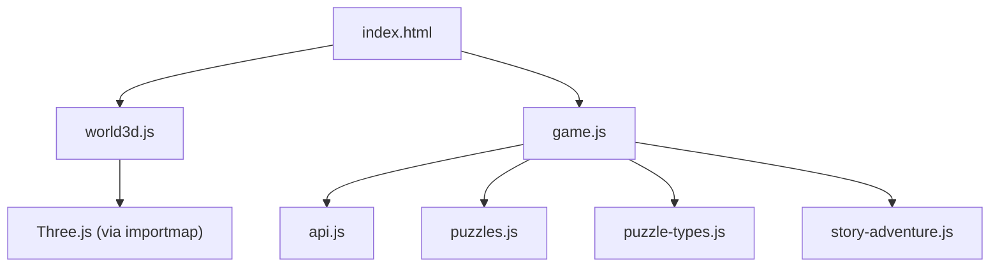
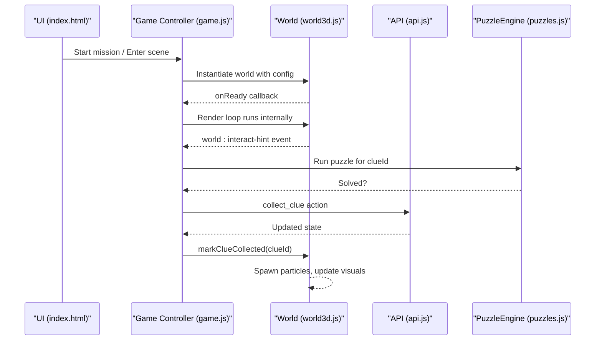
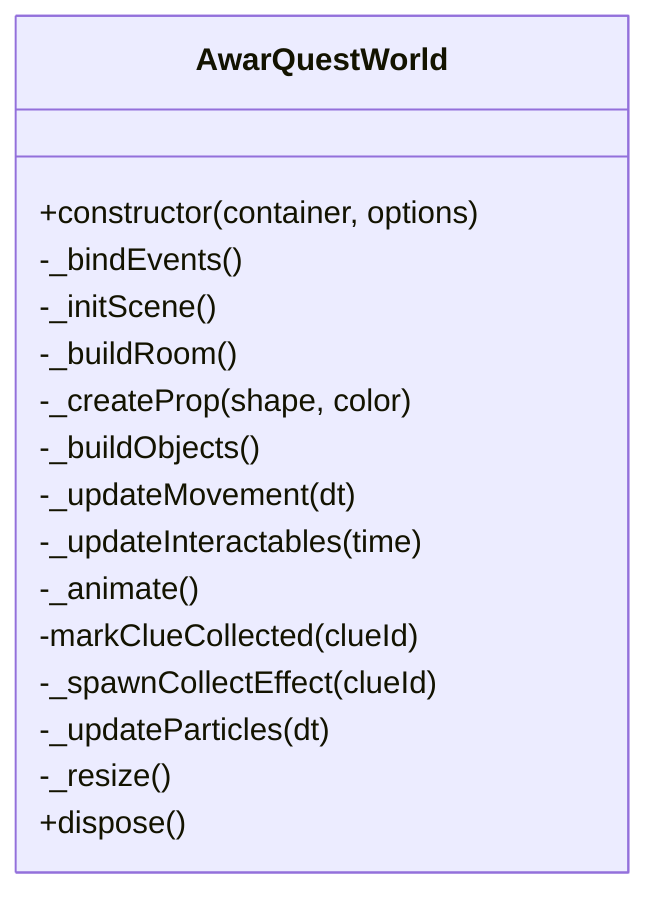
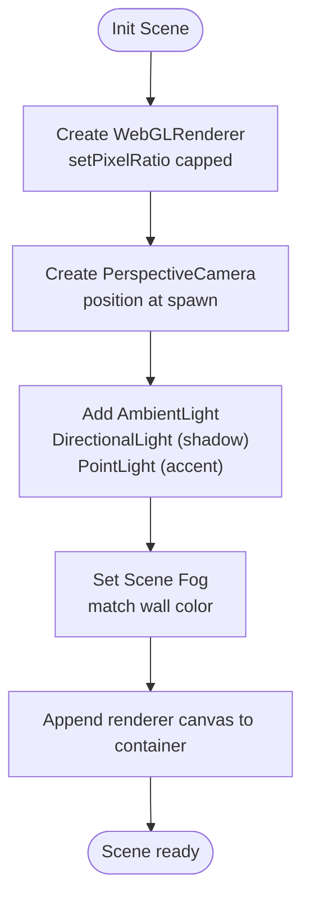
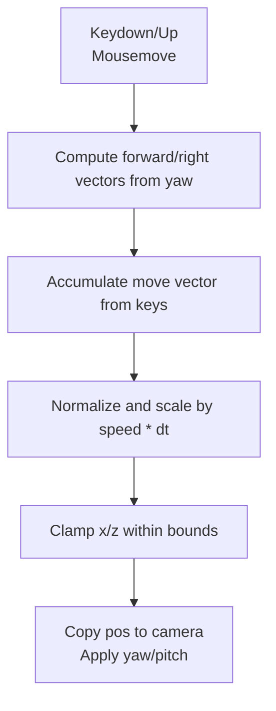
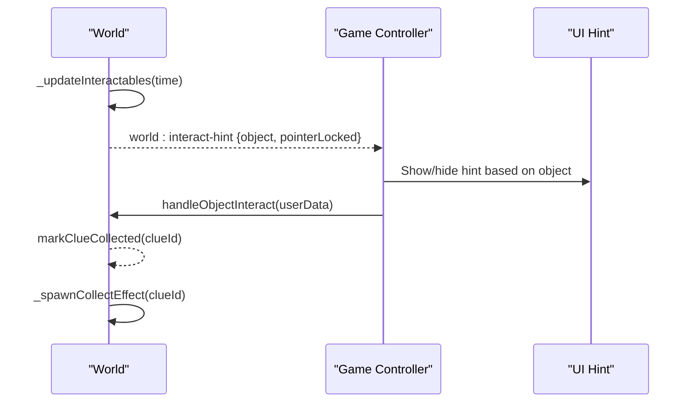
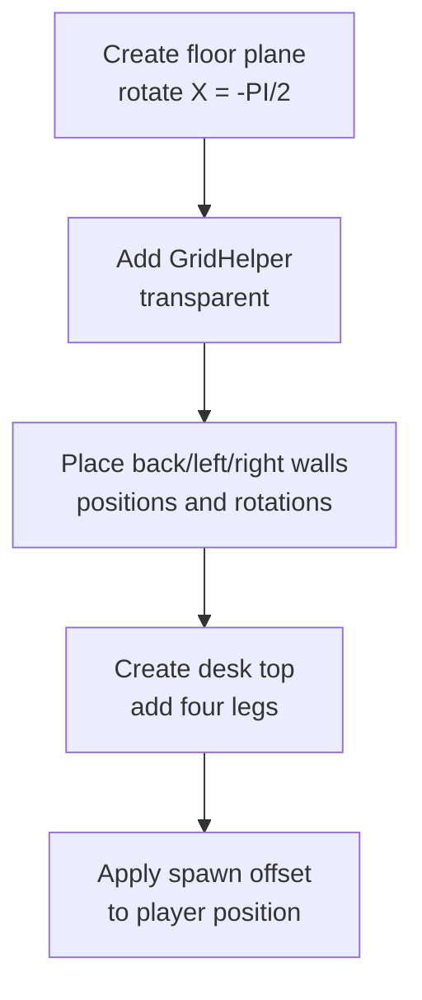
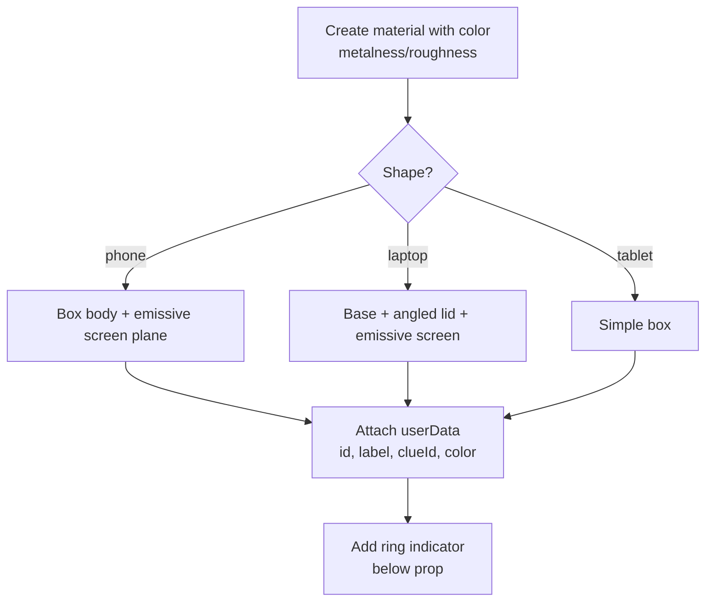
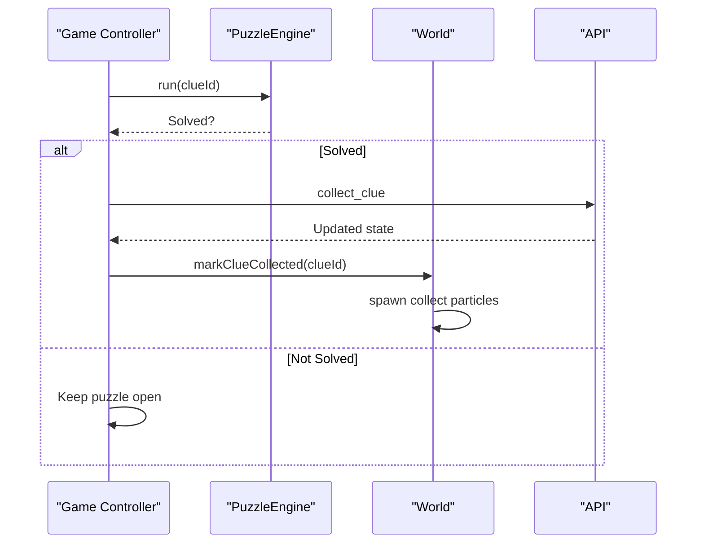
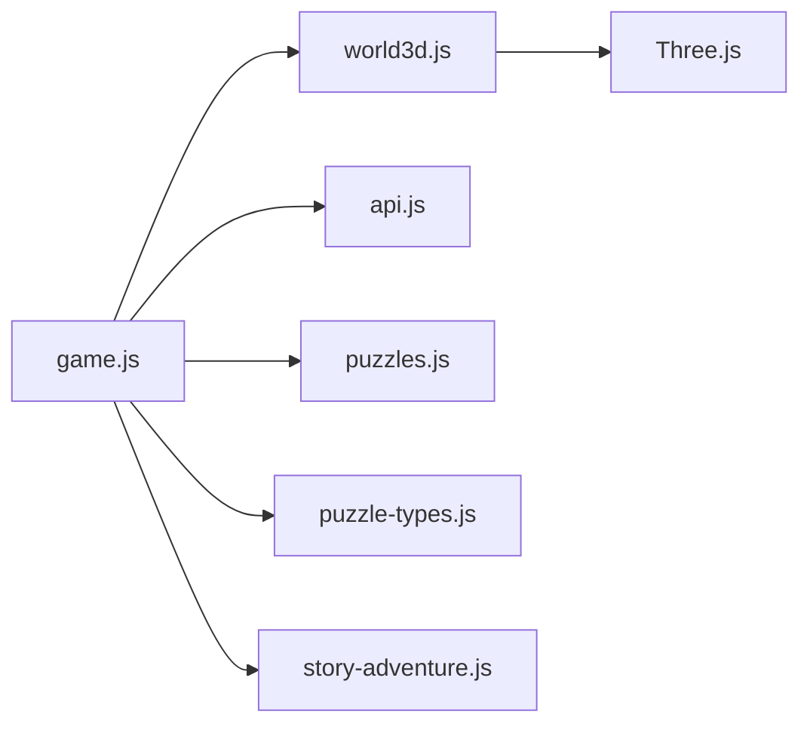

# 3D World Engine

<cite>
**Referenced Files in This Document**
- [world3d.js](file://backend/public/js/world3d.js)
- [game.js](file://backend/public/js/game.js)
- [index.html](file://backend/public/index.html)
- [api.js](file://backend/public/js/api.js)
- [puzzles.js](file://backend/public/js/puzzles.js)
- [puzzle-types.js](file://backend/public/js/puzzle-types.js)
- [story-adventure.js](file://backend/public/js/story-adventure.js)
</cite>

## Table of Contents
1. [Introduction](#introduction)
2. [Project Structure](#project-structure)
3. [Core Components](#core-components)
4. [Architecture Overview](#architecture-overview)
5. [Detailed Component Analysis](#detailed-component-analysis)
6. [Dependency Analysis](#dependency-analysis)
7. [Performance Considerations](#performance-considerations)
8. [Troubleshooting Guide](#troubleshooting-guide)
9. [Conclusion](#conclusion)
10. [Appendices](#appendices)

## Introduction
This document explains the Three.js-based 3D world engine used by the application to render an interactive first-person scene, manage player movement and interaction, and integrate with a story-driven puzzle system. It covers the world class architecture, scene initialization, camera controls, rendering pipeline (including lighting, shadows, and fog), object interaction via proximity detection and pointer lock, room construction (floor, walls, desk, props), performance optimizations, and how to create custom worlds and add new props or environmental settings.

## Project Structure
The 3D experience is implemented primarily in the client-side JavaScript files under backend/public/js, with the HTML entry point loading modules and scripts. The core 3D runtime is encapsulated in a single module that initializes the Three.js scene, builds the room and objects, handles input and animation, and exposes lifecycle methods for integration with the game flow.

**Diagram sources**
- [index.html:11-17](file://backend/public/index.html#L11-L17)
- [index.html:368-379](file://backend/public/index.html#L368-L379)
- [world3d.js:1-2](file://backend/public/js/world3d.js#L1-L2)

**Section sources**
- [index.html:1-382](file://backend/public/index.html#L1-L382)
- [world3d.js:1-363](file://backend/public/js/world3d.js#L1-L363)
- [game.js:1-825](file://backend/public/js/game.js#L1-L825)

## Core Components
- World class: Encapsulates the Three.js scene, camera, renderer, room geometry, interactable objects, input handling, animation loop, and cleanup.
- Game controller: Orchestrates mission flow, UI state, world instantiation/disposal, clue collection, and puzzle integration.
- API layer: Provides authenticated requests and mock fallbacks for local development.
- Puzzle system: Renders and validates puzzles associated with clues; integrates with rewards and XP.
- Story engine: Alternative narrative mode with chapters, chat, and puzzle gating.

Key responsibilities:
- Scene setup: Renderer, camera, lights, fog, background.
- Room building: Floor, grid helper, walls, desk, spawn position.
- Object creation: Phone, laptop, tablet props with metadata and visual indicators.
- Movement and controls: WASD/arrow keys, mouse look with pointer lock, collision boundaries.
- Interaction: Proximity detection, nearest object highlighting, collect effects, hint events.
- Lifecycle: Resize handling, disposal, memory cleanup.

**Section sources**
- [world3d.js:7-29](file://backend/public/js/world3d.js#L7-L29)
- [world3d.js:63-96](file://backend/public/js/world3d.js#L63-L96)
- [world3d.js:98-148](file://backend/public/js/world3d.js#L98-L148)
- [world3d.js:150-219](file://backend/public/js/world3d.js#L150-L219)
- [world3d.js:221-293](file://backend/public/js/world3d.js#L221-L293)
- [world3d.js:295-360](file://backend/public/js/world3d.js#L295-L360)
- [game.js:135-153](file://backend/public/js/game.js#L135-L153)
- [game.js:358-380](file://backend/public/js/game.js#L358-L380)
- [game.js:539-557](file://backend/public/js/game.js#L539-L557)

## Architecture Overview
The engine follows a modular architecture where the world module owns the Three.js context and exposes a simple interface to the game controller. The game controller manages higher-level state (missions, progress, UI) and coordinates between the world, API, puzzles, and story engine.

**Diagram sources**
- [game.js:465-482](file://backend/public/js/game.js#L465-L482)
- [game.js:358-380](file://backend/public/js/game.js#L358-L380)
- [game.js:539-557](file://backend/public/js/game.js#L539-L557)
- [world3d.js:274-293](file://backend/public/js/world3d.js#L274-L293)
- [world3d.js:295-318](file://backend/public/js/world3d.js#L295-L318)
- [puzzles.js:544-572](file://backend/public/js/puzzles.js#L544-L572)

## Detailed Component Analysis

### World Class Architecture
The world class initializes the Three.js environment, constructs the room and props, binds input events, and drives the animation loop. It exposes methods to mark clues as collected and to dispose resources cleanly.

- Scene initialization sets up renderer, camera, background, fog, ambient light, directional light with shadow mapping, and accent point light.
- Room construction creates floor, grid helper, three walls, and a desk with legs; sets spawn position from configuration.
- Prop creation supports phone, laptop, and tablet shapes with emissive screens and shadow casting.
- Movement uses yaw/pitch with WASD/arrow keys and clamps player position within bounds.
- Interactable updates compute nearest object distance, animate rings and floating, and adjust emissive intensity based on proximity.
- Animation loop updates movement, interactables, particles, renders the scene, and dispatches an event with the nearest object and pointer lock state.
- Disposal cancels animation frames, removes event listeners, exits pointer lock, disposes renderer, and removes DOM elements.

**Diagram sources**
- [world3d.js:7-29](file://backend/public/js/world3d.js#L7-L29)
- [world3d.js:63-96](file://backend/public/js/world3d.js#L63-L96)
- [world3d.js:98-148](file://backend/public/js/world3d.js#L98-L148)
- [world3d.js:150-219](file://backend/public/js/world3d.js#L150-L219)
- [world3d.js:221-293](file://backend/public/js/world3d.js#L221-L293)
- [world3d.js:295-360](file://backend/public/js/world3d.js#L295-L360)

**Section sources**
- [world3d.js:7-360](file://backend/public/js/world3d.js#L7-L360)

### Scene Initialization and Rendering Pipeline
- Renderer: WebGLRenderer with antialiasing enabled; pixel ratio capped at 2 to balance quality and performance.
- Camera: PerspectiveCamera with FOV 70 and near/far planes set appropriately for indoor scenes.
- Lighting: AmbientLight for base illumination; DirectionalLight with shadow map enabled and configured size; PointLight for accent glow.
- Fog: Scene fog matches wall color for depth cueing and performance-friendly occlusion.
- Background: Scene background color derived from configuration.

**Diagram sources**
- [world3d.js:63-96](file://backend/public/js/world3d.js#L63-L96)

**Section sources**
- [world3d.js:63-96](file://backend/public/js/world3d.js#L63-L96)

### Camera Controls and First-Person Movement
- Pointer Lock: Clicking the container requests pointer lock; mouse movement adjusts yaw and pitch with sensitivity limits to prevent flipping.
- Movement: Forward/backward and left/right vectors computed from yaw; key states tracked for WASD/arrow keys; movement normalized and scaled by delta time.
- Boundaries: Player position clamped to predefined ranges to keep the player inside the room.
- Camera Update: Camera position synced to player position; rotation order set to YXZ; yaw and pitch applied to camera rotations.

**Diagram sources**
- [world3d.js:31-61](file://backend/public/js/world3d.js#L31-L61)
- [world3d.js:221-242](file://backend/public/js/world3d.js#L221-L242)

**Section sources**
- [world3d.js:31-61](file://backend/public/js/world3d.js#L31-L61)
- [world3d.js:221-242](file://backend/public/js/world3d.js#L221-L242)

### Object Interaction System
- Proximity Detection: Each frame, distances from player to all interactables are computed; the nearest uncollected object is selected if within threshold.
- Visual Feedback: Nearby objects increase emissive intensity; collectable rings pulse and hide when collected; floating animation persists until collected.
- Pointer Lock Integration: Clicking while unlocked requests pointer lock; clicking while locked triggers interaction if nearest object exists and not collected.
- Event Dispatch: An event is emitted each frame with the nearest object data and pointer lock state for UI hints.

**Diagram sources**
- [world3d.js:244-293](file://backend/public/js/world3d.js#L244-L293)
- [world3d.js:295-318](file://backend/public/js/world3d.js#L295-L318)
- [game.js:358-380](file://backend/public/js/game.js#L358-L380)
- [game.js:539-557](file://backend/public/js/game.js#L539-L557)

**Section sources**
- [world3d.js:244-293](file://backend/public/js/world3d.js#L244-L293)
- [game.js:358-380](file://backend/public/js/game.js#L358-L380)
- [game.js:539-557](file://backend/public/js/game.js#L539-L557)

### Room Construction System
- Floor: PlaneGeometry rotated to lie flat; receives shadows; optional GridHelper for spatial reference.
- Walls: Three PlaneGeometry walls positioned and rotated to enclose the space.
- Desk: BoxGeometry top with four leg meshes; casts and receives shadows.
- Spawn Position: Configurable spawn offset applied to player position.

**Diagram sources**
- [world3d.js:98-148](file://backend/public/js/world3d.js#L98-L148)

**Section sources**
- [world3d.js:98-148](file://backend/public/js/world3d.js#L98-L148)

### Props Creation (Phone, Laptop, Tablet)
- Phone: Group with body box and screen plane; emissive screen tinted by prop color; random slight rotation for natural placement.
- Laptop: Group with base box, angled lid box, and screen plane; emissive screen; casts shadows.
- Tablet: Simple box mesh with shadow casting.
- Metadata: Each prop stores id, label, clueId, color, baseY for animation, and a ring indicator for collectability.

**Diagram sources**
- [world3d.js:150-219](file://backend/public/js/world3d.js#L150-L219)

**Section sources**
- [world3d.js:150-219](file://backend/public/js/world3d.js#L150-L219)

### Performance Optimization Techniques
- Pixel Ratio Limiting: Renderer pixel ratio capped at 2 to reduce GPU load on high-DPI displays.
- Efficient Geometry Reuse: Shared materials and repeated geometries (e.g., desk legs) minimize allocations.
- Shadow Map Size: Directional light shadow map sized to balance quality and performance.
- Particle Cleanup: Particles are removed from scene and their geometry/material disposed when life expires.
- Delta Time Cap: Frame delta capped to avoid large jumps on tab switches or lag spikes.
- Memory Management: Dispose method cancels animation frames, removes event listeners, exits pointer lock, disposes renderer, and detaches DOM nodes.

**Section sources**
- [world3d.js:75-78](file://backend/public/js/world3d.js#L75-L78)
- [world3d.js:84-88](file://backend/public/js/world3d.js#L84-L88)
- [world3d.js:320-334](file://backend/public/js/world3d.js#L320-L334)
- [world3d.js:274-279](file://backend/public/js/world3d.js#L274-L279)
- [world3d.js:345-360](file://backend/public/js/world3d.js#L345-L360)

### Integration with Puzzles and Story Mode
- Puzzle Overlay: PuzzleEngine renders overlays per clue; resolves when solved; integrates with rewards and XP.
- Story Engine: Alternative narrative mode with chapters, chat, and puzzle gating; can run without the 3D world.
- Clue Collection: After solving a puzzle, the game controller calls the world to mark the clue collected and updates UI.

**Diagram sources**
- [puzzles.js:544-572](file://backend/public/js/puzzles.js#L544-L572)
- [game.js:539-557](file://backend/public/js/game.js#L539-L557)
- [world3d.js:295-318](file://backend/public/js/world3d.js#L295-L318)

**Section sources**
- [puzzles.js:544-572](file://backend/public/js/puzzles.js#L544-L572)
- [game.js:539-557](file://backend/public/js/game.js#L539-L557)
- [story-adventure.js:495-525](file://backend/public/js/story-adventure.js#L495-L525)

## Dependency Analysis
- world3d.js depends on Three.js via importmap; it does not depend on other app modules directly except through callbacks/events.
- game.js orchestrates world lifecycle, API calls, puzzle execution, and UI updates; listens to world events.
- api.js provides network requests and mock fallbacks; used by game.js for missions, progress, scoring, and actions.
- puzzles.js and puzzle-types.js provide puzzle UI and validation logic invoked by game.js.
- story-adventure.js provides an alternative narrative mode integrated with game.js.

**Diagram sources**
- [index.html:11-17](file://backend/public/index.html#L11-L17)
- [index.html:368-379](file://backend/public/index.html#L368-L379)
- [world3d.js:1-2](file://backend/public/js/world3d.js#L1-L2)
- [game.js:135-153](file://backend/public/js/game.js#L135-L153)

**Section sources**
- [world3d.js:1-2](file://backend/public/js/world3d.js#L1-L2)
- [game.js:135-153](file://backend/public/js/game.js#L135-L153)
- [api.js:1-208](file://backend/public/js/api.js#L1-L208)
- [puzzles.js:544-572](file://backend/public/js/puzzles.js#L544-L572)
- [puzzle-types.js:1-438](file://backend/public/js/puzzle-types.js#L1-L438)
- [story-adventure.js:1-578](file://backend/public/js/story-adventure.js#L1-L578)

## Performance Considerations
- Limit pixel ratio to reduce rendering cost on high-resolution devices.
- Use reasonable shadow map sizes and enable only where needed.
- Reuse geometries and materials where possible to minimize allocations.
- Cap delta time to avoid motion jumps and ensure stable physics-like movement.
- Clean up particle systems promptly by disposing geometry and materials.
- Avoid unnecessary DOM operations during the animation loop; use efficient event-driven updates.

[No sources needed since this section provides general guidance]

## Troubleshooting Guide
- No interaction hint appears: Ensure pointer lock is active and the nearest object is within range; check that the world event is dispatched and the UI listener is attached.
- Movement feels stuck: Verify key state bindings and that pointer lock is engaged; confirm that movement vectors are computed from yaw and that keys are being tracked.
- Shadows not visible: Confirm shadow map is enabled on the renderer and directional light; ensure objects cast/receive shadows.
- Performance drops: Check pixel ratio setting, shadow map size, and number of active particles; consider reducing fog range or disabling effects temporarily.
- Memory leaks: Ensure dispose is called when leaving the scene; verify event listeners are removed and renderer is disposed.

**Section sources**
- [world3d.js:31-61](file://backend/public/js/world3d.js#L31-L61)
- [world3d.js:274-293](file://backend/public/js/world3d.js#L274-L293)
- [world3d.js:345-360](file://backend/public/js/world3d.js#L345-L360)
- [game.js:358-380](file://backend/public/js/game.js#L358-L380)

## Conclusion
The 3D world engine provides a robust, modular foundation for first-person exploration and interaction within a Three.js scene. It integrates seamlessly with the game controller, puzzle system, and story engine, offering configurable environments, efficient rendering, and clean lifecycle management. By following the patterns outlined here, you can extend the world with new props, customize environments, and optimize performance for diverse devices.

[No sources needed since this section summarizes without analyzing specific files]

## Appendices

### Creating Custom Worlds
- Define a world configuration object with theme, colors, spawn position, and objects array.
- Map scenario interactables to world objects with id, label, clueId, position, color, and shape.
- Instantiate the world with the container and configuration; handle onReady to proceed with gameplay.

Example configuration path:
- [getWorldConfig function:135-153](file://backend/public/js/game.js#L135-L153)

**Section sources**
- [game.js:135-153](file://backend/public/js/game.js#L135-L153)

### Adding New Props
- Extend the prop creation logic to support additional shapes or variations.
- Assign appropriate geometry, materials, and emissive properties for screens or highlights.
- Attach metadata (id, label, clueId, color) and optional ring indicators for collectability.

Implementation references:
- [Prop creation:150-219](file://backend/public/js/world3d.js#L150-L219)

**Section sources**
- [world3d.js:150-219](file://backend/public/js/world3d.js#L150-L219)

### Configuring Environmental Settings
- Adjust floorColor, wallColor, accent, and spawn via worldConfig.
- Modify lighting intensities, fog range, and shadow map size for desired atmosphere and performance.

Configuration references:
- [Scene initialization:63-96](file://backend/public/js/world3d.js#L63-L96)
- [Room construction:98-148](file://backend/public/js/world3d.js#L98-L148)

**Section sources**
- [world3d.js:63-96](file://backend/public/js/world3d.js#L63-L96)
- [world3d.js:98-148](file://backend/public/js/world3d.js#L98-L148)