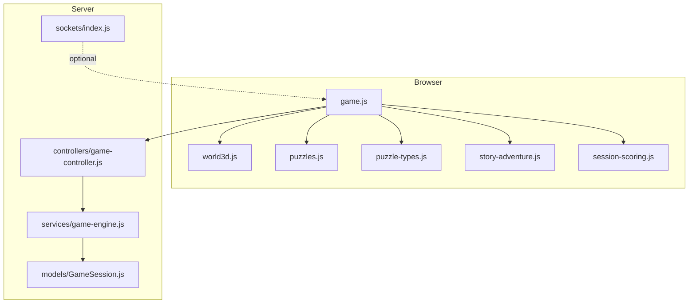
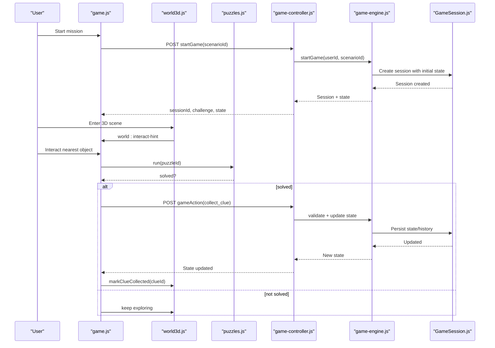
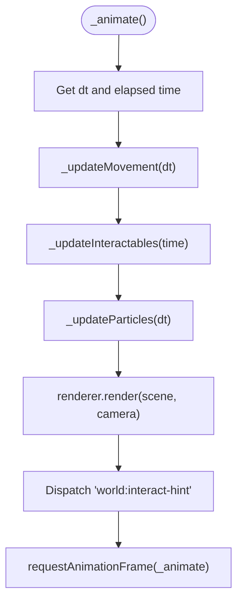
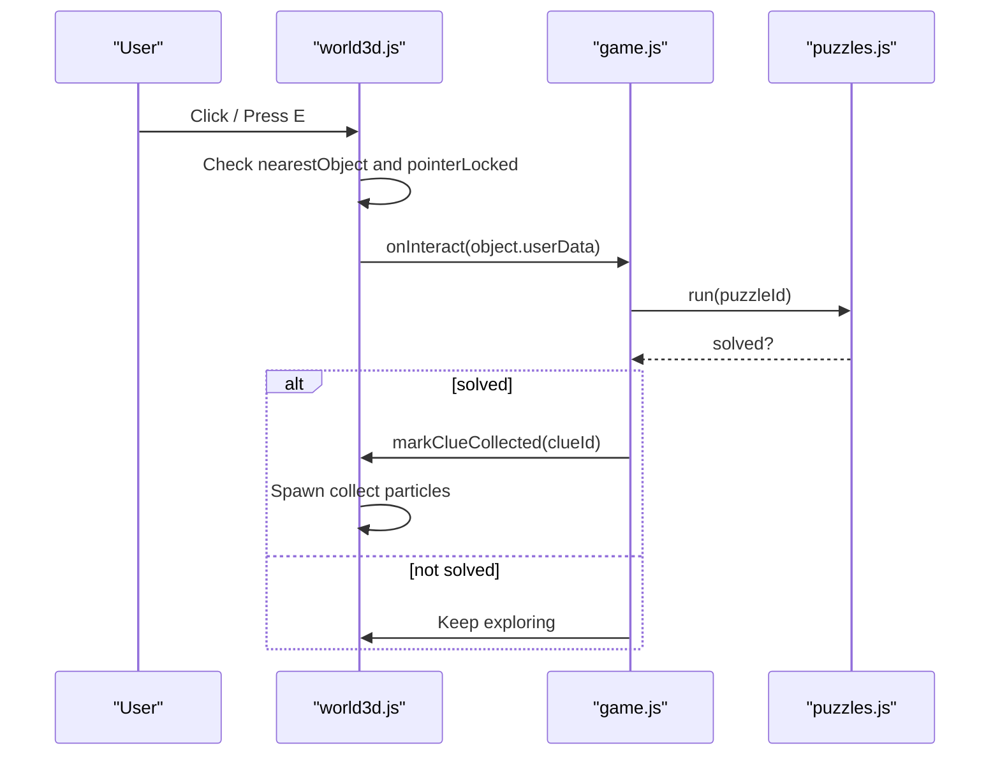
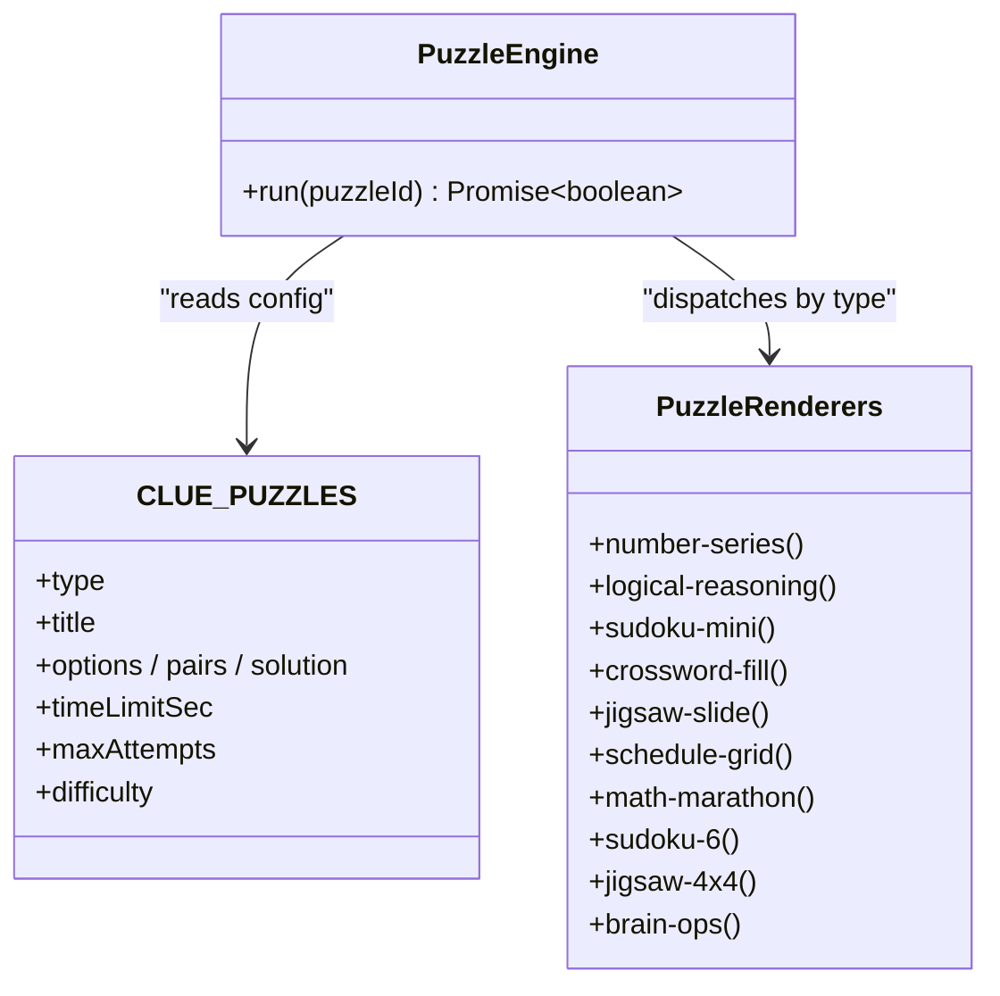
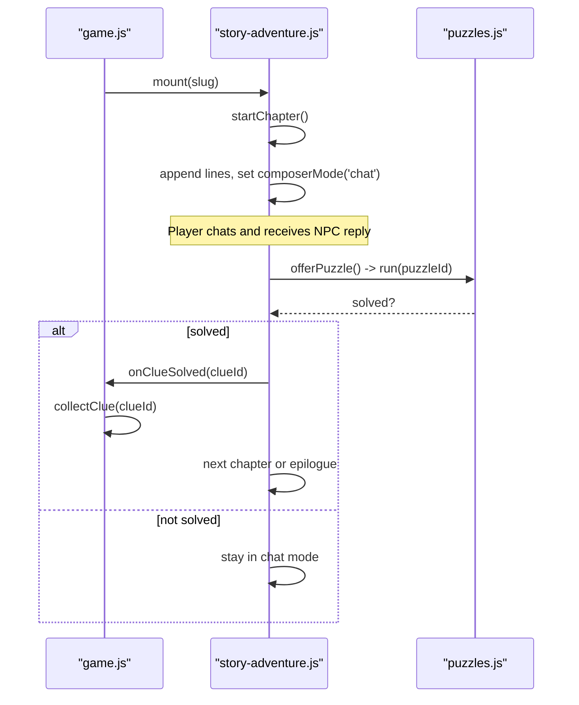
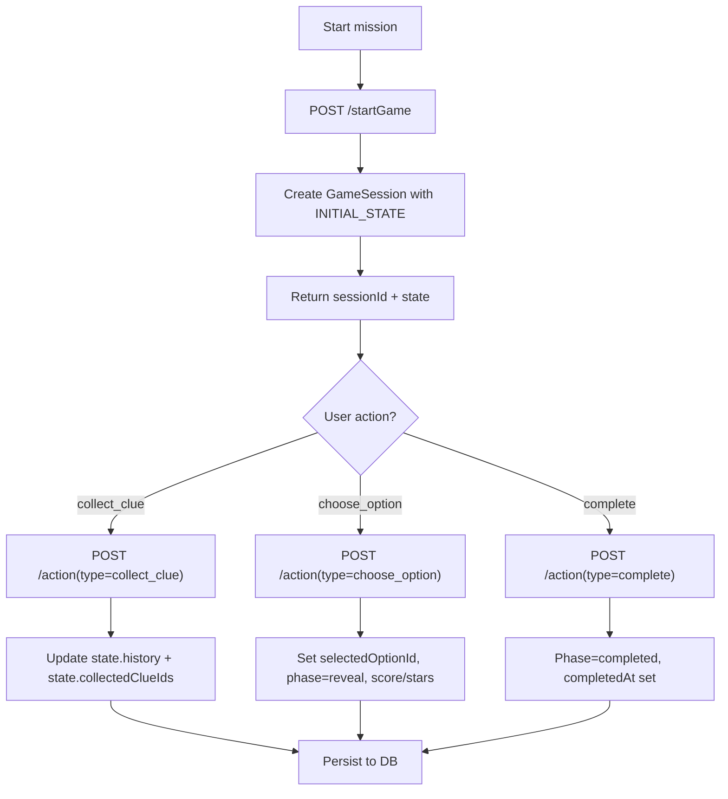
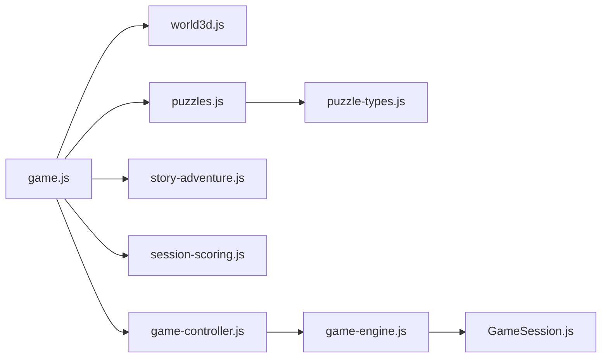

# Game Engine & 3D World

<cite>
**Referenced Files in This Document**
- [world3d.js](file://backend/public/js/world3d.js)
- [puzzles.js](file://backend/public/js/puzzles.js)
- [puzzle-types.js](file://backend/public/js/puzzle-types.js)
- [story-adventure.js](file://backend/public/js/story-adventure.js)
- [game.js](file://backend/public/js/game.js)
- [session-scoring.js](file://backend/public/js/session-scoring.js)
- [game-controller.js](file://backend/controllers/game-controller.js)
- [game-engine.js](file://backend/services/game-engine.js)
- [GameSession.js](file://backend/models/GameSession.js)
- [sockets/index.js](file://backend/sockets/index.js)
</cite>

## Table of Contents
1. Introduction
2. Project Structure
3. Core Components
4. Architecture Overview
5. Detailed Component Analysis
6. Dependency Analysis
7. Performance Considerations
8. Troubleshooting Guide
9. Conclusion
10. Appendices

## Introduction
This document explains the Three.js-based game engine and 3D world system, including the rendering pipeline, camera controls, object interaction, collision detection, puzzle system architecture, mission world structure, scene composition, asset management, game state management, session handling, client-server synchronization, performance optimizations, and guidelines for extending the game with new puzzles and worlds.

## Project Structure
The project is a full-stack application:
- Frontend (browser): Three.js 3D world, story-driven mode, puzzle overlays, UI orchestration, scoring, and API calls.
- Backend (Node/Express): REST endpoints for missions, sessions, actions, chat, and persistence via models.
- Sockets: Basic room-based socket setup for future real-time features.

**Diagram sources**
- [game.js:135-153](file://backend/public/js/game.js#L135-L153)
- [world3d.js:7-28](file://backend/public/js/world3d.js#L7-L28)
- [puzzles.js:547-648](file://backend/public/js/puzzles.js#L547-L648)
- [puzzle-types.js:22-438](file://backend/public/js/puzzle-types.js#L22-L438)
- [story-adventure.js:207-263](file://backend/public/js/story-adventure.js#L207-L263)
- [session-scoring.js:5-24](file://backend/public/js/session-scoring.js#L5-L24)
- [game-controller.js:18-50](file://backend/controllers/game-controller.js#L18-L50)
- [game-engine.js:51-64](file://backend/services/game-engine.js#L51-L64)
- [GameSession.js:4-12](file://backend/models/GameSession.js#L4-L12)
- [sockets/index.js:3-16](file://backend/sockets/index.js#L3-L16)

**Section sources**
- [game.js:1-20](file://backend/public/js/game.js#L1-L20)
- [game-controller.js:1-128](file://backend/controllers/game-controller.js#L1-L128)
- [game-engine.js:1-124](file://backend/services/game-engine.js#L1-L124)

## Core Components
- 3D World Manager: Initializes Three.js scene, camera, lighting, room geometry, interactive objects, movement, pointer lock, and animation loop.
- Puzzle System: Centralized puzzle registry, overlay renderer, multiple puzzle types (pick-one, pick-many, match-pairs, sudoku, jigsaw, schedule, math marathon, brain ops), timers, attempts, and feedback.
- Story Mode: Chaptered narrative with chat-like flow, puzzle triggers per chapter, evidence bar, and epilogue decision gate.
- Game Orchestration: Mission list, session lifecycle, clue collection, option selection, outcome display, XP and rewards, and UI transitions.
- Session & State Management: Server-side session creation, action validation, state transitions, history tracking, and completion.
- Scoring & Learning: Tracks player engagement, expert heuristics, tier calculation, XP scaling, and learning recap generation.
- Sockets: Room join/disconnect hooks for future multiplayer or live updates.

**Section sources**
- [world3d.js:7-28](file://backend/public/js/world3d.js#L7-L28)
- [puzzles.js:547-648](file://backend/public/js/puzzles.js#L547-L648)
- [puzzle-types.js:22-438](file://backend/public/js/puzzle-types.js#L22-L438)
- [story-adventure.js:207-263](file://backend/public/js/story-adventure.js#L207-L263)
- [game.js:382-482](file://backend/public/js/game.js#L382-L482)
- [game-controller.js:52-116](file://backend/controllers/game-controller.js#L52-L116)
- [session-scoring.js:5-24](file://backend/public/js/session-scoring.js#L5-L24)

## Architecture Overview
The game uses a layered architecture:
- Presentation Layer: Three.js world, story UI, puzzle overlays, and HUD.
- Application Layer: Game orchestration coordinating UI, 3D world, puzzles, and scoring.
- Service Layer: Game engine logic for session lifecycle, chat context building, and metrics.
- Data Layer: Models persisting sessions and progress; optional sockets for real-time.

**Diagram sources**
- [game.js:465-557](file://backend/public/js/game.js#L465-L557)
- [world3d.js:244-293](file://backend/public/js/world3d.js#L244-L293)
- [puzzles.js:547-648](file://backend/public/js/puzzles.js#L547-L648)
- [game-controller.js:18-50](file://backend/controllers/game-controller.js#L18-L50)
- [game-controller.js:52-116](file://backend/controllers/game-controller.js#L52-L116)
- [game-engine.js:51-64](file://backend/services/game-engine.js#L51-L64)
- [GameSession.js:4-12](file://backend/models/GameSession.js#L4-L12)

## Detailed Component Analysis

### 3D Rendering Pipeline and Camera Controls
- Scene initialization: Creates scene, background color, fog, perspective camera, WebGLRenderer with antialiasing and shadow maps, ambient and directional lights, plus an accent point light.
- Room construction: Floor plane, grid helper, three walls, desk with legs, all with materials and shadows.
- Interactive objects: Procedural props (phone, laptop, tablet) with emissive screens, placed at configured positions; each carries metadata (id, label, clueId, color).
- Movement and camera: Pointer-lock FPS-style controls; WASD/arrows move along yaw/right vectors; pitch clamped to avoid flipping; camera position synced to playerPos.
- Interaction hints: Proximity check against interactables; emits a custom event with nearest object data for UI hinting.
- Animation loop: Updates movement, interactables, particles, renders frame, and dispatches interaction hints.

**Diagram sources**
- [world3d.js:274-293](file://backend/public/js/world3d.js#L274-L293)
- [world3d.js:221-242](file://backend/public/js/world3d.js#L221-L242)
- [world3d.js:244-272](file://backend/public/js/world3d.js#L244-L272)

**Section sources**
- [world3d.js:63-96](file://backend/public/js/world3d.js#L63-L96)
- [world3d.js:98-148](file://backend/public/js/world3d.js#L98-L148)
- [world3d.js:150-218](file://backend/public/js/world3d.js#L150-L218)
- [world3d.js:221-293](file://backend/public/js/world3d.js#L221-L293)

### Object Interaction System and Collision Detection
- Proximity-based interaction: Distance from playerPos to each object’s position determines nearest candidate within INTERACT_DIST.
- Visual cues: Floating ring indicators under collectible objects; emissive intensity increases when hovered; collected items fade rings and stop floating.
- Collection flow: Click to request pointer lock if needed; click again to trigger onInteract callback with object userData; keyboard shortcut (E) also triggers interaction when locked.
- Particle effects: On collection, spawn small spheres with randomized velocities and gravity; lifecycle managed by lifetime decay and disposal.

**Diagram sources**
- [world3d.js:31-61](file://backend/public/js/world3d.js#L31-L61)
- [world3d.js:244-293](file://backend/public/js/world3d.js#L244-L293)
- [world3d.js:295-334](file://backend/public/js/world3d.js#L295-L334)
- [game.js:539-557](file://backend/public/js/game.js#L539-L557)
- [puzzles.js:547-648](file://backend/public/js/puzzles.js#L547-L648)

**Section sources**
- [world3d.js:31-61](file://backend/public/js/world3d.js#L31-L61)
- [world3d.js:244-293](file://backend/public/js/world3d.js#L244-L293)
- [world3d.js:295-334](file://backend/public/js/world3d.js#L295-L334)
- [game.js:358-380](file://backend/public/js/game.js#L358-L380)
- [game.js:539-557](file://backend/public/js/game.js#L539-L557)

### Puzzle System Architecture
- Registry: CLUE_PUZZLES defines all puzzles with type, difficulty, options, pairs, solutions, and skill tips. MISSION_WORLDS defines world themes and object layouts.
- Runtime: PuzzleEngine.run creates an overlay, sets up timer/attempts, delegates rendering based on puzzle.type, handles success/failure, and resolves a promise.
- Types: Built-in renderers for pick-one, pick-many, match-pairs; extended types include number-series, logical-reasoning, sudoku-mini, crossword-fill, jigsaw-slide, schedule-grid, math-marathon, sudoku-6, jigsaw-4x4, brain-ops.
- Feedback: Consistent feedback UI with skill tips, official resources, and XP events dispatched for gamification.

**Diagram sources**
- [puzzles.js:76-542](file://backend/public/js/puzzles.js#L76-L542)
- [puzzles.js:547-648](file://backend/public/js/puzzles.js#L547-L648)
- [puzzle-types.js:22-438](file://backend/public/js/puzzle-types.js#L22-L438)

**Section sources**
- [puzzles.js:76-542](file://backend/public/js/puzzles.js#L76-L542)
- [puzzles.js:547-648](file://backend/public/js/puzzles.js#L547-L648)
- [puzzle-types.js:22-438](file://backend/public/js/puzzle-types.js#L22-L438)

### Story Mode and Evidence Flow
- Chapters: Each story script defines chapters with clueId and puzzleId mapping, lines, and scene theme.
- Flow: Mount initializes viewport, hides 3D world, starts chapter, shows chat composer, tracks minutes left, and syncs evidence bar.
- Chat: Player messages recorded, NPC replies via ChatAgent, resource links appended when provided by puzzles.
- Decision: After last chapter, show epilogue and enable final decision button; triggers story complete callback.

**Diagram sources**
- [story-adventure.js:235-263](file://backend/public/js/story-adventure.js#L235-L263)
- [story-adventure.js:295-310](file://backend/public/js/story-adventure.js#L295-L310)
- [story-adventure.js:331-367](file://backend/public/js/story-adventure.js#L331-L367)
- [story-adventure.js:495-525](file://backend/public/js/story-adventure.js#L495-L525)
- [game.js:484-513](file://backend/public/js/game.js#L484-L513)
- [game.js:623-631](file://backend/public/js/game.js#L623-L631)

**Section sources**
- [story-adventure.js:5-205](file://backend/public/js/story-adventure.js#L5-L205)
- [story-adventure.js:207-578](file://backend/public/js/story-adventure.js#L207-L578)
- [game.js:484-513](file://backend/public/js/game.js#L484-L513)
- [game.js:623-631](file://backend/public/js/game.js#L623-L631)

### Mission World Structure and Scene Composition
- World configs: MISSION_WORLDS define theme colors, spawn points, and object arrays with id, label, clueId, x/z, color, shape.
- Dynamic fallback: getWorldConfig builds default world layout from scenario.interactables and clues when no explicit config exists.
- Scene elements: Floor, grid, walls, desk, and procedural props; each prop tagged with userData for interaction and visual feedback.

**Section sources**
- [puzzles.js:5-66](file://backend/public/js/puzzles.js#L5-L66)
- [game.js:135-153](file://backend/public/js/game.js#L135-L153)
- [world3d.js:98-218](file://backend/public/js/world3d.js#L98-L218)

### Asset Management
- Procedural assets: All 3D objects are built at runtime using Three.js primitives and materials; no external model loading is used in these files.
- Theming: Colors and accents come from worldConfig or scenario-derived defaults.
- Disposal: dispose method removes event listeners, exits pointer lock, disposes renderer, and cleans DOM.

**Section sources**
- [world3d.js:63-96](file://backend/public/js/world3d.js#L63-L96)
- [world3d.js:150-218](file://backend/public/js/world3d.js#L150-L218)
- [world3d.js:345-359](file://backend/public/js/world3d.js#L345-L359)

### Game State Management and Session Handling
- Client state: Holds missions, progress, sessionId, scenario, gameState, revealedClues, busy flag, world instance, sessionXp, sceneEntered, learningObjectives.
- Session lifecycle: startGame returns sessionId and initial state; gameAction performs collect_clue, choose_option, complete with server-side validation; state is rehydrated after each action.
- Persistence: GameSession model stores userId, scenarioId, JSONB state and history, completedAt, expiresAt.

**Diagram sources**
- [game-controller.js:18-50](file://backend/controllers/game-controller.js#L18-L50)
- [game-controller.js:52-116](file://backend/controllers/game-controller.js#L52-L116)
- [game-engine.js:51-64](file://backend/services/game-engine.js#L51-L64)
- [GameSession.js:4-12](file://backend/models/GameSession.js#L4-L12)

**Section sources**
- [game.js:8-20](file://backend/public/js/game.js#L8-L20)
- [game.js:465-482](file://backend/public/js/game.js#L465-L482)
- [game-controller.js:18-116](file://backend/controllers/game-controller.js#L18-L116)
- [game-engine.js:51-64](file://backend/services/game-engine.js#L51-L64)
- [GameSession.js:4-12](file://backend/models/GameSession.js#L4-L12)

### Client-Server Synchronization
- REST APIs: startGame, state, action, chat, challenges provide authoritative state transitions and content.
- Event-driven UI: world:interact-hint drives UI hints; game:xp drives XP popups; session-scoring integrates with XP scaling.
- Optional sockets: initializeSockets supports join_game rooms for future real-time collaboration or broadcasting.

**Section sources**
- [game.js:350-380](file://backend/public/js/game.js#L350-L380)
- [game-controller.js:18-128](file://backend/controllers/game-controller.js#L18-L128)
- [sockets/index.js:3-16](file://backend/sockets/index.js#L3-L16)

### Scoring and Learning Recap
- Engagement tracking: Counts player messages, detects expert patterns via regex categories, records puzzle skips/chapters with chat.
- Tier calculation: expert, standard, puzzle_rush tiers influence XP multiplier.
- Learning packs: Per scenario takeaways and schemes/helplines rendered at end-of-session.

**Section sources**
- [session-scoring.js:5-24](file://backend/public/js/session-scoring.js#L5-L24)
- [session-scoring.js:94-155](file://backend/public/js/session-scoring.js#L94-L155)
- [session-scoring.js:157-211](file://backend/public/js/session-scoring.js#L157-L211)

## Dependency Analysis
- game.js depends on world3d.js for 3D interactions, puzzles.js for puzzle overlays, story-adventure.js for narrative mode, session-scoring.js for XP/tier, and game-controller.js for backend operations.
- world3d.js is self-contained except for global window.LifeSkillsWorld usage and CSS classes.
- puzzles.js depends on puzzle-types.js for extended renderers and window.RewardFX for effects.
- story-adventure.js depends on window.ChatAgent and window.SessionScore.
- game-controller.js depends on game-engine.js and models.
- game-engine.js depends on models and AI service integration for chat decisions.

**Diagram sources**
- [game.js:135-153](file://backend/public/js/game.js#L135-L153)
- [puzzles.js:547-648](file://backend/public/js/puzzles.js#L547-L648)
- [puzzle-types.js:22-438](file://backend/public/js/puzzle-types.js#L22-L438)
- [story-adventure.js:207-263](file://backend/public/js/story-adventure.js#L207-L263)
- [game-controller.js:1-128](file://backend/controllers/game-controller.js#L1-L128)
- [game-engine.js:1-124](file://backend/services/game-engine.js#L1-L124)
- [GameSession.js:4-12](file://backend/models/GameSession.js#L4-L12)

**Section sources**
- [game.js:135-153](file://backend/public/js/game.js#L135-L153)
- [puzzles.js:547-648](file://backend/public/js/puzzles.js#L547-L648)
- [puzzle-types.js:22-438](file://backend/public/js/puzzle-types.js#L22-L438)
- [story-adventure.js:207-263](file://backend/public/js/story-adventure.js#L207-L263)
- [game-controller.js:1-128](file://backend/controllers/game-controller.js#L1-L128)
- [game-engine.js:1-124](file://backend/services/game-engine.js#L1-L124)
- [GameSession.js:4-12](file://backend/models/GameSession.js#L4-L12)

## Performance Considerations
- Rendering
  - Limit pixel ratio to devicePixelRatio capped at 2 to balance quality and performance.
  - Use simple geometries and shared materials where possible; reuse meshes for repeated props.
  - Shadows enabled but kept minimal (single directional light with moderate map size).
  - Fog reduces draw distance complexity.
- Interaction
  - Proximity checks iterate only interactables array; keep object count reasonable.
  - Avoid heavy DOM manipulations inside animation loop; use event-driven updates.
- Memory
  - Dispose renderer and remove DOM nodes on world disposal.
  - Particle lifecycles remove geometries and materials when expired.
- Network
  - Batch requests where possible; load missions, progress, and scores concurrently.
  - Validate actions server-side to prevent redundant state changes.
- Puzzles
  - Timers and attempt limits reduce long-running loops.
  - Reuse DOM structures and disable inputs upon completion to minimize reflows.

[No sources needed since this section provides general guidance]

## Troubleshooting Guide
- No 3D scene appears
  - Ensure container element exists and has dimensions; check that renderer is appended and resize handler runs.
  - Verify worldConfig and MISSION_WORLDS keys exist for the current scenario slug.
- Cannot interact with objects
  - Confirm pointer lock is acquired on first click; ensure nearestObject is within INTERACT_DIST.
  - Check that clueId is present in object.userData and not already collected.
- Puzzle does not open
  - Verify puzzleId maps to a defined entry in CLUE_PUZZLES; ensure PuzzleEngine.run is called with correct ID.
- Session errors
  - If SESSION_NOT_FOUND or ALREADY_DECIDED occurs, verify sessionId validity and that user hasn’t already chosen an option.
- Chat failures
  - If ChatAgent fails, story mode falls back to guide message; ensure network connectivity and API availability.

**Section sources**
- [world3d.js:31-61](file://backend/public/js/world3d.js#L31-L61)
- [world3d.js:244-293](file://backend/public/js/world3d.js#L244-L293)
- [puzzles.js:547-648](file://backend/public/js/puzzles.js#L547-L648)
- [game-controller.js:8-16](file://backend/controllers/game-controller.js#L8-L16)
- [game-controller.js:52-116](file://backend/controllers/game-controller.js#L52-L116)
- [story-adventure.js:331-367](file://backend/public/js/story-adventure.js#L331-L367)

## Conclusion
The system combines a lightweight Three.js world with a robust puzzle framework and a story-driven mode to teach real-world safety skills. The client orchestrates interactions, while the server enforces state transitions and persists sessions. Scoring and learning recaps reinforce educational outcomes. Extensibility is straightforward through world configs, puzzle definitions, and story scripts.

[No sources needed since this section summarizes without analyzing specific files]

## Appendices

### Guidelines for Creating New Puzzle Types
- Define puzzle configuration in CLUE_PUZZLES with type, title, options/pairs/solution, difficulty, and skillTip.
- Implement a renderer function in PuzzleRenderers keyed by type; handle input, validation, feedback, and success callbacks.
- Integrate with PuzzleEngine.run routing; ensure it dispatches to your renderer.
- Optionally attach resources and trigger XP events on success.

**Section sources**
- [puzzles.js:76-542](file://backend/public/js/puzzles.js#L76-L542)
- [puzzle-types.js:22-438](file://backend/public/js/puzzle-types.js#L22-L438)
- [puzzles.js:547-648](file://backend/public/js/puzzles.js#L547-L648)

### Guidelines for Adding New Worlds
- Add an entry to MISSION_WORLDS with theme colors, spawn point, and objects array containing id, label, clueId, x/z, color, shape.
- Ensure scenario.slug matches the world key; getWorldConfig will use the matching config.
- Place objects so they are reachable and visually distinct; assign unique clueIds linked to puzzles.

**Section sources**
- [puzzles.js:5-66](file://backend/public/js/puzzles.js#L5-L66)
- [game.js:135-153](file://backend/public/js/game.js#L135-L153)
- [world3d.js:189-218](file://backend/public/js/world3d.js#L189-L218)

### Extending Game Mechanics
- New game actions: Extend game-controller action handler with new types and validations; update client flows accordingly.
- New story chapters: Add entries in STORY_SCRIPTS with clueId and puzzleId mappings; ensure onClueSolved triggers collectClue.
- New scoring rules: Update SessionScore EXPERT_CHECKS and LEARNING_PACKS to reflect new behaviors and resources.

**Section sources**
- [game-controller.js:52-116](file://backend/controllers/game-controller.js#L52-L116)
- [story-adventure.js:495-525](file://backend/public/js/story-adventure.js#L495-L525)
- [session-scoring.js:17-24](file://backend/public/js/session-scoring.js#L17-L24)
- [session-scoring.js:25-92](file://backend/public/js/session-scoring.js#L25-L92)