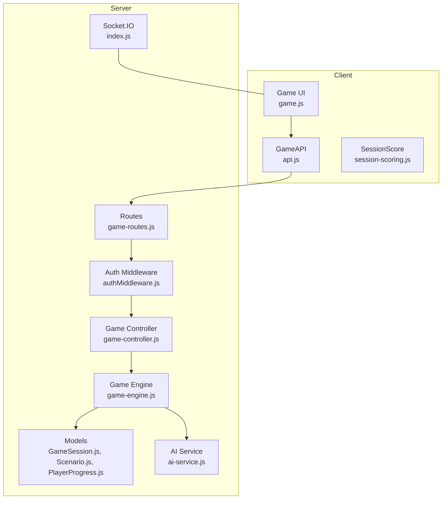
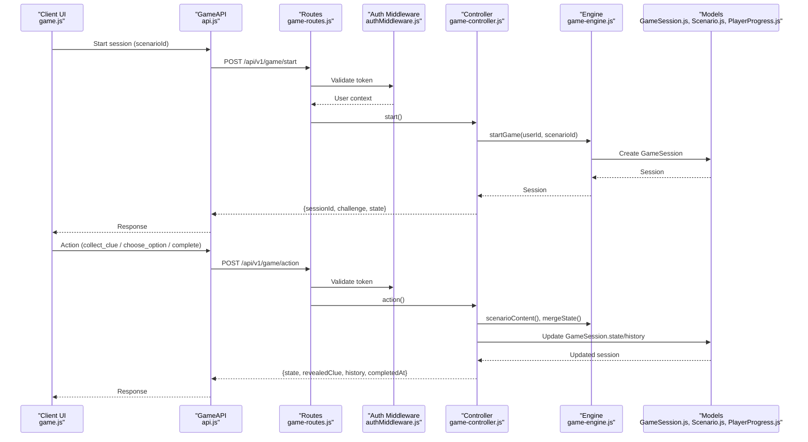
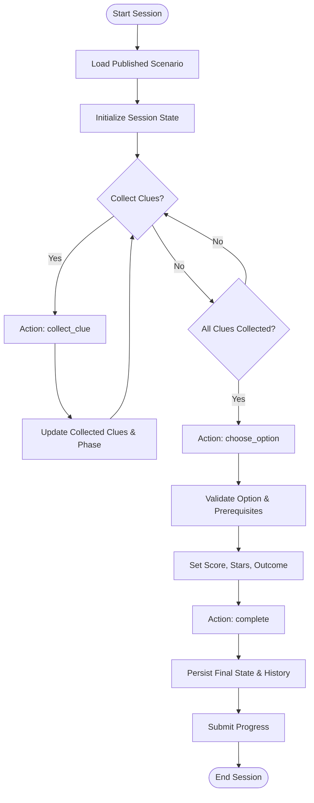
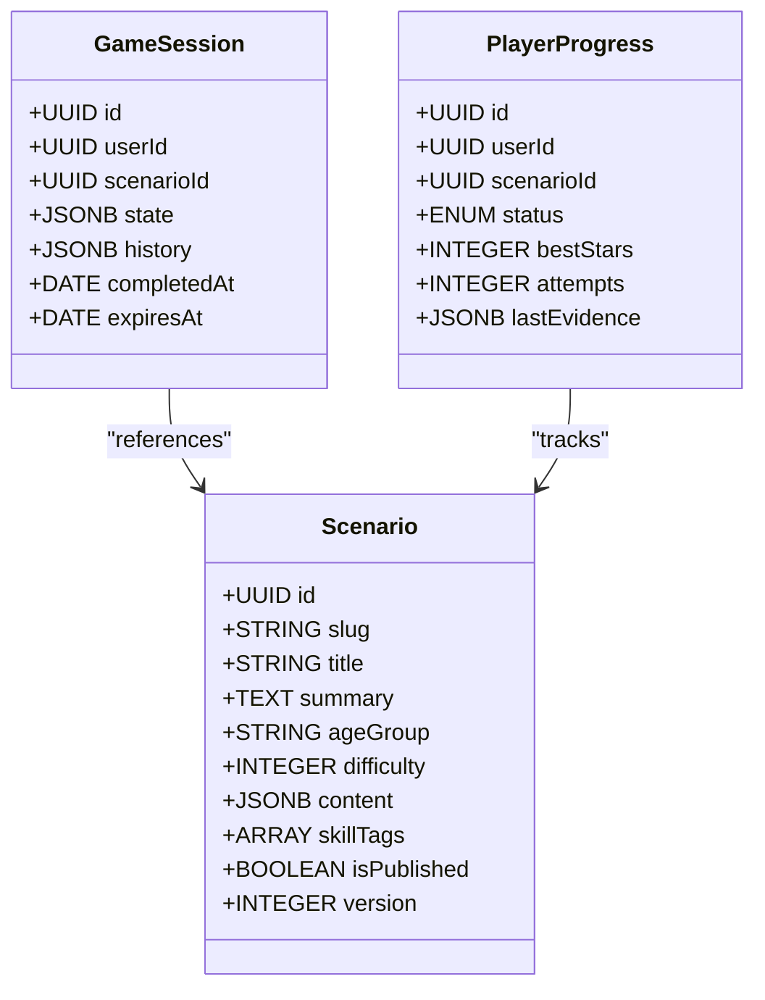
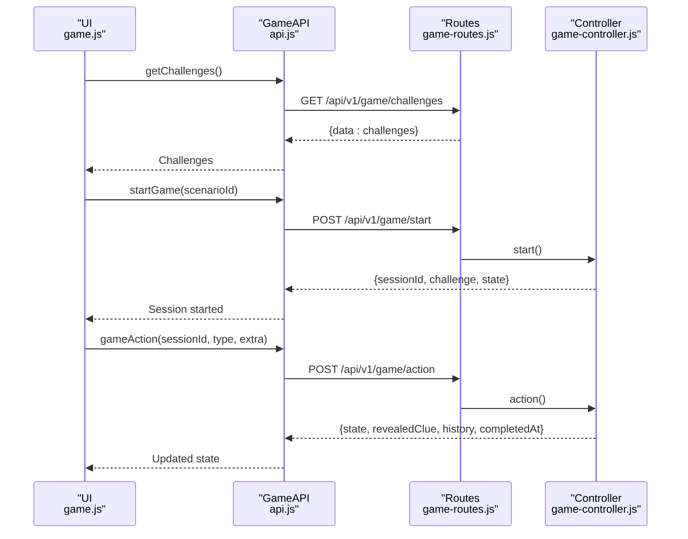
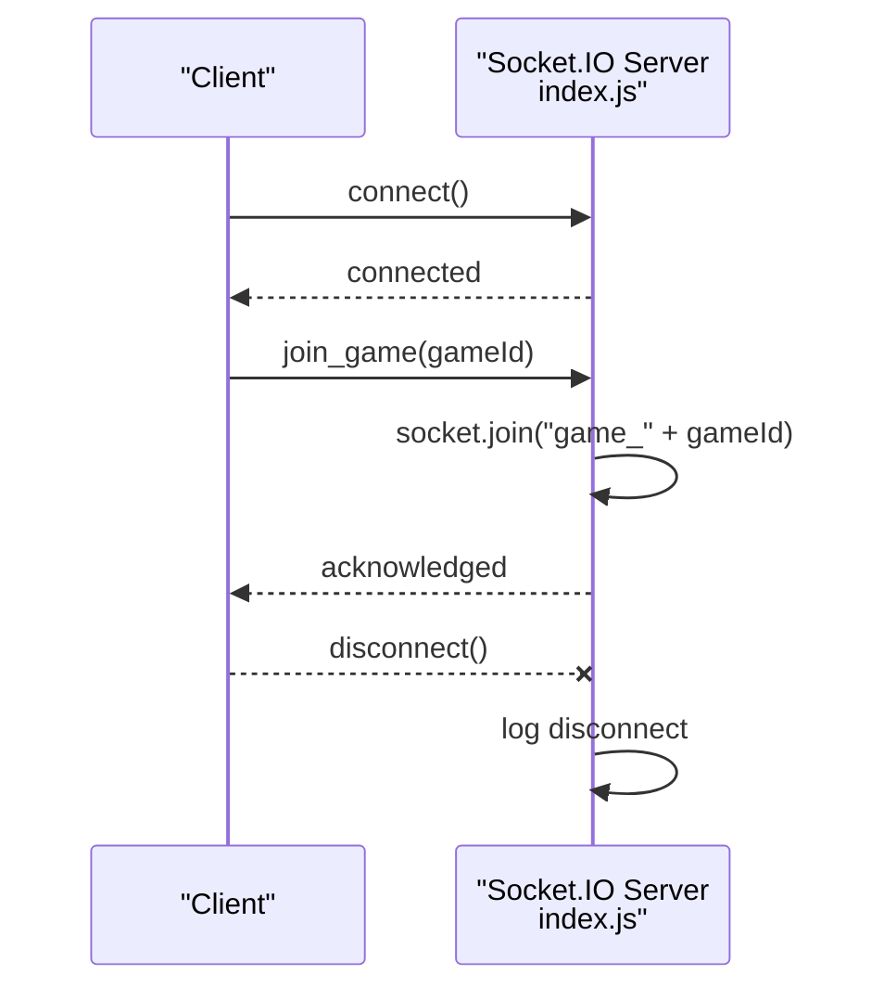
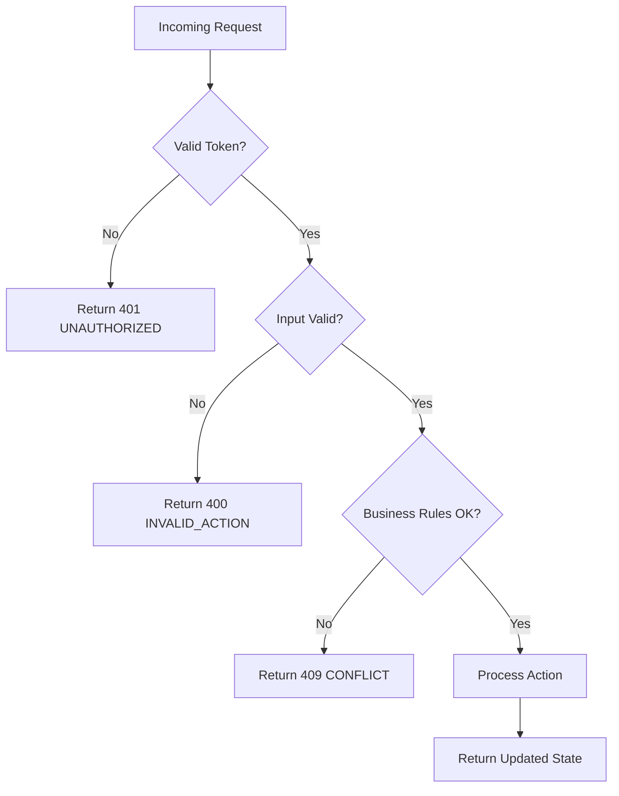
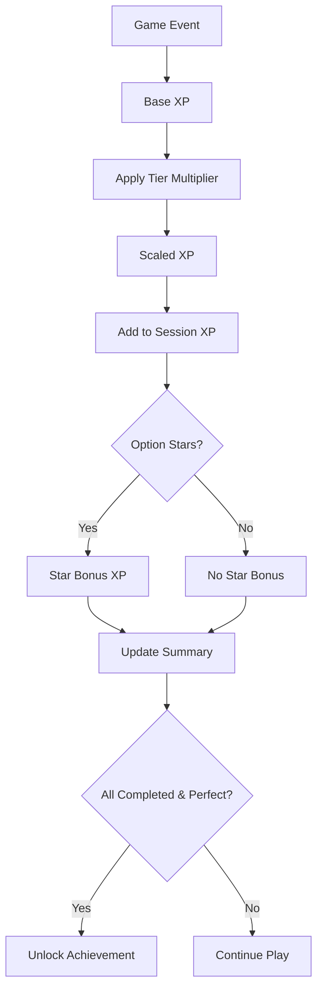
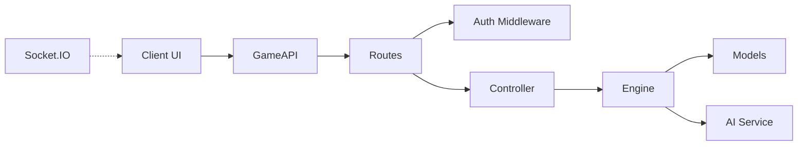

# Game Session Management

<cite>
**Referenced Files in This Document**
- [game-controller.js](file://backend/controllers/game-controller.js)
- [game-engine.js](file://backend/services/game-engine.js)
- [GameSession.js](file://backend/models/GameSession.js)
- [Scenario.js](file://backend/models/Scenario.js)
- [PlayerProgress.js](file://backend/models/PlayerProgress.js)
- [score-controller.js](file://backend/controllers/score-controller.js)
- [ai-service.js](file://backend/services/ai-service.js)
- [authMiddleware.js](file://backend/middleware/authMiddleware.js)
- [app-error.js](file://backend/utils/app-error.js)
- [game-routes.js](file://backend/routes/game-routes.js)
- [index.js](file://backend/sockets/index.js)
- [api.js](file://backend/public/js/api.js)
- [game.js](file://backend/public/js/game.js)
- [session-scoring.js](file://backend/public/js/session-scoring.js)
</cite>

## Table of Contents
1. [Introduction](#introduction)
2. [Project Structure](#project-structure)
3. [Core Components](#core-components)
4. [Architecture Overview](#architecture-overview)
5. [Detailed Component Analysis](#detailed-component-analysis)
6. [Dependency Analysis](#dependency-analysis)
7. [Performance Considerations](#performance-considerations)
8. [Troubleshooting Guide](#troubleshooting-guide)
9. [Conclusion](#conclusion)
10. [Appendices](#appendices)

## Introduction
This document explains how game sessions are created, synchronized, and completed across client and server. It covers the full lifecycle from scenario selection to completion, including state synchronization, real-time updates via Socket.IO, the game state model (player position, collected clues, puzzle progress, score), client-server communication patterns for action processing, validation, and progress updates. It also documents error handling strategies and the scoring system that calculates XP, stars, and achievements based on player performance. Finally, it provides guidance for extending game mechanics, adding new actions, and implementing custom events.

## Project Structure
The backend exposes REST endpoints for session management and a Socket.IO layer for room-based messaging. The frontend orchestrates user interactions, calls the API, and renders the game flow and rewards.

**Diagram sources**
- [game-routes.js:1-15](file://backend/routes/game-routes.js#L1-L15)
- [authMiddleware.js:1-38](file://backend/middleware/authMiddleware.js#L1-L38)
- [game-controller.js:1-128](file://backend/controllers/game-controller.js#L1-L128)
- [game-engine.js:1-124](file://backend/services/game-engine.js#L1-L124)
- [GameSession.js:1-15](file://backend/models/GameSession.js#L1-L15)
- [Scenario.js:1-18](file://backend/models/Scenario.js#L1-L18)
- [PlayerProgress.js:1-17](file://backend/models/PlayerProgress.js#L1-L17)
- [ai-service.js:1-51](file://backend/services/ai-service.js#L1-L51)
- [index.js:1-19](file://backend/sockets/index.js#L1-L19)
- [api.js:1-208](file://backend/public/js/api.js#L1-L208)
- [game.js:1-825](file://backend/public/js/game.js#L1-L825)

**Section sources**
- [game-routes.js:1-15](file://backend/routes/game-routes.js#L1-L15)
- [game-controller.js:1-128](file://backend/controllers/game-controller.js#L1-L128)
- [game-engine.js:1-124](file://backend/services/game-engine.js#L1-L124)
- [api.js:1-208](file://backend/public/js/api.js#L1-L208)
- [game.js:1-825](file://backend/public/js/game.js#L1-L825)

## Core Components
- Session lifecycle: start, state retrieval, action processing, completion, and progress submission.
- State model: phase, collected clues, selected option, score, stars, outcome, history, timestamps.
- Scoring: per-action XP, star-based bonuses, tiered multipliers, and achievement readiness.
- Real-time layer: Socket.IO rooms for joining games and broadcasting events.
- AI-assisted chat: deterministic fallback with optional external service.

**Section sources**
- [game-controller.js:18-128](file://backend/controllers/game-controller.js#L18-L128)
- [game-engine.js:5-64](file://backend/services/game-engine.js#L5-L64)
- [score-controller.js:1-24](file://backend/controllers/score-controller.js#L1-L24)
- [index.js:1-19](file://backend/sockets/index.js#L1-L19)
- [ai-service.js:1-51](file://backend/services/ai-service.js#L1-L51)

## Architecture Overview
The client initiates a session by selecting a published scenario. The server creates a persistent session with an initial state and returns the challenge content and merged state. During gameplay, the client sends actions (collect clue, choose option, complete). The controller validates inputs, enforces rules, updates the session, and returns the new state plus any revealed clues or completion timestamp. On completion, the client submits progress and displays results using the scoring module.

**Diagram sources**
- [game-routes.js:1-15](file://backend/routes/game-routes.js#L1-L15)
- [authMiddleware.js:1-38](file://backend/middleware/authMiddleware.js#L1-L38)
- [game-controller.js:18-128](file://backend/controllers/game-controller.js#L18-L128)
- [game-engine.js:31-64](file://backend/services/game-engine.js#L31-L64)
- [GameSession.js:1-15](file://backend/models/GameSession.js#L1-L15)
- [Scenario.js:1-18](file://backend/models/Scenario.js#L1-L18)
- [PlayerProgress.js:1-17](file://backend/models/PlayerProgress.js#L1-L17)

## Detailed Component Analysis

### Game Lifecycle: From Scenario Selection to Completion
- Start: The client requests a new session with a published scenario. The engine verifies availability, sets expiration, and initializes state.
- Exploration: The client solves puzzles to collect clues; each successful solve triggers a collect_clue action.
- Decision: After collecting all required clues, the client chooses an option. The server validates prerequisites and assigns score/stars/outcome.
- Completion: The client signals completion; the server marks the session as completed and persists the final state and history.
- Progress: The client submits progress with evidence and session XP, enabling summary calculations.

**Diagram sources**
- [game-controller.js:18-128](file://backend/controllers/game-controller.js#L18-L128)
- [game-engine.js:51-64](file://backend/services/game-engine.js#L51-L64)
- [game.js:465-705](file://backend/public/js/game.js#L465-L705)

**Section sources**
- [game-controller.js:18-128](file://backend/controllers/game-controller.js#L18-L128)
- [game-engine.js:51-64](file://backend/services/game-engine.js#L51-L64)
- [game.js:465-705](file://backend/public/js/game.js#L465-L705)

### Game State Model
- Phase progression: presentation → exploration → reveal → completed.
- Collected clues: array of clue IDs; used to gate decision-making.
- Selected option: stores chosen action ID once decided.
- Score and stars: derived from option metadata; clamped to valid ranges.
- Outcome text: returned to the client for display.
- History: immutable log of actions with timestamps.
- Expiration: session validity window enforced by server.

**Diagram sources**
- [GameSession.js:1-15](file://backend/models/GameSession.js#L1-L15)
- [Scenario.js:1-18](file://backend/models/Scenario.js#L1-L18)
- [PlayerProgress.js:1-17](file://backend/models/PlayerProgress.js#L1-L17)

**Section sources**
- [GameSession.js:1-15](file://backend/models/GameSession.js#L1-L15)
- [Scenario.js:1-18](file://backend/models/Scenario.js#L1-L18)
- [PlayerProgress.js:1-17](file://backend/models/PlayerProgress.js#L1-L17)

### Client-Server Communication Patterns
- Authentication: JWT-based middleware validates requests and attaches user context.
- REST endpoints:
  - GET /challenges: list published scenarios.
  - POST /start: create session and return initial state.
  - GET /state: fetch current session state and revealed clues.
  - POST /action: process collect_clue, choose_option, complete.
  - POST /chat: send messages and receive AI-driven responses.
- Client API:
  - Encapsulates auth, guest mode, and mock fallbacks.
  - Emits events for XP and integrates with reward effects.
- Real-time:
  - Socket.IO rooms allow joining game channels for future broadcasts.

**Diagram sources**
- [api.js:162-208](file://backend/public/js/api.js#L162-L208)
- [game-routes.js:1-15](file://backend/routes/game-routes.js#L1-L15)
- [game-controller.js:18-128](file://backend/controllers/game-controller.js#L18-L128)

**Section sources**
- [api.js:1-208](file://backend/public/js/api.js#L1-L208)
- [game-routes.js:1-15](file://backend/routes/game-routes.js#L1-L15)
- [game-controller.js:18-128](file://backend/controllers/game-controller.js#L18-L128)

### Real-Time Updates via Socket.IO
- Rooms: Clients join a room identified by gameId to receive targeted updates.
- Events: join_game and disconnect are handled with logging.
- Extensibility: Additional events can be emitted to broadcast state changes or notifications.

**Diagram sources**
- [index.js:1-19](file://backend/sockets/index.js#L1-L19)

**Section sources**
- [index.js:1-19](file://backend/sockets/index.js#L1-L19)

### Error Handling Strategies
- Network errors: Client wraps fetch failures and unauthorized responses with clear messages and clears auth when needed.
- Validation errors: Controller throws structured AppError instances with status codes and codes for consistent error payloads.
- Session validation: Active session checks prevent operations on expired or completed sessions.
- AI fallback: If the AI service is unavailable or times out, deterministic logic ensures continuity.

**Diagram sources**
- [authMiddleware.js:1-38](file://backend/middleware/authMiddleware.js#L1-L38)
- [game-controller.js:52-128](file://backend/controllers/game-controller.js#L52-L128)
- [app-error.js:1-12](file://backend/utils/app-error.js#L1-L12)
- [ai-service.js:18-51](file://backend/services/ai-service.js#L18-L51)

**Section sources**
- [authMiddleware.js:1-38](file://backend/middleware/authMiddleware.js#L1-L38)
- [game-controller.js:52-128](file://backend/controllers/game-controller.js#L52-L128)
- [app-error.js:1-12](file://backend/utils/app-error.js#L1-L12)
- [ai-service.js:18-51](file://backend/services/ai-service.js#L18-L51)

### Scoring System: XP, Stars, Achievements
- Per-session XP tracking: The client accumulates XP from events and applies multipliers based on engagement tier.
- Tiering: Expert, standard, and puzzle_rush tiers adjust XP multipliers and influence learning recap.
- Star-based rewards: Options assign stars; stars translate to bonus XP and visual feedback.
- Summary: Aggregates missions completed, total stars, total score, perfect runs, and win readiness.

**Diagram sources**
- [session-scoring.js:1-221](file://backend/public/js/session-scoring.js#L1-L221)
- [game.js:350-356](file://backend/public/js/game.js#L350-L356)
- [score-controller.js:1-24](file://backend/controllers/score-controller.js#L1-L24)

**Section sources**
- [session-scoring.js:1-221](file://backend/public/js/session-scoring.js#L1-L221)
- [game.js:350-356](file://backend/public/js/game.js#L350-L356)
- [score-controller.js:1-24](file://backend/controllers/score-controller.js#L1-L24)

### Extending Game Mechanics
- Adding new actions:
  - Define a new action type in the controller’s action handler with validation and state transitions.
  - Update client-side routing to handle the new action response and UI states.
  - Optionally add schema validation in routes if input structure changes.
- Implementing custom events:
  - Emit Socket.IO events from the server after state changes to notify clients.
  - Subscribe to these events in the client to update UI or trigger animations.
- Custom game events:
  - Introduce event names and payloads in the controller or engine.
  - Broadcast via Socket.IO rooms for targeted delivery.
  - Handle events in the client to reflect changes without full page reloads.

**Section sources**
- [game-controller.js:52-128](file://backend/controllers/game-controller.js#L52-L128)
- [index.js:1-19](file://backend/sockets/index.js#L1-L19)
- [game-routes.js:1-15](file://backend/routes/game-routes.js#L1-L15)

## Dependency Analysis
- Controllers depend on models and services for data access and business logic.
- Engine encapsulates scenario content normalization, metrics calculation, and session initialization.
- Routes enforce authentication and input validation before invoking controllers.
- Client API abstracts network calls, auth persistence, and mock fallbacks for local development.
- Socket.IO provides room-based messaging independent of REST but complements it for real-time features.

**Diagram sources**
- [game-routes.js:1-15](file://backend/routes/game-routes.js#L1-L15)
- [authMiddleware.js:1-38](file://backend/middleware/authMiddleware.js#L1-L38)
- [game-controller.js:1-128](file://backend/controllers/game-controller.js#L1-L128)
- [game-engine.js:1-124](file://backend/services/game-engine.js#L1-L124)
- [ai-service.js:1-51](file://backend/services/ai-service.js#L1-L51)
- [api.js:1-208](file://backend/public/js/api.js#L1-L208)
- [index.js:1-19](file://backend/sockets/index.js#L1-L19)

**Section sources**
- [game-routes.js:1-15](file://backend/routes/game-routes.js#L1-L15)
- [game-controller.js:1-128](file://backend/controllers/game-controller.js#L1-L128)
- [game-engine.js:1-124](file://backend/services/game-engine.js#L1-L124)
- [api.js:1-208](file://backend/public/js/api.js#L1-L208)
- [index.js:1-19](file://backend/sockets/index.js#L1-L19)

## Performance Considerations
- Minimize round trips by batching state updates where possible.
- Use Socket.IO rooms to reduce unnecessary broadcasts.
- Cache static scenario content on the client when appropriate.
- Ensure database queries are indexed (e.g., unique constraints on userId+scenarioId).
- Apply timeouts and fallbacks for external AI calls to avoid blocking.

[No sources needed since this section provides general guidance]

## Troubleshooting Guide
- Network errors: Check connection and retry; client clears auth on 401 and prompts re-login.
- Invalid actions: Review controller validations and ensure prerequisites (clues, phases) are met.
- Expired sessions: Re-fetch state or restart the session if the session has expired or completed.
- AI unavailability: Deterministic fallback ensures gameplay continues; check logs for provider details.

**Section sources**
- [api.js:30-61](file://backend/public/js/api.js#L30-L61)
- [game-controller.js:52-128](file://backend/controllers/game-controller.js#L52-L128)
- [ai-service.js:18-51](file://backend/services/ai-service.js#L18-L51)

## Conclusion
The system provides a robust, extensible framework for managing game sessions with clear state transitions, validated actions, and integrated scoring. REST APIs handle core flows while Socket.IO enables real-time capabilities. The modular design allows easy extension of mechanics, actions, and events, ensuring scalability and maintainability.

[No sources needed since this section summarizes without analyzing specific files]

## Appendices

### Example: Extending Actions and Events
- Add a new action type in the controller with validation and state updates.
- Extend the client API to support the new action payload and handle responses.
- Emit a Socket.IO event to broadcast the change to relevant rooms.
- Update UI to reflect the new state and provide feedback.

**Section sources**
- [game-controller.js:52-128](file://backend/controllers/game-controller.js#L52-L128)
- [api.js:177-188](file://backend/public/js/api.js#L177-L188)
- [index.js:1-19](file://backend/sockets/index.js#L1-L19)