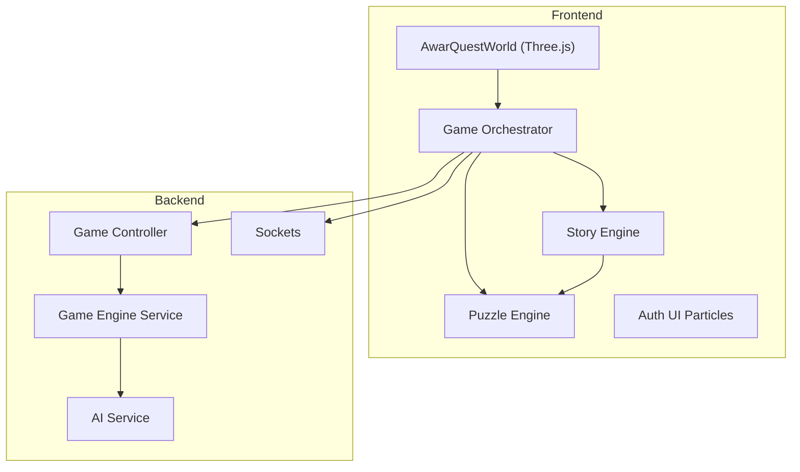
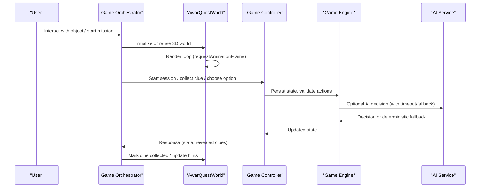
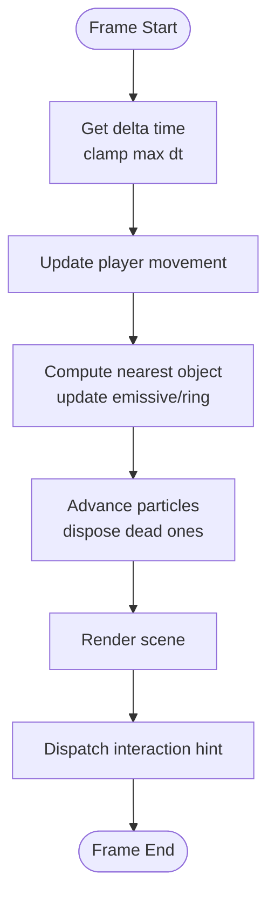
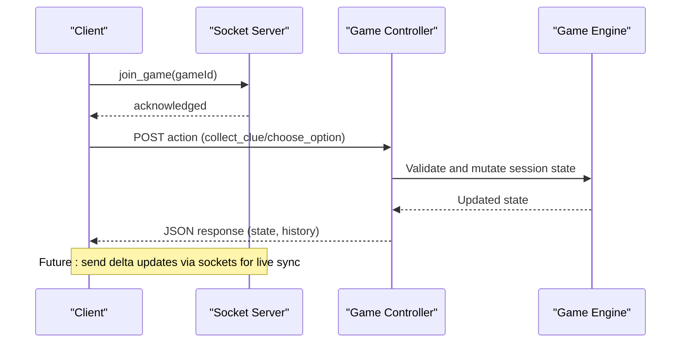
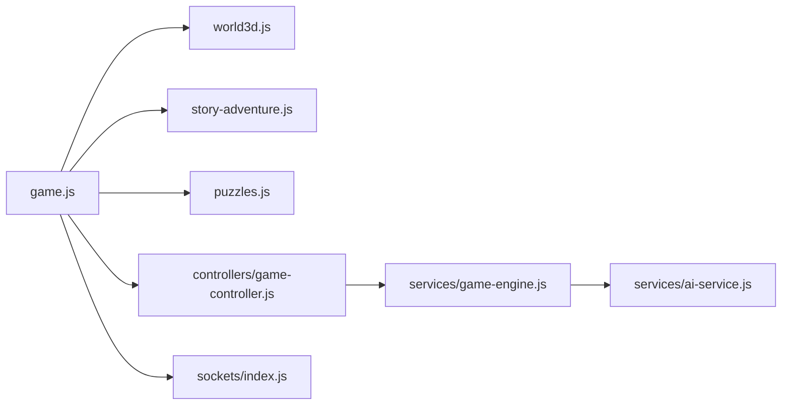

# Performance Optimization

<cite>
**Referenced Files in This Document**
- [world3d.js](file://backend/public/js/world3d.js)
- [game.js](file://backend/public/js/game.js)
- [puzzles.js](file://backend/public/js/puzzles.js)
- [story-adventure.js](file://backend/public/js/story-adventure.js)
- [auth-ui.js](file://backend/public/js/auth-ui.js)
- [game-controller.js](file://backend/controllers/game-controller.js)
- [game-engine.js](file://backend/services/game-engine.js)
- [ai-service.js](file://backend/services/ai-service.js)
- [sockets/index.js](file://backend/sockets/index.js)
</cite>

## Table of Contents
1. Introduction
2. Project Structure
3. Core Components
4. Architecture Overview
5. Detailed Component Analysis
6. Dependency Analysis
7. Performance Considerations
8. Troubleshooting Guide
9. Conclusion
10. Appendices

## Introduction
This document provides performance optimization strategies for the 3D game engine and frontend systems, focusing on Three.js rendering efficiency, memory management, animation loops, network synchronization, profiling techniques, and mobile/cross-browser considerations. It synthesizes findings from the codebase to offer actionable guidance for improving frame rates, reducing draw calls, conserving memory, and maintaining responsive gameplay under load.

## Project Structure
The project includes:
- A Three.js-based 3D world component that renders a small room with interactive objects and particles.
- A game orchestrator managing UI state, scene transitions, and interactions.
- A story-driven adventure system with chapters and puzzles.
- Backend services handling game sessions, AI-assisted decisions, and optional real-time sockets.

**Diagram sources**
- [world3d.js:63-96](file://backend/public/js/world3d.js#L63-L96)
- [game.js:465-513](file://backend/public/js/game.js#L465-L513)
- [story-adventure.js:207-263](file://backend/public/js/story-adventure.js#L207-L263)
- [puzzles.js:547-648](file://backend/public/js/puzzles.js#L547-L648)
- [auth-ui.js:71-120](file://backend/public/js/auth-ui.js#L71-L120)
- [game-controller.js:18-50](file://backend/controllers/game-controller.js#L18-L50)
- [game-engine.js:51-64](file://backend/services/game-engine.js#L51-L64)
- [ai-service.js:18-48](file://backend/services/ai-service.js#L18-L48)
- [sockets/index.js:3-15](file://backend/sockets/index.js#L3-L15)

**Section sources**
- [world3d.js:63-96](file://backend/public/js/world3d.js#L63-L96)
- [game.js:465-513](file://backend/public/js/game.js#L465-L513)
- [story-adventure.js:207-263](file://backend/public/js/story-adventure.js#L207-L263)
- [puzzles.js:547-648](file://backend/public/js/puzzles.js#L547-L648)
- [auth-ui.js:71-120](file://backend/public/js/auth-ui.js#L71-L120)
- [game-controller.js:18-50](file://backend/controllers/game-controller.js#L18-L50)
- [game-engine.js:51-64](file://backend/services/game-engine.js#L51-L64)
- [ai-service.js:18-48](file://backend/services/ai-service.js#L18-L48)
- [sockets/index.js:3-15](file://backend/sockets/index.js#L3-L15)

## Core Components
- 3D World: Manages scene, camera, renderer, lighting, interactable props, and particle effects. Implements an efficient render loop and cleanup routines.
- Game Orchestrator: Coordinates UI, scene lifecycle, puzzle flow, and backend API calls. Disposes 3D resources when switching screens.
- Story Engine: Presents narrative chapters, integrates puzzles, and updates evidence/state.
- Puzzle Engine: Renders overlays, handles timers, attempts, and feedback; triggers XP and confetti effects.
- Auth UI Particles: Lightweight canvas-based background effect with bounded particle count.
- Backend Services: Session management, scenario content, AI decision fallback, and optional socket rooms.

Key performance-relevant behaviors observed:
- Renderer pixel ratio capped to reduce GPU load on high-DPI displays.
- Shadow map enabled with moderate resolution.
- Particle lifecycles dispose geometry/material promptly.
- Animation loop caps delta time to avoid large jumps.
- Scene disposal removes event listeners and detaches DOM nodes.

**Section sources**
- [world3d.js:63-96](file://backend/public/js/world3d.js#L63-L96)
- [world3d.js:274-293](file://backend/public/js/world3d.js#L274-L293)
- [world3d.js:300-334](file://backend/public/js/world3d.js#L300-L334)
- [world3d.js:345-359](file://backend/public/js/world3d.js#L345-L359)
- [game.js:25-35](file://backend/public/js/game.js#L25-L35)
- [auth-ui.js:71-120](file://backend/public/js/auth-ui.js#L71-L120)

## Architecture Overview
The runtime flow connects user input and UI events to the 3D world and game logic, with optional AI assistance and persistence.

**Diagram sources**
- [game.js:465-513](file://backend/public/js/game.js#L465-L513)
- [world3d.js:274-293](file://backend/public/js/world3d.js#L274-L293)
- [game-controller.js:18-50](file://backend/controllers/game-controller.js#L18-L50)
- [game-engine.js:51-64](file://backend/services/game-engine.js#L51-L64)
- [ai-service.js:18-48](file://backend/services/ai-service.js#L18-L48)

## Detailed Component Analysis

### Three.js World Rendering and Animation Loop
- Rendering setup uses antialiasing and shadow maps with a capped pixel ratio to balance quality and performance.
- The main loop uses requestAnimationFrame, clamps delta time to prevent physics spikes, and performs movement, interaction checks, particle updates, and rendering each frame.
- Interaction detection computes distances per frame and highlights nearest objects via emissive intensity changes.
- Particles are spawned on interactions and cleaned up by disposing geometry and material when their lifetime expires.

Optimization opportunities:
- Geometry reuse: Instantiate shared geometries once (e.g., ring, tablet, phone parts) and reuse across instances to reduce allocations.
- Material sharing: Share materials where possible; avoid creating new materials per prop if colors can be driven by uniforms or vertex attributes.
- Draw call reduction: Merge static meshes into a single mesh or use instanced rendering for repeated elements (e.g., grid lines, desk legs).
- Frustum culling: Ensure only visible objects are updated; rely on Three.js frustum culling but avoid unnecessary scene graph mutations.
- Level-of-detail: For complex props, switch to lower-poly versions at distance or hide off-screen objects.
- Efficient animation loop: Batch updates, minimize allocations inside the loop, and consider throttling non-critical updates (e.g., hover effects) on low-end devices.

**Diagram sources**
- [world3d.js:274-293](file://backend/public/js/world3d.js#L274-L293)
- [world3d.js:221-242](file://backend/public/js/world3d.js#L221-L242)
- [world3d.js:244-272](file://backend/public/js/world3d.js#L244-L272)
- [world3d.js:300-334](file://backend/public/js/world3d.js#L300-L334)

**Section sources**
- [world3d.js:63-96](file://backend/public/js/world3d.js#L63-L96)
- [world3d.js:221-293](file://backend/public/js/world3d.js#L221-L293)
- [world3d.js:300-334](file://backend/public/js/world3d.js#L300-L334)

### Memory Management for 3D Assets and Dynamic Objects
- Proper disposal: On scene exit, the world cancels animation frames, removes event listeners, exits pointer lock, disposes the renderer, and removes its DOM element.
- Particle lifecycle: Each particle’s geometry and material are disposed when life ends, preventing leaks.
- Resource cleanup: When switching screens, the orchestrator disposes the active world instance to free GPU/CPU resources.

Recommendations:
- Centralize asset caches for reusable geometries and materials to avoid duplication.
- Use object pooling for frequently created/destroyed dynamic objects (e.g., particles, bullets).
- Avoid heavy allocations in hot paths; preallocate vectors and buffers where feasible.
- Monitor memory growth using browser DevTools Performance/Memory panels and look for retained textures/geometry.

**Section sources**
- [world3d.js:345-359](file://backend/public/js/world3d.js#L345-L359)
- [world3d.js:300-334](file://backend/public/js/world3d.js#L300-L334)
- [game.js:25-35](file://backend/public/js/game.js#L25-L35)

### Network Optimization for Real-Time Synchronization
- Current socket usage: Basic join/disconnect logging and room joining; no payload compression or delta updates implemented yet.
- State persistence: Game state is stored server-side per session with history and expiration; client requests trigger state transitions validated by the controller.

Optimization strategies:
- Delta updates: Send only changed fields (e.g., position deltas, incremental score) rather than full snapshots.
- State compression: Use compact representations (e.g., bitfields for flags, quantized coordinates) to reduce payload size.
- Connection resilience: Implement reconnection with exponential backoff, message deduplication, and idempotent operations on the server.
- Throttling/batching: Coalesce frequent updates (e.g., movement) into periodic batches; prioritize critical events (interactions, decisions).
- Backpressure: Drop or defer non-essential updates under high latency or packet loss.

**Diagram sources**
- [sockets/index.js:3-15](file://backend/sockets/index.js#L3-L15)
- [game-controller.js:52-116](file://backend/controllers/game-controller.js#L52-L116)
- [game-engine.js:51-64](file://backend/services/game-engine.js#L51-L64)

**Section sources**
- [sockets/index.js:3-15](file://backend/sockets/index.js#L3-L15)
- [game-controller.js:52-116](file://backend/controllers/game-controller.js#L52-L116)
- [game-engine.js:51-64](file://backend/services/game-engine.js#L51-L64)

### Profiling Tools and Techniques
- Frontend rendering:
  - Use browser Performance tab to capture frame timelines; identify long tasks, layout thrashing, and excessive GC.
  - Use WebGL renderer stats (if available) to monitor draw calls, triangles, and texture uploads.
  - Inspect memory snapshots to detect retained geometries/materials.
- Game logic:
  - Profile event handlers and async flows (API calls, AI service) to find bottlenecks.
  - Debounce/throttle expensive UI updates and network requests.
- Backend:
  - Log request durations and DB query times; profile AI service calls and fallback behavior.
  - Measure socket throughput and message sizes.

Practical steps:
- Add timing logs around heavy operations (e.g., scene build, puzzle overlay creation).
- Use sampling profilers to locate hotspots in JS code.
- Compare performance across devices and browsers; adjust settings like pixel ratio and shadows accordingly.

[No sources needed since this section provides general guidance]

### Mobile and Cross-Browser Optimization Guidelines
- Reduce pixel ratio on high-DPI mobile devices; cap it to balance clarity and performance.
- Disable or reduce shadows on low-power devices; lower shadow map resolution.
- Limit particle counts and disable heavy post-processing on mobile.
- Prefer simple materials and fewer transparent overlays; avoid excessive blending.
- Test pointer lock behavior and fallbacks for touch devices; ensure input works without mouse.
- Optimize bundle size and lazy-load heavy modules (e.g., story engine, puzzles) when not needed.

**Section sources**
- [world3d.js:75-79](file://backend/public/js/world3d.js#L75-L79)
- [auth-ui.js:71-120](file://backend/public/js/auth-ui.js#L71-L120)

## Dependency Analysis
The frontend components depend on each other and on backend services:
- Game orchestrator initializes and disposes the 3D world and story engine based on user flow.
- Puzzles integrate with rewards and UI feedback.
- Backend controller validates actions and persists state; AI service provides optional decisions with deterministic fallback.
- Sockets provide basic room management; could be extended for live sync.

**Diagram sources**
- [game.js:465-513](file://backend/public/js/game.js#L465-L513)
- [world3d.js:63-96](file://backend/public/js/world3d.js#L63-L96)
- [story-adventure.js:207-263](file://backend/public/js/story-adventure.js#L207-L263)
- [puzzles.js:547-648](file://backend/public/js/puzzles.js#L547-L648)
- [game-controller.js:18-50](file://backend/controllers/game-controller.js#L18-L50)
- [game-engine.js:51-64](file://backend/services/game-engine.js#L51-L64)
- [ai-service.js:18-48](file://backend/services/ai-service.js#L18-L48)
- [sockets/index.js:3-15](file://backend/sockets/index.js#L3-L15)

**Section sources**
- [game.js:465-513](file://backend/public/js/game.js#L465-L513)
- [world3d.js:63-96](file://backend/public/js/world3d.js#L63-L96)
- [story-adventure.js:207-263](file://backend/public/js/story-adventure.js#L207-L263)
- [puzzles.js:547-648](file://backend/public/js/puzzles.js#L547-L648)
- [game-controller.js:18-50](file://backend/controllers/game-controller.js#L18-L50)
- [game-engine.js:51-64](file://backend/services/game-engine.js#L51-L64)
- [ai-service.js:18-48](file://backend/services/ai-service.js#L18-L48)
- [sockets/index.js:3-15](file://backend/sockets/index.js#L3-L15)

## Performance Considerations
- Rendering:
  - Reuse geometries and materials to cut allocations and draw calls.
  - Use instanced rendering for repeated elements (e.g., grid lines, desk legs).
  - Cap pixel ratio and shadow resolution; disable shadows on low-end devices.
  - Minimize transparency and blending; batch opaque draws.
- Animation:
  - Clamp delta time; avoid heavy work per frame.
  - Defer non-critical updates (hover effects) to separate ticks or throttle them.
- Memory:
  - Dispose all Three.js resources on scene exit.
  - Pool dynamic objects; avoid per-frame allocations.
- Network:
  - Implement delta updates and state compression for real-time features.
  - Add reconnection logic with backoff and idempotent server actions.
- Mobile:
  - Reduce particle counts; simplify materials; test pointer lock alternatives.
- Profiling:
  - Capture Performance traces; inspect WebGL stats and memory snapshots.
  - Log timings for critical paths (scene init, puzzle overlays, API calls).

[No sources needed since this section provides general guidance]

## Troubleshooting Guide
Common issues and remedies:
- Stuttering during interactions:
  - Check for heavy allocations in event handlers; move work out of the render loop.
  - Verify particle disposal; ensure geometry/material are freed when particles expire.
- High memory usage:
  - Confirm scene disposal removes renderer and DOM elements.
  - Inspect retained objects in memory snapshots; fix missing disposals.
- Network delays:
  - Profile AI service calls; ensure timeouts and fallbacks are working.
  - Consider batching or throttling frequent updates.
- Mobile performance:
  - Lower pixel ratio; disable shadows; reduce particle counts.
  - Test touch interactions and pointer lock fallbacks.

**Section sources**
- [world3d.js:300-334](file://backend/public/js/world3d.js#L300-L334)
- [world3d.js:345-359](file://backend/public/js/world3d.js#L345-L359)
- [ai-service.js:18-48](file://backend/services/ai-service.js#L18-L48)

## Conclusion
The codebase demonstrates solid foundations for performance: capped pixel ratio, shadow configuration, proper disposal, and a structured render loop. To further optimize:
- Reuse geometries/materials and adopt instancing to reduce draw calls.
- Implement delta updates and compression for real-time sync.
- Profile continuously and tune settings per device class.
- Extend socket usage for live synchronization with resilient connection handling.

[No sources needed since this section summarizes without analyzing specific files]

## Appendices
- Example optimization checklist:
  - Preload and cache geometries/materials.
  - Use LOD for complex models.
  - Batch updates and throttle non-critical animations.
  - Enable frustum culling; remove off-screen objects when possible.
  - Monitor GPU/CPU usage and memory retention.
  - Test on multiple devices and browsers; adjust settings dynamically.

[No sources needed since this section provides general guidance]