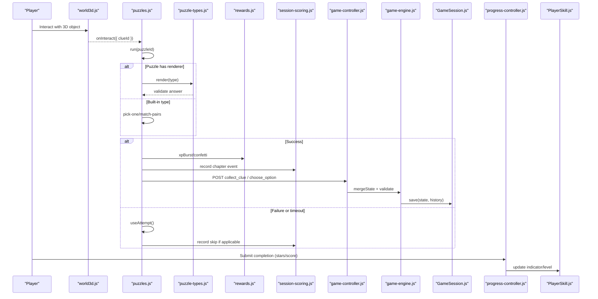
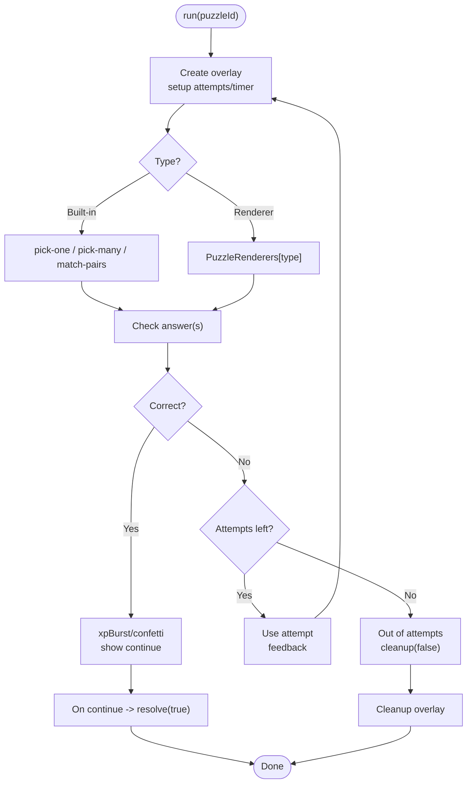
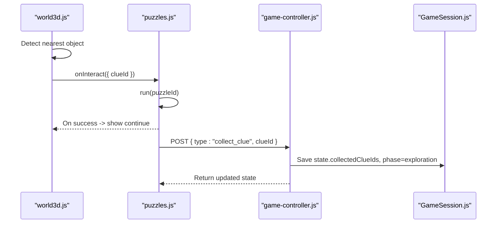
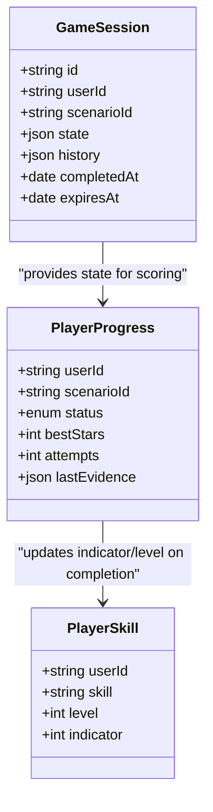
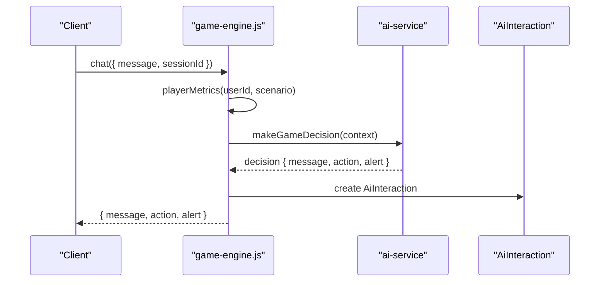
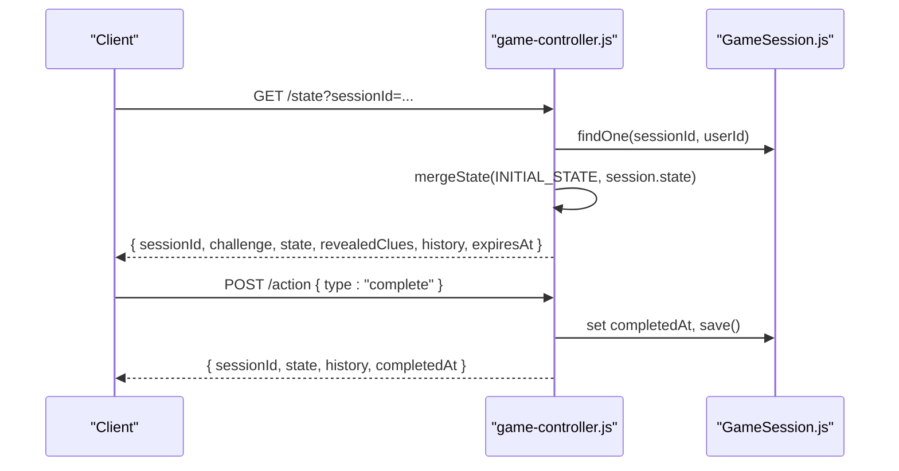
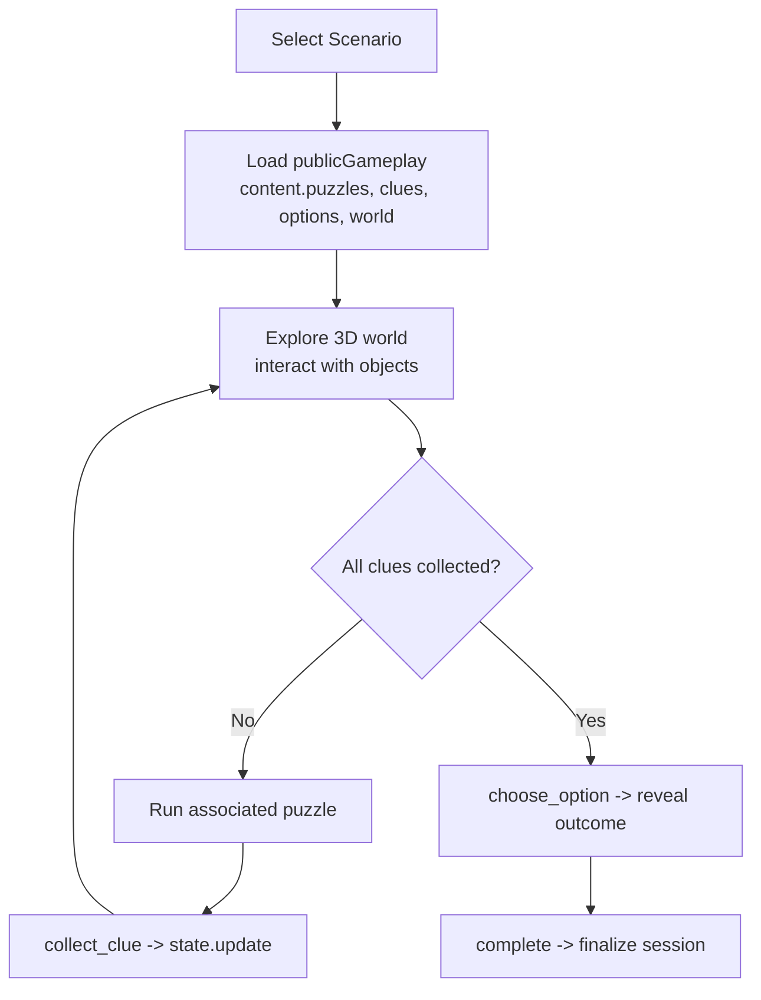
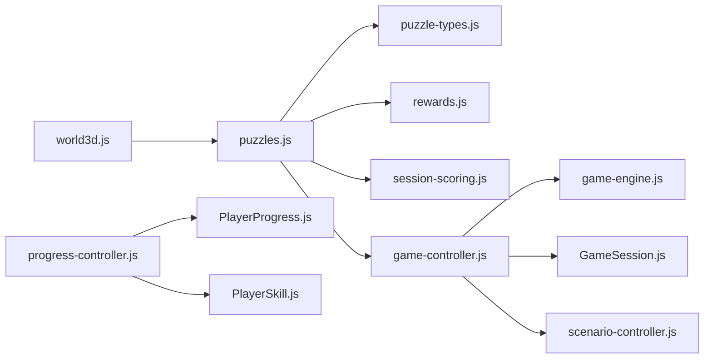

# Puzzle State & Progression

<cite>
**Referenced Files in This Document**
- [puzzles.js](file://backend/public/js/puzzles.js)
- [puzzle-types.js](file://backend/public/js/puzzle-types.js)
- [game-controller.js](file://backend/controllers/game-controller.js)
- [progress-controller.js](file://backend/controllers/progress-controller.js)
- [game-engine.js](file://backend/services/game-engine.js)
- [GameSession.js](file://backend/models/GameSession.js)
- [PlayerProgress.js](file://backend/models/PlayerProgress.js)
- [PlayerSkill.js](file://backend/models/PlayerSkill.js)
- [rewards.js](file://backend/public/js/rewards.js)
- [session-scoring.js](file://backend/public/js/session-scoring.js)
- [world3d.js](file://backend/public/js/world3d.js)
- [scenario-controller.js](file://backend/controllers/scenario-controller.js)
</cite>

## Table of Contents
1. Introduction
2. Project Structure
3. Core Components
4. Architecture Overview
5. Detailed Component Analysis
6. Dependency Analysis
7. Performance Considerations
8. Troubleshooting Guide
9. Conclusion

## Introduction
This document explains the puzzle state management system that drives the game’s puzzle lifecycle, progress tracking, difficulty scaling, and integration with XP, achievements, and skill progression. It also documents how players collect clues from 3D world objects to unlock puzzle solutions and contextual hints, how adaptive hints are provided based on performance, how answers are validated with immediate feedback and rewards, how persistence works across sessions and screens, and how a scenario-based queue manages multiple puzzles and transitions between puzzle types.

## Project Structure
The puzzle system spans client-side UI and logic (Three.js world, puzzle overlays, reward effects, session scoring) and server-side orchestration (game engine, controllers, models). The key pieces:
- Client-side puzzle runtime renders different puzzle types, validates inputs, emits XP events, and triggers animations.
- The 3D world exposes interactable objects tagged with clue IDs; interacting with them triggers clue collection flows.
- Server-side game engine initializes sessions, computes player metrics, and provides AI-assisted chat/hints.
- Controllers persist session state, handle actions like collecting clues and making decisions, and submit completed progress with stars/score updates.
- Models store active sessions, cumulative progress, and skill indicators.

```mermaid
graph TB
subgraph "Client"
W["world3d.js"]
PZ["puzzles.js"]
PT["puzzle-types.js"]
RW["rewards.js"]
SS["session-scoring.js"]
end
subgraph "Server"
GC["game-controller.js"]
PC["progress-controller.js"]
GE["game-engine.js"]
M1["GameSession.js"]
M2["PlayerProgress.js"]
M3["PlayerSkill.js"]
SC["scenario-controller.js"]
end
W --> |onInteract(clueId)| PZ
PZ --> |validate + feedback| RW
PZ --> |emit game:xp| SS
PZ --> |collect_clue / choose_option| GC
GC --> |persist state/history| M1
GC --> |read scenario content| SC
PC --> |submit completion| M2
PC --> |update skill indicator| M3
GE --> |metrics + chat hints| GC
```

**Diagram sources**
- [world3d.js:40-48](file://backend/public/js/world3d.js#L40-L48)
- [puzzles.js:547-647](file://backend/public/js/puzzles.js#L547-L647)
- [puzzle-types.js:22-438](file://backend/public/js/puzzle-types.js#L22-L438)
- [rewards.js:4-66](file://backend/public/js/rewards.js#L4-L66)
- [session-scoring.js:5-221](file://backend/public/js/session-scoring.js#L5-L221)
- [game-controller.js:18-125](file://backend/controllers/game-controller.js#L18-L125)
- [progress-controller.js:5-79](file://backend/controllers/progress-controller.js#L5-L79)
- [game-engine.js:5-124](file://backend/services/game-engine.js#L5-L124)
- [scenario-controller.js:7-71](file://backend/controllers/scenario-controller.js#L7-L71)

**Section sources**
- [world3d.js:1-200](file://backend/public/js/world3d.js#L1-L200)
- [puzzles.js:1-772](file://backend/public/js/puzzles.js#L1-L772)
- [puzzle-types.js:1-438](file://backend/public/js/puzzle-types.js#L1-L438)
- [game-controller.js:1-128](file://backend/controllers/game-controller.js#L1-L128)
- [progress-controller.js:1-79](file://backend/controllers/progress-controller.js#L1-L79)
- [game-engine.js:1-124](file://backend/services/game-engine.js#L1-L124)
- [scenario-controller.js:1-71](file://backend/controllers/scenario-controller.js#L1-L71)

## Core Components
- Puzzle Runtime: Central engine that loads puzzle definitions, renders overlays, enforces attempts/timers, validates answers, and emits XP events.
- Puzzle Types: Pluggable renderers for number series, logical reasoning, mini/6x6 sudoku, jigsaw slides, schedule grids, math marathons, brain operations, and more.
- 3D World Interaction: Three.js scene with interactable props tagged by clueId; clicking near an object triggers clue collection via the game flow.
- Game Session Management: Server-side session model stores phase, collected clues, selected option, score, stars, history, and expiration.
- Progress & Skill Tracking: Persistent per-scenario progress with best stars, attempts, last evidence snapshot; skill indicators level up based on stars earned.
- Rewards & Scoring: Client-side confetti and XP bursts; session scoring tiers adjust XP multipliers and produce “What you learned” recaps with schemes and helplines.
- Scenario Content & Queues: Scenarios expose puzzles, clues, options, and world configs; scenarios are sorted and presented as a mission list for sequential play.

**Section sources**
- [puzzles.js:547-647](file://backend/public/js/puzzles.js#L547-L647)
- [puzzle-types.js:22-438](file://backend/public/js/puzzle-types.js#L22-L438)
- [world3d.js:40-48](file://backend/public/js/world3d.js#L40-L48)
- [GameSession.js:4-12](file://backend/models/GameSession.js#L4-L12)
- [PlayerProgress.js:4-14](file://backend/models/PlayerProgress.js#L4-L14)
- [PlayerSkill.js:4-12](file://backend/models/PlayerSkill.js#L4-L12)
- [rewards.js:4-66](file://backend/public/js/rewards.js#L4-L66)
- [session-scoring.js:5-221](file://backend/public/js/session-scoring.js#L5-L221)
- [scenario-controller.js:7-71](file://backend/controllers/scenario-controller.js#L7-L71)

## Architecture Overview
The system follows a clear separation:
- Client renders puzzles and world interactions, collects clues, validates answers, and emits XP events.
- Server owns authoritative state: session lifecycle, action validation, persistence, and skill updates.
- Scenarios define content (clues, options, puzzles, world), which is normalized and served to clients.



**Diagram sources**
- [world3d.js:40-48](file://backend/public/js/world3d.js#L40-L48)
- [puzzles.js:547-647](file://backend/public/js/puzzles.js#L547-L647)
- [puzzle-types.js:22-438](file://backend/public/js/puzzle-types.js#L22-L438)
- [rewards.js:22-29](file://backend/public/js/rewards.js#L22-L29)
- [session-scoring.js:106-144](file://backend/public/js/session-scoring.js#L106-L144)
- [game-controller.js:52-116](file://backend/controllers/game-controller.js#L52-L116)
- [game-engine.js:51-64](file://backend/services/game-engine.js#L51-L64)
- [progress-controller.js:5-79](file://backend/controllers/progress-controller.js#L5-L79)

## Detailed Component Analysis

### Puzzle Lifecycle and Validation
- Entry point: PuzzleEngine.run(puzzleId) creates an overlay, sets up attempts and optional timer, and delegates rendering to built-in handlers or registered renderers.
- Validation: Each renderer checks correctness, disables controls on success, shows feedback, reveals continue button, and emits XP events.
- Attempts and Time: maxAttempts decrements on failures; timeLimitSec countdown triggers failure when reached.
- Feedback: Immediate visual feedback with skill tips and optional official resources.



**Diagram sources**
- [puzzles.js:547-647](file://backend/public/js/puzzles.js#L547-L647)
- [puzzle-types.js:22-438](file://backend/public/js/puzzle-types.js#L22-L438)

**Section sources**
- [puzzles.js:547-647](file://backend/public/js/puzzles.js#L547-L647)
- [puzzle-types.js:22-438](file://backend/public/js/puzzle-types.js#L22-L438)

### Evidence Collection from 3D Objects
- 3D props carry metadata including clueId. When the player clicks near a prop, the world calls onInteract with the clueId.
- The frontend uses this to trigger the associated puzzle for that clue. After solving, the client requests collect_clue to mark it collected.
- The server ensures all required clues are collected before allowing a decision.



**Diagram sources**
- [world3d.js:40-48](file://backend/public/js/world3d.js#L40-L48)
- [puzzles.js:547-647](file://backend/public/js/puzzles.js#L547-L647)
- [game-controller.js:63-75](file://backend/controllers/game-controller.js#L63-L75)

**Section sources**
- [world3d.js:40-48](file://backend/public/js/world3d.js#L40-L48)
- [game-controller.js:63-75](file://backend/controllers/game-controller.js#L63-L75)

### XP System, Achievements, and Skill Progression
- XP Events: Puzzles emit game:xp with amounts and labels; rewards module displays XP bursts and confetti.
- Session Tiering: Session scoring tracks expert vs standard vs puzzle-rush behavior and applies multipliers to base XP.
- Skill Indicators: On completion, progress controller updates PlayerSkill indicator and level based on stars earned.
- Best Stars and Attempts: PlayerProgress records bestStars and increments attempts; used for future difficulty adaptation and analytics.



**Diagram sources**
- [PlayerProgress.js:4-14](file://backend/models/PlayerProgress.js#L4-L14)
- [PlayerSkill.js:4-12](file://backend/models/PlayerSkill.js#L4-L12)
- [GameSession.js:4-12](file://backend/models/GameSession.js#L4-L12)
- [progress-controller.js:17-59](file://backend/controllers/progress-controller.js#L17-L59)
- [rewards.js:22-29](file://backend/public/js/rewards.js#L22-L29)
- [session-scoring.js:128-144](file://backend/public/js/session-scoring.js#L128-L144)

**Section sources**
- [rewards.js:22-29](file://backend/public/js/rewards.js#L22-L29)
- [session-scoring.js:106-144](file://backend/public/js/session-scoring.js#L106-L144)
- [progress-controller.js:17-59](file://backend/controllers/progress-controller.js#L17-L59)

### Hint System and Adaptive Assistance
- Chat-driven hints: The game engine computes player metrics (accuracy, mistake rate, topic mastery, streak) and passes context to AI service to generate NPC replies or hints.
- Context includes current challenge, safe hint text, allowed actions, and verified alerts.
- Hints are persisted as AI interactions tied to user and scenario.



**Diagram sources**
- [game-engine.js:66-121](file://backend/services/game-engine.js#L66-L121)

**Section sources**
- [game-engine.js:35-49](file://backend/services/game-engine.js#L35-L49)
- [game-engine.js:66-121](file://backend/services/game-engine.js#L66-L121)

### Persistence and Resume Across Screens
- Active Sessions: GameSession stores JSONB state and history with expiration; controllers enforce active session checks.
- Resume Flow: Clients fetch state via GET state using sessionId; server merges INITIAL_STATE with stored state and returns revealed clues and history.
- Completion: On complete, session.completedAt is set; progress submission reads session state to compute final stars/score and persists to PlayerProgress.



**Diagram sources**
- [game-controller.js:30-49](file://backend/controllers/game-controller.js#L30-L49)
- [game-controller.js:92-105](file://backend/controllers/game-controller.js#L92-L105)
- [GameSession.js:4-12](file://backend/models/GameSession.js#L4-L12)

**Section sources**
- [game-controller.js:30-49](file://backend/controllers/game-controller.js#L30-L49)
- [game-controller.js:92-105](file://backend/controllers/game-controller.js#L92-L105)
- [GameSession.js:4-12](file://backend/models/GameSession.js#L4-L12)

### Puzzle Queue and Scenario Transitions
- Scenarios expose puzzles and world configurations; the scenario controller normalizes content and serves public gameplay data including puzzles map and clues/options lists.
- Missions are sorted and listed for selection; each scenario can contain multiple puzzles and clues that must be collected before choosing an option.
- The client queues puzzles by presenting world objects; after solving each, the corresponding clue is collected, enabling progression toward the decision phase.



**Diagram sources**
- [scenario-controller.js:24-43](file://backend/controllers/scenario-controller.js#L24-L43)
- [game-controller.js:63-91](file://backend/controllers/game-controller.js#L63-L91)

**Section sources**
- [scenario-controller.js:24-43](file://backend/controllers/scenario-controller.js#L24-L43)
- [game-controller.js:63-91](file://backend/controllers/game-controller.js#L63-L91)

## Dependency Analysis
- Client dependencies:
  - world3d.js depends on THREE.js and exposes onInteract callback used by puzzles.js.
  - puzzles.js depends on puzzle-types.js for extended renderers and rewards.js for XP/confetti.
  - session-scoring.js aggregates engagement signals and produces learning recaps.
- Server dependencies:
  - game-controller.js orchestrates session actions and relies on game-engine.js for metrics and chat.
  - progress-controller.js updates PlayerProgress and PlayerSkill upon completion.
  - Models encapsulate persistence contracts for sessions, progress, and skills.



**Diagram sources**
- [world3d.js:40-48](file://backend/public/js/world3d.js#L40-L48)
- [puzzles.js:547-647](file://backend/public/js/puzzles.js#L547-L647)
- [puzzle-types.js:22-438](file://backend/public/js/puzzle-types.js#L22-L438)
- [rewards.js:22-29](file://backend/public/js/rewards.js#L22-L29)
- [session-scoring.js:106-144](file://backend/public/js/session-scoring.js#L106-L144)
- [game-controller.js:52-116](file://backend/controllers/game-controller.js#L52-L116)
- [game-engine.js:51-121](file://backend/services/game-engine.js#L51-L121)
- [progress-controller.js:5-79](file://backend/controllers/progress-controller.js#L5-L79)
- [scenario-controller.js:24-43](file://backend/controllers/scenario-controller.js#L24-L43)

**Section sources**
- [game-controller.js:52-116](file://backend/controllers/game-controller.js#L52-L116)
- [progress-controller.js:5-79](file://backend/controllers/progress-controller.js#L5-L79)
- [game-engine.js:51-121](file://backend/services/game-engine.js#L51-L121)

## Performance Considerations
- Client-side rendering:
  - Puzzle overlays are lightweight DOM elements; avoid excessive reflows by disabling inputs once solved.
  - Confetti and XP bursts are transient and auto-cleanup to prevent memory leaks.
- Server-side:
  - Session state is compact JSONB; keep history concise to reduce storage size.
  - Metrics computation aggregates simple counters; ensure indexes exist on frequently queried fields (userId, scenarioId).
- Network:
  - Batch state updates where possible; minimize repeated state fetches by caching locally until next interaction.

[No sources needed since this section provides general guidance]

## Troubleshooting Guide
Common issues and resolutions:
- Already decided: If attempting to collect clues after selecting an option, the server returns ALREADY_DECIDED. Reset or start a new session to retry.
- Clues required: Choosing an option without collecting all required clues yields CLUES_REQUIRED. Ensure all clues are solved first.
- Invalid clue/option: Requests referencing non-existent IDs return INVALID_CLUE or INVALID_OPTION. Verify scenario content IDs.
- Session expired or not found: Actions require an active session within its expiry window. Refresh state or restart the game.
- Incomplete submission: Progress submission requires the session to be marked completed in-game before submitting final status.

**Section sources**
- [game-controller.js:63-91](file://backend/controllers/game-controller.js#L63-L91)
- [game-controller.js:92-105](file://backend/controllers/game-controller.js#L92-L105)
- [progress-controller.js:11-15](file://backend/controllers/progress-controller.js#L11-L15)

## Conclusion
The puzzle state management system integrates immersive 3D exploration with structured puzzle challenges, robust validation, and meaningful feedback. It ties into XP and skill progression through persistent metrics and adaptive hints, while ensuring reliable persistence and smooth transitions across scenarios. By combining client-side interactivity with server-side authority, the system delivers a cohesive learning experience that scales with player performance and encourages real-world safety behaviors.