# Puzzle System Architecture

<cite>
**Referenced Files in This Document**
- [puzzles.js](file://backend/public/js/puzzles.js)
- [puzzle-types.js](file://backend/public/js/puzzle-types.js)
- [game.js](file://backend/public/js/game.js)
- [session-scoring.js](file://backend/public/js/session-scoring.js)
- [game-controller.js](file://backend/controllers/game-controller.js)
- [game-engine.js](file://backend/services/game-engine.js)
- [progress-controller.js](file://backend/controllers/progress-controller.js)
- [score-controller.js](file://backend/controllers/score-controller.js)
- [GameSession.js](file://backend/models/GameSession.js)
- [PlayerProgress.js](file://backend/models/PlayerProgress.js)
- [Scenario.js](file://backend/models/Scenario.js)
</cite>

## Table of Contents
1. [Introduction](#introduction)
2. [Project Structure](#project-structure)
3. [Core Components](#core-components)
4. [Architecture Overview](#architecture-overview)
5. [Detailed Component Analysis](#detailed-component-analysis)
6. [Dependency Analysis](#dependency-analysis)
7. [Performance Considerations](#performance-considerations)
8. [Troubleshooting Guide](#troubleshooting-guide)
9. [Conclusion](#conclusion)
10. [Appendices](#appendices)

## Introduction
This document explains the modular puzzle system architecture that powers interactive, evidence-based learning missions. It covers:
- The puzzle type abstraction layer supporting multiple formats (pick-one, pick-many, match-pairs, and extended types like number series, jigsaw, sudoku, schedule-grid, logical reasoning, brain-ops).
- Progressive difficulty scaling via scenario metadata and time-limited challenges.
- Puzzle state management across client and server with validation and lifecycle control.
- Validation mechanisms for each puzzle type and scoring algorithms that combine stars, scores, and session-tiered XP.
- The complete puzzle lifecycle from creation to completion, including hint systems, progress tracking, and evidence collection from 3D world objects.
- Guidelines for implementing custom puzzle types, extending existing puzzles, and integrating with progression and AI-assisted guidance.

## Project Structure
The puzzle system spans client-side UI logic and server-side orchestration:
- Client-side:
  - Puzzle engine and renderers define how puzzles are presented and validated.
  - Game flow orchestrates 3D interactions, clue collection, and decision-making.
  - Session scoring tracks engagement and scales rewards.
- Server-side:
  - Game controller manages sessions, actions, and transitions between phases.
  - Game engine provides utilities, metrics, and AI chat integration.
  - Models persist sessions, player progress, and scenarios.

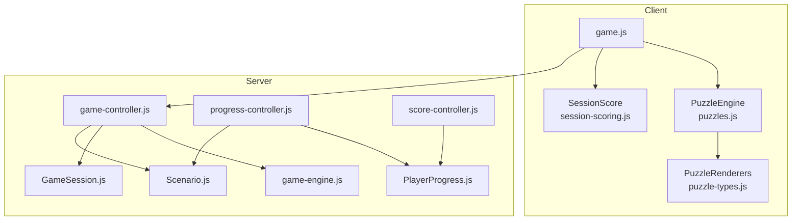

**Diagram sources**
- [game.js:465-557](file://backend/public/js/game.js#L465-L557)
- [puzzles.js:547-647](file://backend/public/js/puzzles.js#L547-L647)
- [puzzle-types.js:22-438](file://backend/public/js/puzzle-types.js#L22-L438)
- [session-scoring.js:94-144](file://backend/public/js/session-scoring.js#L94-L144)
- [game-controller.js:18-128](file://backend/controllers/game-controller.js#L18-L128)
- [game-engine.js:51-123](file://backend/services/game-engine.js#L51-L123)
- [progress-controller.js:5-71](file://backend/controllers/progress-controller.js#L5-L71)
- [score-controller.js:4-21](file://backend/controllers/score-controller.js#L4-L21)
- [GameSession.js:4-12](file://backend/models/GameSession.js#L4-L12)
- [PlayerProgress.js:4-14](file://backend/models/PlayerProgress.js#L4-L14)
- [Scenario.js:4-15](file://backend/models/Scenario.js#L4-L15)

**Section sources**
- [game.js:465-557](file://backend/public/js/game.js#L465-L557)
- [puzzles.js:547-647](file://backend/public/js/puzzles.js#L547-L647)
- [puzzle-types.js:22-438](file://backend/public/js/puzzle-types.js#L22-L438)
- [session-scoring.js:94-144](file://backend/public/js/session-scoring.js#L94-L144)
- [game-controller.js:18-128](file://backend/controllers/game-controller.js#L18-L128)
- [game-engine.js:51-123](file://backend/services/game-engine.js#L51-L123)
- [progress-controller.js:5-71](file://backend/controllers/progress-controller.js#L5-L71)
- [score-controller.js:4-21](file://backend/controllers/score-controller.js#L4-L21)
- [GameSession.js:4-12](file://backend/models/GameSession.js#L4-L12)
- [PlayerProgress.js:4-14](file://backend/models/PlayerProgress.js#L4-L14)
- [Scenario.js:4-15](file://backend/models/Scenario.js#L4-L15)

## Core Components
- Puzzle Engine: Central runtime that renders overlays, enforces attempts and timers, and delegates rendering to type-specific functions.
- Puzzle Renderers: A registry of puzzle implementations for different interaction patterns and content types.
- Game Flow: Manages mission lifecycle, 3D object interactions, clue collection, and decision phases.
- Session Scoring: Tracks player behavior to determine tier and scale XP at the end of a session.
- Server Orchestration: Validates actions, persists state transitions, and integrates AI chat for hints and alerts.
- Persistence: Stores active sessions, completed progress, and scenario metadata.

Key responsibilities:
- Abstraction: Decouple puzzle presentation from validation and scoring.
- State: Maintain consistent phase transitions and collected clues across client/server.
- Validation: Enforce attempt limits, time limits, and required evidence before decisions.
- Progression: Track stars, scores, and skill indicators; compute summaries.

**Section sources**
- [puzzles.js:547-647](file://backend/public/js/puzzles.js#L547-L647)
- [puzzle-types.js:22-438](file://backend/public/js/puzzle-types.js#L22-L438)
- [game.js:465-641](file://backend/public/js/game.js#L465-L641)
- [session-scoring.js:94-144](file://backend/public/js/session-scoring.js#L94-L144)
- [game-controller.js:52-116](file://backend/controllers/game-controller.js#L52-L116)
- [progress-controller.js:5-71](file://backend/controllers/progress-controller.js#L5-L71)

## Architecture Overview
The puzzle system follows a layered architecture:
- Presentation Layer: Renders puzzles and game UI.
- Interaction Layer: Captures user input and validates against puzzle rules.
- State Layer: Tracks phases, clues, options, and history.
- Service Layer: Orchestrates actions, integrates AI, and computes metrics.
- Data Layer: Persists sessions, progress, and scenarios.

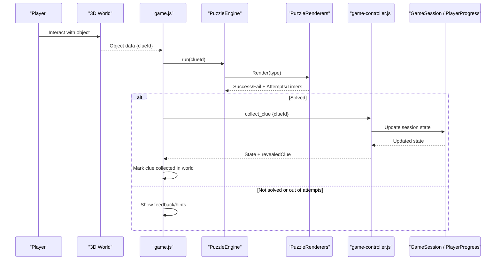

**Diagram sources**
- [game.js:539-557](file://backend/public/js/game.js#L539-L557)
- [puzzles.js:547-647](file://backend/public/js/puzzles.js#L547-L647)
- [puzzle-types.js:22-438](file://backend/public/js/puzzle-types.js#L22-L438)
- [game-controller.js:52-116](file://backend/controllers/game-controller.js#L52-L116)
- [GameSession.js:4-12](file://backend/models/GameSession.js#L4-L12)

## Detailed Component Analysis

### Puzzle Type Abstraction Layer
- Registry pattern: A global registry maps puzzle type strings to renderer functions.
- Built-in types:
  - pick-one: Single correct option selection.
  - pick-many: Multiple selections with minimum correct threshold.
  - match-pairs: Matching items to choices.
  - Extended types: number-series, logical-reasoning, sudoku-mini, crossword-fill, jigsaw-slide, schedule-grid, math-marathon, sudoku-6, jigsaw-4x4, brain-ops.
- Each renderer:
  - Builds DOM elements for inputs/buttons.
  - Validates answers against configuration.
  - Emits events for XP and triggers continue button on success.
  - Provides feedback and optional skill tips.

```mermaid
classDiagram
class PuzzleEngine {
+run(puzzleId) Promise
}
class PuzzleRenderers {
+register(type, fn)
+render(type, body, puzzle, feedback, continueBtn, onSuccess, onFail)
}
class PickOneRenderer {
+render(body, puzzle, feedback, continueBtn, onSuccess, onFail)
}
class PickManyRenderer {
+render(body, puzzle, feedback, continueBtn, onSuccess, onFail)
}
class MatchPairsRenderer {
+render(body, puzzle, feedback, continueBtn, onSuccess, onFail)
}
class NumberSeriesRenderer {
+render(body, puzzle, feedback, continueBtn, onSuccess, onFail)
}
class JigsawSlideRenderer {
+render(body, puzzle, feedback, continueBtn, onSuccess, onFail)
}
class SudokuMiniRenderer {
+render(body, puzzle, feedback, continueBtn, onSuccess, onFail)
}
class ScheduleGridRenderer {
+render(body, puzzle, feedback, continueBtn, onSuccess, onFail)
}
class LogicalReasoningRenderer {
+render(body, puzzle, feedback, continueBtn, onSuccess, onFail)
}
class BrainOpsRenderer {
+render(body, puzzle, feedback, continueBtn, onSuccess, onFail)
}
PuzzleEngine --> PuzzleRenderers : "delegates"
PuzzleRenderers <|-- PickOneRenderer
PuzzleRenderers <|-- PickManyRenderer
PuzzleRenderers <|-- MatchPairsRenderer
PuzzleRenderers <|-- NumberSeriesRenderer
PuzzleRenderers <|-- JigsawSlideRenderer
PuzzleRenderers <|-- SudokuMiniRenderer
PuzzleRenderers <|-- ScheduleGridRenderer
PuzzleRenderers <|-- LogicalReasoningRenderer
PuzzleRenderers <|-- BrainOpsRenderer
```

**Diagram sources**
- [puzzles.js:547-647](file://backend/public/js/puzzles.js#L547-L647)
- [puzzle-types.js:22-438](file://backend/public/js/puzzle-types.js#L22-L438)

**Section sources**
- [puzzles.js:547-647](file://backend/public/js/puzzles.js#L547-L647)
- [puzzle-types.js:22-438](file://backend/public/js/puzzle-types.js#L22-L438)

### Progressive Difficulty Scaling
- Scenario-level difficulty: Integer values influence labeling and can gate content.
- Time limits: Puzzles may specify seconds to solve, enforced by a countdown timer.
- Attempt limits: Puzzles enforce max attempts; failures reduce remaining attempts.
- Tiered XP: Session scoring determines tiers (expert, standard, puzzle_rush) and applies multipliers.

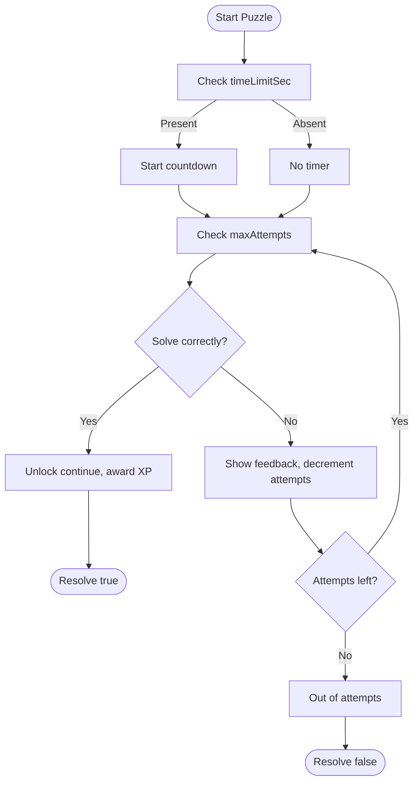

**Diagram sources**
- [puzzles.js:547-647](file://backend/public/js/puzzles.js#L547-L647)
- [session-scoring.js:94-144](file://backend/public/js/session-scoring.js#L94-L144)

**Section sources**
- [puzzles.js:547-647](file://backend/public/js/puzzles.js#L547-L647)
- [session-scoring.js:94-144](file://backend/public/js/session-scoring.js#L94-L144)

### Puzzle State Management
- Client state:
  - Tracks current phase, collected clues, selected option, score, stars.
  - Updates UI based on phase transitions and clue counts.
- Server state:
  - Persists session state and history.
  - Enforces action constraints (e.g., must collect all clues before choosing an option).
- Phase transitions:
  - presentation → exploration → reveal → completed.

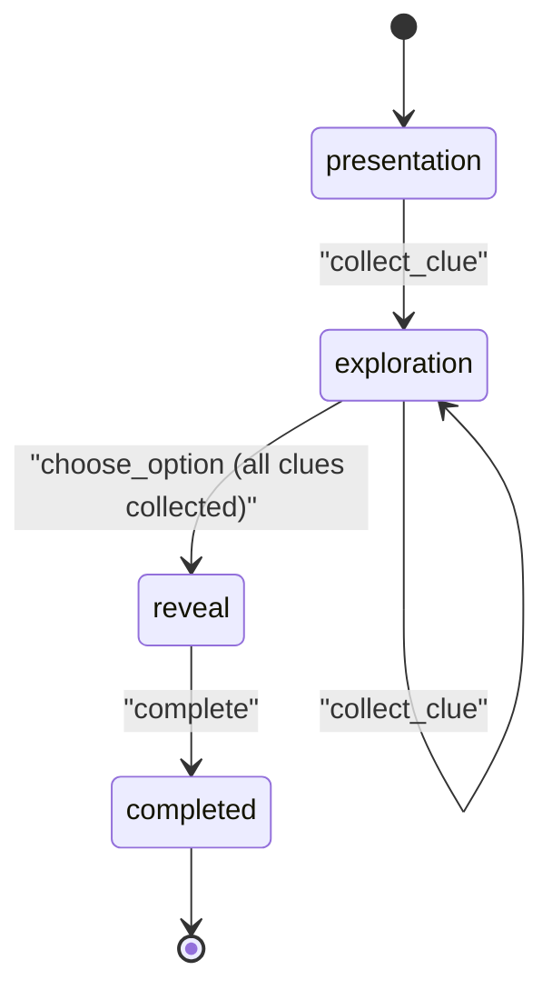

**Diagram sources**
- [game-controller.js:52-116](file://backend/controllers/game-controller.js#L52-L116)
- [game.js:559-641](file://backend/public/js/game.js#L559-L641)

**Section sources**
- [game-controller.js:52-116](file://backend/controllers/game-controller.js#L52-L116)
- [game.js:559-641](file://backend/public/js/game.js#L559-L641)

### Validation Mechanisms
- Per-puzzle validation:
  - Option correctness checks for pick-one/match-pairs.
  - Threshold checks for pick-many (minCorrect).
  - Grid/array comparisons for sudoku/jigsaw.
  - Sequence matching for number-series.
  - Operation sequence matching for brain-ops.
- Global validations:
  - Attempt limits decremented on fail.
  - Time limit enforcement with timeout handling.
  - Required evidence gating for decision phase.

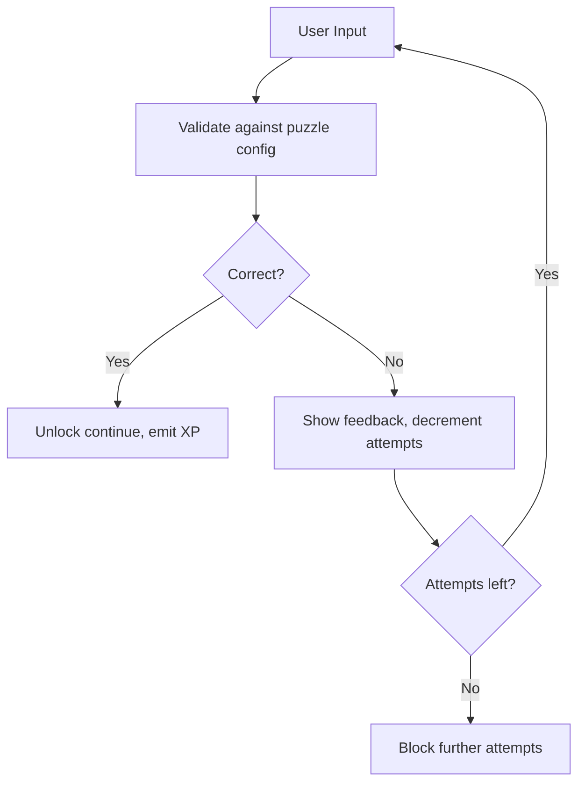

**Diagram sources**
- [puzzles.js:674-771](file://backend/public/js/puzzles.js#L674-L771)
- [puzzle-types.js:22-438](file://backend/public/js/puzzle-types.js#L22-L438)

**Section sources**
- [puzzles.js:674-771](file://backend/public/js/puzzles.js#L674-L771)
- [puzzle-types.js:22-438](file://backend/public/js/puzzle-types.js#L22-L438)

### Evidence Collection System (3D World Integration)
- Objects in 3D scenes map to clues via interactables.
- Player interacts with nearest object; if not already collected, puzzle overlay launches.
- On successful solution, backend records clue collection and reveals associated content.
- World marks clue as collected to prevent re-collection.

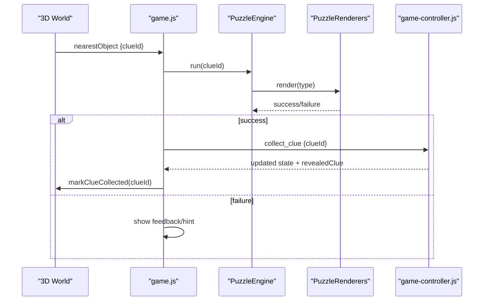

**Diagram sources**
- [game.js:539-557](file://backend/public/js/game.js#L539-L557)
- [puzzles.js:547-647](file://backend/public/js/puzzles.js#L547-L647)
- [puzzle-types.js:22-438](file://backend/public/js/puzzle-types.js#L22-L438)
- [game-controller.js:52-116](file://backend/controllers/game-controller.js#L52-L116)

**Section sources**
- [game.js:539-557](file://backend/public/js/game.js#L539-L557)
- [game-controller.js:52-116](file://backend/controllers/game-controller.js#L52-L116)

### Hint Systems
- In-puzzle hints:
  - Feedback messages include skill tips and contextual guidance.
  - Resources section can display official links and helplines after feedback.
- AI-assisted hints:
  - Chat endpoint integrates AI to provide safe hints and alerts based on context and player metrics.

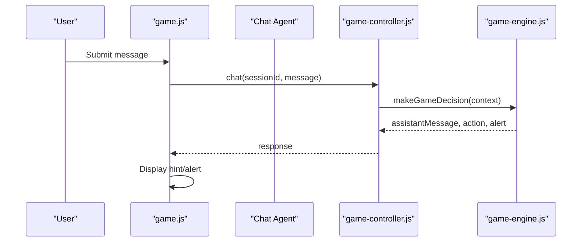

**Diagram sources**
- [game.js:707-728](file://backend/public/js/game.js#L707-L728)
- [game-controller.js:118-120](file://backend/controllers/game-controller.js#L118-L120)
- [game-engine.js:66-123](file://backend/services/game-engine.js#L66-L123)

**Section sources**
- [game.js:707-728](file://backend/public/js/game.js#L707-L728)
- [game-controller.js:118-120](file://backend/controllers/game-controller.js#L118-L120)
- [game-engine.js:66-123](file://backend/services/game-engine.js#L66-L123)

### Scoring Algorithms and Progress Tracking
- Stars and scores:
  - Options carry stars and scores; server clamps values within bounds.
  - Best stars tracked per scenario; attempts incremented on retries.
- Session XP:
  - Base XP from puzzle successes scaled by tier multiplier.
  - Expert tier grants full XP; standard and puzzle_rush get reduced multipliers.
- Summaries:
  - Aggregated totals for missions completed, stars, scores, and win readiness.

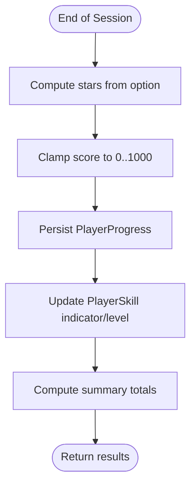

**Diagram sources**
- [progress-controller.js:5-71](file://backend/controllers/progress-controller.js#L5-L71)
- [score-controller.js:4-21](file://backend/controllers/score-controller.js#L4-L21)
- [session-scoring.js:94-144](file://backend/public/js/session-scoring.js#L94-L144)

**Section sources**
- [progress-controller.js:5-71](file://backend/controllers/progress-controller.js#L5-L71)
- [score-controller.js:4-21](file://backend/controllers/score-controller.js#L4-L21)
- [session-scoring.js:94-144](file://backend/public/js/session-scoring.js#L94-L144)

### Puzzle Lifecycle from Creation to Completion
- Start mission:
  - Create session, load scenario content, initialize state.
- Explore:
  - Enter 3D scene, interact with objects to trigger puzzles.
- Solve:
  - Run puzzle overlay, validate answers, manage attempts/timers.
- Collect:
  - Record clue collection, reveal associated content, update world.
- Decide:
  - After collecting all clues, present options for final decision.
- Complete:
  - Finalize session, persist progress, compute rewards, show outcomes.

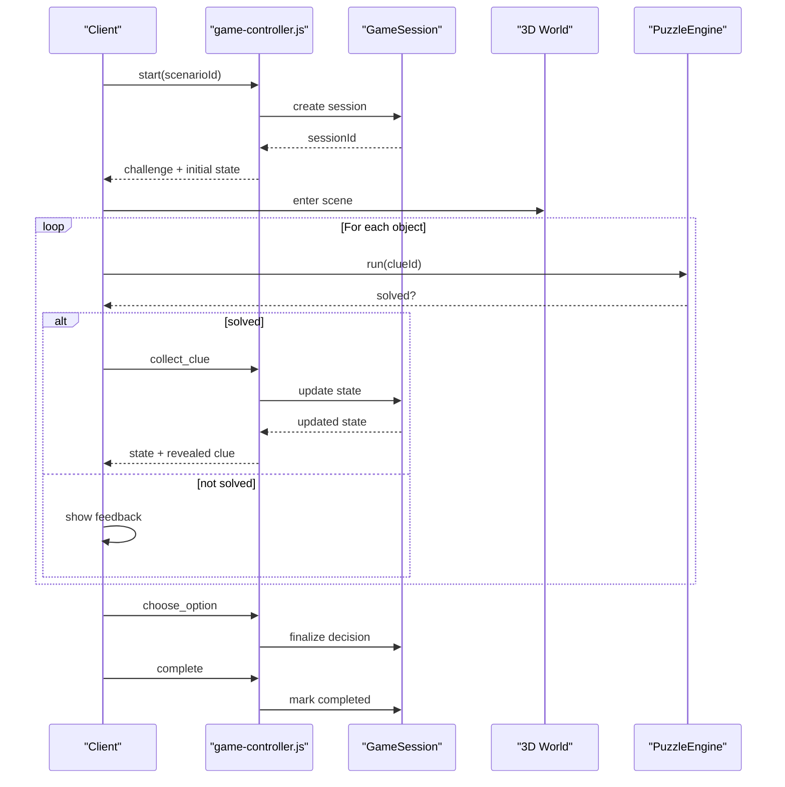

**Diagram sources**
- [game-controller.js:18-128](file://backend/controllers/game-controller.js#L18-L128)
- [game.js:465-641](file://backend/public/js/game.js#L465-L641)
- [puzzles.js:547-647](file://backend/public/js/puzzles.js#L547-L647)

**Section sources**
- [game-controller.js:18-128](file://backend/controllers/game-controller.js#L18-L128)
- [game.js:465-641](file://backend/public/js/game.js#L465-L641)
- [puzzles.js:547-647](file://backend/public/js/puzzles.js#L547-L647)

## Dependency Analysis
- Client dependencies:
  - game.js depends on PuzzleEngine and PuzzleRenderers for puzzle execution and rendering.
  - session-scoring.js influences XP scaling and learning recap generation.
- Server dependencies:
  - game-controller.js depends on models for persistence and game-engine for utilities and AI chat.
  - progress-controller.js updates PlayerProgress and PlayerSkill based on outcomes.
  - score-controller.js aggregates summaries from PlayerProgress and Scenario.

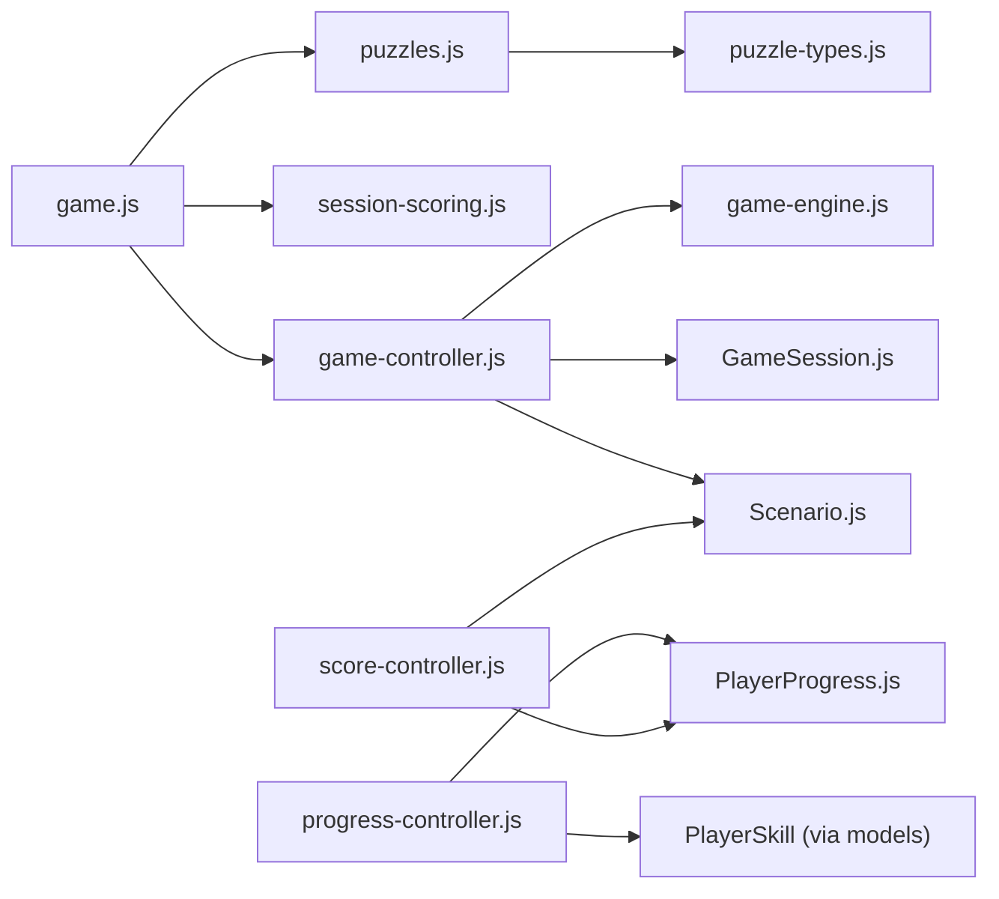

**Diagram sources**
- [game.js:465-641](file://backend/public/js/game.js#L465-L641)
- [puzzles.js:547-647](file://backend/public/js/puzzles.js#L547-L647)
- [puzzle-types.js:22-438](file://backend/public/js/puzzle-types.js#L22-L438)
- [session-scoring.js:94-144](file://backend/public/js/session-scoring.js#L94-L144)
- [game-controller.js:18-128](file://backend/controllers/game-controller.js#L18-L128)
- [game-engine.js:51-123](file://backend/services/game-engine.js#L51-L123)
- [progress-controller.js:5-71](file://backend/controllers/progress-controller.js#L5-L71)
- [score-controller.js:4-21](file://backend/controllers/score-controller.js#L4-L21)
- [GameSession.js:4-12](file://backend/models/GameSession.js#L4-L12)
- [PlayerProgress.js:4-14](file://backend/models/PlayerProgress.js#L4-L14)
- [Scenario.js:4-15](file://backend/models/Scenario.js#L4-L15)

**Section sources**
- [game.js:465-641](file://backend/public/js/game.js#L465-L641)
- [puzzles.js:547-647](file://backend/public/js/puzzles.js#L547-L647)
- [puzzle-types.js:22-438](file://backend/public/js/puzzle-types.js#L22-L438)
- [session-scoring.js:94-144](file://backend/public/js/session-scoring.js#L94-L144)
- [game-controller.js:18-128](file://backend/controllers/game-controller.js#L18-L128)
- [game-engine.js:51-123](file://backend/services/game-engine.js#L51-L123)
- [progress-controller.js:5-71](file://backend/controllers/progress-controller.js#L5-L71)
- [score-controller.js:4-21](file://backend/controllers/score-controller.js#L4-L21)
- [GameSession.js:4-12](file://backend/models/GameSession.js#L4-L12)
- [PlayerProgress.js:4-14](file://backend/models/PlayerProgress.js#L4-L14)
- [Scenario.js:4-15](file://backend/models/Scenario.js#L4-L15)

## Performance Considerations
- Minimize DOM churn in puzzle renderers by reusing elements and disabling controls post-solution.
- Debounce or throttle frequent interactions in 3D world to avoid excessive event handling.
- Use server-side validation to prevent invalid state transitions and reduce client-server round trips.
- Cache scenario content and resources to reduce network overhead during gameplay.
- Scale XP calculations efficiently using tier multipliers and precomputed constants.

[No sources needed since this section provides general guidance]

## Troubleshooting Guide
Common issues and resolutions:
- Clue already collected:
  - Ensure the world marks clues as collected and prevents duplicate interactions.
- Already decided:
  - Prevent collect_clue or choose_option after decision phase; enforce phase checks.
- Invalid clue or option:
  - Validate IDs against scenario content before processing.
- Session not found or expired:
  - Check session existence and expiration timestamps before actions.
- Out of attempts:
  - Provide hints and allow retry until attempts exhausted; then block further attempts.

**Section sources**
- [game-controller.js:52-116](file://backend/controllers/game-controller.js#L52-L116)
- [puzzles.js:547-647](file://backend/public/js/puzzles.js#L547-L647)

## Conclusion
The modular puzzle system combines flexible puzzle types, robust state management, and progressive difficulty scaling to deliver engaging, evidence-based learning experiences. By decoupling presentation from validation and leveraging server-side orchestration, the system ensures consistency, security, and extensibility. Players gather clues from the 3D world, solve varied puzzles, and make informed decisions, while the scoring and progression systems track mastery and reward expert behavior.

[No sources needed since this section summarizes without analyzing specific files]

## Appendices

### Implementing Custom Puzzle Types
Steps:
- Add a new entry to the PuzzleRenderers registry with a function signature:
  - Parameters: body, puzzle, feedback, continueBtn, onSuccess, onFail.
- Implement validation logic against puzzle configuration fields.
- Emit XP events or call RewardFX hooks for success feedback.
- Trigger continueBtn.onclick = onSuccess upon correct solution.
- Integrate with PuzzleEngine routing by ensuring puzzle.type matches the registered key.

Example configuration fields:
- prompt, options, answer, solution, givens, tasks, slots, correct, parts, ops, answers, tiles, labels, size, timeLimitSec, maxAttempts, difficulty, minCorrect.

**Section sources**
- [puzzle-types.js:22-438](file://backend/public/js/puzzle-types.js#L22-L438)
- [puzzles.js:547-647](file://backend/public/js/puzzles.js#L547-L647)

### Extending Existing Puzzles
- Enhance validation:
  - Add tolerance for numeric answers or normalize inputs.
- Improve UX:
  - Add visual cues, animations, or accessibility features.
- Extend hints:
  - Include additional skill tips or resource links in feedback.

**Section sources**
- [puzzle-types.js:22-438](file://backend/public/js/puzzle-types.js#L22-L438)
- [puzzles.js:656-672](file://backend/public/js/puzzles.js#L656-L672)

### Integrating with Progression System
- Link puzzles to scenario clues and options:
  - Ensure puzzle IDs map to scenario content clues.
- Persist outcomes:
  - Submit progress with status, evidence, and session details.
- Update skills:
  - Increment skill indicators and levels based on stars earned.

**Section sources**
- [progress-controller.js:5-71](file://backend/controllers/progress-controller.js#L5-L71)
- [game-controller.js:52-116](file://backend/controllers/game-controller.js#L52-L116)

### Example Puzzle Configuration Objects
- Pick-one:
  - Fields: title, intro, type, skillTip, options (with correct flags).
- Pick-many:
  - Fields: title, intro, type, skillTip, minCorrect, options (with correct flags).
- Match-pairs:
  - Fields: title, intro, type, skillTip, pairs (item, match), choices.
- Extended types:
  - number-series: display, answer, prompt, skillTip.
  - jigsaw-slide: tiles, solution, labels, prompt, skillTip.
  - sudoku-mini: solution, givens, skillTip, maxAttempts, difficulty.
  - schedule-grid: tasks, slots, correct, prompt, skillTip, maxAttempts, difficulty.
  - logical-reasoning: stem, options, skillTip, maxAttempts, difficulty, timeLimitSec.
  - brain-ops: parts, ops, answers, prompt, skillTip, maxAttempts, difficulty, timeLimitSec.

**Section sources**
- [puzzles.js:76-542](file://backend/public/js/puzzles.js#L76-L542)

### Event Handling Patterns
- Custom events:
  - game:xp: Emitted on puzzle success to update XP HUD.
  - world:interact-hint: Emitted when hovering over 3D objects to show interaction prompts.
- Event listeners:
  - Attach handlers in game.js to process events and update UI/state.

**Section sources**
- [game.js:350-373](file://backend/public/js/game.js#L350-L373)
- [puzzle-types.js:22-438](file://backend/public/js/puzzle-types.js#L22-L438)