# Puzzle Type Implementations

<cite>
**Referenced Files in This Document**
- [puzzle-types.js](file://backend/public/js/puzzle-types.js)
- [puzzles.js](file://backend/public/js/puzzles.js)
- [rewards.js](file://backend/public/js/rewards.js)
- [game.js](file://backend/public/js/game.js)
- [session-scoring.js](file://backend/public/js/session-scoring.js)
</cite>

## Table of Contents
1. [Introduction](#introduction)
2. [Project Structure](#project-structure)
3. [Core Components](#core-components)
4. [Architecture Overview](#architecture-overview)
5. [Detailed Component Analysis](#detailed-component-analysis)
6. [Dependency Analysis](#dependency-analysis)
7. [Performance Considerations](#performance-considerations)
8. [Troubleshooting Guide](#troubleshooting-guide)
9. [Conclusion](#conclusion)

## Introduction
This document explains the individual puzzle type implementations used by the SIHProject game. It covers each puzzle renderer function, its configuration schema, user interaction patterns, input validation logic, feedback mechanisms, and how puzzles integrate with the XP system through custom events. The goal is to make it easy for developers to understand, extend, or maintain these puzzles while keeping them accessible to non-technical readers.

## Project Structure
Puzzle rendering and execution are implemented in the frontend JavaScript files under backend/public/js:
- puzzle-types.js: Defines the PuzzleRenderers registry and all puzzle-specific render functions.
- puzzles.js: Contains puzzle definitions (CLUE_PUZZLES), the PuzzleEngine that orchestrates overlays, timers, attempts, and fallback renderers, plus shared helpers like showFeedback and escapeHtml.
- rewards.js: Provides visual XP bursts and confetti via RewardFX and dispatches a global game:xp event.
- game.js: Listens to the game:xp event to update session XP and UI, and coordinates game flow.
- session-scoring.js: Scales base XP values based on player behavior tier and exposes scaleXp for consistent XP application.

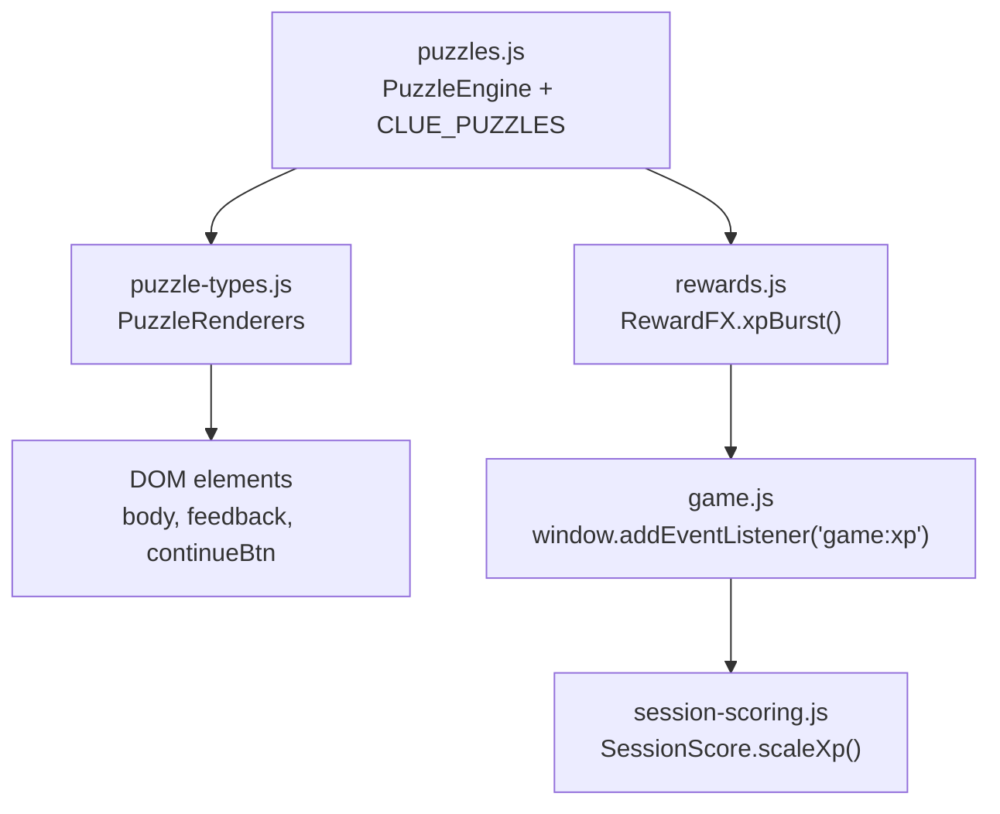

**Diagram sources**
- [puzzles.js:547-648](file://backend/public/js/puzzles.js#L547-L648)
- [puzzle-types.js:22-438](file://backend/public/js/puzzle-types.js#L22-L438)
- [rewards.js:22-29](file://backend/public/js/rewards.js#L22-L29)
- [game.js:350-356](file://backend/public/js/game.js#L350-L356)
- [session-scoring.js:142-144](file://backend/public/js/session-scoring.js#L142-L144)

**Section sources**
- [puzzles.js:547-648](file://backend/public/js/puzzles.js#L547-L648)
- [puzzle-types.js:22-438](file://backend/public/js/puzzle-types.js#L22-L438)
- [rewards.js:22-29](file://backend/public/js/rewards.js#L22-L29)
- [game.js:350-356](file://backend/public/js/game.js#L350-L356)
- [session-scoring.js:142-144](file://backend/public/js/session-scoring.js#L142-L144)

## Core Components
- PuzzleRenderers registry: A map from puzzle type strings to renderer functions. Each renderer receives:
  - body: DOM element where puzzle content is rendered
  - puzzle: Configuration object defining the specific instance
  - feedback: DOM element for showing success/failure messages
  - continueBtn: Button shown after successful completion to proceed
  - onSuccess: Callback invoked when the puzzle is solved correctly
  - onFail: Optional callback invoked on incorrect attempts
- PuzzleEngine: Creates an overlay, manages attempts, optional timer, and delegates rendering to either built-in types (pick-one, pick-many, match-pairs) or custom renderers in PuzzleRenderers.
- Rewards and XP: Renderers may call RewardFX.xpBurst or dispatch window CustomEvent 'game:xp' directly; game.js listens to this event and applies SessionScore.scaleXp to compute final XP.

Common interface parameters:
- body: Container element for puzzle UI
- puzzle: Instance config with fields depending on puzzle type
- feedback: Feedback container element
- continueBtn: Continue button toggled visible on success
- onSuccess: Success callback
- onFail: Failure callback (optional)

**Section sources**
- [puzzle-types.js:22-438](file://backend/public/js/puzzle-types.js#L22-L438)
- [puzzles.js:547-648](file://backend/public/js/puzzles.js#L547-L648)
- [rewards.js:22-29](file://backend/public/js/rewards.js#L22-L29)
- [game.js:350-356](file://backend/public/js/game.js#L350-L356)
- [session-scoring.js:142-144](file://backend/public/js/session-scoring.js#L142-L144)

## Architecture Overview
The runtime flow for a puzzle:
1. PuzzleEngine.run(puzzleId) creates an overlay and resolves a promise on success or failure.
2. Based on puzzle.type, it calls either a built-in renderer or a custom renderer from PuzzleRenderers.
3. The renderer builds UI inside body, wires interactions, validates inputs, and shows feedback via showFeedback.
4. On success, the renderer enables continueBtn, invokes onSuccess, and optionally triggers XP via RewardFX or a direct CustomEvent.
5. game.js listens to 'game:xp', scales XP using SessionScore.scaleXp, updates HUD, and shows a popup.

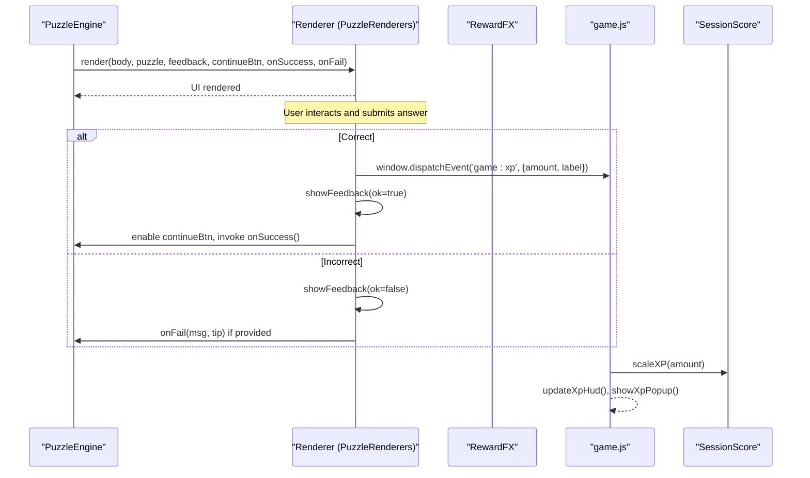

**Diagram sources**
- [puzzles.js:547-648](file://backend/public/js/puzzles.js#L547-L648)
- [puzzle-types.js:22-438](file://backend/public/js/puzzle-types.js#L22-L438)
- [rewards.js:22-29](file://backend/public/js/rewards.js#L22-L29)
- [game.js:350-356](file://backend/public/js/game.js#L350-L356)
- [session-scoring.js:142-144](file://backend/public/js/session-scoring.js#L142-L144)

## Detailed Component Analysis

### Common Renderer Contract
All renderers follow the same signature and responsibilities:
- Parameters: body, puzzle, feedback, continueBtn, onSuccess, onFail
- Responsibilities:
  - Render prompt and interactive elements into body
  - Validate user input against puzzle configuration
  - Show feedback via showFeedback with skillTip and optional resources
  - On success: disable inputs, hide continueBtn initially then reveal it, set continueBtn.onclick = onSuccess, and trigger XP
  - On failure: use onFail if provided, otherwise showFeedback with ok=false

**Section sources**
- [puzzle-types.js:22-438](file://backend/public/js/puzzle-types.js#L22-L438)
- [puzzles.js:656-672](file://backend/public/js/puzzles.js#L656-L672)

---

### number-series
- Purpose: Pattern recognition for SSC-style number series.
- Configuration schema:
  - display: string representing the series to show
  - answer: expected numeric answer as string
  - prompt: instruction text
  - skillTip: educational hint shown in feedback
- Interaction:
  - Single-line input for next number
  - Submit compares trimmed input to answer
- Validation:
  - Exact string match to puzzle.answer
- Feedback:
  - Success: disables input/button, shows positive feedback, reveals continueBtn, triggers XP
  - Failure: shows negative feedback with hint
- XP integration:
  - Dispatches 'game:xp' with amount and label

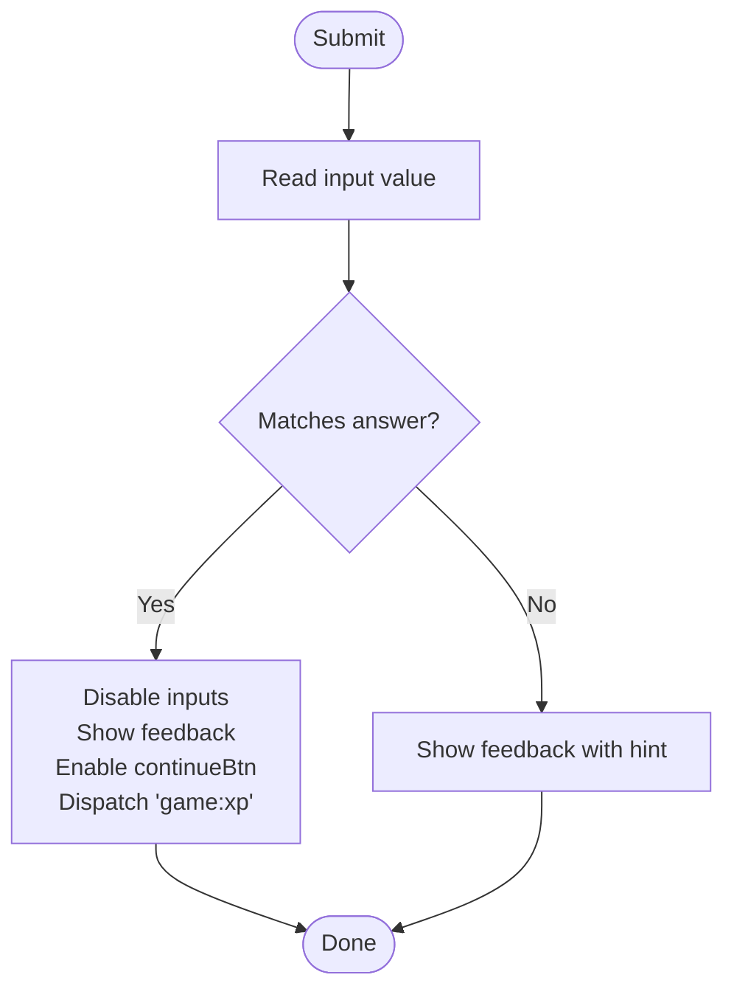

**Diagram sources**
- [puzzle-types.js:22-42](file://backend/public/js/puzzle-types.js#L22-L42)

**Section sources**
- [puzzle-types.js:22-42](file://backend/public/js/puzzle-types.js#L22-L42)
- [puzzles.js:404-411](file://backend/public/js/puzzles.js#L404-L411)

---

### logical-reasoning
- Purpose: Multiple-choice reasoning question with one correct option.
- Configuration schema:
  - stem: scenario or statements
  - options: array of { text, correct }
  - skillTip: educational hint
- Interaction:
  - Buttons per option; clicking disables all buttons
- Validation:
  - Checks opt.correct flag
- Feedback:
  - Success: positive feedback, enable continueBtn, dispatch 'game:xp'
  - Failure: temporary re-enable of buttons after delay, negative feedback
- XP integration:
  - Dispatches 'game:xp' on correct selection

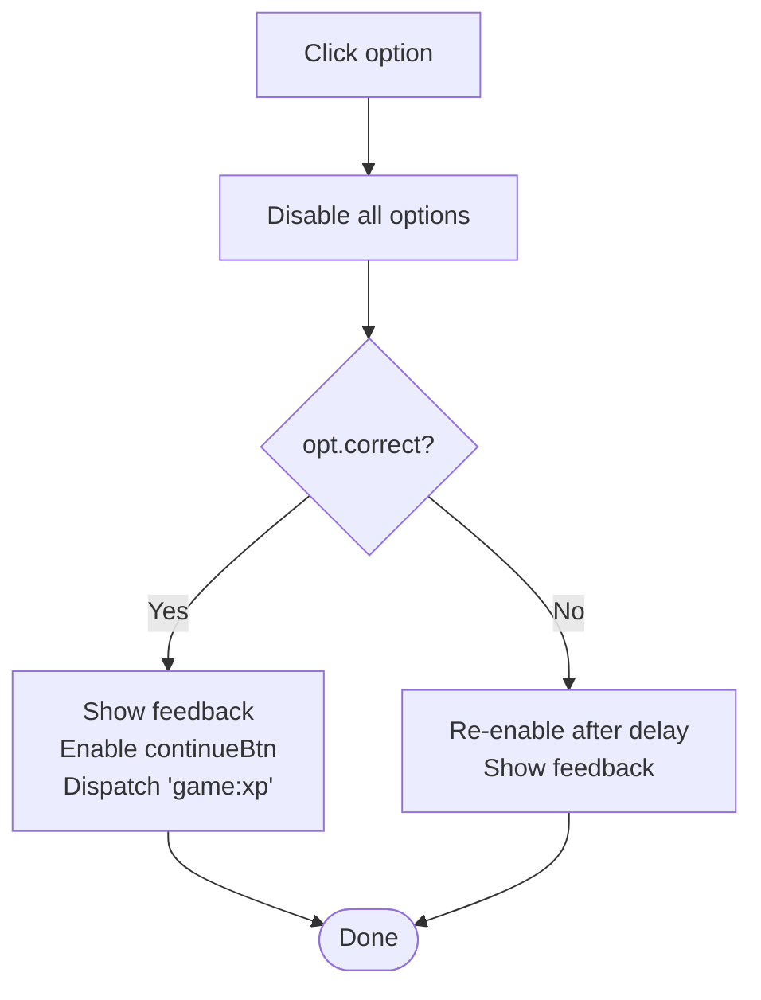

**Diagram sources**
- [puzzle-types.js:44-61](file://backend/public/js/puzzle-types.js#L44-L61)

**Section sources**
- [puzzle-types.js:44-61](file://backend/public/js/puzzle-types.js#L44-L61)
- [puzzles.js:305-323](file://backend/public/js/puzzles.js#L305-L323)
- [puzzles.js:412-422](file://backend/public/js/puzzles.js#L412-L422)
- [puzzles.js:443-453](file://backend/public/js/puzzles.js#L443-L453)
- [puzzles.js:492-502](file://backend/public/js/puzzles.js#L492-L502)
- [puzzles.js:512-522](file://backend/public/js/puzzles.js#L512-L522)

---

### sudoku-mini (4x4)
- Purpose: Mini Sudoku grid with given clues and a known solution.
- Configuration schema:
  - solution: 2D array of size 4x4 with target numbers
  - givens: object mapping "row,col" keys to pre-filled digits
  - skillTip: educational hint
- Interaction:
  - Grid of single-digit inputs; given cells disabled
  - Submit checks non-given cells against solution
- Validation:
  - Compares each editable cell value to solution[r][c]
- Feedback:
  - Success: disables all inputs, shows positive feedback, enables continueBtn, triggers visual XP effects
  - Failure: shows negative feedback with guidance
- XP integration:
  - Uses RewardFX.xpBurst and confetti on success

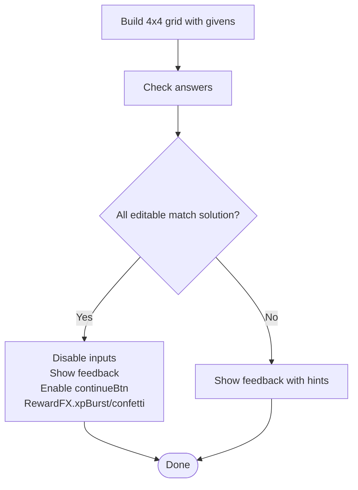

**Diagram sources**
- [puzzle-types.js:63-111](file://backend/public/js/puzzle-types.js#L63-L111)

**Section sources**
- [puzzle-types.js:63-111](file://backend/public/js/puzzle-types.js#L63-L111)
- [puzzles.js:296-304](file://backend/public/js/puzzles.js#L296-L304)

---

### crossword-fill
- Purpose: Fill multiple word answers based on clues.
- Configuration schema:
  - prompt: instruction text
  - clues: array of { hint, answer }
  - skillTip: educational hint
- Interaction:
  - One input per clue
  - Submit normalizes case and compares to stored answers
- Validation:
  - Case-insensitive comparison to clue.answer
- Feedback:
  - Success: disables inputs, positive feedback, enable continueBtn, dispatch 'game:xp'
  - Failure: negative feedback with hint
- XP integration:
  - Dispatches 'game:xp' on success

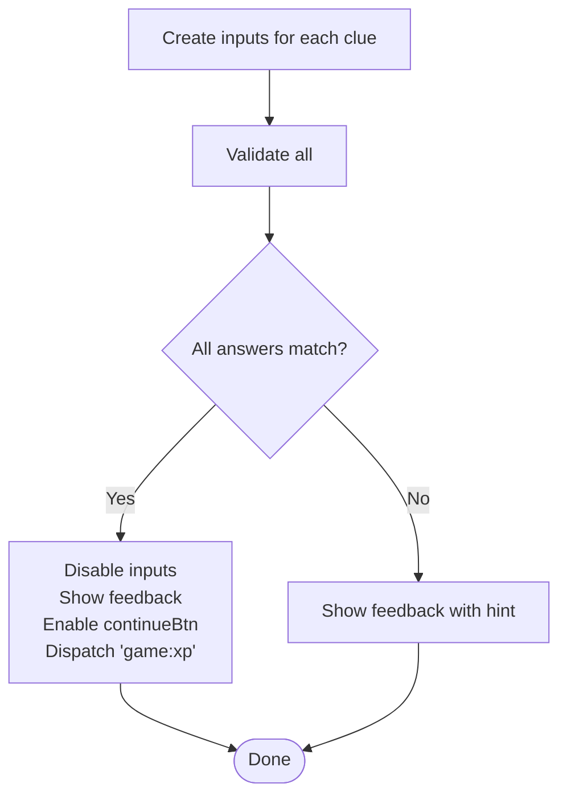

**Diagram sources**
- [puzzle-types.js:113-148](file://backend/public/js/puzzle-types.js#L113-L148)

**Section sources**
- [puzzle-types.js:113-148](file://backend/public/js/puzzle-types.js#L113-L148)
- [puzzles.js:423-433](file://backend/public/js/puzzles.js#L423-L433)
- [puzzles.js:473-483](file://backend/public/js/puzzles.js#L473-L483)

---

### jigsaw-slide (3x3 sliding tiles)
- Purpose: Slide puzzle to restore a message using a 3x3 grid with one empty tile.
- Configuration schema:
  - prompt: instruction text
  - tiles: initial permutation including 0 for empty
  - solution: target permutation
  - labels: mapping of tile values to characters
  - skillTip: educational hint
- Interaction:
  - Click adjacent tiles to move into empty space
  - Board re-renders on each move
- Validation:
  - After each move, checks if current tiles equal solution
- Feedback:
  - Success: disables tiles, positive feedback, enable continueBtn, dispatch 'game:xp'
  - Failure: none (only success path here)
- XP integration:
  - Dispatches 'game:xp' on success

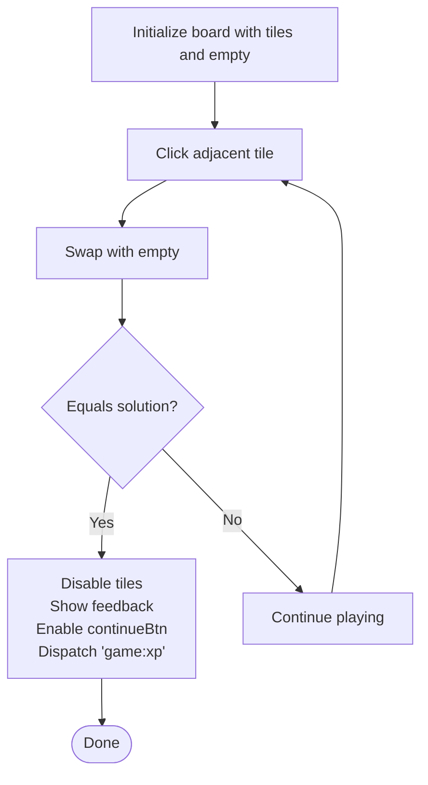

**Diagram sources**
- [puzzle-types.js:150-187](file://backend/public/js/puzzle-types.js#L150-L187)

**Section sources**
- [puzzle-types.js:150-187](file://backend/public/js/puzzle-types.js#L150-L187)
- [puzzles.js:434-442](file://backend/public/js/puzzles.js#L434-L442)
- [puzzles.js:503-511](file://backend/public/js/puzzles.js#L503-L511)

---

### schedule-grid (drag-and-drop time slots)
- Purpose: Drag tasks into time slots to build an optimal schedule avoiding trap zones.
- Configuration schema:
  - prompt: instruction text
  - tasks: array of { id, label }
  - slots: array of { id, time, label }
  - correct: mapping slot.id -> task.id for the ideal schedule
  - skillTip: educational hint
- Interaction:
  - Draggable task chips from pool to slot drop zones
  - Drop updates assignment and removes chip from pool
  - Submit locks schedule and validates assignments
- Validation:
  - Ensures every required slot has exactly the correct task assigned
- Feedback:
  - Success: positive feedback, enable continueBtn, dispatch 'game:xp'
  - Failure: negative feedback with priority guidance
- XP integration:
  - Dispatches 'game:xp' on success

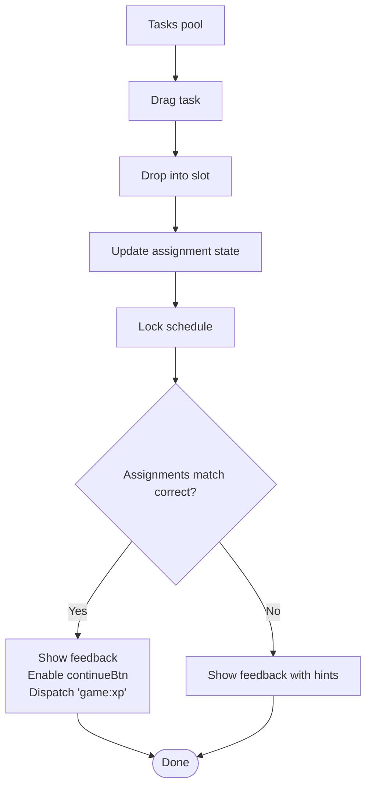

**Diagram sources**
- [puzzle-types.js:189-251](file://backend/public/js/puzzle-types.js#L189-L251)

**Section sources**
- [puzzle-types.js:189-251](file://backend/public/js/puzzle-types.js#L189-L251)
- [puzzles.js:275-295](file://backend/public/js/puzzles.js#L275-L295)
- [puzzles.js:454-472](file://backend/public/js/puzzles.js#L454-L472)
- [puzzles.js:523-541](file://backend/public/js/puzzles.js#L523-L541)

---

### math-marathon
- Purpose: Solve multiple math problems within a challenge; requires meeting a threshold of correct answers.
- Configuration schema:
  - prompt: instruction text
  - problems: array of { q, a, accept? }
  - required: minimum number of correct answers needed (defaults to problems.length)
  - skillTip: educational hint
- Interaction:
  - One input per problem
  - Submit evaluates each answer against accepted values
- Validation:
  - Accepts any value in prob.accept or matches String(prob.a)
  - Counts correct answers and compares to required
- Feedback:
  - Success: disables inputs, positive feedback, enable continueBtn, triggers visual XP effects
  - Failure: highlights wrong inputs and provides attempt-based feedback
- XP integration:
  - Uses RewardFX.xpBurst and confetti on success

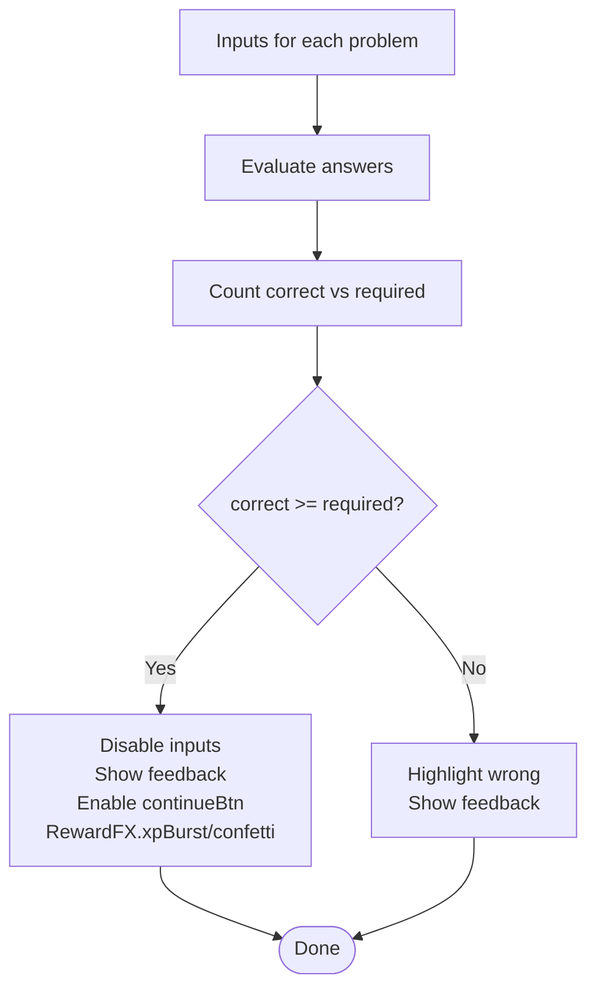

**Diagram sources**
- [puzzle-types.js:253-290](file://backend/public/js/puzzle-types.js#L253-L290)

**Section sources**
- [puzzle-types.js:253-290](file://backend/public/js/puzzle-types.js#L253-L290)
- [puzzles.js:228-244](file://backend/public/js/puzzles.js#L228-L244)

---

### sudoku-6 (6x6 Sudoku)
- Purpose: Larger Sudoku variant with 2x3 boxes.
- Configuration schema:
  - solution: 2D array of size 6x6
  - givens: optional mapping "row,col" to pre-filled digits
  - skillTip: educational hint
- Interaction:
  - Grid of single-digit inputs; given cells disabled
  - Submit checks editable cells against solution
- Validation:
  - Compares each editable cell value to solution[r][c]
- Feedback:
  - Success: disables inputs, positive feedback, enable continueBtn, visual XP effects
  - Failure: negative feedback with box/row/column hints
- XP integration:
  - Uses RewardFX.xpBurst and confetti on success

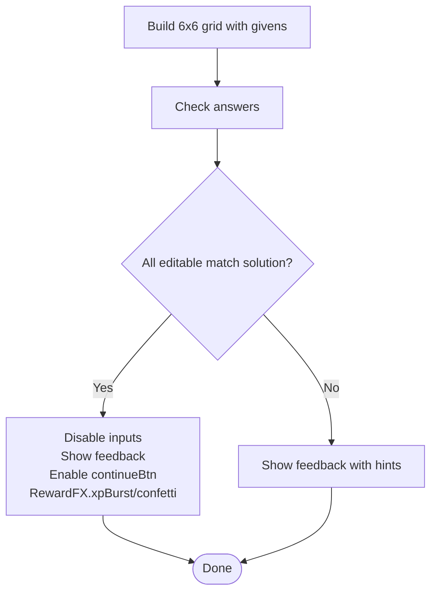

**Diagram sources**
- [puzzle-types.js:292-337](file://backend/public/js/puzzle-types.js#L292-L337)

**Section sources**
- [puzzle-types.js:292-337](file://backend/public/js/puzzle-types.js#L292-L337)
- [puzzles.js:245-257](file://backend/public/js/puzzles.js#L245-L257)

---

### jigsaw-4x4 (4x4 sliding tiles)
- Purpose: 4x4 sliding tile puzzle that shuffles the board and verifies restoration.
- Configuration schema:
  - size: grid dimension (default 4)
  - prompt: instruction text
  - solution: target permutation including 0 for empty
  - labels: mapping of tile values to characters
  - skillTip: educational hint
- Interaction:
  - Shuffles board by random valid moves
  - Click adjacent tiles to move into empty space
  - Board re-renders on each move
- Validation:
  - After each move, checks if current tiles equal solution
- Feedback:
  - Success: disables tiles, positive feedback, enable continueBtn, visual XP effects
  - Failure: none (only success path here)
- XP integration:
  - Uses RewardFX.xpBurst and confetti on success

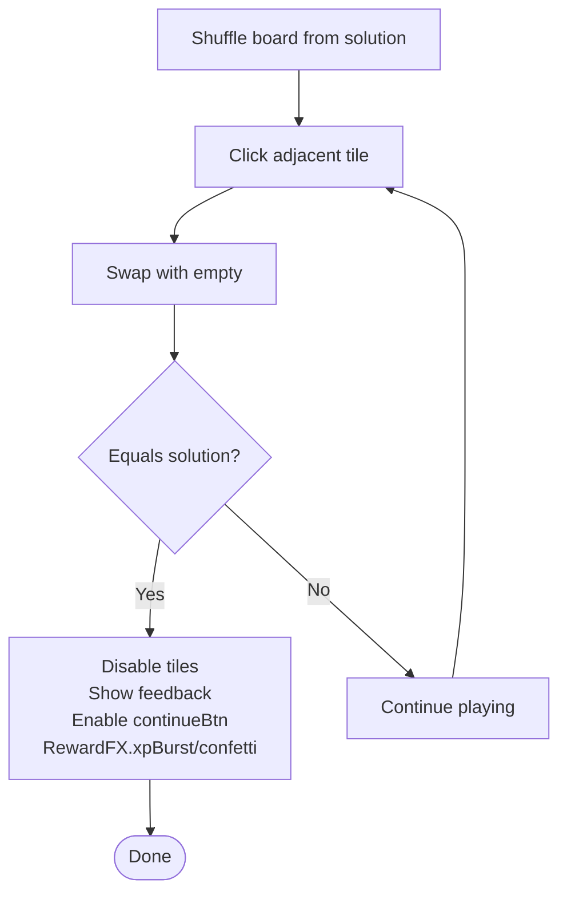

**Diagram sources**
- [puzzle-types.js:339-391](file://backend/public/js/puzzle-types.js#L339-L391)

**Section sources**
- [puzzle-types.js:339-391](file://backend/public/js/puzzle-types.js#L339-L391)
- [puzzles.js:258-273](file://backend/public/js/puzzles.js#L258-L273)

---

### brain-ops (operation puzzle)
- Purpose: Fill missing operations between numbers to make equations true.
- Configuration schema:
  - prompt: instruction text
  - parts: sequence of tokens where '?' indicates a select dropdown for operation
  - ops: allowed operations list (e.g., '+', '−', '×', '÷')
  - answers: expected sequence of operations
  - skillTip: educational hint
  - resources: optional list of official help links/phones
- Interaction:
  - Renders spans for numbers and selects for '?' positions
  - Submit compares selected operations to expected answers
- Validation:
  - JSON-stringified comparison of chosen operations to puzzle.answers
- Feedback:
  - Success: disables selects, positive feedback, enable continueBtn, visual XP effects
  - Failure: negative feedback with hint
- XP integration:
  - Uses RewardFX.xpBurst on success

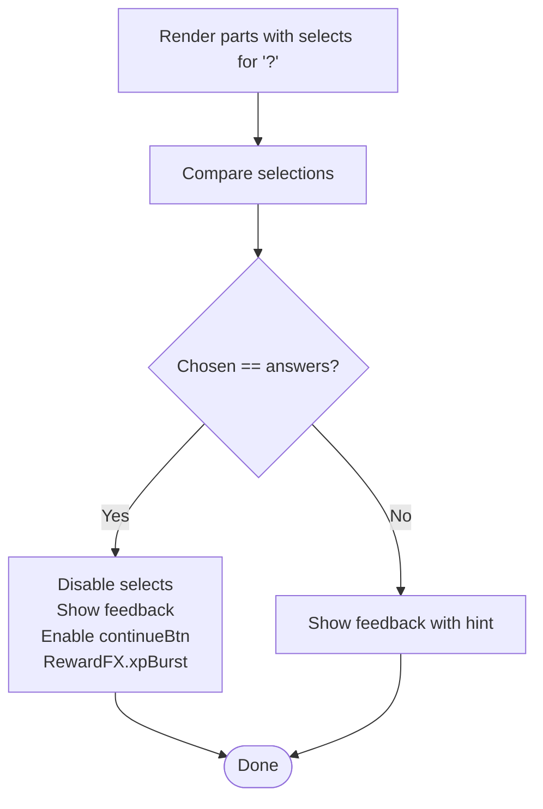

**Diagram sources**
- [puzzle-types.js:393-437](file://backend/public/js/puzzle-types.js#L393-L437)

**Section sources**
- [puzzle-types.js:393-437](file://backend/public/js/puzzle-types.js#L393-L437)
- [puzzles.js:324-403](file://backend/public/js/puzzles.js#L324-L403)

---

### Built-in puzzle types (for context)
- pick-one: Single-choice selection with immediate feedback and optional XP burst.
- pick-many: Multi-select with minCorrect requirement and validation.
- match-pairs: Dropdown matching pairs with correctness check.

These are handled by PuzzleEngine before delegating to PuzzleRenderers.

**Section sources**
- [puzzles.js:674-771](file://backend/public/js/puzzles.js#L674-L771)

## Dependency Analysis
- PuzzleEngine depends on:
  - CLUE_PUZZLES for definitions
  - PuzzleRenderers for custom renderers
  - showFeedback and escapeHtml helpers
  - RewardFX for visual XP effects
  - window.CustomEvent 'game:xp' for XP delivery
- game.js depends on:
  - SessionScore.scaleXp to apply multipliers
  - updateXpHud and showXpPopup for UI updates
- session-scoring.js defines scaling logic based on player behavior tiers.

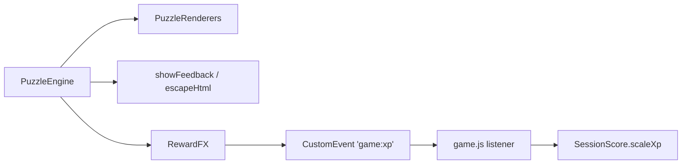

**Diagram sources**
- [puzzles.js:547-648](file://backend/public/js/puzzles.js#L547-L648)
- [rewards.js:22-29](file://backend/public/js/rewards.js#L22-L29)
- [game.js:350-356](file://backend/public/js/game.js#L350-L356)
- [session-scoring.js:142-144](file://backend/public/js/session-scoring.js#L142-L144)

**Section sources**
- [puzzles.js:547-648](file://backend/public/js/puzzles.js#L547-L648)
- [rewards.js:22-29](file://backend/public/js/rewards.js#L22-L29)
- [game.js:350-356](file://backend/public/js/game.js#L350-L356)
- [session-scoring.js:142-144](file://backend/public/js/session-scoring.js#L142-L144)

## Performance Considerations
- Avoid heavy DOM manipulation inside tight loops; render grids once and update minimally on interactions.
- For large grids (like 6x6 Sudoku), consider lazy creation of inputs only for editable cells to reduce overhead.
- Debounce frequent re-renders in sliding puzzles if adding animations later.
- Use efficient comparisons (e.g., Array.every) for solution checks as implemented.
- Keep feedback messages concise to avoid layout thrashing.

[No sources needed since this section provides general guidance]

## Troubleshooting Guide
- Feedback not appearing:
  - Ensure showFeedback is called with a valid feedback element and proper ok flag.
  - Verify that puzzle.skillTip is defined if you expect hints.
- Continue button not enabling:
  - Confirm that onSuccess is attached to continueBtn.onclick and that continueBtn.classList.remove('hidden') is executed.
- XP not updating:
  - Ensure game.js listener for 'game:xp' is active and SessionScore is initialized.
  - Check that RewardFX.xpBurst or window.dispatchEvent('game:xp') is called on success paths.
- Input validation issues:
  - For number-series and math-marathon, ensure trimming and case normalization are applied consistently.
  - For crosswords, confirm answers are normalized to lowercase before comparison.
- Attempt limits and timers:
  - PuzzleEngine enforces maxAttempts and optional timeLimitSec; verify puzzle configs include these fields when needed.

**Section sources**
- [puzzles.js:581-631](file://backend/public/js/puzzles.js#L581-L631)
- [puzzles.js:656-672](file://backend/public/js/puzzles.js#L656-L672)
- [game.js:350-356](file://backend/public/js/game.js#L350-L356)

## Conclusion
The SIHProject puzzle system uses a clear, extensible architecture:
- PuzzleRenderers provide a uniform interface for diverse puzzle types.
- PuzzleEngine centralizes lifecycle management, attempts, timers, and delegation to renderers.
- XP integration is decoupled via a global event, allowing flexible scoring and scaling through SessionScore.
- Each puzzle type includes robust input validation, contextual feedback, and educational tips aligned with real-world safety skills.

Developers can add new puzzle types by registering a renderer in PuzzleRenderers and providing a corresponding configuration in CLUE_PUZZLES, following the established patterns for validation, feedback, and XP handling.